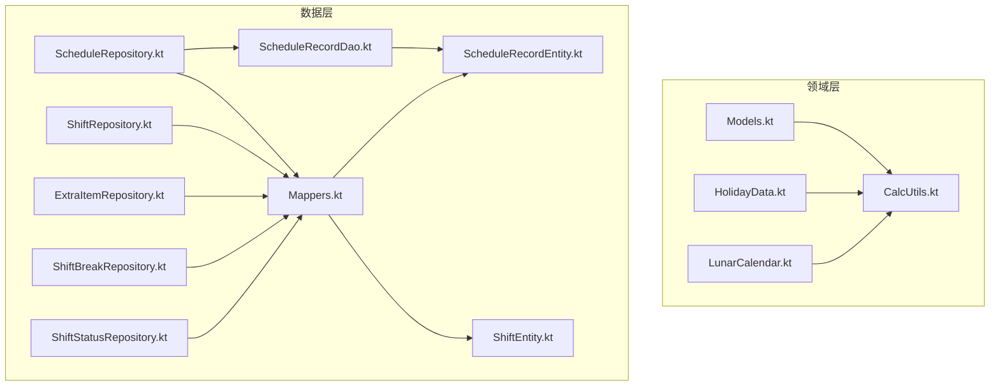
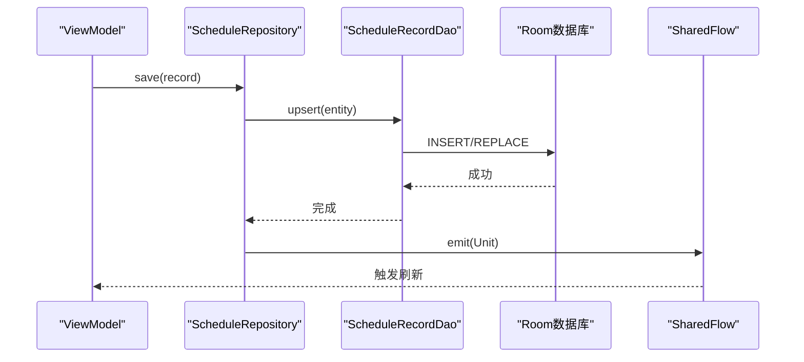
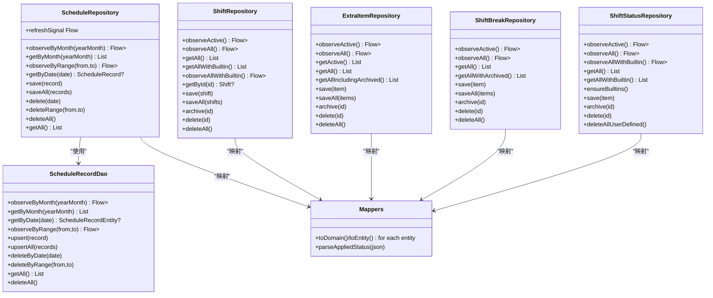

# API参考

<cite>
**本文引用的文件**   
- [CalcUtils.kt](file://app/src/main/java/com/schedulecalendar/app/domain/model/CalcUtils.kt)
- [Models.kt](file://app/src/main/java/com/schedulecalendar/app/domain/model/Models.kt)
- [HolidayData.kt](file://app/src/main/java/com/schedulecalendar/app/domain/model/HolidayData.kt)
- [LunarCalendar.kt](file://app/src/main/java/com/schedulecalendar/app/domain/model/LunarCalendar.kt)
- [Mappers.kt](file://app/src/main/java/com/schedulecalendar/app/data/repository/Mappers.kt)
- [ScheduleRecordEntity.kt](file://app/src/main/java/com/schedulecalendar/app/data/db/entity/ScheduleRecordEntity.kt)
- [ShiftEntity.kt](file://app/src/main/java/com/schedulecalendar/app/data/db/entity/ShiftEntity.kt)
- [ScheduleRepository.kt](file://app/src/main/java/com/schedulecalendar/app/data/repository/ScheduleRepository.kt)
- [ShiftRepository.kt](file://app/src/main/java/com/schedulecalendar/app/data/repository/ShiftRepository.kt)
- [ExtraItemRepository.kt](file://app/src/main/java/com/schedulecalendar/app/data/repository/ExtraItemRepository.kt)
- [ShiftBreakRepository.kt](file://app/src/main/java/com/schedulecalendar/app/data/repository/ShiftBreakRepository.kt)
- [ShiftStatusRepository.kt](file://app/src/main/java/com/schedulecalendar/app/data/repository/ShiftStatusRepository.kt)
- [ScheduleRecordDao.kt](file://app/src/main/java/com/schedulecalendar/app/data/db/dao/ScheduleRecordDao.kt)
</cite>

## 目录
1. [简介](#简介)
2. [项目结构](#项目结构)
3. [核心组件](#核心组件)
4. [架构总览](#架构总览)
5. [详细组件分析](#详细组件分析)
6. [依赖关系分析](#依赖关系分析)
7. [性能考量](#性能考量)
8. [故障排查指南](#故障排查指南)
9. [结论](#结论)
10. [附录：接口调用示例与最佳实践](#附录接口调用示例与最佳实践)

## 简介
本API参考面向Android排班日历应用，聚焦以下目标：
- 完整记录数据层Repository接口的公共方法、参数说明、返回值类型与使用要点
- 说明Domain层工具函数库（尤其是CalcUtils）的计算规则与用法
- 解释数据映射器（Mappers）的转换规则与兼容性处理
- 统一错误处理模式与异常类型
- 提供异步编程规范（Coroutines与Flow）的最佳实践
- 版本兼容性与向后兼容性说明

## 项目结构
本项目采用分层架构：
- Domain层：领域模型与计算工具（如CalcUtils、Models、HolidayData、LunarCalendar）
- Data层：Repository封装DAO与实体映射（Mappers），通过Room进行持久化
- UI层：ViewModel与界面组件（不在本文范围）

图表来源
- [ScheduleRepository.kt:1-40](file://app/src/main/java/com/schedulecalendar/app/data/repository/ScheduleRepository.kt#L1-L40)
- [ShiftRepository.kt:1-45](file://app/src/main/java/com/schedulecalendar/app/data/repository/ShiftRepository.kt#L1-L45)
- [ExtraItemRepository.kt:1-31](file://app/src/main/java/com/schedulecalendar/app/data/repository/ExtraItemRepository.kt#L1-L31)
- [ShiftBreakRepository.kt:1-27](file://app/src/main/java/com/schedulecalendar/app/data/repository/ShiftBreakRepository.kt#L1-L27)
- [ShiftStatusRepository.kt:1-54](file://app/src/main/java/com/schedulecalendar/app/data/repository/ShiftStatusRepository.kt#L1-L54)
- [Mappers.kt:1-134](file://app/src/main/java/com/schedulecalendar/app/data/repository/Mappers.kt#L1-L134)
- [ScheduleRecordDao.kt:1-40](file://app/src/main/java/com/schedulecalendar/app/data/db/dao/ScheduleRecordDao.kt#L1-L40)
- [ScheduleRecordEntity.kt:1-26](file://app/src/main/java/com/schedulecalendar/app/data/db/entity/ScheduleRecordEntity.kt#L1-L26)
- [ShiftEntity.kt:1-24](file://app/src/main/java/com/schedulecalendar/app/data/db/entity/ShiftEntity.kt#L1-L24)

章节来源
- [ScheduleRepository.kt:1-40](file://app/src/main/java/com/schedulecalendar/app/data/repository/ScheduleRepository.kt#L1-L40)
- [ShiftRepository.kt:1-45](file://app/src/main/java/com/schedulecalendar/app/data/repository/ShiftRepository.kt#L1-L45)
- [ExtraItemRepository.kt:1-31](file://app/src/main/java/com/schedulecalendar/app/data/repository/ExtraItemRepository.kt#L1-L31)
- [ShiftBreakRepository.kt:1-27](file://app/src/main/java/com/schedulecalendar/app/data/repository/ShiftBreakRepository.kt#L1-L27)
- [ShiftStatusRepository.kt:1-54](file://app/src/main/java/com/schedulecalendar/app/data/repository/ShiftStatusRepository.kt#L1-L54)
- [Mappers.kt:1-134](file://app/src/main/java/com/schedulecalendar/app/data/repository/Mappers.kt#L1-L134)
- [ScheduleRecordDao.kt:1-40](file://app/src/main/java/com/schedulecalendar/app/data/db/dao/ScheduleRecordDao.kt#L1-L40)
- [ScheduleRecordEntity.kt:1-26](file://app/src/main/java/com/schedulecalendar/app/data/db/entity/ScheduleRecordEntity.kt#L1-L26)
- [ShiftEntity.kt:1-24](file://app/src/main/java/com/schedulecalendar/app/data/db/entity/ShiftEntity.kt#L1-L24)

## 核心组件
- Repository接口族：ScheduleRepository、ShiftRepository、ExtraItemRepository、ShiftBreakRepository、ShiftStatusRepository
- 领域模型与工具：Models（数据类与枚举）、CalcUtils（工时薪资计算）、HolidayData（节假日/节气）、LunarCalendar（农历/黄历）
- 数据映射器：Mappers（Entity↔Domain双向转换）
- DAO与实体：ScheduleRecordDao及对应Entity定义

章节来源
- [Models.kt:1-278](file://app/src/main/java/com/schedulecalendar/app/domain/model/Models.kt#L1-L278)
- [CalcUtils.kt:1-557](file://app/src/main/java/com/schedulecalendar/app/domain/model/CalcUtils.kt#L1-L557)
- [HolidayData.kt:1-636](file://app/src/main/java/com/schedulecalendar/app/domain/model/HolidayData.kt#L1-L636)
- [LunarCalendar.kt:1-418](file://app/src/main/java/com/schedulecalendar/app/domain/model/LunarCalendar.kt#L1-L418)
- [Mappers.kt:1-134](file://app/src/main/java/com/schedulecalendar/app/data/repository/Mappers.kt#L1-L134)

## 架构总览
Repository作为数据访问门面，屏蔽DAO细节并负责Domain模型与Entity之间的映射。所有写操作后通过SharedFlow发出刷新信号，供上层订阅更新。

图表来源
- [ScheduleRepository.kt:1-40](file://app/src/main/java/com/schedulecalendar/app/data/repository/ScheduleRepository.kt#L1-L40)
- [ScheduleRecordDao.kt:1-40](file://app/src/main/java/com/schedulecalendar/app/data/db/dao/ScheduleRecordDao.kt#L1-L40)

## 详细组件分析

### ScheduleRepository（排班记录仓库）
- 职责：暴露排班记录的CRUD与按时间范围查询；维护数据变更信号
- 关键方法
  - observeByMonth(yearMonth): Flow<List<ScheduleRecord>>
  - getByMonth(yearMonth): List<ScheduleRecord>
  - observeByRange(from, to): Flow<List<ScheduleRecord>>
  - getByDate(date): ScheduleRecord?
  - save(record), saveAll(records), delete(date), deleteRange(from,to), deleteAll()
  - getAll(): List<ScheduleRecord>
  - refreshSignal: Flow<Unit>（写操作后发出）
- 参数与返回
  - yearMonth: "yyyy-MM"
  - from/to: "yyyy-MM-dd"
  - date: "yyyy-MM-dd"
  - record: ScheduleRecord（Domain模型）
- 使用要点
  - 读操作优先使用Flow观察，避免手动轮询
  - 写操作后自动通知刷新，无需手动刷新UI

章节来源
- [ScheduleRepository.kt:1-40](file://app/src/main/java/com/schedulecalendar/app/data/repository/ScheduleRepository.kt#L1-L40)
- [ScheduleRecordDao.kt:1-40](file://app/src/main/java/com/schedulecalendar/app/data/db/dao/ScheduleRecordDao.kt#L1-L40)
- [Mappers.kt:92-128](file://app/src/main/java/com/schedulecalendar/app/data/repository/Mappers.kt#L92-L128)

### ShiftRepository（班次仓库）
- 职责：管理用户自定义班次与内置班次（休息/调休/请假）
- 关键方法
  - observeActive(): Flow<List<Shift>>
  - observeAll(): Flow<List<Shift>>（含归档）
  - getAll(), getAllWithBuiltin(), observeAllWithBuiltin()
  - getById(id): Shift?
  - save(shift), saveAll(shifts), archive(id), delete(id), deleteAll()
- 参数与返回
  - id: String
  - shift: Shift（Domain模型）
- 使用要点
  - 选择排班时优先使用getAllWithBuiltin或observeAllWithBuiltin
  - 内置班次不可修改，save会忽略builtIn=true的记录

章节来源
- [ShiftRepository.kt:1-45](file://app/src/main/java/com/schedulecalendar/app/data/repository/ShiftRepository.kt#L1-L45)
- [Mappers.kt:19-48](file://app/src/main/java/com/schedulecalendar/app/data/repository/Mappers.kt#L19-L48)

### ExtraItemRepository（附加补贴/扣款仓库）
- 职责：管理额外项（allowance/deduction），支持归档
- 关键方法
  - observeActive(), observeAll()
  - getActive(), getAll(), getAllIncludingArchived()
  - save(item), saveAll(items), archive(id), delete(id), deleteAll()
- 使用要点
  - 薪资计算需要历史金额，应使用getAllIncludingArchived

章节来源
- [ExtraItemRepository.kt:1-31](file://app/src/main/java/com/schedulecalendar/app/data/repository/ExtraItemRepository.kt#L1-L31)
- [Mappers.kt:132-134](file://app/src/main/java/com/schedulecalendar/app/data/repository/Mappers.kt#L132-L134)

### ShiftBreakRepository（全局休息段仓库）
- 职责：管理全局不计入工时的休息段（如午休）
- 关键方法
  - observeActive(), observeAll()
  - getAll(), getAllWithArchived()
  - save(item), saveAll(items), archive(id), delete(id), deleteAll()

章节来源
- [ShiftBreakRepository.kt:1-27](file://app/src/main/java/com/schedulecalendar/app/data/repository/ShiftBreakRepository.kt#L1-L27)
- [Mappers.kt:52-53](file://app/src/main/java/com/schedulecalendar/app/data/repository/Mappers.kt#L52-L53)

### ShiftStatusRepository（班次状态仓库）
- 职责：管理请假/调休等状态，保证内置状态存在
- 关键方法
  - observeActive(), observeAll(), observeAllWithBuiltin()
  - getAll(), getAllWithBuiltin()
  - ensureBuiltins()
  - save(item), archive(id), delete(id), deleteAllUserDefined()
- 使用要点
  - 首次启动应调用ensureBuiltins以初始化内置状态

章节来源
- [ShiftStatusRepository.kt:1-54](file://app/src/main/java/com/schedulecalendar/app/data/repository/ShiftStatusRepository.kt#L1-L54)
- [Mappers.kt:57-58](file://app/src/main/java/com/schedulecalendar/app/data/repository/Mappers.kt#L57-L58)

### Mappers（数据映射器）
- 职责：在Entity与Domain之间进行双向转换，处理JSON字段与旧格式兼容
- 关键转换
  - ShiftEntity ↔ Shift（解析linkedExtraIdsJson为List<String>）
  - ShiftBreakEntity ↔ ShiftBreak
  - ShiftStatusEntity ↔ ShiftStatus
  - AppliedStatus JSON解析（兼容旧版数组格式与新对象格式）
  - ScheduleRecordEntity ↔ ScheduleRecord（解析extraItemIdsJson与appliedStatusesJson）
  - ExtraItemEntity ↔ ExtraItem
- 兼容性
  - parseAppliedStatus(json)支持旧数组[{...}]与新对象{...}两种格式
  - SalaryMode与ScheduleType解析失败时回退默认值

章节来源
- [Mappers.kt:1-134](file://app/src/main/java/com/schedulecalendar/app/data/repository/Mappers.kt#L1-L134)
- [ScheduleRecordEntity.kt:1-26](file://app/src/main/java/com/schedulecalendar/app/data/db/entity/ScheduleRecordEntity.kt#L1-L26)
- [ShiftEntity.kt:1-24](file://app/src/main/java/com/schedulecalendar/app/data/db/entity/ShiftEntity.kt#L1-L24)

### CalcUtils（工时与薪资计算工具）
- 职责：实现考勤粒度处理、跨天时段归一化、工作日/周末/节假日分类、月统计与薪资汇总
- 关键方法
  - timeToMin(t), minutesToTime(m), normRange(s,e), calcHourDiff(start,end)
  - daysInMonth(year,month)
  - applyAttendGrain(actualStart, actualEnd, shiftStart, shiftEnd, ignoreEarlyArrival, ignoreLateLeave, cfg)
  - calcGlobalBreakHours(shiftStart, shiftEnd, breaks)
  - calcDayHours(record, dateStr, shifts, breaks, attendConfig) → DayHours
  - calcMonthHours(year, month, schedules, shifts, breaks, shiftStatuses, attendConfig, dateFilter?) → HoursSummary
  - calcMonthSalary(year, month, schedules, shifts, breaks, extraItems, salaryConfig, attendConfig, dateFilter?) → SalarySummary
  - getMonthScheduleDetails(year, month, schedules, shifts, breaks, extraItems, salaryConfig, attendConfig) → List<DayScheduleDetail>
  - autoSalaryMode(dateStr), isWeekend(year, month, day)
  - roundD2(v), fmtHours(h)
- 参数说明
  - attendConfig: AttendConfig（加班粒度、容忍时长、标准工时、扣款费率等）
  - salaryConfig: SalaryConfig（底薪、绩效、各时段时薪、社保公积金等）
  - shifts/breaks/extraItems/shiftStatuses: 相关领域模型集合
  - dateFilter: 可选过滤函数，用于限定日期范围
- 返回值
  - DayHours: {normal, overtime, weekend, holiday}
  - HoursSummary: 正常/加班/周末/节假日工时、请假天数与剩余小时、调休/休息天数、迟到早退次数、状态工时等
  - SalarySummary: 各项薪资构成与实发工资
  - DayScheduleDetail: 每日明细（工时、薪资、关联额外项）
- 使用要点
  - 计算前确保shifts/breaks/extraItems/shiftStatuses已加载
  - 若record.salaryMode为空，将按autoSalaryMode推断
  - 跨天时段请使用normRange归一化后再计算

章节来源
- [CalcUtils.kt:1-557](file://app/src/main/java/com/schedulecalendar/app/domain/model/CalcUtils.kt#L1-L557)
- [Models.kt:124-142](file://app/src/main/java/com/schedulecalendar/app/domain/model/Models.kt#L124-L142)
- [Models.kt:225-270](file://app/src/main/java/com/schedulecalendar/app/domain/model/Models.kt#L225-L270)

### HolidayData与LunarCalendar（节假日与农历工具）
- HolidayData
  - isLegalHoliday(date), isMakeupDay(date), getHolidayName(date), getSolarTerm(date), getFullFestivalInfo(date)
  - 内置2024-2030法定节假日与调休数据，支持节气查询
- LunarCalendar
  - solarToLunar(...), lunarToSolar(...)
  - getHuangLiInfo(...), getFullHuangLi(...)
  - 基于权威库计算干支、五行、冲煞、星宿、时辰吉凶等

章节来源
- [HolidayData.kt:1-636](file://app/src/main/java/com/schedulecalendar/app/domain/model/HolidayData.kt#L1-L636)
- [LunarCalendar.kt:1-418](file://app/src/main/java/com/schedulecalendar/app/domain/model/LunarCalendar.kt#L1-L418)

## 依赖关系分析
- Repository依赖DAO与Mappers，DAO直接操作Entity
- CalcUtils依赖Models中的配置与枚举，以及HolidayData/LunarCalendar提供的日期信息
- 内置数据（BUILTIN_SHIFTS/BUILTIN_STATUSES）由Repository合并到结果集

图表来源
- [ScheduleRepository.kt:1-40](file://app/src/main/java/com/schedulecalendar/app/data/repository/ScheduleRepository.kt#L1-L40)
- [ShiftRepository.kt:1-45](file://app/src/main/java/com/schedulecalendar/app/data/repository/ShiftRepository.kt#L1-L45)
- [ExtraItemRepository.kt:1-31](file://app/src/main/java/com/schedulecalendar/app/data/repository/ExtraItemRepository.kt#L1-L31)
- [ShiftBreakRepository.kt:1-27](file://app/src/main/java/com/schedulecalendar/app/data/repository/ShiftBreakRepository.kt#L1-L27)
- [ShiftStatusRepository.kt:1-54](file://app/src/main/java/com/schedulecalendar/app/data/repository/ShiftStatusRepository.kt#L1-L54)
- [Mappers.kt:1-134](file://app/src/main/java/com/schedulecalendar/app/data/repository/Mappers.kt#L1-L134)
- [ScheduleRecordDao.kt:1-40](file://app/src/main/java/com/schedulecalendar/app/data/db/dao/ScheduleRecordDao.kt#L1-L40)

## 性能考量
- 使用Flow进行响应式数据流，避免频繁手动查询
- 批量写入使用saveAll/upsertAll减少IO次数
- 计算密集型逻辑（CalcUtils）尽量在协程中执行，避免阻塞主线程
- 对大列表（如月度明细）可结合dateFilter限制范围，降低内存占用

## 故障排查指南
- 常见异常来源
  - JSON解析失败：Mappers.parseAppliedStatus对旧格式兼容，但仍可能因非法JSON抛出异常
  - 枚举解析失败：ScheduleType/SalaryMode解析失败时回退默认值
  - 外部库异常：LunarCalendar内部捕获异常并返回安全默认值
- 建议处理方式
  - 对关键路径使用try-catch包裹，记录日志并降级为安全默认值
  - 对于Flow订阅，注意生命周期管理与取消，避免内存泄漏
  - 写操作后检查refreshSignal是否被正确消费

章节来源
- [Mappers.kt:68-84](file://app/src/main/java/com/schedulecalendar/app/data/repository/Mappers.kt#L68-L84)
- [Mappers.kt:92-112](file://app/src/main/java/com/schedulecalendar/app/data/repository/Mappers.kt#L92-L112)
- [LunarCalendar.kt:101-104](file://app/src/main/java/com/schedulecalendar/app/domain/model/LunarCalendar.kt#L101-L104)
- [LunarCalendar.kt:166-168](file://app/src/main/java/com/schedulecalendar/app/domain/model/LunarCalendar.kt#L166-L168)

## 结论
本API参考覆盖了排班日历应用的核心数据接口、领域计算工具与映射规则。通过Repository抽象与Flow响应式更新，实现了清晰的数据流与良好的扩展性。CalcUtils提供了完整的工时与薪资计算能力，配合HolidayData与LunarCalendar满足复杂日期场景。建议在集成时遵循异步编程规范与错误处理模式，确保稳定性与性能。

## 附录：接口调用示例与最佳实践

### 异步编程规范（Coroutines与Flow）
- 读取数据优先使用Flow.observeXxx系列方法，在ViewModel中收集并绑定UI
- 写操作使用suspend函数，必要时在协程作用域内执行
- 使用MutableSharedFlow作为写后通知信号，确保UI及时刷新

章节来源
- [ScheduleRepository.kt:17-21](file://app/src/main/java/com/schedulecalendar/app/data/repository/ScheduleRepository.kt#L17-L21)

### 版本兼容性与向后兼容
- Mappers.parseAppliedStatus兼容旧版数组格式与新对象格式
- ScheduleType/SalaryMode解析失败时回退默认值，避免崩溃
- 内置数据（BUILTIN_SHIFTS/BUILTIN_STATUSES）保证基础功能可用

章节来源
- [Mappers.kt:68-84](file://app/src/main/java/com/schedulecalendar/app/data/repository/Mappers.kt#L68-L84)
- [Mappers.kt:92-112](file://app/src/main/java/com/schedulecalendar/app/data/repository/Mappers.kt#L92-L112)

### 接口调用示例（描述性）
- 获取某月排班记录（Flow）
  - 调用ScheduleRepository.observeByMonth("yyyy-MM")，收集Flow<List<ScheduleRecord>>并渲染日历
- 保存单条排班记录
  - 构造ScheduleRecord，调用ScheduleRepository.save(record)，随后通过refreshSignal触发刷新
- 计算月度工时
  - 准备schedules(Map<date, ScheduleRecord>)、shifts、breaks、shiftStatuses、attendConfig，调用CalcUtils.calcMonthHours(...)
- 计算月度薪资
  - 在上述基础上增加extraItems与salaryConfig，调用CalcUtils.calcMonthSalary(...)

[本节为概念性示例，不直接引用具体代码行]