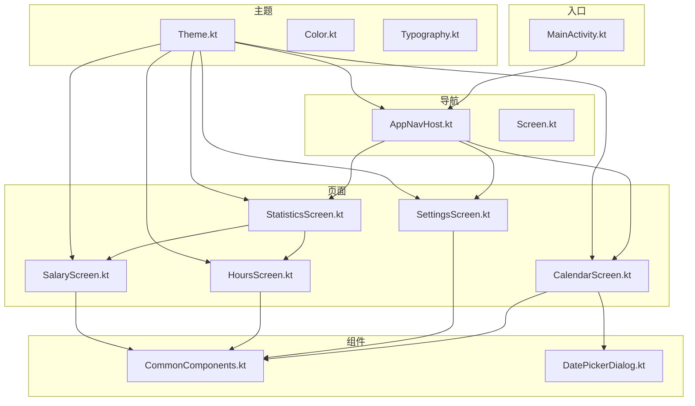
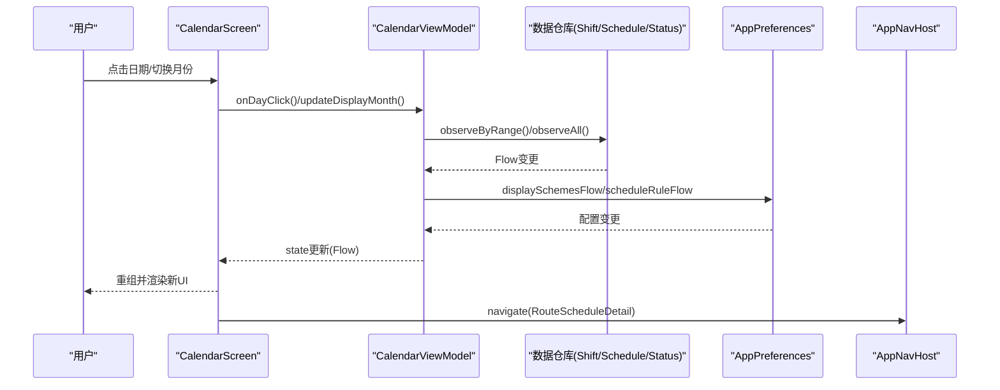
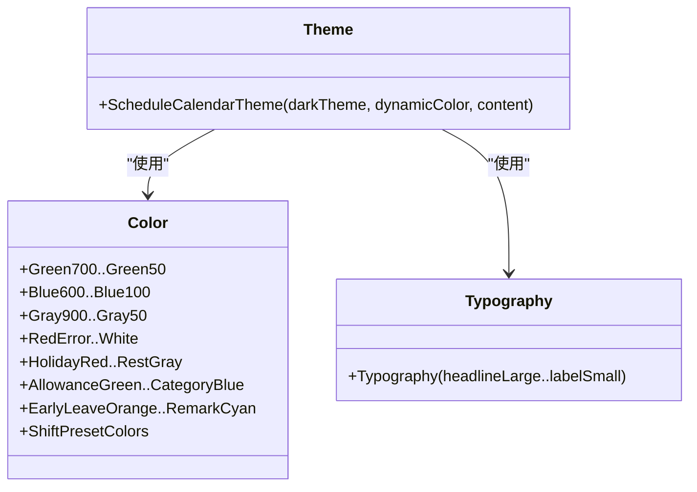
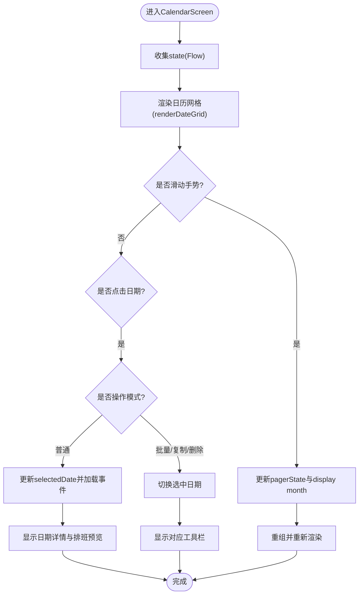
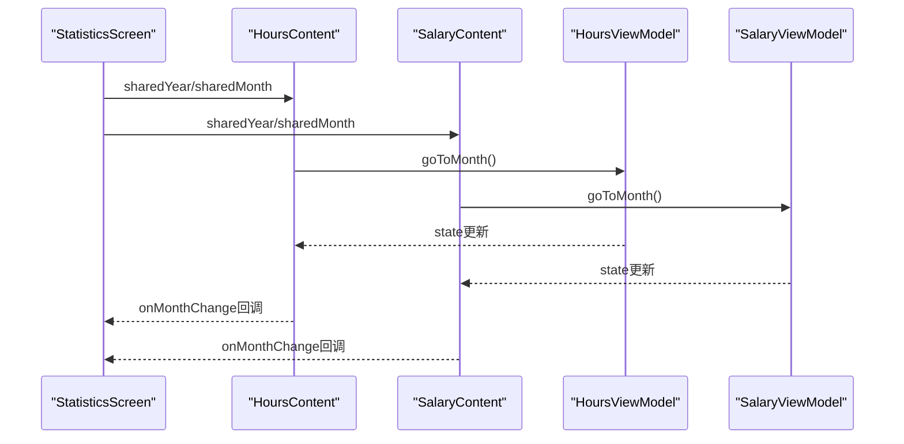
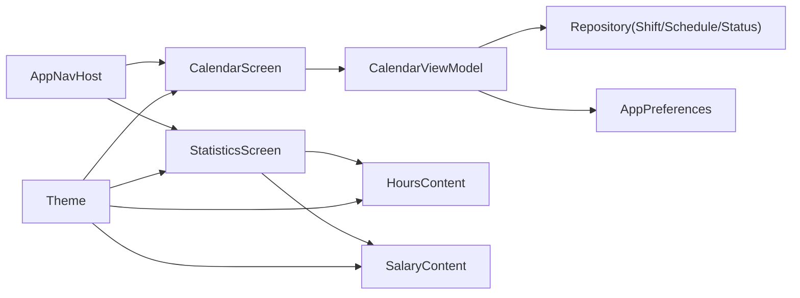

# UI组件与界面

<cite>
**本文引用的文件**   
- [Theme.kt](file://app/src/main/java/com/schedulecalendar/app/ui/theme/Theme.kt)
- [Color.kt](file://app/src/main/java/com/schedulecalendar/app/ui/theme/Color.kt)
- [Typography.kt](file://app/src/main/java/com/schedulecalendar/app/ui/theme/Typography.kt)
- [CalendarScreen.kt](file://app/src/main/java/com/schedulecalendar/app/ui/calendar/CalendarScreen.kt)
- [CalendarViewModel.kt](file://app/src/main/java/com/schedulecalendar/app/ui/calendar/CalendarViewModel.kt)
- [SettingsScreen.kt](file://app/src/main/java/com/schedulecalendar/app/ui/settings/SettingsScreen.kt)
- [StatisticsScreen.kt](file://app/src/main/java/com/schedulecalendar/app/ui/statistics/StatisticsScreen.kt)
- [HoursScreen.kt](file://app/src/main/java/com/schedulecalendar/app/ui/hours/HoursScreen.kt)
- [SalaryScreen.kt](file://app/src/main/java/com/schedulecalendar/app/ui/salary/SalaryScreen.kt)
- [CommonComponents.kt](file://app/src/main/java/com/schedulecalendar/app/ui/component/CommonComponents.kt)
- [DatePickerDialog.kt](file://app/src/main/java/com/schedulecalendar/app/ui/component/DatePickerDialog.kt)
- [AppNavHost.kt](file://app/src/main/java/com/schedulecalendar/app/ui/navigation/AppNavHost.kt)
- [Screen.kt](file://app/src/main/java/com/schedulecalendar/app/ui/navigation/Screen.kt)
- [MainActivity.kt](file://app/src/main/java/com/schedulecalendar/app/MainActivity.kt)
</cite>

## 目录
1. [简介](#简介)
2. [项目结构](#项目结构)
3. [核心组件](#核心组件)
4. [架构总览](#架构总览)
5. [详细组件分析](#详细组件分析)
6. [依赖关系分析](#依赖关系分析)
7. [性能考虑](#性能考虑)
8. [故障排查指南](#故障排查指南)
9. [结论](#结论)
10. [附录](#附录)

## 简介
本文件面向Android排班日历应用的UI层，聚焦基于Jetpack Compose的现代化架构：主题系统、Material Design 3集成、自定义组件、响应式布局与动画、状态管理与重组优化、可访问性与多语言适配。文档覆盖日历主界面、设置页、统计图表（工时/薪资）等关键屏幕，并提供组件复用模式、交互流程与最佳实践建议。

## 项目结构
应用采用功能模块划分与分层组织：
- ui/theme：主题、颜色、字体定义，统一Material 3风格
- ui/calendar：日历主界面与视图模型
- ui/settings：设置中心与各子设置页
- ui/statistics：合并统计页（工时+薪资）
- ui/hours、ui/salary：工时与薪资详情内容（支持独立与嵌入两种模式）
- ui/component：通用组件（顶部栏、时间选择器、IME自适应输入框、滚轮日期选择器等）
- ui/navigation：导航路由与底部Tab宿主
- MainActivity：入口、权限引导、返回键拦截、快捷方式处理

**图示来源** 
- [AppNavHost.kt:1-172](file://app/src/main/java/com/schedulecalendar/app/ui/navigation/AppNavHost.kt#L1-L172)
- [Screen.kt:1-34](file://app/src/main/java/com/schedulecalendar/app/ui/navigation/Screen.kt#L1-L34)
- [Theme.kt:1-80](file://app/src/main/java/com/schedulecalendar/app/ui/theme/Theme.kt#L1-L80)
- [Color.kt:1-54](file://app/src/main/java/com/schedulecalendar/app/ui/theme/Color.kt#L1-L54)
- [Typography.kt:1-23](file://app/src/main/java/com/schedulecalendar/app/ui/theme/Typography.kt#L1-L23)
- [CalendarScreen.kt:1-800](file://app/src/main/java/com/schedulecalendar/app/ui/calendar/CalendarScreen.kt#L1-L800)
- [SettingsScreen.kt:1-472](file://app/src/main/java/com/schedulecalendar/app/ui/settings/SettingsScreen.kt#L1-L472)
- [StatisticsScreen.kt:1-156](file://app/src/main/java/com/schedulecalendar/app/ui/statistics/StatisticsScreen.kt#L1-L156)
- [HoursScreen.kt:1-611](file://app/src/main/java/com/schedulecalendar/app/ui/hours/HoursScreen.kt#L1-L611)
- [SalaryScreen.kt:1-497](file://app/src/main/java/com/schedulecalendar/app/ui/salary/SalaryScreen.kt#L1-L497)
- [CommonComponents.kt:1-440](file://app/src/main/java/com/schedulecalendar/app/ui/component/CommonComponents.kt#L1-L440)
- [DatePickerDialog.kt:1-303](file://app/src/main/java/com/schedulecalendar/app/ui/component/DatePickerDialog.kt#L1-L303)
- [MainActivity.kt:1-322](file://app/src/main/java/com/schedulecalendar/app/MainActivity.kt#L1-L322)

**章节来源**
- [AppNavHost.kt:1-172](file://app/src/main/java/com/schedulecalendar/app/ui/navigation/AppNavHost.kt#L1-L172)
- [Screen.kt:1-34](file://app/src/main/java/com/schedulecalendar/app/ui/navigation/Screen.kt#L1-L34)
- [Theme.kt:1-80](file://app/src/main/java/com/schedulecalendar/app/ui/theme/Theme.kt#L1-L80)
- [Color.kt:1-54](file://app/src/main/java/com/schedulecalendar/app/ui/theme/Color.kt#L1-L54)
- [Typography.kt:1-23](file://app/src/main/java/com/schedulecalendar/app/ui/theme/Typography.kt#L1-L23)
- [CalendarScreen.kt:1-800](file://app/src/main/java/com/schedulecalendar/app/ui/calendar/CalendarScreen.kt#L1-L800)
- [SettingsScreen.kt:1-472](file://app/src/main/java/com/schedulecalendar/app/ui/settings/SettingsScreen.kt#L1-L472)
- [StatisticsScreen.kt:1-156](file://app/src/main/java/com/schedulecalendar/app/ui/statistics/StatisticsScreen.kt#L1-L156)
- [HoursScreen.kt:1-611](file://app/src/main/java/com/schedulecalendar/app/ui/hours/HoursScreen.kt#L1-L611)
- [SalaryScreen.kt:1-497](file://app/src/main/java/com/schedulecalendar/app/ui/salary/SalaryScreen.kt#L1-L497)
- [CommonComponents.kt:1-440](file://app/src/main/java/com/schedulecalendar/app/ui/component/CommonComponents.kt#L1-L440)
- [DatePickerDialog.kt:1-303](file://app/src/main/java/com/schedulecalendar/app/ui/component/DatePickerDialog.kt#L1-L303)
- [MainActivity.kt:1-322](file://app/src/main/java/com/schedulecalendar/app/MainActivity.kt#L1-L322)

## 核心组件
- 主题系统
  - Material 3色板与动态取色（Android 12+），预览模式回退静态色板
  - 统一的Typography与语义化颜色集合（含班次预设18色）
- 导航与路由
  - 类型安全路由（object/data class），底部Tab宿主与BackHandler整合
- 通用组件
  - ScheduleTopBar、MonthNavigator、StatCard、TimePickerField、ExpandableTimePicker、ImeAdaptiveOutlinedTextField
  - WheelDatePickerDialog（年/月/日三列滚轮）
- 页面组件
  - CalendarScreen：日历网格、月份滑动、批量/复制/删除工具栏、日期详情与事件展示
  - SettingsScreen：设置卡片、权限管理区块、国产ROM后台保障引导
  - StatisticsScreen：工时/薪资合并页，共享月份状态与Tab同步
  - HoursContent/SalaryContent：支持独立与嵌入两种模式，Canvas绘制图表

**章节来源**
- [Theme.kt:1-80](file://app/src/main/java/com/schedulecalendar/app/ui/theme/Theme.kt#L1-L80)
- [Color.kt:1-54](file://app/src/main/java/com/schedulecalendar/app/ui/theme/Color.kt#L1-L54)
- [Typography.kt:1-23](file://app/src/main/java/com/schedulecalendar/app/ui/theme/Typography.kt#L1-L23)
- [AppNavHost.kt:1-172](file://app/src/main/java/com/schedulecalendar/app/ui/navigation/AppNavHost.kt#L1-L172)
- [Screen.kt:1-34](file://app/src/main/java/com/schedulecalendar/app/ui/navigation/Screen.kt#L1-L34)
- [CommonComponents.kt:1-440](file://app/src/main/java/com/schedulecalendar/app/ui/component/CommonComponents.kt#L1-L440)
- [DatePickerDialog.kt:1-303](file://app/src/main/java/com/schedulecalendar/app/ui/component/DatePickerDialog.kt#L1-L303)
- [CalendarScreen.kt:1-800](file://app/src/main/java/com/schedulecalendar/app/ui/calendar/CalendarScreen.kt#L1-L800)
- [SettingsScreen.kt:1-472](file://app/src/main/java/com/schedulecalendar/app/ui/settings/SettingsScreen.kt#L1-L472)
- [StatisticsScreen.kt:1-156](file://app/src/main/java/com/schedulecalendar/app/ui/statistics/StatisticsScreen.kt#L1-L156)
- [HoursScreen.kt:1-611](file://app/src/main/java/com/schedulecalendar/app/ui/hours/HoursScreen.kt#L1-L611)
- [SalaryScreen.kt:1-497](file://app/src/main/java/com/schedulecalendar/app/ui/salary/SalaryScreen.kt#L1-L497)

## 架构总览
应用以Compose为UI框架，MVVM架构驱动：
- 视图层：各Screen通过collectAsStateWithLifecycle订阅ViewModel状态
- 视图模型：封装业务逻辑、数据加载、事件派发（Channel）
- 数据层：Repository与偏好设置提供数据流（Flow）
- 导航：AppNavHost集中管理路由与底部Tab，BackHandler统一处理返回行为
- 主题：ScheduleCalendarTheme包裹全局，启用Material 3与动态取色

**图示来源** 
- [CalendarScreen.kt:1-800](file://app/src/main/java/com/schedulecalendar/app/ui/calendar/CalendarScreen.kt#L1-L800)
- [CalendarViewModel.kt:1-800](file://app/src/main/java/com/schedulecalendar/app/ui/calendar/CalendarViewModel.kt#L1-L800)
- [AppNavHost.kt:1-172](file://app/src/main/java/com/schedulecalendar/app/ui/navigation/AppNavHost.kt#L1-L172)

**章节来源**
- [CalendarScreen.kt:1-800](file://app/src/main/java/com/schedulecalendar/app/ui/calendar/CalendarScreen.kt#L1-L800)
- [CalendarViewModel.kt:1-800](file://app/src/main/java/com/schedulecalendar/app/ui/calendar/CalendarViewModel.kt#L1-L800)
- [AppNavHost.kt:1-172](file://app/src/main/java/com/schedulecalendar/app/ui/navigation/AppNavHost.kt#L1-L172)

## 详细组件分析

### 主题系统与Material 3集成
- 动态取色：Android 12+使用dynamicLight/darkColorScheme；旧设备回退到自定义Light/Dark色板
- 预览模式：LocalInspectionMode下避免无Activity Context崩溃
- 字体与排版：Typography统一字号、行高、字重
- 语义色：Green/Blue/Grey/Red/Error/业务语义色（补贴/扣款/分类标签）、班次预设18色

**图示来源** 
- [Theme.kt:1-80](file://app/src/main/java/com/schedulecalendar/app/ui/theme/Theme.kt#L1-L80)
- [Color.kt:1-54](file://app/src/main/java/com/schedulecalendar/app/ui/theme/Color.kt#L1-L54)
- [Typography.kt:1-23](file://app/src/main/java/com/schedulecalendar/app/ui/theme/Typography.kt#L1-L23)

**章节来源**
- [Theme.kt:1-80](file://app/src/main/java/com/schedulecalendar/app/ui/theme/Theme.kt#L1-L80)
- [Color.kt:1-54](file://app/src/main/java/com/schedulecalendar/app/ui/theme/Color.kt#L1-L54)
- [Typography.kt:1-23](file://app/src/main/java/com/schedulecalendar/app/ui/theme/Typography.kt#L1-L23)

### 日历界面（CalendarScreen）
- 日历网格：renderDateGrid计算跨月填充、节假日/周末标记、选中态与事件指示点
- 月份滑动：HorizontalPager实现平滑切换，高度插值随行数变化
- 操作模式：批量排班、复制排班、删除排班，工具栏动态显示
- 日期详情：DateDetailSection与SchedulePreviewSection在操作模式下隐藏
- 无障碍：DayCell构建contentDescription，包含农历、班次、今天/节假日/周末信息
- 动画与交互：Ripple、Clickable、LongClick进入详情页

**图示来源** 
- [CalendarScreen.kt:1-800](file://app/src/main/java/com/schedulecalendar/app/ui/calendar/CalendarScreen.kt#L1-L800)
- [CalendarViewModel.kt:1-800](file://app/src/main/java/com/schedulecalendar/app/ui/calendar/CalendarViewModel.kt#L1-L800)

**章节来源**
- [CalendarScreen.kt:1-800](file://app/src/main/java/com/schedulecalendar/app/ui/calendar/CalendarScreen.kt#L1-L800)
- [CalendarViewModel.kt:1-800](file://app/src/main/java/com/schedulecalendar/app/ui/calendar/CalendarViewModel.kt#L1-L800)

### 设置界面（SettingsScreen）
- 设置卡片：ElevatedCard统一样式，图标+标题+描述+可选内容区
- 权限管理：通知、日历读写、精确闹钟、电池优化豁免、国产ROM后台保障引导
- 生命周期感知：在RESUMED时刷新权限状态
- 版本信息：读取包名版本名称展示

**章节来源**
- [SettingsScreen.kt:1-472](file://app/src/main/java/com/schedulecalendar/app/ui/settings/SettingsScreen.kt#L1-L472)

### 统计图表（StatisticsScreen、HoursContent、SalaryContent）
- 合并统计页：TabRow与HorizontalPager双向同步，共享月份状态（rememberSaveable）
- 工时图表：每日/月度柱状图，Canvas绘制，动态高度
- 薪资图表：饼图与趋势折线图，Canvas绘制，图例与数值标签
- 嵌入模式：由StatisticsScreen传入sharedYear/sharedMonth，避免重复reload

**图示来源** 
- [StatisticsScreen.kt:1-156](file://app/src/main/java/com/schedulecalendar/app/ui/statistics/StatisticsScreen.kt#L1-L156)
- [HoursScreen.kt:1-611](file://app/src/main/java/com/schedulecalendar/app/ui/hours/HoursScreen.kt#L1-L611)
- [SalaryScreen.kt:1-497](file://app/src/main/java/com/schedulecalendar/app/ui/salary/SalaryScreen.kt#L1-L497)

**章节来源**
- [StatisticsScreen.kt:1-156](file://app/src/main/java/com/schedulecalendar/app/ui/statistics/StatisticsScreen.kt#L1-L156)
- [HoursScreen.kt:1-611](file://app/src/main/java/com/schedulecalendar/app/ui/hours/HoursScreen.kt#L1-L611)
- [SalaryScreen.kt:1-497](file://app/src/main/java/com/schedulecalendar/app/ui/salary/SalaryScreen.kt#L1-L497)

### 通用组件（CommonComponents）
- ScheduleTopBar：可空title/actions，节省空间
- TimePickerField/ExpandableTimePicker：Material3 TimePicker对话框，支持外部控制或内部弹窗
- ImeAdaptiveOutlinedTextField：自动滚动使输入框位于键盘上方，支持Column/LazyColumn场景
- ColorPicker：两行18色选择器，高区分度配色
- StatCard/MonthNavigator：统计卡片与月份导航

**章节来源**
- [CommonComponents.kt:1-440](file://app/src/main/java/com/schedulecalendar/app/ui/component/CommonComponents.kt#L1-L440)

### 日期选择器（DatePickerDialog）
- WheelFullDatePickerDialog：年/月/日三列滚轮，自动计算最大天数，支持固定maxDay
- WheelDatePickerDialog：年/月双列滚轮，紧凑布局，最大宽度85%

**章节来源**
- [DatePickerDialog.kt:1-303](file://app/src/main/java/com/schedulecalendar/app/ui/component/DatePickerDialog.kt#L1-L303)

### 导航与入口（AppNavHost、Screen、MainActivity）
- AppNavHost：底部Tab、AnimatedVisibility过渡、BackHandler拦截返回键
- Screen：类型安全路由（object/data class）
- MainActivity：权限引导、快捷方式处理、API 34+ OnBackInvokedDispatcher overlay回调

**章节来源**
- [AppNavHost.kt:1-172](file://app/src/main/java/com/schedulecalendar/app/ui/navigation/AppNavHost.kt#L1-L172)
- [Screen.kt:1-34](file://app/src/main/java/com/schedulecalendar/app/ui/navigation/Screen.kt#L1-L34)
- [MainActivity.kt:1-322](file://app/src/main/java/com/schedulecalendar/app/MainActivity.kt#L1-L322)

## 依赖关系分析
- 视图层依赖ViewModel：collectAsStateWithLifecycle订阅Flow
- ViewModel依赖Repository与Preferences：combine聚合数据流，计算详情与待办
- 导航依赖AppNavHost：类型安全路由与BackHandler统一管理
- 主题依赖Material 3：动态取色与Typography

**图示来源** 
- [CalendarScreen.kt:1-800](file://app/src/main/java/com/schedulecalendar/app/ui/calendar/CalendarScreen.kt#L1-L800)
- [CalendarViewModel.kt:1-800](file://app/src/main/java/com/schedulecalendar/app/ui/calendar/CalendarViewModel.kt#L1-L800)
- [AppNavHost.kt:1-172](file://app/src/main/java/com/schedulecalendar/app/ui/navigation/AppNavHost.kt#L1-L172)
- [StatisticsScreen.kt:1-156](file://app/src/main/java/com/schedulecalendar/app/ui/statistics/StatisticsScreen.kt#L1-L156)
- [HoursScreen.kt:1-611](file://app/src/main/java/com/schedulecalendar/app/ui/hours/HoursScreen.kt#L1-L611)
- [SalaryScreen.kt:1-497](file://app/src/main/java/com/schedulecalendar/app/ui/salary/SalaryScreen.kt#L1-L497)
- [Theme.kt:1-80](file://app/src/main/java/com/schedulecalendar/app/ui/theme/Theme.kt#L1-L80)

**章节来源**
- [CalendarScreen.kt:1-800](file://app/src/main/java/com/schedulecalendar/app/ui/calendar/CalendarScreen.kt#L1-L800)
- [CalendarViewModel.kt:1-800](file://app/src/main/java/com/schedulecalendar/app/ui/calendar/CalendarViewModel.kt#L1-L800)
- [AppNavHost.kt:1-172](file://app/src/main/java/com/schedulecalendar/app/ui/navigation/AppNavHost.kt#L1-L172)
- [StatisticsScreen.kt:1-156](file://app/src/main/java/com/schedulecalendar/app/ui/statistics/StatisticsScreen.kt#L1-L156)
- [HoursScreen.kt:1-611](file://app/src/main/java/com/schedulecalendar/app/ui/hours/HoursScreen.kt#L1-L611)
- [SalaryScreen.kt:1-497](file://app/src/main/java/com/schedulecalendar/app/ui/salary/SalaryScreen.kt#L1-L497)
- [Theme.kt:1-80](file://app/src/main/java/com/schedulecalendar/app/ui/theme/Theme.kt#L1-L80)

## 性能考虑
- 重组优化
  - collectAsStateWithLifecycle确保生命周期感知，避免无效重组
  - remember/rememberSaveable缓存状态（如StatisticsScreen共享月份）
  - LaunchedEffect仅在依赖变化时执行（如pagerState.settledPage）
- 数据加载
  - combine聚合多个Flow，减少多次请求
  - loadCurrentMonth在切月时取消旧Job，防止协程泄漏
- 渲染优化
  - LazyColumn/LazyRow按需渲染
  - Canvas图表仅在有数据时绘制，动态高度避免过度布局
- 导航防抖
  - BottomNavigationBar点击防抖，避免快速切换导致重组堆积

[无需“章节来源”，因为本节为通用指导]

## 故障排查指南
- 权限问题
  - 通知权限（Android 13+）、日历读写、精确闹钟（Android 12需手动授权）、电池优化豁免
  - 国产ROM后台限制：引导开启自启动、省电策略无限制、后台弹出界面、桌面快捷方式
- 返回键行为
  - API 34+使用OnBackInvokedDispatcher overlay回调；API 33-使用OnBackPressedDispatcher兜底
  - Tab页面与日历子模式（批量/复制/删除）下的返回优先级
- 数据一致性
  - 跨午夜打卡修正：下班打卡早于班次结束时间归属前一天
  - 内置附加状态与普通打卡记录字段差异（appliedStatus vs actualStartTime/EndTime）

**章节来源**
- [SettingsScreen.kt:1-472](file://app/src/main/java/com/schedulecalendar/app/ui/settings/SettingsScreen.kt#L1-L472)
- [MainActivity.kt:1-322](file://app/src/main/java/com/schedulecalendar/app/MainActivity.kt#L1-L322)
- [CalendarViewModel.kt:1-800](file://app/src/main/java/com/schedulecalendar/app/ui/calendar/CalendarViewModel.kt#L1-L800)

## 结论
该应用以Compose为核心，结合Material 3与MVVM架构，实现了高内聚、低耦合的UI体系。主题系统统一视觉风格，通用组件提升复用率，状态管理与重组优化保证流畅体验。日历、设置、统计等页面覆盖核心业务场景，并通过可访问性与多语言适配提升用户体验。建议在后续迭代中继续强化图表交互、动画细节与国际化资源管理。

[无需“章节来源”，因为本节为总结性内容]

## 附录
- 可访问性
  - DayCell构建contentDescription，包含日期、班次、农历、今天/节假日/周末等信息
  - 语义化文本与图标描述，便于读屏软件识别
- 多语言适配
  - 字符串资源建议使用strings.xml进行本地化（当前代码中部分文案硬编码，建议逐步迁移）
  - 日期/时间格式化遵循系统区域设置

**章节来源**
- [CalendarScreen.kt:1-800](file://app/src/main/java/com/schedulecalendar/app/ui/calendar/CalendarScreen.kt#L1-L800)