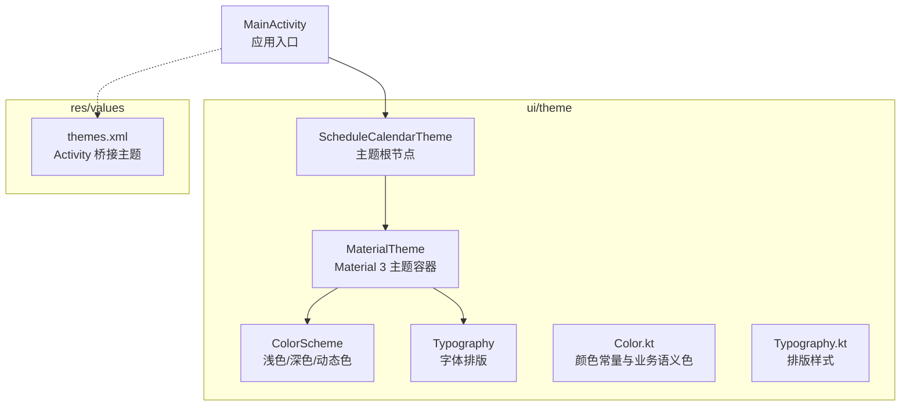
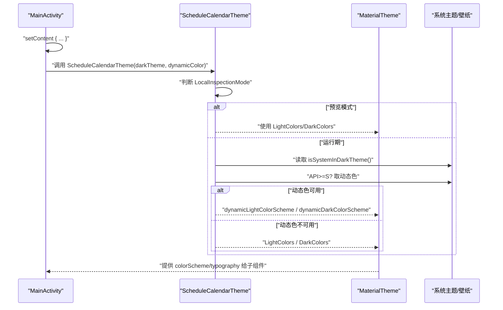
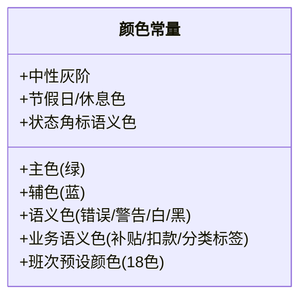
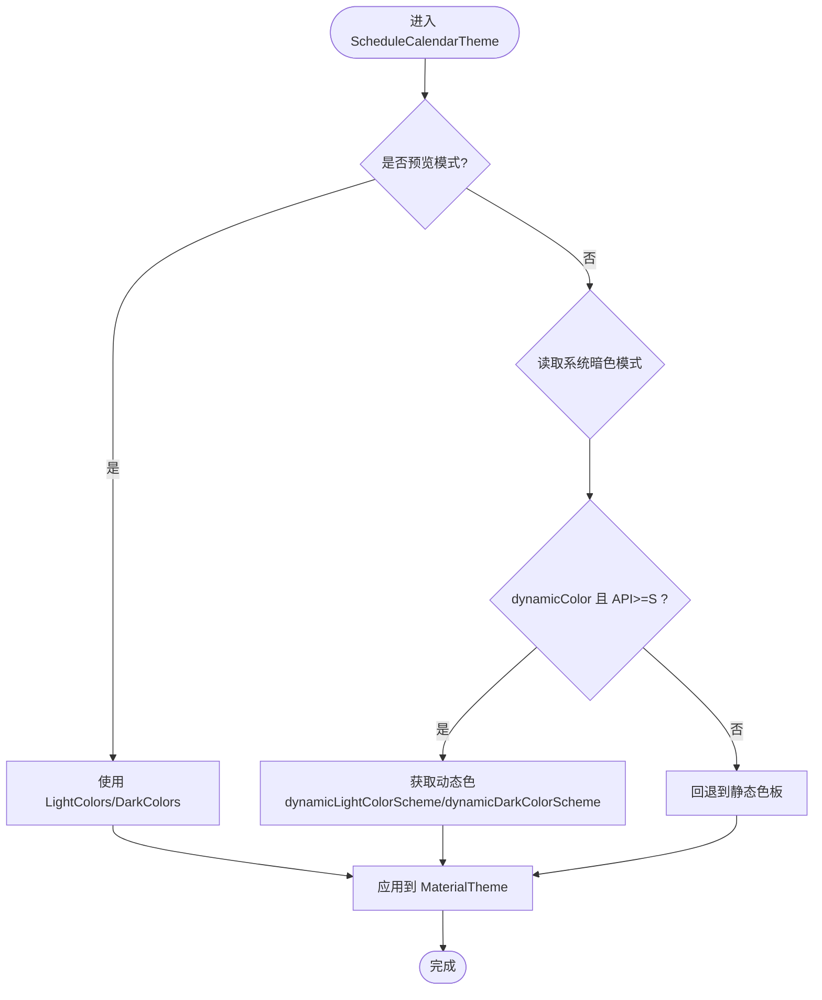
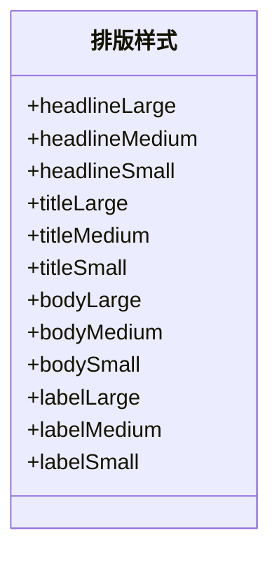
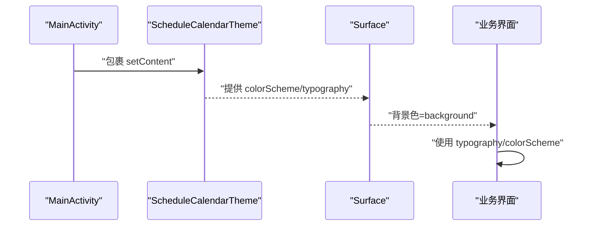
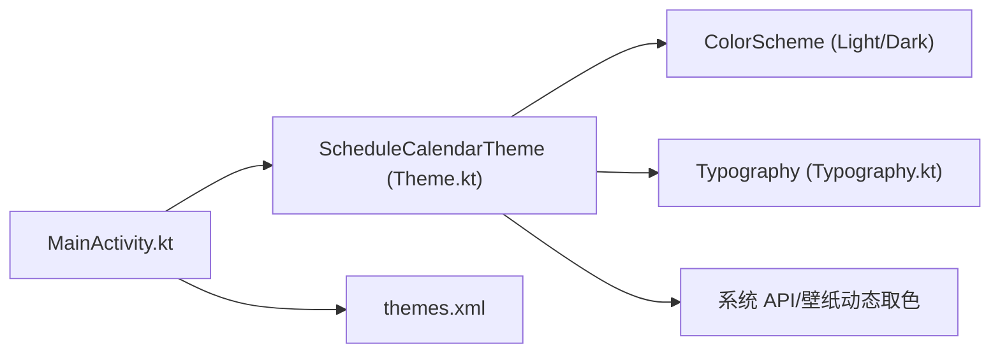

# 主题系统

<cite>
**本文引用的文件**   
- [Color.kt](file://app/src/main/java/com/schedulecalendar/app/ui/theme/Color.kt)
- [Theme.kt](file://app/src/main/java/com/schedulecalendar/app/ui/theme/Theme.kt)
- [Typography.kt](file://app/src/main/java/com/schedulecalendar/app/ui/theme/Typography.kt)
- [themes.xml](file://app/src/main/res/values/themes.xml)
- [MainActivity.kt](file://app/src/main/java/com/schedulecalendar/app/MainActivity.kt)
</cite>

## 目录
1. [简介](#简介)
2. [项目结构](#项目结构)
3. [核心组件](#核心组件)
4. [架构总览](#架构总览)
5. [详细组件分析](#详细组件分析)
6. [依赖关系分析](#依赖关系分析)
7. [性能考量](#性能考量)
8. [故障排查指南](#故障排查指南)
9. [结论](#结论)
10. [附录](#附录)

## 简介
本文件为 Android 排班日历应用的主题系统文档，聚焦基于 Material Design 3 的现代化主题架构。内容涵盖：
- 浅色与深色主题的实现策略
- 动态颜色（Material You）支持与降级回退
- 预览模式下的稳定渲染处理
- 颜色方案定义与使用规范（主色、辅助色、背景色、错误色等）
- 字体排版系统的设置与扩展方式
- 主题切换机制、系统主题检测与多设备适配
- 主题扩展与自定义的最佳实践

## 项目结构
主题相关代码集中在 ui/theme 包中，Activity 层通过 Compose 的 setContent 注入主题上下文，Android 原生 themes.xml 仅承担 Activity 桥接职责，确保状态栏/导航栏透明以配合 Edge-to-Edge。

**图表来源** 
- [MainActivity.kt:167-178](file://app/src/main/java/com/schedulecalendar/app/MainActivity.kt#L167-L178)
- [Theme.kt:54-79](file://app/src/main/java/com/schedulecalendar/app/ui/theme/Theme.kt#L54-L79)
- [Color.kt:1-54](file://app/src/main/java/com/schedulecalendar/app/ui/theme/Color.kt#L1-L54)
- [Typography.kt:9-22](file://app/src/main/java/com/schedulecalendar/app/ui/theme/Typography.kt#L9-L22)
- [themes.xml:8-12](file://app/src/main/res/values/themes.xml#L8-L12)

**章节来源**
- [MainActivity.kt:167-178](file://app/src/main/java/com/schedulecalendar/app/MainActivity.kt#L167-L178)
- [Theme.kt:54-79](file://app/src/main/java/com/schedulecalendar/app/ui/theme/Theme.kt#L54-L79)
- [Color.kt:1-54](file://app/src/main/java/com/schedulecalendar/app/ui/theme/Color.kt#L1-L54)
- [Typography.kt:9-22](file://app/src/main/java/com/schedulecalendar/app/ui/theme/Typography.kt#L9-L22)
- [themes.xml:8-12](file://app/src/main/res/values/themes.xml#L8-L12)

## 核心组件
- 颜色体系（Color.kt）
  - 主色调：绿色系（用于 primary/onPrimary/primaryContainer 等）
  - 辅色：蓝色系（secondary/onSecondary/secondaryContainer）
  - 中性色：灰阶（用于 onSurfaceVariant、outline、surfaceVariant 等）
  - 语义色：错误、警告、白/黑、节假日/休息、业务语义（补贴/扣款/分类标签）、状态角标
  - 班次预设颜色：18 色高区分度配色，便于可视化排班
- 主题容器（Theme.kt）
  - 提供 ScheduleCalendarTheme，封装浅色/深色静态 ColorScheme 与动态色选择逻辑
  - 支持 Preview 模式回退到静态色板，避免无 Context 崩溃
  - 在 Android 12+ 启用 dynamicLightColorScheme/dynamicDarkColorScheme
- 字体排版（Typography.kt）
  - 定义 headline/title/body/label 各层级字号、字重、行高
  - 统一全局文本样式，便于一致性维护
- Activity 桥接（themes.xml）
  - 使用 DayNight.NoActionBar，状态栏/导航栏透明，配合 enableEdgeToEdge()

**章节来源**
- [Color.kt:1-54](file://app/src/main/java/com/schedulecalendar/app/ui/theme/Color.kt#L1-L54)
- [Theme.kt:12-51](file://app/src/main/java/com/schedulecalendar/app/ui/theme/Theme.kt#L12-L51)
- [Theme.kt:54-79](file://app/src/main/java/com/schedulecalendar/app/ui/theme/Theme.kt#L54-L79)
- [Typography.kt:9-22](file://app/src/main/java/com/schedulecalendar/app/ui/theme/Typography.kt#L9-L22)
- [themes.xml:8-12](file://app/src/main/res/values/themes.xml#L8-L12)

## 架构总览
主题系统在 MainActivity 的 setContent 中作为最外层包裹，将 MaterialTheme 注入整个 Compose 树。内部根据系统暗色模式与 API 级别决定使用静态色板或动态色。

**图表来源** 
- [MainActivity.kt:167-178](file://app/src/main/java/com/schedulecalendar/app/MainActivity.kt#L167-L178)
- [Theme.kt:54-79](file://app/src/main/java/com/schedulecalendar/app/ui/theme/Theme.kt#L54-L79)

## 详细组件分析

### 颜色体系（Color.kt）
- 设计要点
  - 主色采用绿色系，保证高对比与品牌识别；辅色蓝色用于强调与交互反馈
  - 中性灰阶覆盖从深到浅的全范围，保障明暗主题下可读性
  - 语义色明确区分错误、警告、白/黑、节假日/休息、业务语义（补贴/扣款/分类标签）、状态角标
  - 班次预设颜色提供 18 种高区分度颜色，避免相邻色混淆
- 使用建议
  - 界面元素优先使用 Material 3 语义化颜色（如 error、onSurfaceVariant、surfaceVariant），而非硬编码十六进制
  - 业务语义色用于特定场景（如扣款红色、补贴绿色、分类标签色），保持视觉一致性
  - 班次/状态颜色可结合用户偏好索引进行映射，提升个性化体验

**图表来源** 
- [Color.kt:1-54](file://app/src/main/java/com/schedulecalendar/app/ui/theme/Color.kt#L1-L54)

**章节来源**
- [Color.kt:1-54](file://app/src/main/java/com/schedulecalendar/app/ui/theme/Color.kt#L1-L54)

### 主题容器与动态色（Theme.kt）
- 实现要点
  - 定义 LightColors 与 DarkColors 两套静态 ColorScheme
  - ScheduleCalendarTheme 接收 darkTheme 与 dynamicColor 参数
  - 预览模式（LocalInspectionMode）强制使用静态色板，避免无 Context 崩溃
  - 运行期：若 dynamicColor=true 且 API>=S，则使用 dynamicLightColorScheme/dynamicDarkColorScheme；否则回退到静态色板
- 最佳实践
  - 默认开启 dynamicColor，以获得 Material You 的动态取色体验
  - 对旧设备自动降级，保证兼容性
  - 在预览环境中始终可见，提升 UI 开发效率

**图表来源** 
- [Theme.kt:54-79](file://app/src/main/java/com/schedulecalendar/app/ui/theme/Theme.kt#L54-L79)

**章节来源**
- [Theme.kt:12-51](file://app/src/main/java/com/schedulecalendar/app/ui/theme/Theme.kt#L12-L51)
- [Theme.kt:54-79](file://app/src/main/java/com/schedulecalendar/app/ui/theme/Theme.kt#L54-L79)

### 字体排版（Typography.kt）
- 设计要点
  - 标题层级（headlineLarge/Medium/Small）与正文层级（bodyLarge/Medium/Small）及标签层级（labelLarge/Medium/Small）均有明确的字号、字重与行高
  - 遵循 Material 3 排版规范，保证层次清晰与可读性
- 扩展建议
  - 如需自定义字体，可在 Typography 构造时传入自定义 FontFamily
  - 保持行高与字号比例一致，避免换行拥挤

**图表来源** 
- [Typography.kt:9-22](file://app/src/main/java/com/schedulecalendar/app/ui/theme/Typography.kt#L9-L22)

**章节来源**
- [Typography.kt:9-22](file://app/src/main/java/com/schedulecalendar/app/ui/theme/Typography.kt#L9-L22)

### Activity 桥接主题（themes.xml）
- 设计要点
  - 使用 DayNight.NoActionBar，使 AppCompat 自动跟随系统主题
  - 状态栏与导航栏设为透明，配合 enableEdgeToEdge() 实现沉浸式布局
- 注意事项
  - 纯 Compose 应用中，所有颜色/排版由 MaterialTheme 控制，无需额外配置 AppCompat 主题项

**章节来源**
- [themes.xml:8-12](file://app/src/main/res/values/themes.xml#L8-L12)

### 主题注入与使用（MainActivity.kt）
- 注入位置
  - 在 setContent 中调用 ScheduleCalendarTheme，作为 Compose 树的根主题
  - Surface 背景色使用 MaterialTheme.colorScheme.background，确保与主题一致
- 使用示例
  - 文本样式使用 MaterialTheme.typography.*
  - 颜色使用 MaterialTheme.colorScheme.*（如 onSurfaceVariant、error、surface 等）

**图表来源** 
- [MainActivity.kt:167-178](file://app/src/main/java/com/schedulecalendar/app/MainActivity.kt#L167-L178)

**章节来源**
- [MainActivity.kt:167-178](file://app/src/main/java/com/schedulecalendar/app/MainActivity.kt#L167-L178)

## 依赖关系分析
- MainActivity 依赖 ScheduleCalendarTheme 作为主题根节点
- ScheduleCalendarTheme 依赖 Color.kt 与 Typography.kt 提供的静态色板与排版
- 运行期依赖系统 API 级别与壁纸动态取色能力
- themes.xml 仅负责 Activity 桥接，不直接参与 Compose 主题

**图表来源** 
- [MainActivity.kt:167-178](file://app/src/main/java/com/schedulecalendar/app/MainActivity.kt#L167-L178)
- [Theme.kt:54-79](file://app/src/main/java/com/schedulecalendar/app/ui/theme/Theme.kt#L54-L79)
- [Color.kt:1-54](file://app/src/main/java/com/schedulecalendar/app/ui/theme/Color.kt#L1-L54)
- [Typography.kt:9-22](file://app/src/main/java/com/schedulecalendar/app/ui/theme/Typography.kt#L9-L22)
- [themes.xml:8-12](file://app/src/main/res/values/themes.xml#L8-L12)

**章节来源**
- [MainActivity.kt:167-178](file://app/src/main/java/com/schedulecalendar/app/MainActivity.kt#L167-L178)
- [Theme.kt:54-79](file://app/src/main/java/com/schedulecalendar/app/ui/theme/Theme.kt#L54-L79)
- [Color.kt:1-54](file://app/src/main/java/com/schedulecalendar/app/ui/theme/Color.kt#L1-L54)
- [Typography.kt:9-22](file://app/src/main/java/com/schedulecalendar/app/ui/theme/Typography.kt#L9-L22)
- [themes.xml:8-12](file://app/src/main/res/values/themes.xml#L8-L12)

## 性能考量
- 动态色计算开销
  - dynamicLightColorScheme/dynamicDarkColorScheme 在首次调用时会解析壁纸并生成色板，建议在应用启动后尽早初始化以减少卡顿
- 预览模式优化
  - 预览环境强制使用静态色板，避免无 Context 导致的异常与额外开销
- 主题切换成本
  - 切换暗色模式会重建主题树，注意减少不必要的重组与重绘
- 内存占用
  - 颜色与排版对象为单例式常量，内存占用极低

[本节为通用指导，不涉及具体文件分析]

## 故障排查指南
- 预览模式下出现崩溃或颜色异常
  - 检查是否在预览环境中误用了动态色 API；当前实现已在 LocalInspectionMode 下回退到静态色板
- 动态色未生效
  - 确认设备 API>=S 且 dynamicColor=true；旧设备会自动回退到静态色板
- 主题颜色不一致
  - 确保所有界面均通过 MaterialTheme.colorScheme.* 获取颜色，避免硬编码十六进制
- 状态栏/导航栏颜色异常
  - 检查 themes.xml 是否设置为透明，并在 Activity 中启用 enableEdgeToEdge()

**章节来源**
- [Theme.kt:54-79](file://app/src/main/java/com/schedulecalendar/app/ui/theme/Theme.kt#L54-L79)
- [themes.xml:8-12](file://app/src/main/res/values/themes.xml#L8-L12)

## 结论
该主题系统基于 Material Design 3，提供了完善的浅色/深色主题与动态颜色支持，并通过预览模式优化与 API 级别降级保证了跨设备兼容性与稳定性。颜色体系与排版规范清晰，便于扩展与维护。建议在实际使用中严格遵循语义化颜色与排版约定，以获得一致的视觉体验与良好的可访问性。

[本节为总结，不涉及具体文件分析]

## 附录
- 主题扩展建议
  - 新增业务语义色时，请在 Color.kt 中集中管理，并在界面中使用语义化名称
  - 自定义字体需在 Typography.kt 中引入 FontFamily，并保持层级一致性
  - 如需用户自定义主题，可在 Settings 中增加“主题色”选项，通过替换 primary/onPrimary 等映射实现
- 多设备适配策略
  - 动态色仅在 Android 12+ 启用，旧设备自动回退
  - 状态栏/导航栏透明配合 Edge-to-Edge，确保全屏沉浸效果

[本节为概念性内容，不涉及具体文件分析]