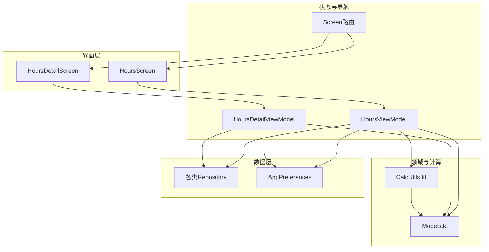
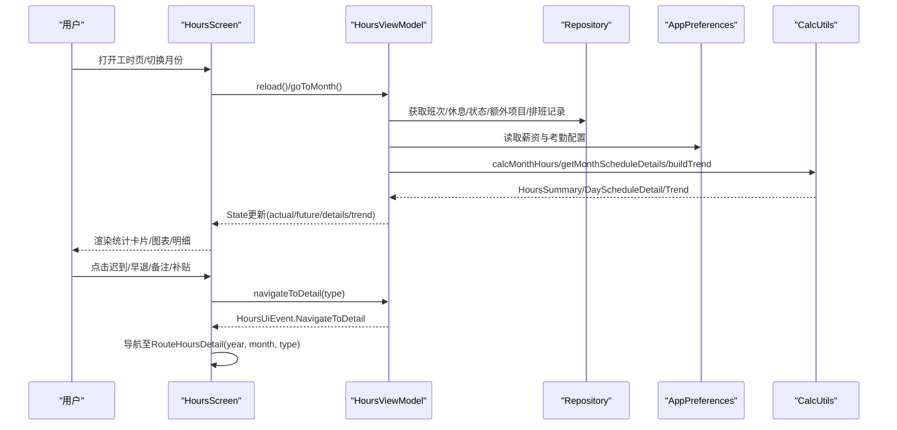
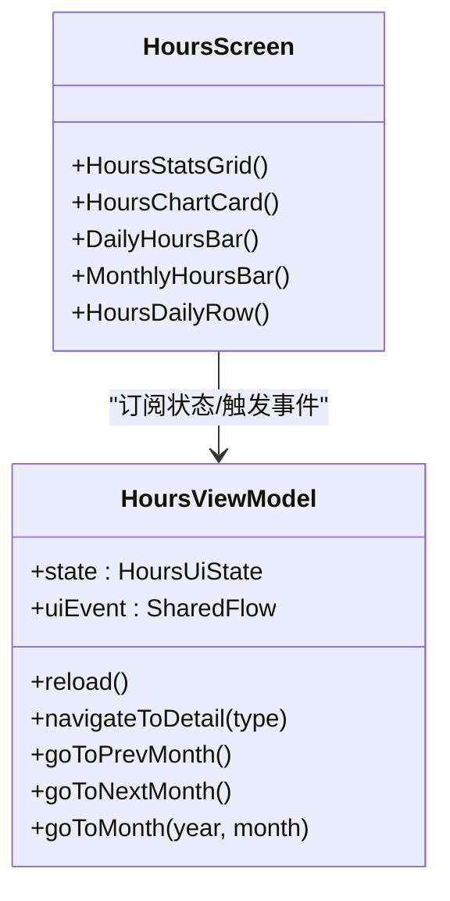
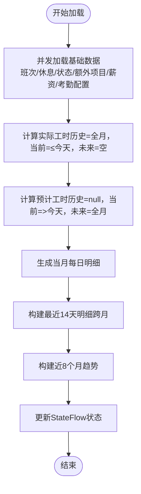
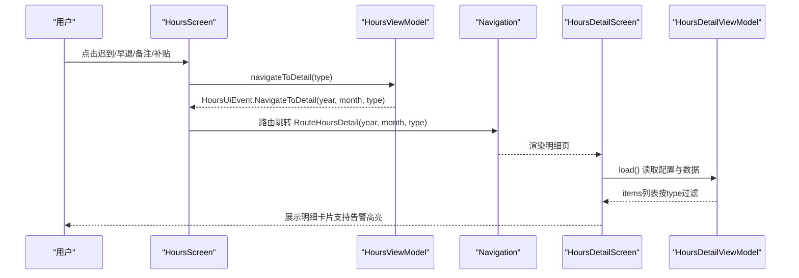
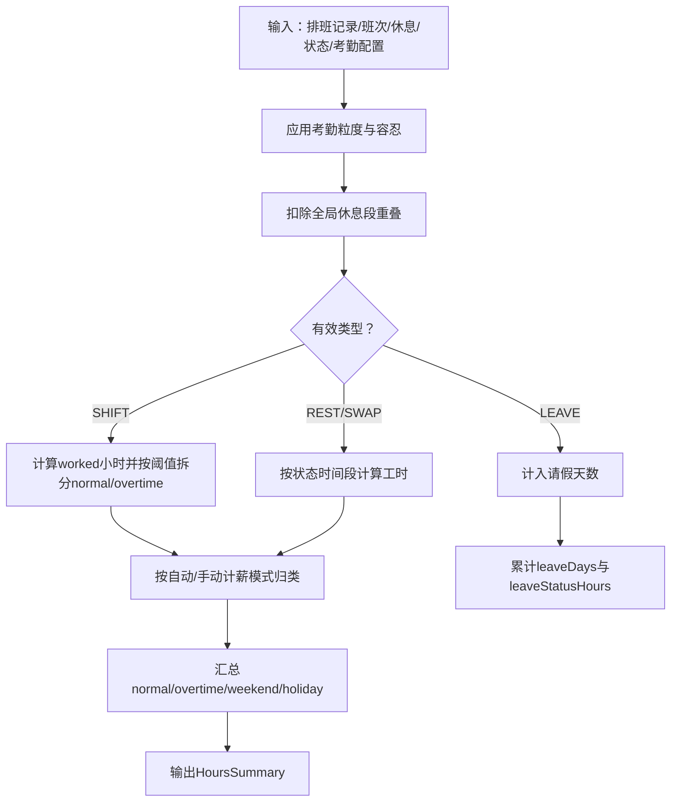
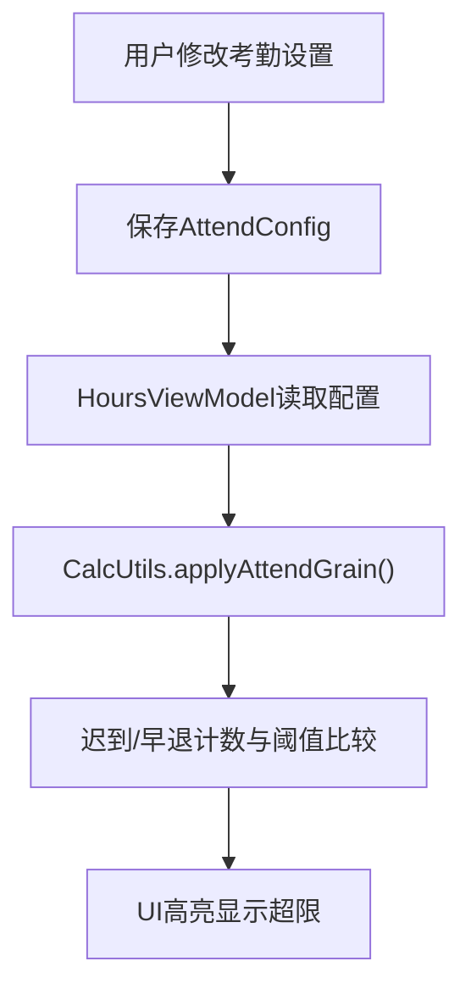
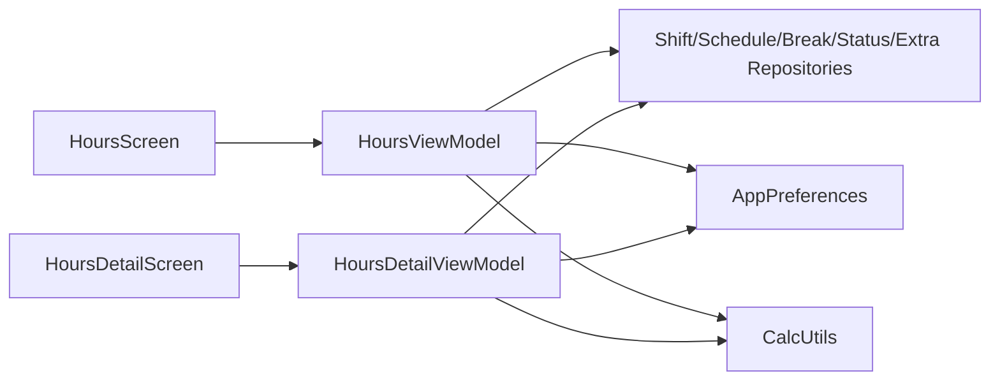

# 工时界面

<cite>
**本文引用的文件**   
- [HoursScreen.kt](file://app/src/main/java/com/schedulecalendar/app/ui/hours/HoursScreen.kt)
- [HoursViewModel.kt](file://app/src/main/java/com/schedulecalendar/app/ui/hours/HoursViewModel.kt)
- [HoursDetailScreen.kt](file://app/src/main/java/com/schedulecalendar/app/ui/detail/HoursDetailScreen.kt)
- [DetailViewModels.kt](file://app/src/main/java/com/schedulecalendar/app/ui/detail/DetailViewModels.kt)
- [Models.kt](file://app/src/main/java/com/schedulecalendar/app/domain/model/Models.kt)
- [CalcUtils.kt](file://app/src/main/java/com/schedulecalendar/app/domain/model/CalcUtils.kt)
- [AttendanceSettingsScreen.kt](file://app/src/main/java/com/schedulecalendar/app/ui/settings/AttendanceSettingsScreen.kt)
- [Screen.kt](file://app/src/main/java/com/schedulecalendar/app/ui/navigation/Screen.kt)
</cite>

## 目录
1. [简介](#简介)
2. [项目结构](#项目结构)
3. [核心组件](#核心组件)
4. [架构总览](#架构总览)
5. [详细组件分析](#详细组件分析)
6. [依赖关系分析](#依赖关系分析)
7. [性能考量](#性能考量)
8. [故障排查指南](#故障排查指南)
9. [结论](#结论)
10. [附录](#附录)

## 简介
本文件面向Android排班日历应用的“工时界面”，系统性阐述工时统计与展示的UI实现，包括：
- 工时汇总卡片（正常、加班、周末、节假日、请假、调休/休息、迟到/早退、备注、补贴/扣款）
- 加班统计与异常提醒（迟到/早退阈值超限高亮）
- 工时趋势图（每日分布与月度分布）
- 数据筛选与查询（按类型进入明细页：迟到、早退、备注、漏打卡、补贴/扣款）
- 工时数据的导出与报表生成（基于现有计算能力与数据结构）
- 可视化图表与自定义统计维度（通过考勤配置与显示方案扩展）

## 项目结构
工时界面采用Compose UI + ViewModel + Repository的清晰分层：
- UI层：HoursScreen负责展示统计卡片、图表与每日明细；HoursDetailScreen用于明细列表展示。
- 状态与逻辑：HoursViewModel聚合仓库数据，调用CalcUtils进行工时计算与趋势构建。
- 领域模型：Models.kt定义班次、记录、薪资与考勤配置等核心数据结构。
- 计算引擎：CalcUtils提供工时/薪资计算、粒度处理、跨天支持、自动计薪模式判断等。

**图示来源** 
- [HoursScreen.kt:1-214](file://app/src/main/java/com/schedulecalendar/app/ui/hours/HoursScreen.kt#L1-L214)
- [HoursViewModel.kt:1-207](file://app/src/main/java/com/schedulecalendar/app/ui/hours/HoursViewModel.kt#L1-L207)
- [HoursDetailScreen.kt:1-165](file://app/src/main/java/com/schedulecalendar/app/ui/detail/HoursDetailScreen.kt#L1-L165)
- [DetailViewModels.kt:250-450](file://app/src/main/java/com/schedulecalendar/app/ui/detail/DetailViewModels.kt#L250-L450)
- [Models.kt:1-278](file://app/src/main/java/com/schedulecalendar/app/domain/model/Models.kt#L1-L278)
- [CalcUtils.kt:1-557](file://app/src/main/java/com/schedulecalendar/app/domain/model/CalcUtils.kt#L1-L557)
- [Screen.kt:1-34](file://app/src/main/java/com/schedulecalendar/app/ui/navigation/Screen.kt#L1-L34)

**章节来源**
- [HoursScreen.kt:1-214](file://app/src/main/java/com/schedulecalendar/app/ui/hours/HoursScreen.kt#L1-L214)
- [HoursViewModel.kt:1-207](file://app/src/main/java/com/schedulecalendar/app/ui/hours/HoursViewModel.kt#L1-L207)
- [Models.kt:1-278](file://app/src/main/java/com/schedulecalendar/app/domain/model/Models.kt#L1-L278)
- [CalcUtils.kt:1-557](file://app/src/main/java/com/schedulecalendar/app/domain/model/CalcUtils.kt#L1-L557)
- [Screen.kt:1-34](file://app/src/main/java/com/schedulecalendar/app/ui/navigation/Screen.kt#L1-L34)

## 核心组件
- HoursScreen：呈现工时汇总卡片、本月总工时、图表切换（每日/月度）、每日明细列表，并响应生命周期刷新与嵌入模式。
- HoursViewModel：维护月份状态、加载当月实际/预计工时、最近14天明细、近8个月趋势，并通过事件驱动导航到明细页。
- HoursDetailScreen：以卡片形式展示某类筛选结果（迟到、早退、备注、漏打卡、补贴/扣款），支持告警高亮。
- DetailViewModels.HoursDetailViewModel：根据type参数过滤明细数据，计算迟到/早退分钟数，渲染明细项。
- CalcUtils：核心计算引擎，包含时间工具、考勤粒度、全局休息段扣减、日工时分类、月工时汇总、薪资汇总、自动计薪模式判断等。
- Models：统一的数据模型，涵盖班次、记录、附加项目、薪资配置、考勤配置、工时汇总、每日明细等。

**章节来源**
- [HoursScreen.kt:1-214](file://app/src/main/java/com/schedulecalendar/app/ui/hours/HoursScreen.kt#L1-L214)
- [HoursViewModel.kt:1-207](file://app/src/main/java/com/schedulecalendar/app/ui/hours/HoursViewModel.kt#L1-L207)
- [HoursDetailScreen.kt:1-165](file://app/src/main/java/com/schedulecalendar/app/ui/detail/HoursDetailScreen.kt#L1-L165)
- [DetailViewModels.kt:250-450](file://app/src/main/java/com/schedulecalendar/app/ui/detail/DetailViewModels.kt#L250-L450)
- [Models.kt:1-278](file://app/src/main/java/com/schedulecalendar/app/domain/model/Models.kt#L1-L278)
- [CalcUtils.kt:1-557](file://app/src/main/java/com/schedulecalendar/app/domain/model/CalcUtils.kt#L1-L557)

## 架构总览
工时界面遵循MVVM+领域计算的职责分离：
- UI层仅负责展示与交互，不直接访问数据库或业务规则。
- ViewModel协调仓库与偏好设置，调用CalcUtils完成计算，暴露StateFlow供UI订阅。
- 领域计算集中化，保证工时/薪资算法一致性与可测试性。
- 导航通过RouteHoursDetail携带year/month/type参数，进入对应明细页面。

**图示来源** 
- [HoursScreen.kt:1-214](file://app/src/main/java/com/schedulecalendar/app/ui/hours/HoursScreen.kt#L1-L214)
- [HoursViewModel.kt:77-146](file://app/src/main/java/com/schedulecalendar/app/ui/hours/HoursViewModel.kt#L77-L146)
- [CalcUtils.kt:238-361](file://app/src/main/java/com/schedulecalendar/app/domain/model/CalcUtils.kt#L238-L361)
- [Screen.kt:16-17](file://app/src/main/java/com/schedulecalendar/app/ui/navigation/Screen.kt#L16-L17)

## 详细组件分析

### HoursScreen（工时主界面）
- 统计卡片网格：展示正常/加班/周末/节假日/请假/调休休息/迟到/早退/备注/补贴扣款，支持未来预计值提示。
- 本月总工时卡片：突出显示总工时与预计增量。
- 图表区：支持“每日”和“月工时”两种视图，动态高度自适应，Canvas绘制柱状图。
- 每日明细：按日期倒序展示，含班次标签、类型徽章、上下班时间与备注。
- 异常提醒：当迟到/早退次数达到阈值时，单元格背景与边框高亮，并显示“超限”标签。

**图示来源** 
- [HoursScreen.kt:216-356](file://app/src/main/java/com/schedulecalendar/app/ui/hours/HoursScreen.kt#L216-L356)
- [HoursViewModel.kt:52-107](file://app/src/main/java/com/schedulecalendar/app/ui/hours/HoursViewModel.kt#L52-L107)

**章节来源**
- [HoursScreen.kt:104-214](file://app/src/main/java/com/schedulecalendar/app/ui/hours/HoursScreen.kt#L104-L214)
- [HoursScreen.kt:216-356](file://app/src/main/java/com/schedulecalendar/app/ui/hours/HoursScreen.kt#L216-L356)
- [HoursScreen.kt:358-436](file://app/src/main/java/com/schedulecalendar/app/ui/hours/HoursScreen.kt#L358-L436)
- [HoursScreen.kt:438-542](file://app/src/main/java/com/schedulecalendar/app/ui/hours/HoursScreen.kt#L438-L542)
- [HoursScreen.kt:544-611](file://app/src/main/java/com/schedulecalendar/app/ui/hours/HoursScreen.kt#L544-L611)

### HoursViewModel（工时状态与数据流）
- 状态管理：year/month/actual/future/details/recentDetails/trend/attendConfig/loading。
- 数据加载：并发获取班次、休息、状态、额外项目、薪资与考勤配置，再调用CalcUtils计算。
- 趋势构建：近8个月工时趋势，不含未来月；最近14天明细跨月聚合用于图表。
- 事件驱动：通过SharedFlow发出导航与错误事件，避免状态污染。

**图示来源** 
- [HoursViewModel.kt:84-146](file://app/src/main/java/com/schedulecalendar/app/ui/hours/HoursViewModel.kt#L84-L146)
- [HoursViewModel.kt:148-202](file://app/src/main/java/com/schedulecalendar/app/ui/hours/HoursViewModel.kt#L148-L202)

**章节来源**
- [HoursViewModel.kt:1-207](file://app/src/main/java/com/schedulecalendar/app/ui/hours/HoursViewModel.kt#L1-L207)

### HoursDetailScreen与HoursDetailViewModel（筛选与明细）
- 支持类型：late（迟到）、early（早退）、remark（备注）、missed（漏打卡）、extra（补贴/扣款）、all（全部）。
- 明细卡片：显示日期、班次名称与颜色、主要文本、次要文本、高亮文本（如迟到分钟、金额、数量）。
- 告警样式：isAlert为true时背景与边框高亮，便于快速定位异常。

**图示来源** 
- [HoursDetailScreen.kt:1-87](file://app/src/main/java/com/schedulecalendar/app/ui/detail/HoursDetailScreen.kt#L1-L87)
- [DetailViewModels.kt:250-450](file://app/src/main/java/com/schedulecalendar/app/ui/detail/DetailViewModels.kt#L250-L450)
- [Screen.kt:16-17](file://app/src/main/java/com/schedulecalendar/app/ui/navigation/Screen.kt#L16-L17)

**章节来源**
- [HoursDetailScreen.kt:1-165](file://app/src/main/java/com/schedulecalendar/app/ui/detail/HoursDetailScreen.kt#L1-L165)
- [DetailViewModels.kt:250-450](file://app/src/main/java/com/schedulecalendar/app/ui/detail/DetailViewModels.kt#L250-L450)

### 工时计算引擎（CalcUtils）
- 时间工具：HH:mm转换、跨天归一化、小时差计算。
- 考勤粒度：早到/晚退按粒度取整，容忍时长内视为准点。
- 全局休息段：扣除午休/用餐等不计入时段的重叠时长。
- 日工时分类：按日期自动选择工作日/周末/节假日，支持手动指定计薪方式。
- 月工时汇总：累计正常/加班/周末/节假日工时，统计请假天数与剩余小时，迟到/早退计数，状态时间段工时汇总。
- 薪资汇总：按不同费率计算薪资，叠加补贴/扣款，扣除社保公积金。

**图示来源** 
- [CalcUtils.kt:61-113](file://app/src/main/java/com/schedulecalendar/app/domain/model/CalcUtils.kt#L61-L113)
- [CalcUtils.kt:149-234](file://app/src/main/java/com/schedulecalendar/app/domain/model/CalcUtils.kt#L149-L234)
- [CalcUtils.kt:238-361](file://app/src/main/java/com/schedulecalendar/app/domain/model/CalcUtils.kt#L238-L361)

**章节来源**
- [CalcUtils.kt:1-557](file://app/src/main/java/com/schedulecalendar/app/domain/model/CalcUtils.kt#L1-L557)

### 考勤设置与异常提醒机制
- 迟到/早退容忍分钟：在考勤设置中配置，影响迟到/早退判定与扣款。
- 提醒阈值：超过阈值后，工时卡片中的迟到/早退单元格高亮并显示“超限”。
- 扣款规则：可按分钟扣款，参与薪资汇总。

**图示来源** 
- [AttendanceSettingsScreen.kt:35-89](file://app/src/main/java/com/schedulecalendar/app/ui/settings/AttendanceSettingsScreen.kt#L35-L89)
- [CalcUtils.kt:61-113](file://app/src/main/java/com/schedulecalendar/app/domain/model/CalcUtils.kt#L61-L113)
- [HoursScreen.kt:280-297](file://app/src/main/java/com/schedulecalendar/app/ui/hours/HoursScreen.kt#L280-L297)

**章节来源**
- [AttendanceSettingsScreen.kt:1-90](file://app/src/main/java/com/schedulecalendar/app/ui/settings/AttendanceSettingsScreen.kt#L1-L90)
- [Models.kt:124-142](file://app/src/main/java/com/schedulecalendar/app/domain/model/Models.kt#L124-L142)

## 依赖关系分析
- HoursScreen依赖HoursViewModel提供的StateFlow与事件流。
- HoursViewModel依赖多个Repository与AppPreferences，最终调用CalcUtils进行计算。
- HoursDetailViewModel同样依赖Repository与Preferences，使用CalcUtils生成明细。
- 所有计算逻辑集中在CalcUtils，确保一致性。

**图示来源** 
- [HoursScreen.kt:1-214](file://app/src/main/java/com/schedulecalendar/app/ui/hours/HoursScreen.kt#L1-L214)
- [HoursViewModel.kt:1-207](file://app/src/main/java/com/schedulecalendar/app/ui/hours/HoursViewModel.kt#L1-L207)
- [HoursDetailScreen.kt:1-165](file://app/src/main/java/com/schedulecalendar/app/ui/detail/HoursDetailScreen.kt#L1-L165)
- [DetailViewModels.kt:250-450](file://app/src/main/java/com/schedulecalendar/app/ui/detail/DetailViewModels.kt#L250-L450)

**章节来源**
- [HoursViewModel.kt:1-207](file://app/src/main/java/com/schedulecalendar/app/ui/hours/HoursViewModel.kt#L1-L207)
- [DetailViewModels.kt:250-450](file://app/src/main/java/com/schedulecalendar/app/ui/detail/DetailViewModels.kt#L250-L450)

## 性能考量
- 首次加载loading策略：仅在details为空时显示加载指示，后续刷新保持内容，提升用户体验。
- 并发加载：基础数据（班次、休息、状态、额外项目、配置）并行获取，减少等待时间。
- 图表动态高度：根据数据最大值自适应，避免固定高度导致的空白或裁剪。
- 最近14天明细跨月计算：仅涉及两个月数据，控制计算范围。
- 趋势构建限制：近8个月，避免过大数据集导致卡顿。

[本节为通用性能建议，不直接分析具体文件]

## 故障排查指南
- 加载失败：检查Repository连接与数据源，查看ShowError事件消息。
- 图表无数据：确认当月是否有排班记录，或最近14天是否存在记录。
- 异常未高亮：核对考勤设置中的阈值是否大于0，以及迟到/早退次数是否达到阈值。
- 明细为空：检查type参数是否正确传递，确认过滤条件是否符合预期。

**章节来源**
- [HoursViewModel.kt:141-145](file://app/src/main/java/com/schedulecalendar/app/ui/hours/HoursViewModel.kt#L141-L145)
- [HoursDetailScreen.kt:43-54](file://app/src/main/java/com/schedulecalendar/app/ui/detail/HoursDetailScreen.kt#L43-L54)

## 结论
工时界面通过清晰的MVVM架构与集中的计算引擎，实现了完整的工时统计、可视化与异常提醒功能。结合考勤设置与明细筛选，用户可高效掌握个人工时情况并进行个性化统计。未来可在导出与报表方面进一步扩展，以满足更多业务需求。

[本节为总结性内容，不直接分析具体文件]

## 附录
- 工时数据导出与报表生成：
  - 利用现有HoursSummary与DayScheduleDetail数据结构，可导出CSV/Excel格式，包含日期、班次、正常/加班/周末/节假日工时、请假天数、迟到/早退次数、备注、补贴/扣款等字段。
  - 报表维度可按日/周/月聚合，支持按部门/项目分组（需扩展数据模型）。
- 自定义统计维度：
  - 通过DisplayScheme与DataRowConfig可自定义日历格子显示项（如当日总收入、正班收入、加班收入等）。
  - 考勤配置中的标准工时、粒度、容忍与扣款规则可灵活调整，影响计算与展示。

[本节为概念性说明，不直接分析具体文件]