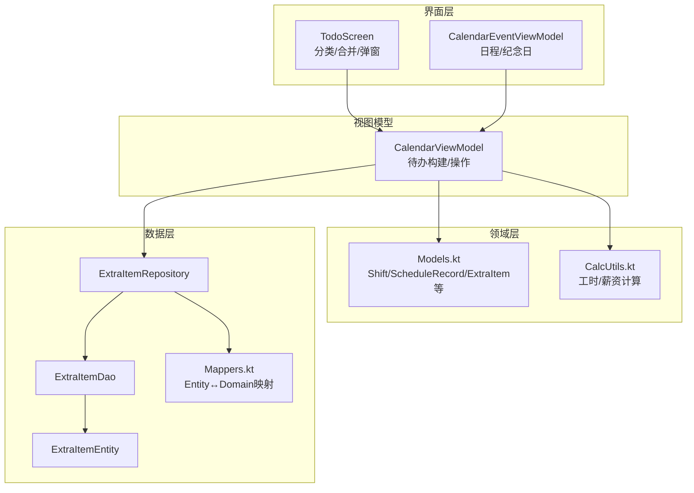
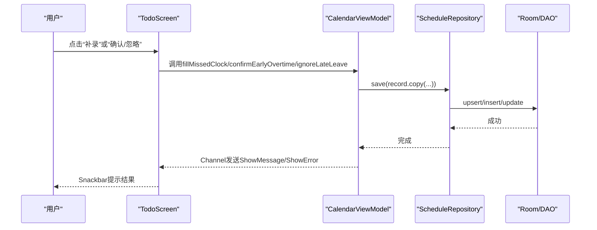
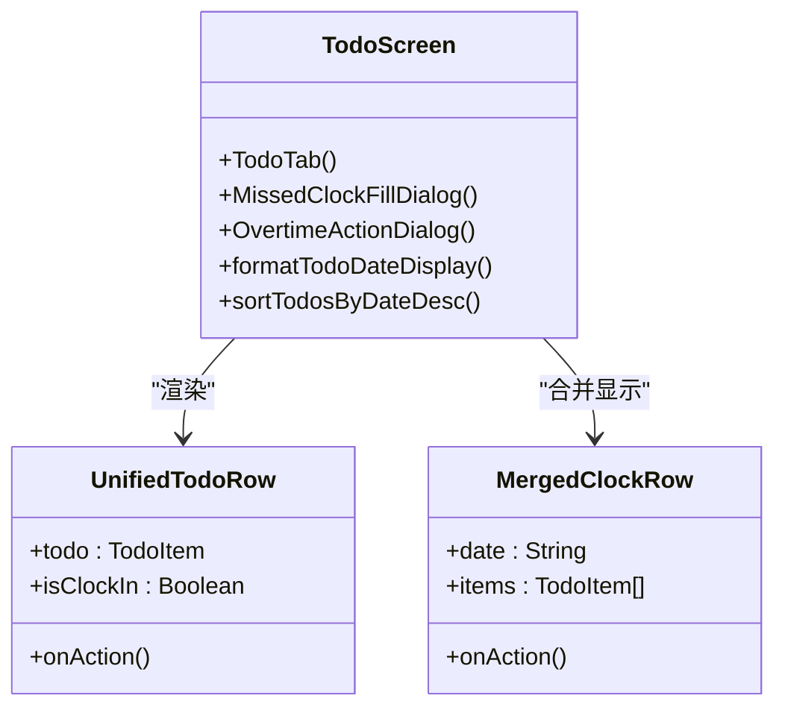
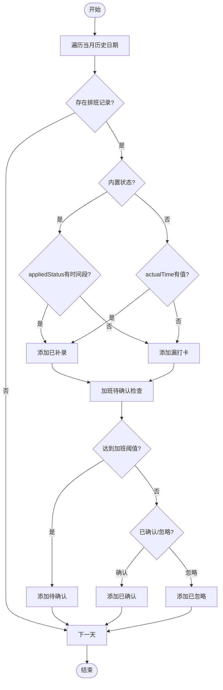
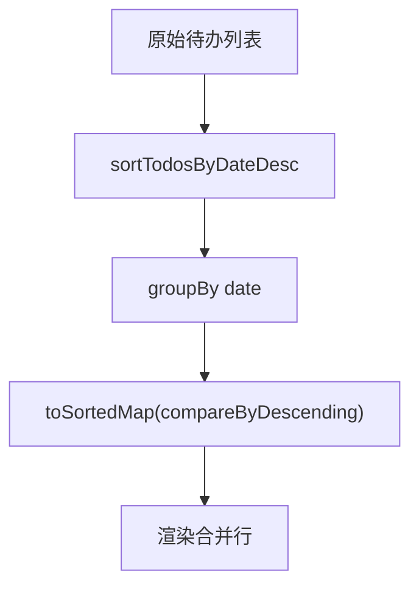
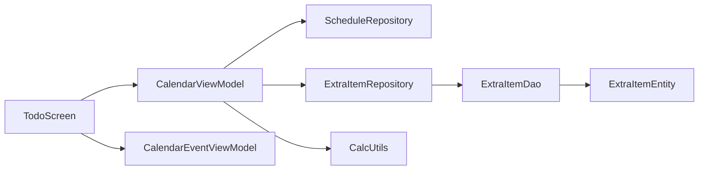

# 待办事项管理

<cite>
**本文引用的文件**   
- [TodoScreen.kt](file://app/src/main/java/com/schedulecalendar/app/ui/todo/TodoScreen.kt)
- [CalendarViewModel.kt](file://app/src/main/java/com/schedulecalendar/app/ui/calendar/CalendarViewModel.kt)
- [Models.kt](file://app/src/main/java/com/schedulecalendar/app/domain/model/Models.kt)
- [CalcUtils.kt](file://app/src/main/java/com/schedulecalendar/app/domain/model/CalcUtils.kt)
- [ExtraItemRepository.kt](file://app/src/main/java/com/schedulecalendar/app/data/repository/ExtraItemRepository.kt)
- [ExtraItemDao.kt](file://app/src/main/java/com/schedulecalendar/app/data/db/dao/ExtraItemDao.kt)
- [ExtraItemEntity.kt](file://app/src/main/java/com/schedulecalendar/app/data/db/entity/ExtraItemEntity.kt)
- [Mappers.kt](file://app/src/main/java/com/schedulecalendar/app/data/repository/Mappers.kt)
- [CalendarEventViewModel.kt](file://app/src/main/java/com/schedulecalendar/app/ui/todo/CalendarEventViewModel.kt)
</cite>

## 目录
1. [简介](#简介)
2. [项目结构](#项目结构)
3. [核心组件](#核心组件)
4. [架构总览](#架构总览)
5. [详细组件分析](#详细组件分析)
6. [依赖关系分析](#依赖关系分析)
7. [性能考量](#性能考量)
8. [故障排查指南](#故障排查指南)
9. [结论](#结论)
10. [附录](#附录)

## 简介
本文件围绕Android排班日历应用中的“待办中心”进行系统化技术文档化，重点覆盖：
- 漏打卡补录、已补录记录、疑似加班确认等模块的实现与交互
- 待办事项的分类显示、合并显示逻辑与状态管理
- 排序算法、日期分组与批量操作
- 数据实时更新机制与用户交互反馈
- 业务规则说明与异常处理策略

## 项目结构
待办中心位于UI层（Compose）与ViewModel协同工作，数据通过Repository与Room DAO访问持久化。关键路径如下：
- UI层：TodoScreen负责分类展示、弹窗交互、事件回调
- ViewModel：CalendarViewModel负责构建待办列表、执行补录/确认/忽略等操作
- 领域模型：Models.kt定义班次、状态、薪资配置等；CalcUtils提供工时计算
- 数据层：ExtraItem相关实体、DAO、Repository用于补贴/扣款项目管理
- 日程扩展：CalendarEventViewModel支撑“日程/纪念日”标签页

图表来源
- [TodoScreen.kt:70-208](file://app/src/main/java/com/schedulecalendar/app/ui/todo/TodoScreen.kt#L70-L208)
- [CalendarViewModel.kt:118-246](file://app/src/main/java/com/schedulecalendar/app/ui/calendar/CalendarViewModel.kt#L118-L246)
- [Models.kt:82-110](file://app/src/main/java/com/schedulecalendar/app/domain/model/Models.kt#L82-L110)
- [CalcUtils.kt:16-113](file://app/src/main/java/com/schedulecalendar/app/domain/model/CalcUtils.kt#L16-L113)
- [ExtraItemRepository.kt:11-30](file://app/src/main/java/com/schedulecalendar/app/data/repository/ExtraItemRepository.kt#L11-L30)
- [ExtraItemDao.kt:8-40](file://app/src/main/java/com/schedulecalendar/app/data/db/dao/ExtraItemDao.kt#L8-L40)
- [ExtraItemEntity.kt:7-15](file://app/src/main/java/com/schedulecalendar/app/data/db/entity/ExtraItemEntity.kt#L7-L15)
- [Mappers.kt:92-128](file://app/src/main/java/com/schedulecalendar/app/data/repository/Mappers.kt#L92-L128)

章节来源
- [TodoScreen.kt:70-208](file://app/src/main/java/com/schedulecalendar/app/ui/todo/TodoScreen.kt#L70-L208)
- [CalendarViewModel.kt:118-246](file://app/src/main/java/com/schedulecalendar/app/ui/calendar/CalendarViewModel.kt#L118-L246)

## 核心组件
- TodoScreen：实现待办中心主界面，包含四个Tab（待办、日程、纪念日、节假日），其中“待办”Tab承载漏打卡补录、已补录、疑似加班确认、是加班、不是加班五大区块。
- CalendarViewModel：维护当前月份数据、构建待办列表、执行补录/确认/忽略/撤销等操作，并通过Channel发送UI事件（导航、消息、错误）。
- Models.kt：定义ScheduleRecord、Shift、ExtraItem、AttendConfig等核心领域模型。
- CalcUtils.kt：提供时间转换、考勤粒度处理、工时/薪资计算等工具方法。
- ExtraItemRepository/Dao/Entity：管理附加补贴/扣款项目的CRUD与归档。
- CalendarEventViewModel：管理系统日历事件读取、编辑、删除与实时监听，支持“日程/纪念日”分类切换。

章节来源
- [TodoScreen.kt:70-208](file://app/src/main/java/com/schedulecalendar/app/ui/todo/TodoScreen.kt#L70-L208)
- [CalendarViewModel.kt:118-246](file://app/src/main/java/com/schedulecalendar/app/ui/calendar/CalendarViewModel.kt#L118-L246)
- [Models.kt:82-110](file://app/src/main/java/com/schedulecalendar/app/domain/model/Models.kt#L82-L110)
- [CalcUtils.kt:16-113](file://app/src/main/java/com/schedulecalendar/app/domain/model/CalcUtils.kt#L16-L113)
- [ExtraItemRepository.kt:11-30](file://app/src/main/java/com/schedulecalendar/app/data/repository/ExtraItemRepository.kt#L11-L30)
- [ExtraItemDao.kt:8-40](file://app/src/main/java/com/schedulecalendar/app/data/db/dao/ExtraItemDao.kt#L8-L40)
- [ExtraItemEntity.kt:7-15](file://app/src/main/java/com/schedulecalendar/app/data/db/entity/ExtraItemEntity.kt#L7-L15)
- [CalendarEventViewModel.kt:45-153](file://app/src/main/java/com/schedulecalendar/app/ui/todo/CalendarEventViewModel.kt#L45-L153)

## 架构总览
待办中心采用MVVM+Flow的响应式架构：
- UI层通过collectAsStateWithLifecycle订阅ViewModel状态变化
- ViewModel组合多个Repository流，计算当月详情与待办项
- 数据变更通过Room Flow自动推送到UI，保证一致性
- 用户交互触发ViewModel方法，更新数据库并推送消息到UI

图表来源
- [TodoScreen.kt:175-208](file://app/src/main/java/com/schedulecalendar/app/ui/todo/TodoScreen.kt#L175-L208)
- [CalendarViewModel.kt:504-587](file://app/src/main/java/com/schedulecalendar/app/ui/calendar/CalendarViewModel.kt#L504-L587)

章节来源
- [CalendarViewModel.kt:153-246](file://app/src/main/java/com/schedulecalendar/app/ui/calendar/CalendarViewModel.kt#L153-L246)

## 详细组件分析

### 待办中心界面（TodoScreen）
- 四大Tab：待办、日程、纪念日、节假日
- 待办Tab内分五个可折叠区块：
  - 漏打卡待补录：同一天上班/下班合并显示
  - 已补录：同一天上班/下班合并显示，支持撤销
  - 疑似加班待确认：早到/晚退分别独立判断
  - 是加班：内联展开列表，支持撤销确认
  - 不是加班：内联展开列表，支持撤销忽略
- 统一行样式UnifiedTodoRow与合并行MergedClockRow，保持视觉一致
- 弹窗：漏打卡补录弹窗（时间选择器）、加班处理弹窗（确认/忽略）

图表来源
- [TodoScreen.kt:225-424](file://app/src/main/java/com/schedulecalendar/app/ui/todo/TodoScreen.kt#L225-L424)
- [TodoScreen.kt:506-597](file://app/src/main/java/com/schedulecalendar/app/ui/todo/TodoScreen.kt#L506-L597)
- [TodoScreen.kt:601-718](file://app/src/main/java/com/schedulecalendar/app/ui/todo/TodoScreen.kt#L601-L718)

章节来源
- [TodoScreen.kt:225-424](file://app/src/main/java/com/schedulecalendar/app/ui/todo/TodoScreen.kt#L225-L424)
- [TodoScreen.kt:506-718](file://app/src/main/java/com/schedulecalendar/app/ui/todo/TodoScreen.kt#L506-L718)

### 待办数据构建与状态管理（CalendarViewModel）
- buildTodos按月遍历历史日期，根据ScheduleRecord与AttendConfig生成待办项
- 内置状态（请假/调休）与普通班次的打卡字段不同（appliedStatus vs actualStartTime/actualEndTime）
- 加班待确认逻辑：早到/晚退分别判断，考虑overtimeGranMin阈值
- 状态流转：PENDING → CONFIRMED/IGNORED，支持撤销回滚

图表来源
- [CalendarViewModel.kt:248-341](file://app/src/main/java/com/schedulecalendar/app/ui/calendar/CalendarViewModel.kt#L248-L341)

章节来源
- [CalendarViewModel.kt:248-341](file://app/src/main/java/com/schedulecalendar/app/ui/calendar/CalendarViewModel.kt#L248-L341)

### 排序算法与日期分组
- 排序：按日期降序，同日期上班在前（由sortTodosByDateDesc实现）
- 分组：按date键分组后转为倒序Map，便于同一天的上班/下班合并显示
- 格式化：formatTodoDateDisplay将日期字符串转换为“MM月dd日”和星期

图表来源
- [TodoScreen.kt:486-502](file://app/src/main/java/com/schedulecalendar/app/ui/todo/TodoScreen.kt#L486-L502)

章节来源
- [TodoScreen.kt:486-502](file://app/src/main/java/com/schedulecalendar/app/ui/todo/TodoScreen.kt#L486-L502)

### 批量操作功能
- 进入批量模式：enterBatchMode/enterDeleteMode/enterCopyMode
- 全选/清空/单选：batchSelectAll/batchClearSelection/batchAddToSelection
- 批量应用排班：batchApplyShift（支持状态与关联补贴项目）
- 批量删除：batchDelete
- 复制排班：enterCopyMode/copyAddToSelection（阶段化流程）

章节来源
- [CalendarViewModel.kt:698-800](file://app/src/main/java/com/schedulecalendar/app/ui/calendar/CalendarViewModel.kt#L698-L800)

### 实时更新机制与用户交互反馈
- StateFlow收集：state.collectAsStateWithLifecycle在UI中订阅
- Channel事件：uiEvent发送NavigateToDetail/ShowMessage/ShowError
- 跨午夜修正：clockOut/fillMissedClock对下班打卡时间早于班次结束的处理
- Snackbar反馈：所有操作成功后通过ShowMessage提示

章节来源
- [CalendarViewModel.kt:131-151](file://app/src/main/java/com/schedulecalendar/app/ui/calendar/CalendarViewModel.kt#L131-L151)
- [CalendarViewModel.kt:475-502](file://app/src/main/java/com/schedulecalendar/app/ui/calendar/CalendarViewModel.kt#L475-L502)
- [CalendarViewModel.kt:504-559](file://app/src/main/java/com/schedulecalendar/app/ui/calendar/CalendarViewModel.kt#L504-L559)

### 业务规则说明
- 漏打卡检测：有班次但缺少打卡记录，上班/下班独立判断
- 加班阈值：overtimeGranMin决定早到/晚退是否计入加班
- 内置状态：请假/调休使用appliedStatus时间段，普通班次使用actualStartTime/actualEndTime
- 跨午夜处理：下班打卡时间早于班次结束视为前一天
- 撤销操作：unfill/unconfirm/unignore对应正向操作的逆操作

章节来源
- [Models.kt:82-110](file://app/src/main/java/com/schedulecalendar/app/domain/model/Models.kt#L82-L110)
- [CalcUtils.kt:61-113](file://app/src/main/java/com/schedulecalendar/app/domain/model/CalcUtils.kt#L61-L113)
- [CalendarViewModel.kt:591-643](file://app/src/main/java/com/schedulecalendar/app/ui/calendar/CalendarViewModel.kt#L591-L643)

### 异常处理策略
- 权限检查：CalendarEventViewModel.checkPermission避免SecurityException
- 网络/IO异常：withContext(Dispatchers.IO)包裹耗时操作，try-catch捕获异常
- 数据解析异常：parseAppliedStatus兼容旧格式，失败返回null
- UI安全：空集合/空对象判空，避免NPE

章节来源
- [CalendarEventViewModel.kt:238-276](file://app/src/main/java/com/schedulecalendar/app/ui/todo/CalendarEventViewModel.kt#L238-L276)
- [Mappers.kt:69-84](file://app/src/main/java/com/schedulecalendar/app/data/repository/Mappers.kt#L69-L84)

## 依赖关系分析
- TodoScreen依赖CalendarViewModel与CalendarEventViewModel
- CalendarViewModel依赖多个Repository（Shift、Schedule、Break、ExtraItem、Status）
- Repository依赖DAO与Entity，通过Mappers进行类型转换
- CalcUtils为纯函数工具类，无外部依赖

图表来源
- [TodoScreen.kt:70-108](file://app/src/main/java/com/schedulecalendar/app/ui/todo/TodoScreen.kt#L70-L108)
- [CalendarViewModel.kt:118-129](file://app/src/main/java/com/schedulecalendar/app/ui/calendar/CalendarViewModel.kt#L118-L129)
- [ExtraItemRepository.kt:11-30](file://app/src/main/java/com/schedulecalendar/app/data/repository/ExtraItemRepository.kt#L11-L30)

章节来源
- [TodoScreen.kt:70-108](file://app/src/main/java/com/schedulecalendar/app/ui/todo/TodoScreen.kt#L70-L108)
- [CalendarViewModel.kt:118-129](file://app/src/main/java/com/schedulecalendar/app/ui/calendar/CalendarViewModel.kt#L118-L129)

## 性能考量
- remember缓存：TodoScreen中对过滤后的待办列表使用remember避免重复计算
- Flow组合：loadCurrentMonth中使用combine一次性收集多源数据，减少多次重组
- LazyColumn：日程/纪念日列表使用LazyColumn提升滚动性能
- 异步操作：耗时操作放入Dispatchers.IO，避免阻塞主线程
- 内存管理：collectJob在切月时取消，防止协程泄漏

章节来源
- [TodoScreen.kt:245-260](file://app/src/main/java/com/schedulecalendar/app/ui/todo/TodoScreen.kt#L245-L260)
- [CalendarViewModel.kt:153-180](file://app/src/main/java/com/schedulecalendar/app/ui/calendar/CalendarViewModel.kt#L153-L180)
- [CalendarEventViewModel.kt:281-300](file://app/src/main/java/com/schedulecalendar/app/ui/todo/CalendarEventViewModel.kt#L281-L300)

## 故障排查指南
- 权限问题：检查READ_CALENDAR权限授予，查看hasPermission状态
- 数据不更新：确认Flow是否正确收集，检查collectJob是否被取消
- 打卡时间异常：验证跨午夜修正逻辑，检查shift.endTime设置
- 加班计算错误：核对overtimeGranMin配置，确认ignoreEarlyArrival/ignoreLateLeave标志
- 弹窗不显示：检查状态变量是否正确更新，LaunchedEffect是否被取消

章节来源
- [CalendarEventViewModel.kt:238-276](file://app/src/main/java/com/schedulecalendar/app/ui/todo/CalendarEventViewModel.kt#L238-L276)
- [CalendarViewModel.kt:137-151](file://app/src/main/java/com/schedulecalendar/app/ui/calendar/CalendarViewModel.kt#L137-L151)
- [CalendarViewModel.kt:483-502](file://app/src/main/java/com/schedulecalendar/app/ui/calendar/CalendarViewModel.kt#L483-L502)

## 结论
待办中心通过清晰的MVVM架构与响应式数据流，实现了完整的漏打卡补录、加班确认等业务场景。界面设计注重用户体验，支持合并显示、批量操作与实时反馈。数据层采用Room与Flow确保一致性与性能。整体代码结构清晰，易于扩展与维护。

## 附录
- 关键枚举：TodoType定义了10种待办类型，涵盖漏打卡、已补录、加班确认/忽略等状态
- 数据结构：TodoItem包含日期、类型、班次信息、打卡时间、加班分钟数等
- 工具方法：CalcUtils提供时间转换、工时计算、薪资统计等核心算法

章节来源
- [CalendarViewModel.kt:35-54](file://app/src/main/java/com/schedulecalendar/app/ui/calendar/CalendarViewModel.kt#L35-L54)
- [CalcUtils.kt:16-113](file://app/src/main/java/com/schedulecalendar/app/domain/model/CalcUtils.kt#L16-L113)