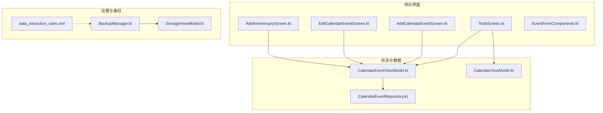
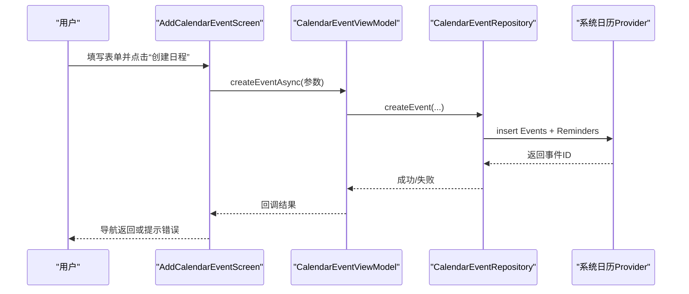
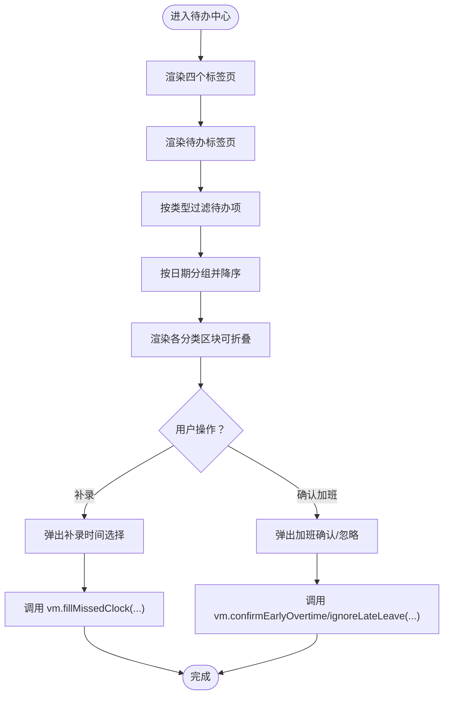
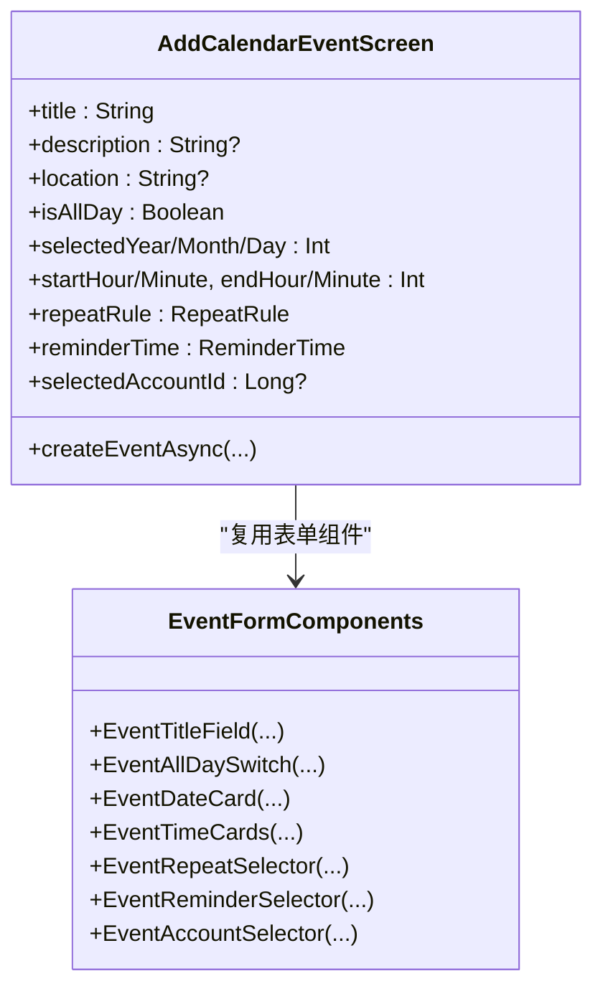
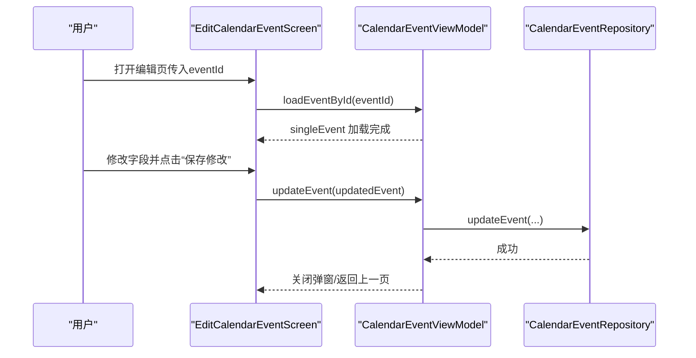
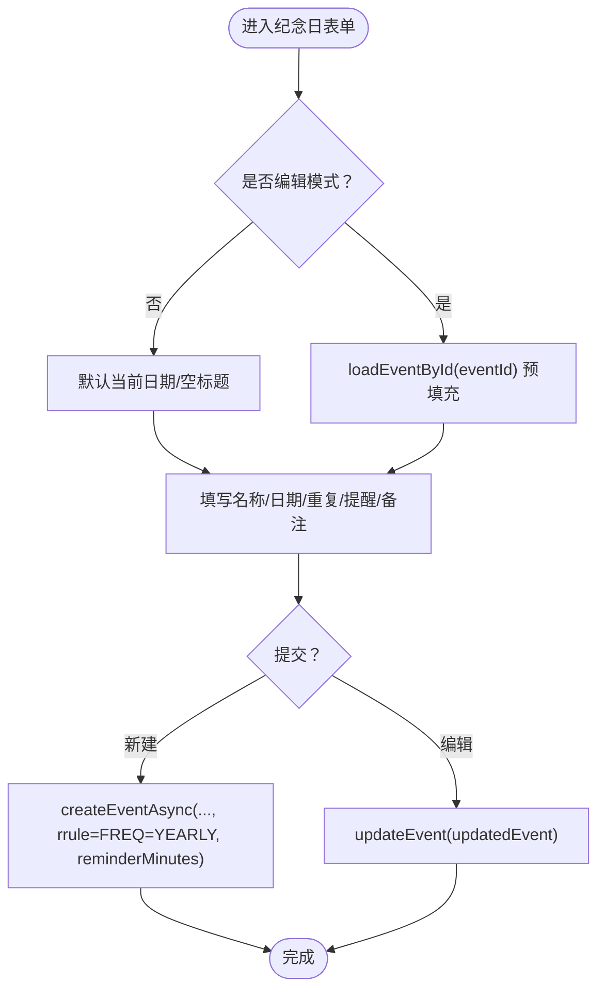
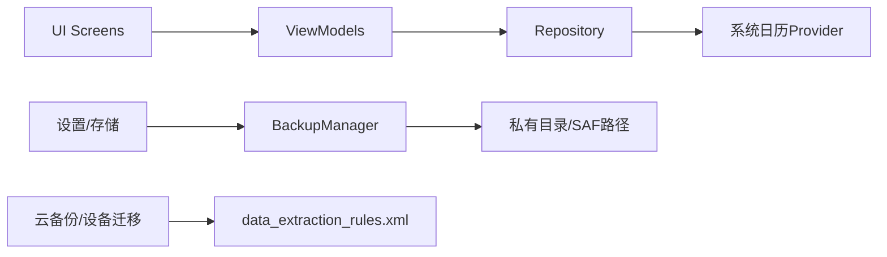

# 待办界面

<cite>
**本文引用的文件**   
- [TodoScreen.kt](file://app/src/main/java/com/schedulecalendar/app/ui/todo/TodoScreen.kt)
- [AddCalendarEventScreen.kt](file://app/src/main/java/com/schedulecalendar/app/ui/todo/AddCalendarEventScreen.kt)
- [EditCalendarEventScreen.kt](file://app/src/main/java/com/schedulecalendar/app/ui/todo/EditCalendarEventScreen.kt)
- [AddAnniversaryScreen.kt](file://app/src/main/java/com/schedulecalendar/app/ui/todo/AddAnniversaryScreen.kt)
- [EventFormComponents.kt](file://app/src/main/java/com/schedulecalendar/app/ui/todo/EventFormComponents.kt)
- [CalendarEventViewModel.kt](file://app/src/main/java/com/schedulecalendar/app/ui/todo/CalendarEventViewModel.kt)
- [CalendarEventRepository.kt](file://app/src/main/java/com/schedulecalendar/app/data/calendar/CalendarEventRepository.kt)
- [CalendarViewModel.kt](file://app/src/main/java/com/schedulecalendar/app/ui/calendar/CalendarViewModel.kt)
- [BackupManager.kt](file://app/src/main/java/com/schedulecalendar/app/ui/settings/BackupManager.kt)
- [StorageViewModel.kt](file://app/src/main/java/com/schedulecalendar/app/ui/settings/StorageViewModel.kt)
- [data_extraction_rules.xml](file://app/src/main/res/xml/data_extraction_rules.xml)
</cite>

## 目录
1. [简介](#简介)
2. [项目结构](#项目结构)
3. [核心组件](#核心组件)
4. [架构总览](#架构总览)
5. [详细组件分析](#详细组件分析)
6. [依赖关系分析](#依赖关系分析)
7. [性能考量](#性能考量)
8. [故障排查指南](#故障排查指南)
9. [结论](#结论)
10. [附录](#附录)

## 简介
本文件面向Android排班日历应用的“待办界面”，聚焦待办事项与纪念日管理的UI实现与交互流程，包括：
- 待办列表（漏打卡补录、已补录、疑似加班确认、是/不是加班等分类）
- 新增日程表单与编辑界面
- 纪念日创建/编辑（支持公历/农历、每年重复、系统日历提醒）
- 日历事件的创建、编辑、删除操作
- 纪念日提醒的设置与管理
- 待办数据的同步与备份恢复机制

## 项目结构
待办界面位于 ui/todo 包下，采用 Compose UI + ViewModel + Repository 的分层结构。核心文件如下：
- TodoScreen.kt：待办中心主页面（标签页+列表+弹窗）
- AddCalendarEventScreen.kt / EditCalendarEventScreen.kt：日程新增/编辑表单
- AddAnniversaryScreen.kt：纪念日新增/编辑表单
- EventFormComponents.kt：共享表单组件（标题、日期、时间、重复、提醒、颜色、账户选择等）
- CalendarEventViewModel.kt：日程与纪念日数据状态与业务编排
- CalendarEventRepository.kt：系统日历Provider读写封装
- CalendarViewModel.kt：待办中心数据模型（TodoItem/TodoType）
- BackupManager.kt / StorageViewModel.kt：备份与恢复管理
- data_extraction_rules.xml：云备份与设备迁移规则

图表来源
- [TodoScreen.kt:1-200](file://app/src/main/java/com/schedulecalendar/app/ui/todo/TodoScreen.kt#L1-L200)
- [AddCalendarEventScreen.kt:1-120](file://app/src/main/java/com/schedulecalendar/app/ui/todo/AddCalendarEventScreen.kt#L1-L120)
- [EditCalendarEventScreen.kt:1-120](file://app/src/main/java/com/schedulecalendar/app/ui/todo/EditCalendarEventScreen.kt#L1-L120)
- [AddAnniversaryScreen.kt:1-120](file://app/src/main/java/com/schedulecalendar/app/ui/todo/AddAnniversaryScreen.kt#L1-L120)
- [EventFormComponents.kt:1-120](file://app/src/main/java/com/schedulecalendar/app/ui/todo/EventFormComponents.kt#L1-L120)
- [CalendarEventViewModel.kt:1-120](file://app/src/main/java/com/schedulecalendar/app/ui/todo/CalendarEventViewModel.kt#L1-L120)
- [CalendarEventRepository.kt:1-120](file://app/src/main/java/com/schedulecalendar/app/data/calendar/CalendarEventRepository.kt#L1-L120)
- [CalendarViewModel.kt:25-59](file://app/src/main/java/com/schedulecalendar/app/ui/calendar/CalendarViewModel.kt#L25-L59)
- [BackupManager.kt:1-120](file://app/src/main/java/com/schedulecalendar/app/ui/settings/BackupManager.kt#L1-L120)
- [StorageViewModel.kt:148-182](file://app/src/main/java/com/schedulecalendar/app/ui/settings/StorageViewModel.kt#L148-L182)
- [data_extraction_rules.xml:1-13](file://app/src/main/res/xml/data_extraction_rules.xml#L1-L13)

章节来源
- [TodoScreen.kt:1-200](file://app/src/main/java/com/schedulecalendar/app/ui/todo/TodoScreen.kt#L1-L200)
- [CalendarViewModel.kt:25-59](file://app/src/main/java/com/schedulecalendar/app/ui/calendar/CalendarViewModel.kt#L25-L59)

## 核心组件
- 待办中心（TodoScreen）
  - 四个标签页：待办、日程、纪念日、节假日
  - 待办分类：漏打卡待补录、已补录、疑似加班待确认、是加班、不是加班
  - 统一行展示（UnifiedTodoRow）、合并打卡行（MergedClockRow）、可折叠区块（TodoCardSection）
  - 弹窗：漏打卡补录时间选择、加班确认/忽略
- 日程表单（AddCalendarEventScreen / EditCalendarEventScreen）
  - 基本信息：标题、全天事件、日期、开始/结束时间
  - 事件设置：重复规则、提醒时间、日历账户选择
  - 详细信息：描述、地点
  - 权限处理：WRITE_CALENDAR 请求时机与失败回退
- 纪念日表单（AddAnniversaryScreen）
  - 名称、公历/农历切换、每年重复开关
  - 系统日历提醒（事件级别 reminder），支持多档提前时间
  - 备注字段；编辑模式支持删除
- 共享表单组件（EventFormComponents）
  - 标题输入、全天开关、日期卡片、时间卡片、重复选择器、提醒选择器、颜色选择器、账户选择器、分组标题
- 状态与数据（CalendarEventViewModel）
  - 账户加载、事件过滤（日程/纪念日）、单事件加载、创建/更新/删除、内容观察者实时刷新
- 数据仓库（CalendarEventRepository）
  - 账户与日历枚举、事件CRUD、本地/纪念日/提醒专用日历创建与排序、批量查询优化、国产ROM兼容提醒扩展属性

章节来源
- [TodoScreen.kt:220-424](file://app/src/main/java/com/schedulecalendar/app/ui/todo/TodoScreen.kt#L220-L424)
- [AddCalendarEventScreen.kt:100-246](file://app/src/main/java/com/schedulecalendar/app/ui/todo/AddCalendarEventScreen.kt#L100-L246)
- [EditCalendarEventScreen.kt:125-239](file://app/src/main/java/com/schedulecalendar/app/ui/todo/EditCalendarEventScreen.kt#L125-L239)
- [AddAnniversaryScreen.kt:187-549](file://app/src/main/java/com/schedulecalendar/app/ui/todo/AddAnniversaryScreen.kt#L187-L549)
- [EventFormComponents.kt:86-533](file://app/src/main/java/com/schedulecalendar/app/ui/todo/EventFormComponents.kt#L86-L533)
- [CalendarEventViewModel.kt:98-153](file://app/src/main/java/com/schedulecalendar/app/ui/todo/CalendarEventViewModel.kt#L98-L153)
- [CalendarEventRepository.kt:163-211](file://app/src/main/java/com/schedulecalendar/app/data/calendar/CalendarEventRepository.kt#L163-L211)

## 架构总览
待办界面遵循 MVVM + Repository 分层：
- UI层（Compose Screen）负责用户交互与状态显示
- ViewModel层聚合业务逻辑、协调Repository与偏好设置
- Repository层封装系统日历Provider读写与本地日历管理
- 设置层提供备份/恢复能力，并通过DataStore持久化配置

图表来源
- [AddCalendarEventScreen.kt:190-246](file://app/src/main/java/com/schedulecalendar/app/ui/todo/AddCalendarEventScreen.kt#L190-L246)
- [CalendarEventViewModel.kt:378-402](file://app/src/main/java/com/schedulecalendar/app/ui/todo/CalendarEventViewModel.kt#L378-L402)
- [CalendarEventRepository.kt:283-337](file://app/src/main/java/com/schedulecalendar/app/data/calendar/CalendarEventRepository.kt#L283-L337)

章节来源
- [CalendarEventViewModel.kt:159-178](file://app/src/main/java/com/schedulecalendar/app/ui/todo/CalendarEventViewModel.kt#L159-L178)
- [CalendarEventRepository.kt:417-516](file://app/src/main/java/com/schedulecalendar/app/data/calendar/CalendarEventRepository.kt#L417-L516)

## 详细组件分析

### 待办中心（TodoScreen）
- 标签页与分页：HorizontalPager + TabRow
- 待办分类与排序：按日期降序，同一天上班/下班合并显示
- 交互弹窗：漏打卡补录时间选择、加班确认/忽略
- 月份切换控件：上月/本月/下月导航

图表来源
- [TodoScreen.kt:140-208](file://app/src/main/java/com/schedulecalendar/app/ui/todo/TodoScreen.kt#L140-L208)
- [TodoScreen.kt:226-424](file://app/src/main/java/com/schedulecalendar/app/ui/todo/TodoScreen.kt#L226-L424)

章节来源
- [TodoScreen.kt:140-208](file://app/src/main/java/com/schedulecalendar/app/ui/todo/TodoScreen.kt#L140-L208)
- [TodoScreen.kt:226-424](file://app/src/main/java/com/schedulecalendar/app/ui/todo/TodoScreen.kt#L226-L424)
- [CalendarViewModel.kt:25-59](file://app/src/main/java/com/schedulecalendar/app/ui/calendar/CalendarViewModel.kt#L25-L59)

### 日程新增表单（AddCalendarEventScreen）
- 表单字段：标题、描述、地点、全天事件、日期、开始/结束时间、重复规则、提醒时间、日历账户
- 权限处理：进入页面即请求 WRITE_CALENDAR，未授权时引导授权
- 提交逻辑：组装时间戳与RRULE，调用 ViewModel 异步创建

图表来源
- [AddCalendarEventScreen.kt:100-246](file://app/src/main/java/com/schedulecalendar/app/ui/todo/AddCalendarEventScreen.kt#L100-L246)
- [EventFormComponents.kt:86-307](file://app/src/main/java/com/schedulecalendar/app/ui/todo/EventFormComponents.kt#L86-L307)

章节来源
- [AddCalendarEventScreen.kt:100-246](file://app/src/main/java/com/schedulecalendar/app/ui/todo/AddCalendarEventScreen.kt#L100-L246)
- [EventFormComponents.kt:86-307](file://app/src/main/java/com/schedulecalendar/app/ui/todo/EventFormComponents.kt#L86-L307)

### 日程编辑表单（EditCalendarEventScreen）
- 预填充：根据 eventId 加载单个事件，初始化表单状态
- 保存逻辑：构造更新后的 CalendarEventInfo，调用 updateEvent
- 权限处理：与新增一致，确保写入权限

图表来源
- [EditCalendarEventScreen.kt:42-66](file://app/src/main/java/com/schedulecalendar/app/ui/todo/EditCalendarEventScreen.kt#L42-L66)
- [EditCalendarEventScreen.kt:186-232](file://app/src/main/java/com/schedulecalendar/app/ui/todo/EditCalendarEventScreen.kt#L186-L232)
- [CalendarEventViewModel.kt:407-417](file://app/src/main/java/com/schedulecalendar/app/ui/todo/CalendarEventViewModel.kt#L407-L417)

章节来源
- [EditCalendarEventScreen.kt:125-239](file://app/src/main/java/com/schedulecalendar/app/ui/todo/EditCalendarEventScreen.kt#L125-L239)
- [CalendarEventViewModel.kt:407-417](file://app/src/main/java/com/schedulecalendar/app/ui/todo/CalendarEventViewModel.kt#L407-L417)

### 纪念日新增/编辑（AddAnniversaryScreen）
- 公历/农历切换：支持传统农历名称与转换
- 每年重复：通过 RRULE FREQ=YEARLY 标记
- 系统日历提醒：事件级别提醒，支持多档提前时间
- 编辑模式：支持删除事件

图表来源
- [AddAnniversaryScreen.kt:187-549](file://app/src/main/java/com/schedulecalendar/app/ui/todo/AddAnniversaryScreen.kt#L187-L549)

章节来源
- [AddAnniversaryScreen.kt:187-549](file://app/src/main/java/com/schedulecalendar/app/ui/todo/AddAnniversaryScreen.kt#L187-L549)

### 共享表单组件（EventFormComponents）
- 重复规则：NONE/DAILY/WEEKLY/BIWEEKLY/MONTHLY/YEARLY，映射到RRULE
- 提醒时间：NONE/AT_TIME/FIVE_MIN/FIFTEEN_MIN/THIRTY_MIN/ONE_HOUR/TWO_HOUR/ONE_DAY
- 颜色选择：预设色板，选中高亮
- 账户选择：按显示名/账户名智能显示，支持单选

章节来源
- [EventFormComponents.kt:33-533](file://app/src/main/java/com/schedulecalendar/app/ui/todo/EventFormComponents.kt#L33-L533)

### 状态与数据（CalendarEventViewModel）
- 账户加载与分类映射：应用自身账户优先，外部账户按分类过滤
- 事件过滤：日程与纪念日分离，纪念日特征为标题前缀与年度重复
- 单事件加载：按ID直接查询，避免全量列表依赖
- 内容观察者：监听系统日历变化，自动刷新列表

章节来源
- [CalendarEventViewModel.kt:98-153](file://app/src/main/java/com/schedulecalendar/app/ui/todo/CalendarEventViewModel.kt#L98-L153)
- [CalendarEventViewModel.kt:281-300](file://app/src/main/java/com/schedulecalendar/app/ui/todo/CalendarEventViewModel.kt#L281-L300)

### 数据仓库（CalendarEventRepository）
- 账户与日历：获取所有可见日历并按类型排序（日程/纪念日/提醒/外部）
- 事件CRUD：批量查询优化（先批量加载日历信息），创建事件时设置提醒与扩展属性
- 本地日历：自动创建应用本地日历（日程/纪念日/提醒），保证可见性与同步

章节来源
- [CalendarEventRepository.kt:66-114](file://app/src/main/java/com/schedulecalendar/app/data/calendar/CalendarEventRepository.kt#L66-L114)
- [CalendarEventRepository.kt:163-211](file://app/src/main/java/com/schedulecalendar/app/data/calendar/CalendarEventRepository.kt#L163-L211)
- [CalendarEventRepository.kt:283-337](file://app/src/main/java/com/schedulecalendar/app/data/calendar/CalendarEventRepository.kt#L283-L337)
- [CalendarEventRepository.kt:417-516](file://app/src/main/java/com/schedulecalendar/app/data/calendar/CalendarEventRepository.kt#L417-L516)

## 依赖关系分析
- UI层依赖ViewModel进行状态管理与业务编排
- ViewModel依赖Repository访问系统日历Provider与本地日历管理
- 设置层通过BackupManager对应用数据进行备份/恢复，并通过DataStore持久化配置
- 云备份与设备迁移由 data_extraction_rules.xml 控制

图表来源
- [CalendarEventViewModel.kt:159-178](file://app/src/main/java/com/schedulecalendar/app/ui/todo/CalendarEventViewModel.kt#L159-L178)
- [CalendarEventRepository.kt:163-211](file://app/src/main/java/com/schedulecalendar/app/data/calendar/CalendarEventRepository.kt#L163-L211)
- [BackupManager.kt:184-227](file://app/src/main/java/com/schedulecalendar/app/ui/settings/BackupManager.kt#L184-L227)
- [data_extraction_rules.xml:1-13](file://app/src/main/res/xml/data_extraction_rules.xml#L1-L13)

章节来源
- [CalendarEventViewModel.kt:159-178](file://app/src/main/java/com/schedulecalendar/app/ui/todo/CalendarEventViewModel.kt#L159-L178)
- [BackupManager.kt:184-227](file://app/src/main/java/com/schedulecalendar/app/ui/settings/BackupManager.kt#L184-L227)

## 性能考量
- 批量查询日历信息：避免N+1查询，提升事件加载性能
- 内容观察者：仅当系统日历变化时触发刷新，减少无效重建
- 表单组件复用：减少重复代码与重组开销
- 权限检查前置：避免无权限时的异常与崩溃

章节来源
- [CalendarEventRepository.kt:242-267](file://app/src/main/java/com/schedulecalendar/app/data/calendar/CalendarEventRepository.kt#L242-L267)
- [CalendarEventViewModel.kt:281-300](file://app/src/main/java/com/schedulecalendar/app/ui/todo/CalendarEventViewModel.kt#L281-L300)

## 故障排查指南
- 权限问题：确认 WRITE_CALENDAR 与 READ_CALENDAR 权限已授予
- 创建失败：检查是否有可用日历账户，查看系统日志中的 SecurityException
- 提醒不生效：确认 HAS_ALARM 标志与 ExtendedProperties 设置，部分国产ROM需额外兼容
- 备份恢复失败：检查备份文件格式与路径权限，确认SAF URI权限已持久化

章节来源
- [CalendarEventRepository.kt:283-337](file://app/src/main/java/com/schedulecalendar/app/data/calendar/CalendarEventRepository.kt#L283-L337)
- [BackupManager.kt:54-63](file://app/src/main/java/com/schedulecalendar/app/ui/settings/BackupManager.kt#L54-L63)

## 结论
待办界面通过清晰的MVVM架构与丰富的Composable组件，实现了完整的待办事项与纪念日管理功能。结合系统日历Provider与本地日历管理，提供了稳定的事件创建、编辑、删除与提醒能力。备份恢复机制确保了数据安全与跨设备迁移的便利性。

## 附录
- 待办数据模型（TodoItem/TodoType）定义与用途
- 重复规则与提醒时间的枚举值说明
- 备份文件格式与恢复流程示例

章节来源
- [CalendarViewModel.kt:25-59](file://app/src/main/java/com/schedulecalendar/app/ui/calendar/CalendarViewModel.kt#L25-L59)
- [EventFormComponents.kt:33-533](file://app/src/main/java/com/schedulecalendar/app/ui/todo/EventFormComponents.kt#L33-L533)
- [BackupManager.kt:366-377](file://app/src/main/java/com/schedulecalendar/app/ui/settings/BackupManager.kt#L366-L377)