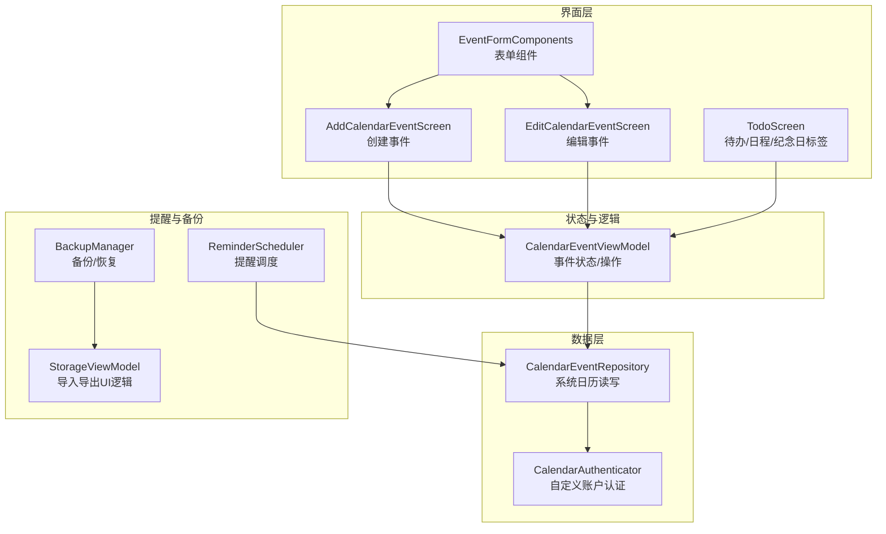
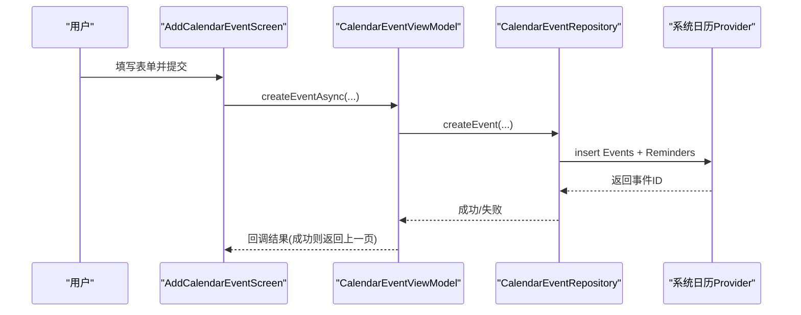
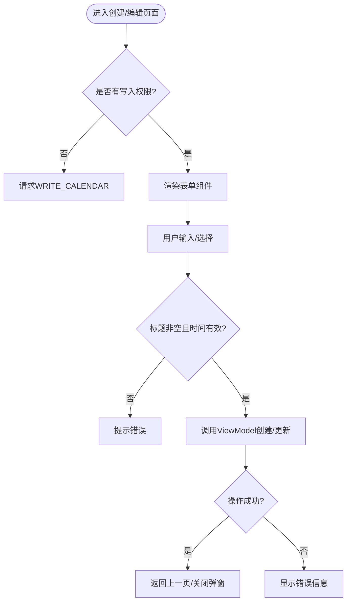
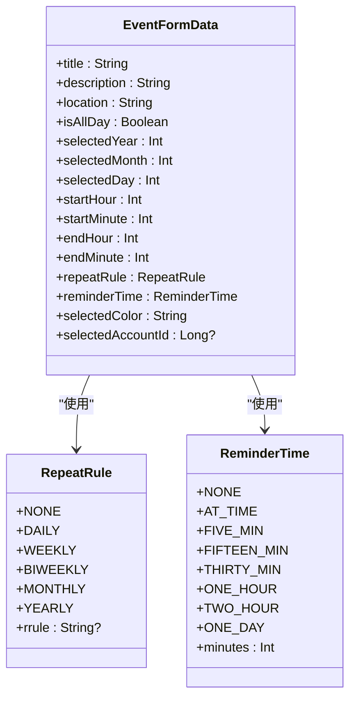
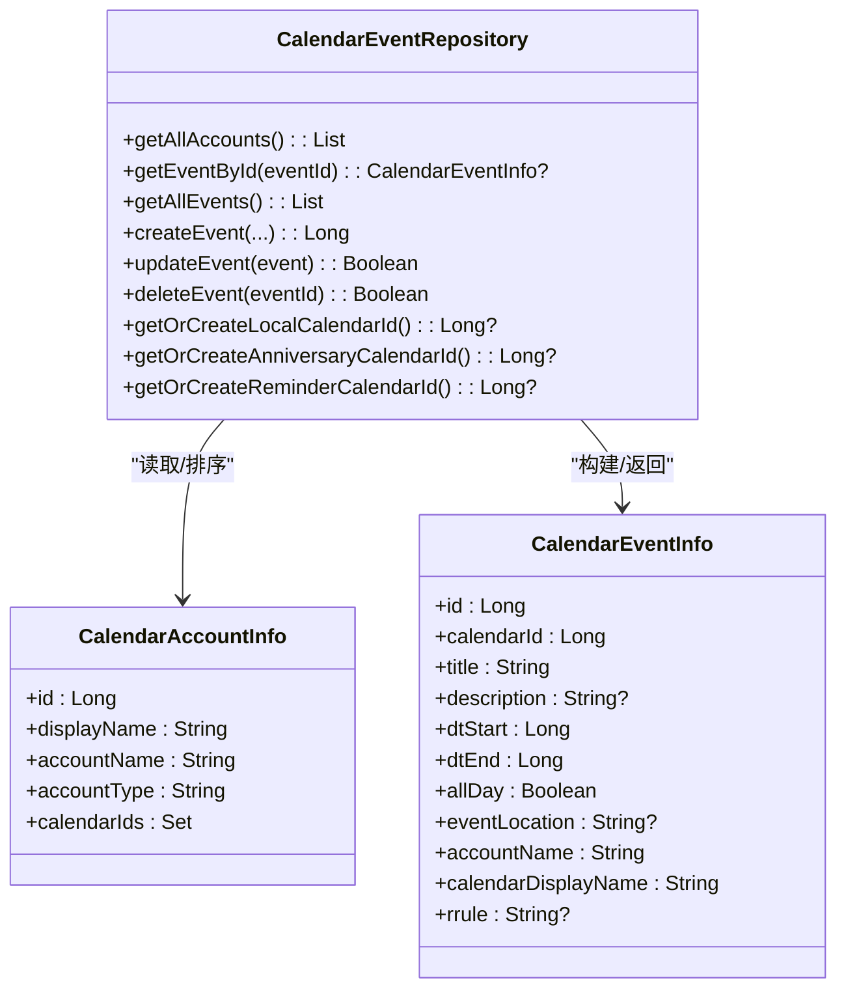
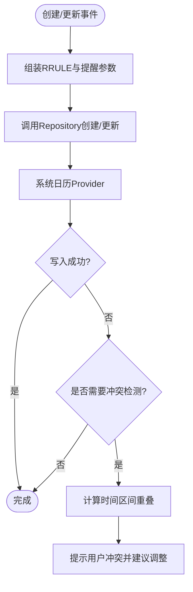
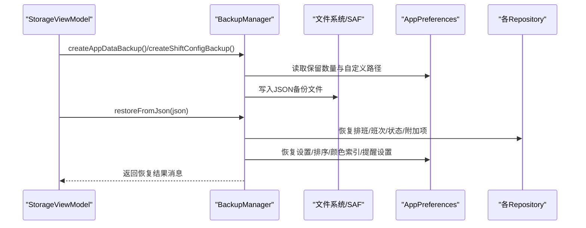
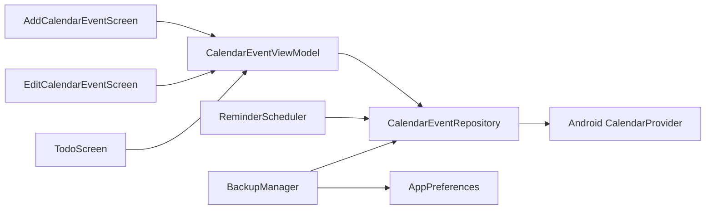

# 日历事件管理

<cite>
**本文引用的文件**   
- [AddCalendarEventScreen.kt](file://app/src/main/java/com/schedulecalendar/app/ui/todo/AddCalendarEventScreen.kt)
- [EditCalendarEventScreen.kt](file://app/src/main/java/com/schedulecalendar/app/ui/todo/EditCalendarEventScreen.kt)
- [EventFormComponents.kt](file://app/src/main/java/com/schedulecalendar/app/ui/todo/EventFormComponents.kt)
- [CalendarEventViewModel.kt](file://app/src/main/java/com/schedulecalendar/app/ui/tod o/CalendarEventViewModel.kt)
- [CalendarEventRepository.kt](file://app/src/main/java/com/schedulecalendar/app/data/calendar/CalendarEventRepository.kt)
- [CalendarAuthenticator.kt](file://app/src/main/java/com/schedulecalendar/app/data/calendar/CalendarAuthenticator.kt)
- [TodoScreen.kt](file://app/src/main/java/com/schedulecalendar/app/ui/todo/TodoScreen.kt)
- [ReminderSettingsViewModel.kt](file://app/src/main/java/com/schedulecalendar/app/ui/settings/ReminderSettingsViewModel.kt)
- [BackupManager.kt](file://app/src/main/java/com/schedulecalendar/app/ui/settings/BackupManager.kt)
- [StorageViewModel.kt](file://app/src/main/java/com/schedulecalendar/app/ui/settings/StorageViewModel.kt)
- [ReminderScheduler.kt](file://app/src/main/java/com/schedulecalendar/app/reminder/ReminderScheduler.kt)
</cite>

## 目录
1. [简介](#简介)
2. [项目结构](#项目结构)
3. [核心组件](#核心组件)
4. [架构总览](#架构总览)
5. [详细组件分析](#详细组件分析)
6. [依赖关系分析](#依赖关系分析)
7. [性能考量](#性能考量)
8. [故障排查指南](#故障排查指南)
9. [结论](#结论)
10. [附录](#附录)

## 简介
本文件围绕 Android 排班日历应用中的“日历事件管理”进行系统化文档化，覆盖事件创建、编辑与删除的 UI 实现、表单组件设计与数据绑定机制；系统日历同步集成与权限处理；提醒设置、重复规则与冲突检测；事件数据模型与持久化方案；以及事件导入导出与备份恢复的实现细节。目标是帮助开发者快速理解并扩展该模块。

## 项目结构
与日历事件管理相关的代码主要分布在以下包：
- ui/todo：事件创建/编辑页面与共享表单组件、主入口标签页
- data/calendar：系统日历账户与事件的仓库层（读写 CalendarProvider）
- reminder：提醒调度器（闹钟/日历模式）
- settings：备份与存储管理（含导入导出）

图表来源 
- [AddCalendarEventScreen.kt](file://app/src/main/java/com/schedulecalendar/app/ui/todo/AddCalendarEventScreen.kt)
- [EditCalendarEventScreen.kt](file://app/src/main/java/com/schedulecalendar/app/ui/todo/EditCalendarEventScreen.kt)
- [EventFormComponents.kt](file://app/src/main/java/com/schedulecalendar/app/ui/todo/EventFormComponents.kt)
- [CalendarEventViewModel.kt](file://app/src/main/java/com/schedulecalendar/app/ui/todo/CalendarEventViewModel.kt)
- [CalendarEventRepository.kt](file://app/src/main/java/com/schedulecalendar/app/data/calendar/CalendarEventRepository.kt)
- [CalendarAuthenticator.kt](file://app/src/main/java/com/schedulecalendar/app/data/calendar/CalendarAuthenticator.kt)
- [TodoScreen.kt](file://app/src/main/java/com/schedulecalendar/app/ui/todo/TodoScreen.kt)
- [ReminderScheduler.kt](file://app/src/main/java/com/schedulecalendar/app/reminder/ReminderScheduler.kt)
- [BackupManager.kt](file://app/src/main/java/com/schedulecalendar/app/ui/settings/BackupManager.kt)
- [StorageViewModel.kt](file://app/src/main/java/com/schedulecalendar/app/ui/settings/StorageViewModel.kt)

章节来源
- [AddCalendarEventScreen.kt](file://app/src/main/java/com/schedulecalendar/app/ui/todo/AddCalendarEventScreen.kt)
- [EditCalendarEventScreen.kt](file://app/src/main/java/com/schedulecalendar/app/ui/todo/EditCalendarEventScreen.kt)
- [EventFormComponents.kt](file://app/src/main/java/com/schedulecalendar/app/ui/todo/EventFormComponents.kt)
- [CalendarEventViewModel.kt](file://app/src/main/java/com/schedulecalendar/app/ui/todo/CalendarEventViewModel.kt)
- [CalendarEventRepository.kt](file://app/src/main/java/com/schedulecalendar/app/data/calendar/CalendarEventRepository.kt)
- [CalendarAuthenticator.kt](file://app/src/main/java/com/schedulecalendar/app/data/calendar/CalendarAuthenticator.kt)
- [TodoScreen.kt](file://app/src/main/java/com/schedulecalendar/app/ui/todo/TodoScreen.kt)
- [ReminderScheduler.kt](file://app/src/main/java/com/schedulecalendar/app/reminder/ReminderScheduler.kt)
- [BackupManager.kt](file://app/src/main/java/com/schedulecalendar/app/ui/settings/BackupManager.kt)
- [StorageViewModel.kt](file://app/src/main/java/com/schedulecalendar/app/ui/settings/StorageViewModel.kt)

## 核心组件
- 事件创建/编辑页面：AddCalendarEventScreen、EditCalendarEventScreen
- 共享表单组件：EventFormComponents（标题、日期时间、全天开关、重复规则、提醒、颜色、地点、描述、日历账户选择等）
- 事件 ViewModel：CalendarEventViewModel（权限检查、账户加载、事件列表与单条事件加载、CRUD 操作、分类切换）
- 系统日历仓库：CalendarEventRepository（账户与事件查询、创建/更新/删除、本地/纪念日/提醒专用日历管理、RRULE、提醒设置）
- 自定义账户认证：CalendarAuthenticator（使应用自有账户在系统日历中可见）
- 提醒调度：ReminderScheduler（闹钟/日历两种提醒模式，自动清理与重建）
- 备份与导入导出：BackupManager、StorageViewModel（应用数据与班次配置备份、恢复、JSON 导入导出）

章节来源
- [AddCalendarEventScreen.kt](file://app/src/main/java/com/schedulecalendar/app/ui/todo/AddCalendarEventScreen.kt)
- [EditCalendarEventScreen.kt](file://app/src/main/java/com/schedulecalendar/app/ui/todo/EditCalendarEventScreen.kt)
- [EventFormComponents.kt](file://app/src/main/java/com/schedulecalendar/app/ui/todo/EventFormComponents.kt)
- [CalendarEventViewModel.kt](file://app/src/main/java/com/schedulecalendar/app/ui/todo/CalendarEventViewModel.kt)
- [CalendarEventRepository.kt](file://app/src/main/java/com/schedulecalendar/app/data/calendar/CalendarEventRepository.kt)
- [CalendarAuthenticator.kt](file://app/src/main/java/com/schedulecalendar/app/data/calendar/CalendarAuthenticator.kt)
- [ReminderScheduler.kt](file://app/src/main/java/com/schedulecalendar/app/reminder/ReminderScheduler.kt)
- [BackupManager.kt](file://app/src/main/java/com/schedulecalendar/app/ui/settings/BackupManager.kt)
- [StorageViewModel.kt](file://app/src/main/java/com/schedulecalendar/app/ui/settings/StorageViewModel.kt)

## 架构总览
事件管理采用 MVVM + Repository 分层：
- UI 层（Compose 页面）负责用户交互与表单状态展示
- ViewModel 层负责状态管理与业务编排（权限、账户、事件 CRUD、分类过滤）
- Repository 层封装对系统日历 Provider 的读写，包含账户/日历/事件操作
- 提醒调度器根据设置将提醒落地为系统日历事件或闹钟
- 备份管理器提供 JSON 格式的导入导出与恢复

图表来源 
- [AddCalendarEventScreen.kt](file://app/src/main/java/com/schedulecalendar/app/ui/todo/AddCalendarEventScreen.kt)
- [CalendarEventViewModel.kt](file://app/src/main/java/com/schedulecalendar/app/ui/todo/CalendarEventViewModel.kt)
- [CalendarEventRepository.kt](file://app/src/main/java/com/schedulecalendar/app/data/calendar/CalendarEventRepository.kt)

章节来源
- [AddCalendarEventScreen.kt](file://app/src/main/java/com/schedulecalendar/app/ui/todo/AddCalendarEventScreen.kt)
- [CalendarEventViewModel.kt](file://app/src/main/java/com/schedulecalendar/app/ui/todo/CalendarEventViewModel.kt)
- [CalendarEventRepository.kt](file://app/src/main/java/com/schedulecalendar/app/data/calendar/CalendarEventRepository.kt)

## 详细组件分析

### 事件创建与编辑 UI
- 创建页面（AddCalendarEventScreen）
  - 表单字段：标题、描述、地点、是否全天、日期、开始/结束时间、重复规则、提醒时间、日历账户选择
  - 权限处理：进入页面即请求 WRITE_CALENDAR，未授权时阻止提交并引导授权
  - 默认行为：预置日程专用日历 ID，过滤已禁用账户
  - 提交流程：组装时间戳与 RRULE，调用 ViewModel 异步创建，成功后返回上一页
- 编辑页面（EditCalendarEventScreen）
  - 按 ID 加载单个事件，预填充表单
  - 保存时生成新的 CalendarEventInfo 并调用 updateEvent
  - 权限处理与创建页面一致

图表来源 
- [AddCalendarEventScreen.kt](file://app/src/main/java/com/schedulecalendar/app/ui/todo/AddCalendarEventScreen.kt)
- [EditCalendarEventScreen.kt](file://app/src/main/java/com/schedulecalendar/app/ui/todo/EditCalendarEventScreen.kt)

章节来源
- [AddCalendarEventScreen.kt](file://app/src/main/java/com/schedulecalendar/app/ui/todo/AddCalendarEventScreen.kt)
- [EditCalendarEventScreen.kt](file://app/src/main/java/com/schedulecalendar/app/ui/todo/EditCalendarEventScreen.kt)

### 事件表单组件与数据绑定
- 组件设计
  - EventTitleField、EventAllDaySwitch、EventDateCard、EventTimeCards、EventDescriptionField、EventLocationField
  - EventRepeatSelector（枚举 RepeatRule，映射到 RRULE 字符串）
  - EventReminderSelector（枚举 ReminderTime，分钟数映射到系统提醒）
  - EventColorSelector（预设颜色集合）
  - EventAccountSelector（账户列表与显示名策略）
- 数据绑定
  - 页面内使用 remember/mutableStateOf 维护表单状态
  - 通过 Compose 的单向数据流将状态传递给子组件
  - 提交时将状态转换为 CalendarEventInfo 或参数对象传给 ViewModel

图表来源 
- [EventFormComponents.kt](file://app/src/main/java/com/schedulecalendar/app/ui/todo/EventFormComponents.kt)

章节来源
- [EventFormComponents.kt](file://app/src/main/java/com/schedulecalendar/app/ui/todo/EventFormComponents.kt)

### 事件与系统日历同步集成与权限处理
- 权限
  - READ_CALENDAR/WRITE_CALENDAR 动态申请
  - ViewModel 在进入页面与操作前检查权限，避免 SecurityException
- 账户与日历
  - CalendarEventRepository.getAllAccounts() 获取所有可见日历并按类型排序
  - getOrCreateLocalCalendarId()/getOrCreateAnniversaryCalendarId()/getOrCreateReminderCalendarId() 确保应用自有账户与三类专用日历存在
  - 自定义 CalendarAuthenticator 注册账户类型，使账户在系统设置中可见
- 事件读写
  - getAllEvents()/getEventById() 批量优化（先加载日历信息 Map，再遍历事件）
  - createEvent/updateEvent/deleteEvent 直接操作 CalendarContract.Events

图表来源 
- [CalendarEventRepository.kt](file://app/src/main/java/com/schedulecalendar/app/data/calendar/CalendarEventRepository.kt)

章节来源
- [CalendarEventRepository.kt](file://app/src/main/java/com/schedulecalendar/app/data/calendar/CalendarEventRepository.kt)
- [CalendarAuthenticator.kt](file://app/src/main/java/com/schedulecalendar/app/data/calendar/CalendarAuthenticator.kt)

### 事件提醒设置、重复规则与冲突检测
- 提醒设置
  - ReminderTime 枚举映射到分钟数，createEvent 中设置 HAS_ALARM 与 Reminders
  - 国产 ROM 兼容：通过 ExtendedProperties 写入 {"need_alarm":true}
  - ReminderScheduler 支持闹钟/日历两种模式，切换时清理并重载提醒
- 重复规则
  - RepeatRule 枚举映射到 RRULE 字符串（如 FREQ=WEEKLY;INTERVAL=2）
  - 纪念日事件通过标题前缀与年度重复标记区分
- 冲突检测
  - 当前仓库层未实现显式冲突检测；建议在创建/更新前基于 DTSTART/DTEND 与 RRULE 计算展开区间进行重叠判断
  - 可在 ViewModel 层增加校验并在 UI 提示用户

图表来源 
- [CalendarEventRepository.kt](file://app/src/main/java/com/schedulecalendar/app/data/calendar/CalendarEventRepository.kt)
- [ReminderSettingsViewModel.kt](file://app/src/main/java/com/schedulecalendar/app/ui/settings/ReminderSettingsViewModel.kt)
- [ReminderScheduler.kt](file://app/src/main/java/com/schedulecalendar/app/reminder/ReminderScheduler.kt)

章节来源
- [CalendarEventRepository.kt](file://app/src/main/java/com/schedulecalendar/app/data/calendar/CalendarEventRepository.kt)
- [ReminderSettingsViewModel.kt](file://app/src/main/java/com/schedulecalendar/app/ui/settings/ReminderSettingsViewModel.kt)
- [ReminderScheduler.kt](file://app/src/main/java/com/schedulecalendar/app/reminder/ReminderScheduler.kt)

### 事件数据模型与持久化存储
- 数据模型
  - CalendarEventInfo：事件基本信息、时间、全天标志、地点、账户与日历显示名、RRULE
  - CalendarAccountInfo：账户与日历 ID 集合
- 持久化
  - 事件数据直接持久化到系统日历 Provider（CalendarContract.Events）
  - 应用自身数据（排班记录、班次配置、附加项、设置）通过 Room/Preferences/DataStore 存储，并由 BackupManager 统一备份为 JSON

章节来源
- [CalendarEventRepository.kt](file://app/src/main/java/com/schedulecalendar/app/data/calendar/CalendarEventRepository.kt)

### 事件导入导出与备份恢复
- 备份范围
  - 应用数据：排班记录、班次配置、附加项目、设置（含提醒设置、排序顺序、颜色索引、快捷方式开关等）
  - 班次配置：仅班次、不计时段、状态类型（可共享）
- 备份策略
  - 自动备份：应用数据每天保留最新一条；班次配置每次修改生成新备份
  - 手动备份：由 StorageViewModel 触发，文件名带 _manual 标识
  - 路径支持：私有目录与 SAF 外部路径（content URI），启动时裁剪保留数量
- 导入恢复
  - 从 JSON 内容识别类型并恢复对应数据
  - 恢复后刷新相关列表与状态

图表来源 
- [BackupManager.kt](file://app/src/main/java/com/schedulecalendar/app/ui/settings/BackupManager.kt)
- [StorageViewModel.kt](file://app/src/main/java/com/schedulecalendar/app/ui/settings/StorageViewModel.kt)

章节来源
- [BackupManager.kt](file://app/src/main/java/com/schedulecalendar/app/ui/settings/BackupManager.kt)
- [StorageViewModel.kt](file://app/src/main/java/com/schedulecalendar/app/ui/settings/StorageViewModel.kt)

## 依赖关系分析
- UI 层依赖 ViewModel：Add/Edit 页面通过 hiltViewModel 注入 CalendarEventViewModel
- ViewModel 依赖 Repository：CalendarEventRepository 封装系统日历访问
- Repository 依赖系统 API：CalendarContract、AccountManager、ContentResolver
- 提醒调度器依赖 Repository：创建/清理提醒事件
- 备份管理器依赖多个 Repository 与 Preferences：聚合数据生成 JSON

图表来源 
- [AddCalendarEventScreen.kt](file://app/src/main/java/com/schedulecalendar/app/ui/todo/AddCalendarEventScreen.kt)
- [EditCalendarEventScreen.kt](file://app/src/main/java/com/schedulecalendar/app/ui/todo/EditCalendarEventScreen.kt)
- [TodoScreen.kt](file://app/src/main/java/com/schedulecalendar/app/ui/todo/TodoScreen.kt)
- [CalendarEventViewModel.kt](file://app/src/main/java/com/schedulecalendar/app/ui/todo/CalendarEventViewModel.kt)
- [CalendarEventRepository.kt](file://app/src/main/java/com/schedulecalendar/app/data/calendar/CalendarEventRepository.kt)
- [ReminderScheduler.kt](file://app/src/main/java/com/schedulecalendar/app/reminder/ReminderScheduler.kt)
- [BackupManager.kt](file://app/src/main/java/com/schedulecalendar/app/ui/settings/BackupManager.kt)

章节来源
- [AddCalendarEventScreen.kt](file://app/src/main/java/com/schedulecalendar/app/ui/todo/AddCalendarEventScreen.kt)
- [EditCalendarEventScreen.kt](file://app/src/main/java/com/schedulecalendar/app/ui/todo/EditCalendarEventScreen.kt)
- [TodoScreen.kt](file://app/src/main/java/com/schedulecalendar/app/ui/todo/TodoScreen.kt)
- [CalendarEventViewModel.kt](file://app/src/main/java/com/schedulecalendar/app/ui/todo/CalendarEventViewModel.kt)
- [CalendarEventRepository.kt](file://app/src/main/java/com/schedulecalendar/app/data/calendar/CalendarEventRepository.kt)
- [ReminderScheduler.kt](file://app/src/main/java/com/schedulecalendar/app/reminder/ReminderScheduler.kt)
- [BackupManager.kt](file://app/src/main/java/com/schedulecalendar/app/ui/settings/BackupManager.kt)

## 性能考量
- 批量加载日历信息：getAllEvents 先一次性加载 Calendars 信息 Map，避免 N+1 查询
- 权限检查前置：减少无效 IO 与异常开销
- ContentObserver 监听系统日历变化：实时更新列表，避免轮询
- 备份裁剪：按保留数量裁剪自动备份，控制存储空间增长
- 表单滚动与 IME 适配：使用 verticalScroll 与 imePadding 提升输入体验

[本节为通用指导，无需特定文件引用]

## 故障排查指南
- 无权限导致崩溃或无法写入
  - 现象：SecurityException 或创建/更新失败
  - 排查：确认 WRITE_CALENDAR 已授予；页面初始化时请求权限；ViewModel 中 checkPermission
- 事件未出现在系统日历
  - 现象：创建成功但不可见
  - 排查：确认 calendarId 指向可用日历；ACCOUNT_TYPE 正确；账户已启用同步
- 提醒未触发
  - 现象：闹钟/日历提醒未生效
  - 排查：ReminderSettingsViewModel 切换模式后是否执行 scheduleUpcomingReminders；检查 ExtendedProperties 写入；确认系统日历允许提醒
- 备份/恢复失败
  - 现象：导入/导出报错
  - 排查：确认 JSON 格式与版本；SAF 路径权限是否持久化；备份文件是否存在

章节来源
- [CalendarEventViewModel.kt](file://app/src/main/java/com/schedulecalendar/app/ui/todo/CalendarEventViewModel.kt)
- [CalendarEventRepository.kt](file://app/src/main/java/com/schedulecalendar/app/data/calendar/CalendarEventRepository.kt)
- [ReminderSettingsViewModel.kt](file://app/src/main/java/com/schedulecalendar/app/ui/settings/ReminderSettingsViewModel.kt)
- [BackupManager.kt](file://app/src/main/java/com/schedulecalendar/app/ui/settings/BackupManager.kt)

## 结论
本模块以清晰的 MVVM 架构与 Repository 抽象，实现了与系统日历的深度集成，涵盖事件创建/编辑/删除、提醒与重复规则、账户与权限管理、以及完善的备份恢复能力。建议在后续迭代中补充冲突检测与更丰富的 RRULE 解析，以提升用户体验与健壮性。

[本节为总结性内容，无需特定文件引用]

## 附录
- 关键枚举与数据结构
  - RepeatRule：不重复、每天、每周、每两周、每月、每年（映射 RRULE）
  - ReminderTime：不提醒、发生时、5/15/30 分钟前、1/2 小时前、1 天前（映射分钟数）
  - CalendarEventInfo/CalendarAccountInfo：事件与账户数据模型
- 常用接口路径参考
  - 创建事件：CalendarEventRepository.createEvent
  - 更新事件：CalendarEventRepository.updateEvent
  - 删除事件：CalendarEventRepository.deleteEvent
  - 获取账户：CalendarEventRepository.getAllAccounts
  - 获取事件：CalendarEventRepository.getAllEvents/getEventById
  - 备份/恢复：BackupManager.autoBackupAppData/autoBackupShiftConfig/restoreFromJson

章节来源
- [EventFormComponents.kt](file://app/src/main/java/com/schedulecalendar/app/ui/todo/EventFormComponents.kt)
- [CalendarEventRepository.kt](file://app/src/main/java/com/schedulecalendar/app/data/calendar/CalendarEventRepository.kt)
- [BackupManager.kt](file://app/src/main/java/com/schedulecalendar/app/ui/settings/BackupManager.kt)