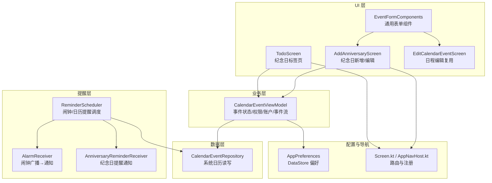
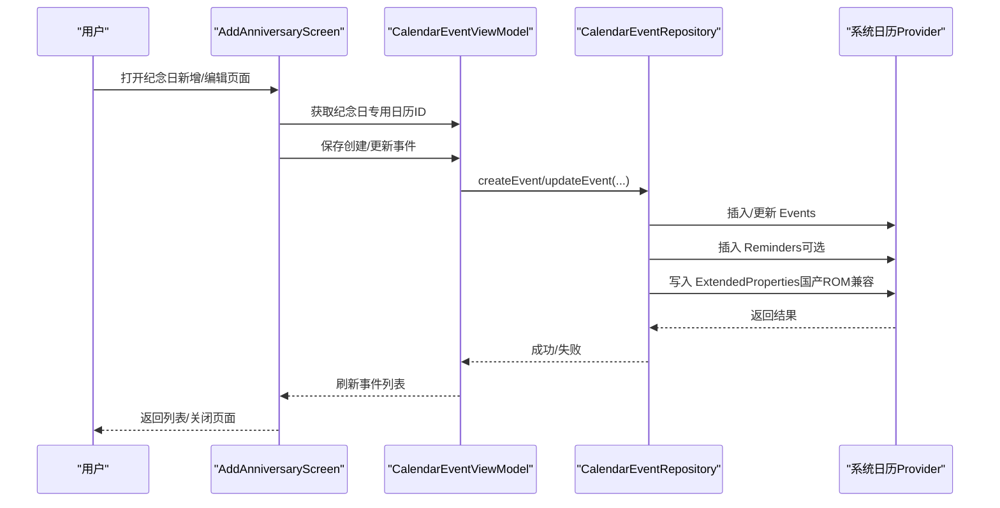
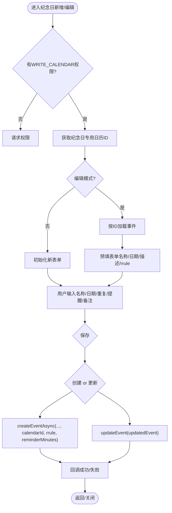
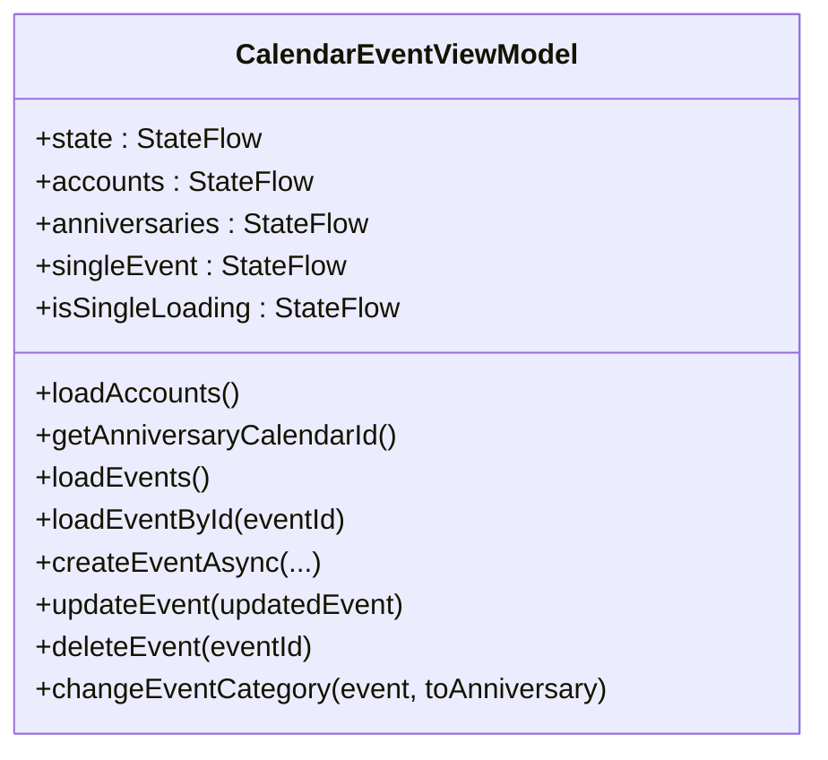
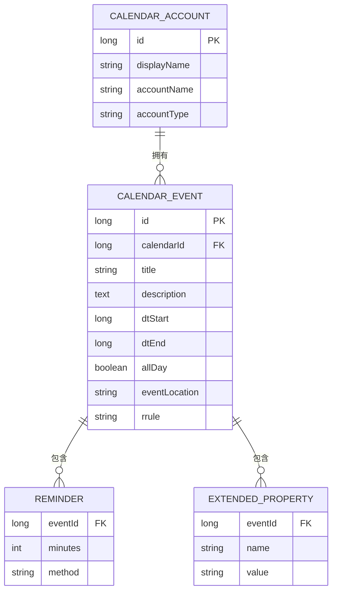
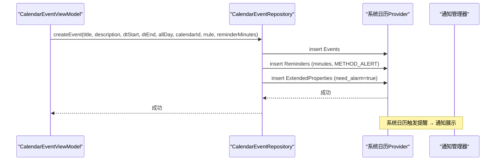
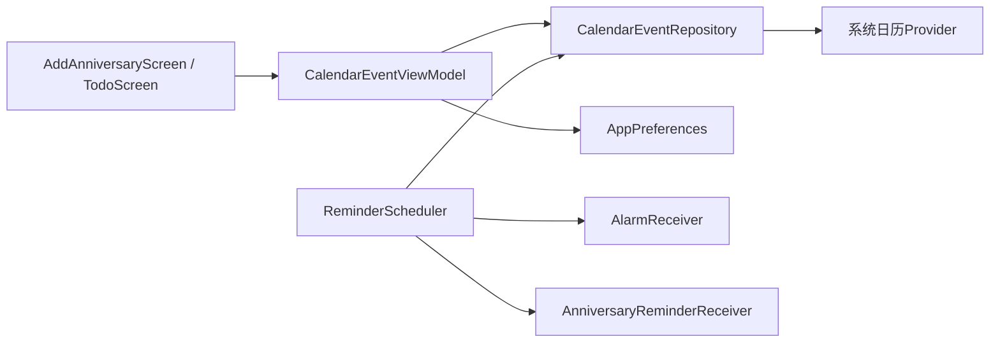

# 纪念日管理

<cite>
**本文引用的文件**   
- [AddAnniversaryScreen.kt](file://app/src/main/java/com/schedulecalendar/app/ui/todo/AddAnniversaryScreen.kt)
- [TodoScreen.kt](file://app/src/main/java/com/schedulecalendar/app/ui/todo/TodoScreen.kt)
- [CalendarEventViewModel.kt](file://app/src/main/java/com/schedulecalendar/app/ui/todo/CalendarEventViewModel.kt)
- [CalendarEventRepository.kt](file://app/src/main/java/com/schedulecalendar/app/data/calendar/CalendarEventRepository.kt)
- [ReminderScheduler.kt](file://app/src/main/java/com/schedulecalendar/app/reminder/ReminderScheduler.kt)
- [AlarmReceiver.kt](file://app/src/main/java/com/schedulecalendar/app/reminder/AlarmReceiver.kt)
- [AnniversaryReminderReceiver.kt](file://app/src/main/java/com/schedulecalendar/app/reminder/AnniversaryReminderReceiver.kt)
- [AppPreferences.kt](file://app/src/main/java/com/schedulecalendar/app/data/prefs/AppPreferences.kt)
- [EventFormComponents.kt](file://app/src/main/java/com/schedulecalendar/app/ui/todo/EventFormComponents.kt)
- [EditCalendarEventScreen.kt](file://app/src/main/java/com/schedulecalendar/app/ui/todo/EditCalendarEventScreen.kt)
- [Screen.kt](file://app/src/main/java/com/schedulecalendar/app/ui/navigation/Screen.kt)
- [AppNavHost.kt](file://app/src/main/java/com/schedulecalendar/app/ui/navigation/AppNavHost.kt)
</cite>

## 目录
1. [简介](#简介)
2. [项目结构](#项目结构)
3. [核心组件](#核心组件)
4. [架构总览](#架构总览)
5. [详细组件分析](#详细组件分析)
6. [依赖关系分析](#依赖关系分析)
7. [性能考虑](#性能考虑)
8. [故障排查指南](#故障排查指南)
9. [结论](#结论)
10. [附录](#附录)

## 简介
本文件围绕 Android 排班日历应用中的“纪念日管理”功能，提供从 UI、数据模型、存储与同步到提醒调度与通知的完整技术文档。重点覆盖：
- 纪念日的添加、编辑与删除的界面实现
- 纪念日数据模型设计与系统日历事件映射
- 纪念日提醒的调度机制（系统日历提醒与本地闹钟）
- 纪念日分类管理与搜索过滤策略
- 纪念日与系统日历事件的关联关系与数据同步
- 备份导入导出与迁移处理思路

## 项目结构
纪念日相关代码主要分布在以下模块：
- UI 层：纪念日新增/编辑页面、纪念日列表标签页、通用表单组件
- ViewModel 层：日历事件状态管理、权限检查、账户与事件加载、分类切换
- 数据层：系统日历读写仓库（Account/Calendar/Events/Reminders/ExtendedProperties）
- 提醒调度：闹钟提醒与日历提醒两种模式，广播接收器负责通知展示
- 配置与导航：DataStore 偏好设置、路由定义与导航注册

**图表来源** 
- [AddAnniversaryScreen.kt](file://app/src/main/java/com/schedulecalendar/app/ui/todo/AddAnniversaryScreen.kt)
- [TodoScreen.kt](file://app/src/main/java/com/schedulecalendar/app/ui/todo/TodoScreen.kt)
- [CalendarEventViewModel.kt](file://app/src/main/java/com/schedulecalendar/app/ui/todo/CalendarEventViewModel.kt)
- [CalendarEventRepository.kt](file://app/src/main/java/com/schedulecalendar/app/data/calendar/CalendarEventRepository.kt)
- [ReminderScheduler.kt](file://app/src/main/java/com/schedulecalendar/app/reminder/ReminderScheduler.kt)
- [AlarmReceiver.kt](file://app/src/main/java/com/schedulecalendar/app/reminder/AlarmReceiver.kt)
- [AnniversaryReminderReceiver.kt](file://app/src/main/java/com/schedulecalendar/app/reminder/AnniversaryReminderReceiver.kt)
- [AppPreferences.kt](file://app/src/main/java/com/schedulecalendar/app/data/prefs/AppPreferences.kt)
- [EventFormComponents.kt](file://app/src/main/java/com/schedulecalendar/app/ui/todo/EventFormComponents.kt)
- [EditCalendarEventScreen.kt](file://app/src/main/java/com/schedulecalendar/app/ui/todo/EditCalendarEventScreen.kt)
- [Screen.kt](file://app/src/main/java/com/schedulecalendar/app/ui/navigation/Screen.kt)
- [AppNavHost.kt](file://app/src/main/java/com/schedulecalendar/app/ui/navigation/AppNavHost.kt)

**章节来源**
- [AddAnniversaryScreen.kt:1-591](file://app/src/main/java/com/schedulecalendar/app/ui/todo/AddAnniversaryScreen.kt#L1-L591)
- [TodoScreen.kt:1156-1249](file://app/src/main/java/com/schedulecalendar/app/ui/todo/TodoScreen.kt#L1156-L1249)
- [CalendarEventViewModel.kt:1-469](file://app/src/main/java/com/schedulecalendar/app/ui/todo/CalendarEventViewModel.kt#L1-L469)
- [CalendarEventRepository.kt:1-820](file://app/src/main/java/com/schedulecalendar/app/data/calendar/CalendarEventRepository.kt#L1-L820)
- [ReminderScheduler.kt:1-497](file://app/src/main/java/com/schedulecalendar/app/reminder/ReminderScheduler.kt#L1-L497)
- [AlarmReceiver.kt:1-78](file://app/src/main/java/com/schedulecalendar/app/reminder/AlarmReceiver.kt#L1-L78)
- [AnniversaryReminderReceiver.kt:1-57](file://app/src/main/java/com/schedulecalendar/app/reminder/AnniversaryReminderReceiver.kt#L1-L57)
- [AppPreferences.kt:1-313](file://app/src/main/java/com/schedulecalendar/app/data/prefs/AppPreferences.kt#L1-L313)
- [EventFormComponents.kt:1-533](file://app/src/main/java/com/schedulecalendar/app/ui/todo/EventFormComponents.kt#L1-L533)
- [EditCalendarEventScreen.kt:1-309](file://app/src/main/java/com/schedulecalendar/app/ui/todo/EditCalendarEventScreen.kt#L1-L309)
- [Screen.kt:1-34](file://app/src/main/java/com/schedulecalendar/app/ui/navigation/Screen.kt#L1-L34)
- [AppNavHost.kt:146-171](file://app/src/main/java/com/schedulecalendar/app/ui/navigation/AppNavHost.kt#L146-L171)

## 核心组件
- AddAnniversaryScreen：纪念日新增/编辑界面，支持公历/农历选择、每年重复开关、系统日历提醒提前时间、备注等；创建时写入纪念日专用日历或更新已有事件。
- TodoScreen 纪念日标签页：展示纪念日列表，支持长按分类切换（日程/纪念日），悬浮按钮跳转新增页面。
- CalendarEventViewModel：统一管理日历事件状态、权限检查、账户与事件加载、按 ID 加载单个事件、创建/更新/删除事件、分类切换逻辑。
- CalendarEventRepository：封装系统日历 Provider 的账户、日历、事件、提醒、扩展属性读写，包含本地/纪念日/提醒专用日历的创建与查找。
- ReminderScheduler：上下班提醒调度器（与纪念日提醒并行存在），支持闹钟与日历两种模式，具备窗口清理与去重能力。
- AlarmReceiver / AnniversaryReminderReceiver：分别处理闹钟与纪念日提醒的通知展示。
- EventFormComponents：通用表单组件（标题、日期、时间、重复规则、提醒时间、颜色、账户选择）。
- AppPreferences：DataStore 偏好存储，含账户分类映射、禁用账户、提醒方式等。
- Screen.kt / AppNavHost.kt：路由定义与导航注册，确保纪念日新增/编辑页面可被正确导航。

**章节来源**
- [AddAnniversaryScreen.kt:1-591](file://app/src/main/java/com/schedulecalendar/app/ui/todo/AddAnniversaryScreen.kt#L1-L591)
- [TodoScreen.kt:1156-1249](file://app/src/main/java/com/schedulecalendar/app/ui/todo/TodoScreen.kt#L1156-L1249)
- [CalendarEventViewModel.kt:1-469](file://app/src/main/java/com/schedulecalendar/app/ui/todo/CalendarEventViewModel.kt#L1-L469)
- [CalendarEventRepository.kt:1-820](file://app/src/main/java/com/schedulecalendar/app/data/calendar/CalendarEventRepository.kt#L1-L820)
- [ReminderScheduler.kt:1-497](file://app/src/main/java/com/schedulecalendar/app/reminder/ReminderScheduler.kt#L1-L497)
- [AlarmReceiver.kt:1-78](file://app/src/main/java/com/schedulecalendar/app/reminder/AlarmReceiver.kt#L1-L78)
- [AnniversaryReminderReceiver.kt:1-57](file://app/src/main/java/com/schedulecalendar/app/reminder/AnniversaryReminderReceiver.kt#L1-L57)
- [EventFormComponents.kt:1-533](file://app/src/main/java/com/schedulecalendar/app/ui/todo/EventFormComponents.kt#L1-L533)
- [AppPreferences.kt:1-313](file://app/src/main/java/com/schedulecalendar/app/data/prefs/AppPreferences.kt#L1-L313)
- [Screen.kt:1-34](file://app/src/main/java/com/schedulecalendar/app/ui/navigation/Screen.kt#L1-L34)
- [AppNavHost.kt:146-171](file://app/src/main/java/com/schedulecalendar/app/ui/navigation/AppNavHost.kt#L146-L171)

## 架构总览
纪念日管理的整体流程如下：
- 用户在纪念日标签页点击新增，进入 AddAnniversaryScreen 填写信息并保存
- ViewModel 调用 Repository 在纪念日专用日历中创建事件（或更新已有事件）
- 若开启系统日历提醒，则通过 Reminders 表设置提前提醒；国产 ROM 兼容通过 ExtendedProperties 标记
- 用户可在纪念日标签页长按事件进行“日程/纪念日”分类切换
- 纪念日事件以全天事件 + 年度重复（FREQ=YEARLY）形式呈现于系统日历

**图表来源** 
- [AddAnniversaryScreen.kt:126-523](file://app/src/main/java/com/schedulecalendar/app/ui/todo/AddAnniversaryScreen.kt#L126-L523)
- [CalendarEventViewModel.kt:196-417](file://app/src/main/java/com/schedulecalendar/app/ui/todo/CalendarEventViewModel.kt#L196-L417)
- [CalendarEventRepository.kt:283-386](file://app/src/main/java/com/schedulecalendar/app/data/calendar/CalendarEventRepository.kt#L283-L386)

## 详细组件分析

### 纪念日新增/编辑界面（AddAnniversaryScreen）
- 支持公历/农历双模式选择，农历转公历使用 LunarCalendar 工具类
- 每年重复开关对应 rrule=FREQ=YEARLY
- 系统日历提醒提前时间选项（如“事件发生时”“提前5分钟”等）
- 权限申请 WRITE_CALENDAR，进入页面即请求
- 创建模式：写入纪念日专用日历；编辑模式：更新现有事件（保留 calendarId）
- 错误提示通过 Snackbar 显示

**图表来源** 
- [AddAnniversaryScreen.kt:126-523](file://app/src/main/java/com/schedulecalendar/app/ui/todo/AddAnniversaryScreen.kt#L126-L523)

**章节来源**
- [AddAnniversaryScreen.kt:1-591](file://app/src/main/java/com/schedulecalendar/app/ui/todo/AddAnniversaryScreen.kt#L1-L591)

### 纪念日列表与分类管理（TodoScreen 纪念日标签页）
- 通过 CalendarEventViewModel.anniversaries 流式展示纪念日事件
- 长按事件弹出分类设置对话框，支持“日程/纪念日”切换
- 切换逻辑由 ViewModel.changeEventCategory 实现：为纪念日添加前缀与年度重复，为日程移除前缀与年度重复
- 空态提示与悬浮新增按钮

**图表来源** 
- [CalendarEventViewModel.kt:74-87](file://app/src/main/java/com/schedulecalendar/app/ui/todo/CalendarEventViewModel.kt#L74-L87)
- [CalendarEventViewModel.kt:438-458](file://app/src/main/java/com/schedulecalendar/app/ui/todo/CalendarEventViewModel.kt#L438-L458)

**章节来源**
- [TodoScreen.kt:1156-1249](file://app/src/main/java/com/schedulecalendar/app/ui/todo/TodoScreen.kt#L1156-L1249)
- [CalendarEventViewModel.kt:74-87](file://app/src/main/java/com/schedulecalendar/app/ui/todo/CalendarEventViewModel.kt#L74-L87)
- [CalendarEventViewModel.kt:438-458](file://app/src/main/java/com/schedulecalendar/app/ui/todo/CalendarEventViewModel.kt#L438-L458)

### 数据模型与系统日历映射
- CalendarEventInfo：系统日历事件信息（id、calendarId、title、description、dtStart、dtEnd、allDay、eventLocation、accountName、calendarDisplayName、rrule）
- 纪念日特征：标题以“纪念日: ”开头且 rrule 包含 FREQ=YEARLY；或使用纪念日专用日历ID
- 纪念日专用日历：通过 getOrCreateAnniversaryCalendarId 创建/获取，颜色红色，独立于日程/提醒日历
- 日程专用日历：getOrCreateLocalCalendarId，颜色蓝色
- 提醒专用日历：getOrCreateReminderCalendarId，颜色绿色

**图表来源** 
- [CalendarEventRepository.kt:17-40](file://app/src/main/java/com/schedulecalendar/app/data/calendar/CalendarEventRepository.kt#L17-L40)
- [CalendarEventRepository.kt:589-645](file://app/src/main/java/com/schedulecalendar/app/data/calendar/CalendarEventRepository.kt#L589-L645)

**章节来源**
- [CalendarEventRepository.kt:17-40](file://app/src/main/java/com/schedulecalendar/app/data/calendar/CalendarEventRepository.kt#L17-L40)
- [CalendarEventRepository.kt:589-645](file://app/src/main/java/com/schedulecalendar/app/data/calendar/CalendarEventRepository.kt#L589-L645)

### 纪念日提醒调度与通知
- 系统日历提醒：通过 Reminders 表设置提前分钟数，并设置 HAS_ALARM 标志；国产 ROM 兼容通过 ExtendedProperties 写入 need_alarm=true
- 本地闹钟提醒：AlarmManager.setAlarmClock 精确闹钟，AlarmReceiver 接收广播后展示通知
- 纪念日提醒通知：AnniversaryReminderReceiver 根据广播内容创建通知渠道并推送通知

**图表来源** 
- [CalendarEventRepository.kt:283-386](file://app/src/main/java/com/schedulecalendar/app/data/calendar/CalendarEventRepository.kt#L283-L386)
- [AnniversaryReminderReceiver.kt:1-57](file://app/src/main/java/com/schedulecalendar/app/reminder/AnniversaryReminderReceiver.kt#L1-L57)

**章节来源**
- [CalendarEventRepository.kt:283-386](file://app/src/main/java/com/schedulecalendar/app/data/calendar/CalendarEventRepository.kt#L283-L386)
- [AnniversaryReminderReceiver.kt:1-57](file://app/src/main/java/com/schedulecalendar/app/reminder/AnniversaryReminderReceiver.kt#L1-L57)

### 通用表单组件（EventFormComponents）
- 标题、描述、地点输入框
- 全天事件开关、日期/时间选择卡片
- 重复规则选择（不重复/每天/每周/每两周/每月/每年）
- 提醒时间选择（不提醒/事件发生时/5分钟前/15分钟前/30分钟前/1小时前/2小时前/1天前）
- 颜色选择器、日历账户选择器

**章节来源**
- [EventFormComponents.kt:1-533](file://app/src/main/java/com/schedulecalendar/app/ui/todo/EventFormComponents.kt#L1-L533)

### 导航与路由
- Screen.kt 定义 RouteAddAnniversary、RouteEditAnniversary 等路由
- AppNavHost.kt 注册纪念日新增/编辑页面，支持带 eventId 的编辑模式

**章节来源**
- [Screen.kt:29-32](file://app/src/main/java/com/schedulecalendar/app/ui/navigation/Screen.kt#L29-L32)
- [AppNavHost.kt:153-157](file://app/src/main/java/com/schedulecalendar/app/ui/navigation/AppNavHost.kt#L153-L157)

## 依赖关系分析
- UI 层依赖 ViewModel 暴露的状态与操作
- ViewModel 依赖 Repository 进行系统日历读写，依赖 AppPreferences 读取账户分类与禁用状态
- Repository 直接访问系统日历 Provider，创建/更新/删除事件、提醒与扩展属性
- 提醒调度器与通知接收器独立于纪念日流程，但共享通知渠道与系统通知机制

**图表来源** 
- [CalendarEventViewModel.kt:1-469](file://app/src/main/java/com/schedulecalendar/app/ui/todo/CalendarEventViewModel.kt#L1-L469)
- [CalendarEventRepository.kt:1-820](file://app/src/main/java/com/schedulecalendar/app/data/calendar/CalendarEventRepository.kt#L1-L820)
- [ReminderScheduler.kt:1-497](file://app/src/main/java/com/schedulecalendar/app/reminder/ReminderScheduler.kt#L1-L497)

**章节来源**
- [CalendarEventViewModel.kt:1-469](file://app/src/main/java/com/schedulecalendar/app/ui/todo/CalendarEventViewModel.kt#L1-L469)
- [CalendarEventRepository.kt:1-820](file://app/src/main/java/com/schedulecalendar/app/data/calendar/CalendarEventRepository.kt#L1-L820)
- [ReminderScheduler.kt:1-497](file://app/src/main/java/com/schedulecalendar/app/reminder/ReminderScheduler.kt#L1-L497)

## 性能考虑
- 批量加载日历信息：Repository 在 getAllEvents 中先批量加载所有日历信息，避免 N+1 查询
- 流式过滤：ViewModel 使用 combine 将原始事件、账户分类与应用日历ID集合组合，实时过滤纪念日/日程
- 权限检查前置：避免无权限时执行查询导致 SecurityException
- 通知渠道一次性创建：AlarmReceiver 与 AnniversaryReminderReceiver 在 onReceive 中检查并创建渠道，减少重复开销

[本节为通用指导，不直接分析具体文件]

## 故障排查指南
- 权限问题：确认 WRITE_CALENDAR 已授予；若无权限，页面会请求权限并在成功后重新加载账户
- 纪念日未显示：检查是否为纪念日专用日历或标题前缀与年度重复规则是否正确；查看账户分类映射是否生效
- 提醒未触发：确认系统日历提醒设置（Reminders 表）与 ExtendedProperties 写入；国产 ROM 需 need_alarm=true
- 重复创建：检查 findEventByDateAndTitle 去重逻辑；清理旧事件后再重建
- 通知渠道缺失：确保 NotificationChannel 已创建；Android 8.0+ 必须创建渠道

**章节来源**
- [CalendarEventViewModel.kt:238-276](file://app/src/main/java/com/schedulecalendar/app/ui/todo/CalendarEventViewModel.kt#L238-L276)
- [CalendarEventRepository.kt:342-386](file://app/src/main/java/com/schedulecalendar/app/data/calendar/CalendarEventRepository.kt#L342-L386)
- [ReminderScheduler.kt:439-456](file://app/src/main/java/com/schedulecalendar/app/reminder/ReminderScheduler.kt#L439-L456)
- [AlarmReceiver.kt:64-76](file://app/src/main/java/com/schedulecalendar/app/reminder/AlarmReceiver.kt#L64-L76)
- [AnniversaryReminderReceiver.kt:43-55](file://app/src/main/java/com/schedulecalendar/app/reminder/AnniversaryReminderReceiver.kt#L43-L55)

## 结论
纪念日管理功能通过系统日历 Provider 实现了高可靠性的事件与提醒能力，结合 ViewModel 的流式状态管理与 Repository 的批量优化，保证了良好的用户体验与性能。分类管理与搜索过滤基于账户分类映射与事件特征判断，灵活且易于扩展。提醒机制兼顾系统日历提醒与本地闹钟，适配不同 ROM 环境。未来可进一步引入本地数据库持久化与更完善的备份导入导出方案。

[本节为总结性内容，不直接分析具体文件]

## 附录
- 纪念日数据模型字段说明：
  - 标题：纪念日名称（编辑模式下去除“纪念日: ”前缀得到纯名称）
  - 描述：备注信息（可包含农历信息与用户自定义备注）
  - 开始/结束时间：全天事件使用 UTC 时区，结束时间为次日 00:00 UTC
  - 重复规则：每年重复（FREQ=YEARLY）
  - 提醒分钟数：系统日历提醒提前时间
  - 日历ID：纪念日专用日历ID或原有事件ID

- 备份导入导出与迁移处理建议：
  - 当前代码未实现纪念日数据的本地持久化与导入导出，建议后续扩展 DataStore 或 Room 存储纪念日元数据
  - 迁移策略：在应用升级时检查系统日历事件特征（标题前缀与 rrule），自动归类到纪念日或日程
  - 备份方案：导出系统日历事件为 ICS 文件，或导出本地元数据 JSON，支持导入合并与冲突解决

[本节为概念性内容，不直接分析具体文件]