# 排班界面

<cite>
**本文引用的文件**   
- [ShiftsScreen.kt](file://app/src/main/java/com/schedulecalendar/app/ui/shifts/ShiftsScreen.kt)
- [ShiftEditorScreen.kt](file://app/src/main/java/com/schedulecalendar/app/ui/shifts/ShiftEditorScreen.kt)
- [ShiftsViewModel.kt](file://app/src/main/java/com/schedulecalendar/app/ui/shifts/ShiftsViewModel.kt)
- [Models.kt](file://app/src/main/java/com/schedulecalendar/app/domain/model/Models.kt)
- [CalcUtils.kt](file://app/src/main/java/com/schedulecalendar/app/domain/model/CalcUtils.kt)
- [CommonComponents.kt](file://app/src/main/java/com/schedulecalendar/app/ui/component/CommonComponents.kt)
- [Color.kt](file://app/src/main/java/com/schedulecalendar/app/ui/theme/Color.kt)
- [ShiftEntity.kt](file://app/src/main/java/com/schedulecalendar/app/data/db/entity/ShiftEntity.kt)
- [ShiftDao.kt](file://app/src/main/java/com/schedulecalendar/app/data/db/dao/ShiftDao.kt)
- [ShiftStatusDao.kt](file://app/src/main/java/com/schedulecalendar/app/data/db/dao/ShiftStatusDao.kt)
- [BackupManager.kt](file://app/src/main/java/com/schedulecalendar/app/ui/settings/BackupManager.kt)
</cite>

## 目录
1. [简介](#简介)
2. [项目结构](#项目结构)
3. [核心组件](#核心组件)
4. [架构总览](#架构总览)
5. [详细组件分析](#详细组件分析)
6. [依赖关系分析](#依赖关系分析)
7. [性能与交互特性](#性能与交互特性)
8. [故障排查指南](#故障排查指南)
9. [结论](#结论)
10. [附录：数据模型与规则](#附录数据模型与规则)

## 简介
本文件聚焦 Android 排班日历应用中的“排班界面”，系统性说明班次管理的 UI 实现与交互流程，包括：
- 班次列表展示、排序与删除确认
- 班次编辑器（名称、时间、颜色、默认关联补贴/扣款）
- 循环规则配置入口与全局休息时段管理
- 附加状态类型管理与批量操作界面设计
- 数据校验与错误提示机制
- 模板与快速配置能力（预设颜色、内置班次/状态、导入导出）

## 项目结构
排班界面由 Compose UI + ViewModel + Repository/DAO 构成，采用 MVVM 分层。UI 层通过 StateFlow 订阅 ViewModel 状态，用户事件经 ViewModel 调用仓库持久化并触发自动备份。

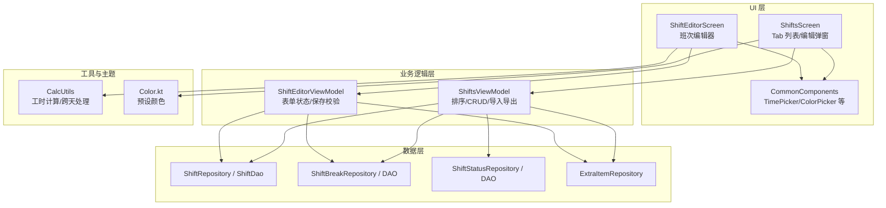

**图表来源** 
- [ShiftsScreen.kt:55-183](file://app/src/main/java/com/schedulecalendar/app/ui/shifts/ShiftsScreen.kt#L55-L183)
- [ShiftEditorScreen.kt:36-231](file://app/src/main/java/com/schedulecalendar/app/ui/shifts/ShiftEditorScreen.kt#L36-L231)
- [ShiftsViewModel.kt:48-134](file://app/src/main/java/com/schedulecalendar/app/ui/shifts/ShiftsViewModel.kt#L48-L134)
- [CalcUtils.kt:115-134](file://app/src/main/java/com/schedulecalendar/app/domain/model/CalcUtils.kt#L115-L134)
- [Color.kt:46-53](file://app/src/main/java/com/schedulecalendar/app/ui/theme/Color.kt#L46-L53)

**章节来源**
- [ShiftsScreen.kt:55-183](file://app/src/main/java/com/schedulecalendar/app/ui/shifts/ShiftsScreen.kt#L55-L183)
- [ShiftEditorScreen.kt:36-231](file://app/src/main/java/com/schedulecalendar/app/ui/shifts/ShiftEditorScreen.kt#L36-L231)
- [ShiftsViewModel.kt:48-134](file://app/src/main/java/com/schedulecalendar/app/ui/shifts/ShiftsViewModel.kt#L48-L134)

## 核心组件
- 班次主界面（ShiftsScreen）：四个 Tab（班次、附加状态、补贴扣款、休息时段），支持新增、编辑、删除、上移/下移排序、删除确认对话框。
- 班次编辑器（ShiftEditorScreen）：名称、上下班时间、时长预览、颜色选择、默认关联补贴/扣款项、保存与错误提示。
- 视图模型（ShiftsViewModel/ShiftEditorViewModel）：状态流、排序、CRUD、导入导出、自动备份、事件通道。
- 通用组件（CommonComponents）：时间选择器、颜色选择器、稳定标签样式、IME 自适应输入框。
- 领域模型（Models.kt）：Shift、ShiftBreak、ShiftStatus、ExtraItem、内置常量等。
- 计算工具（CalcUtils.kt）：跨天时长、全局休息段扣减、考勤粒度、薪资/工时统计。
- 主题（Color.kt）：18 色预设方案，用于班次/状态颜色选择。

**章节来源**
- [ShiftsScreen.kt:55-183](file://app/src/main/java/com/schedulecalendar/app/ui/shifts/ShiftsScreen.kt#L55-L183)
- [ShiftEditorScreen.kt:36-231](file://app/src/main/java/com/schedulecalendar/app/ui/shifts/ShiftEditorScreen.kt#L36-L231)
- [ShiftsViewModel.kt:48-134](file://app/src/main/java/com/schedulecalendar/app/ui/shifts/ShiftsViewModel.kt#L48-L134)
- [CommonComponents.kt:182-259](file://app/src/main/java/com/schedulecalendar/app/ui/component/CommonComponents.kt#L182-L259)
- [Models.kt:51-79](file://app/src/main/java/com/schedulecalendar/app/domain/model/Models.kt#L51-L79)
- [CalcUtils.kt:115-134](file://app/src/main/java/com/schedulecalendar/app/domain/model/CalcUtils.kt#L115-L134)
- [Color.kt:46-53](file://app/src/main/java/com/schedulecalendar/app/ui/theme/Color.kt#L46-L53)

## 架构总览
排班界面遵循 MVVM 模式：
- UI 层使用 Compose 声明式构建，通过 collectAsStateWithLifecycle 订阅 StateFlow。
- ViewModel 暴露 sortedShifts/sortedBreaks/sortedStatuses 等有序状态，结合内存排序 Flow 即时响应。
- 数据层通过 Repository/DAO 访问 Room 数据库，支持归档（逻辑删除）与全量查询。
- 工具层 CalcUtils 提供跨天时长、休息段扣减、考勤粒度等计算。
- 主题层提供统一的颜色预设与语义色。

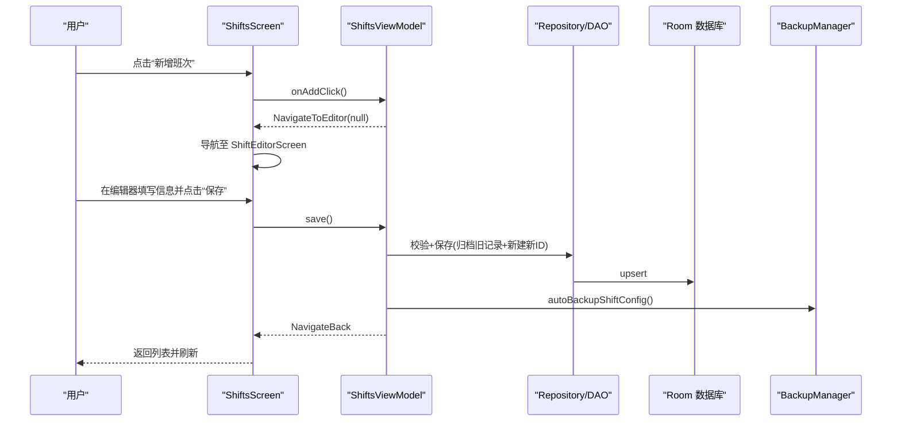

**图表来源** 
- [ShiftsScreen.kt:73-85](file://app/src/main/java/com/schedulecalendar/app/ui/shifts/ShiftsScreen.kt#L73-L85)
- [ShiftsViewModel.kt:135-141](file://app/src/main/java/com/schedulecalendar/app/ui/shifts/ShiftsViewModel.kt#L135-L141)
- [ShiftsViewModel.kt:407-457](file://app/src/main/java/com/schedulecalendar/app/ui/shifts/ShiftsViewModel.kt#L407-L457)
- [BackupManager.kt:256-276](file://app/src/main/java/com/schedulecalendar/app/ui/settings/BackupManager.kt#L256-L276)

## 详细组件分析

### 班次列表与 Tab 管理（ShiftsScreen）
- 顶部 TabRow 切换四个模块：班次、附加状态、补贴扣款、休息时段。
- 每个 Tab 使用 LazyColumn 渲染卡片列表，支持上移/下移排序、编辑、删除。
- 删除班次时弹出确认对话框，避免误删；内置班次不显示编辑/删除按钮。
- 浮动按钮根据当前 Tab 动态变化，分别进入对应的新增入口。

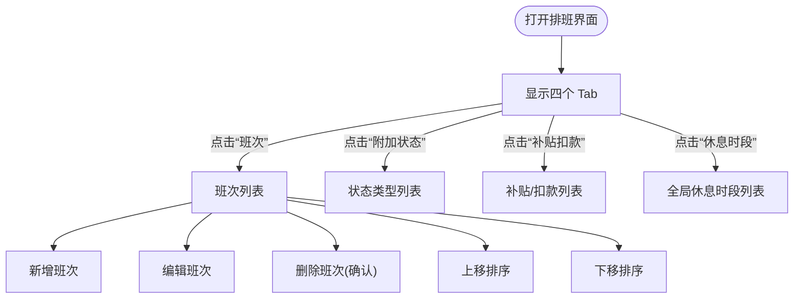

**图表来源** 
- [ShiftsScreen.kt:88-183](file://app/src/main/java/com/schedulecalendar/app/ui/shifts/ShiftsScreen.kt#L88-L183)
- [ShiftsScreen.kt:204-313](file://app/src/main/java/com/schedulecalendar/app/ui/shifts/ShiftsScreen.kt#L204-L313)

**章节来源**
- [ShiftsScreen.kt:88-183](file://app/src/main/java/com/schedulecalendar/app/ui/shifts/ShiftsScreen.kt#L88-L183)
- [ShiftsScreen.kt:204-313](file://app/src/main/java/com/schedulecalendar/app/ui/shifts/ShiftsScreen.kt#L204-L313)

### 班次编辑器（ShiftEditorScreen）
- 字段：名称、上下班时间、时长预览、颜色选择、默认关联补贴/扣款项。
- 时长预览：基于 CalcUtils.calcHourDiff 与 calcGlobalBreakHours 计算总时长、休息扣除与实际工时。
- 颜色选择：使用 ColorPicker 从 18 色预设中选择，并在预览中实时显示。
- 默认关联：以 FilterChip 形式展示所有 ExtraItem，按类型用不同颜色标识，支持多选。
- 保存校验：名称非空、时间完整、重名检查；编辑时采用“归档旧记录+新建新ID”策略。
- 保存后递增预设颜色索引，便于下次新建时使用下一个颜色。

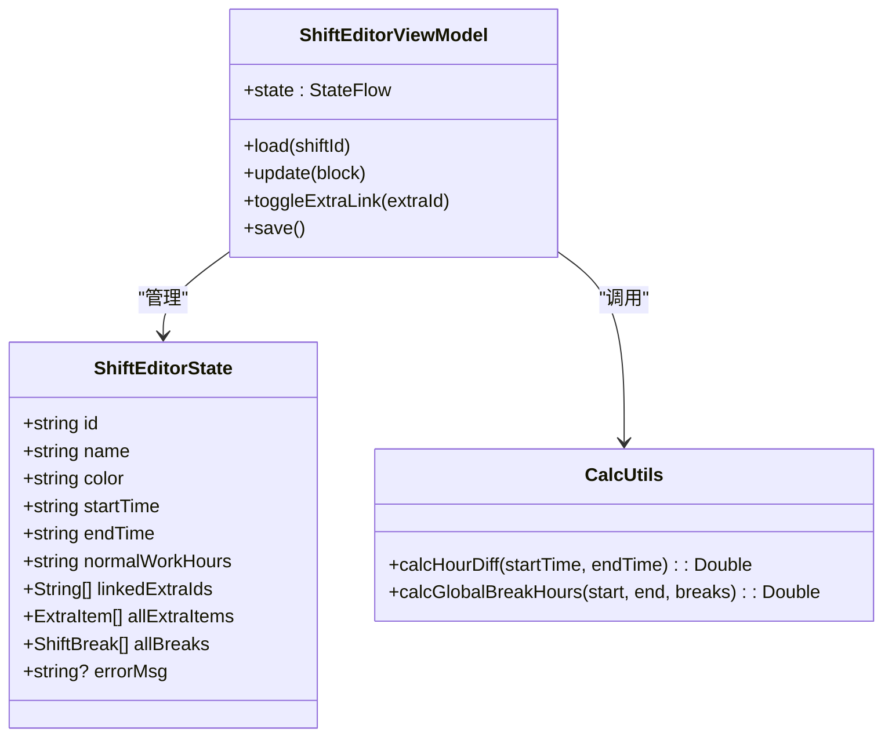

**图表来源** 
- [ShiftEditorScreen.kt:36-231](file://app/src/main/java/com/schedulecalendar/app/ui/shifts/ShiftEditorScreen.kt#L36-L231)
- [ShiftsViewModel.kt:354-457](file://app/src/main/java/com/schedulecalendar/app/ui/shifts/ShiftsViewModel.kt#L354-L457)
- [CalcUtils.kt:40-47](file://app/src/main/java/com/schedulecalendar/app/domain/model/CalcUtils.kt#L40-L47)
- [CalcUtils.kt:121-134](file://app/src/main/java/com/schedulecalendar/app/domain/model/CalcUtils.kt#L121-L134)

**章节来源**
- [ShiftEditorScreen.kt:36-231](file://app/src/main/java/com/schedulecalendar/app/ui/shifts/ShiftEditorScreen.kt#L36-L231)
- [ShiftsViewModel.kt:354-457](file://app/src/main/java/com/schedulecalendar/app/ui/shifts/ShiftsViewModel.kt#L354-L457)
- [CalcUtils.kt:40-47](file://app/src/main/java/com/schedulecalendar/app/domain/model/CalcUtils.kt#L40-L47)
- [CalcUtils.kt:121-134](file://app/src/main/java/com/schedulecalendar/app/domain/model/CalcUtils.kt#L121-L134)

### 全局休息时段管理（Breaks）
- 列表展示 label、开始/结束时间与时长，支持编辑与删除。
- 编辑弹窗包含名称与时间选择，校验名称唯一性与时间段重叠。
- 新增时置顶排序，并持久化顺序到 DataStore。

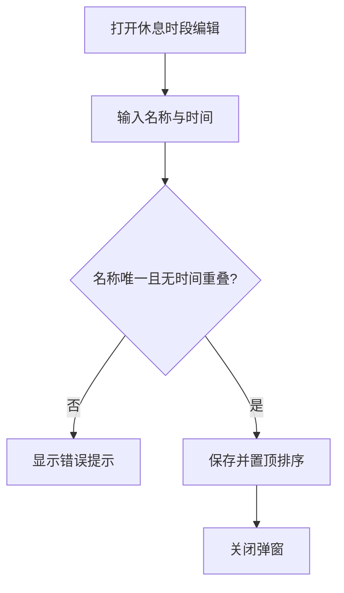

**图表来源** 
- [ShiftsScreen.kt:395-449](file://app/src/main/java/com/schedulecalendar/app/ui/shifts/ShiftsScreen.kt#L395-L449)
- [ShiftsViewModel.kt:176-197](file://app/src/main/java/com/schedulecalendar/app/ui/shifts/ShiftsViewModel.kt#L176-L197)

**章节来源**
- [ShiftsScreen.kt:395-449](file://app/src/main/java/com/schedulecalendar/app/ui/shifts/ShiftsScreen.kt#L395-L449)
- [ShiftsViewModel.kt:176-197](file://app/src/main/java/com/schedulecalendar/app/ui/shifts/ShiftsViewModel.kt#L176-L197)

### 附加状态类型管理（Status Types）
- 列表展示名称、颜色、报表类型映射（请假/调休），支持编辑与删除。
- 编辑弹窗支持名称与颜色选择，名称唯一性校验。
- 新增时置顶排序，并递增状态预设颜色索引。

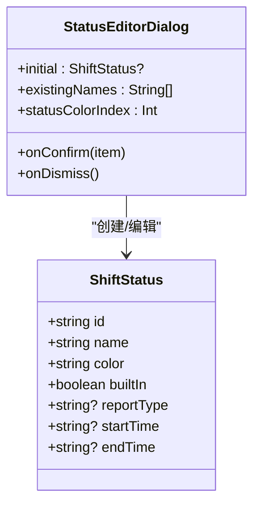

**图表来源** 
- [ShiftsScreen.kt:454-539](file://app/src/main/java/com/schedulecalendar/app/ui/shifts/ShiftsScreen.kt#L454-L539)
- [ShiftsScreen.kt:542-617](file://app/src/main/java/com/schedulecalendar/app/ui/shifts/ShiftsScreen.kt#L542-L617)
- [Models.kt:23-35](file://app/src/main/java/com/schedulecalendar/app/domain/model/Models.kt#L23-L35)

**章节来源**
- [ShiftsScreen.kt:454-539](file://app/src/main/java/com/schedulecalendar/app/ui/shifts/ShiftsScreen.kt#L454-L539)
- [ShiftsScreen.kt:542-617](file://app/src/main/java/com/schedulecalendar/app/ui/shifts/ShiftsScreen.kt#L542-L617)
- [Models.kt:23-35](file://app/src/main/java/com/schedulecalendar/app/domain/model/Models.kt#L23-L35)

### 补贴/扣款项目管理（Extra Items）
- 列表展示名称、金额、类型（补贴/扣款），支持编辑与删除。
- 编辑器支持金额输入过滤（仅数字与小數点）、IME 自动填充保护。
- 删除前弹出确认对话框，历史排班数据不受影响。

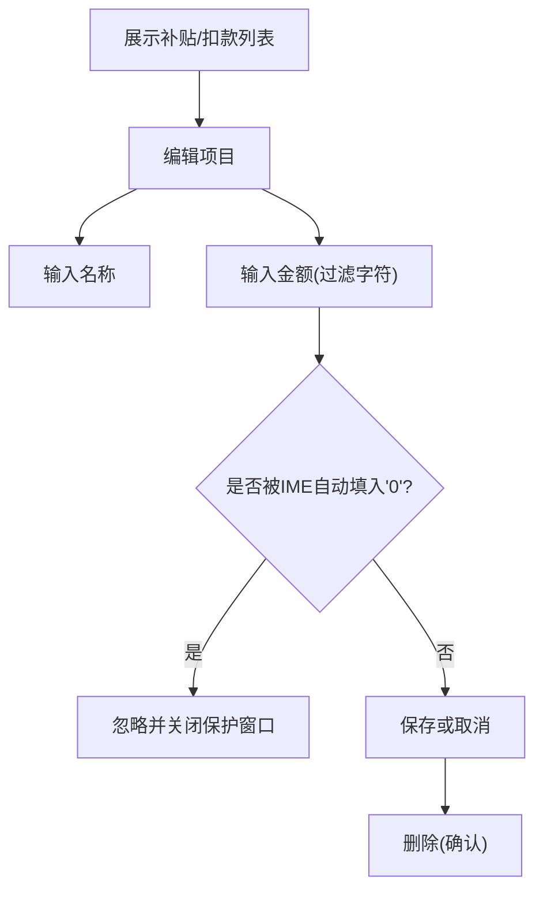

**图表来源** 
- [ShiftsScreen.kt:634-696](file://app/src/main/java/com/schedulecalendar/app/ui/shifts/ShiftsScreen.kt#L634-L696)
- [ShiftsScreen.kt:750-800](file://app/src/main/java/com/schedulecalendar/app/ui/shifts/ShiftsScreen.kt#L750-L800)

**章节来源**
- [ShiftsScreen.kt:634-696](file://app/src/main/java/com/schedulecalendar/app/ui/shifts/ShiftsScreen.kt#L634-L696)
- [ShiftsScreen.kt:750-800](file://app/src/main/java/com/schedulecalendar/app/ui/shifts/ShiftsScreen.kt#L750-L800)

### 批量操作与导入导出
- 导出：生成 JSON（版本 v5，含班次、休息时段、状态、补贴/扣款），UI 层负责写入文件。
- 导入：解析 JSON，支持覆盖/增量导入，统计导入数量并提示结果。
- 自动备份：每次保存/删除后触发自动备份，支持自定义路径与私有目录。

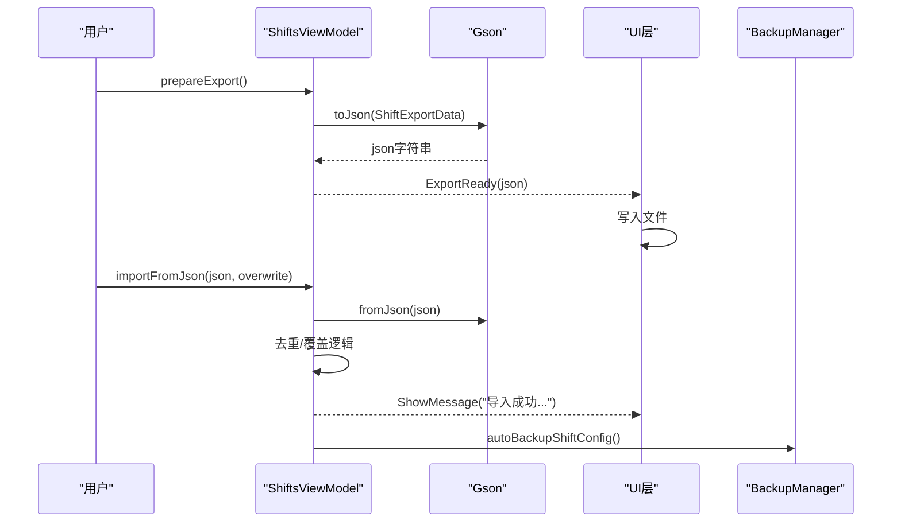

**图表来源** 
- [ShiftsViewModel.kt:277-331](file://app/src/main/java/com/schedulecalendar/app/ui/shifts/ShiftsViewModel.kt#L277-L331)
- [BackupManager.kt:256-276](file://app/src/main/java/com/schedulecalendar/app/ui/settings/BackupManager.kt#L256-L276)

**章节来源**
- [ShiftsViewModel.kt:277-331](file://app/src/main/java/com/schedulecalendar/app/ui/shifts/ShiftsViewModel.kt#L277-L331)
- [BackupManager.kt:256-276](file://app/src/main/java/com/schedulecalendar/app/ui/settings/BackupManager.kt#L256-L276)

### 循环规则配置（概览）
- 循环规则数据结构定义于 Models.kt，包含起始日期、班次 ID 序列、起始偏移与独立月度循环开关。
- 该规则用于批量排班生成，具体生成逻辑在其他模块（如日历/排班生成服务）中使用。

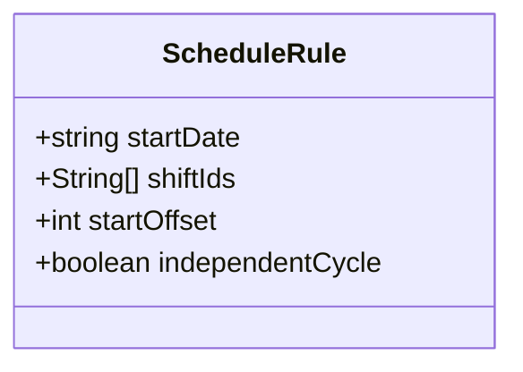

**图表来源** 
- [Models.kt:190-195](file://app/src/main/java/com/schedulecalendar/app/domain/model/Models.kt#L190-L195)

**章节来源**
- [Models.kt:190-195](file://app/src/main/java/com/schedulecalendar/app/domain/model/Models.kt#L190-L195)

## 依赖关系分析
- UI 层依赖 ViewModel 的状态流与事件通道。
- ViewModel 依赖 Repository/DAO 进行数据读写，依赖 Preferences 存储排序与颜色索引。
- 计算工具 CalcUtils 被编辑器与工时/薪资模块复用。
- 主题 Color.kt 为颜色选择器与预览提供预设。

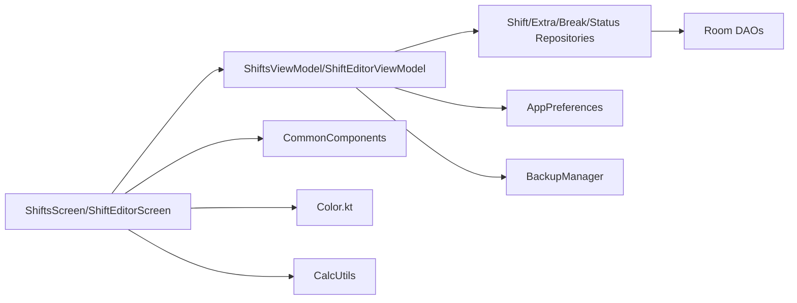

**图表来源** 
- [ShiftsScreen.kt:55-183](file://app/src/main/java/com/schedulecalendar/app/ui/shifts/ShiftsScreen.kt#L55-L183)
- [ShiftEditorScreen.kt:36-231](file://app/src/main/java/com/schedulecalendar/app/ui/shifts/ShiftEditorScreen.kt#L36-L231)
- [ShiftsViewModel.kt:48-134](file://app/src/main/java/com/schedulecalendar/app/ui/shifts/ShiftsViewModel.kt#L48-L134)
- [ShiftDao.kt:10-41](file://app/src/main/java/com/schedulecalendar/app/data/db/dao/ShiftDao.kt#L10-L41)
- [ShiftStatusDao.kt:10-38](file://app/src/main/java/com/schedulecalendar/app/data/db/dao/ShiftStatusDao.kt#L10-L38)

**章节来源**
- [ShiftsScreen.kt:55-183](file://app/src/main/java/com/schedulecalendar/app/ui/shifts/ShiftsScreen.kt#L55-L183)
- [ShiftEditorScreen.kt:36-231](file://app/src/main/java/com/schedulecalendar/app/ui/shifts/ShiftEditorScreen.kt#L36-L231)
- [ShiftsViewModel.kt:48-134](file://app/src/main/java/com/schedulecalendar/app/ui/shifts/ShiftsViewModel.kt#L48-L134)
- [ShiftDao.kt:10-41](file://app/src/main/java/com/schedulecalendar/app/data/db/dao/ShiftDao.kt#L10-L41)
- [ShiftStatusDao.kt:10-38](file://app/src/main/java/com/schedulecalendar/app/data/db/dao/ShiftStatusDao.kt#L10-L38)

## 性能与交互特性
- 即时排序：内存中维护排序顺序 Flow，避免频繁读取 DataStore，提升交互响应速度。
- 懒加载列表：LazyColumn 按需渲染，减少内存占用。
- 预计算时长：编辑器实时计算总时长、休息扣除与实际工时，提升用户体验。
- 颜色预设：18 色高区分度方案，降低视觉混淆。
- IME 自适应：输入框自动滚动避免键盘遮挡，提升输入体验。

[本节为通用指导，无需引用具体文件]

## 故障排查指南
- 名称重复：编辑器保存时进行重名检查，若重复则提示修改名称。
- 时间不完整：保存前校验上下班时间是否为空，为空则提示补全。
- 时间段重叠：休息时段编辑时检测与其他时段的重叠，提示调整。
- 导入失败：JSON 格式错误或解析异常，返回错误消息。
- 导出失败：序列化异常，捕获并提示错误。

**章节来源**
- [ShiftsViewModel.kt:407-457](file://app/src/main/java/com/schedulecalendar/app/ui/shifts/ShiftsViewModel.kt#L407-L457)
- [ShiftsScreen.kt:395-449](file://app/src/main/java/com/schedulecalendar/app/ui/shifts/ShiftsScreen.kt#L395-L449)
- [ShiftsViewModel.kt:277-331](file://app/src/main/java/com/schedulecalendar/app/ui/shifts/ShiftsViewModel.kt#L277-L331)

## 结论
排班界面通过清晰的 MVVM 架构与 Compose UI，实现了高效的班次管理、编辑器、循环规则与批量操作。数据校验与错误处理完善，配合预设颜色与内置模板，提升了配置效率与用户体验。自动备份与导入导出功能保障了数据安全与迁移便利。

[本节为总结，无需引用具体文件]

## 附录：数据模型与规则
- Shift：班次实体，包含名称、颜色、时间、正常工时、内置类型、关联补贴/扣款 ID 等。
- ShiftBreak：全局休息时段，包含标签与起止时间。
- ShiftStatus：状态类型，支持报表类型映射与可选时间限制。
- ExtraItem：补贴/扣款项目，包含类型与金额。
- ScheduleRule：循环规则，用于批量排班生成。

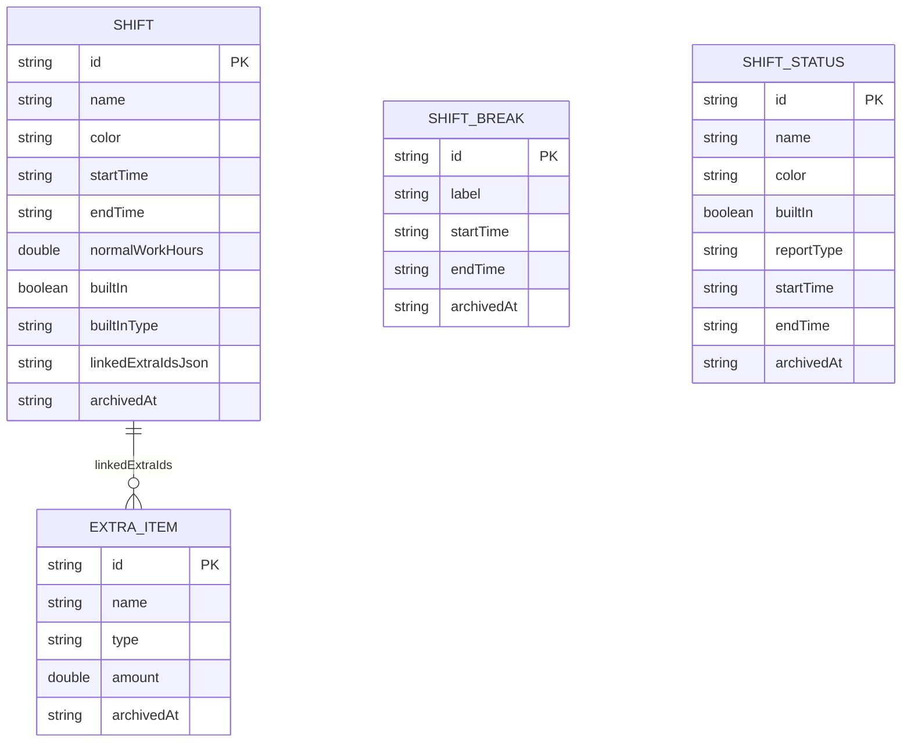

**图表来源** 
- [ShiftEntity.kt:8-23](file://app/src/main/java/com/schedulecalendar/app/data/db/entity/ShiftEntity.kt#L8-L23)
- [Models.kt:14-35](file://app/src/main/java/com/schedulecalendar/app/domain/model/Models.kt#L14-L35)
- [Models.kt:104-110](file://app/src/main/java/com/schedulecalendar/app/domain/model/Models.kt#L104-L110)

**章节来源**
- [ShiftEntity.kt:8-23](file://app/src/main/java/com/schedulecalendar/app/data/db/entity/ShiftEntity.kt#L8-L23)
- [Models.kt:14-35](file://app/src/main/java/com/schedulecalendar/app/domain/model/Models.kt#L14-L35)
- [Models.kt:104-110](file://app/src/main/java/com/schedulecalendar/app/domain/model/Models.kt#L104-L110)