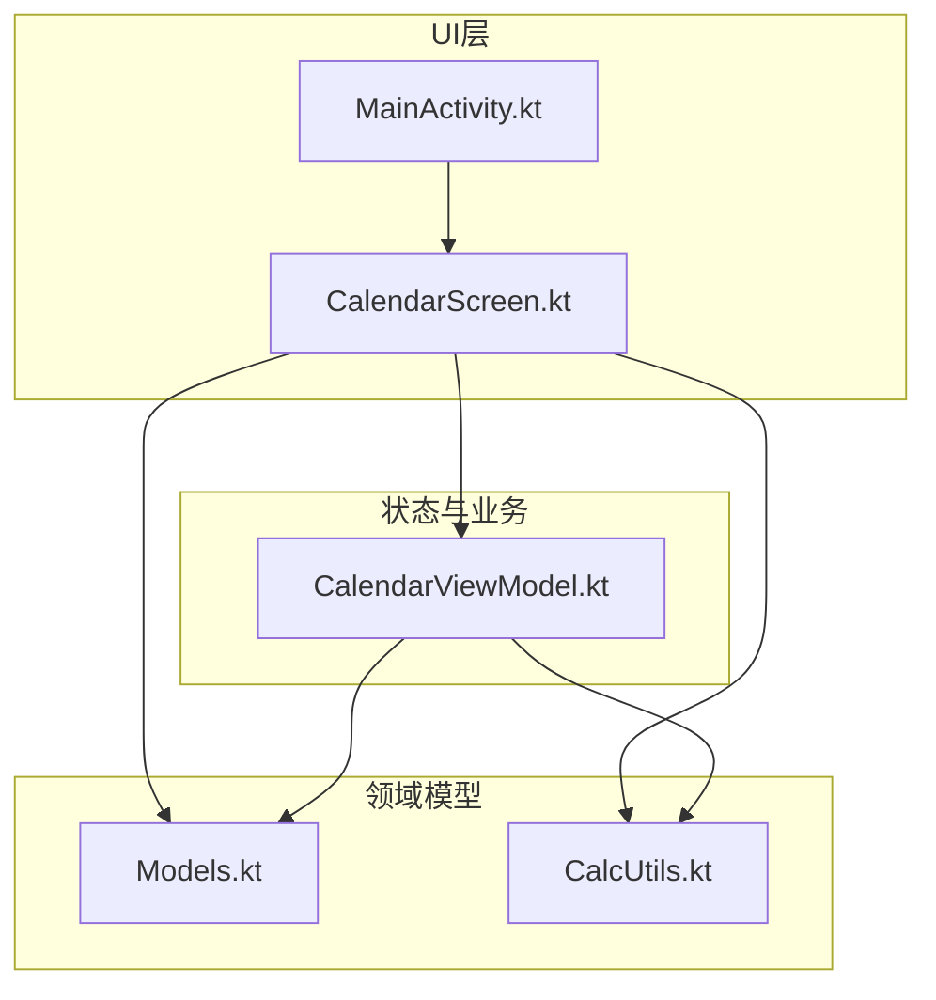
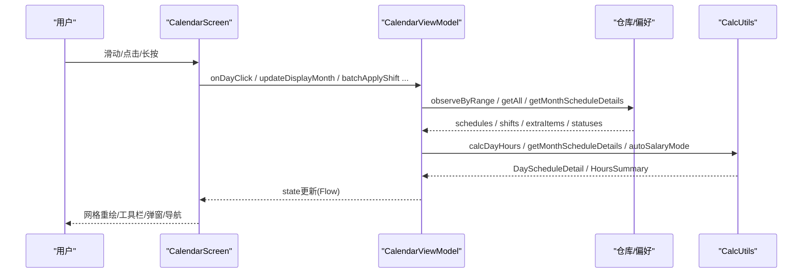
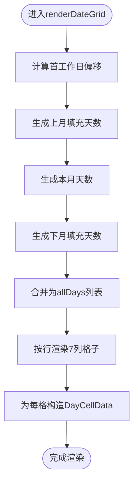
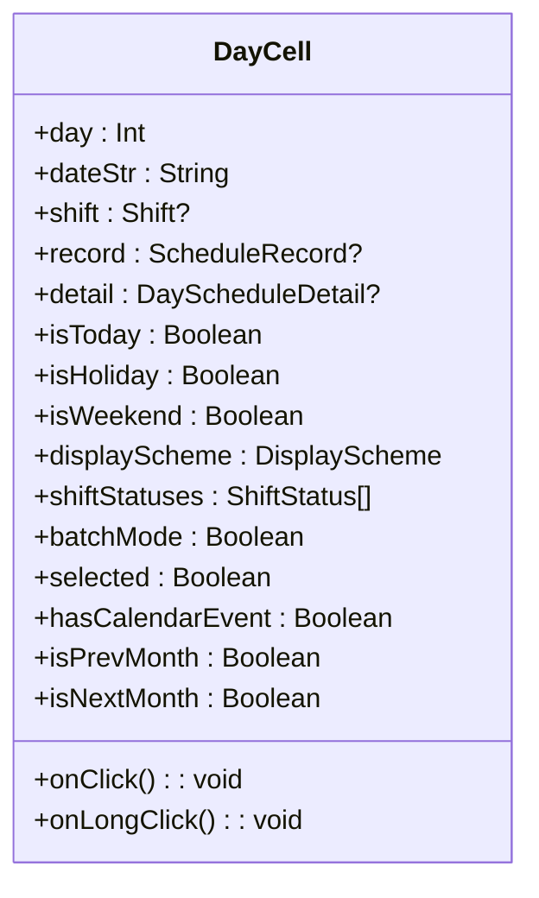
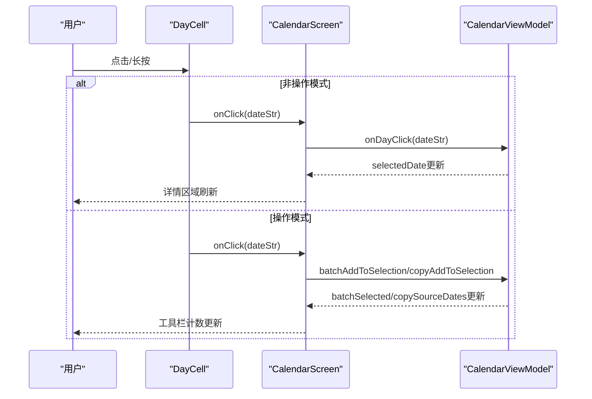
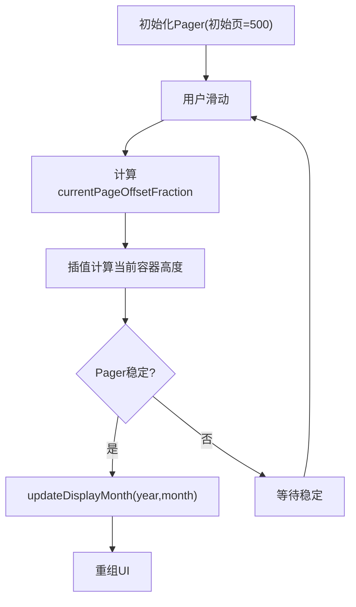
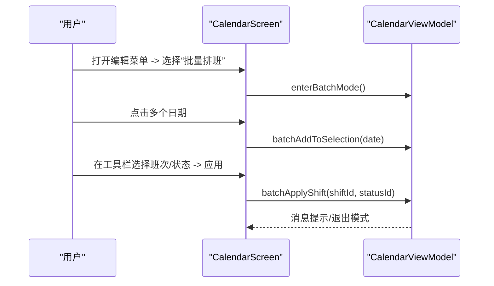
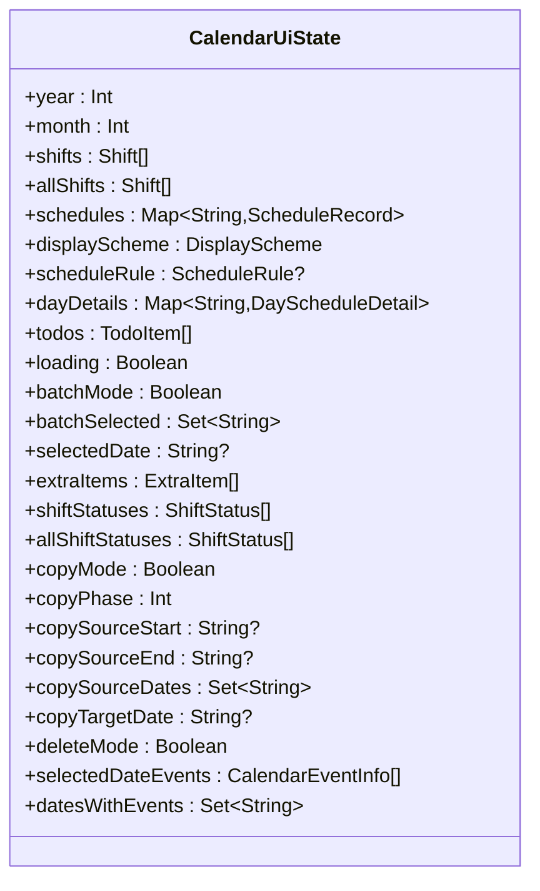
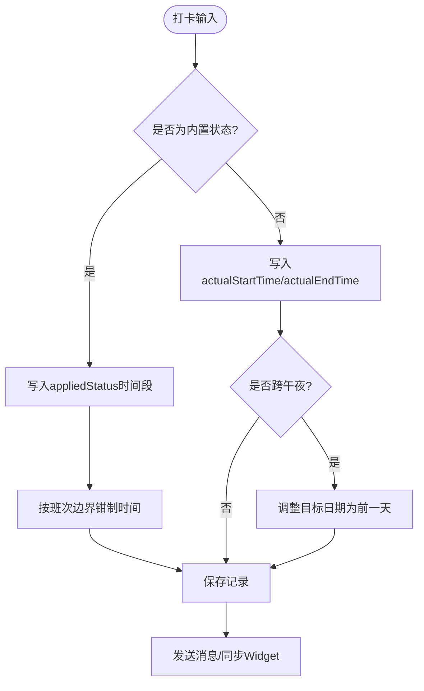
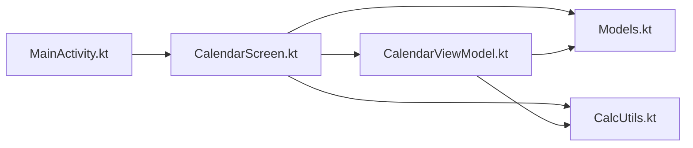

# 主日历界面

<cite>
**本文引用的文件**   
- [CalendarScreen.kt](file://app/src/main/java/com/schedulecalendar/app/ui/calendar/CalendarScreen.kt)
- [CalendarViewModel.kt](file://app/src/main/java/com/schedulecalendar/app/ui/calendar/CalendarViewModel.kt)
- [MainActivity.kt](file://app/src/main/java/com/schedulecalendar/app/MainActivity.kt)
- [Models.kt](file://app/src/main/java/com/schedulecalendar/app/domain/model/Models.kt)
- [CalcUtils.kt](file://app/src/main/java/com/schedulecalendar/app/domain/model/CalcUtils.kt)
</cite>

## 目录
1. [简介](#简介)
2. [项目结构](#项目结构)
3. [核心组件](#核心组件)
4. [架构总览](#架构总览)
5. [详细组件分析](#详细组件分析)
6. [依赖关系分析](#依赖关系分析)
7. [性能考量](#性能考量)
8. [故障排查指南](#故障排查指南)
9. [结论](#结论)
10. [附录：扩展与自定义指南](#附录扩展与自定义指南)

## 简介
本文件面向Android排班日历应用的主日历界面，聚焦基于Jetpack Compose的日历网格实现。内容涵盖日期导航、批量操作（批量排班/复制排班/删除排班）、排班显示、状态管理、数据绑定与用户交互处理；并深入解释HorizontalPager的使用、月份切换动画与性能优化策略，以及单元格渲染、选中状态管理与手势处理。最后提供日历扩展与自定义的开发指南，帮助开发者快速迭代和定制。

## 项目结构
主日历界面由以下关键模块组成：
- UI层：CalendarScreen.kt 负责日历网格、工具栏、弹窗与交互
- 状态与业务：CalendarViewModel.kt 负责状态流、数据加载、事件派发与业务逻辑
- 入口与系统交互：MainActivity.kt 负责返回键拦截、快捷方式与跨进程通知
- 领域模型：Models.kt 定义班次、记录、显示方案等数据结构
- 计算工具：CalcUtils.kt 提供工时、薪资、周末/节假日判断等计算能力

图表来源
- [CalendarScreen.kt:229-687](file://app/src/main/java/com/schedulecalendar/app/ui/calendar/CalendarScreen.kt#L229-L687)
- [CalendarViewModel.kt:118-246](file://app/src/main/java/com/schedulecalendar/app/ui/calendar/CalendarViewModel.kt#L118-L246)
- [Models.kt:50-101](file://app/src/main/java/com/schedulecalendar/app/domain/model/Models.kt#L50-L101)
- [CalcUtils.kt:148-234](file://app/src/main/java/com/schedulecalendar/app/domain/model/CalcUtils.kt#L148-L234)

章节来源
- [CalendarScreen.kt:229-687](file://app/src/main/java/com/schedulecalendar/app/ui/calendar/CalendarScreen.kt#L229-L687)
- [CalendarViewModel.kt:118-246](file://app/src/main/java/com/schedulecalendar/app/ui/calendar/CalendarViewModel.kt#L118-L246)
- [Models.kt:50-101](file://app/src/main/java/com/schedulecalendar/app/domain/model/Models.kt#L50-L101)
- [CalcUtils.kt:148-234](file://app/src/main/java/com/schedulecalendar/app/domain/model/CalcUtils.kt#L148-L234)

## 核心组件
- CalendarScreen：Compose页面，包含顶部栏、星期标题、日历网格、批量/复制/删除工具栏、日期详情、排班预览、纪念日与日程展示、年月选择器弹窗等
- CalendarViewModel：暴露state流与uiEvent通道，负责月份切换、数据收集、选中日期、打卡补录、加班确认/忽略、批量操作、复制排班、事件加载等
- MainActivity：处理返回键拦截、快捷方式动作、从小组件跳转日期导航
- Models：班次、附加状态、排班记录、显示方案、规则、薪资配置、考勤配置等
- CalcUtils：时间转换、跨天处理、考勤粒度、休息段扣减、日/月工时统计、薪资计算、自动计薪模式、周末判断等

章节来源
- [CalendarScreen.kt:229-687](file://app/src/main/java/com/schedulecalendar/app/ui/calendar/CalendarScreen.kt#L229-L687)
- [CalendarViewModel.kt:118-246](file://app/src/main/java/com/schedulecalendar/app/ui/calendar/CalendarViewModel.kt#L118-L246)
- [MainActivity.kt:34-262](file://app/src/main/java/com/schedulecalendar/app/MainActivity.kt#L34-L262)
- [Models.kt:50-101](file://app/src/main/java/com/schedulecalendar/app/domain/model/Models.kt#L50-L101)
- [CalcUtils.kt:148-234](file://app/src/main/java/com/schedulecalendar/app/domain/model/CalcUtils.kt#L148-L234)

## 架构总览
主日历界面采用“UI + ViewModel + 领域模型/工具”的分层架构。UI通过collectAsStateWithLifecycle订阅ViewModel的state流，触发重组；ViewModel通过Repository与DataStore获取数据，结合CalcUtils进行计算，并通过Channel发送UI事件（如导航、提示）。

图表来源
- [CalendarScreen.kt:229-687](file://app/src/main/java/com/schedulecalendar/app/ui/calendar/CalendarScreen.kt#L229-L687)
- [CalendarViewModel.kt:153-246](file://app/src/main/java/com/schedulecalendar/app/ui/calendar/CalendarViewModel.kt#L153-L246)
- [CalcUtils.kt:448-486](file://app/src/main/java/com/schedulecalendar/app/domain/model/CalcUtils.kt#L448-L486)

## 详细组件分析

### 日历网格与日期导航
- renderDateGrid：根据gridYear/gridMonth计算当月天数、首工作日偏移、前后月填充天数，生成7列多行的网格数据；为每个单元格构建DayCellData，包含shift、record、detail、today/holiday/weekend标记、selected状态、是否有日历事件等
- HorizontalPager：以超大初始页码（500）实现无限左右滑动；通过currentPageOffsetFraction插值高度，平滑过渡不同行数的月份；当pager稳定后同步到ViewModel的display month，避免频繁数据重载
- BackHandler与子模式：在批量/复制/删除模式下，BackHandler优先退出模式而非退出应用

图表来源
- [CalendarScreen.kt:92-225](file://app/src/main/java/com/schedulecalendar/app/ui/calendar/CalendarScreen.kt#L92-L225)

章节来源
- [CalendarScreen.kt:92-225](file://app/src/main/java/com/schedulecalendar/app/ui/calendar/CalendarScreen.kt#L92-L225)
- [CalendarScreen.kt:475-554](file://app/src/main/java/com/schedulecalendar/app/ui/calendar/CalendarScreen.kt#L475-L554)

### 单元格渲染与选中状态管理
- DayCell：负责单格渲染，包括日期数字、农历/节日文本、状态角标（早/迟/注）、事件指示点、班次/状态标签、数据行（支持SHIFT/STATUS与其他数据项组合），并根据selected/isToday/holiday/weekend决定背景与文字颜色
- 选中状态：根据当前模式（批量/复制/删除/普通）决定selected判定逻辑；在批量/复制/删除模式下，点击切换选中集合；长按进入详情页或进入操作模式
- 无障碍描述：为屏幕阅读器提供日期、班次、农历、是否今天/节假日等信息

图表来源
- [CalendarScreen.kt:719-1105](file://app/src/main/java/com/schedulecalendar/app/ui/calendar/CalendarScreen.kt#L719-L1105)

章节来源
- [CalendarScreen.kt:719-1105](file://app/src/main/java/com/schedulecalendar/app/ui/calendar/CalendarScreen.kt#L719-L1105)

### 手势处理与交互流程
- 点击：在非操作模式下仅更新selectedDate并加载该日期的纪念日与日程；在批量/复制/删除模式下切换选中集合或执行复制阶段逻辑
- 长按：非操作模式下导航至详情页；在操作模式下不触发导航
- 水平滑动：HorizontalPager控制月份切换，userScrollEnabled在操作模式下禁用以避免冲突
- 返回键：BackHandler在操作模式下优先退出模式

图表来源
- [CalendarScreen.kt:202-218](file://app/src/main/java/com/schedulecalendar/app/ui/calendar/CalendarScreen.kt#L202-L218)
- [CalendarViewModel.kt:402-413](file://app/src/main/java/com/schedulecalendar/app/ui/calendar/CalendarViewModel.kt#L402-L413)

章节来源
- [CalendarScreen.kt:202-218](file://app/src/main/java/com/schedulecalendar/app/ui/calendar/CalendarScreen.kt#L202-L218)
- [CalendarViewModel.kt:402-413](file://app/src/main/java/com/schedulecalendar/app/ui/calendar/CalendarViewModel.kt#L402-L413)

### 月份切换动画与HorizontalPager使用
- 使用rememberPagerState(initialPage = 500)创建虚拟中心页，向前/向后滑动时通过currentPageOffsetFraction插值高度，使相邻月份行数变化时的容器高度平滑过渡
- LaunchedEffect监听pagerState.settledPage，仅在稳定后调用updateDisplayMonth，避免滑动过程中的频繁数据加载
- LaunchedEffect监听state.year/month变化，若外部跳转到目标月份且不在滚动中，则animateScrollToPage同步Pager位置

图表来源
- [CalendarScreen.kt:491-528](file://app/src/main/java/com/schedulecalendar/app/ui/calendar/CalendarScreen.kt#L491-L528)

章节来源
- [CalendarScreen.kt:491-528](file://app/src/main/java/com/schedulecalendar/app/ui/calendar/CalendarScreen.kt#L491-L528)

### 批量操作与复制排班
- 批量排班：选择多个日期后，在BatchToolbar中选择班次与附加状态，确认后批量写入schedules，并清空选择集
- 复制排班：分两阶段——第一阶段选择源日期范围（连续），第二阶段选择目标起始位置，确认后执行复制
- 删除排班：选择多个日期后确认删除，清空对应记录并退出模式

图表来源
- [CalendarScreen.kt:557-602](file://app/src/main/java/com/schedulecalendar/app/ui/calendar/CalendarScreen.kt#L557-L602)
- [CalendarViewModel.kt:729-748](file://app/src/main/java/com/schedulecalendar/app/ui/calendar/CalendarViewModel.kt#L729-L748)

章节来源
- [CalendarScreen.kt:557-602](file://app/src/main/java/com/schedulecalendar/app/ui/calendar/CalendarScreen.kt#L557-L602)
- [CalendarViewModel.kt:729-748](file://app/src/main/java/com/schedulecalendar/app/ui/calendar/CalendarViewModel.kt#L729-L748)

### 数据绑定与状态管理
- state：包含year/month、shifts/allShifts、schedules、displayScheme、dayDetails、todos、extraItems、shiftStatuses/allShiftStatuses、copy/delete/batch模式相关字段、selectedDateEvents、datesWithEvents等
- uiEvent：用于向UI发送导航与消息事件（NavigateToDetail、ShowMessage、ShowError）
- loadCurrentMonth：combine多个数据源（班次、排班记录、显示方案、排班规则），计算当月及相邻月份的详情，更新state并同步Widget与日历事件集合

图表来源
- [CalendarViewModel.kt:64-108](file://app/src/main/java/com/schedulecalendar/app/ui/calendar/CalendarViewModel.kt#L64-L108)

章节来源
- [CalendarViewModel.kt:64-108](file://app/src/main/java/com/schedulecalendar/app/ui/calendar/CalendarViewModel.kt#L64-L108)
- [CalendarViewModel.kt:153-246](file://app/src/main/java/com/schedulecalendar/app/ui/calendar/CalendarViewModel.kt#L153-L246)

### 打卡与加班处理
- clockIn/clockOut：写入实际上下班时间，处理跨午夜归属前一天的情况，并推送消息与同步Widget
- fillMissedClock：补填漏打卡时间，内置状态（请假/调休）写入appliedStatus时间段，普通记录写入actualStartTime/actualEndTime，并进行跨午夜修正
- 加班确认/忽略：confirmEarlyOvertime/confirmLateOvertime与ignoreEarlyArrival/ignoreLateLeave，支持撤销操作

图表来源
- [CalendarViewModel.kt:475-502](file://app/src/main/java/com/schedulecalendar/app/ui/calendar/CalendarViewModel.kt#L475-L502)
- [CalendarViewModel.kt:505-559](file://app/src/main/java/com/schedulecalendar/app/ui/calendar/CalendarViewModel.kt#L505-L559)

章节来源
- [CalendarViewModel.kt:475-502](file://app/src/main/java/com/schedulecalendar/app/ui/calendar/CalendarViewModel.kt#L475-L502)
- [CalendarViewModel.kt:505-559](file://app/src/main/java/com/schedulecalendar/app/ui/calendar/CalendarViewModel.kt#L505-L559)

### 纪念日与日程展示
- 选中日期事件：loadSelectedDateEvents加载已启用账户的事件，过滤禁用账户
- 有事件的日期集合：loadDatesWithEvents遍历所有事件，考虑年度重复纪念日，计算范围内日期集合用于DayCell事件指示点

章节来源
- [CalendarViewModel.kt:416-473](file://app/src/main/java/com/schedulecalendar/app/ui/calendar/CalendarViewModel.kt#L416-L473)

## 依赖关系分析
- CalendarScreen依赖CalendarViewModel的状态与事件，依赖Models中的数据结构，依赖CalcUtils进行显示计算
- CalendarViewModel依赖仓库接口（ShiftRepository、ScheduleRepository、ShiftBreakRepository、ExtraItemRepository、ShiftStatusRepository、CalendarEventRepository）与AppPreferences，依赖CalcUtils进行计算
- MainActivity与CalendarScreen通过回调与属性共享子模式状态，确保返回键行为正确

图表来源
- [CalendarScreen.kt:229-687](file://app/src/main/java/com/schedulecalendar/app/ui/calendar/CalendarScreen.kt#L229-L687)
- [CalendarViewModel.kt:118-246](file://app/src/main/java/com/schedulecalendar/app/ui/calendar/CalendarViewModel.kt#L118-L246)
- [MainActivity.kt:34-262](file://app/src/main/java/com/schedulecalendar/app/MainActivity.kt#L34-L262)

章节来源
- [CalendarScreen.kt:229-687](file://app/src/main/java/com/schedulecalendar/app/ui/calendar/CalendarScreen.kt#L229-L687)
- [CalendarViewModel.kt:118-246](file://app/src/main/java/com/schedulecalendar/app/ui/calendar/CalendarViewModel.kt#L118-L246)
- [MainActivity.kt:34-262](file://app/src/main/java/com/schedulecalendar/app/MainActivity.kt#L34-L262)

## 性能考量
- 数据收集Job管理：每次切月取消旧collectJob再启动新Job，防止collector累积泄漏
- 分页与插值：HorizontalPager使用超大初始页码与插值高度，减少重组与布局抖动
- 轻量更新：updateDisplayMonth仅更新display month，不触发loading闪烁；goToToday在同月情况下仅更新selectedDate
- 懒加载与过滤：只加载必要的数据范围（上月1日到下月末日），并在UI层按需显示（如只在非操作模式显示详情区域）
- 计算优化：CalcUtils对跨天、粒度取整、休息段扣减等进行高效计算，避免重复计算

章节来源
- [CalendarViewModel.kt:153-246](file://app/src/main/java/com/schedulecalendar/app/ui/calendar/CalendarViewModel.kt#L153-L246)
- [CalendarScreen.kt:491-528](file://app/src/main/java/com/schedulecalendar/app/ui/calendar/CalendarScreen.kt#L491-L528)
- [CalcUtils.kt:148-234](file://app/src/main/java/com/schedulecalendar/app/domain/model/CalcUtils.kt#L148-L234)

## 故障排查指南
- 返回键行为异常：检查MainActivity的isOnTabPage与calendarSubModeActive状态更新，确保BackHandler优先级正确
- 月份切换卡顿：确认pagerState.isScrollInProgress条件，避免在滚动中触发数据更新；检查LaunchedEffect监听settledPage
- 打卡时间错误：检查跨午夜修正逻辑，确保下班打卡时间早于班次结束时间时归属前一天
- 事件指示点缺失：确认loadDatesWithEvents是否正确过滤禁用账户，并处理年度重复纪念日

章节来源
- [MainActivity.kt:54-79](file://app/src/main/java/com/schedulecalendar/app/MainActivity.kt#L54-L79)
- [CalendarScreen.kt:513-528](file://app/src/main/java/com/schedulecalendar/app/ui/calendar/CalendarScreen.kt#L513-L528)
- [CalendarViewModel.kt:483-502](file://app/src/main/java/com/schedulecalendar/app/ui/calendar/CalendarViewModel.kt#L483-L502)
- [CalendarViewModel.kt:433-473](file://app/src/main/java/com/schedulecalendar/app/ui/calendar/CalendarViewModel.kt#L433-L473)

## 结论
主日历界面通过清晰的UI与ViewModel分层、高效的HorizontalPager与插值动画、完善的批量操作与复制排班机制，提供了流畅的日历体验。状态管理与数据绑定遵循Compose最佳实践，CalcUtils确保计算准确性与一致性。开发者可在此基础上扩展显示方案、自定义单元格渲染与交互逻辑。

## 附录：扩展与自定义指南
- 扩展显示方案：在Models.kt中定义新的DisplayItemType与DataRowConfig，并在DayCell中增加对应的渲染逻辑
- 自定义单元格样式：修改DayCell的背景色、边框、文字颜色与形状，注意保持无障碍描述一致
- 新增手势：在DayCell的pointerInput中添加新的detectTapGestures或drag手势，并在ViewModel中处理相应状态变更
- 集成第三方日历：在CalendarViewModel中扩展CalendarEventRepository，支持更多日历源与同步策略
- 性能优化：对大数据量场景，考虑分页加载与缓存策略，减少重组次数

章节来源
- [Models.kt:144-181](file://app/src/main/java/com/schedulecalendar/app/domain/model/Models.kt#L144-L181)
- [CalendarScreen.kt:719-1105](file://app/src/main/java/com/schedulecalendar/app/ui/calendar/CalendarScreen.kt#L719-L1105)
- [CalendarViewModel.kt:153-246](file://app/src/main/java/com/schedulecalendar/app/ui/calendar/CalendarViewModel.kt#L153-L246)