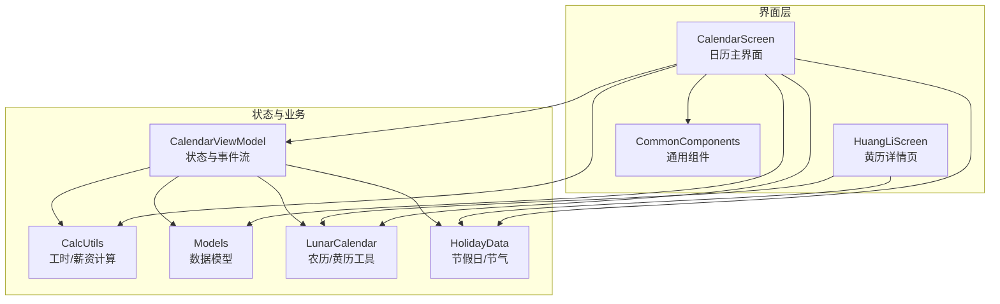
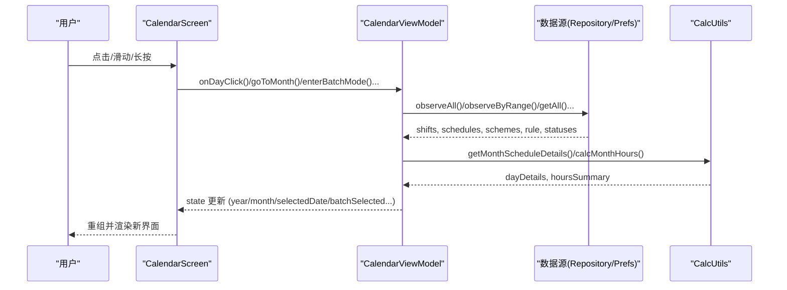
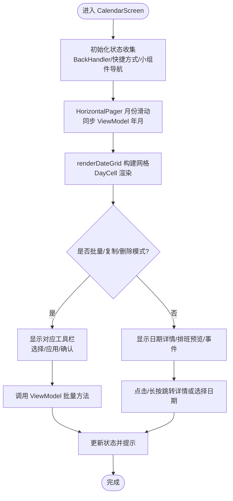
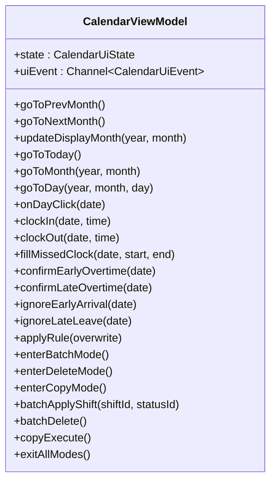
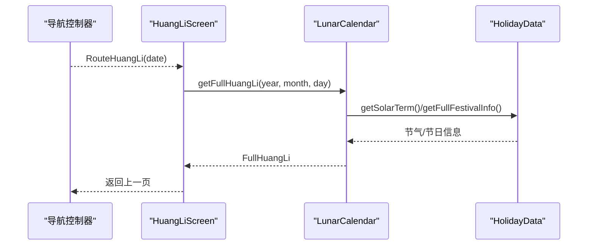
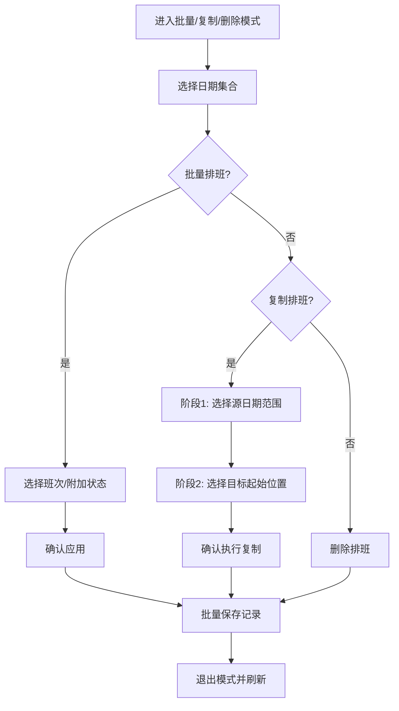
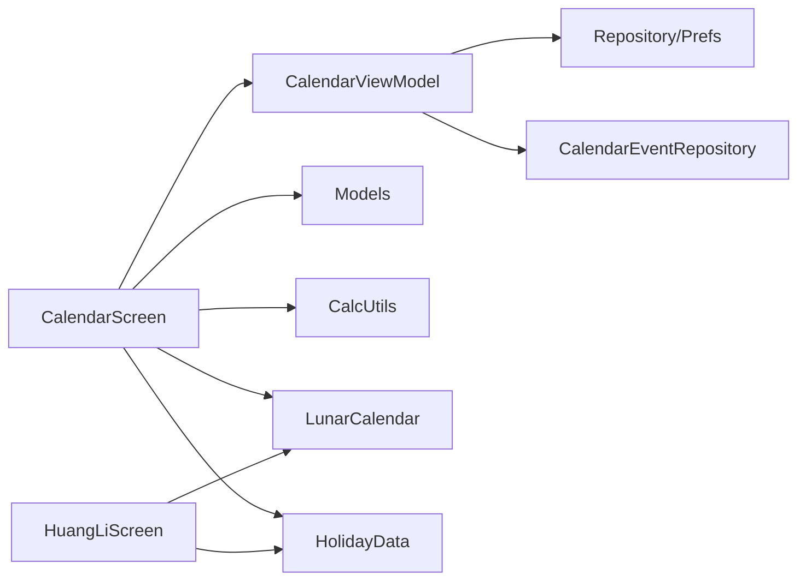

# 日历界面

<cite>
**本文引用的文件**   
- [CalendarScreen.kt](file://app/src/main/java/com/schedulecalendar/app/ui/calendar/CalendarScreen.kt)
- [CalendarViewModel.kt](file://app/src/main/java/com/schedulecalendar/app/ui/calendar/CalendarViewModel.kt)
- [HuangLiScreen.kt](file://app/src/main/java/com/schedulecalendar/app/ui/calendar/HuangLiScreen.kt)
- [LunarCalendar.kt](file://app/src/main/java/com/schedulecalendar/app/domain/model/LunarCalendar.kt)
- [HolidayData.kt](file://app/src/main/java/com/schedulecalendar/app/domain/model/HolidayData.kt)
- [Models.kt](file://app/src/main/java/com/schedulecalendar/app/domain/model/Models.kt)
- [CalcUtils.kt](file://app/src/main/java/com/schedulecalendar/app/domain/model/CalcUtils.kt)
- [CommonComponents.kt](file://app/src/main/java/com/schedulecalendar/app/ui/component/CommonComponents.kt)
</cite>

## 目录
1. [简介](#简介)
2. [项目结构](#项目结构)
3. [核心组件](#核心组件)
4. [架构总览](#架构总览)
5. [详细组件分析](#详细组件分析)
6. [依赖关系分析](#依赖关系分析)
7. [性能与优化](#性能与优化)
8. [故障排查指南](#故障排查指南)
9. [结论](#结论)
10. [附录：扩展与自定义指南](#附录扩展与自定义指南)

## 简介
本文件面向 Android 排班日历应用的“日历界面”模块，聚焦基于 Jetpack Compose 的日历组件实现。内容涵盖日期导航、批量操作（批量排班/复制排班/删除排班）、排班显示与详情联动；深入解析日历状态管理、数据绑定与用户交互处理；说明黄历功能集成与农历日期显示；并提供性能优化、内存管理与重组优化策略，以及扩展与自定义开发指南。

## 项目结构
日历界面位于 ui/calendar 包下，包含主界面与黄历详情页；领域模型与计算逻辑在 domain/model 包中；通用 UI 组件在 ui/component 包中。整体采用 MVVM + Compose 架构，ViewModel 通过 Flow 暴露状态，UI 层以 StateFlow 收集并驱动重组。

**图表来源** 
- [CalendarScreen.kt:229-687](file://app/src/main/java/com/schedulecalendar/app/ui/calendar/CalendarScreen.kt#L229-L687)
- [CalendarViewModel.kt:118-246](file://app/src/main/java/com/schedulecalendar/app/ui/calendar/CalendarViewModel.kt#L118-L246)
- [HuangLiScreen.kt:33-240](file://app/src/main/java/com/schedulecalendar/app/ui/calendar/HuangLiScreen.kt#L33-L240)
- [CalcUtils.kt:16-557](file://app/src/main/java/com/schedulecalendar/app/domain/model/CalcUtils.kt#L16-L557)
- [Models.kt:1-278](file://app/src/main/java/com/schedulecalendar/app/domain/model/Models.kt#L1-L278)
- [LunarCalendar.kt:13-198](file://app/src/main/java/com/schedulecalendar/app/domain/model/LunarCalendar.kt#L13-L198)
- [HolidayData.kt:9-175](file://app/src/main/java/com/schedulecalendar/app/domain/model/HolidayData.kt#L9-L175)

**章节来源**
- [CalendarScreen.kt:229-687](file://app/src/main/java/com/schedulecalendar/app/ui/calendar/CalendarScreen.kt#L229-L687)
- [CalendarViewModel.kt:118-246](file://app/src/main/java/com/schedulecalendar/app/ui/calendar/CalendarViewModel.kt#L118-L246)

## 核心组件
- CalendarScreen：日历主界面，负责年月导航、月份滑动切换、网格渲染、批量/复制/删除模式工具栏、日期详情与纪念日/日程展示入口。
- CalendarViewModel：集中管理日历状态（当前年月、选中日期、班次/记录/详情、批量选择集、复制阶段等），提供月份切换、日期点击、打卡、批量操作、规则应用、事件通知等方法。
- HuangLiScreen：黄历详情页，展示公历/农历、干支、宜忌、吉时等完整信息。
- LunarCalendar：农历转换与黄历信息计算（含时辰吉凶、五行、冲煞、星宿等）。
- HolidayData：法定节假日、调休补班、二十四节气与传统节日映射。
- CalcUtils：工时/薪资计算、考勤粒度处理、周末/节假日判定、月统计与每日明细生成。
- Models：班次、状态、排班记录、显示方案、薪资配置等核心数据结构。
- CommonComponents：时间选择器、滚动适配输入框等通用 UI 组件。

**章节来源**
- [CalendarScreen.kt:229-687](file://app/src/main/java/com/schedulecalendar/app/ui/calendar/CalendarScreen.kt#L229-L687)
- [CalendarViewModel.kt:118-246](file://app/src/main/java/com/schedulecalendar/app/ui/calendar/CalendarViewModel.kt#L118-L246)
- [HuangLiScreen.kt:33-240](file://app/src/main/java/com/schedulecalendar/app/ui/calendar/HuangLiScreen.kt#L33-L240)
- [LunarCalendar.kt:13-198](file://app/src/main/java/com/schedulecalendar/app/domain/model/LunarCalendar.kt#L13-L198)
- [HolidayData.kt:9-175](file://app/src/main/java/com/schedulecalendar/app/domain/model/HolidayData.kt#L9-L175)
- [CalcUtils.kt:16-557](file://app/src/main/java/com/schedulecalendar/app/domain/model/CalcUtils.kt#L16-L557)
- [Models.kt:1-278](file://app/src/main/java/com/schedulecalendar/app/domain/model/Models.kt#L1-L278)
- [CommonComponents.kt:170-342](file://app/src/main/java/com/schedulecalendar/app/ui/component/CommonComponents.kt#L170-L342)

## 架构总览
日历界面采用“状态提升 + 单向数据流”的 Compose 模式：
- ViewModel 通过 MutableStateFlow 暴露 CalendarUiState，UI 使用 collectAsStateWithLifecycle 订阅。
- 用户交互（点击、长按、滑动）触发 ViewModel 方法，更新状态或发送事件（NavigateToDetail、ShowMessage、ShowError）。
- 数据源（班次、排班记录、显示方案、规则、附加状态等）通过 Repository/Prefs 聚合后由 ViewModel 合并计算，输出 dayDetails、todos、datesWithEvents 等供 UI 展示。

**图表来源** 
- [CalendarScreen.kt:229-687](file://app/src/main/java/com/schedulecalendar/app/ui/calendar/CalendarScreen.kt#L229-L687)
- [CalendarViewModel.kt:153-246](file://app/src/main/java/com/schedulecalendar/app/ui/calendar/CalendarViewModel.kt#L153-L246)
- [CalcUtils.kt:448-486](file://app/src/main/java/com/schedulecalendar/app/domain/model/CalcUtils.kt#L448-L486)

## 详细组件分析

### CalendarScreen（日历主界面）
- 顶部栏：显示年月、待办提醒计数、“今天”按钮、编辑菜单（显示方案/批量排班/复制排班/删除排班）。
- 星期标题行固定于顶部，不随内容滚动。
- 主体区域：LazyColumn 包裹 HorizontalPager 实现月份平滑滑动；根据当月行数动态高度插值，保证滑动画面的连贯性。
- 日期网格：renderDateGrid 计算上月填充、当月、下月填充，构造 DayCellData，按显示方案渲染数据项（工时、收入、班次、状态等）。
- 工具栏：批量模式、清除模式、复制模式分别显示对应工具栏，支持选择、应用、确认等操作。
- 详情区：非批量模式下显示选中日期的详情、排班预览、纪念日与日程事件列表。
- 弹窗：滚轮日期选择器、月份复制对话框。

**图表来源** 
- [CalendarScreen.kt:229-687](file://app/src/main/java/com/schedulecalendar/app/ui/calendar/CalendarScreen.kt#L229-L687)
- [CalendarScreen.kt:801-1105](file://app/src/main/java/com/schedulecalendar/app/ui/calendar/CalendarScreen.kt#L801-L1105)

**章节来源**
- [CalendarScreen.kt:229-687](file://app/src/main/java/com/schedulecalendar/app/ui/calendar/CalendarScreen.kt#L229-L687)
- [CalendarScreen.kt:801-1105](file://app/src/main/java/com/schedulecalendar/app/ui/calendar/CalendarScreen.kt#L801-L1105)

### CalendarViewModel（状态与业务）
- 状态字段：year/month、shifts/allShifts、schedules、displayScheme、dayDetails、todos、batch/copy/delete 模式相关字段、selectedDate、extraItems、shiftStatuses/allShiftStatuses、selectedDateEvents、datesWithEvents。
- 数据加载：loadCurrentMonth 使用 combine 聚合班次、排班、显示方案、规则，计算相邻月份详情，生成 todos 与 datesWithEvents，并同步 Widget 与日历事件。
- 月份切换：goToPrevMonth/goToNextMonth/updateDisplayMonth/goToToday/goToMonth/goToDay。
- 日期操作：onDayClick、clockIn/clockOut、fillMissedClock、加班确认/忽略及撤销。
- 批量操作：enterBatchMode/enterDeleteMode/enterCopyMode、batchApplyShift/batchDelete、copyExecute 等。
- 事件通道：uiEvent 发送 NavigateToDetail、ShowMessage、ShowError。

**图表来源** 
- [CalendarViewModel.kt:118-246](file://app/src/main/java/com/schedulecalendar/app/ui/calendar/CalendarViewModel.kt#L118-L246)
- [CalendarViewModel.kt:345-400](file://app/src/main/java/com/schedulecalendar/app/ui/calendar/CalendarViewModel.kt#L345-L400)
- [CalendarViewModel.kt:475-587](file://app/src/main/java/com/schedulecalendar/app/ui/calendar/CalendarViewModel.kt#L475-L587)
- [CalendarViewModel.kt:645-694](file://app/src/main/java/com/schedulecalendar/app/ui/calendar/CalendarViewModel.kt#L645-L694)
- [CalendarViewModel.kt:696-800](file://app/src/main/java/com/schedulecalendar/app/ui/calendar/CalendarViewModel.kt#L696-L800)

**章节来源**
- [CalendarViewModel.kt:118-246](file://app/src/main/java/com/schedulecalendar/app/ui/calendar/CalendarViewModel.kt#L118-L246)
- [CalendarViewModel.kt:345-400](file://app/src/main/java/com/schedulecalendar/app/ui/calendar/CalendarViewModel.kt#L345-L400)
- [CalendarViewModel.kt:475-587](file://app/src/main/java/com/schedulecalendar/app/ui/calendar/CalendarViewModel.kt#L475-L587)
- [CalendarViewModel.kt:645-694](file://app/src/main/java/com/schedulecalendar/app/ui/calendar/CalendarViewModel.kt#L645-L694)
- [CalendarViewModel.kt:696-800](file://app/src/main/java/com/schedulecalendar/app/ui/calendar/CalendarViewModel.kt#L696-L800)

### HuangLiScreen（黄历详情）
- 从路由参数获取日期，默认当天。
- 调用 LunarCalendar.getFullHuangLi 获取完整黄历信息，包括农历、干支、宜忌、吉神凶神、建除值神、星宿五行、纳音五行、胎神、十二时辰吉凶等。
- 展示布局分为顶部日期卡片与信息卡片，底部为吉时网格。

**图表来源** 
- [HuangLiScreen.kt:33-240](file://app/src/main/java/com/schedulecalendar/app/ui/calendar/HuangLiScreen.kt#L33-L240)
- [LunarCalendar.kt:172-198](file://app/src/main/java/com/schedulecalendar/app/domain/model/LunarCalendar.kt#L172-L198)
- [HolidayData.kt:611-634](file://app/src/main/java/com/schedulecalendar/app/domain/model/HolidayData.kt#L611-L634)

**章节来源**
- [HuangLiScreen.kt:33-240](file://app/src/main/java/com/schedulecalendar/app/ui/calendar/HuangLiScreen.kt#L33-L240)
- [LunarCalendar.kt:172-198](file://app/src/main/java/com/schedulecalendar/app/domain/model/LunarCalendar.kt#L172-L198)

### 农历与黄历集成
- 农历文本：CalendarScreen 的 DayCell 通过 LunarCalendar.getLunarDayText 获取“初一/初二...”或月份名称（如“正月”）。
- 节假日优先级：优先显示法定节假日名称（首日高亮），其次节气、传统节日、国际节日，最后回退到农历文本。
- 黄历详情：HuangLiScreen 展示完整黄历信息，包括宜忌、冲煞、值神、星宿、纳音五行、胎神、十二时辰吉凶等。

**章节来源**
- [CalendarScreen.kt:801-822](file://app/src/main/java/com/schedulecalendar/app/ui/calendar/CalendarScreen.kt#L801-L822)
- [LunarCalendar.kt:69-72](file://app/src/main/java/com/schedulecalendar/app/domain/model/LunarCalendar.kt#L69-L72)
- [HolidayData.kt:611-634](file://app/src/main/java/com/schedulecalendar/app/domain/model/HolidayData.kt#L611-L634)

### 批量操作与复制排班
- 批量排班：选择多个日期，展开面板选择班次与附加状态，确认后批量写入 ScheduleRecord。
- 复制排班：两阶段流程——第一阶段选择源日期范围，第二阶段选择目标起始位置，确认后执行复制。
- 删除排班：选择多个日期后一键删除。

**图表来源** 
- [CalendarScreen.kt:1109-1305](file://app/src/main/java/com/schedulecalendar/app/ui/calendar/CalendarScreen.kt#L1109-L1305)
- [CalendarScreen.kt:1380-1469](file://app/src/main/java/com/schedulecalendar/app/ui/calendar/CalendarScreen.kt#L1380-L1469)
- [CalendarViewModel.kt:729-800](file://app/src/main/java/com/schedulecalendar/app/ui/calendar/CalendarViewModel.kt#L729-L800)

**章节来源**
- [CalendarScreen.kt:1109-1305](file://app/src/main/java/com/schedulecalendar/app/ui/calendar/CalendarScreen.kt#L1109-L1305)
- [CalendarScreen.kt:1380-1469](file://app/src/main/java/com/schedulecalendar/app/ui/calendar/CalendarScreen.kt#L1380-L1469)
- [CalendarViewModel.kt:729-800](file://app/src/main/java/com/schedulecalendar/app/ui/calendar/CalendarViewModel.kt#L729-L800)

## 依赖关系分析
- CalendarScreen 依赖 CalendarViewModel 提供的状态与事件；依赖 Models 中的 DisplayScheme、Shift、ScheduleRecord、ExtraItem、ShiftStatus 等；依赖 CalcUtils 进行工时/薪资计算；依赖 LunarCalendar 与 HolidayData 进行农历/节假日显示。
- CalendarViewModel 依赖 Repository（班次、排班、附加状态、额外项目）、AppPreferences（显示方案、规则、排序）、BackupManager、CalendarEventRepository（纪念日/日程）。
- HuangLiScreen 依赖 LunarCalendar 与 HolidayData 提供黄历与节日信息。

**图表来源** 
- [CalendarScreen.kt:229-687](file://app/src/main/java/com/schedulecalendar/app/ui/calendar/CalendarScreen.kt#L229-L687)
- [CalendarViewModel.kt:118-246](file://app/src/main/java/com/schedulecalendar/app/ui/calendar/CalendarViewModel.kt#L118-L246)
- [HuangLiScreen.kt:33-240](file://app/src/main/java/com/schedulecalendar/app/ui/calendar/HuangLiScreen.kt#L33-L240)

**章节来源**
- [CalendarScreen.kt:229-687](file://app/src/main/java/com/schedulecalendar/app/ui/calendar/CalendarScreen.kt#L229-L687)
- [CalendarViewModel.kt:118-246](file://app/src/main/java/com/schedulecalendar/app/ui/calendar/CalendarViewModel.kt#L118-L246)
- [HuangLiScreen.kt:33-240](file://app/src/main/java/com/schedulecalendar/app/ui/calendar/HuangLiScreen.kt#L33-L240)

## 性能与优化
- 重组优化：
  - 使用 collectAsStateWithLifecycle 订阅 StateFlow，避免不必要的重组。
  - LaunchedEffect 仅在 pagerState.settledPage 变化时更新 ViewModel 的 display month，减少频繁触发。
  - renderDateGrid 内部对 DayCellData 进行一次性计算，避免重复计算。
- 内存管理：
  - loadCurrentMonth 使用 collectJob 控制协程生命周期，切月时取消旧 Job，防止泄漏。
  - 使用 remember 缓存 shiftMap、pagerState、listState 等，降低重建开销。
- 计算优化：
  - CalcUtils.getMonthScheduleDetails 一次性生成当月+相邻月份详情，供滑动联动使用。
  - HolidayData 内置节假日与节气映射，避免运行时网络请求。
- 渲染优化：
  - HorizontalPager 配合动态高度插值，确保滑动流畅。
  - LazyColumn 仅渲染可见项，减少绘制压力。

[本节为通用指导，不直接分析具体文件]

## 故障排查指南
- 月份切换闪烁：检查 goToMonth 是否正确设置 loading 与清空 dayDetails/todos；确认 updateDisplayMonth 未触发不必要的数据重载。
- 批量操作无效：确认 batchSelected 集合非空；检查 BatchToolbar 的 onApplyShift/onConfirmDelete 回调是否正确传递参数。
- 复制排班失败：确认阶段1已选择连续范围（sourceStart/sourceEnd），阶段2已选择目标起始位置（copyTargetDate）。
- 黄历信息缺失：检查 LunarCalendar.getFullHuangLi 是否成功；确认 HolidayData 的节假日/节气映射是否覆盖目标日期。
- 打卡跨午夜错误：clockOut 中对 endTime < shift.endTime 的情况进行前一天修正；fillMissedClock 同样处理跨午夜场景。

**章节来源**
- [CalendarViewModel.kt:383-400](file://app/src/main/java/com/schedulecalendar/app/ui/calendar/CalendarViewModel.kt#L383-L400)
- [CalendarViewModel.kt:475-502](file://app/src/main/java/com/schedulecalendar/app/ui/calendar/CalendarViewModel.kt#L475-L502)
- [CalendarViewModel.kt:505-559](file://app/src/main/java/com/schedulecalendar/app/ui/calendar/CalendarViewModel.kt#L505-L559)
- [HuangLiScreen.kt:33-240](file://app/src/main/java/com/schedulecalendar/app/ui/calendar/HuangLiScreen.kt#L33-L240)

## 结论
日历界面通过 Compose 的状态驱动与 ViewModel 的业务编排，实现了高效的日期导航、批量操作与排班显示。农历与黄历功能的集成提升了用户体验，而性能优化策略确保了流畅的交互体验。开发者可在此基础上扩展更多显示方案与自定义样式，满足多样化需求。

[本节为总结，不直接分析具体文件]

## 附录：扩展与自定义指南
- 新增显示方案：
  - 在 Models.DisplayScheme.dataRows 中添加 DataRowConfig，定义每行的 DisplayItemType 与背景色。
  - CalendarScreen 的 DayCell 会根据 schemeHasShiftItem/schemeHasStatusItem 决定是否显示 SHIFT/STATUS 标签。
- 自定义颜色与样式：
  - 使用 safeColor 解析十六进制颜色；textColorForBg 自动计算对比文字色。
  - 可通过 CommonComponents.ColorPicker 选择预设颜色。
- 扩展农历/黄历信息：
  - 在 LunarCalendar 中增加新的计算逻辑（如生肖、星座等），并在 HuangLiScreen 中展示。
- 批量操作扩展：
  - 在 BatchToolbar 中新增操作按钮，并在 CalendarViewModel 中实现对应方法。
- 性能优化建议：
  - 使用 remember 缓存复杂计算结果。
  - 避免在重组中进行耗时操作，必要时使用 withContext(Dispatchers.IO)。

**章节来源**
- [Models.kt:169-181](file://app/src/main/java/com/schedulecalendar/app/domain/model/Models.kt#L169-L181)
- [CalendarScreen.kt:826-834](file://app/src/main/java/com/schedulecalendar/app/ui/calendar/CalendarScreen.kt#L826-L834)
- [CommonComponents.kt:79-104](file://app/src/main/java/com/schedulecalendar/app/ui/component/CommonComponents.kt#L79-L104)
- [LunarCalendar.kt:172-198](file://app/src/main/java/com/schedulecalendar/app/domain/model/LunarCalendar.kt#L172-L198)