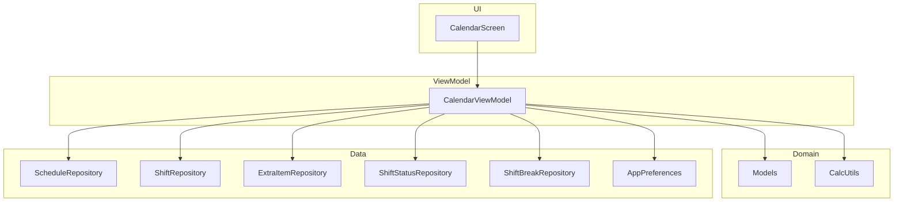
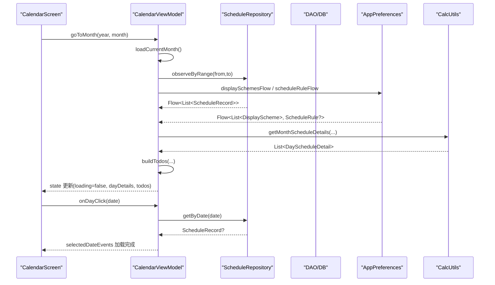
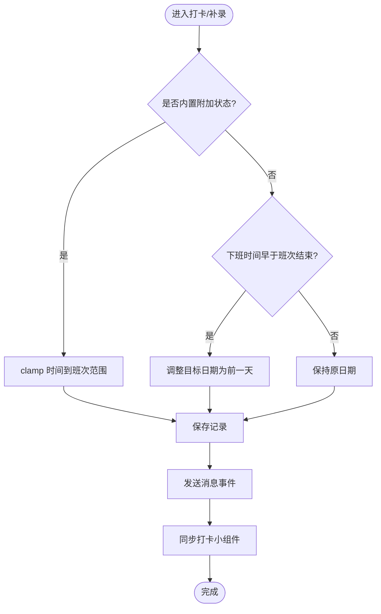
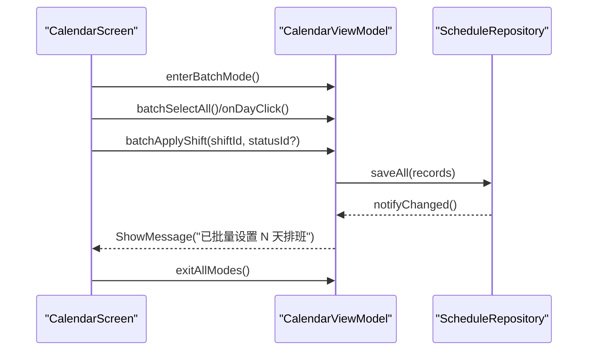
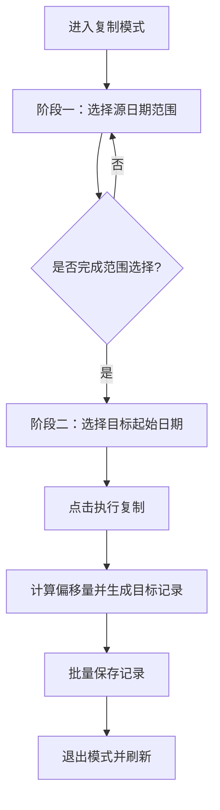
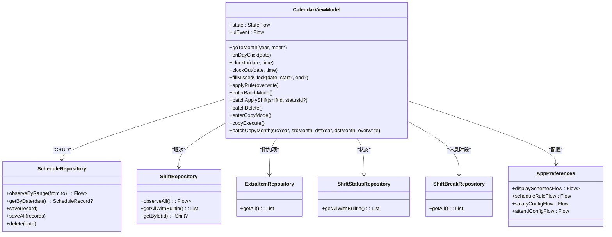

# 日历视图模型

<cite>
**本文引用的文件**   
- [CalendarViewModel.kt](file://app/src/main/java/com/schedulecalendar/app/ui/calendar/CalendarViewModel.kt)
- [CalendarScreen.kt](file://app/src/main/java/com/schedulecalendar/app/ui/calendar/CalendarScreen.kt)
- [ScheduleRepository.kt](file://app/src/main/java/com/schedulecalendar/app/data/repository/ScheduleRepository.kt)
- [ShiftRepository.kt](file://app/src/main/java/com/schedulecalendar/app/data/repository/ShiftRepository.kt)
- [ExtraItemRepository.kt](file://app/src/main/java/com/schedulecalendar/app/data/repository/ExtraItemRepository.kt)
- [ShiftStatusRepository.kt](file://app/src/main/java/com/schedulecalendar/app/data/repository/ShiftStatusRepository.kt)
- [ShiftBreakRepository.kt](file://app/src/main/java/com/schedulecalendar/app/data/repository/ShiftBreakRepository.kt)
- [AppPreferences.kt](file://app/src/main/java/com/schedulecalendar/app/data/prefs/AppPreferences.kt)
- [Models.kt](file://app/src/main/java/com/schedulecalendar/app/domain/model/Models.kt)
- [CalcUtils.kt](file://app/src/main/java/com/schedulecalendar/app/domain/model/CalcUtils.kt)
</cite>

## 目录
1. [简介](#简介)
2. [项目结构](#项目结构)
3. [核心组件](#核心组件)
4. [架构总览](#架构总览)
5. [详细组件分析](#详细组件分析)
6. [依赖关系分析](#依赖关系分析)
7. [性能考量](#性能考量)
8. [故障排查指南](#故障排查指南)
9. [结论](#结论)
10. [附录](#附录)

## 简介
本文件聚焦于 Android 排班日历应用的“日历视图模型”（CalendarViewModel），系统性阐述其状态管理、业务逻辑与数据流控制，覆盖批量操作、复制排班、删除排班等关键功能；解释与 Repository 层的交互、数据库操作与事件处理机制；并提供状态同步、错误处理与性能优化策略，以及扩展与自定义开发指南。

## 项目结构
- UI 层：CalendarScreen 负责 Compose 界面渲染与用户交互，通过 ViewModel 暴露的 state 与 uiEvent 驱动更新。
- 视图模型层：CalendarViewModel 集中管理当月日历状态、待办事项、批量/复制/删除模式、打卡补录、规则应用、小组件同步等。
- 领域层：Models 定义班次、状态、附加项、薪资配置、显示方案等核心数据结构；CalcUtils 提供工时/薪资计算工具。
- 数据层：多个 Repository 封装 DAO 访问与 Flow 观察，统一转换 Domain 对象并触发刷新信号。
- 偏好设置：AppPreferences 基于 DataStore 暴露配置与排序等 Flow 与读写接口。

图表来源
- [CalendarScreen.kt:229-687](file://app/src/main/java/com/schedulecalendar/app/ui/calendar/CalendarScreen.kt#L229-L687)
- [CalendarViewModel.kt:118-246](file://app/src/main/java/com/schedulecalendar/app/ui/calendar/CalendarViewModel.kt#L118-L246)
- [Models.kt:51-101](file://app/src/main/java/com/schedulecalendar/app/domain/model/Models.kt#L51-L101)
- [CalcUtils.kt:16-557](file://app/src/main/java/com/schedulecalendar/app/domain/model/CalcUtils.kt#L16-L557)
- [ScheduleRepository.kt:13-39](file://app/src/main/java/com/schedulecalendar/app/data/repository/ScheduleRepository.kt#L13-L39)
- [ShiftRepository.kt:12-44](file://app/src/main/java/com/schedulecalendar/app/data/repository/ShiftRepository.kt#L12-L44)
- [ExtraItemRepository.kt:12-30](file://app/src/main/java/com/schedulecalendar/app/data/repository/ExtraItemRepository.kt#L12-L30)
- [ShiftStatusRepository.kt:12-53](file://app/src/main/java/com/schedulecalendar/app/data/repository/ShiftStatusRepository.kt#L12-L53)
- [ShiftBreakRepository.kt:12-26](file://app/src/main/java/com/schedulecalendar/app/data/repository/ShiftBreakRepository.kt#L12-L26)
- [AppPreferences.kt:26-103](file://app/src/main/java/com/schedulecalendar/app/data/prefs/AppPreferences.kt#L26-L103)

章节来源
- [CalendarScreen.kt:229-687](file://app/src/main/java/com/schedulecalendar/app/ui/calendar/CalendarScreen.kt#L229-L687)
- [CalendarViewModel.kt:118-246](file://app/src/main/java/com/schedulecalendar/app/ui/calendar/CalendarViewModel.kt#L118-L246)

## 核心组件
- CalendarUiState：承载当前月份、班次列表、排班记录、显示方案、每日详情、待办、批量/复制/删除模式、选中日期、附加项与状态、有事件的日期集合等。
- CalendarUiEvent：导航到详情页、消息提示、错误提示等单向事件。
- TodoItem/TodoType：待办中心条目类型与内容，用于历史日期的漏打卡、加班确认等提醒。
- ActiveShiftResult：活跃班次判定结果，决定打卡按钮显示。

章节来源
- [CalendarViewModel.kt:35-116](file://app/src/main/java/com/schedulecalendar/app/ui/calendar/CalendarViewModel.kt#L35-L116)
- [Models.kt:82-101](file://app/src/main/java/com/schedulecalendar/app/domain/model/Models.kt#L82-L101)

## 架构总览
视图模型通过 combine 多源 Flow（班次、排班范围、显示方案、排班规则）聚合数据，计算当月及相邻月份的详情与待办，并同步至小组件与日历事件指示点。写操作通过 Repository 持久化后发出刷新信号，驱动 UI 自动重组。

图表来源
- [CalendarViewModel.kt:153-246](file://app/src/main/java/com/schedulecalendar/app/ui/calendar/CalendarViewModel.kt#L153-L246)
- [CalendarScreen.kt:229-302](file://app/src/main/java/com/schedulecalendar/app/ui/calendar/CalendarScreen.kt#L229-L302)
- [ScheduleRepository.kt:22-39](file://app/src/main/java/com/schedulecalendar/app/data/repository/ScheduleRepository.kt#L22-L39)
- [AppPreferences.kt:69-103](file://app/src/main/java/com/schedulecalendar/app/data/prefs/AppPreferences.kt#L69-L103)
- [CalcUtils.kt:448-486](file://app/src/main/java/com/schedulecalendar/app/domain/model/CalcUtils.kt#L448-L486)

## 详细组件分析

### 状态管理与数据流
- 状态容器：_state 为 MutableStateFlow，对外暴露不可变 state。
- 事件通道：uiEvent 使用 Channel 发送 UI 事件（导航、消息、错误）。
- 数据收集：loadCurrentMonth 中 cancel 旧 Job 避免泄漏，combine 多 Flow 聚合数据，计算 dayDetails 与 todos，最后更新 _state 并同步小组件与日历事件。
- 切换月份：goToPrevMonth/goToNextMonth/updateDisplayMonth/goToToday/goToMonth/goToDay 等方法按场景更新状态或触发数据加载。

章节来源
- [CalendarViewModel.kt:131-151](file://app/src/main/java/com/schedulecalendar/app/ui/calendar/CalendarViewModel.kt#L131-L151)
- [CalendarViewModel.kt:153-246](file://app/src/main/java/com/schedulecalendar/app/ui/calendar/CalendarViewModel.kt#L153-L246)
- [CalendarViewModel.kt:345-398](file://app/src/main/java/com/schedulecalendar/app/ui/calendar/CalendarViewModel.kt#L345-L398)

### 打卡与补录逻辑
- clockIn/clockOut：写入实际上下班时间，跨午夜修正归属日期，发送消息并同步打卡小组件。
- fillMissedClock：内置附加状态（请假/调休）写入 appliedStatus 并 clamp 到班次范围；普通记录写入 actualStartTime/actualEndTime，支持跨午夜修正。
- 撤销操作：unfillMissedClockIn/Out、unconfirmEarly/LateOvertime、unignoreEarlyArrival/LateLeave 分别回滚对应字段。

图表来源
- [CalendarViewModel.kt:475-559](file://app/src/main/java/com/schedulecalendar/app/ui/calendar/CalendarViewModel.kt#L475-L559)

章节来源
- [CalendarViewModel.kt:475-559](file://app/src/main/java/com/schedulecalendar/app/ui/calendar/CalendarViewModel.kt#L475-L559)

### 待办中心构建
- buildTodos：遍历当月历史日期，根据班次与打卡记录生成漏打卡、已补录、加班待确认/已确认/忽略等条目，区分内置附加状态与普通记录的字段来源。

章节来源
- [CalendarViewModel.kt:249-341](file://app/src/main/java/com/schedulecalendar/app/ui/calendar/CalendarViewModel.kt#L249-L341)

### 排班规则应用
- applyRule：将 ScheduleRule 应用到当月，支持独立循环与连续循环两种模式，可覆盖已有记录。

章节来源
- [CalendarViewModel.kt:645-694](file://app/src/main/java/com/schedulecalendar/app/ui/calendar/CalendarViewModel.kt#L645-L694)

### 批量操作
- 模式切换：enterBatchMode/enterDeleteMode/toggleBatchMode/exitAllModes。
- 选择集：batchSelectAll/batchClearSelection/batchAddToSelection/onDayClick 在批量模式下切换选择。
- 批量应用：batchApplyShift 对选中日期批量设置班次与附加状态，合并默认关联的补贴/扣款项目。
- 批量删除：batchDelete 删除选中日期排班并退出模式。

图表来源
- [CalendarViewModel.kt:698-770](file://app/src/main/java/com/schedulecalendar/app/ui/calendar/CalendarViewModel.kt#L698-L770)
- [CalendarViewModel.kt:729-748](file://app/src/main/java/com/schedulecalendar/app/ui/calendar/CalendarViewModel.kt#L729-L748)
- [CalendarViewModel.kt:750-757](file://app/src/main/java/com/schedulecalendar/app/ui/calendar/CalendarViewModel.kt#L750-L757)

章节来源
- [CalendarViewModel.kt:698-770](file://app/src/main/java/com/schedulecalendar/app/ui/calendar/CalendarViewModel.kt#L698-L770)

### 复制排班
- 两阶段流程：阶段一选择源日期连续范围；阶段二选择目标起始位置，执行复制。
- copySourceClick：维护 copySourceStart/copySourceEnd/copySourceDates。
- copyEnterPhase2/copyTargetClick/copyBackToPhase1：阶段切换与目标选择。
- copyExecute：计算偏移量，生成新日期排班记录并批量保存。
- 批量范围复制：batchCopyMonth 支持整月复制，可选择覆盖目标月已有排班。

图表来源
- [CalendarViewModel.kt:791-904](file://app/src/main/java/com/schedulecalendar/app/ui/calendar/CalendarViewModel.kt#L791-L904)
- [CalendarViewModel.kt:910-937](file://app/src/main/java/com/schedulecalendar/app/ui/calendar/CalendarViewModel.kt#L910-L937)

章节来源
- [CalendarViewModel.kt:791-904](file://app/src/main/java/com/schedulecalendar/app/ui/calendar/CalendarViewModel.kt#L791-L904)
- [CalendarViewModel.kt:910-937](file://app/src/main/java/com/schedulecalendar/app/ui/calendar/CalendarViewModel.kt#L910-L937)

### 删除排班
- enterDeleteMode：进入清除模式。
- batchDelete：删除选中日期排班，退出模式并刷新。

章节来源
- [CalendarViewModel.kt:719-757](file://app/src/main/java/com/schedulecalendar/app/ui/calendar/CalendarViewModel.kt#L719-L757)

### 日历事件与指示点
- loadSelectedDateEvents：加载选中日期的纪念日与日程事件（过滤禁用账户）。
- loadDatesWithEvents：加载范围内有事件的日期集合，支持年度重复纪念日。

章节来源
- [CalendarViewModel.kt:415-473](file://app/src/main/java/com/schedulecalendar/app/ui/calendar/CalendarViewModel.kt#L415-L473)

### Widget 同步
- syncCalendarWidget：生成月度日历小组件数据。
- syncWidget：生成打卡小组件数据，依据活跃班次、内置/自定义状态、打卡进度决定按钮显示。
- syncClockInWidget：打卡后刷新打卡小组件。

章节来源
- [CalendarViewModel.kt:944-1146](file://app/src/main/java/com/schedulecalendar/app/ui/calendar/CalendarViewModel.kt#L944-L1146)

## 依赖关系分析
- Repository 层职责：
  - ScheduleRepository：排班记录的 CRUD 与范围查询，写操作后发出 refreshSignal。
  - ShiftRepository：班次 CRUD，支持内置与归档过滤，提供 observeActive/observeAll。
  - ExtraItemRepository：附加项 CRUD，支持归档过滤。
  - ShiftStatusRepository：状态 CRUD，内置状态保证存在。
  - ShiftBreakRepository：休息时段 CRUD。
- Preferences：提供薪资、考勤、显示方案、排序、备份、提醒、账户分类等 Flow 与读写接口。
- 领域模型：Models 与 CalcUtils 提供计算与常量。

图表来源
- [CalendarViewModel.kt:118-246](file://app/src/main/java/com/schedulecalendar/app/ui/calendar/CalendarViewModel.kt#L118-L246)
- [ScheduleRepository.kt:13-39](file://app/src/main/java/com/schedulecalendar/app/data/repository/ScheduleRepository.kt#L13-L39)
- [ShiftRepository.kt:12-44](file://app/src/main/java/com/schedulecalendar/app/data/repository/ShiftRepository.kt#L12-L44)
- [ExtraItemRepository.kt:12-30](file://app/src/main/java/com/schedulecalendar/app/data/repository/ExtraItemRepository.kt#L12-L30)
- [ShiftStatusRepository.kt:12-53](file://app/src/main/java/com/schedulecalendar/app/data/repository/ShiftStatusRepository.kt#L12-L53)
- [ShiftBreakRepository.kt:12-26](file://app/src/main/java/com/schedulecalendar/app/data/repository/ShiftBreakRepository.kt#L12-L26)
- [AppPreferences.kt:69-103](file://app/src/main/java/com/schedulecalendar/app/data/prefs/AppPreferences.kt#L69-L103)

章节来源
- [ScheduleRepository.kt:13-39](file://app/src/main/java/com/schedulecalendar/app/data/repository/ScheduleRepository.kt#L13-L39)
- [ShiftRepository.kt:12-44](file://app/src/main/java/com/schedulecalendar/app/data/repository/ShiftRepository.kt#L12-L44)
- [ExtraItemRepository.kt:12-30](file://app/src/main/java/com/schedulecalendar/app/data/repository/ExtraItemRepository.kt#L12-L30)
- [ShiftStatusRepository.kt:12-53](file://app/src/main/java/com/schedulecalendar/app/data/repository/ShiftStatusRepository.kt#L12-L53)
- [ShiftBreakRepository.kt:12-26](file://app/src/main/java/com/schedulecalendar/app/data/repository/ShiftBreakRepository.kt#L12-L26)
- [AppPreferences.kt:69-103](file://app/src/main/java/com/schedulecalendar/app/data/prefs/AppPreferences.kt#L69-L103)

## 性能考量
- 数据收集 Job 管理：每次切月取消旧 collectJob，防止协程累积泄漏。
- 懒加载与延迟初始化：非关键初始化（自动备份、本地日历 ID）延迟执行，避免首帧阻塞。
- 范围查询：observeByRange 仅加载上月1日到下月末日，减少不必要的数据量。
- 计算优化：CalcUtils.getMonthScheduleDetails 一次性计算当月与相邻月份详情，避免重复计算。
- 小组件同步：仅在数据变化时更新，避免频繁 IO。

[本节为通用指导，不直接分析具体文件]

## 故障排查指南
- 状态未更新：检查 Repository 的 write 操作是否调用 notifyChanged；确保 UI 订阅了 state 与 uiEvent。
- 打卡时间异常：核对跨午夜修正逻辑与 clamp 边界；确认班次起止时间有效。
- 复制失败：确认源日期存在排班记录；目标日期范围正确；覆盖策略符合预期。
- 小组件不同步：检查 syncCalendarWidget/syncWidget 是否在数据变更后调用；确认权限与存储路径。

章节来源
- [CalendarViewModel.kt:153-246](file://app/src/main/java/com/schedulecalendar/app/ui/calendar/CalendarViewModel.kt#L153-L246)
- [CalendarViewModel.kt:475-559](file://app/src/main/java/com/schedulecalendar/app/ui/calendar/CalendarViewModel.kt#L475-L559)
- [CalendarViewModel.kt:944-1146](file://app/src/main/java/com/schedulecalendar/app/ui/calendar/CalendarViewModel.kt#L944-L1146)

## 结论
CalendarViewModel 以 StateFlow 为中心，结合 Flow 组合与协程异步处理，实现了日历视图的状态管理、业务逻辑与数据流控制。通过 Repository 抽象与 CalcUtils 计算能力，支撑批量操作、复制排班、删除排班、打卡补录、规则应用与小组件同步等功能。良好的 Job 管理与范围查询保障了性能与稳定性。

[本节为总结性内容，不直接分析具体文件]

## 附录

### 视图模型扩展与自定义开发指南
- 新增业务字段：在 Models.kt 中添加数据类字段，并在 Repository 层映射实体；在 CalendarViewModel 的计算与保存逻辑中纳入新字段。
- 新增显示项：扩展 DisplayItemType 与 DataRowConfig，在 CalcUtils.getMonthScheduleDetails 中计算展示值。
- 新增规则：扩展 ScheduleRule 字段与 applyScheduleRule 分支，实现新的排班生成策略。
- 新增事件：在 CalendarUiEvent 中添加事件类型，并在 UI 层处理响应。
- 新增仓库方法：在相应 Repository 中增加 Flow 观察与写操作，确保 notifyChanged 触发刷新。

章节来源
- [Models.kt:144-208](file://app/src/main/java/com/schedulecalendar/app/domain/model/Models.kt#L144-L208)
- [CalcUtils.kt:448-486](file://app/src/main/java/com/schedulecalendar/app/domain/model/CalcUtils.kt#L448-L486)
- [CalendarViewModel.kt:645-694](file://app/src/main/java/com/schedulecalendar/app/ui/calendar/CalendarViewModel.kt#L645-L694)