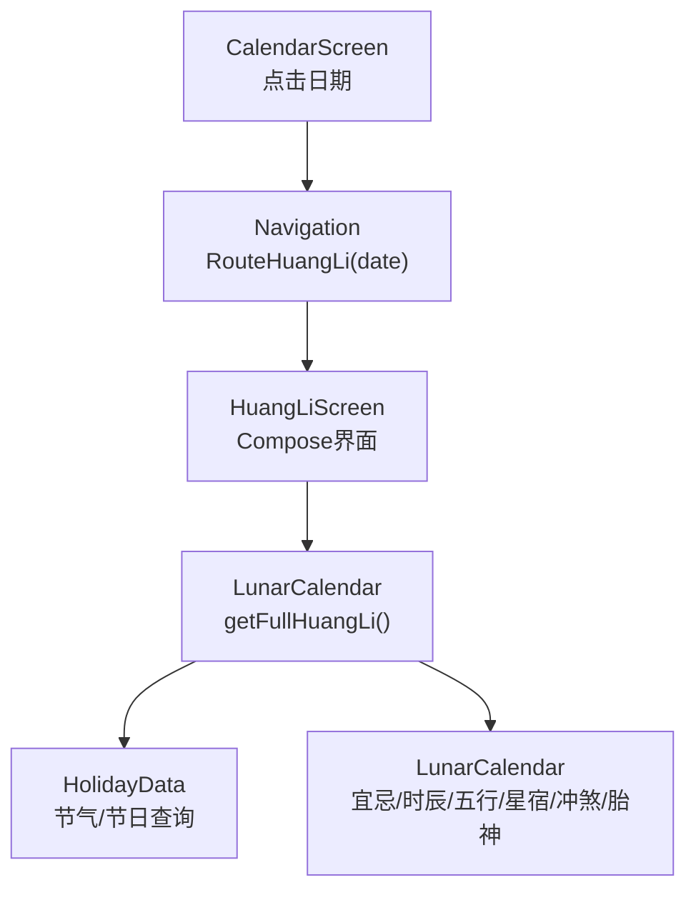
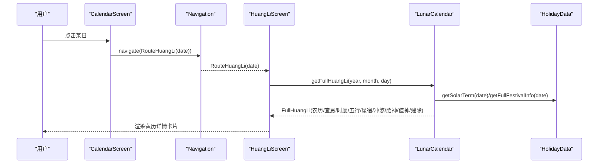
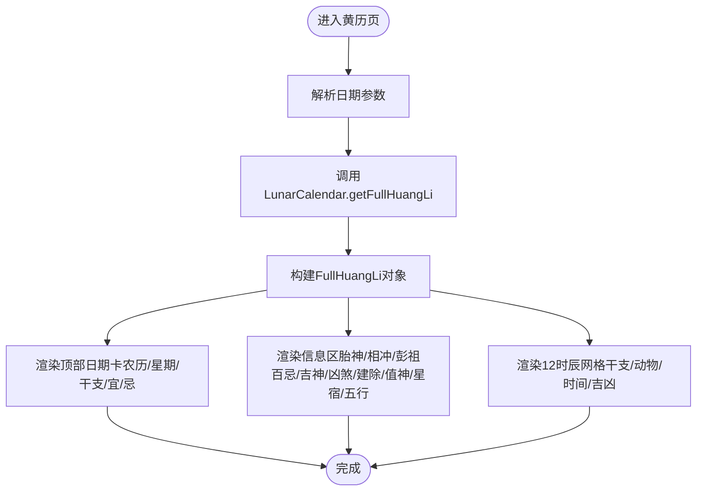
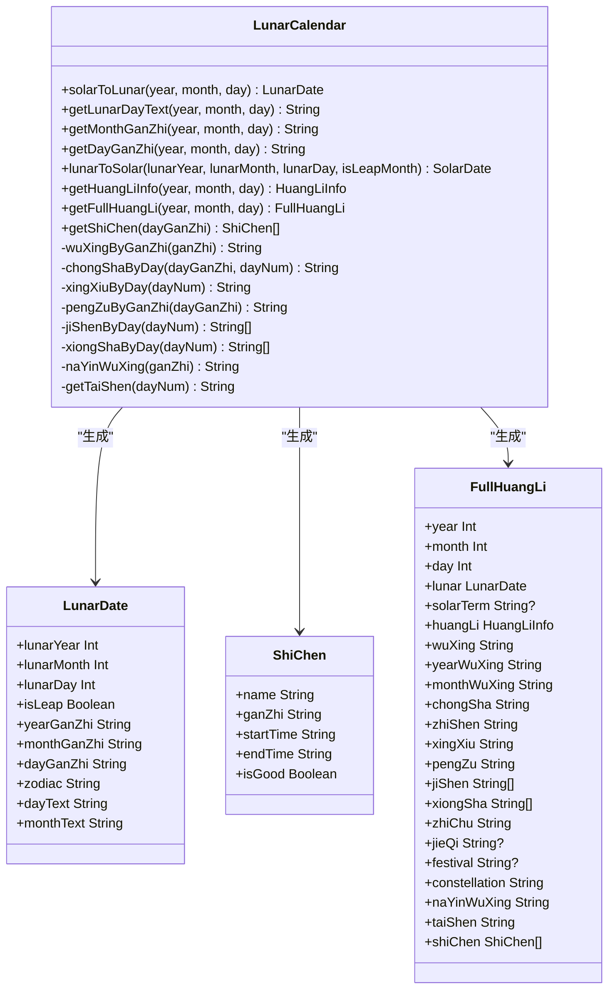
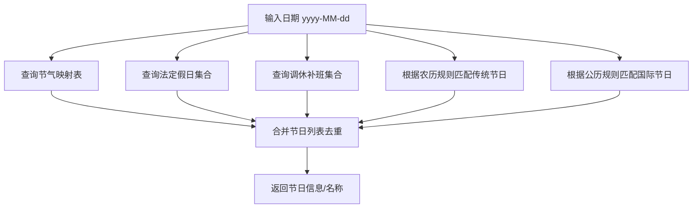
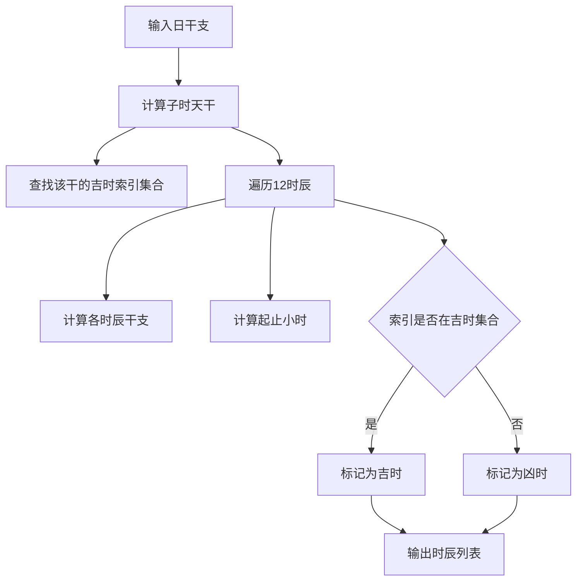
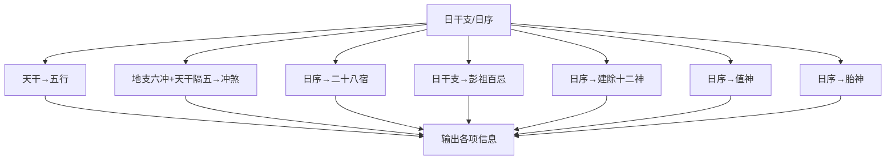
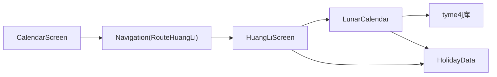

# 黄历界面

<cite>
**本文引用的文件**   
- [HuangLiScreen.kt](file://app/src/main/java/com/schedulecalendar/app/ui/calendar/HuangLiScreen.kt)
- [LunarCalendar.kt](file://app/src/main/java/com/schedulecalendar/app/domain/model/LunarCalendar.kt)
- [HolidayData.kt](file://app/src/main/java/com/schedulecalendar/app/domain/model/HolidayData.kt)
- [CalendarScreen.kt](file://app/src/main/java/com/schedulecalendar/app/ui/calendar/CalendarScreen.kt)
- [Screen.kt](file://app/src/main/java/com/schedulecalendar/app/ui/navigation/Screen.kt)
</cite>

## 目录
1. [简介](#简介)
2. [项目结构](#项目结构)
3. [核心组件](#核心组件)
4. [架构总览](#架构总览)
5. [详细组件分析](#详细组件分析)
6. [依赖关系分析](#依赖关系分析)
7. [性能考量](#性能考量)
8. [故障排查指南](#故障排查指南)
9. [结论](#结论)
10. [附录：扩展与自定义指南](#附录扩展与自定义指南)

## 简介
本文件面向Android排班日历应用的“黄历界面”，系统性阐述农历日期显示、节假日信息与传统习俗展示的实现方式，并深入解析黄历数据的获取、解析与渲染流程。文档覆盖农历转换算法、节气计算、节日标记、时辰吉凶、五行纳音、冲煞星宿等传统文化要素的落地方案，同时给出UI布局设计、交互体验优化建议以及功能扩展与样式定制的开发指南。

## 项目结构
黄历界面位于UI层（Compose）与领域模型层（Domain Model）之间，通过导航路由进入，数据来源于内置的黄历工具与节假日数据源。关键路径如下：
- UI入口：HuangLiScreen.kt
- 导航路由：Screen.kt（RouteHuangLi）
- 数据模型与算法：LunarCalendar.kt（农历转换、宜忌、时辰、五行、星宿等）
- 节假日与节气：HolidayData.kt（法定节假日、调休、二十四节气、传统节日与国际节日）
- 日历主界面联动：CalendarScreen.kt（点击日期跳转至黄历详情）

图表来源
- [CalendarScreen.kt:606-618](file://app/src/main/java/com/schedulecalendar/app/ui/calendar/CalendarScreen.kt#L606-L618)
- [Screen.kt:27](file://app/src/main/java/com/schedulecalendar/app/ui/navigation/Screen.kt#L27)
- [HuangLiScreen.kt:33-44](file://app/src/main/java/com/schedulecalendar/app/ui/calendar/HuangLiScreen.kt#L33-L44)
- [LunarCalendar.kt:172-198](file://app/src/main/java/com/schedulecalendar/app/domain/model/LunarCalendar.kt#L172-L198)
- [HolidayData.kt:611-634](file://app/src/main/java/com/schedulecalendar/app/domain/model/HolidayData.kt#L611-L634)

章节来源
- [CalendarScreen.kt:606-618](file://app/src/main/java/com/schedulecalendar/app/ui/calendar/CalendarScreen.kt#L606-L618)
- [Screen.kt:27](file://app/src/main/java/com/schedulecalendar/app/ui/navigation/Screen.kt#L27)
- [HuangLiScreen.kt:33-44](file://app/src/main/java/com/schedulecalendar/app/ui/calendar/HuangLiScreen.kt#L33-L44)
- [LunarCalendar.kt:172-198](file://app/src/main/java/com/schedulecalendar/app/domain/model/LunarCalendar.kt#L172-L198)
- [HolidayData.kt:611-634](file://app/src/main/java/com/schedulecalendar/app/domain/model/HolidayData.kt#L611-L634)

## 核心组件
- HuangLiScreen：黄历详情页面，负责日期解析、调用领域服务获取完整黄历信息，并以卡片化布局呈现农历、干支、宜忌、吉时等信息。
- LunarCalendar：领域模型与算法中心，封装公历转农历、宜忌等级判定、时辰吉凶、五行纳音、冲煞、星宿、彭祖百忌、建除十二神、值神、胎神等。
- HolidayData：节假日与节气数据源，提供法定假日、调休补班、二十四节气、传统节日与国际节日的查询能力。
- CalendarScreen：日历主界面，支持点击日期跳转到黄历详情。
- Screen.kt：定义RouteHuangLi路由，携带date参数。

章节来源
- [HuangLiScreen.kt:33-44](file://app/src/main/java/com/schedulecalendar/app/ui/calendar/HuangLiScreen.kt#L33-L44)
- [LunarCalendar.kt:172-198](file://app/src/main/java/com/schedulecalendar/app/domain/model/LunarCalendar.kt#L172-L198)
- [HolidayData.kt:611-634](file://app/src/main/java/com/schedulecalendar/app/domain/model/HolidayData.kt#L611-L634)
- [CalendarScreen.kt:606-618](file://app/src/main/java/com/schedulecalendar/app/ui/calendar/CalendarScreen.kt#L606-L618)
- [Screen.kt:27](file://app/src/main/java/com/schedulecalendar/app/ui/navigation/Screen.kt#L27)

## 架构总览
黄历界面的数据流遵循“UI → 领域模型 → 数据源”的分层模式：
- UI层（HuangLiScreen）从导航参数解析日期，调用LunarCalendar.getFullHuangLi获取结构化数据。
- 领域层（LunarCalendar）基于第三方库进行公历转农历，并结合HolidayData查询节气与传统节日，内部使用多张映射表计算五行、冲煞、星宿、彭祖百忌、建除十二神、值神、胎神、时辰吉凶等。
- 数据源（HolidayData）以静态集合与映射表形式提供2024-2030年的法定节假日、调休补班与二十四节气数据。

图表来源
- [CalendarScreen.kt:606-618](file://app/src/main/java/com/schedulecalendar/app/ui/calendar/CalendarScreen.kt#L606-L618)
- [Screen.kt:27](file://app/src/main/java/com/schedulecalendar/app/ui/navigation/Screen.kt#L27)
- [HuangLiScreen.kt:33-44](file://app/src/main/java/com/schedulecalendar/app/ui/calendar/HuangLiScreen.kt#L33-L44)
- [LunarCalendar.kt:172-198](file://app/src/main/java/com/schedulecalendar/app/domain/model/LunarCalendar.kt#L172-L198)
- [HolidayData.kt:611-634](file://app/src/main/java/com/schedulecalendar/app/domain/model/HolidayData.kt#L611-L634)

## 详细组件分析

### 黄历数据获取与渲染流程
- 日期解析：从导航参数提取年、月、日字符串并转为整数。
- 数据聚合：调用LunarCalendar.getFullHuangLi一次性组装农历、宜忌、节气、节日、五行、冲煞、星宿、彭祖百忌、建除十二神、值神、胎神、时辰吉凶等。
- 界面渲染：顶部大数字+右侧农历/星期/干支；宜/忌分色列表；胎神、相冲、彭祖百忌、吉神宜趋、凶煞宜忌、建除十二神与值神、星宿与五行双列信息；底部12时辰网格（干支、动物、时间范围、吉凶）。

图表来源
- [HuangLiScreen.kt:33-44](file://app/src/main/java/com/schedulecalendar/app/ui/calendar/HuangLiScreen.kt#L33-L44)
- [HuangLiScreen.kt:78-158](file://app/src/main/java/com/schedulecalendar/app/ui/calendar/HuangLiScreen.kt#L78-L158)
- [HuangLiScreen.kt:160-200](file://app/src/main/java/com/schedulecalendar/app/ui/calendar/HuangLiScreen.kt#L160-L200)
- [HuangLiScreen.kt:202-235](file://app/src/main/java/com/schedulecalendar/app/ui/calendar/HuangLiScreen.kt#L202-L235)
- [LunarCalendar.kt:172-198](file://app/src/main/java/com/schedulecalendar/app/domain/model/LunarCalendar.kt#L172-L198)

章节来源
- [HuangLiScreen.kt:33-44](file://app/src/main/java/com/schedulecalendar/app/ui/calendar/HuangLiScreen.kt#L33-L44)
- [HuangLiScreen.kt:78-158](file://app/src/main/java/com/schedulecalendar/app/ui/calendar/HuangLiScreen.kt#L78-L158)
- [HuangLiScreen.kt:160-200](file://app/src/main/java/com/schedulecalendar/app/ui/calendar/HuangLiScreen.kt#L160-L200)
- [HuangLiScreen.kt:202-235](file://app/src/main/java/com/schedulecalendar/app/ui/calendar/HuangLiScreen.kt#L202-L235)
- [LunarCalendar.kt:172-198](file://app/src/main/java/com/schedulecalendar/app/domain/model/LunarCalendar.kt#L172-L198)

### 农历转换算法与数据结构
- 公历转农历：基于第三方库cn.6tail:tyme4j，将SolarDay转换为LunarDay，提取农历年、月、日、是否闰月、干支、生肖、农历月文本与日文本。
- 数据结构：LunarDate包含农历年、月、日、闰月标志、年/月/日干支、生肖、日文本与月文本。
- 辅助方法：getLunarDayText用于在日历格子中显示农历日期（初一显示月份文本，其余显示日文本）。

图表来源
- [LunarCalendar.kt:22-67](file://app/src/main/java/com/schedulecalendar/app/domain/model/LunarCalendar.kt#L22-L67)
- [LunarCalendar.kt:116-146](file://app/src/main/java/com/schedulecalendar/app/domain/model/LunarCalendar.kt#L116-L146)
- [LunarCalendar.kt:172-198](file://app/src/main/java/com/schedulecalendar/app/domain/model/LunarCalendar.kt#L172-L198)

章节来源
- [LunarCalendar.kt:22-67](file://app/src/main/java/com/schedulecalendar/app/domain/model/LunarCalendar.kt#L22-L67)
- [LunarCalendar.kt:116-146](file://app/src/main/java/com/schedulecalendar/app/domain/model/LunarCalendar.kt#L116-L146)
- [LunarCalendar.kt:172-198](file://app/src/main/java/com/schedulecalendar/app/domain/model/LunarCalendar.kt#L172-L198)

### 节气计算与节日标记
- 节气：HolidayData内置2024-2030年二十四节气日期映射，按yyyy-MM-dd精确匹配返回节气名称。
- 法定节假日与调休：内置集合判断是否为法定假日或调休补班工作日。
- 传统节日与国际节日：根据农历日期或公历日期规则匹配传统节日（如春节、端午、中秋、七夕、重阳等）与国际节日（元旦、情人节、妇女节等），并提供去重合并的完整节日列表。
- 倒计时：计算距离下一个法定节假日的天数，用于日历详情页展示。

图表来源
- [HolidayData.kt:289-406](file://app/src/main/java/com/schedulecalendar/app/domain/model/HolidayData.kt#L289-L406)
- [HolidayData.kt:16-135](file://app/src/main/java/com/schedulecalendar/app/domain/model/HolidayData.kt#L16-L135)
- [HolidayData.kt:142-174](file://app/src/main/java/com/schedulecalendar/app/domain/model/HolidayData.kt#L142-L174)
- [HolidayData.kt:542-604](file://app/src/main/java/com/schedulecalendar/app/domain/model/HolidayData.kt#L542-L604)
- [HolidayData.kt:611-634](file://app/src/main/java/com/schedulecalendar/app/domain/model/HolidayData.kt#L611-L634)

章节来源
- [HolidayData.kt:289-406](file://app/src/main/java/com/schedulecalendar/app/domain/model/HolidayData.kt#L289-L406)
- [HolidayData.kt:16-135](file://app/src/main/java/com/schedulecalendar/app/domain/model/HolidayData.kt#L16-L135)
- [HolidayData.kt:142-174](file://app/src/main/java/com/schedulecalendar/app/domain/model/HolidayData.kt#L142-L174)
- [HolidayData.kt:542-604](file://app/src/main/java/com/schedulecalendar/app/domain/model/HolidayData.kt#L542-L604)
- [HolidayData.kt:611-634](file://app/src/main/java/com/schedulecalendar/app/domain/model/HolidayData.kt#L611-L634)

### 宜忌等级与时辰吉凶
- 宜忌等级：根据宜的数量与忌的数量判定大吉/吉/小吉/平/凶/大凶，并返回宜/忌列表。
- 时辰吉凶：依据日干支确定子时天干，结合十干对应吉时索引集合，计算十二时辰的干支、时间范围与吉凶属性。

图表来源
- [LunarCalendar.kt:282-327](file://app/src/main/java/com/schedulecalendar/app/domain/model/LunarCalendar.kt#L282-L327)
- [LunarCalendar.kt:148-169](file://app/src/main/java/com/schedulecalendar/app/domain/model/LunarCalendar.kt#L148-L169)

章节来源
- [LunarCalendar.kt:282-327](file://app/src/main/java/com/schedulecalendar/app/domain/model/LunarCalendar.kt#L282-L327)
- [LunarCalendar.kt:148-169](file://app/src/main/java/com/schedulecalendar/app/domain/model/LunarCalendar.kt#L148-L169)

### 五行、冲煞、星宿、彭祖百忌、建除十二神、值神、胎神
- 五行：根据天干映射到五行（甲乙木、丙丁火、戊己土、庚辛金、壬癸水）。
- 冲煞：依据地支六冲与天干相隔5位，生成“某日冲（某干支）某生肖”。
- 星宿：按日序取二十八宿之一。
- 彭祖百忌：根据日干支查表组合禁忌语。
- 建除十二神与值神：按日序映射建除十二神与值神。
- 胎神：按日序映射胎神位置描述。

图表来源
- [LunarCalendar.kt:331-341](file://app/src/main/java/com/schedulecalendar/app/domain/model/LunarCalendar.kt#L331-L341)
- [LunarCalendar.kt:343-359](file://app/src/main/java/com/schedulecalendar/app/domain/model/LunarCalendar.kt#L343-L359)
- [LunarCalendar.kt:361-366](file://app/src/main/java/com/schedulecalendar/app/domain/model/LunarCalendar.kt#L361-L366)
- [LunarCalendar.kt:368-380](file://app/src/main/java/com/schedulecalendar/app/domain/model/LunarCalendar.kt#L368-L380)
- [LunarCalendar.kt:382-395](file://app/src/main/java/com/schedulecalendar/app/domain/model/LunarCalendar.kt#L382-L395)
- [LunarCalendar.kt:399-416](file://app/src/main/java/com/schedulecalendar/app/domain/model/LunarCalendar.kt#L399-L416)
- [LunarCalendar.kt:242-277](file://app/src/main/java/com/schedulecalendar/app/domain/model/LunarCalendar.kt#L242-L277)

章节来源
- [LunarCalendar.kt:331-341](file://app/src/main/java/com/schedulecalendar/app/domain/model/LunarCalendar.kt#L331-L341)
- [LunarCalendar.kt:343-359](file://app/src/main/java/com/schedulecalendar/app/domain/model/LunarCalendar.kt#L343-L359)
- [LunarCalendar.kt:361-366](file://app/src/main/java/com/schedulecalendar/app/domain/model/LunarCalendar.kt#L361-L366)
- [LunarCalendar.kt:368-380](file://app/src/main/java/com/schedulecalendar/app/domain/model/LunarCalendar.kt#L368-L380)
- [LunarCalendar.kt:382-395](file://app/src/main/java/com/schedulecalendar/app/domain/model/LunarCalendar.kt#L382-L395)
- [LunarCalendar.kt:399-416](file://app/src/main/java/com/schedulecalendar/app/domain/model/LunarCalendar.kt#L399-L416)
- [LunarCalendar.kt:242-277](file://app/src/main/java/com/schedulecalendar/app/domain/model/LunarCalendar.kt#L242-L277)

### 用户界面设计与交互体验
- 布局结构：采用卡片分区，顶部大号日期+右侧农历/星期/干支/宜/忌；中部信息区单列与双列混排；底部12时辰网格。
- 视觉层次：宜用绿色强调，忌用错误色强调；吉时用绿色高亮，凶时用灰色弱化。
- 滚动与适配：整体垂直滚动，内容自适应宽度；时辰网格横向排列，每列紧凑展示干支、动物、时间范围与吉凶。
- 可访问性：文本层级清晰，颜色对比度合理，便于阅读。

章节来源
- [HuangLiScreen.kt:78-158](file://app/src/main/java/com/schedulecalendar/app/ui/calendar/HuangLiScreen.kt#L78-L158)
- [HuangLiScreen.kt:160-200](file://app/src/main/java/com/schedulecalendar/app/ui/calendar/HuangLiScreen.kt#L160-L200)
- [HuangLiScreen.kt:202-235](file://app/src/main/java/com/schedulecalendar/app/ui/calendar/HuangLiScreen.kt#L202-L235)
- [HuangLiScreen.kt:306-347](file://app/src/main/java/com/schedulecalendar/app/ui/calendar/HuangLiScreen.kt#L306-L347)

## 依赖关系分析
- HuangLiScreen依赖LunarCalendar与HolidayData，不直接访问数据库或网络。
- LunarCalendar依赖第三方库（tyme4j）进行农历转换，并依赖HolidayData提供节气与传统节日信息。
- CalendarScreen通过导航路由触发黄历界面，并在详情页展示节假日倒计时。

图表来源
- [HuangLiScreen.kt:33-44](file://app/src/main/java/com/schedulecalendar/app/ui/calendar/HuangLiScreen.kt#L33-L44)
- [LunarCalendar.kt:4-12](file://app/src/main/java/com/schedulecalendar/app/domain/model/LunarCalendar.kt#L4-L12)
- [CalendarScreen.kt:606-618](file://app/src/main/java/com/schedulecalendar/app/ui/calendar/CalendarScreen.kt#L606-L618)
- [Screen.kt:27](file://app/src/main/java/com/schedulecalendar/app/ui/navigation/Screen.kt#L27)

章节来源
- [HuangLiScreen.kt:33-44](file://app/src/main/java/com/schedulecalendar/app/ui/calendar/HuangLiScreen.kt#L33-L44)
- [LunarCalendar.kt:4-12](file://app/src/main/java/com/schedulecalendar/app/domain/model/LunarCalendar.kt#L4-L12)
- [CalendarScreen.kt:606-618](file://app/src/main/java/com/schedulecalendar/app/ui/calendar/CalendarScreen.kt#L606-L618)
- [Screen.kt:27](file://app/src/main/java/com/schedulecalendar/app/ui/navigation/Screen.kt#L27)

## 性能考量
- 数据聚合一次完成：getFullHuangLi集中组装所有黄历信息，减少多次调用开销。
- 静态映射表：五行、冲煞、星宿、彭祖百忌、建除十二神、值神、胎神、纳音五行等均使用内存映射，查询复杂度O(1)。
- 无IO阻塞：黄历数据均为本地计算与静态数据，避免网络与数据库延迟。
- UI重组优化：remember缓存日期解析与黄历结果，避免重复计算。

[本节为通用指导，无需具体文件引用]

## 故障排查指南
- 农历转换异常：检查传入的年、月、日是否合法；确认第三方库版本与兼容性。
- 节气/节日为空：确认日期是否在2024-2030范围内；核对HolidayData映射表是否更新。
- 宜忌列表为空：检查getHuangLiInfo逻辑与第三方库返回；确保SolarDay与LunarDay转换成功。
- 时辰吉凶缺失：检查日干支是否正确；确认吉时索引集合与子时天干计算无误。
- UI显示异常：检查颜色与字体设置；确认Card与Row布局参数合理。

章节来源
- [LunarCalendar.kt:148-169](file://app/src/main/java/com/schedulecalendar/app/domain/model/LunarCalendar.kt#L148-L169)
- [LunarCalendar.kt:282-327](file://app/src/main/java/com/schedulecalendar/app/domain/model/LunarCalendar.kt#L282-L327)
- [HolidayData.kt:289-406](file://app/src/main/java/com/schedulecalendar/app/domain/model/HolidayData.kt#L289-L406)
- [HuangLiScreen.kt:78-158](file://app/src/main/java/com/schedulecalendar/app/ui/calendar/HuangLiScreen.kt#L78-L158)

## 结论
黄历界面通过清晰的UI分层与领域模型封装，实现了农历日期、节气、节日与传统习俗的全面展示。数据获取与渲染流程简洁高效，算法实现准确可靠，具备良好的可扩展性与可维护性。后续可通过扩展数据源与样式配置进一步提升用户体验。

[本节为总结性内容，无需具体文件引用]

## 附录：扩展与自定义指南
- 扩展黄历数据：
  - 在LunarCalendar中添加新的映射表或计算函数，例如新增民俗宜忌、风水方位等。
  - 在HolidayData中增加更多年份的节气与节假日数据，保持格式一致。
- 自定义显示样式：
  - 修改HuangLiScreen中的颜色、字号、行距与卡片圆角，适配不同主题。
  - 调整时辰网格布局（如改为两行六列或三行四列），优化小屏显示。
- 增强交互体验：
  - 添加手势滑动切换日期、长按查看详细信息、分享黄历卡片等功能。
  - 集成语音朗读农历与宜忌信息，提升无障碍体验。
- 性能优化：
  - 对大数据量映射表进行懒加载或分页查询。
  - 引入缓存策略（如内存缓存最近N天黄历数据），减少重复计算。

[本节为通用指导，无需具体文件引用]