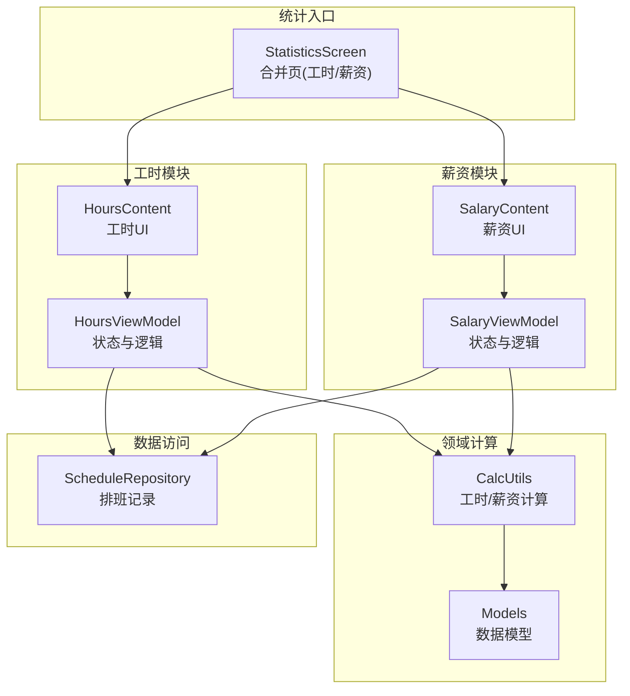
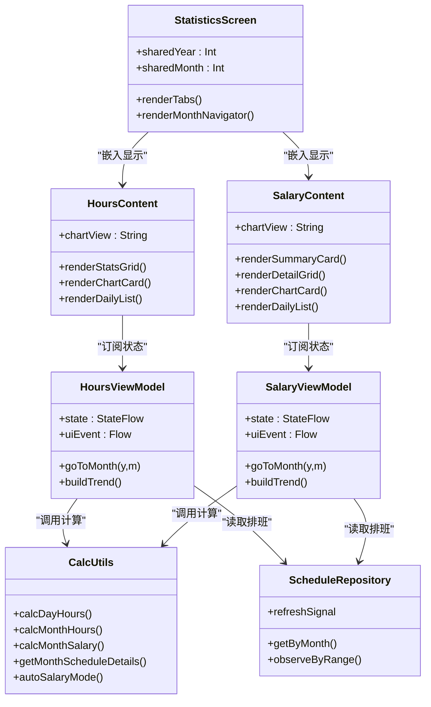
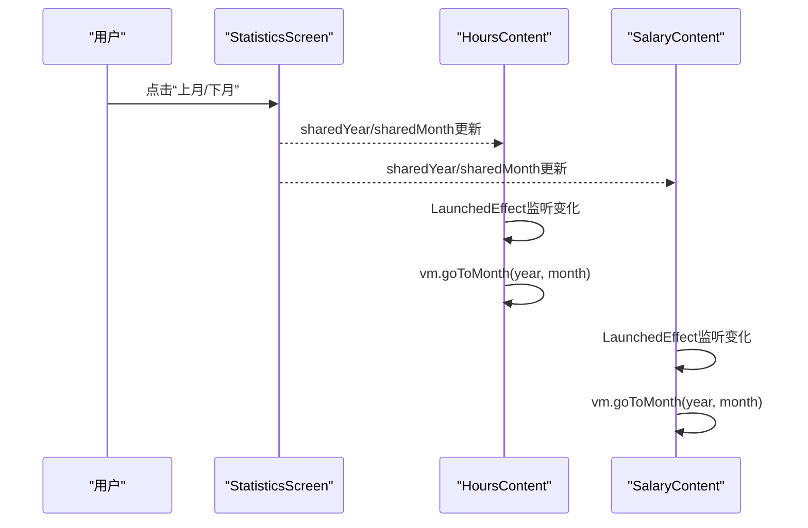
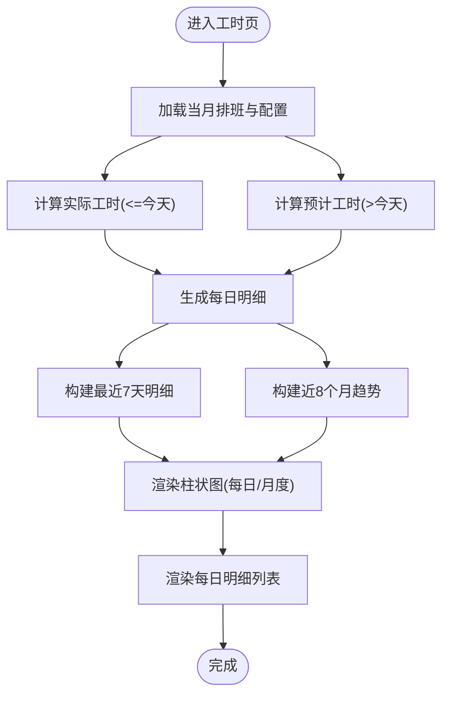
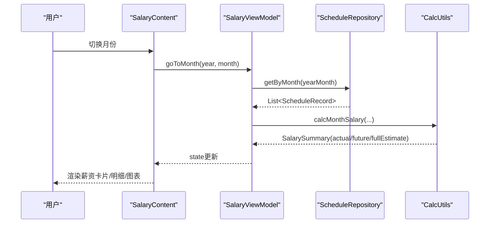
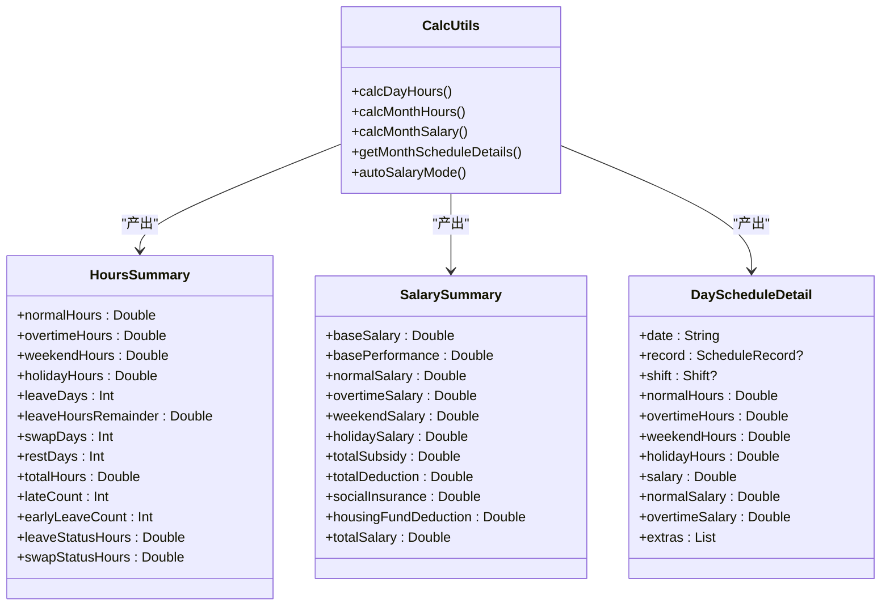
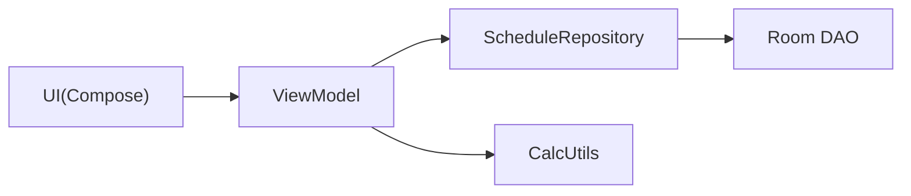

# 统计界面

<cite>
**本文引用的文件**   
- [StatisticsScreen.kt](file://app/src/main/java/com/schedulecalendar/app/ui/statistics/StatisticsScreen.kt)
- [HoursScreen.kt](file://app/src/main/java/com/schedulecalendar/app/ui/hours/HoursScreen.kt)
- [SalaryScreen.kt](file://app/src/main/java/com/schedulecalendar/app/ui/salary/SalaryScreen.kt)
- [HoursViewModel.kt](file://app/src/main/java/com/schedulecalendar/app/ui/hours/HoursViewModel.kt)
- [SalaryViewModel.kt](file://app/src/main/java/com/schedulecalendar/app/ui/salary/SalaryViewModel.kt)
- [Models.kt](file://app/src/main/java/com/schedulecalendar/app/domain/model/Models.kt)
- [CalcUtils.kt](file://app/src/main/java/com/schedulecalendar/app/domain/model/CalcUtils.kt)
- [ScheduleRepository.kt](file://app/src/main/java/com/schedulecalendar/app/data/repository/ScheduleRepository.kt)
</cite>

## 目录
1. [简介](#简介)
2. [项目结构](#项目结构)
3. [核心组件](#核心组件)
4. [架构总览](#架构总览)
5. [详细组件分析](#详细组件分析)
6. [依赖关系分析](#依赖关系分析)
7. [性能考量](#性能考量)
8. [故障排查指南](#故障排查指南)
9. [结论](#结论)
10. [附录](#附录)

## 简介
本文件围绕Android排班日历应用的“统计界面”进行系统化文档化，重点覆盖：
- 工时与薪资两大统计模块的UI展示、数据趋势分析与报表生成
- 图表类型选择与自定义配置（柱状图、折线图、饼图）
- 时间范围筛选（当月/近7天/近8个月）与对比分析（实际 vs 预计）
- 导出与分享机制现状说明
- 统计指标的可配置性与个性化报表生成思路

## 项目结构
统计界面由一个合并页承载两个Tab：工时与薪资。每个Tab内部包含统计卡片、图表区与每日明细列表。数据通过ViewModel从仓库层获取并计算，最终由Compose UI渲染。

**图示来源** 
- [StatisticsScreen.kt:1-156](file://app/src/main/java/com/schedulecalendar/app/ui/statistics/StatisticsScreen.kt#L1-L156)
- [HoursScreen.kt:1-611](file://app/src/main/java/com/schedulecalendar/app/ui/hours/HoursScreen.kt#L1-L611)
- [SalaryScreen.kt:1-497](file://app/src/main/java/com/schedulecalendar/app/ui/salary/SalaryScreen.kt#L1-L497)
- [HoursViewModel.kt:1-208](file://app/src/main/java/com/schedulecalendar/app/ui/hours/HoursViewModel.kt#L1-L208)
- [SalaryViewModel.kt:1-168](file://app/src/main/java/com/schedulecalendar/app/ui/salary/SalaryViewModel.kt#L1-L168)
- [CalcUtils.kt:1-557](file://app/src/main/java/com/schedulecalendar/app/domain/model/CalcUtils.kt#L1-L557)
- [Models.kt:1-278](file://app/src/main/java/com/schedulecalendar/app/domain/model/Models.kt#L1-L278)
- [ScheduleRepository.kt:1-40](file://app/src/main/java/com/schedulecalendar/app/data/repository/ScheduleRepository.kt#L1-L40)

**章节来源**
- [StatisticsScreen.kt:1-156](file://app/src/main/java/com/schedulecalendar/app/ui/statistics/StatisticsScreen.kt#L1-L156)

## 核心组件
- 统计入口页：提供月份切换与Tab切换，统一维护共享年月状态，驱动工时与薪资子页面同步刷新。
- 工时模块：展示本月总工时、分类工时卡片、最近7天每日工时分布柱状图、月工时分布柱状图、每日明细列表；支持迟到/早退阈值告警。
- 薪资模块：展示本月预计薪资、薪资构成饼图、月薪趋势折线图、每日明细列表；支持补贴/扣款明细。
- ViewModel层：封装月份导航、数据加载、趋势构建、错误事件上报。
- 领域计算层：统一的工时/薪资计算工具，处理考勤粒度、休息段扣减、周末/节假日判定、薪资折算等。
- 数据访问层：基于Room DAO的排班记录查询与变更信号通知。

**章节来源**
- [HoursScreen.kt:1-611](file://app/src/main/java/com/schedulecalendar/app/ui/hours/HoursScreen.kt#L1-L611)
- [SalaryScreen.kt:1-497](file://app/src/main/java/com/schedulecalendar/app/ui/salary/SalaryScreen.kt#L1-L497)
- [HoursViewModel.kt:1-208](file://app/src/main/java/com/schedulecalendar/app/ui/hours/HoursViewModel.kt#L1-L208)
- [SalaryViewModel.kt:1-168](file://app/src/main/java/com/schedulecalendar/app/ui/salary/SalaryViewModel.kt#L1-L168)
- [CalcUtils.kt:1-557](file://app/src/main/java/com/schedulecalendar/app/domain/model/CalcUtils.kt#L1-L557)
- [Models.kt:1-278](file://app/src/main/java/com/schedulecalendar/app/domain/model/Models.kt#L1-L278)
- [ScheduleRepository.kt:1-40](file://app/src/main/java/com/schedulecalendar/app/data/repository/ScheduleRepository.kt#L1-L40)

## 架构总览
统计界面采用MVVM + Compose架构，UI层仅负责展示与交互，业务计算集中在CalcUtils，数据源通过Repository暴露Flow或一次性查询。

**图示来源** 
- [StatisticsScreen.kt:1-156](file://app/src/main/java/com/schedulecalendar/app/ui/statistics/StatisticsScreen.kt#L1-L156)
- [HoursScreen.kt:1-611](file://app/src/main/java/com/schedulecalendar/app/ui/hours/HoursScreen.kt#L1-L611)
- [SalaryScreen.kt:1-497](file://app/src/main/java/com/schedulecalendar/app/ui/salary/SalaryScreen.kt#L1-L497)
- [HoursViewModel.kt:1-208](file://app/src/main/java/com/schedulecalendar/app/ui/hours/HoursViewModel.kt#L1-L208)
- [SalaryViewModel.kt:1-168](file://app/src/main/java/com/schedulecalendar/app/ui/salary/SalaryViewModel.kt#L1-L168)
- [CalcUtils.kt:1-557](file://app/src/src/main/java/com/schedulecalendar/app/domain/model/CalcUtils.kt#L1-L557)
- [ScheduleRepository.kt:1-40](file://app/src/main/java/com/schedulecalendar/app/data/repository/ScheduleRepository.kt#L1-L40)

## 详细组件分析

### 统计入口页（合并页）
- 功能要点
  - 顶部TabRow切换“工时/薪资”，与HorizontalPager双向同步。
  - 中部月份导航控件，支持上月/下月切换与“返回当月”快捷按钮。
  - 共享年月状态使用rememberSaveable，保证返回后保持选中月份。
  - 将共享年月单向传递给工时与薪资子内容，触发各自ViewModel刷新。

- 交互流程

**图示来源** 
- [StatisticsScreen.kt:1-156](file://app/src/main/java/com/schedulecalendar/app/ui/statistics/StatisticsScreen.kt#L1-L156)
- [HoursScreen.kt:60-110](file://app/src/main/java/com/schedulecalendar/app/ui/hours/HoursScreen.kt#L60-L110)
- [SalaryScreen.kt:49-90](file://app/src/main/java/com/schedulecalendar/app/ui/salary/SalaryScreen.kt#L49-L90)

**章节来源**
- [StatisticsScreen.kt:1-156](file://app/src/main/java/com/schedulecalendar/app/ui/statistics/StatisticsScreen.kt#L1-L156)

### 工时模块（HoursContent）
- 展示维度
  - 统计卡片：正常工时、加班工时、周末工时、节假日工时、请假天数、调休/休息天数、迟到次数、早退次数、备注数量、补贴/扣款数量。
  - 总工时汇总卡片：显示本月总工时与未来预计增量。
  - 图表区：可切换“每日工时分布”（最近7天柱状堆叠）与“月工时分布”（近8个月柱状）。
  - 每日明细：按日期倒序展示班次、标签、打卡时间、备注、加班标注等。

- 图表实现
  - 每日工时分布：Canvas绘制堆叠柱状图，区分正常与加班（含周末/法定），顶部显示合计小时数，底部显示日期。
  - 月工时分布：Canvas绘制柱状图，按正常与加班比例着色，顶部显示合计小时数，底部显示月份标签。
  - 动态高度：根据数据最大值在参考刻度范围内自适应计算图表高度，确保视觉一致性。

- 时间范围与对比
  - 最近7天：跨月聚合，用于每日工时分布。
  - 近8个月：不含未来月，用于月工时趋势。
  - 实际 vs 预计：当前月≤今天为实际，>今天为预计；历史月=全月；未来月=空。

- 交互与导航
  - 点击迟到/早退/备注/补贴项跳转至对应详情页。
  - 独立模式自带Scaffold与月份导航；嵌入模式由父容器提供导航。

**图示来源** 
- [HoursViewModel.kt:84-146](file://app/src/main/java/com/schedulecalendar/app/ui/hours/HoursViewModel.kt#L84-L146)
- [HoursScreen.kt:358-436](file://app/src/main/java/com/schedulecalendar/app/ui/hours/HoursScreen.kt#L358-L436)
- [HoursScreen.kt:438-542](file://app/src/main/java/com/schedulecalendar/app/ui/hours/HoursScreen.kt#L438-L542)

**章节来源**
- [HoursScreen.kt:1-611](file://app/src/main/java/com/schedulecalendar/app/ui/hours/HoursScreen.kt#L1-L611)
- [HoursViewModel.kt:1-208](file://app/src/main/java/com/schedulecalendar/app/ui/hours/HoursViewModel.kt#L1-L208)

### 薪资模块（SalaryContent）
- 展示维度
  - 顶部薪资总卡：本月预计薪资总额，已到与预计再到金额。
  - 薪资明细网格：基础底薪、基础绩效、正常工资、加班工资、周末工资、节假日工资、补贴合计、扣款合计、社保/公积金扣款。
  - 图表区：可切换“薪资构成”（饼图）与“月薪趋势”（折线图）。
  - 每日明细：展示班次、状态标签、补贴/扣款条目、当日薪资与加班薪资拆分。

- 图表实现
  - 薪资构成饼图：按底薪、绩效、正常、加班、周末、节假日、补贴七类占比绘制环形图，右侧图例显示金额与百分比。
  - 月薪趋势折线图：Canvas绘制折线与数据点，顶部数值标签，底部月份标签。

- 时间范围与对比
  - 实际薪资：历史月=全月，当前月≤今天，未来月=0（仅底薪/绩效）。
  - 预计薪资：不含底薪/绩效/社保/公积金，仅工时部分累计。
  - 全月估算：用于顶部卡片展示完整预估。

**图示来源** 
- [SalaryViewModel.kt:74-144](file://app/src/main/java/com/schedulecalendar/app/ui/salary/SalaryViewModel.kt#L74-L144)
- [SalaryScreen.kt:270-311](file://app/src/main/java/com/schedulecalendar/app/ui/salary/SalaryScreen.kt#L270-L311)
- [SalaryScreen.kt:313-359](file://app/src/main/java/com/schedulecalendar/app/ui/salary/SalaryScreen.kt#L313-L359)
- [SalaryScreen.kt:361-421](file://app/src/main/java/com/schedulecalendar/app/ui/salary/SalaryScreen.kt#L361-L421)

**章节来源**
- [SalaryScreen.kt:1-497](file://app/src/main/java/com/schedulecalendar/app/ui/salary/SalaryScreen.kt#L1-L497)
- [SalaryViewModel.kt:1-168](file://app/src/main/java/com/schedulecalendar/app/ui/salary/SalaryViewModel.kt#L1-L168)

### 数据模型与计算工具
- 数据模型
  - HoursSummary：正常/加班/周末/节假日工时、请假天数与剩余小时、调休/休息天数、总工时、迟到/早退次数、状态工时等。
  - SalarySummary：底薪、绩效、正常/加班/周末/节假日工资、补贴/扣款合计、社保/公积金扣款、实发工资。
  - DayScheduleDetail：单日排班详情，包含工时、薪资、附加项目等。
  - AttendConfig/SalaryConfig：考勤规则与薪资制度配置。

- 计算工具
  - CalcUtils提供时间换算、考勤粒度处理、全局休息段扣减、日工时计算、月工时汇总、月薪资汇总、周末/节假日自动判断、每日明细生成等。

**图示来源** 
- [Models.kt:225-278](file://app/src/main/java/com/schedulecalendar/app/domain/model/Models.kt#L225-L278)
- [CalcUtils.kt:236-444](file://app/src/main/java/com/schedulecalendar/app/domain/model/CalcUtils.kt#L236-L444)

**章节来源**
- [Models.kt:1-278](file://app/src/main/java/com/schedulecalendar/app/domain/model/Models.kt#L1-L278)
- [CalcUtils.kt:1-557](file://app/src/main/java/com/schedulecalendar/app/domain/model/CalcUtils.kt#L1-L557)

## 依赖关系分析
- UI层依赖ViewModel，ViewModel依赖Repository与CalcUtils。
- Repository通过DAO访问数据库，并通过SharedFlow发出变更信号，驱动ViewModel刷新。
- CalcUtils无外部依赖，纯函数式计算，便于测试与复用。

**图示来源** 
- [ScheduleRepository.kt:1-40](file://app/src/main/java/com/schedulecalendar/app/data/repository/ScheduleRepository.kt#L1-L40)
- [HoursViewModel.kt:1-208](file://app/src/main/java/com/schedulecalendar/app/ui/hours/HoursViewModel.kt#L1-L208)
- [SalaryViewModel.kt:1-168](file://app/src/main/java/com/schedulecalendar/app/ui/salary/SalaryViewModel.kt#L1-L168)

**章节来源**
- [ScheduleRepository.kt:1-40](file://app/src/main/java/com/schedulecalendar/app/data/repository/ScheduleRepository.kt#L1-L40)

## 性能考量
- 首次加载loading控制：仅在details为空时显示加载指示器，避免频繁闪烁。
- 数据流刷新：通过SharedFlow监听排班数据变更，按需刷新，减少不必要重算。
- 图表自适应高度：根据数据最大值动态计算，避免固定高度导致空白或溢出。
- 最近7天明细跨月聚合：仅查询涉及的两个月，降低IO开销。
- 趋势计算限制：工时/薪资趋势均限制在近8个月，控制计算复杂度。

[本节为通用指导，不直接分析具体文件]

## 故障排查指南
- 加载失败提示：ViewModel捕获异常并通过uiEvent发送错误消息，UI层以Snackbar展示。
- 数据未刷新：检查Repository的refreshSignal是否被正确触发；确认ViewModel是否正确收集该Flow。
- 图表显示异常：检查数据是否为空或全零；确认动态高度计算逻辑是否合理。
- 月份切换无效：确认LaunchedEffect是否正确监听sharedYear/sharedMonth变化并调用goToMonth。

**章节来源**
- [HoursViewModel.kt:141-146](file://app/src/main/java/com/schedulecalendar/app/ui/hours/HoursViewModel.kt#L141-L146)
- [SalaryViewModel.kt:139-143](file://app/src/main/java/com/schedulecalendar/app/ui/salary/SalaryViewModel.kt#L139-L143)

## 结论
统计界面通过清晰的MVVM分层与Compose组合式UI，实现了工时与薪资的双模块统计展示。图表类型丰富且可切换，时间范围筛选灵活，支持实际与预计对比。计算逻辑集中且可测试，数据流驱动刷新高效可靠。当前版本未内置统计数据的导出与分享功能，可在后续迭代中扩展。

[本节为总结性内容，不直接分析具体文件]

## 附录

### 图表类型与自定义配置
- 工时图表
  - 每日工时分布：堆叠柱状图，颜色区分正常与加班（含周末/法定），顶部显示合计小时数。
  - 月工时分布：柱状图，按正常与加班比例着色，顶部显示合计小时数。
  - 自定义建议：增加图例点击过滤、数据点Tooltip、缩放与平移。
- 薪资图表
  - 薪资构成：环形饼图，图例显示金额与百分比。
  - 月薪趋势：折线图，数据点高亮，顶部数值标签。
  - 自定义建议：多系列叠加（如基本工资/加班工资）、区间填充、动画过渡。

[本节为概念性内容，不直接分析具体文件]

### 时间范围筛选与对比分析
- 时间范围
  - 当月：实际（<=今天）与预计（>今天）分离。
  - 最近7天：跨月聚合，用于每日工时分布。
  - 近8个月：不含未来月，用于趋势分析。
- 对比分析
  - 工时：实际总工时 vs 预计增量。
  - 薪资：已到薪资 vs 预计再到薪资。

[本节为概念性内容，不直接分析具体文件]

### 导出与分享机制现状
- 当前代码未发现统计数据的导出与分享实现。
- 建议在后续迭代中增加：
  - 导出格式：CSV/PDF/图片（PNG/JPEG）。
  - 分享渠道：系统分享面板、邮件、微信等。
  - 内容定制：选择指标、时间范围、图表样式。

[本节为概念性内容，不直接分析具体文件]

### 统计指标自定义与个性化报表
- 指标配置
  - 考勤规则：迟到/早退容忍时长、加班粒度、标准工时。
  - 薪资制度：底薪、绩效、各时段时薪、补贴/扣款项目、社保/公积金。
- 个性化报表
  - 模板化输出：按月/季度/年度生成报告。
  - 可视化增强：主题色、字体、布局选项。
  - 自动化：定时生成与推送。

[本节为概念性内容，不直接分析具体文件]