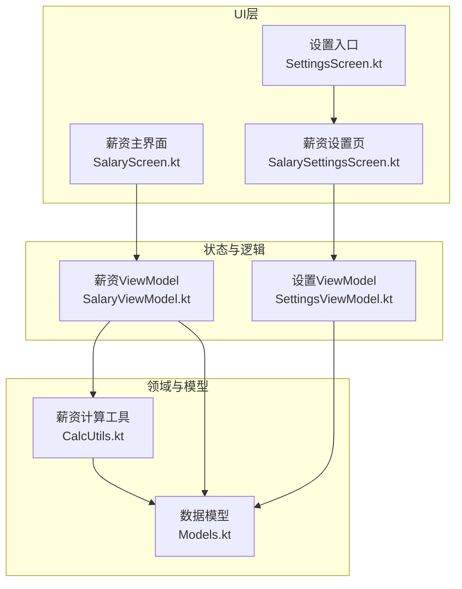
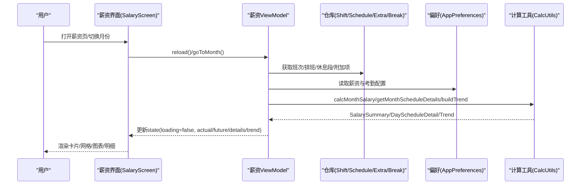
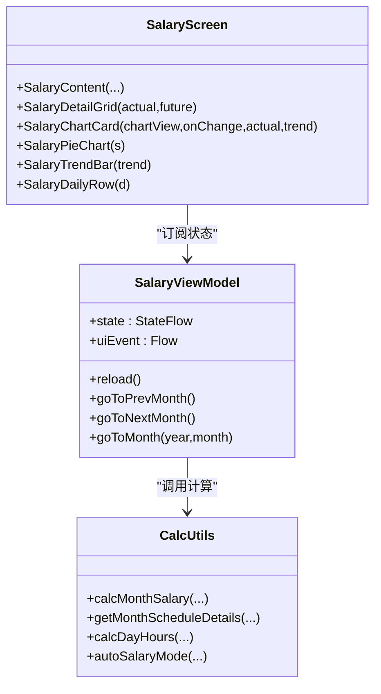
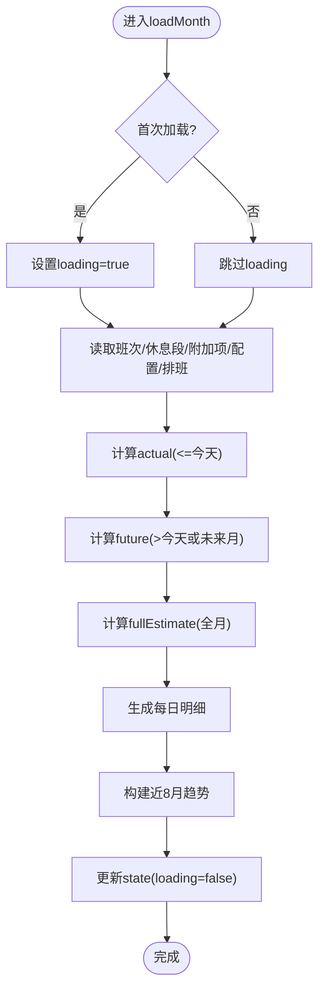
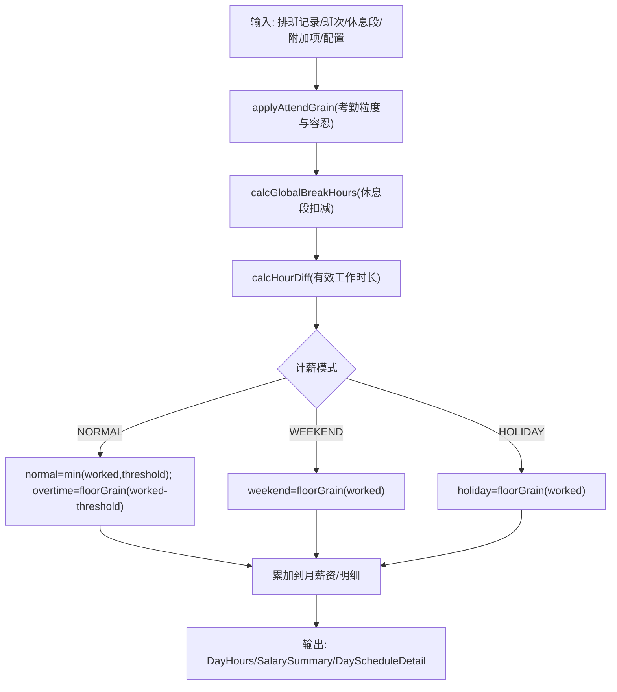
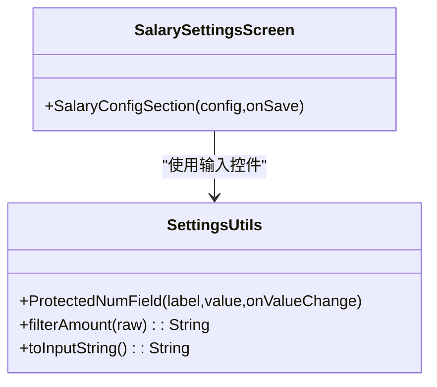
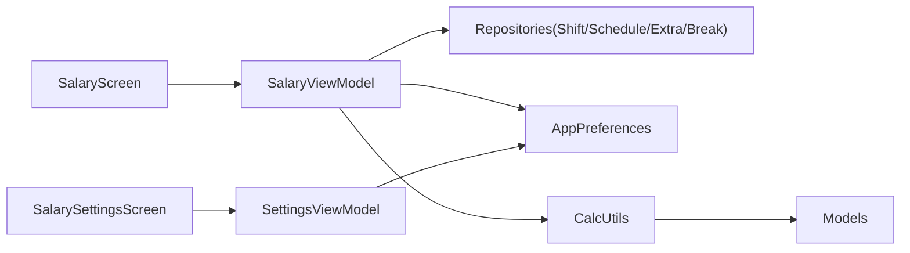

# 薪资界面

<cite>
**本文引用的文件**   
- [SalaryScreen.kt](file://app/src/main/java/com/schedulecalendar/app/ui/salary/SalaryScreen.kt)
- [SalaryViewModel.kt](file://app/src/main/java/com/schedulecalendar/app/ui/salary/SalaryViewModel.kt)
- [CalcUtils.kt](file://app/src/main/java/com/schedulecalendar/app/domain/model/CalcUtils.kt)
- [Models.kt](file://app/src/main/java/com/schedulecalendar/app/domain/model/Models.kt)
- [SalarySettingsScreen.kt](file://app/src/main/java/com/schedulecalendar/app/ui/settings/SalarySettingsScreen.kt)
- [SettingsUtils.kt](file://app/src/main/java/com/schedulecalendar/app/ui/settings/SettingsUtils.kt)
- [SettingsScreen.kt](file://app/src/main/java/com/schedulecalendar/app/ui/settings/SettingsScreen.kt)
- [SettingsViewModel.kt](file://app/src/main/java/com/schedulecalendar/app/ui/settings/SettingsViewModel.kt)
</cite>

## 目录
1. [简介](#简介)
2. [项目结构](#项目结构)
3. [核心组件](#核心组件)
4. [架构总览](#架构总览)
5. [详细组件分析](#详细组件分析)
6. [依赖关系分析](#依赖关系分析)
7. [性能考量](#性能考量)
8. [故障排查指南](#故障排查指南)
9. [结论](#结论)
10. [附录](#附录)

## 简介
本文件聚焦“排班日历应用”的薪资界面，系统性梳理薪资计算结果的UI展示、月度报表与统计图表、用户交互、薪资配置管理、以及数据导出与打印支持现状。文档面向开发者与产品人员，既提供代码级实现说明，也给出可操作的优化建议与扩展方案。

## 项目结构
薪资相关功能主要分布在以下模块：
- UI层（Compose）：薪资主界面、薪资设置页
- ViewModel层：薪资状态管理与数据加载
- 领域层：工时与薪资计算工具、数据模型定义
- 设置层：薪资参数配置入口与输入控件

**图示来源** 
- [SalaryScreen.kt:39-186](file://app/src/main/java/com/schedulecalendar/app/ui/salary/SalaryScreen.kt#L39-L186)
- [SalaryViewModel.kt:48-167](file://app/src/main/java/com/schedulecalendar/app/ui/salary/SalaryViewModel.kt#L48-L167)
- [SalarySettingsScreen.kt:19-35](file://app/src/main/java/com/schedulecalendar/app/ui/settings/SalarySettingsScreen.kt#L19-L35)
- [SettingsScreen.kt:51-59](file://app/src/main/java/com/schedulecalendar/app/ui/settings/SettingsScreen.kt#L51-L59)
- [SettingsViewModel.kt:34-64](file://app/src/main/java/com/schedulecalendar/app/ui/settings/SettingsViewModel.kt#L34-L64)
- [CalcUtils.kt:365-444](file://app/src/main/java/com/schedulecalendar/app/domain/model/CalcUtils.kt#L365-L444)
- [Models.kt:112-142](file://app/src/main/java/com/schedulecalendar/app/domain/model/Models.kt#L112-L142)

**章节来源**
- [SalaryScreen.kt:39-186](file://app/src/main/java/com/schedulecalendar/app/ui/salary/SalaryScreen.kt#L39-L186)
- [SalaryViewModel.kt:48-167](file://app/src/main/java/com/schedulecalendar/app/ui/salary/SalaryViewModel.kt#L48-L167)
- [SalarySettingsScreen.kt:19-35](file://app/src/main/java/com/schedulecalendar/app/ui/settings/SalarySettingsScreen.kt#L19-L35)
- [SettingsScreen.kt:51-59](file://app/src/main/java/com/schedulecalendar/app/ui/settings/SettingsScreen.kt#L51-L59)
- [SettingsViewModel.kt:34-64](file://app/src/main/java/com/schedulecalendar/app/ui/settings/SettingsViewModel.kt#L34-L64)
- [CalcUtils.kt:365-444](file://app/src/main/java/com/schedulecalendar/app/domain/model/CalcUtils.kt#L365-L444)
- [Models.kt:112-142](file://app/src/main/java/com/schedulecalendar/app/domain/model/Models.kt#L112-L142)

## 核心组件
- 薪资主界面（SalaryScreen）：以卡片+网格+图表+明细列表呈现当月薪资概览与每日明细，支持切换“构成/趋势”两种图表视图。
- 薪资ViewModel（SalaryViewModel）：聚合仓库与偏好配置，计算实际/预计/全月估算薪资，生成近8个月趋势，驱动UI状态更新。
- 薪资计算工具（CalcUtils）：统一实现考勤粒度、休息段扣减、日工时分类、月工时汇总、月薪资汇总、每日明细生成等核心算法。
- 薪资设置页（SalarySettingsScreen）：提供基础底薪、绩效、时薪、社保、公积金等参数的编辑与保存。
- 设置工具（SettingsUtils）：数字输入过滤、占位符处理、防IME自动填充等通用输入控件。
- 设置入口（SettingsScreen）：导航至薪资设置页。
- 设置ViewModel（SettingsViewModel）：集中管理薪资与考勤配置流式读写。

**章节来源**
- [SalaryScreen.kt:39-186](file://app/src/main/java/com/schedulecalendar/app/ui/salary/SalaryScreen.kt#L39-L186)
- [SalaryViewModel.kt:48-167](file://app/src/main/java/com/schedulecalendar/app/ui/salary/SalaryViewModel.kt#L48-L167)
- [CalcUtils.kt:149-234](file://app/src/main/java/com/schedulecalendar/app/domain/model/CalcUtils.kt#L149-L234)
- [SalarySettingsScreen.kt:37-89](file://app/src/main/java/com/schedulecalendar/app/ui/settings/SalarySettingsScreen.kt#L37-L89)
- [SettingsUtils.kt:34-69](file://app/src/main/java/com/schedulecalendar/app/ui/settings/SettingsUtils.kt#L34-L69)
- [SettingsScreen.kt:51-59](file://app/src/main/java/com/schedulecalendar/app/ui/settings/SettingsScreen.kt#L51-L59)
- [SettingsViewModel.kt:34-64](file://app/src/main/java/com/schedulecalendar/app/ui/settings/SettingsViewModel.kt#L34-L64)

## 架构总览
薪资界面采用典型的MVVM + Compose架构：
- UI层通过StateFlow订阅ViewModel状态，响应式渲染。
- ViewModel负责从Repository读取排班、班次、休息段、附加项，并从AppPreferences读取薪资与考勤配置，调用CalcUtils进行计算。
- CalcUtils作为纯函数工具层，保证计算逻辑可测试、可复用。
- Settings模块通过统一的ViewModel暴露配置流，供薪资计算与显示消费。

**图示来源** 
- [SalaryScreen.kt:62-88](file://app/src/main/java/com/schedulecalendar/app/ui/salary/SalaryScreen.kt#L62-L88)
- [SalaryViewModel.kt:72-144](file://app/src/main/java/com/schedulecalendar/app/ui/salary/SalaryViewModel.kt#L72-L144)
- [CalcUtils.kt:365-444](file://app/src/main/java/com/schedulecalendar/app/domain/model/CalcUtils.kt#L365-L444)

## 详细组件分析

### 薪资主界面（SalaryScreen）
- 顶部卡片：展示“本月预计薪资”，并区分“已到”和“预计再到”两部分（当前月有效）。
- 薪资明细网格：按类别展示基础底薪、基础绩效、正常工资、加班工资、周末工资、节假日工资、补贴合计、扣款合计；当配置了社保/公积金时动态显示对应扣款项。
- 图表区：支持“薪资构成”饼图与“月薪趋势”折线图切换，饼图包含各组成部分及占比，折线图展示近8个月趋势。
- 每日明细：列出工作日记录，显示班次、请假/调休/休息标签、附加补贴/扣款、当日薪资与加班贡献。

**图示来源** 
- [SalaryScreen.kt:39-186](file://app/src/main/java/com/schedulecalendar/app/ui/salary/SalaryScreen.kt#L39-L186)
- [SalaryViewModel.kt:48-167](file://app/src/main/java/com/schedulecalendar/app/ui/salary/SalaryViewModel.kt#L48-L167)
- [CalcUtils.kt:365-444](file://app/src/main/java/com/schedulecalendar/app/domain/model/CalcUtils.kt#L365-L444)

**章节来源**
- [SalaryScreen.kt:90-186](file://app/src/main/java/com/schedulecalendar/app/ui/salary/SalaryScreen.kt#L90-L186)
- [SalaryScreen.kt:189-334](file://app/src/main/java/com/schedulecalendar/app/ui/salary/SalaryScreen.kt#L189-L334)
- [SalaryScreen.kt:335-421](file://app/src/main/java/com/schedulecalendar/app/ui/salary/SalaryScreen.kt#L335-L421)
- [SalaryScreen.kt:423-496](file://app/src/main/java/com/schedulecalendar/app/ui/salary/SalaryScreen.kt#L423-L496)

### 薪资ViewModel（SalaryViewModel）
- 状态字段：year/month、actual（已到账）、future（预计）、fullEstimate（全月估算）、details（每日明细）、trend（近8月趋势）、loading。
- 数据加载流程：监听排班刷新信号，首次加载显示loading，后续刷新保持内容；根据是否当前月/未来月分别计算actual与future；构建趋势列表。
- 错误处理：计算失败时发送ShowError事件，由界面Snackbar提示。

**图示来源** 
- [SalaryViewModel.kt:74-144](file://app/src/main/java/com/schedulecalendar/app/ui/salary/SalaryViewModel.kt#L74-L144)

**章节来源**
- [SalaryViewModel.kt:32-46](file://app/src/main/java/com/schedulecalendar/app/ui/salary/SalaryViewModel.kt#L32-L46)
- [SalaryViewModel.kt:72-144](file://app/src/main/java/com/schedulecalendar/app/ui/salary/SalaryViewModel.kt#L72-L144)
- [SalaryViewModel.kt:146-167](file://app/src/main/java/com/schedulecalendar/app/ui/salary/SalaryViewModel.kt#L146-L167)

### 薪资计算工具（CalcUtils）
- 时间工具：分钟转换、跨天范围归一化、小时差计算。
- 考勤规则：早到/迟到/晚退/早退的粒度取整与容忍时长处理。
- 休息段扣减：全局不计入时段与班次时间窗口的重叠扣减。
- 日工时分类：按日期类型自动推断计薪方式（正常/周末/节假日），并区分正常与加班工时。
- 月工时汇总：统计正常/加班/周末/节假日工时、请假/调休天数、迟到早退次数等。
- 月薪资汇总：基于时薪与附加项计算各项薪资与扣款，最终得出实发总额。
- 每日明细：为UI提供每日的工时、薪资、附加项等信息。

**图示来源** 
- [CalcUtils.kt:61-113](file://app/src/main/java/com/schedulecalendar/app/domain/model/CalcUtils.kt#L61-L113)
- [CalcUtils.kt:149-234](file://app/src/main/java/com/schedulecalendar/app/domain/model/CalcUtils.kt#L149-L234)
- [CalcUtils.kt:365-444](file://app/src/main/java/com/schedulecalendar/app/domain/model/CalcUtils.kt#L365-L444)
- [CalcUtils.kt:448-486](file://app/src/main/java/com/schedulecalendar/app/domain/model/CalcUtils.kt#L448-L486)

**章节来源**
- [CalcUtils.kt:18-50](file://app/src/main/java/com/schedulecalendar/app/domain/model/CalcUtils.kt#L18-L50)
- [CalcUtils.kt:61-113](file://app/src/main/java/com/schedulecalendar/app/domain/model/CalcUtils.kt#L61-L113)
- [CalcUtils.kt:149-234](file://app/src/main/java/com/schedulecalendar/app/domain/model/CalcUtils.kt#L149-L234)
- [CalcUtils.kt:365-444](file://app/src/main/java/com/schedulecalendar/app/domain/model/CalcUtils.kt#L365-L444)
- [CalcUtils.kt:448-486](file://app/src/main/java/com/schedulecalendar/app/domain/model/CalcUtils.kt#L448-L486)

### 薪资设置页（SalarySettingsScreen）
- 提供标准工时制字段输入：基础底薪、基础绩效、正常时薪、加班时薪、周末时薪、节假日时薪、社保扣款、公积金扣款。
- 使用ProtectedNumField确保输入合法性与体验一致性，实时保存至偏好存储。

**图示来源** 
- [SalarySettingsScreen.kt:37-89](file://app/src/main/java/com/schedulecalendar/app/ui/settings/SalarySettingsScreen.kt#L37-L89)
- [SettingsUtils.kt:34-69](file://app/src/main/java/com/schedulecalendar/app/ui/settings/SettingsUtils.kt#L34-L69)

**章节来源**
- [SalarySettingsScreen.kt:37-89](file://app/src/main/java/com/schedulecalendar/app/ui/settings/SalarySettingsScreen.kt#L37-L89)
- [SettingsUtils.kt:18-29](file://app/src/main/java/com/schedulecalendar/app/ui/settings/SettingsUtils.kt#L18-L29)
- [SettingsUtils.kt:34-69](file://app/src/main/java/com/schedulecalendar/app/ui/settings/SettingsUtils.kt#L34-L69)

### 数据模型（Models）
- 薪资配置（SalaryConfig）：底薪、绩效、各类时薪、社保与公积金扣款。
- 考勤配置（AttendConfig）：加班粒度、迟到/早退容忍、扣款费率、标准工时等。
- 排班记录（ScheduleRecord）：日期、类型、班次ID、打卡时间、附加项、状态时间段、计薪方式等。
- 薪资汇总（SalarySummary）：分项薪资与扣款、实发总额。
- 每日明细（DayScheduleDetail）：日期、记录、班次、工时、薪资、附加项。

**章节来源**
- [Models.kt:112-142](file://app/src/main/java/com/schedulecalendar/app/domain/model/Models.kt#L112-L142)
- [Models.kt:226-270](file://app/src/main/java/com/schedulecalendar/app/domain/model/Models.kt#L226-L270)

## 依赖关系分析
- UI层依赖ViewModel提供的StateFlow，避免直接访问数据源。
- ViewModel依赖多个Repository与AppPreferences，组合数据后调用CalcUtils进行计算。
- CalcUtils为纯函数工具，不持有外部状态，便于单元测试与复用。
- Settings模块通过统一的ViewModel暴露配置流，确保薪资计算与显示的一致性。

**图示来源** 
- [SalaryScreen.kt:39-186](file://app/src/main/java/com/schedulecalendar/app/ui/salary/SalaryScreen.kt#L39-L186)
- [SalaryViewModel.kt:48-167](file://app/src/main/java/com/schedulecalendar/app/ui/salary/SalaryViewModel.kt#L48-L167)
- [SettingsViewModel.kt:34-64](file://app/src/main/java/com/schedulecalendar/app/ui/settings/SettingsViewModel.kt#L34-L64)
- [CalcUtils.kt:365-444](file://app/src/main/java/com/schedulecalendar/app/domain/model/CalcUtils.kt#L365-L444)

**章节来源**
- [SalaryViewModel.kt:48-167](file://app/src/main/java/com/schedulecalendar/app/ui/salary/SalaryViewModel.kt#L48-L167)
- [SettingsViewModel.kt:34-64](file://app/src/main/java/com/schedulecalendar/app/ui/settings/SettingsViewModel.kt#L34-L64)

## 性能考量
- 首次加载显示loading，后续刷新保持现有内容，减少闪烁。
- 使用StateFlow与collectAsStateWithLifecycle，生命周期感知，避免内存泄漏。
- 图表绘制使用Canvas轻量实现，避免引入重型图表库。
- 计算集中在CalcUtils，避免在UI线程执行耗时操作。

[本节为通用指导，无需特定文件引用]

## 故障排查指南
- 薪资计算失败：ViewModel捕获异常并通过uiEvent发送ShowError，界面Snackbar提示。检查仓库数据完整性与配置有效性。
- 数据未刷新：确认排班刷新信号是否正常触发；检查生命周期观察者是否正确注册与移除。
- 输入异常：ProtectedNumField已做数字过滤与IME防自动填充，若仍有问题，检查键盘类型与焦点处理。

**章节来源**
- [SalaryViewModel.kt:139-143](file://app/src/main/java/com/schedulecalendar/app/ui/salary/SalaryViewModel.kt#L139-L143)
- [SalaryScreen.kt:82-88](file://app/src/main/java/com/schedulecalendar/app/ui/salary/SalaryScreen.kt#L82-L88)
- [SettingsUtils.kt:34-69](file://app/src/main/java/com/schedulecalendar/app/ui/settings/SettingsUtils.kt#L34-L69)

## 结论
薪资界面实现了完整的月度薪资可视化与明细展示，涵盖薪资构成饼图与趋势折线图，支持日常明细查看与配置管理。计算逻辑集中于CalcUtils，具备良好的可维护性与扩展性。当前版本未内置薪资报表导出与打印功能，可通过扩展ExportService与PrintService实现CSV/PDF导出与系统打印集成。

[本节为总结性内容，无需特定文件引用]

## 附录

### 薪资数据可视化与交互要点
- 月度报表：顶部卡片展示“本月预计薪资”，区分“已到/预计再到”。
- 薪资明细：网格布局展示各分项，支持未来值增量显示。
- 统计图表：饼图展示构成比例，折线图展示近8月趋势。
- 每日明细：按日期展示班次、状态、附加项与薪资贡献。

**章节来源**
- [SalaryScreen.kt:108-186](file://app/src/main/java/com/schedulecalendar/app/ui/salary/SalaryScreen.kt#L108-L186)
- [SalaryScreen.kt:189-334](file://app/src/main/java/com/schedulecalendar/app/ui/salary/SalaryScreen.kt#L189-L334)
- [SalaryScreen.kt:335-421](file://app/src/main/java/com/schedulecalendar/app/ui/salary/SalaryScreen.kt#L335-L421)
- [SalaryScreen.kt:423-496](file://app/src/main/java/com/schedulecalendar/app/ui/salary/SalaryScreen.kt#L423-L496)

### 薪资配置界面管理与参数调整
- 入口：设置页“薪资配置”卡片跳转至薪资设置页。
- 参数：基础底薪、基础绩效、正常/加班/周末/节假日时薪、社保与公积金扣款。
- 输入：ProtectedNumField确保数值合法性与用户体验。

**章节来源**
- [SettingsScreen.kt:51-59](file://app/src/main/java/com/schedulecalendar/app/ui/settings/SettingsScreen.kt#L51-L59)
- [SalarySettingsScreen.kt:37-89](file://app/src/main/java/com/schedulecalendar/app/ui/settings/SalarySettingsScreen.kt#L37-L89)
- [SettingsUtils.kt:34-69](file://app/src/main/java/com/schedulecalendar/app/ui/settings/SettingsUtils.kt#L34-L69)

### 薪资数据导出与打印支持（现状与建议）
- 现状：当前代码未发现薪资报表导出与打印的具体实现。
- 建议扩展：
  - 新增ExportService：支持CSV/PDF导出，包含月度汇总与每日明细。
  - 新增PrintService：集成系统打印框架，支持PDF打印与自定义格式。
  - 自定义格式：提供模板选择与个性化设置（标题、单位、币种、分页等）。

[本节为概念性建议，无需特定文件引用]