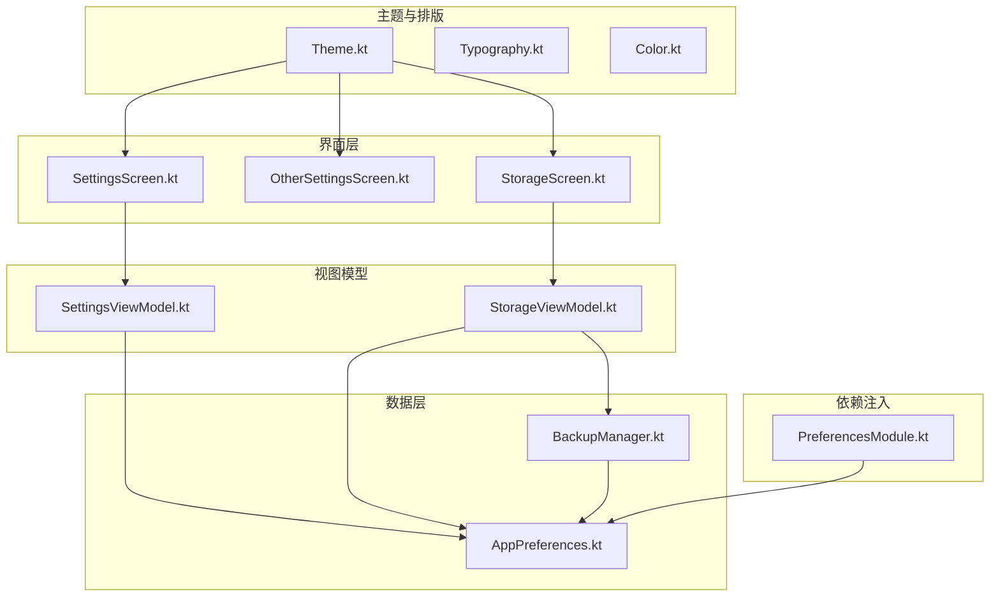
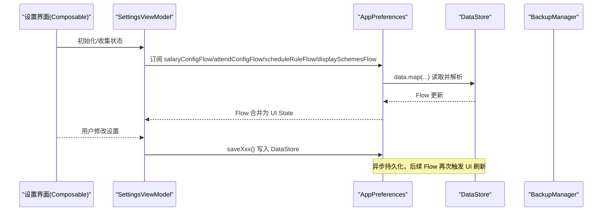
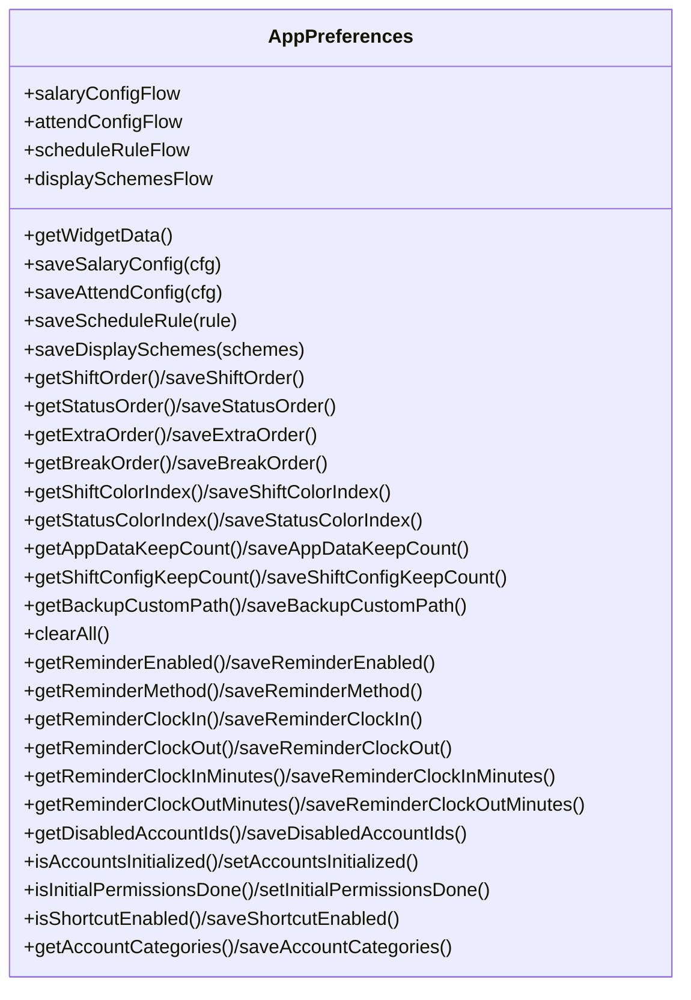
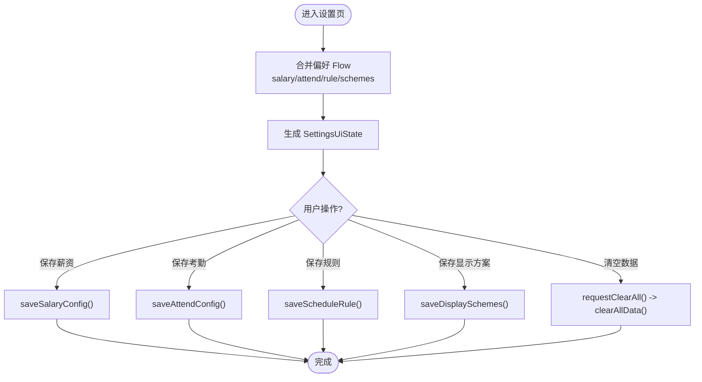
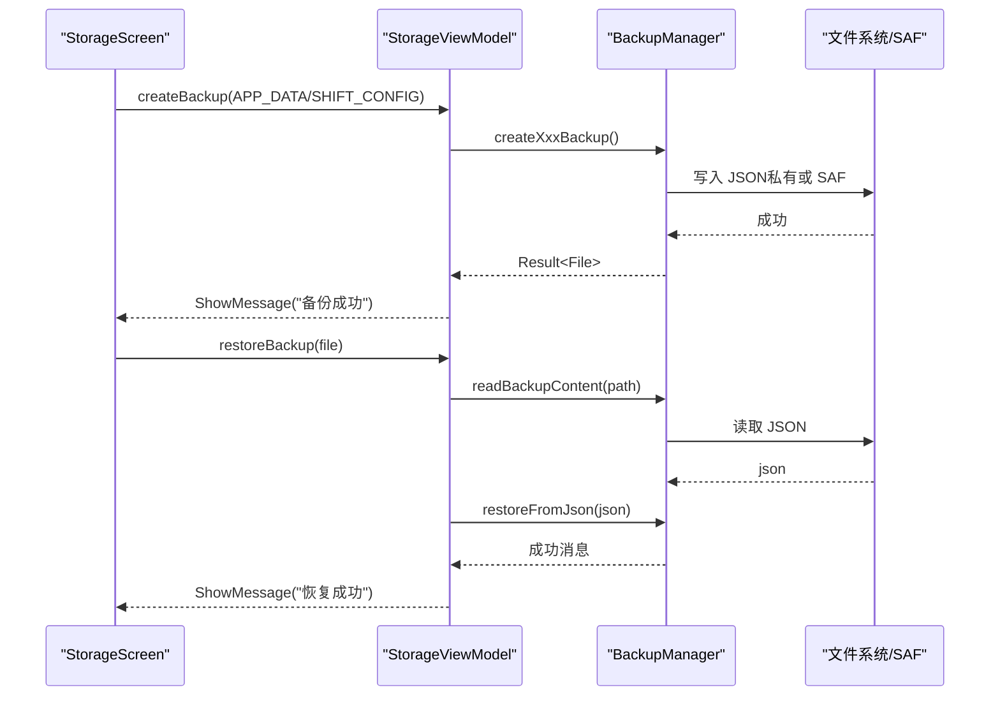
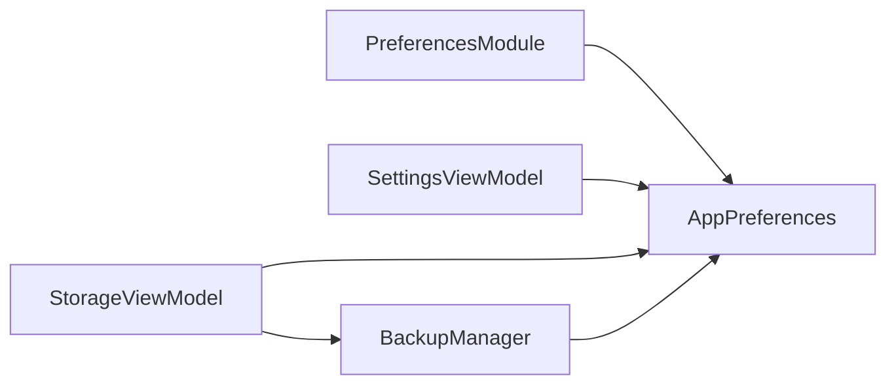

# 其他设置

<cite>
**本文引用的文件**   
- [OtherSettingsScreen.kt](file://app/src/main/java/com/schedulecalendar/app/ui/settings/OtherSettingsScreen.kt)
- [AppPreferences.kt](file://app/src/main/java/com/schedulecalendar/app/data/prefs/AppPreferences.kt)
- [SettingsViewModel.kt](file://app/src/main/java/com/schedulecalendar/app/ui/settings/SettingsViewModel.kt)
- [SettingsScreen.kt](file://app/src/main/java/com/schedulecalendar/app/ui/settings/SettingsScreen.kt)
- [StorageScreen.kt](file://app/src/main/java/com/schedulecalendar/app/ui/settings/StorageScreen.kt)
- [StorageViewModel.kt](file://app/src/main/java/com/schedulecalendar/app/ui/settings/StorageViewModel.kt)
- [BackupManager.kt](file://app/src/main/java/com/schedulecalendar/app/ui/settings/BackupManager.kt)
- [PreferencesModule.kt](file://app/src/main/java/com/schedulecalendar/app/di/PreferencesModule.kt)
- [Theme.kt](file://app/src/main/java/com/schedulecalendar/app/ui/theme/Theme.kt)
- [Typography.kt](file://app/src/main/java/com/schedulecalendar/app/ui/theme/Typography.kt)
- [Color.kt](file://app/src/main/java/com/schedulecalendar/app/ui/theme/Color.kt)
</cite>

## 目录
1. [简介](#简介)
2. [项目结构](#项目结构)
3. [核心组件](#核心组件)
4. [架构总览](#架构总览)
5. [详细组件分析](#详细组件分析)
6. [依赖关系分析](#依赖关系分析)
7. [性能考量](#性能考量)
8. [故障排查指南](#故障排查指南)
9. [结论](#结论)
10. [附录](#附录)

## 简介
本章节聚焦“其他设置”模块，系统梳理应用的通用配置与偏好管理，涵盖：
- 语言、主题切换、字体大小、深色模式等显示相关能力（当前以系统主题为主）
- 应用偏好的存储与读取机制（DataStore + Flow）
- 设置项的动态加载与条件显示逻辑
- 设置项的验证规则与默认值处理
- 设置的导入导出与批量配置（备份/恢复、路径选择、裁剪策略）

该模块通过清晰的分层（UI → ViewModel → 偏好层 → 备份管理器）实现高内聚、低耦合，便于扩展更多通用设置。

## 项目结构
“其他设置”相关代码主要分布在以下位置：
- UI 层：设置入口、权限管理、存储与备份界面、“其它设置”占位页
- 数据层：偏好集中管理（DataStore）、备份管理器（JSON 序列化/反序列化、SAF 读写）
- 主题与排版：Material You 动态取色、深色模式、固定字体排版
- 依赖注入：Hilt 提供 AppPreferences 单例

图表来源 
- [SettingsScreen.kt:1-472](file://app/src/main/java/com/schedulecalendar/app/ui/settings/SettingsScreen.kt#L1-L472)
- [OtherSettingsScreen.kt:1-25](file://app/src/main/java/com/schedulecalendar/app/ui/settings/OtherSettingsScreen.kt#L1-L25)
- [StorageScreen.kt:1-766](file://app/src/main/java/com/schedulecalendar/app/ui/settings/StorageScreen.kt#L1-L766)
- [SettingsViewModel.kt:1-91](file://app/src/main/java/com/schedulecalendar/app/ui/settings/SettingsViewModel.kt#L1-L91)
- [StorageViewModel.kt:1-360](file://app/src/main/java/com/schedulecalendar/app/ui/settings/StorageViewModel.kt#L1-L360)
- [AppPreferences.kt:1-313](file://app/src/main/java/com/schedulecalendar/app/data/prefs/AppPreferences.kt#L1-L313)
- [BackupManager.kt:1-579](file://app/src/main/java/com/schedulecalendar/app/ui/settings/BackupManager.kt#L1-L579)
- [PreferencesModule.kt:1-21](file://app/src/main/java/com/schedulecalendar/app/di/PreferencesModule.kt#L1-L21)
- [Theme.kt:1-80](file://app/src/main/java/com/schedulecalendar/app/ui/theme/Theme.kt#L1-L80)
- [Typography.kt:1-23](file://app/src/main/java/com/schedulecalendar/app/ui/theme/Typography.kt#L1-L23)
- [Color.kt:1-54](file://app/src/main/java/com/schedulecalendar/app/ui/theme/Color.kt#L1-L54)

章节来源
- [SettingsScreen.kt:1-472](file://app/src/main/java/com/schedulecalendar/app/ui/settings/SettingsScreen.kt#L1-L472)
- [StorageScreen.kt:1-766](file://app/src/main/java/com/schedulecalendar/app/ui/settings/StorageScreen.kt#L1-L766)
- [OtherSettingsScreen.kt:1-25](file://app/src/main/java/com/schedulecalendar/app/ui/settings/OtherSettingsScreen.kt#L1-L25)

## 核心组件
- 偏好中心 AppPreferences
  - 基于 DataStore 持久化所有设置键值对，提供 Flow 响应式读取
  - 使用 Gson 进行复杂对象（薪资、考勤、排班规则、显示方案、账户分类等）序列化/反序列化
  - 暴露提醒、排序、颜色索引、快捷方式开关、备份保留份数、自定义路径等 API
- 设置视图模型 SettingsViewModel
  - 聚合多个 Flow 合并为统一 UI 状态，封装保存操作与清空确认事件
- 存储与备份 StorageViewModel + BackupManager
  - 备份类型枚举、备份文件元信息、废弃数据扫描与清理
  - 自动备份策略（按天/每次修改）、手动备份、恢复、分享、删除
  - SAF 目录选择与权限持久化，跨目录合并与裁剪
- 主题与排版 Theme/Typography/Color
  - 深色模式跟随系统，Android 12+ 支持 Material You 动态取色
  - 全局 Typography 定义，未提供运行时字体大小调整开关

章节来源
- [AppPreferences.kt:1-313](file://app/src/main/java/com/schedulecalendar/app/data/prefs/AppPreferences.kt#L1-L313)
- [SettingsViewModel.kt:1-91](file://app/src/main/java/com/schedulecalendar/app/ui/settings/SettingsViewModel.kt#L1-L91)
- [StorageViewModel.kt:1-360](file://app/src/main/java/com/schedulecalendar/app/ui/settings/StorageViewModel.kt#L1-L360)
- [BackupManager.kt:1-579](file://app/src/main/java/com/schedulecalendar/app/ui/settings/BackupManager.kt#L1-L579)
- [Theme.kt:1-80](file://app/src/main/java/com/schedulecalendar/app/ui/theme/Theme.kt#L1-L80)
- [Typography.kt:1-23](file://app/src/main/java/com/schedulecalendar/app/ui/theme/Typography.kt#L1-L23)
- [Color.kt:1-54](file://app/src/main/java/com/schedulecalendar/app/ui/theme/Color.kt#L1-L54)

## 架构总览
整体采用 MVVM + Hilt 依赖注入，UI 层通过 ViewModel 订阅偏好 Flow，数据变更实时驱动界面；备份与恢复由专用管理器统一处理，避免在 UI 中直接操作文件系统。

图表来源 
- [SettingsViewModel.kt:1-91](file://app/src/main/java/com/schedulecalendar/app/ui/settings/SettingsViewModel.kt#L1-L91)
- [AppPreferences.kt:1-313](file://app/src/main/java/com/schedulecalendar/app/data/prefs/AppPreferences.kt#L1-L313)

章节来源
- [SettingsViewModel.kt:1-91](file://app/src/main/java/com/schedulecalendar/app/ui/settings/SettingsViewModel.kt#L1-L91)
- [AppPreferences.kt:1-313](file://app/src/main/java/com/schedulecalendar/app/data/prefs/AppPreferences.kt#L1-L313)

## 详细组件分析

### 偏好中心 AppPreferences
- 设计要点
  - 使用 DataStore 的 Preferences 作为键值存储，Key 常量集中管理
  - 复杂对象通过 Gson InstanceCreator 保证反序列化时保留默认值
  - 提供 Flow 与 suspend 函数双接口，兼顾响应式与一次性读取
- 关键能力
  - 薪资/考勤/排班规则/显示方案 Flow 与保存方法
  - 小组件数据快照读取（first() 用法示例）
  - 各类排序（班次/状态/补贴扣款/休息时段）与颜色索引
  - 备份保留份数与自定义路径
  - 上下班提醒配置（启用、方式、内容、提前分钟）
  - 已禁用账户 ID、账户分类映射、首次初始化标记
  - 长按快捷方式开关、首次启动权限标记
  - 一键清除所有 DataStore 键值

图表来源 
- [AppPreferences.kt:1-313](file://app/src/main/java/com/schedulecalendar/app/data/prefs/AppPreferences.kt#L1-L313)

章节来源
- [AppPreferences.kt:1-313](file://app/src/main/java/com/schedulecalendar/app/data/prefs/AppPreferences.kt#L1-L313)

### 设置视图模型 SettingsViewModel
- 职责
  - 合并多个偏好 Flow 生成统一 UI 状态
  - 暴露保存方法与清空数据的 UI 事件通道
- 交互流程
  - 页面初始化时组合 Flow，设置 loading=false
  - 用户触发保存后调用对应 saveXxx() 写入 DataStore

图表来源 
- [SettingsViewModel.kt:1-91](file://app/src/main/java/com/schedulecalendar/app/ui/settings/SettingsViewModel.kt#L1-L91)

章节来源
- [SettingsViewModel.kt:1-91](file://app/src/main/java/com/schedulecalendar/app/ui/settings/SettingsViewModel.kt#L1-L91)

### 存储与备份 StorageViewModel + BackupManager
- 备份类型与文件元信息
  - APP_DATA：包含排班记录、班次配置、附加项目、设置等
  - SHIFT_CONFIG：仅班次、不计时段、状态类型（可共享）
- 自动备份策略
  - 应用数据：每天只保留最新一条（keepCount=0 禁用）
  - 班次配置：每次修改生成新备份（keepCount=0 禁用）
- 自定义路径与 SAF
  - 支持 content:// URI 与 /tree/... 格式解析
  - 持久化 URI 权限，确保重启后可访问
- 导入/导出与恢复
  - 从 JSON 自动识别类型并恢复
  - 支持分享备份文件（兼容 SAF URI 与 FileProvider）

图表来源 
- [StorageScreen.kt:1-766](file://app/src/main/java/com/schedulecalendar/app/ui/settings/StorageScreen.kt#L1-L766)
- [StorageViewModel.kt:1-360](file://app/src/main/java/com/schedulecalendar/app/ui/settings/StorageViewModel.kt#L1-L360)
- [BackupManager.kt:1-579](file://app/src/main/java/com/schedulecalendar/app/ui/settings/BackupManager.kt#L1-L579)

章节来源
- [StorageScreen.kt:1-766](file://app/src/main/java/com/schedulecalendar/app/ui/settings/StorageScreen.kt#L1-L766)
- [StorageViewModel.kt:1-360](file://app/src/main/java/com/schedulecalendar/app/ui/settings/StorageViewModel.kt#L1-L360)
- [BackupManager.kt:1-579](file://app/src/main/java/com/schedulecalendar/app/ui/settings/BackupManager.kt#L1-L579)

### 权限管理与条件显示
- 权限检测与引导
  - 通知权限（Android 13+）、日历读写、精确闹钟（Android 12/13 差异）、电池优化白名单
  - 国产 ROM 后台运行保障引导（自启动、省电策略无限制、后台弹出界面、桌面快捷方式）
- 条件显示
  - 根据 Build.VERSION.SDK_INT 与厂商判断展示不同提示与操作按钮

章节来源
- [SettingsScreen.kt:1-472](file://app/src/main/java/com/schedulecalendar/app/ui/settings/SettingsScreen.kt#L1-L472)

### “其它设置”占位页
- 当前为占位界面，提示“功能开发中”，预留导航入口以便后续扩展通用设置项（如语言、字体大小等）

章节来源
- [OtherSettingsScreen.kt:1-25](file://app/src/main/java/com/schedulecalendar/app/ui/settings/OtherSettingsScreen.kt#L1-L25)

### 主题与排版（深色模式与字体）
- 深色模式
  - 跟随系统 isSystemInDarkTheme()
  - Android 12+ 启用 Material You 动态取色（dynamicLightColorScheme/dynamicDarkColorScheme）
- 字体排版
  - 全局 Typography 定义固定字号与行高，当前未提供运行时字体大小调整开关
- 颜色体系
  - 主色调绿色系、辅色蓝色、中性灰阶、业务语义色与班次预设颜色

章节来源
- [Theme.kt:1-80](file://app/src/main/java/com/schedulecalendar/app/ui/theme/Theme.kt#L1-L80)
- [Typography.kt:1-23](file://app/src/main/java/com/schedulecalendar/app/ui/theme/Typography.kt#L1-L23)
- [Color.kt:1-54](file://app/src/main/java/com/schedulecalendar/app/ui/theme/Color.kt#L1-L54)

## 依赖关系分析
- Hilt 注入
  - PreferencesModule 提供 AppPreferences 单例，供 ViewModel 与 BackupManager 使用
- 组件耦合
  - UI 层仅依赖 ViewModel，不直接操作 DataStore/文件系统
  - BackupManager 依赖 AppPreferences 获取保留份数与自定义路径
  - StorageViewModel 协调 BackupManager 与偏好层，屏蔽底层细节

图表来源 
- [PreferencesModule.kt:1-21](file://app/src/main/java/com/schedulecalendar/app/di/PreferencesModule.kt#L1-L21)
- [SettingsViewModel.kt:1-91](file://app/src/main/java/com/schedulecalendar/app/ui/settings/SettingsViewModel.kt#L1-L91)
- [StorageViewModel.kt:1-360](file://app/src/main/java/com/schedulecalendar/app/ui/settings/StorageViewModel.kt#L1-L360)
- [BackupManager.kt:1-579](file://app/src/main/java/com/schedulecalendar/app/ui/settings/BackupManager.kt#L1-L579)
- [AppPreferences.kt:1-313](file://app/src/main/java/com/schedulecalendar/app/data/prefs/AppPreferences.kt#L1-L313)

章节来源
- [PreferencesModule.kt:1-21](file://app/src/main/java/com/schedulecalendar/app/di/PreferencesModule.kt#L1-L21)
- [SettingsViewModel.kt:1-91](file://app/src/main/java/com/schedulecalendar/app/ui/settings/SettingsViewModel.kt#L1-L91)
- [StorageViewModel.kt:1-360](file://app/src/main/java/com/schedulecalendar/app/ui/settings/StorageViewModel.kt#L1-L360)
- [BackupManager.kt:1-579](file://app/src/main/java/com/schedulecalendar/app/ui/settings/BackupManager.kt#L1-L579)
- [AppPreferences.kt:1-313](file://app/src/main/java/com/schedulecalendar/app/data/prefs/AppPreferences.kt#L1-L313)

## 性能考量
- DataStore Flow 响应式更新，避免频繁轮询
- 备份列表仅列出文件，不执行裁剪，确保页面秒开；裁剪在自动备份时进行
- 使用 DocumentsContract 单次 IPC 查询 SAF 目录，避免 DocumentFile N 次 IPC 的性能陷阱
- 备份文件命名含时间戳，便于快速定位与裁剪

[本节为通用指导，无需引用具体文件]

## 故障排查指南
- 备份失败
  - 检查自定义路径是否有效且具备读写权限（content:// URI 需持久化权限）
  - 查看日志中的异常信息（如无法创建文件或写入流失败）
- 恢复失败
  - 确认导入的 JSON 是否为受支持的备份格式（应用数据包/班次配置）
  - 若为外部 URI，确保内容可读
- 权限问题
  - 通知权限（Android 13+）需在设置中授予
  - 精确闹钟权限在 Android 12 需手动开启；Android 13+ 安装时自动授予
  - 国产 ROM 需开启自启动、省电策略无限制、后台弹出界面、桌面快捷方式

章节来源
- [StorageScreen.kt:1-766](file://app/src/main/java/com/schedulecalendar/app/ui/settings/StorageScreen.kt#L1-L766)
- [SettingsScreen.kt:1-472](file://app/src/main/java/com/schedulecalendar/app/ui/settings/SettingsScreen.kt#L1-L472)

## 结论
“其他设置”模块以 AppPreferences 为核心，结合 DataStore 与 Flow 实现了稳定可靠的偏好管理；通过 BackupManager 提供了完善的备份/恢复与路径管理能力；主题与排版遵循 Material Design 规范，支持深色模式与动态取色。当前“其它设置”页面为占位，未来可在此扩展语言、字体大小等通用设置项，并保持现有分层与数据流的一致性。

[本节为总结性内容，无需引用具体文件]

## 附录
- 设置项默认值与验证规则（节选）
  - 应用数据保留份数：默认 5（0=禁用）
  - 班次配置保留份数：默认 10（0=禁用）
  - 自定义备份路径：空字符串表示使用应用私有目录
  - 提醒方式：默认 "alarm"
  - 提醒提前分钟：上班默认 15 分钟，下班默认 0 分钟
  - 快捷方式开关：默认 true
  - 输入过滤：金额/数字输入框仅允许数字与小数点，多小数点只保留第一个

章节来源
- [AppPreferences.kt:1-313](file://app/src/main/java/com/schedulecalendar/app/data/prefs/AppPreferences.kt#L1-L313)
- [SettingsUtils.kt:1-70](file://app/src/main/java/com/schedulecalendar/app/ui/settings/SettingsUtils.kt#L1-L70)