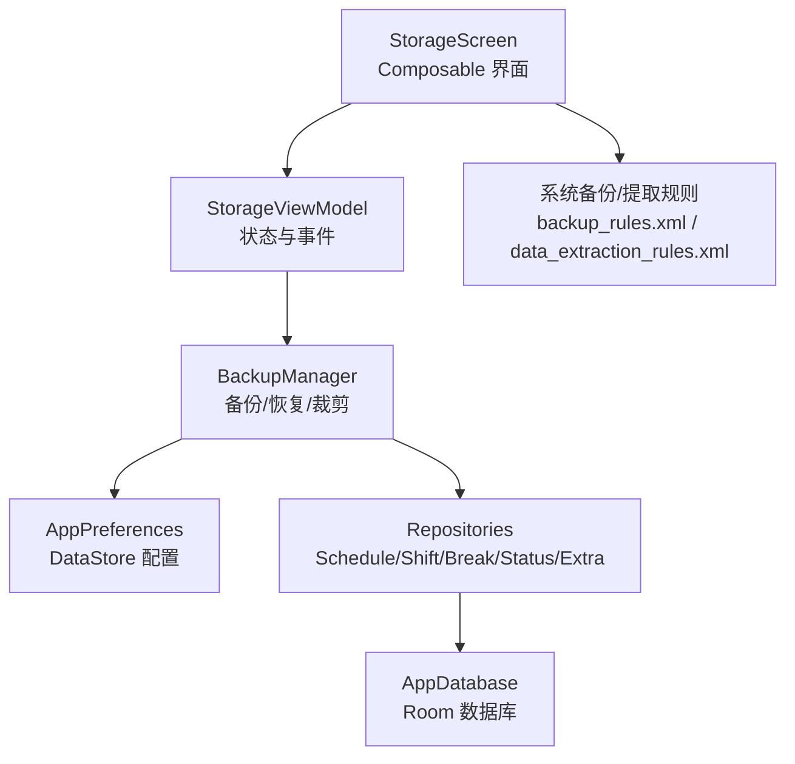
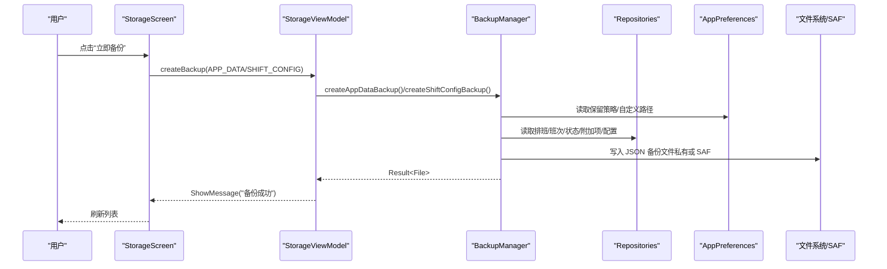
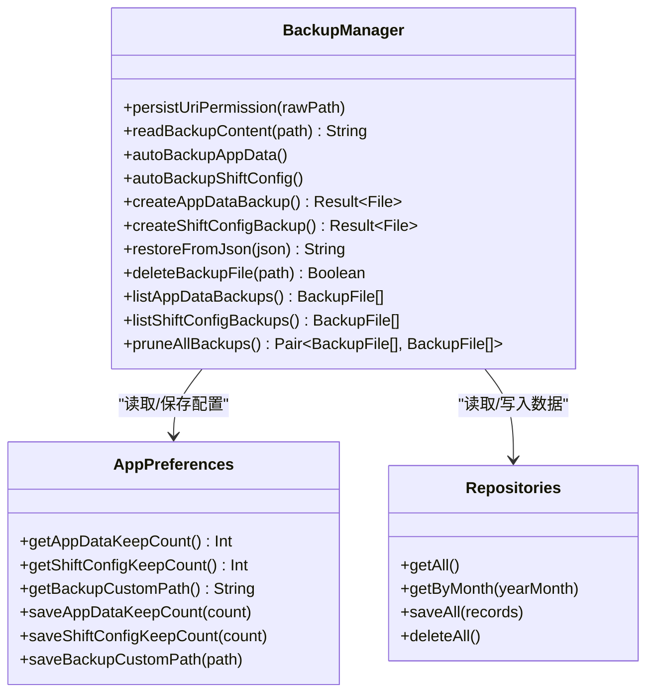
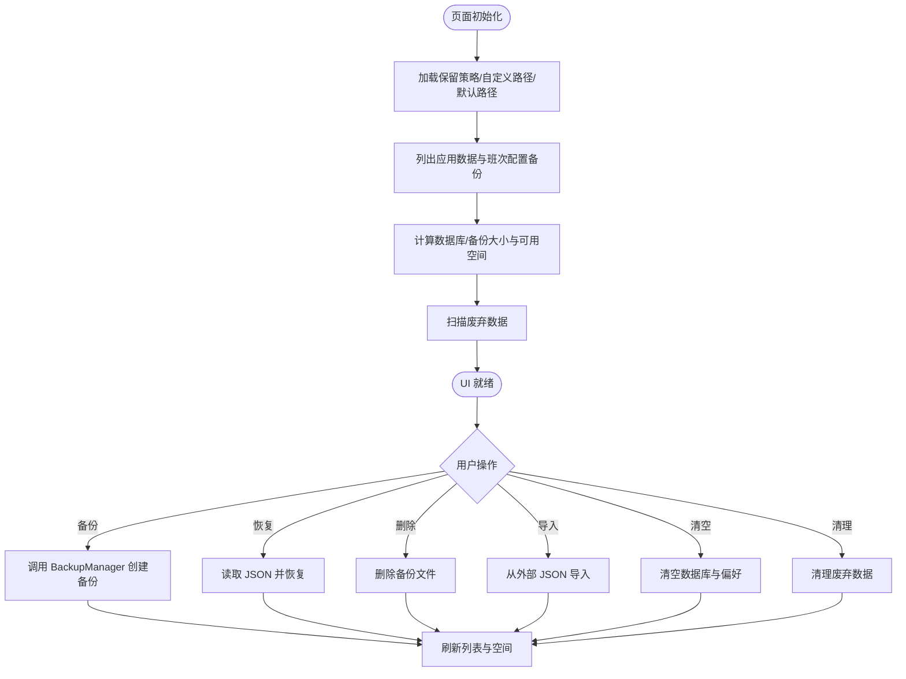
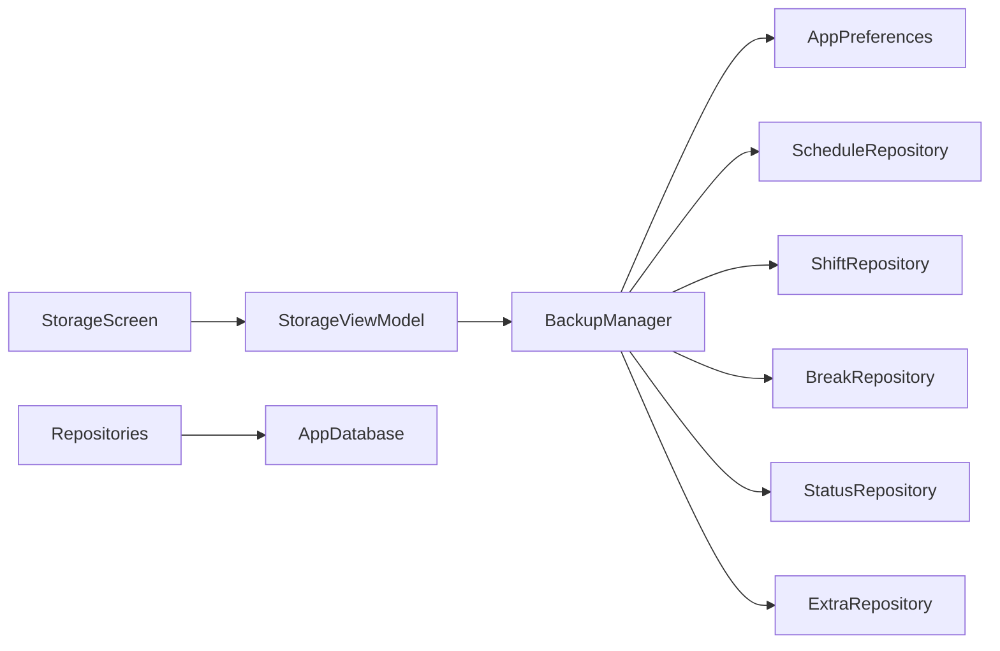

# 存储设置

<cite>
**本文引用的文件**   
- [BackupManager.kt](file://app/src/main/java/com/schedulecalendar/app/ui/settings/BackupManager.kt)
- [StorageScreen.kt](file://app/src/main/java/com/schedulecalendar/app/ui/settings/StorageScreen.kt)
- [StorageViewModel.kt](file://app/src/main/java/com/schedulecalendar/app/ui/settings/StorageViewModel.kt)
- [AppPreferences.kt](file://app/src/main/java/com/schedulecalendar/app/data/prefs/AppPreferences.kt)
- [AppDatabase.kt](file://app/src/main/java/com/schedulecalendar/app/data/db/AppDatabase.kt)
- [ScheduleRepository.kt](file://app/src/main/java/com/schedulecalendar/app/data/repository/ScheduleRepository.kt)
- [ShiftRepository.kt](file://app/src/main/java/com/schedulecalendar/app/data/repository/ShiftRepository.kt)
- [Models.kt](file://app/src/main/java/com/schedulecalendar/app/domain/model/Models.kt)
- [backup_rules.xml](file://app/src/main/res/xml/backup_rules.xml)
- [data_extraction_rules.xml](file://app/src/main/res/xml/data_extraction_rules.xml)
</cite>

## 目录
1. [简介](#简介)
2. [项目结构](#项目结构)
3. [核心组件](#核心组件)
4. [架构总览](#架构总览)
5. [详细组件分析](#详细组件分析)
6. [依赖关系分析](#依赖关系分析)
7. [性能与优化](#性能与优化)
8. [故障排查指南](#故障排查指南)
9. [结论](#结论)
10. [附录](#附录)

## 简介
本模块提供“存储与备份”的完整能力，涵盖：
- 数据库与配置数据的备份与恢复（应用数据、班次配置）
- 本地与外部路径（SAF）双写支持，统一列表与裁剪策略
- 存储空间可视化与监控（数据库大小、备份文件大小、可用空间）
- 批量清理废弃数据（已归档且无引用）与清空所有数据
- 版本兼容与完整性校验（JSON 包版本字段、关键字段存在性判断）
- 云端同步与设备迁移（通过系统备份规则与数据提取规则声明）

该模块以 BackupManager 为核心，配合 StorageViewModel 与 StorageScreen 完成用户交互与状态管理。

## 项目结构
存储设置相关代码主要位于 ui/settings 与 data/prefs、data/db、domain/model 等目录：
- UI 层：StorageScreen（Compose 界面）、StorageViewModel（状态与事件）
- 业务层：BackupManager（备份/恢复/裁剪/导入导出）
- 持久化：AppPreferences（DataStore 配置）、AppDatabase（Room 数据库与 Schema 导出）
- 领域模型：Models.kt（班次、状态、记录、薪资/考勤/显示方案等）
- 资源：backup_rules.xml、data_extraction_rules.xml（系统级备份与云同步声明）

**图示来源** 
- [StorageScreen.kt:38-120](file://app/src/main/java/com/schedulecalendar/app/ui/settings/StorageScreen.kt#L38-L120)
- [StorageViewModel.kt:75-124](file://app/src/main/java/com/schedulecalendar/app/ui/settings/StorageViewModel.kt#L75-L124)
- [BackupManager.kt:31-48](file://app/src/main/java/com/schedulecalendar/app/ui/settings/BackupManager.kt#L31-L48)
- [AppPreferences.kt:25-66](file://app/src/main/java/com/schedulecalendar/app/data/prefs/AppPreferences.kt#L25-L66)
- [AppDatabase.kt:17-27](file://app/src/main/java/com/schedulecalendar/app/data/db/AppDatabase.kt#L17-L27)
- [backup_rules.xml:1-6](file://app/src/main/res/xml/backup_rules.xml#L1-L6)
- [data_extraction_rules.xml:1-13](file://app/src/main/res/xml/data_extraction_rules.xml#L1-L13)

**章节来源**
- [StorageScreen.kt:38-120](file://app/src/main/java/com/schedulecalendar/app/ui/settings/StorageScreen.kt#L38-L120)
- [StorageViewModel.kt:75-124](file://app/src/main/java/com/schedulecalendar/app/ui/settings/StorageViewModel.kt#L75-L124)
- [BackupManager.kt:31-48](file://app/src/main/java/com/schedulecalendar/app/ui/settings/BackupManager.kt#L31-L48)
- [AppPreferences.kt:25-66](file://app/src/main/java/com/schedulecalendar/app/data/prefs/AppPreferences.kt#L25-L66)
- [AppDatabase.kt:17-27](file://app/src/main/java/com/schedulecalendar/app/data/db/AppDatabase.kt#L17-L27)
- [backup_rules.xml:1-6](file://app/src/main/res/xml/backup_rules.xml#L1-L6)
- [data_extraction_rules.xml:1-13](file://app/src/main/res/xml/data_extraction_rules.xml#L1-L13)

## 核心组件
- BackupManager：单例，负责应用数据与班次配置的自动/手动备份、恢复、列表合并、裁剪、SAF 读写、路径解析与权限持久化。
- StorageViewModel：维护页面状态（保留份数、自定义路径、备份列表、存储空间、废弃数据扫描结果），处理用户操作（创建备份、恢复、删除、导入、清空、清理）。
- StorageScreen：展示存储空间可视化、备份类型卡片、文件列表、导入入口、路径选择、确认弹窗等。
- AppPreferences：DataStore 键值对存取，包含备份保留策略、自定义路径、提醒/排序/颜色索引/快捷方式开关、账户分类等。
- AppDatabase：Room 数据库定义与版本控制（version=5，exportSchema=true）。
- Repository 层：封装 DAO 访问，暴露领域模型给上层使用。

**章节来源**
- [BackupManager.kt:31-48](file://app/src/main/java/com/schedulecalendar/app/ui/settings/BackupManager.kt#L31-L48)
- [StorageViewModel.kt:75-124](file://app/src/main/java/com/schedulecalendar/app/ui/settings/StorageViewModel.kt#L75-L124)
- [StorageScreen.kt:38-120](file://app/src/main/java/com/schedulecalendar/app/ui/settings/StorageScreen.kt#L38-L120)
- [AppPreferences.kt:25-66](file://app/src/main/java/com/schedulecalendar/app/data/prefs/AppPreferences.kt#L25-L66)
- [AppDatabase.kt:17-27](file://app/src/main/java/com/schedulecalendar/app/data/db/AppDatabase.kt#L17-L27)

## 架构总览
存储设置采用 MVVM + Repository 分层：
- UI 层（StorageScreen）仅负责展示与用户交互
- ViewModel（StorageViewModel）聚合状态与事件，调用 BackupManager 执行具体逻辑
- BackupManager 作为领域服务，协调 Repository 与 Preferences，并处理文件系统与 SAF 细节
- 数据层通过 Room + DataStore 实现结构化与非结构化配置持久化

**图示来源** 
- [StorageScreen.kt:140-178](file://app/src/main/java/com/schedulecalendar/app/ui/settings/StorageScreen.kt#L140-L178)
- [StorageViewModel.kt:148-159](file://app/src/main/java/com/schedulecalendar/app/ui/settings/StorageViewModel.kt#L148-L159)
- [BackupManager.kt:190-227](file://app/src/main/java/com/schedulecalendar/app/ui/settings/BackupManager.kt#L190-L227)
- [AppPreferences.kt:176-194](file://app/src/main/java/com/schedulecalendar/app/data/prefs/AppPreferences.kt#L176-L194)

## 详细组件分析

### BackupManager：数据管理与文件格式规范
- 备份类型
  - 应用数据：包含排班记录、班次、全局休息、状态、附加项、薪资/考勤/排班规则、显示方案、账户分类与禁用、提醒设置、排序顺序、颜色索引、快捷方式开关等。
  - 班次配置：仅班次、全局休息、状态、附加项。
- 文件名与命名
  - 应用数据自动备份：前缀“应用数据_”，包含日期与时间戳，后缀“.json”。
  - 班次配置自动备份：前缀“班次配置_”，包含时间戳，后缀“.json”。
  - 手动备份：名称中包含“_manual”标记。
- 存储位置
  - 私有目录：应用 filesDir/backups（始终用于恢复）。
  - 自定义路径：支持普通文件系统路径与 SAF URI；若为 SAF，需先持久化权限。
- 自动备份策略
  - 应用数据：每天只保留最新一条；keepCount=0 时禁用。
  - 班次配置：每次修改保存后生成新备份；keepCount=0 时禁用。
- 恢复流程
  - 从私有目录恢复：按文件名定位文件并读取 JSON。
  - 从外部 JSON 导入：根据关键字段识别类型（scheduleRecords vs shifts），分别走对应恢复逻辑。
- 列表与裁剪
  - 列表合并：私有目录 + 自定义路径（SAF 或普通路径），去重后返回。
  - 裁剪策略：仅删除自动备份（非 _manual），按创建时间降序保留 keepCount 条。
- 版本兼容与完整性
  - 应用数据备份包 version=2，新增提醒/排序/颜色/快捷方式字段；恢复时对可空字段进行条件覆盖。
  - 班次配置导出包 version=5（含 extraItems）。
  - 导入时通过关键字段判断类型，避免误恢复。
- 错误处理
  - 文件不存在、无法读取/写入、JSON 解析失败均抛出异常并由上层捕获提示。

**图示来源** 
- [BackupManager.kt:31-48](file://app/src/main/java/com/schedulecalendar/app/ui/settings/BackupManager.kt#L31-L48)
- [BackupManager.kt:190-227](file://app/src/main/java/com/schedulecalendar/app/ui/settings/BackupManager.kt#L190-L227)
- [BackupManager.kt:252-274](file://app/src/main/java/com/schedulecalendar/app/ui/settings/BackupManager.kt#L252-L274)
- [BackupManager.kt:278-316](file://app/src/main/java/com/schedulecalendar/app/ui/settings/BackupManager.kt#L278-L316)
- [BackupManager.kt:352-377](file://app/src/main/java/com/schedulecalendar/app/ui/settings/BackupManager.kt#L352-L377)
- [BackupManager.kt:518-546](file://app/src/main/java/com/schedulecalendar/app/ui/settings/BackupManager.kt#L518-L546)
- [AppPreferences.kt:176-194](file://app/src/main/java/com/schedulecalendar/app/data/prefs/AppPreferences.kt#L176-L194)

**章节来源**
- [BackupManager.kt:190-227](file://app/src/main/java/com/schedulecalendar/app/ui/settings/BackupManager.kt#L190-L227)
- [BackupManager.kt:252-274](file://app/src/main/java/com/schedulecalendar/app/ui/settings/BackupManager.kt#L252-L274)
- [BackupManager.kt:278-316](file://app/src/main/java/com/schedulecalendar/app/ui/settings/BackupManager.kt#L278-L316)
- [BackupManager.kt:352-377](file://app/src/main/java/com/schedulecalendar/app/ui/settings/BackupManager.kt#L352-L377)
- [BackupManager.kt:518-546](file://app/src/main/java/com/schedulecalendar/app/ui/settings/BackupManager.kt#L518-L546)
- [BackupManager.kt:548-578](file://app/src/main/java/com/schedulecalendar/app/ui/settings/BackupManager.kt#L548-L578)
- [AppPreferences.kt:176-194](file://app/src/main/java/com/schedulecalendar/app/data/prefs/AppPreferences.kt#L176-L194)

### StorageViewModel：状态与事件
- 状态字段
  - appDataBackups/shiftConfigBackups：备份文件列表
  - appDataKeepCount/shiftConfigKeepCount：保留份数
  - customBackupPath/defaultBackupPath：自定义路径与默认路径
  - dbSizeBytes/backupSizeBytes/freeSizeBytes：存储空间统计
  - orphan*：废弃数据扫描结果（数量与详情）
- 关键方法
  - createBackup(type)：触发备份并刷新列表
  - restoreBackup(file)：读取 JSON 并恢复
  - deleteBackup(file)：删除备份文件
  - updateKeepCount(type, count)：更新保留策略并持久化
  - updateCustomPath(path)：更新自定义路径并刷新列表
  - importFromJson(json)：从外部导入
  - clearAllData()：清空所有数据（数据库+偏好）
  - scanOrphanData()/cleanupOrphanData()：扫描与清理废弃数据

**图示来源** 
- [StorageViewModel.kt:93-124](file://app/src/main/java/com/schedulecalendar/app/ui/settings/StorageViewModel.kt#L93-L124)
- [StorageViewModel.kt:148-182](file://app/src/main/java/com/schedulecalendar/app/ui/settings/StorageViewModel.kt#L148-L182)
- [StorageViewModel.kt:273-286](file://app/src/main/java/com/schedulecalendar/app/ui/settings/StorageViewModel.kt#L273-L286)
- [StorageViewModel.kt:291-358](file://app/src/main/java/com/schedulecalendar/app/ui/settings/StorageViewModel.kt#L291-L358)

**章节来源**
- [StorageViewModel.kt:93-124](file://app/src/main/java/com/schedulecalendar/app/ui/settings/StorageViewModel.kt#L93-L124)
- [StorageViewModel.kt:148-182](file://app/src/main/java/com/schedulecalendar/app/ui/settings/StorageViewModel.kt#L148-L182)
- [StorageViewModel.kt:273-286](file://app/src/main/java/com/schedulecalendar/app/ui/settings/StorageViewModel.kt#L273-L286)
- [StorageViewModel.kt:291-358](file://app/src/main/java/com/schedulecalendar/app/ui/settings/StorageViewModel.kt#L291-L358)

### StorageScreen：用户交互与可视化
- 存储空间可视化：色块条展示数据库、备份文件、可用空间占比
- 备份类型卡片：显示保留份数、当前备份数量、立即备份按钮
- 备份文件行：显示名称、时间、大小，支持恢复/分享/删除
- 导入入口：OpenDocument 选择 JSON 文件并导入
- 路径选择：OpenDocumentTree 选择 SAF 目录，持久化权限并保存路径
- 确认弹窗：恢复、删除、清空、清理废弃数据均有二次确认

**章节来源**
- [StorageScreen.kt:38-120](file://app/src/main/java/com/schedulecalendar/app/ui/settings/StorageScreen.kt#L38-L120)
- [StorageScreen.kt:120-196](file://app/src/main/java/com/schedulecalendar/app/ui/settings/StorageScreen.kt#L120-L196)
- [StorageScreen.kt:485-526](file://app/src/main/java/com/schedulecalendar/app/ui/settings/StorageScreen.kt#L485-L526)
- [StorageScreen.kt:540-614](file://app/src/main/java/com/schedulecalendar/app/ui/settings/StorageScreen.kt#L540-L614)
- [StorageScreen.kt:618-686](file://app/src/main/java/com/schedulecalendar/app/ui/settings/StorageScreen.kt#L618-L686)

### 数据迁移与版本兼容性
- Room 数据库版本：version=5，启用 exportSchema=true，便于追踪 schema 变更。
- 备份包版本：
  - 应用数据 v2：新增提醒设置、排序顺序、颜色索引、快捷方式开关等字段；恢复时按可空字段条件覆盖。
  - 班次配置 v5：包含 extraItems，确保导出/导入一致性。
- 完整性校验：
  - 导入时通过关键字段（如 scheduleRecords vs shifts）识别类型。
  - 恢复时检查文件是否存在、JSON 是否可解析。

**章节来源**
- [AppDatabase.kt:17-27](file://app/src/main/java/com/schedulecalendar/app/data/db/AppDatabase.kt#L17-L27)
- [BackupManager.kt:548-578](file://app/src/main/java/com/schedulecalendar/app/ui/settings/BackupManager.kt#L548-L578)
- [BackupManager.kt:352-377](file://app/src/main/java/com/schedulecalendar/app/ui/settings/BackupManager.kt#L352-L377)

### 存储空间监控与优化策略
- 监控指标：数据库大小、备份文件大小总和、可用空间。
- 优化策略：
  - 自动备份裁剪：仅删除自动备份，保留 keepCount 条。
  - 每日自动备份去重：同一天只保留最新一条应用数据备份。
  - 废弃数据清理：仅清理已归档且无任何排班记录引用的数据。

**章节来源**
- [StorageViewModel.kt:126-144](file://app/src/main/java/com/schedulecalendar/app/ui/settings/StorageViewModel.kt#L126-L144)
- [BackupManager.kt:518-546](file://app/src/main/java/com/schedulecalendar/app/ui/settings/BackupManager.kt#L518-L546)
- [StorageViewModel.kt:291-358](file://app/src/main/java/com/schedulecalendar/app/ui/settings/StorageViewModel.kt#L291-L358)

### 云端同步与设备迁移
- 系统备份规则：backup_rules.xml 声明 include sharedpref、database、backups。
- 数据提取规则：data_extraction_rules.xml 声明 cloud-backup 与 device-transfer 的 include 范围。
- 作用：支持 Android 系统级备份与云同步，以及设备间数据迁移。

**章节来源**
- [backup_rules.xml:1-6](file://app/src/main/res/xml/backup_rules.xml#L1-L6)
- [data_extraction_rules.xml:1-13](file://app/src/main/res/xml/data_extraction_rules.xml#L1-L13)

## 依赖关系分析
- StorageScreen 依赖 StorageViewModel 获取状态与触发事件。
- StorageViewModel 依赖 BackupManager 执行备份/恢复/清理等操作。
- BackupManager 依赖 AppPreferences 读取/保存配置，依赖 Repositories 访问数据库。
- Repositories 依赖 DAO（Room）与领域模型转换。

**图示来源** 
- [StorageScreen.kt:38-120](file://app/src/main/java/com/schedulecalendar/app/ui/settings/StorageScreen.kt#L38-L120)
- [StorageViewModel.kt:75-124](file://app/src/main/java/com/schedulecalendar/app/ui/settings/StorageViewModel.kt#L75-L124)
- [BackupManager.kt:31-48](file://app/src/main/java/com/schedulecalendar/app/ui/settings/BackupManager.kt#L31-L48)
- [AppDatabase.kt:17-27](file://app/src/main/java/com/schedulecalendar/app/data/db/AppDatabase.kt#L17-L27)

**章节来源**
- [StorageScreen.kt:38-120](file://app/src/main/java/com/schedulecalendar/app/ui/settings/StorageScreen.kt#L38-L120)
- [StorageViewModel.kt:75-124](file://app/src/main/java/com/schedulecalendar/app/ui/settings/StorageViewModel.kt#L75-L124)
- [BackupManager.kt:31-48](file://app/src/main/java/com/schedulecalendar/app/ui/settings/BackupManager.kt#L31-L48)
- [AppDatabase.kt:17-27](file://app/src/main/java/com/schedulecalendar/app/data/db/AppDatabase.kt#L17-L27)

## 性能与优化
- 列表查询优化：SAF 目录使用 DocumentsContract 单次 IPC 查询，避免 DocumentFile N 次 IPC 的性能陷阱。
- 备份裁剪：基于已列出的列表进行裁剪，避免重复扫描。
- 每日去重：应用数据自动备份在同一天只保留最新一条，减少冗余。
- 异步处理：所有耗时操作在协程中执行，避免阻塞 UI。

**章节来源**
- [BackupManager.kt:66-106](file://app/src/main/java/com/schedulecalendar/app/ui/settings/BackupManager.kt#L66-L106)
- [BackupManager.kt:518-546](file://app/src/main/java/com/schedulecalendar/app/ui/settings/BackupManager.kt#L518-L546)
- [BackupManager.kt:190-227](file://app/src/main/java/com/schedulecalendar/app/ui/settings/BackupManager.kt#L190-L227)

## 故障排查指南
- 无法读取备份文件：检查 SAF 权限是否持久化，路径是否为 content:// URI。
- 恢复失败：确认 JSON 格式正确，关键字段存在（scheduleRecords vs shifts）。
- 备份写入失败：检查目标目录是否存在，SAF 目录是否有写入权限。
- 裁剪未生效：确认 keepCount > 0，且备份文件名为自动备份（不含 _manual）。
- 废弃数据清理无效：确认数据已归档（archivedAt != null）且无排班记录引用。

**章节来源**
- [BackupManager.kt:54-63](file://app/src/main/java/com/schedulecalendar/app/ui/settings/BackupManager.kt#L54-L63)
- [BackupManager.kt:109-117](file://app/src/main/java/com/schedulecalendar/app/ui/settings/BackupManager.kt#L109-L117)
- [BackupManager.kt:120-132](file://app/src/main/java/com/schedulecalendar/app/ui/settings/BackupManager.kt#L120-L132)
- [BackupManager.kt:352-377](file://app/src/main/java/com/schedulecalendar/app/ui/settings/BackupManager.kt#L352-L377)
- [StorageViewModel.kt:291-358](file://app/src/main/java/com/schedulecalendar/app/ui/settings/StorageViewModel.kt#L291-L358)

## 结论
存储设置模块以 BackupManager 为核心，结合 StorageViewModel 与 StorageScreen，实现了完整的备份与恢复、存储空间监控、废弃数据清理与系统级备份/云同步能力。通过版本兼容与完整性校验，确保数据迁移的安全性与一致性。建议在生产环境中开启系统备份与云同步，并合理配置保留策略与自定义路径，以获得最佳的数据保护体验。

## 附录
- 备份文件命名规范
  - 应用数据自动备份：应用数据_YYYYMMDD_HHMMSS.json
  - 班次配置自动备份：班次配置_YYYYMMdd_HHmmss.json
  - 手动备份：名称中包含 _manual
- 备份包字段说明
  - 应用数据 v2：包含排班、班次、状态、附加项、薪资/考勤/规则、显示方案、账户分类、提醒设置、排序、颜色索引、快捷方式开关等。
  - 班次配置 v5：包含班次、全局休息、状态、附加项。

**章节来源**
- [BackupManager.kt:190-227](file://app/src/main/java/com/schedulecalendar/app/ui/settings/BackupManager.kt#L190-L227)
- [BackupManager.kt:252-274](file://app/src/main/java/com/schedulecalendar/app/ui/settings/BackupManager.kt#L252-L274)
- [BackupManager.kt:548-578](file://app/src/main/java/com/schedulecalendar/app/ui/settings/BackupManager.kt#L548-L578)