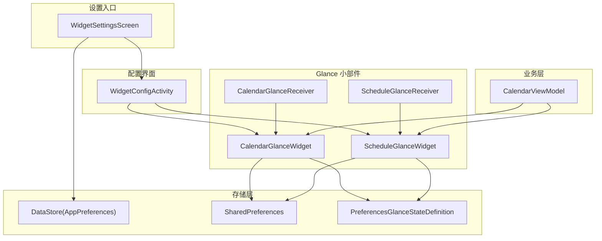
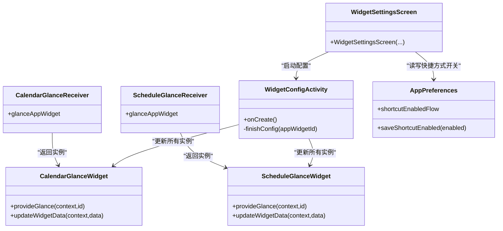
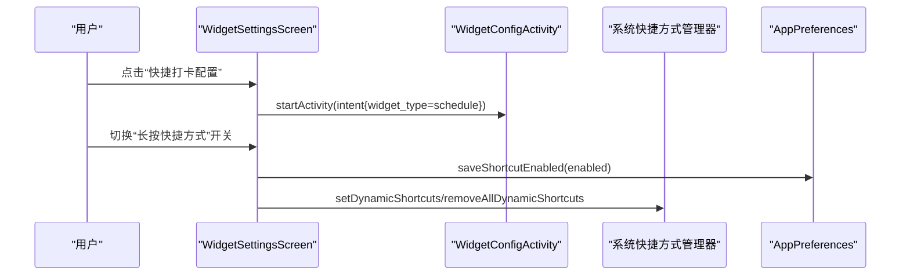
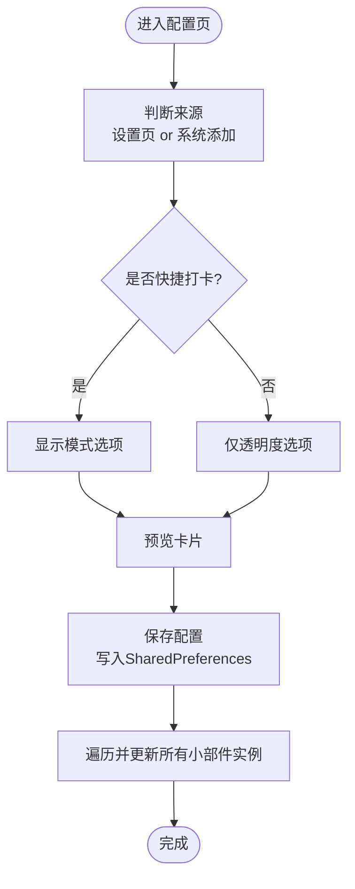
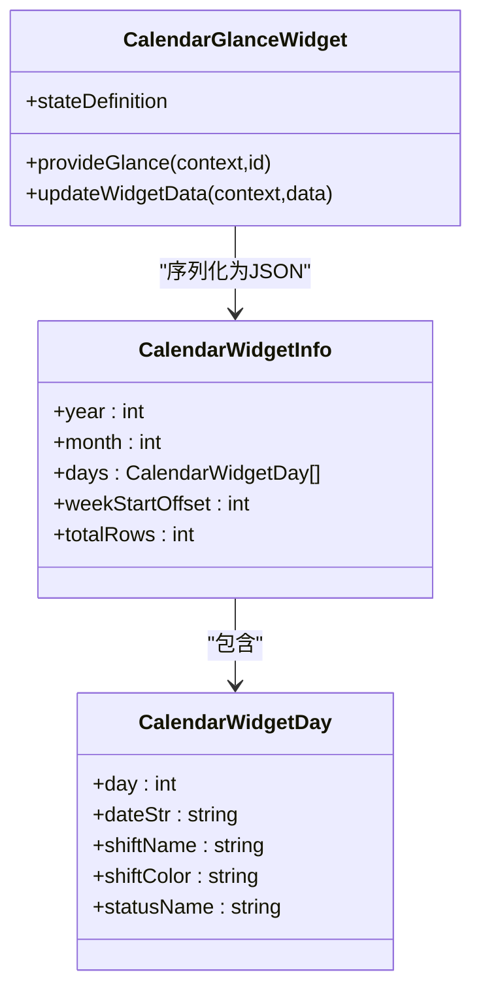
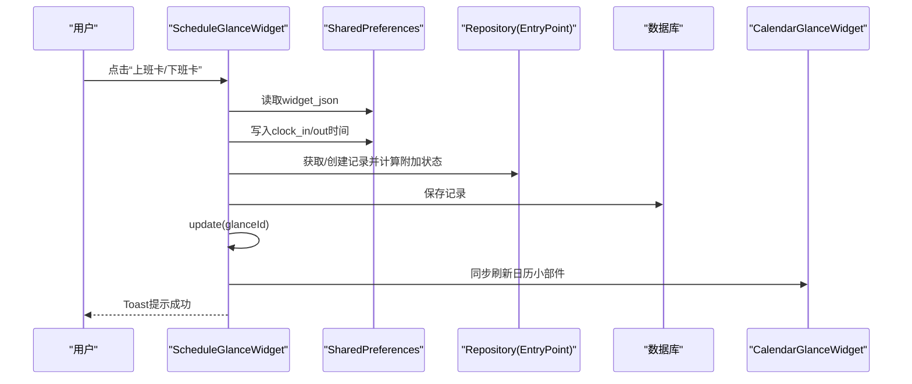
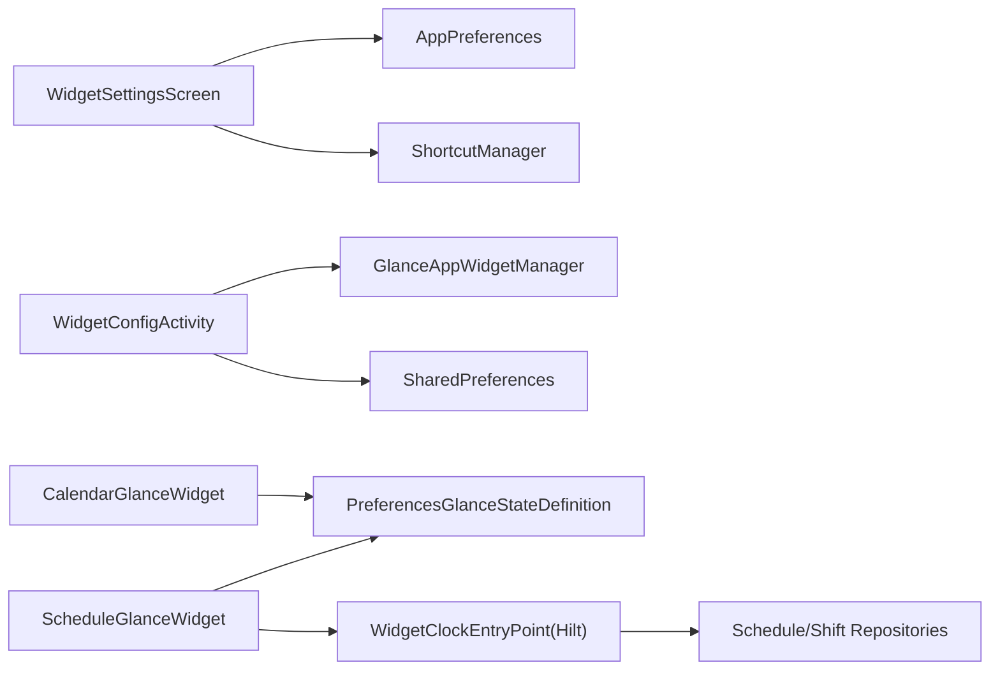

# 小部件设置

<cite>
**本文引用的文件**   
- [WidgetSettingsScreen.kt](file://app/src/main/java/com/schedulecalendar/app/ui/settings/WidgetSettingsScreen.kt)
- [WidgetConfigActivity.kt](file://app/src/main/java/com/schedulecalendar/app/widget/WidgetConfigActivity.kt)
- [CalendarGlanceWidget.kt](file://app/src/main/java/com/schedulecalendar/app/widget/CalendarGlanceWidget.kt)
- [ScheduleGlanceWidget.kt](file://app/src/main/java/com/schedulecalendar/app/widget/ScheduleGlanceWidget.kt)
- [CalendarGlanceReceiver.kt](file://app/src/main/java/com/schedulecalendar/app/widget/CalendarGlanceReceiver.kt)
- [ScheduleGlanceReceiver.kt](file://app/src/main/java/com/schedulecalendar/app/widget/ScheduleGlanceReceiver.kt)
- [AppPreferences.kt](file://app/src/main/java/com/schedulecalendar/app/data/prefs/AppPreferences.kt)
- [calendar_widget_info.xml](file://app/src/main/res/xml/calendar_widget_info.xml)
- [schedule_widget_info.xml](file://app/src/main/res/xml/schedule_widget_info.xml)
- [preview_calendar_widget.xml](file://app/src/main/res/drawable/preview_calendar_widget.xml)
- [preview_schedule_widget.xml](file://app/src/main/res/drawable/preview_schedule_widget.xml)
- [CalendarViewModel.kt](file://app/src/main/java/com/schedulecalendar/app/ui/calendar/CalendarViewModel.kt)
</cite>

## 目录
1. [简介](#简介)
2. [项目结构](#项目结构)
3. [核心组件](#核心组件)
4. [架构总览](#架构总览)
5. [详细组件分析](#详细组件分析)
6. [依赖关系分析](#依赖关系分析)
7. [性能与刷新策略](#性能与刷新策略)
8. [生命周期管理](#生命周期管理)
9. [预览与调试工具](#预览与调试工具)
10. [故障排查指南](#故障排查指南)
11. [结论](#结论)

## 简介
本模块聚焦桌面小组件（Glance）的设置、样式配置、状态管理与数据同步，覆盖日历网格小部件与快捷打卡小部件的完整实现。文档将详细说明：
- 显示样式设置（背景透明度、文字颜色、深色模式适配）
- 刷新频率控制与手动刷新机制
- Glance 状态定义与 DataStore 持久化
- 小部件与 CalendarGlanceWidget、ScheduleGlanceWidget 的交互关系
- 小部件生命周期与性能优化策略
- 预览与调试方法

## 项目结构
小部件相关代码主要分布在以下位置：
- UI 设置入口：settings 包下的 WidgetSettingsScreen
- 配置界面：widget 包下的 WidgetConfigActivity
- Glance 小部件实现：CalendarGlanceWidget、ScheduleGlanceWidget
- 接收器：CalendarGlanceReceiver、ScheduleGlanceReceiver
- 偏好存储：data/prefs/AppPreferences（应用级配置），以及 widget 内部 SharedPreferences/DataStore
- 资源声明：res/xml 中的 appwidget-provider，res/drawable 中的预览图

图表来源
- [WidgetSettingsScreen.kt:42-126](file://app/src/main/java/com/schedulecalendar/app/ui/settings/WidgetSettingsScreen.kt#L42-L126)
- [WidgetConfigActivity.kt:56-115](file://app/src/main/java/com/schedulecalendar/app/widget/WidgetConfigActivity.kt#L56-L115)
- [CalendarGlanceWidget.kt:54-73](file://app/src/main/java/com/schedulecalendar/app/widget/CalendarGlanceWidget.kt#L54-L73)
- [ScheduleGlanceWidget.kt:85-111](file://app/src/main/java/com/schedulecalendar/app/widget/ScheduleGlanceWidget.kt#L85-L111)
- [CalendarGlanceReceiver.kt:11-13](file://app/src/main/java/com/schedulecalendar/app/widget/CalendarGlanceReceiver.kt#L11-L13)
- [ScheduleGlanceReceiver.kt:11-13](file://app/src/main/java/com/schedulecalendar/app/widget/ScheduleGlanceReceiver.kt#L11-L13)
- [AppPreferences.kt:25-66](file://app/src/main/java/com/schedulecalendar/app/data/prefs/AppPreferences.kt#L25-L66)
- [CalendarViewModel.kt:1126-1147](file://app/src/main/java/com/schedulecalendar/app/ui/calendar/CalendarViewModel.kt#L1126-L1147)

章节来源
- [WidgetSettingsScreen.kt:42-126](file://app/src/main/java/com/schedulecalendar/app/ui/settings/WidgetSettingsScreen.kt#L42-L126)
- [WidgetConfigActivity.kt:56-115](file://app/src/main/java/com/schedulecalendar/app/widget/WidgetConfigActivity.kt#L56-L115)
- [calendar_widget_info.xml:1-19](file://app/src/main/res/xml/calendar_widget_info.xml#L1-L19)
- [schedule_widget_info.xml:1-17](file://app/src/main/res/xml/schedule_widget_info.xml#L1-L17)

## 核心组件
- WidgetSettingsScreen：提供“日历小组件配置”和“快捷打卡配置”入口，并支持长按快捷方式开关。
- WidgetConfigActivity：统一的样式配置页，支持背景透明度、显示模式选择与实时预览。
- CalendarGlanceWidget：3x3 日历网格小部件，使用 PreferencesGlanceStateDefinition 持久化数据。
- ScheduleGlanceWidget：2x1 快捷打卡小部件，支持上班/下班打卡动作回调与数据同步。
- CalendarGlanceReceiver / ScheduleGlanceReceiver：Glance 接收器，桥接系统与小部件实例。
- AppPreferences：应用级配置中心（包含快捷方式开关等）。

章节来源
- [WidgetSettingsScreen.kt:42-126](file://app/src/main/java/com/schedulecalendar/app/ui/settings/WidgetSettingsScreen.kt#L42-L126)
- [WidgetConfigActivity.kt:119-325](file://app/src/main/java/com/schedulecalendar/app/widget/WidgetConfigActivity.kt#L119-L325)
- [CalendarGlanceWidget.kt:54-73](file://app/src/main/java/com/schedulecalendar/app/widget/CalendarGlanceWidget.kt#L54-L73)
- [ScheduleGlanceWidget.kt:85-111](file://app/src/main/java/com/schedulecalendar/app/widget/ScheduleGlanceWidget.kt#L85-L111)
- [CalendarGlanceReceiver.kt:11-13](file://app/src/main/java/com/schedulecalendar/app/widget/CalendarGlanceReceiver.kt#L11-L13)
- [ScheduleGlanceReceiver.kt:11-13](file://app/src/main/java/com/schedulecalendar/app/widget/ScheduleGlanceReceiver.kt#L11-L13)
- [AppPreferences.kt:279-288](file://app/src/main/java/com/schedulecalendar/app/data/prefs/AppPreferences.kt#L279-L288)

## 架构总览
小部件采用 Compose-first 的 Glance 架构，通过 PreferencesGlanceStateDefinition 进行状态持久化；UI 由 Composable 渲染，ActionCallback 处理用户交互；配置通过 WidgetConfigActivity 统一维护。

图表来源
- [CalendarGlanceWidget.kt:54-73](file://app/src/main/java/com/schedulecalendar/app/widget/CalendarGlanceWidget.kt#L54-L73)
- [ScheduleGlanceWidget.kt:85-111](file://app/src/main/java/com/schedulecalendar/app/widget/ScheduleGlanceWidget.kt#L85-L111)
- [CalendarGlanceReceiver.kt:11-13](file://app/src/main/java/com/schedulecalendar/app/widget/CalendarGlanceReceiver.kt#L11-L13)
- [ScheduleGlanceReceiver.kt:11-13](file://app/src/main/java/com/schedulecalendar/app/widget/ScheduleGlanceReceiver.kt#L11-L13)
- [WidgetConfigActivity.kt:56-115](file://app/src/main/java/com/schedulecalendar/app/widget/WidgetConfigActivity.kt#L56-L115)
- [WidgetSettingsScreen.kt:42-126](file://app/src/main/java/com/schedulecalendar/app/ui/settings/WidgetSettingsScreen.kt#L42-L126)
- [AppPreferences.kt:279-288](file://app/src/main/java/com/schedulecalendar/app/data/prefs/AppPreferences.kt#L279-L288)

## 详细组件分析

### 小部件设置入口（WidgetSettingsScreen）
- 功能要点
  - 提供“日历小组件配置”和“快捷打卡配置”两个入口，分别传递 widget_type 到配置页。
  - 支持“长按快捷方式”开关，启用后动态生成“上班卡/下班卡”快捷方式，关闭则移除。
- 关键流程
  - 点击卡片 → 启动 WidgetConfigActivity 并传入类型参数。
  - 切换开关 → 调用 AppPreferences 保存并更新系统动态快捷方式。

图表来源
- [WidgetSettingsScreen.kt:60-84](file://app/src/main/java/com/schedulecalendar/app/ui/settings/WidgetSettingsScreen.kt#L60-L84)
- [WidgetSettingsScreen.kt:200-237](file://app/src/main/java/com/schedulecalendar/app/ui/settings/WidgetSettingsScreen.kt#L200-L237)
- [AppPreferences.kt:279-288](file://app/src/main/java/com/schedulecalendar/app/data/prefs/AppPreferences.kt#L279-L288)

章节来源
- [WidgetSettingsScreen.kt:42-126](file://app/src/main/java/com/schedulecalendar/app/ui/settings/WidgetSettingsScreen.kt#L42-L126)
- [WidgetSettingsScreen.kt:184-237](file://app/src/main/java/com/schedulecalendar/app/ui/settings/WidgetSettingsScreen.kt#L184-L237)

### 样式配置页（WidgetConfigActivity）
- 功能要点
  - 统一配置两种小部件的背景透明度、显示模式（仅快捷打卡）、默认颜色（固定为默认值）。
  - 提供实时预览卡片，保存时同步更新所有已添加的小部件实例。
- 关键流程
  - onCreate 判断来源（设置页或系统添加）→ 确定 isScheduleWidget。
  - 保存配置 → 遍历所有 Glance 实例执行 update，确保样式生效。

图表来源
- [WidgetConfigActivity.kt:56-115](file://app/src/main/java/com/schedulecalendar/app/widget/WidgetConfigActivity.kt#L56-L115)
- [WidgetConfigActivity.kt:119-325](file://app/src/main/java/com/schedulecalendar/app/widget/WidgetConfigActivity.kt#L119-L325)

章节来源
- [WidgetConfigActivity.kt:56-115](file://app/src/main/java/com/schedulecalendar/app/widget/WidgetConfigActivity.kt#L56-L115)
- [WidgetConfigActivity.kt:119-325](file://app/src/main/java/com/schedulecalendar/app/widget/WidgetConfigActivity.kt#L119-L325)

### 日历网格小部件（CalendarGlanceWidget）
- 数据模型
  - CalendarWidgetInfo：年、月、日期列表、周起始偏移、总行数。
  - CalendarWidgetDay：日、日期字符串、班次名、班次色、附加状态名。
- 状态管理
  - 使用 PreferencesGlanceStateDefinition 将 JSON 序列化数据持久化到 DataStore。
  - 提供 updateWidgetData(context, data) 批量更新所有实例。
- UI 与主题
  - 读取配置的颜色与透明度，自动适配深色模式。
  - 根据尺寸决定字体大小与农历显示条件。
- 交互
  - 单元格点击跳转主页面指定日期。
  - 右上角刷新按钮触发重渲染。

图表来源
- [CalendarGlanceWidget.kt:41-73](file://app/src/main/java/com/schedulecalendar/app/widget/CalendarGlanceWidget.kt#L41-L73)

章节来源
- [CalendarGlanceWidget.kt:54-73](file://app/src/main/java/com/schedulecalendar/app/widget/CalendarGlanceWidget.kt#L54-L73)
- [CalendarGlanceWidget.kt:99-207](file://app/src/main/java/com/schedulecalendar/app/widget/CalendarGlanceWidget.kt#L99-L207)
- [CalendarGlanceWidget.kt:209-295](file://app/src/main/java/com/schedulecalendar/app/widget/CalendarGlanceWidget.kt#L209-L295)

### 快捷打卡小部件（ScheduleGlanceWidget）
- 数据模型
  - ClockInWidgetData：班次信息、上下班时间、明日班次、打卡规则字段（showClockIn/showClockOut/hasClockIn/hasClockOut 等）。
- 状态管理
  - 同时写入 SharedPreferences（供 ActionCallback 读取）与 PreferencesGlanceStateDefinition（供 UI 渲染）。
  - 提供 updateWidgetData(context, data) 批量更新所有实例。
- 交互与业务逻辑
  - WidgetClockInAction / WidgetClockOutAction：根据规则写入实际打卡时间或附加状态，并持久化到数据库。
  - refreshWidgets：打卡成功后同时刷新打卡与日历两个小部件。
- 主题与显示模式
  - 解析班次颜色，深色模式适配。
  - 显示模式：当天班次+明天班次 / 当天班次+法定节假日倒计时。

图表来源
- [ScheduleGlanceWidget.kt:94-111](file://app/src/main/java/com/schedulecalendar/app/widget/ScheduleGlanceWidget.kt#L94-L111)
- [ScheduleGlanceWidget.kt:115-194](file://app/src/main/java/com/schedulecalendar/app/widget/ScheduleGlanceWidget.kt#L115-L194)
- [ScheduleGlanceWidget.kt:218-299](file://app/src/main/java/com/schedulecalendar/app/widget/ScheduleGlanceWidget.kt#L218-L299)
- [ScheduleGlanceWidget.kt:318-325](file://app/src/main/java/com/schedulecalendar/app/widget/ScheduleGlanceWidget.kt#L318-L325)

章节来源
- [ScheduleGlanceWidget.kt:85-111](file://app/src/main/java/com/schedulecalendar/app/widget/ScheduleGlanceWidget.kt#L85-L111)
- [ScheduleGlanceWidget.kt:115-194](file://app/src/main/java/com/schedulecalendar/app/widget/ScheduleGlanceWidget.kt#L115-L194)
- [ScheduleGlanceWidget.kt:218-299](file://app/src/main/java/com/schedulecalendar/app/widget/ScheduleGlanceWidget.kt#L218-L299)
- [ScheduleGlanceWidget.kt:318-325](file://app/src/main/java/com/schedulecalendar/app/widget/ScheduleGlanceWidget.kt#L318-L325)

### 接收器（CalendarGlanceReceiver / ScheduleGlanceReceiver）
- 职责：作为 Glance 的 BroadcastReceiver，返回对应的 GlanceAppWidget 实例，交由系统调度渲染与更新。

章节来源
- [CalendarGlanceReceiver.kt:11-13](file://app/src/main/java/com/schedulecalendar/app/widget/CalendarGlanceReceiver.kt#L11-L13)
- [ScheduleGlanceReceiver.kt:11-13](file://app/src/main/java/com/schedulecalendar/app/widget/ScheduleGlanceReceiver.kt#L11-L13)

### 应用偏好（AppPreferences）
- 作用：集中管理应用级配置，包括“长按快捷方式开关”等。
- 使用：WidgetSettingsViewModel 通过 Flow 订阅并更新 UI。

章节来源
- [AppPreferences.kt:279-288](file://app/src/main/java/com/schedulecalendar/app/data/prefs/AppPreferences.kt#L279-L288)

## 依赖关系分析
- 组件耦合
  - WidgetSettingsScreen 依赖 AppPreferences 与系统快捷方式服务。
  - WidgetConfigActivity 依赖 GlanceAppWidgetManager 与 SharedPreferences。
  - CalendarGlanceWidget / ScheduleGlanceWidget 依赖 PreferencesGlanceStateDefinition 与 Gson。
  - ScheduleGlanceWidget 通过 Hilt EntryPoint 访问 Repository，避免在 ActionCallback 中直接注入。
- 外部依赖
  - Android 系统服务：AppWidgetManager、ShortcutManager。
  - Jetpack：Glance、DataStore、Hilt。
  - 第三方库：Gson（序列化）。

图表来源
- [WidgetSettingsScreen.kt:200-237](file://app/src/main/java/com/schedulecalendar/app/ui/settings/WidgetSettingsScreen.kt#L200-L237)
- [WidgetConfigActivity.kt:92-115](file://app/src/main/java/com/schedulecalendar/app/widget/WidgetConfigActivity.kt#L92-L115)
- [CalendarGlanceWidget.kt:54-73](file://app/src/main/java/com/schedulecalendar/app/widget/CalendarGlanceWidget.kt#L54-L73)
- [ScheduleGlanceWidget.kt:85-111](file://app/src/main/java/com/schedulecalendar/app/widget/ScheduleGlanceWidget.kt#L85-L111)
- [ScheduleGlanceWidget.kt:626-632](file://app/src/main/java/com/schedulecalendar/app/widget/ScheduleGlanceWidget.kt#L626-L632)

章节来源
- [WidgetSettingsScreen.kt:200-237](file://app/src/main/java/com/schedulecalendar/app/ui/settings/WidgetSettingsScreen.kt#L200-L237)
- [WidgetConfigActivity.kt:92-115](file://app/src/main/java/com/schedulecalendar/app/widget/WidgetConfigActivity.kt#L92-L115)
- [CalendarGlanceWidget.kt:54-73](file://app/src/main/java/com/schedulecalendar/app/widget/CalendarGlanceWidget.kt#L54-L73)
- [ScheduleGlanceWidget.kt:85-111](file://app/src/main/java/com/schedulecalendar/app/widget/ScheduleGlanceWidget.kt#L85-L111)
- [ScheduleGlanceWidget.kt:626-632](file://app/src/main/java/com/schedulecalendar/app/widget/ScheduleGlanceWidget.kt#L626-L632)

## 性能与刷新策略
- 刷新频率
  - XML 中 updatePeriodMillis=1800000（约30分钟），用于系统周期性刷新。
  - 手动刷新：日历小部件提供刷新按钮；打卡动作完成后主动刷新两个小部件。
- 渲染优化
  - 基于 PreferencesGlanceStateDefinition 的状态缓存，减少重复 IO。
  - 根据尺寸自适应字体与布局，避免过度绘制。
  - 深色模式颜色选择与透明度控制，提升可读性与视觉一致性。
- 数据同步
  - 打卡动作先写 SharedPreferences（即时反馈），再写数据库（持久化），最后触发 update。
  - 配置页保存后遍历所有实例更新，保证样式一致。

章节来源
- [calendar_widget_info.xml:13](file://app/src/main/res/xml/calendar_widget_info.xml#L13)
- [schedule_widget_info.xml:11](file://app/src/main/res/xml/schedule_widget_info.xml#L11)
- [CalendarGlanceWidget.kt:87-97](file://app/src/main/java/com/schedulecalendar/app/widget/CalendarGlanceWidget.kt#L87-L97)
- [ScheduleGlanceWidget.kt:318-325](file://app/src/main/java/com/schedulecalendar/app/widget/ScheduleGlanceWidget.kt#L318-L325)
- [WidgetConfigActivity.kt:92-115](file://app/src/main/java/com/schedulecalendar/app/widget/WidgetConfigActivity.kt#L92-L115)

## 生命周期管理
- 系统层面
  - GlanceAppWidgetReceiver 负责生命周期回调，委托给 GlanceAppWidget 的 provideGlance。
  - appwidget-provider 声明尺寸、可调整大小、可重新配置、更新周期等。
- 应用层面
  - 配置页 finishConfig 中使用 runBlocking 确保异步 IO 完成后再结束 Activity，防止被系统回收导致数据丢失。
  - 小部件 update 调用会触发新的渲染周期，读取最新状态并重建 UI。

章节来源
- [CalendarGlanceReceiver.kt:11-13](file://app/src/main/java/com/schedulecalendar/app/widget/CalendarGlanceReceiver.kt#L11-L13)
- [ScheduleGlanceReceiver.kt:11-13](file://app/src/main/java/com/schedulecalendar/app/widget/ScheduleGlanceReceiver.kt#L11-L13)
- [calendar_widget_info.xml:1-19](file://app/src/main/res/xml/calendar_widget_info.xml#L1-L19)
- [schedule_widget_info.xml:1-17](file://app/src/main/res/xml/schedule_widget_info.xml#L1-L17)
- [WidgetConfigActivity.kt:92-115](file://app/src/main/java/com/schedulecalendar/app/widget/WidgetConfigActivity.kt#L92-L115)

## 预览与调试工具
- 预览图
  - res/drawable 下提供 calendar/schedule 预览图，用于系统添加小部件时的缩略展示。
- 配置页预览
  - WidgetConfigActivity 内置实时预览卡片，支持透明度滑块与显示模式切换。
- 调试建议
  - 使用系统“开发者选项”查看小部件渲染与更新日志。
  - 在 ActionCallback 中增加日志输出（如 Toast）验证数据流。
  - 检查 SharedPreferences/DataStore 键值是否正确写入。

章节来源
- [preview_calendar_widget.xml:1-64](file://app/src/main/res/drawable/preview_calendar_widget.xml#L1-L64)
- [preview_schedule_widget.xml:1-31](file://app/src/main/res/drawable/preview_schedule_widget.xml#L1-L31)
- [WidgetConfigActivity.kt:119-325](file://app/src/main/java/com/schedulecalendar/app/widget/WidgetConfigActivity.kt#L119-L325)

## 故障排查指南
- 常见问题
  - 小部件不刷新：检查 updatePeriodMillis 与手动刷新调用；确认 updateAppWidgetState 是否成功。
  - 样式未生效：确认 SharedPreferences 键值写入正确；WidgetConfigActivity 保存后是否遍历更新所有实例。
  - 打卡无效：检查 ActionCallback 中 SharedPreferences 与数据库写入顺序；确认 Hilt EntryPoint 可用。
- 定位方法
  - 打印 Glance 状态键值（KEY_CALENDAR_WIDGET / KEY_CLOCK_IN_WIDGET）。
  - 检查 AppPreferences 中快捷方式开关是否影响系统快捷方式。
  - 校验 XML 中 provider 配置（尺寸、可配置、预览图等）。

章节来源
- [CalendarGlanceWidget.kt:60-73](file://app/src/main/java/com/schedulecalendar/app/widget/CalendarGlanceWidget.kt#L60-L73)
- [ScheduleGlanceWidget.kt:94-111](file://app/src/main/java/com/schedulecalendar/app/widget/ScheduleGlanceWidget.kt#L94-L111)
- [WidgetConfigActivity.kt:92-115](file://app/src/main/java/com/schedulecalendar/app/widget/WidgetConfigActivity.kt#L92-L115)
- [AppPreferences.kt:279-288](file://app/src/main/java/com/schedulecalendar/app/data/prefs/AppPreferences.kt#L279-L288)

## 结论
本模块以 Glance 为核心，结合 PreferencesGlanceStateDefinition 与 SharedPreferences，实现了日历网格与快捷打卡两类小部件的配置、样式与数据同步。通过统一的配置页与接收器机制，保证了用户体验的一致性与可维护性。建议在后续迭代中继续优化刷新策略与渲染性能，并完善调试与监控能力。