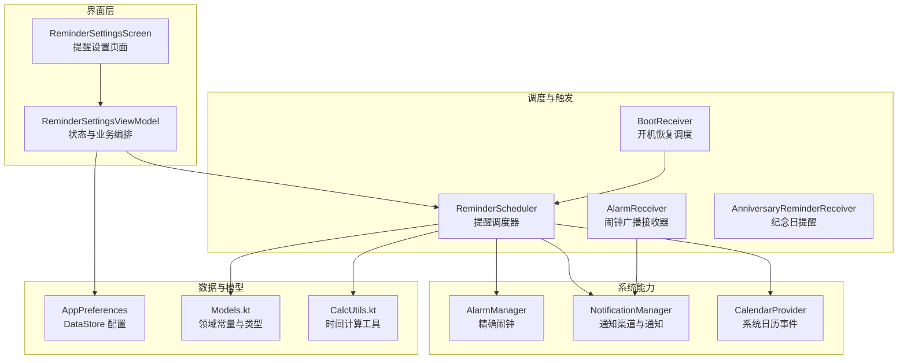
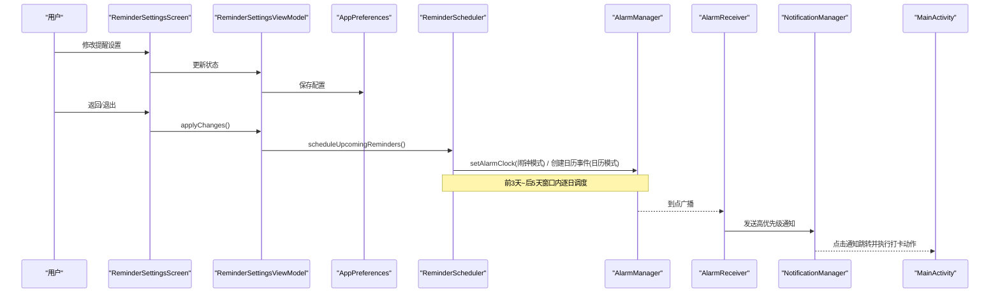
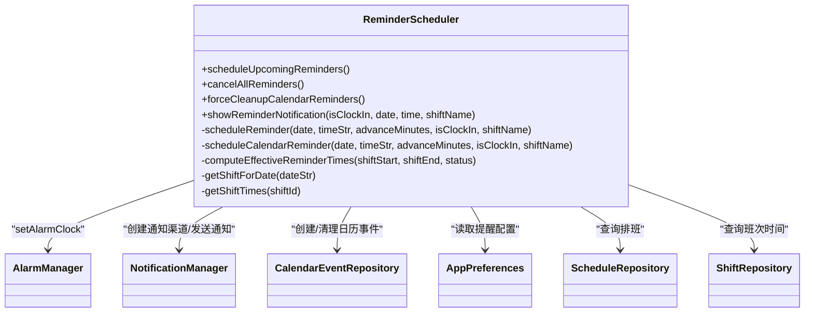
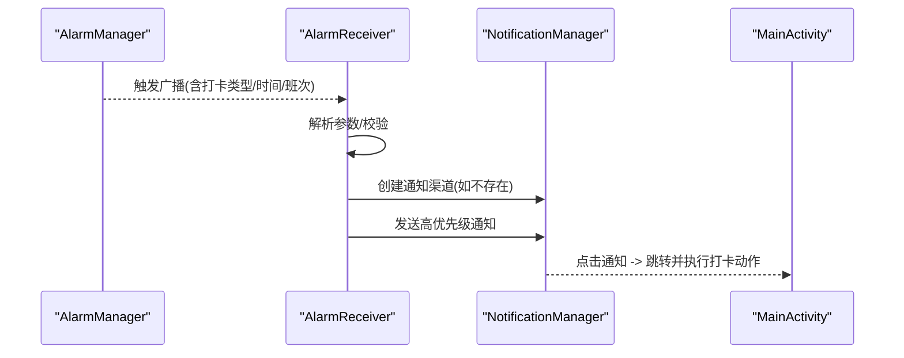
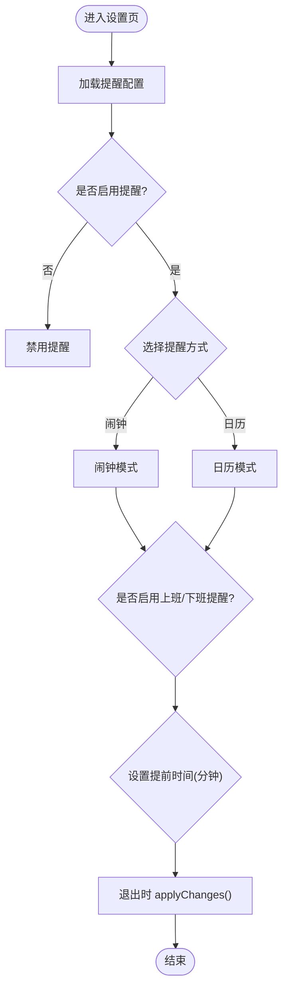
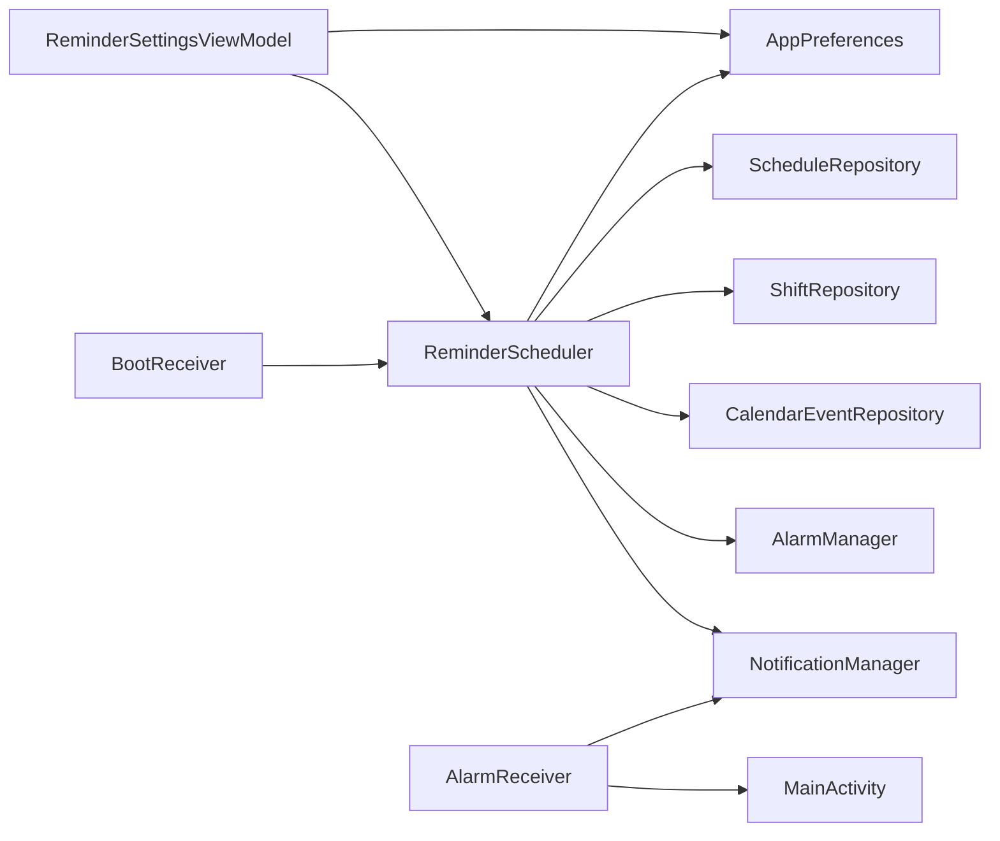

# 提醒设置

<cite>
**本文引用的文件**   
- [ReminderScheduler.kt](file://app/src/main/java/com/schedulecalendar/app/reminder/ReminderScheduler.kt)
- [AlarmReceiver.kt](file://app/src/main/java/com/schedulecalendar/app/reminder/AlarmReceiver.kt)
- [AnniversaryReminderReceiver.kt](file://app/src/main/java/com/schedulecalendar/app/reminder/AnniversaryReminderReceiver.kt)
- [BootReceiver.kt](file://app/src/main/java/com/schedulecalendar/app/reminder/BootReceiver.kt)
- [ReminderSettingsScreen.kt](file://app/src/main/java/com/schedulecalendar/app/ui/settings/ReminderSettingsScreen.kt)
- [ReminderSettingsViewModel.kt](file://app/src/main/java/com/schedulecalendar/app/ui/settings/ReminderSettingsViewModel.kt)
- [AppPreferences.kt](file://app/src/main/java/com/schedulecalendar/app/data/prefs/AppPreferences.kt)
- [CalcUtils.kt](file://app/src/main/java/com/schedulecalendar/app/domain/model/CalcUtils.kt)
- [Models.kt](file://app/src/main/java/com/schedulecalendar/app/domain/model/Models.kt)
- [MainActivity.kt](file://app/src/main/java/com/schedulecalendar/app/MainActivity.kt)
</cite>

## 目录
1. [简介](#简介)
2. [项目结构](#项目结构)
3. [核心组件](#核心组件)
4. [架构总览](#架构总览)
5. [详细组件分析](#详细组件分析)
6. [依赖关系分析](#依赖关系分析)
7. [性能与可靠性](#性能与可靠性)
8. [故障排查指南](#故障排查指南)
9. [结论](#结论)
10. [附录：配置项与交互清单](#附录配置项与交互清单)

## 简介
本模块提供“上下班提醒”的完整能力，包括：
- 提醒开关、提醒方式（闹钟或日历事件）、提前时间设置
- 重复规则（基于未来若干天的排班记录自动调度）
- 精确闹钟机制与系统日历事件提醒
- 开机自启动恢复调度
- 通知展示与点击跳转打卡动作
- 内置请假/调休对提醒时间的修正策略

## 项目结构
提醒设置相关代码分布在以下包中：
- reminder：调度器、接收器、开机恢复
- ui.settings：提醒设置页面与状态管理
- data.prefs：持久化存储（DataStore）
- domain.model：计算工具与领域模型

**图表来源** 
- [ReminderSettingsScreen.kt:1-468](file://app/src/main/java/com/schedulecalendar/app/ui/settings/ReminderSettingsScreen.kt#L1-L468)
- [ReminderSettingsViewModel.kt:1-177](file://app/src/main/java/com/schedulecalendar/app/ui/settings/ReminderSettingsViewModel.kt#L1-L177)
- [ReminderScheduler.kt:1-497](file://app/src/main/java/com/schedulecalendar/app/reminder/ReminderScheduler.kt#L1-L497)
- [AlarmReceiver.kt:1-78](file://app/src/main/java/com/schedulecalendar/app/reminder/AlarmReceiver.kt#L1-L78)
- [BootReceiver.kt:1-46](file://app/src/main/java/com/schedulecalendar/app/reminder/BootReceiver.kt#L1-L46)
- [AnniversaryReminderReceiver.kt:1-57](file://app/src/main/java/com/schedulecalendar/app/reminder/AnniversaryReminderReceiver.kt#L1-L57)
- [AppPreferences.kt:1-313](file://app/src/main/java/com/schedulecalendar/app/data/prefs/AppPreferences.kt#L1-L313)
- [CalcUtils.kt:1-557](file://app/src/main/java/com/schedulecalendar/app/domain/model/CalcUtils.kt#L1-L557)
- [Models.kt:1-200](file://app/src/main/java/com/schedulecalendar/app/domain/model/Models.kt#L1-L200)

**章节来源**
- [ReminderSettingsScreen.kt:1-468](file://app/src/main/java/com/schedulecalendar/app/ui/settings/ReminderSettingsScreen.kt#L1-L468)
- [ReminderSettingsViewModel.kt:1-177](file://app/src/main/java/com/schedulecalendar/app/ui/settings/ReminderSettingsViewModel.kt#L1-L177)
- [ReminderScheduler.kt:1-497](file://app/src/main/java/com/schedulecalendar/app/reminder/ReminderScheduler.kt#L1-L497)
- [AppPreferences.kt:1-313](file://app/src/main/java/com/schedulecalendar/app/data/prefs/AppPreferences.kt#L1-L313)

## 核心组件
- ReminderScheduler：统一调度提醒的核心类，负责读取配置、查询排班、计算触发时间、注册闹钟或创建日历事件、清理旧事件、显示通知。
- AlarmReceiver：接收闹钟广播并弹出高优先级通知，点击后跳转到 MainActivity 执行对应打卡动作。
- BootReceiver：设备重启后重新调度未来若干天的提醒。
- AnniversaryReminderReceiver：纪念日提醒的独立接收器（与上下班提醒并行）。
- ReminderSettingsScreen + ReminderSettingsViewModel：提醒设置的 UI 与状态管理，支持开启/关闭、切换方式、选择提前时间、权限处理与退出时应用变更。
- AppPreferences：使用 DataStore 持久化提醒相关配置。
- CalcUtils：时间转换、跨天归一化等工具方法。
- Models：内置班次/状态常量、领域数据结构。

**章节来源**
- [ReminderScheduler.kt:1-497](file://app/src/main/java/com/schedulecalendar/app/reminder/ReminderScheduler.kt#L1-L497)
- [AlarmReceiver.kt:1-78](file://app/src/main/java/com/schedulecalendar/app/reminder/AlarmReceiver.kt#L1-L78)
- [BootReceiver.kt:1-46](file://app/src/main/java/com/schedulecalendar/app/reminder/BootReceiver.kt#L1-L46)
- [AnniversaryReminderReceiver.kt:1-57](file://app/src/main/java/com/schedulecalendar/app/reminder/AnniversaryReminderReceiver.kt#L1-L57)
- [ReminderSettingsScreen.kt:1-468](file://app/src/main/java/com/schedulecalendar/app/ui/settings/ReminderSettingsScreen.kt#L1-L468)
- [ReminderSettingsViewModel.kt:1-177](file://app/src/main/java/com/schedulecalendar/app/ui/settings/ReminderSettingsViewModel.kt#L1-L177)
- [AppPreferences.kt:1-313](file://app/src/main/java/com/schedulecalendar/app/data/prefs/AppPreferences.kt#L1-L313)
- [CalcUtils.kt:1-557](file://app/src/main/java/com/schedulecalendar/app/domain/model/CalcUtils.kt#L1-L557)
- [Models.kt:1-200](file://app/src/main/java/com/schedulecalendar/app/domain/model/Models.kt#L1-L200)

## 架构总览
提醒设置的整体流程如下：
- 用户在设置页调整提醒开关、方式、提前时间等，VM 写入 AppPreferences。
- 退出设置页时，VM 调用 ReminderScheduler.scheduleUpcomingReminders() 根据当前配置重新调度。
- ReminderScheduler 读取配置与排班数据，按“前3天~后5天”窗口遍历日期，计算有效提醒时间（考虑跨午夜、内置请假/调休），然后：
  - 闹钟模式：通过 AlarmManager.setAlarmClock 注册精确闹钟；到点由 AlarmReceiver 弹出通知。
  - 日历模式：在系统日历创建带提醒的事件，由系统日历应用触发通知；同时清理旧事件避免污染。
- 设备重启后，BootReceiver 重新调用 scheduleUpcomingReminders() 恢复调度。

**图表来源** 
- [ReminderSettingsScreen.kt:1-468](file://app/src/main/java/com/schedulecalendar/app/ui/settings/ReminderSettingsScreen.kt#L1-L468)
- [ReminderSettingsViewModel.kt:1-177](file://app/src/main/java/com/schedulecalendar/app/ui/settings/ReminderSettingsViewModel.kt#L1-L177)
- [ReminderScheduler.kt:1-497](file://app/src/main/java/com/schedulecalendar/app/reminder/ReminderScheduler.kt#L1-L497)
- [AlarmReceiver.kt:1-78](file://app/src/main/java/com/schedulecalendar/app/reminder/AlarmReceiver.kt#L1-L78)
- [MainActivity.kt:1-200](file://app/src/main/java/com/schedulecalendar/app/MainActivity.kt#L1-L200)

## 详细组件分析

### ReminderScheduler（提醒调度器）
职责与要点：
- 读取提醒开关、方式、内容（上班/下班）、提前分钟数。
- 遍历“前3天~后5天”窗口，获取每日排班记录与班次时间。
- 计算有效提醒时间：
  - 若存在内置请假/调休且包含时间段，则从原始班次时间中排除该段，取最长有效工作段作为提醒时间。
  - 跨午夜班次：下班提醒日期顺延至次日。
- 闹钟模式：使用 AlarmManager.setAlarmClock 注册精确闹钟，保证 Doze/省电模式下仍可准时触发。
- 日历模式：创建系统日历事件（标题带前缀用于去重与清理），设置提醒分钟数；清理窗口外旧事件。
- 通知：AlarmReceiver 收到广播后构建高优先级通知，点击打开 MainActivity 并执行打卡动作。
- 清理：提供 cancelAllReminders() 与 forceCleanupCalendarReminders() 用于关闭或切换模式时的清理。

关键实现路径参考：
- 调度入口与两种模式分支：[scheduleUpcomingReminders:101-203](file://app/src/main/java/com/schedulecalendar/app/reminder/ReminderScheduler.kt#L101-L203)
- 有效时间计算（含请假/调休与跨午夜）：[computeEffectiveReminderTimes:244-287](file://app/src/main/java/com/schedulecalendar/app/reminder/ReminderScheduler.kt#L244-L287)
- 闹钟注册与权限检查：[scheduleReminder:301-353](file://app/src/main/java/com/schedulecalendar/app/reminder/ReminderScheduler.kt#L301-L353)
- 日历事件创建与去重：[scheduleCalendarReminder:385-430](file://app/src/main/java/com/schedulecalendar/app/reminder/ReminderScheduler.kt#L385-L430)
- 清理接口：[cancelAllReminders:358-372](file://app/src/main/java/com/schedulecalendar/app/reminder/ReminderScheduler.kt#L358-L372)、[forceCleanupCalendarReminders:447-456](file://app/src/main/java/com/schedulecalendar/app/reminder/ReminderScheduler.kt#L447-L456)
- 通知展示：[showReminderNotification:461-495](file://app/src/main/java/com/schedulecalendar/app/reminder/ReminderScheduler.kt#L461-L495)

**图表来源** 
- [ReminderScheduler.kt:1-497](file://app/src/main/java/com/schedulecalendar/app/reminder/ReminderScheduler.kt#L1-L497)

**章节来源**
- [ReminderScheduler.kt:1-497](file://app/src/main/java/com/schedulecalendar/app/reminder/ReminderScheduler.kt#L1-L497)

### AlarmReceiver（闹钟接收器）
职责与要点：
- 解析广播中的打卡类型、日期、时间、班次名称。
- 确保通知渠道存在，构建高优先级通知。
- 点击通知后跳转到 MainActivity，并携带 ACTION_CLOCK_IN/ACTION_CLOCK_OUT 以触发相应打卡逻辑。

关键实现路径参考：
- 广播处理与通知构建：[onReceive:19-62](file://app/src/main/java/com/schedulecalendar/app/reminder/AlarmReceiver.kt#L19-L62)
- 通知渠道保障：[createNotificationChannelIfNeeded:64-76](file://app/src/main/java/com/schedulecalendar/app/reminder/AlarmReceiver.kt#L64-L76)

**图表来源** 
- [AlarmReceiver.kt:1-78](file://app/src/main/java/com/schedulecalendar/app/reminder/AlarmReceiver.kt#L1-L78)
- [MainActivity.kt:1-200](file://app/src/main/java/com/schedulecalendar/app/MainActivity.kt#L1-L200)

**章节来源**
- [AlarmReceiver.kt:1-78](file://app/src/main/java/com/schedulecalendar/app/reminder/AlarmReceiver.kt#L1-L78)

### BootReceiver（开机恢复）
职责与要点：
- 监听开机完成广播，通过 Hilt EntryPoint 获取 ReminderScheduler 单例。
- 在 IO 线程调用 scheduleUpcomingReminders() 恢复未来若干天的提醒。

关键实现路径参考：
- 开机回调与调度恢复：[onReceive:31-44](file://app/src/main/java/com/schedulecalendar/app/reminder/BootReceiver.kt#L31-L44)

**章节来源**
- [BootReceiver.kt:1-46](file://app/src/main/java/com/schedulecalendar/app/reminder/BootReceiver.kt#L1-L46)

### ReminderSettingsScreen 与 ReminderSettingsViewModel（设置页与状态）
职责与要点：
- UI 提供总开关、提醒方式（闹钟/日历）、内容（上班/下班）、提前时间（预设与自定义滚轮）。
- ViewModel 负责加载/保存配置、权限检查（日历读写）、退出时统一应用变更（取消/重建提醒）。
- 提前时间选项：15/30/60分钟与自定义（小时+分钟滚轮）。

关键实现路径参考：
- 设置页 UI 与交互：[ReminderSettingsScreen:1-468](file://app/src/main/java/com/schedulecalendar/app/ui/settings/ReminderSettingsScreen.kt#L1-L468)
- 状态与操作：[ReminderSettingsViewModel:1-177](file://app/src/main/java/com/schedulecalendar/app/ui/settings/ReminderSettingsViewModel.kt#L1-L177)

**图表来源** 
- [ReminderSettingsScreen.kt:1-468](file://app/src/main/java/com/schedulecalendar/app/ui/settings/ReminderSettingsScreen.kt#L1-L468)
- [ReminderSettingsViewModel.kt:1-177](file://app/src/main/java/com/schedulecalendar/app/ui/settings/ReminderSettingsViewModel.kt#L1-L177)

**章节来源**
- [ReminderSettingsScreen.kt:1-468](file://app/src/main/java/com/schedulecalendar/app/ui/settings/ReminderSettingsScreen.kt#L1-L468)
- [ReminderSettingsViewModel.kt:1-177](file://app/src/main/java/com/schedulecalendar/app/ui/settings/ReminderSettingsViewModel.kt#L1-L177)

### AppPreferences（配置持久化）
职责与要点：
- 使用 DataStore 存储提醒开关、方式、内容、提前分钟数等键值。
- 提供 Flow 与快照组合，便于响应式观察。

关键实现路径参考：
- 提醒相关键与读写：[KEY_REMINDER_*:52-58](file://app/src/main/java/com/schedulecalendar/app/data/prefs/AppPreferences.kt#L52-L58)、[get/save 方法:202-248](file://app/src/main/java/com/schedulecalendar/app/data/prefs/AppPreferences.kt#L202-L248)

**章节来源**
- [AppPreferences.kt:1-313](file://app/src/main/java/com/schedulecalendar/app/data/prefs/AppPreferences.kt#L1-L313)

### CalcUtils 与 Models（计算与领域模型）
职责与要点：
- CalcUtils 提供时间转分钟、分钟转时间、跨天归一化等工具方法，被提醒调度用于计算有效时间与跨午夜判断。
- Models 定义内置请假/调休常量、排班记录、附加状态等数据结构，供调度器判断是否需要跳过或调整提醒。

关键实现路径参考：
- 时间工具与归一化：[timeToMin/minutesToTime/normRange:21-34](file://app/src/main/java/com/schedulecalendar/app/domain/model/CalcUtils.kt#L21-L34)
- 内置常量与模型：[BUILTIN_STATUS_LEAVE/SWAP、ScheduleRecord、AppliedStatus:1-100](file://app/src/main/java/com/schedulecalendar/app/domain/model/Models.kt#L1-L100)

**章节来源**
- [CalcUtils.kt:1-557](file://app/src/main/java/com/schedulecalendar/app/domain/model/CalcUtils.kt#L1-L557)
- [Models.kt:1-200](file://app/src/main/java/com/schedulecalendar/app/domain/model/Models.kt#L1-L200)

## 依赖关系分析
- 界面层（ReminderSettingsScreen/ViewModel）依赖 AppPreferences 与 ReminderScheduler。
- ReminderScheduler 依赖 AppPreferences、ScheduleRepository、ShiftRepository、CalendarEventRepository、AlarmManager、NotificationManager。
- AlarmReceiver 依赖 NotificationManager 与 MainActivity 的动作常量。
- BootReceiver 通过 Hilt EntryPoint 获取 ReminderScheduler。

**图表来源** 
- [ReminderSettingsViewModel.kt:1-177](file://app/src/main/java/com/schedulecalendar/app/ui/settings/ReminderSettingsViewModel.kt#L1-L177)
- [ReminderScheduler.kt:1-497](file://app/src/main/java/com/schedulecalendar/app/reminder/ReminderScheduler.kt#L1-L497)
- [AlarmReceiver.kt:1-78](file://app/src/main/java/com/schedulecalendar/app/reminder/AlarmReceiver.kt#L1-L78)
- [BootReceiver.kt:1-46](file://app/src/main/java/com/schedulecalendar/app/reminder/BootReceiver.kt#L1-L46)

**章节来源**
- [ReminderSettingsViewModel.kt:1-177](file://app/src/main/java/com/schedulecalendar/app/ui/settings/ReminderSettingsViewModel.kt#L1-L177)
- [ReminderScheduler.kt:1-497](file://app/src/main/java/com/schedulecalendar/app/reminder/ReminderScheduler.kt#L1-L497)
- [AlarmReceiver.kt:1-78](file://app/src/main/java/com/schedulecalendar/app/reminder/AlarmReceiver.kt#L1-L78)
- [BootReceiver.kt:1-46](file://app/src/main/java/com/schedulecalendar/app/reminder/BootReceiver.kt#L1-L46)

## 性能与可靠性
- 精确闹钟：使用 AlarmManager.setAlarmClock，系统视为用户闹钟，Doze/省电模式下仍可靠触发。
- 窗口范围：仅调度“前3天~后5天”，减少不必要的计算与注册开销。
- 去重与清理：日历事件通过标题前缀去重与批量清理，避免重复与污染。
- 权限检查：Android 12+ 精确闹钟权限检测，未授权时跳过注册，避免异常。
- 跨午夜处理：下班提醒自动延后至次日，防止错误时间触发。

[本节为通用指导，不直接分析具体文件]

## 故障排查指南
常见问题与定位建议：
- 未触发提醒：
  - 检查提醒总开关与内容（上班/下班）是否启用。
  - 确认 Android 12+ 精确闹钟权限可用（canScheduleExactAlarms）。
  - 查看是否有排班记录与有效班次时间。
- 通知未显示：
  - 检查通知渠道是否存在（AlarmReceiver 会保障创建）。
  - 确认通知权限未被系统限制。
- 日历模式无效：
  - 检查日历读写权限是否授予。
  - 确认系统日历账户可用，事件创建失败会被静默忽略。
- 开机后未恢复：
  - 确认 BootReceiver 已注册并监听到开机广播。
  - 检查 scheduleUpcomingReminders 是否成功执行。

**章节来源**
- [ReminderScheduler.kt:1-497](file://app/src/main/java/com/schedulecalendar/app/reminder/ReminderScheduler.kt#L1-L497)
- [AlarmReceiver.kt:1-78](file://app/src/main/java/com/schedulecalendar/app/reminder/AlarmReceiver.kt#L1-L78)
- [BootReceiver.kt:1-46](file://app/src/main/java/com/schedulecalendar/app/reminder/BootReceiver.kt#L1-L46)

## 结论
提醒设置模块通过清晰的职责划分与可靠的系统能力（精确闹钟与系统日历事件），实现了高可靠性的上下班提醒。其设计兼顾了用户体验（灵活配置、直观界面）与系统限制（权限、省电模式），并通过开机恢复与清理机制保证了长期稳定性。

[本节为总结性内容，不直接分析具体文件]

## 附录：配置项与交互清单
- 配置项（AppPreferences）
  - 提醒开关：reminder_enabled
  - 提醒方式：reminder_method（alarm/calendar）
  - 内容开关：reminder_clock_in、reminder_clock_out
  - 提前分钟：reminder_clock_in_minutes、reminder_clock_out_minutes
- 交互流程
  - 设置页修改 → VM 保存 → 退出时 applyChanges → 调度器重建提醒
  - 闹钟模式：AlarmManager.setAlarmClock → AlarmReceiver → 通知 → MainActivity 打卡
  - 日历模式：CalendarProvider 创建事件 → 系统日历触发 → 通知
- 优先级与冲突解决
  - 通知优先级：PRIORITY_HIGH
  - 日历事件去重：标题前缀 + 日期匹配，避免重复创建
  - 内置请假/调休：优先于原始班次时间，排除后取最长有效段
  - 跨午夜：下班提醒日期顺延，避免同日内错误触发

**章节来源**
- [AppPreferences.kt:1-313](file://app/src/main/java/com/schedulecalendar/app/data/prefs/AppPreferences.kt#L1-L313)
- [ReminderSettingsViewModel.kt:1-177](file://app/src/main/java/com/schedulecalendar/app/ui/settings/ReminderSettingsViewModel.kt#L1-L177)
- [ReminderScheduler.kt:1-497](file://app/src/main/java/com/schedulecalendar/app/reminder/ReminderScheduler.kt#L1-L497)
- [AlarmReceiver.kt:1-78](file://app/src/main/java/com/schedulecalendar/app/reminder/AlarmReceiver.kt#L1-L78)
- [Models.kt:1-200](file://app/src/main/java/com/schedulecalendar/app/domain/model/Models.kt#L1-L200)