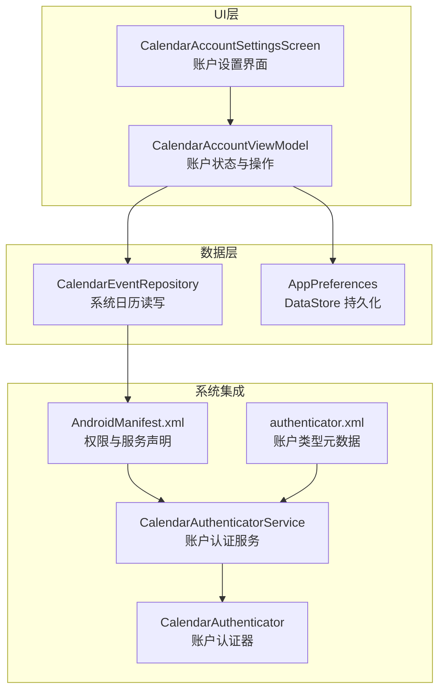
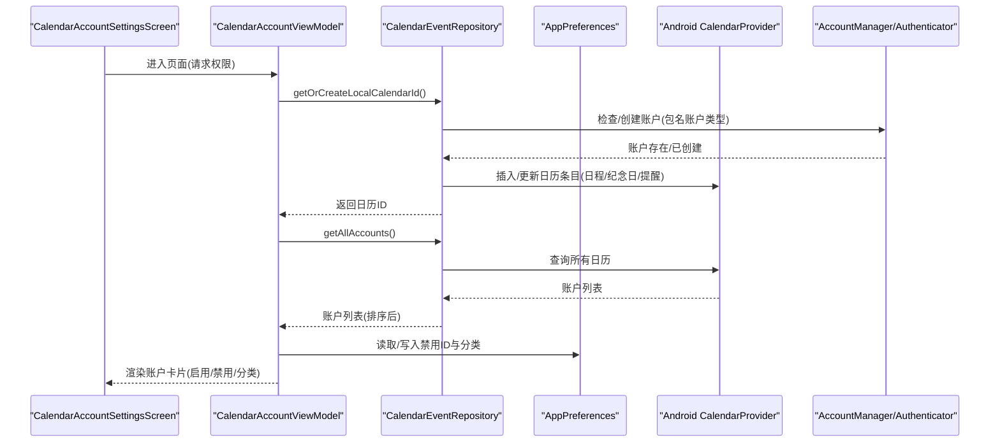
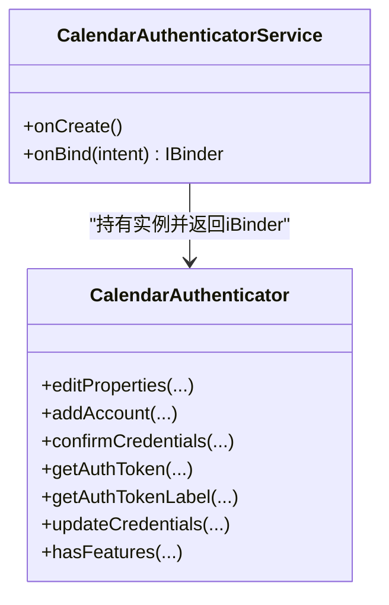
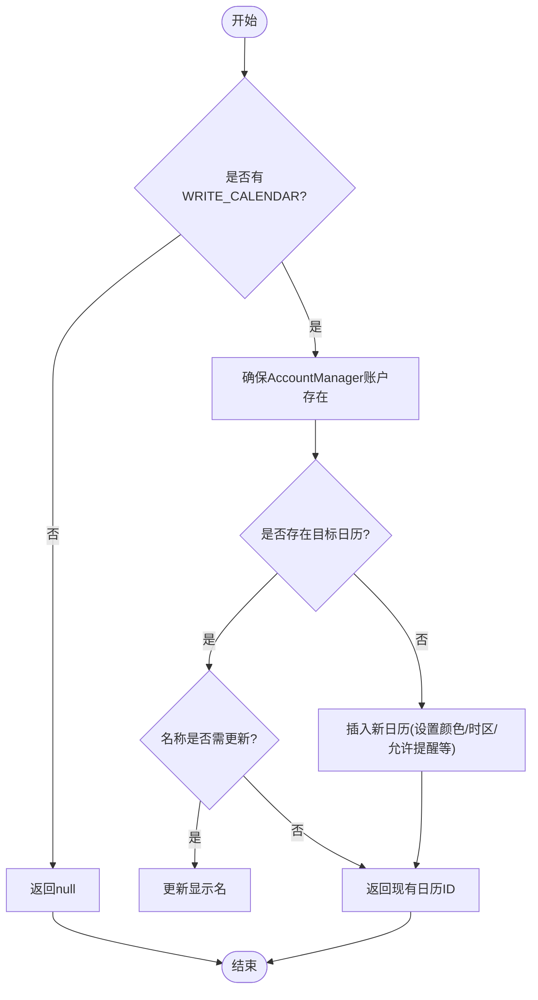
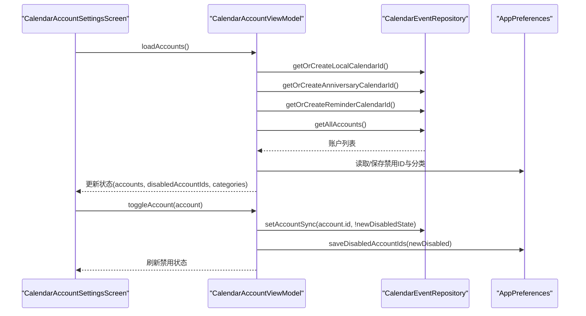
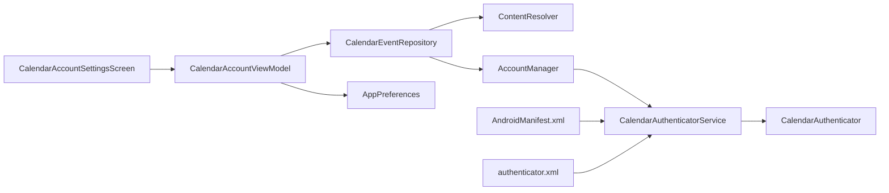

# 日历账号设置

<cite>
**本文引用的文件**   
- [CalendarAuthenticator.kt](file://app/src/main/java/com/schedulecalendar/app/data/calendar/CalendarAuthenticator.kt)
- [CalendarAuthenticatorService.kt](file://app/src/main/java/com/schedulecalendar/app/data/calendar/CalendarAuthenticatorService.kt)
- [CalendarEventRepository.kt](file://app/src/main/java/com/schedulecalendar/app/data/calendar/CalendarEventRepository.kt)
- [CalendarAccountSettingsScreen.kt](file://app/src/main/java/com/schedulecalendar/app/ui/settings/CalendarAccountSettingsScreen.kt)
- [CalendarAccountViewModel.kt](file://app/src/main/java/com/schedulecalendar/app/ui/settings/CalendarAccountViewModel.kt)
- [AppPreferences.kt](file://app/src/main/java/com/schedulecalendar/app/data/prefs/AppPreferences.kt)
- [authenticator.xml](file://app/src/main/res/xml/authenticator.xml)
- [AndroidManifest.xml](file://app/src/main/AndroidManifest.xml)
</cite>

## 目录
1. [简介](#简介)
2. [项目结构](#项目结构)
3. [核心组件](#核心组件)
4. [架构总览](#架构总览)
5. [详细组件分析](#详细组件分析)
6. [依赖关系分析](#依赖关系分析)
7. [性能与同步机制](#性能与同步机制)
8. [故障排查指南](#故障排查指南)
9. [结论](#结论)

## 简介
本模块围绕“系统日历账户管理”展开，提供应用内日历账户的添加、删除、启用/禁用、分类（日程/纪念日）等能力，并实现与 Android 系统 Calendar Provider 的双向集成。核心包括：
- 自定义账户认证器：在系统账户管理中注册应用专属账户类型，使应用创建的日历可见并可被系统识别。
- 日历事件仓库：封装对系统日历的读写、提醒设置、扩展属性兼容、批量查询与按日筛选等。
- UI 与状态管理：通过 Compose 页面与 ViewModel 管理账户列表、禁用状态与分类映射，持久化到 DataStore。
- 多账户支持与冲突解决：支持设备上的多个系统账户，默认隔离应用自有账户与其他外部账户，并提供分类策略避免数据混淆。

## 项目结构
该模块位于 app 模块中，主要涉及以下层次：
- data.calendar：账户认证与日历事件仓库
- ui.settings：账户设置界面与状态管理
- data.prefs：DataStore 偏好存储（禁用账户 ID、分类映射、初始化标记等）
- res/xml & AndroidManifest：账户认证服务声明与权限配置

图表来源
- [CalendarAccountSettingsScreen.kt:1-232](file://app/src/main/java/com/schedulecalendar/app/ui/settings/CalendarAccountSettingsScreen.kt#L1-L232)
- [CalendarAccountViewModel.kt:1-167](file://app/src/main/java/com/schedulecalendar/app/ui/settings/CalendarAccountViewModel.kt#L1-L167)
- [CalendarEventRepository.kt:1-820](file://app/src/main/java/com/schedulecalendar/app/data/calendar/CalendarEventRepository.kt#L1-L820)
- [AppPreferences.kt:1-313](file://app/src/main/java/com/schedulecalendar/app/data/prefs/AppPreferences.kt#L1-L313)
- [CalendarAuthenticatorService.kt:1-26](file://app/src/main/java/com/schedulecalendar/app/data/calendar/CalendarAuthenticatorService.kt#L1-L26)
- [CalendarAuthenticator.kt:1-75](file://app/src/main/java/com/schedulecalendar/app/data/calendar/CalendarAuthenticator.kt#L1-L75)
- [AndroidManifest.xml:1-126](file://app/src/main/AndroidManifest.xml#L1-L126)
- [authenticator.xml:1-7](file://app/src/main/res/xml/authenticator.xml#L1-L7)

章节来源
- [CalendarAccountSettingsScreen.kt:1-232](file://app/src/main/java/com/schedulecalendar/app/ui/settings/CalendarAccountSettingsScreen.kt#L1-L232)
- [CalendarAccountViewModel.kt:1-167](file://app/src/main/java/com/schedulecalendar/app/ui/settings/CalendarAccountViewModel.kt#L1-L167)
- [CalendarEventRepository.kt:1-820](file://app/src/main/java/com/schedulecalendar/app/data/calendar/CalendarEventRepository.kt#L1-L820)
- [AppPreferences.kt:1-313](file://app/src/main/java/com/schedulecalendar/app/data/prefs/AppPreferences.kt#L1-L313)
- [CalendarAuthenticatorService.kt:1-26](file://app/src/main/java/com/schedulecalendar/app/data/calendar/CalendarAuthenticatorService.kt#L1-L26)
- [CalendarAuthenticator.kt:1-75](file://app/src/main/java/com/schedulecalendar/app/data/calendar/CalendarAuthenticator.kt#L1-L75)
- [AndroidManifest.xml:1-126](file://app/src/main/AndroidManifest.xml#L1-L126)
- [authenticator.xml:1-7](file://app/src/main/res/xml/authenticator.xml#L1-L7)

## 核心组件
- CalendarAuthenticator：继承 AbstractAccountAuthenticator，用于在系统账户管理中注册应用账户类型，当前实现为最小可用版本（不处理交互式登录）。
- CalendarAuthenticatorService：绑定并暴露 CalendarAuthenticator.iBinder，供系统调用。
- CalendarEventRepository：封装系统日历的账户与事件读写，包含：
  - 获取所有账户并按优先级排序（应用账户优先，内部再按显示名后缀区分日程/纪念日/提醒）
  - 创建/更新/删除事件，支持重复规则 RRULE、提醒、颜色、扩展属性（国产 ROM 兼容）
  - 自动创建或查找应用本地日历（日程/纪念日/提醒三类），确保账户存在并开启同步
  - 按日期筛选事件（含年度重复纪念日）
  - 禁用/启用账户同步（SYNC_EVENTS）
- CalendarAccountViewModel：维护账户列表、禁用集合、分类映射；首次加载时自动初始化应用账户并默认禁用非应用账户；提供切换启用/禁用与分类设置。
- AppPreferences：使用 DataStore 持久化禁用账户 ID、分类映射、初始化标记等。
- 配置与权限：AndroidManifest 声明 READ/WRITE_CALENDAR、AUTHENTICATE_ACCOUNTS 等权限；authenticator.xml 定义账户类型。

章节来源
- [CalendarAuthenticator.kt:1-75](file://app/src/main/java/com/schedulecalendar/app/data/calendar/CalendarAuthenticator.kt#L1-L75)
- [CalendarAuthenticatorService.kt:1-26](file://app/src/main/java/com/schedulecalendar/app/data/calendar/CalendarAuthenticatorService.kt#L1-L26)
- [CalendarEventRepository.kt:1-820](file://app/src/main/java/com/schedulecalendar/app/data/calendar/CalendarEventRepository.kt#L1-L820)
- [CalendarAccountViewModel.kt:1-167](file://app/src/main/java/com/schedulecalendar/app/ui/settings/CalendarAccountViewModel.kt#L1-L167)
- [AppPreferences.kt:1-313](file://app/src/main/java/com/schedulecalendar/app/data/prefs/AppPreferences.kt#L1-L313)
- [AndroidManifest.xml:1-126](file://app/src/main/AndroidManifest.xml#L1-L126)
- [authenticator.xml:1-7](file://app/src/main/res/xml/authenticator.xml#L1-L7)

## 架构总览
整体采用 MVVM + Repository 模式，UI 层通过 ViewModel 调用 Repository 访问系统日历，状态与配置通过 DataStore 持久化。账户认证由系统 AccountManager 驱动，应用通过 Service 暴露 Authenticator。

图表来源
- [CalendarAccountSettingsScreen.kt:1-232](file://app/src/main/java/com/schedulecalendar/app/ui/settings/CalendarAccountSettingsScreen.kt#L1-L232)
- [CalendarAccountViewModel.kt:1-167](file://app/src/main/java/com/schedulecalendar/app/ui/settings/CalendarAccountViewModel.kt#L1-L167)
- [CalendarEventRepository.kt:1-820](file://app/src/main/java/com/schedulecalendar/app/data/calendar/CalendarEventRepository.kt#L1-L820)
- [AppPreferences.kt:1-313](file://app/src/main/java/com/schedulecalendar/app/data/prefs/AppPreferences.kt#L1-L313)

## 详细组件分析

### CalendarAuthenticator 与 CalendarAuthenticatorService
- CalendarAuthenticator 继承 AbstractAccountAuthenticator，当前方法多为空实现，仅声明账户类型，满足系统要求。
- CalendarAuthenticatorService 绑定并返回 authenticator.iBinder，供系统账户管理器调用。
- 通过 AndroidManifest 中的 service 与 meta-data 指向 authenticator.xml，声明 accountType 为应用包名。

图表来源
- [CalendarAuthenticator.kt:1-75](file://app/src/main/java/com/schedulecalendar/app/data/calendar/CalendarAuthenticator.kt#L1-L75)
- [CalendarAuthenticatorService.kt:1-26](file://app/src/main/java/com/schedulecalendar/app/data/calendar/CalendarAuthenticatorService.kt#L1-L26)
- [AndroidManifest.xml:112-122](file://app/src/main/AndroidManifest.xml#L112-L122)
- [authenticator.xml:1-7](file://app/src/main/res/xml/authenticator.xml#L1-L7)

章节来源
- [CalendarAuthenticator.kt:1-75](file://app/src/main/java/com/schedulecalendar/app/data/calendar/CalendarAuthenticator.kt#L1-L75)
- [CalendarAuthenticatorService.kt:1-26](file://app/src/main/java/com/schedulecalendar/app/data/calendar/CalendarAuthenticatorService.kt#L1-L26)
- [AndroidManifest.xml:112-122](file://app/src/main/AndroidManifest.xml#L112-L122)
- [authenticator.xml:1-7](file://app/src/main/res/xml/authenticator.xml#L1-L7)

### CalendarEventRepository：日历事件读写与账户管理
- 账户信息模型：CalendarAccountInfo（id、displayName、accountName、accountType、calendarIds）
- 事件信息模型：CalendarEventInfo（id、calendarId、title、description、dtStart、dtEnd、allDay、eventLocation、accountName、calendarDisplayName、rrule）
- 关键能力：
  - getAllAccounts：查询所有日历，按账户类型与显示名后缀排序（应用账户优先，内部顺序：日程 > 纪念日 > 提醒 > 外部）
  - getEventById / getAllEvents：事件读取，批量加载日历信息避免 N+1 查询
  - createEvent：创建事件，支持 RRULE、提醒、颜色、扩展属性（国产 ROM 兼容 need_alarm）
  - updateEvent / deleteEvent：更新与删除事件
  - getOrCreateLocalCalendarId / getOrCreateReminderCalendarId / getOrCreateAnniversaryCalendarId：自动创建或查找三类日历，确保账户存在并开启同步
  - setAccountSync：启用/禁用账户同步（SYNC_EVENTS）
  - findEventsByTitlePrefix / findEventByDateAndTitle：用于上下班提醒事件的查重与管理
  - getEventsForDate：按日期筛选事件，支持年度重复纪念日
  - getAccountKey：统一以 "calId:<id>" 作为账户键

图表来源
- [CalendarEventRepository.kt:417-516](file://app/src/main/java/com/schedulecalendar/app/data/calendar/CalendarEventRepository.kt#L417-L516)
- [CalendarEventRepository.kt:525-581](file://app/src/main/java/com/schedulecalendar/app/data/calendar/CalendarEventRepository.kt#L525-L581)
- [CalendarEventRepository.kt:589-645](file://app/src/main/java/com/schedulecalendar/app/data/calendar/CalendarEventRepository.kt#L589-L645)

章节来源
- [CalendarEventRepository.kt:1-820](file://app/src/main/java/com/schedulecalendar/app/data/calendar/CalendarEventRepository.kt#L1-L820)

### CalendarAccountViewModel：账户状态管理与用户交互
- 状态：accounts、disabledAccountIds、accountCategories、isLoading
- 行为：
  - loadAccounts：确保三类应用日历存在，加载账户列表；首次加载自动禁用非应用账户与提醒账户，并设置默认分类
  - toggleAccount：切换账户启用/禁用，同时调用 setAccountSync 控制系统同步开关，并持久化禁用集合
  - setAccountCategory / getAccountCategory：设置/获取账户分类（schedule/anniversary/null）
  - getAccountKey：生成账户键 "calId:<id>"

图表来源
- [CalendarAccountViewModel.kt:48-96](file://app/src/main/java/com/schedulecalendar/app/ui/settings/CalendarAccountViewModel.kt#L48-L96)
- [CalendarAccountViewModel.kt:102-124](file://app/src/main/java/com/schedulecalendar/app/ui/settings/CalendarAccountViewModel.kt#L102-L124)
- [CalendarAccountViewModel.kt:138-149](file://app/src/main/java/com/schedulecalendar/app/ui/settings/CalendarAccountViewModel.kt#L138-L149)

章节来源
- [CalendarAccountViewModel.kt:1-167](file://app/src/main/java/com/schedulecalendar/app/ui/settings/CalendarAccountViewModel.kt#L1-L167)

### CalendarAccountSettingsScreen：账户设置界面
- 权限申请：进入页面时检查 READ_CALENDAR 权限，未授权则引导用户授予
- 展示账户列表：每个账户卡片显示名称、账户名、启用/禁用开关与分类选择（日程/纪念日）
- 交互：点击开关触发 toggleAccount，分类选择触发 setAccountCategory

章节来源
- [CalendarAccountSettingsScreen.kt:1-232](file://app/src/main/java/com/schedulecalendar/app/ui/settings/CalendarAccountSettingsScreen.kt#L1-L232)

### AppPreferences：持久化存储
- 禁用账户 ID：KEY_DISABLED_ACCOUNT_IDS，支持 Flow 监听
- 账户分类映射：KEY_ACCOUNT_CATEGORIES，JSON 序列化 Map<String,String>
- 初始化标记：KEY_ACCOUNTS_INITIALIZED，标记首次初始化完成
- 其他相关：提醒方式、快捷方式开关、首次权限申请标记等

章节来源
- [AppPreferences.kt:252-313](file://app/src/main/java/com/schedulecalendar/app/data/prefs/AppPreferences.kt#L252-L313)

## 依赖关系分析
- UI 层依赖 ViewModel，ViewModel 依赖 Repository 与 Preferences
- Repository 依赖系统 ContentResolver 与 AccountManager，间接依赖 Authenticator 服务
- Manifest 与 XML 配置为 Authenticator 提供服务与账户类型元数据

图表来源
- [CalendarAccountSettingsScreen.kt:1-232](file://app/src/main/java/com/schedulecalendar/app/ui/settings/CalendarAccountSettingsScreen.kt#L1-L232)
- [CalendarAccountViewModel.kt:1-167](file://app/src/main/java/com/schedulecalendar/app/ui/settings/CalendarAccountViewModel.kt#L1-L167)
- [CalendarEventRepository.kt:1-820](file://app/src/main/java/com/schedulecalendar/app/data/calendar/CalendarEventRepository.kt#L1-L820)
- [AppPreferences.kt:1-313](file://app/src/main/java/com/schedulecalendar/app/data/prefs/AppPreferences.kt#L1-L313)
- [AndroidManifest.xml:1-126](file://app/src/main/AndroidManifest.xml#L1-L126)
- [authenticator.xml:1-7](file://app/src/main/res/xml/authenticator.xml#L1-L7)

章节来源
- [CalendarAccountSettingsScreen.kt:1-232](file://app/src/main/java/com/schedulecalendar/app/ui/settings/CalendarAccountSettingsScreen.kt#L1-L232)
- [CalendarAccountViewModel.kt:1-167](file://app/src/main/java/com/schedulecalendar/app/ui/settings/CalendarAccountViewModel.kt#L1-L167)
- [CalendarEventRepository.kt:1-820](file://app/src/main/java/com/schedulecalendar/app/data/calendar/CalendarEventRepository.kt#L1-L820)
- [AppPreferences.kt:1-313](file://app/src/main/java/com/schedulecalendar/app/data/prefs/AppPreferences.kt#L1-L313)
- [AndroidManifest.xml:1-126](file://app/src/main/AndroidManifest.xml#L1-L126)
- [authenticator.xml:1-7](file://app/src/main/res/xml/authenticator.xml#L1-L7)

## 性能与同步机制
- 批量加载日历信息：getAllEvents 先一次性加载所有日历信息，避免 N+1 查询，提升读取性能
- 账户排序策略：应用账户优先，内部按显示名后缀排序，保证应用自有日历始终靠前
- 同步开关：toggleAccount 调用 setAccountSync 控制 SYNC_EVENTS，影响系统同步行为
- 增量更新：当前仓库未实现基于时间戳的增量同步，建议后续引入 last_sync_time 字段与变更监听（如 ContentObserver）实现增量拉取
- 双向同步：当前实现以写为主（创建/更新/删除事件），读为全量查询；如需双向同步，应增加事件变更监听与冲突检测（如基于 eventId 与 rrule）

章节来源
- [CalendarEventRepository.kt:163-211](file://app/src/main/java/com/schedulecalendar/app/data/calendar/CalendarEventRepository.kt#L163-L211)
- [CalendarEventRepository.kt:749-762](file://app/src/main/java/com/schedulecalendar/app/data/calendar/CalendarEventRepository.kt#L749-L762)

## 故障排查指南
- 权限问题：若无法读取/写入日历，检查 READ/WRITE_CALENDAR 权限是否授予；首次创建账户需要 WRITE_CALENDAR
- 账户不可见：确认 CalendarAuthenticatorService 已在 Manifest 中正确声明，且 authenticator.xml 的 accountType 与应用包名一致
- 事件未显示：检查对应账户是否被禁用（disabledAccountIds），以及 setAccountSync 是否正确启用
- 提醒不生效：确认 HAS_ALARM 标志与 ExtendedProperties 的 need_alarm 已设置；部分国产 ROM 可能忽略标准字段
- 重复事件：使用 findEventByDateAndTitle 或 findEventsByTitlePrefix 进行查重，避免重复创建

章节来源
- [CalendarEventRepository.kt:325-386](file://app/src/main/java/com/schedulecalendar/app/data/calendar/CalendarEventRepository.kt#L325-L386)
- [CalendarEventRepository.kt:692-744](file://app/src/main/java/com/schedulecalendar/app/data/calendar/CalendarEventRepository.kt#L692-L744)
- [AndroidManifest.xml:6-11](file://app/src/main/AndroidManifest.xml#L6-L11)
- [authenticator.xml:1-7](file://app/src/main/res/xml/authenticator.xml#L1-L7)

## 结论
本模块实现了系统日历账户的完整管理能力，涵盖账户认证、事件读写、提醒与扩展属性兼容、多账户支持与分类策略。通过 ViewModel 与 DataStore 的状态管理，提供了良好的用户体验与可配置性。未来可进一步增强双向同步与增量更新能力，提升大规模事件场景下的性能与一致性。