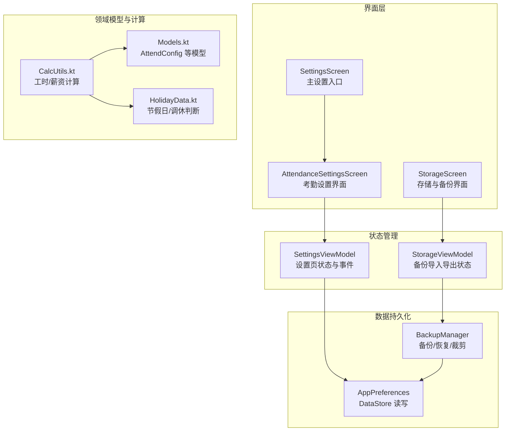
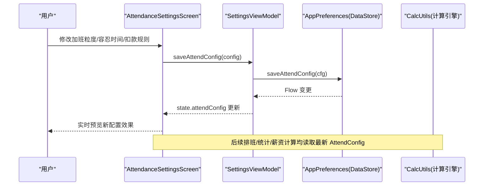
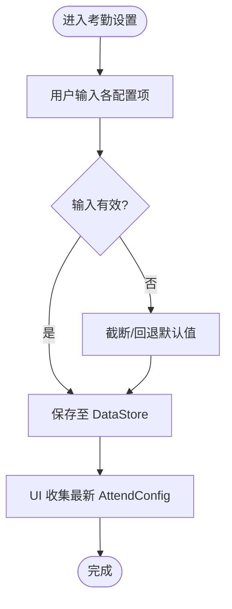
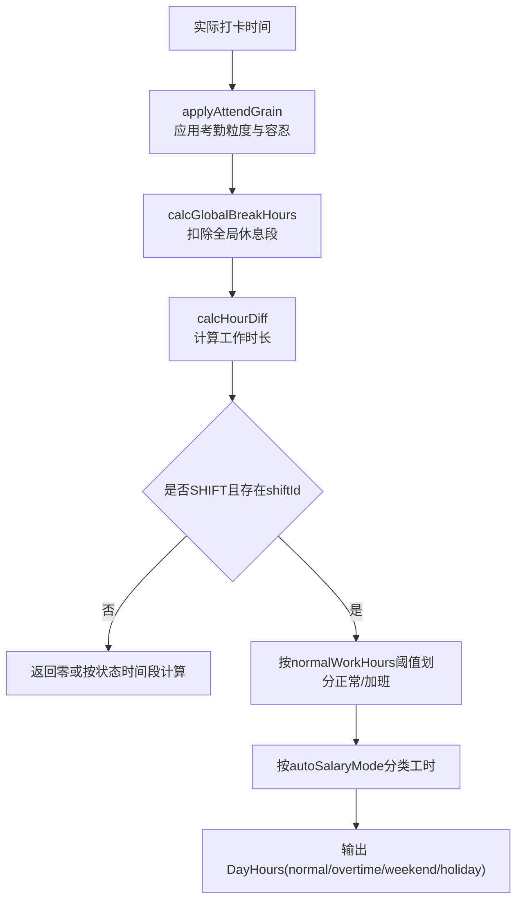
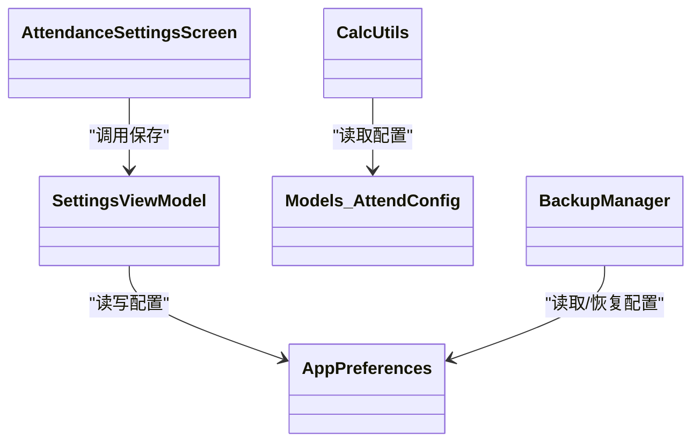
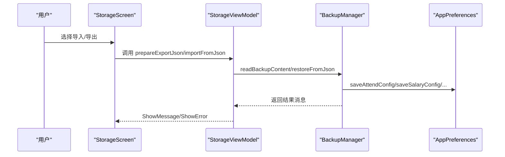

# 考勤设置

<cite>
**本文引用的文件**   
- [AttendanceSettingsScreen.kt](file://app/src/main/java/com/schedulecalendar/app/ui/settings/AttendanceSettingsScreen.kt)
- [SettingsViewModel.kt](file://app/src/main/java/com/schedulecalendar/app/ui/settings/SettingsViewModel.kt)
- [AppPreferences.kt](file://app/src/main/java/com/schedulecalendar/app/data/prefs/AppPreferences.kt)
- [Models.kt](file://app/src/main/java/com/schedulecalendar/app/domain/model/Models.kt)
- [CalcUtils.kt](file://app/src/main/java/com/schedulecalendar/app/domain/model/CalcUtils.kt)
- [HolidayData.kt](file://app/src/main/java/com/schedulecalendar/app/domain/model/HolidayData.kt)
- [BackupManager.kt](file://app/src/main/java/com/schedulecalendar/app/ui/settings/BackupManager.kt)
- [StorageViewModel.kt](file://app/src/main/java/com/schedulecalendar/app/ui/settings/StorageViewModel.kt)
- [StorageScreen.kt](file://app/src/main/java/com/schedulecalendar/app/ui/settings/StorageScreen.kt)
- [SettingsScreen.kt](file://app/src/main/java/com/schedulecalendar/app/ui/settings/SettingsScreen.kt)
- [SettingsUtils.kt](file://app/src/main/java/com/schedulecalendar/app/ui/settings/SettingsUtils.kt)
</cite>

## 目录
1. [简介](#简介)
2. [项目结构](#项目结构)
3. [核心组件](#核心组件)
4. [架构总览](#架构总览)
5. [详细组件分析](#详细组件分析)
6. [依赖关系分析](#依赖关系分析)
7. [性能与实时性](#性能与实时性)
8. [故障排查指南](#故障排查指南)
9. [结论](#结论)
10. [附录：导入导出与批量操作](#附录导入导出与批量操作)

## 简介
本模块聚焦“考勤设置”，涵盖加班粒度、迟到/早退容忍时间、扣款规则、提醒阈值等配置项，并说明其与薪资计算引擎的数据关联、动态生效机制与实时预览能力。同时提供备份导入导出与批量操作的实现要点，帮助开发者与使用者准确理解并高效使用。

## 项目结构
考勤设置相关代码主要分布在 UI 层（设置页面）、状态管理（ViewModel）、持久化（DataStore）以及领域计算（工时/薪资计算工具）。整体采用 MVVM + Repository + DataStore 的架构风格，UI 通过 StateFlow 订阅配置变化，保存时写入 DataStore，计算逻辑统一由领域层工具类处理。

**图表来源** 
- [AttendanceSettingsScreen.kt:1-32](file://app/src/main/java/com/schedulecalendar/app/ui/settings/AttendanceSettingsScreen.kt#L1-L32)
- [SettingsViewModel.kt:1-91](file://app/src/main/java/com/schedulecalendar/app/ui/settings/SettingsViewModel.kt#L1-L91)
- [AppPreferences.kt:68-90](file://app/src/main/java/com/schedulecalendar/app/data/prefs/AppPreferences.kt#L68-L90)
- [Models.kt:124-142](file://app/src/main/java/com/schedulecalendar/app/domain/model/Models.kt#L124-L142)
- [CalcUtils.kt:149-234](file://app/src/main/java/com/schedulecalendar/app/domain/model/CalcUtils.kt#L149-L234)
- [BackupManager.kt:394-434](file://app/src/main/java/com/schedulecalendar/app/ui/settings/BackupManager.kt#L394-L434)

**章节来源**
- [SettingsScreen.kt:61-90](file://app/src/main/java/com/schedulecalendar/app/ui/settings/SettingsScreen.kt#L61-L90)
- [AttendanceSettingsScreen.kt:1-32](file://app/src/main/java/com/schedulecalendar/app/ui/settings/AttendanceSettingsScreen.kt#L1-L32)

## 核心组件
- 考勤配置模型 AttendConfig：定义加班粒度、迟到/早退容忍时长、提醒阈值、标准工时、迟到/早退扣款费率等字段。
- 考勤设置界面 AttendanceSettingsScreen：提供用户输入与即时保存，包含数字输入保护与范围约束。
- 设置视图模型 SettingsViewModel：聚合多个配置 Flow，提供保存方法，驱动界面状态更新。
- 偏好存储 AppPreferences：以 DataStore 持久化 AttendConfig，并提供 Flow 供 UI 订阅。
- 计算工具 CalcUtils：将考勤配置应用于打卡时间，计算正常/加班工时，并与薪资引擎联动。
- 备份管理器 BackupManager：在应用数据备份中完整包含考勤配置，支持导入导出与恢复。

**章节来源**
- [Models.kt:124-142](file://app/src/main/java/com/schedulecalendar/app/domain/model/Models.kt#L124-L142)
- [AttendanceSettingsScreen.kt:35-89](file://app/src/main/java/com/schedulecalendar/app/ui/settings/AttendanceSettingsScreen.kt#L35-L89)
- [SettingsViewModel.kt:34-91](file://app/src/main/java/com/schedulecalendar/app/ui/settings/SettingsViewModel.kt#L34-L91)
- [AppPreferences.kt:76-82](file://app/src/main/java/com/schedulecalendar/app/data/prefs/AppPreferences.kt#L76-L82)
- [CalcUtils.kt:61-113](file://app/src/main/java/com/schedulecalendar/app/domain/model/CalcUtils.kt#L61-L113)
- [BackupManager.kt:548-578](file://app/src/main/java/com/schedulecalendar/app/ui/settings/BackupManager.kt#L548-L578)

## 架构总览
考勤设置的端到端流程如下：用户在界面修改配置 → ViewModel 调用 Preferences 保存 → DataStore 变更触发 Flow 更新 → UI 重新收集状态 → 计算引擎读取最新配置参与工时/薪资计算。

**图表来源** 
- [AttendanceSettingsScreen.kt:17-32](file://app/src/main/java/com/schedulecalendar/app/ui/settings/AttendanceSettingsScreen.kt#L17-L32)
- [SettingsViewModel.kt:53-69](file://app/src/main/java/com/schedulecalendar/app/ui/settings/SettingsViewModel.kt#L53-L69)
- [AppPreferences.kt:76-82](file://app/src/main/java/com/schedulecalendar/app/data/prefs/AppPreferences.kt#L76-L82)
- [CalcUtils.kt:149-234](file://app/src/main/java/com/schedulecalendar/app/domain/model/CalcUtils.kt#L149-L234)

## 详细组件分析

### 考勤配置模型 AttendConfig
- 字段含义与默认值：
  - overtimeGranMin：加班计量粒度（分钟），默认 30
  - lateToleranceMin：迟到容忍时长（分钟），默认 0
  - earlyLeaveToleranceMin：早退容忍时长（分钟），默认 0
  - lateAlertCount / earlyLeaveAlertCount：当月迟到/早退次数提醒阈值，0 表示不提醒
  - normalWorkHoursPerDay：日标准工时（小时），超出部分计为加班
  - lateDeductionPerMin / earlyLeaveDeductionPerMin：迟到/早退扣款（元/分钟）
- 边界与校验：
  - 界面侧对输入进行过滤与范围限制（如 0~120 分钟），无效值回退到默认或 0
  - 数值类型转换使用安全解析，避免异常

**章节来源**
- [Models.kt:124-142](file://app/src/main/java/com/schedulecalendar/app/domain/model/Models.kt#L124-L142)
- [AttendanceSettingsScreen.kt:49-58](file://app/src/main/java/com/schedulecalendar/app/ui/settings/AttendanceSettingsScreen.kt#L49-L58)

### 考勤设置界面 AttendanceSettingsScreen
- 功能点：
  - 加班粒度：单选按钮组（15/30/60 分钟）
  - 迟到/早退容忍时间：受保护的数值输入框，范围 0~120
  - 迟到/早退提醒阈值：整数输入，0 表示禁用提醒
  - 日标准工时：小数输入
  - 迟到/早退扣款：按分钟计费的小数输入
- 交互特性：
  - ProtectedNumField 防止 IME 自动填充“0”
  - 输入过滤仅保留数字和小数点，多小数点去重
  - 保存即写 DataStore，UI 实时刷新

**图表来源** 
- [AttendanceSettingsScreen.kt:35-89](file://app/src/main/java/com/schedulecalendar/app/ui/settings/AttendanceSettingsScreen.kt#L35-L89)
- [SettingsUtils.kt:18-69](file://app/src/main/java/com/schedulecalendar/app/ui/settings/SettingsUtils.kt#L18-L69)

**章节来源**
- [AttendanceSettingsScreen.kt:35-89](file://app/src/main/java/com/schedulecalendar/app/ui/settings/AttendanceSettingsScreen.kt#L35-L89)
- [SettingsUtils.kt:18-69](file://app/src/main/java/com/schedulecalendar/app/ui/settings/SettingsUtils.kt#L18-L69)

### 设置视图模型 SettingsViewModel
- 职责：
  - 组合 salaryConfig、attendConfig、scheduleRule、displaySchemes 的 Flow，合并为统一 UI 状态
  - 暴露 saveAttendConfig 等方法，异步写入 DataStore
  - 提供清空数据的统一入口（含所有仓库与偏好）

**章节来源**
- [SettingsViewModel.kt:34-91](file://app/src/main/java/com/schedulecalendar/app/ui/settings/SettingsViewModel.kt#L34-L91)

### 偏好存储 AppPreferences
- 职责：
  - 以 DataStore 持久化 AttendConfig，提供 attendConfigFlow 供 UI 订阅
  - 提供 saveAttendConfig 写入方法
  - 其他设置（薪资、显示方案、排序、颜色索引、快捷方式开关等）统一管理

**章节来源**
- [AppPreferences.kt:76-82](file://app/src/main/java/com/schedulecalendar/app/data/prefs/AppPreferences.kt#L76-L82)

### 计算引擎 CalcUtils 与考勤规则的联动
- applyAttendGrain：根据 AttendConfig 将实际打卡时间映射为有效计算时间
  - 早到：按粒度向下取整，小于粒度视为准点
  - 迟到：在容忍范围内视为准点，否则按实际时间
  - 晚退/早退同理
- calcDayHours：结合班次、全局休息段、Apply 后的有效时间，计算正常/加班/周末/节假日工时
- calcMonthSalary：汇总月薪资，包含迟到/早退按分钟扣款（当配置了费率）
- autoSalaryMode：依据日期自动推断计薪方式（工作日/周末/节假日）

**图表来源** 
- [CalcUtils.kt:61-113](file://app/src/main/java/com/schedulecalendar/app/domain/model/CalcUtils.kt#L61-L113)
- [CalcUtils.kt:149-234](file://app/src/main/java/com/schedulecalendar/app/domain/model/CalcUtils.kt#L149-L234)
- [CalcUtils.kt:520-530](file://app/src/main/java/com/schedulecalendar/app/domain/model/CalcUtils.kt#L520-L530)

**章节来源**
- [CalcUtils.kt:61-113](file://app/src/main/java/com/schedulecalendar/app/domain/model/CalcUtils.kt#L61-L113)
- [CalcUtils.kt:149-234](file://app/src/main/java/com/schedulecalendar/app/domain/model/CalcUtils.kt#L149-L234)
- [CalcUtils.kt:365-444](file://app/src/main/java/com/schedulecalendar/app/domain/model/CalcUtils.kt#L365-L444)
- [HolidayData.kt:171-174](file://app/src/main/java/com/schedulecalendar/app/domain/model/HolidayData.kt#L171-L174)

### 考勤规则动态生效与实时预览
- 动态生效：UI 保存后立即写入 DataStore，Flow 变更驱动 UI 重新渲染；计算引擎在每次统计/薪资计算时读取最新 AttendConfig
- 实时预览：界面输入即保存，用户可立即看到配置变化对后续计算的影响（例如加班粒度改变后，历史记录的展示仍基于当前配置）

**章节来源**
- [SettingsViewModel.kt:53-69](file://app/src/main/java/com/schedulecalendar/app/ui/settings/SettingsViewModel.kt#L53-L69)
- [AppPreferences.kt:76-82](file://app/src/main/java/com/schedulecalendar/app/data/prefs/AppPreferences.kt#L76-L82)
- [CalcUtils.kt:149-234](file://app/src/main/java/com/schedulecalendar/app/domain/model/CalcUtils.kt#L149-L234)

## 依赖关系分析
- UI 层依赖 ViewModel，ViewModel 依赖 AppPreferences 与各类 Repository
- 计算引擎 CalcUtils 依赖 Models 中的数据结构（AttendConfig、Shift、ScheduleRecord 等）与 HolidayData
- 备份管理器 BackupManager 依赖 AppPreferences 与各仓库，用于构建/恢复完整应用数据（包含考勤配置）

**图表来源** 
- [AttendanceSettingsScreen.kt:17-32](file://app/src/main/java/com/schedulecalendar/app/ui/settings/AttendanceSettingsScreen.kt#L17-L32)
- [SettingsViewModel.kt:34-91](file://app/src/main/java/com/schedulecalendar/app/ui/settings/SettingsViewModel.kt#L34-L91)
- [AppPreferences.kt:76-82](file://app/src/main/java/com/schedulecalendar/app/data/prefs/AppPreferences.kt#L76-L82)
- [CalcUtils.kt:149-234](file://app/src/main/java/com/schedulecalendar/app/domain/model/CalcUtils.kt#L149-L234)
- [BackupManager.kt:394-434](file://app/src/main/java/com/schedulecalendar/app/ui/settings/BackupManager.kt#L394-L434)

**章节来源**
- [Models.kt:124-142](file://app/src/main/java/com/schedulecalendar/app/domain/model/Models.kt#L124-L142)
- [BackupManager.kt:548-578](file://app/src/main/java/com/schedulecalendar/app/ui/settings/BackupManager.kt#L548-L578)

## 性能与实时性
- DataStore Flow 提供低开销的响应式更新，避免频繁轮询
- 输入过滤与范围校验在 UI 层完成，减少无效写入
- 计算引擎按需调用，仅在统计/薪资计算时读取最新配置，避免不必要的重算

[本节为通用指导，无需引用具体文件]

## 故障排查指南
- 输入异常导致保存失败：检查 ProtectedNumField 的过滤逻辑与范围约束，确保输入合法
- 配置未生效：确认 DataStore 写入成功且 Flow 已触发；查看 SettingsViewModel 的状态合并逻辑
- 扣款未按预期：核对 CalcUtils 中迟到/早退扣款条件与阈值（容忍时长、费率是否为 0）
- 备份/恢复问题：确认 BackupManager 的 JSON 结构与版本兼容，恢复路径权限正确

**章节来源**
- [SettingsUtils.kt:18-69](file://app/src/main/java/com/schedulecalendar/app/ui/settings/SettingsUtils.kt#L18-L69)
- [SettingsViewModel.kt:74-90](file://app/src/main/java/com/schedulecalendar/app/ui/settings/SettingsViewModel.kt#L74-L90)
- [CalcUtils.kt:409-424](file://app/src/main/java/com/schedulecalendar/app/domain/model/CalcUtils.kt#L409-L424)
- [BackupManager.kt:367-377](file://app/src/main/java/com/schedulecalendar/app/ui/settings/BackupManager.kt#L367-L377)

## 结论
考勤设置模块通过清晰的模型定义、响应式数据流与统一的计算引擎，实现了配置的动态生效与实时预览。配合备份导入导出与批量操作能力，既满足日常使用需求，也为扩展与迁移提供了坚实基础。

[本节为总结，无需引用具体文件]

## 附录：导入导出与批量操作
- 导入导出：
  - BackupManager 支持应用数据与班次配置的备份与恢复，其中应用数据备份包含 AttendConfig
  - StorageViewModel 提供从外部 URI 导入 JSON 的功能，并提示结果
- 批量操作：
  - 日历与设置页支持批量删除/复制等操作（参考 CalendarViewModel 的 batchMode/copyMode 等字段）
  - 备份裁剪策略：自动备份按保留天数/份数裁剪，手动备份不受影响

**图表来源** 
- [StorageScreen.kt:138-196](file://app/src/main/java/com/schedulecalendar/app/ui/settings/StorageScreen.kt#L138-L196)
- [StorageViewModel.kt:250-286](file://app/src/main/java/com/schedulecalendar/app/ui/settings/StorageViewModel.kt#L250-L286)
- [BackupManager.kt:367-377](file://app/src/main/java/com/schedulecalendar/app/ui/settings/BackupManager.kt#L367-L377)
- [BackupManager.kt:394-434](file://app/src/main/java/com/schedulecalendar/app/ui/settings/BackupManager.kt#L394-L434)

**章节来源**
- [BackupManager.kt:276-316](file://app/src/main/java/com/schedulecalendar/app/ui/settings/BackupManager.kt#L276-L316)
- [StorageViewModel.kt:250-286](file://app/src/main/java/com/schedulecalendar/app/ui/settings/StorageViewModel.kt#L250-L286)
- [CalendarViewModel.kt:80-104](file://app/src/main/java/com/schedulecalendar/app/ui/calendar/CalendarViewModel.kt#L80-L104)