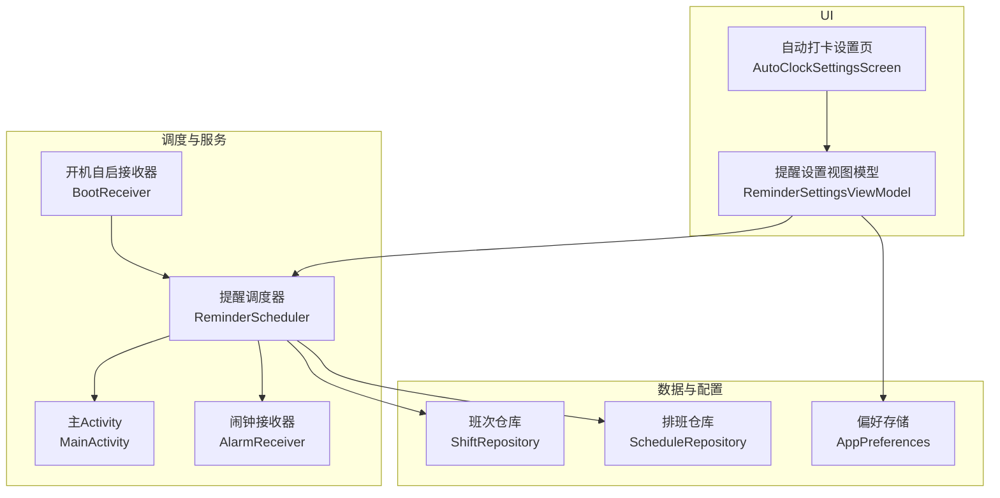
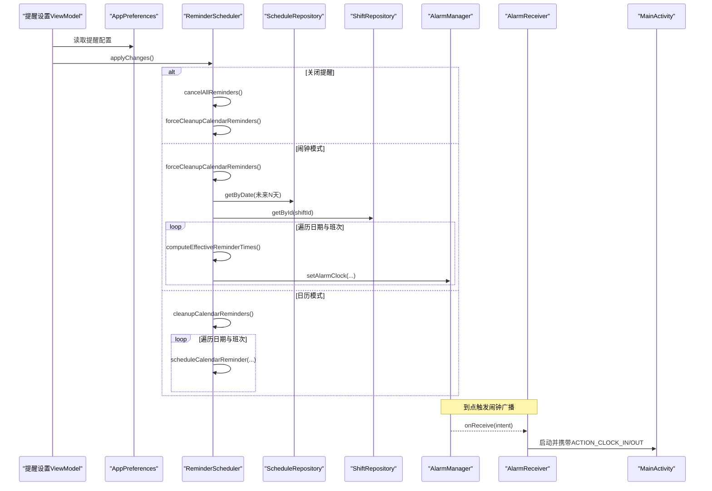
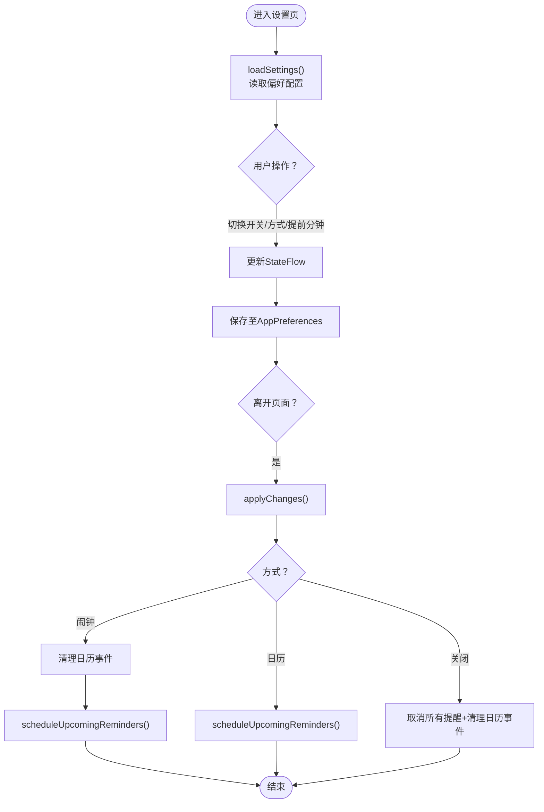
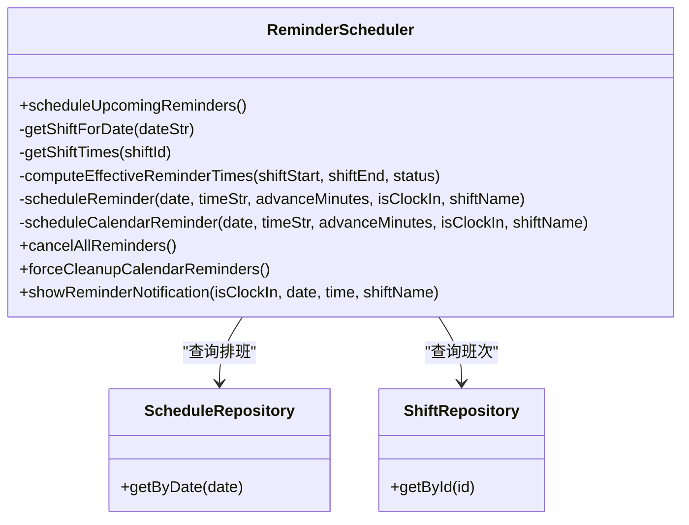
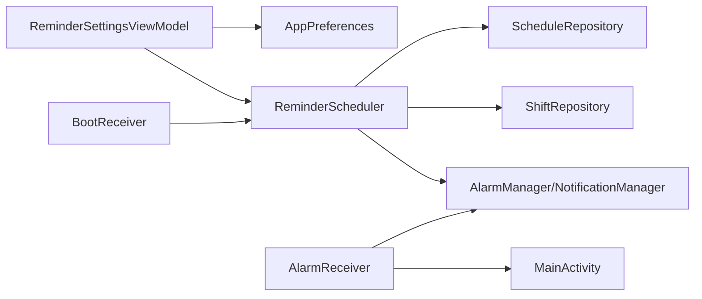

# 自动打卡设置

<cite>
**本文引用的文件**   
- [AutoClockSettingsScreen.kt](file://app/src/main/java/com/schedulecalendar/app/ui/settings/AutoClockSettingsScreen.kt)
- [ReminderSettingsViewModel.kt](file://app/src/main/java/com/schedulecalendar/app/ui/settings/ReminderSettingsViewModel.kt)
- [AppPreferences.kt](file://app/src/main/java/com/schedulecalendar/app/data/prefs/AppPreferences.kt)
- [ReminderScheduler.kt](file://app/src/main/java/com/schedulecalendar/app/reminder/ReminderScheduler.kt)
- [AlarmReceiver.kt](file://app/src/main/java/com/schedulecalendar/app/reminder/AlarmReceiver.kt)
- [BootReceiver.kt](file://app/src/main/java/com/schedulecalendar/app/reminder/BootReceiver.kt)
- [MainActivity.kt](file://app/src/main/java/com/schedulecalendar/app/MainActivity.kt)
- [ScheduleRepository.kt](file://app/src/main/java/com/schedulecalendar/app/data/repository/ScheduleRepository.kt)
- [ShiftRepository.kt](file://app/src/main/java/com/schedulecalendar/app/data/repository/ShiftRepository.kt)
- [Models.kt](file://app/src/main/java/com/schedulecalendar/app/domain/model/Models.kt)
</cite>

## 目录
1. [简介](#简介)
2. [项目结构](#项目结构)
3. [核心组件](#核心组件)
4. [架构总览](#架构总览)
5. [详细组件分析](#详细组件分析)
6. [依赖关系分析](#依赖关系分析)
7. [性能与可靠性](#性能与可靠性)
8. [故障排查指南](#故障排查指南)
9. [结论](#结论)
10. [附录：配置项说明](#附录配置项说明)

## 简介
本模块聚焦“自动打卡设置”能力，围绕提醒调度、系统闹钟集成、触发条件与执行逻辑、失败处理与重试策略、状态监控与日志记录等方面展开。当前代码库中“自动打卡”界面处于占位开发阶段，但提醒调度与通知体系已完整实现，可作为自动打卡的可靠触发与提醒基础。

## 项目结构
- UI 层：自动打卡设置入口页面（占位）；提醒设置 ViewModel 管理提醒开关、方式与提前时间等配置。
- 数据持久化：通过 DataStore 保存提醒相关配置。
- 调度与系统服务：使用 AlarmManager.setAlarmClock 精确闹钟或系统日历事件进行提醒；广播接收器负责展示通知并引导用户进入应用执行动作。
- 数据源：排班与班次信息通过 Repository 获取，用于计算提醒时间与范围。

图表来源
- [AutoClockSettingsScreen.kt:1-25](file://app/src/main/java/com/schedulecalendar/app/ui/settings/AutoClockSettingsScreen.kt#L1-L25)
- [ReminderSettingsViewModel.kt:1-177](file://app/src/main/java/com/schedulecalendar/app/ui/settings/ReminderSettingsViewModel.kt#L1-L177)
- [AppPreferences.kt:1-313](file://app/src/main/java/com/schedulecalendar/app/data/prefs/AppPreferences.kt#L1-L313)
- [ReminderScheduler.kt:1-497](file://app/src/main/java/com/schedulecalendar/app/reminder/ReminderScheduler.kt#L1-L497)
- [AlarmReceiver.kt:1-78](file://app/src/main/java/com/schedulecalendar/app/reminder/AlarmReceiver.kt#L1-L78)
- [BootReceiver.kt:1-45](file://app/src/main/java/com/schedulecalendar/app/reminder/BootReceiver.kt#L1-L45)
- [MainActivity.kt:1-322](file://app/src/main/java/com/schedulecalendar/app/MainActivity.kt#L1-L322)
- [ScheduleRepository.kt:1-40](file://app/src/main/java/com/schedulecalendar/app/data/repository/ScheduleRepository.kt#L1-L40)
- [ShiftRepository.kt:1-45](file://app/src/main/java/com/schedulecalendar/app/data/repository/ShiftRepository.kt#L1-L45)

章节来源
- [AutoClockSettingsScreen.kt:1-25](file://app/src/main/java/com/schedulecalendar/app/ui/settings/AutoClockSettingsScreen.kt#L1-L25)
- [ReminderSettingsViewModel.kt:1-177](file://app/src/main/java/com/schedulecalendar/app/ui/settings/ReminderSettingsViewModel.kt#L1-L177)
- [AppPreferences.kt:1-313](file://app/src/main/java/com/schedulecalendar/app/data/prefs/AppPreferences.kt#L1-L313)
- [ReminderScheduler.kt:1-497](file://app/src/main/java/com/schedulecalendar/app/reminder/ReminderScheduler.kt#L1-L497)
- [AlarmReceiver.kt:1-78](file://app/src/main/java/com/schedulecalendar/app/reminder/AlarmReceiver.kt#L1-L78)
- [BootReceiver.kt:1-45](file://app/src/main/java/com/schedulecalendar/app/reminder/BootReceiver.kt#L1-L45)
- [MainActivity.kt:1-322](file://app/src/main/java/com/schedulecalendar/app/MainActivity.kt#L1-L322)
- [ScheduleRepository.kt:1-40](file://app/src/main/java/com/schedulecalendar/app/data/repository/ScheduleRepository.kt#L1-L40)
- [ShiftRepository.kt:1-45](file://app/src/main/java/com/schedulecalendar/app/data/repository/ShiftRepository.kt#L1-L45)

## 核心组件
- 提醒设置视图模型（ReminderSettingsViewModel）
  - 负责加载/保存提醒开关、提醒方式（闹钟/日历）、上下班提醒开关与提前分钟数。
  - 在退出设置页时统一应用变更：关闭则取消所有提醒并清理日历事件；闹钟模式清理日历事件后重新调度；日历模式直接创建日历提醒事件。
- 偏好存储（AppPreferences）
  - 提供提醒相关键值对读写与 Flow 监听，包括是否启用、方式、上下班提醒开关、提前分钟数等。
- 提醒调度器（ReminderScheduler）
  - 读取未来若干天的排班与班次信息，计算有效提醒时间（考虑请假/调休等内置状态），按方式注册闹钟或创建日历事件。
  - 支持跨午夜下班提醒日期修正、内置状态时间段扣除、窗口内旧事件清理。
- 闹钟接收器（AlarmReceiver）
  - 接收系统闹钟广播，构建高优先级通知，点击后打开应用并触发对应打卡动作。
- 开机自启接收器（BootReceiver）
  - 设备重启后重新调度提醒，保证闹钟不被系统清除导致失效。
- 主 Activity（MainActivity）
  - 定义打卡动作常量，接收通知点击后的 Action，供后续业务消费。

章节来源
- [ReminderSettingsViewModel.kt:1-177](file://app/src/main/java/com/schedulecalendar/app/ui/settings/ReminderSettingsViewModel.kt#L1-L177)
- [AppPreferences.kt:1-313](file://app/src/main/java/com/schedulecalendar/app/data/prefs/AppPreferences.kt#L1-L313)
- [ReminderScheduler.kt:1-497](file://app/src/main/java/com/schedulecalendar/app/reminder/ReminderScheduler.kt#L1-L497)
- [AlarmReceiver.kt:1-78](file://app/src/main/java/com/schedulecalendar/app/reminder/AlarmReceiver.kt#L1-L78)
- [BootReceiver.kt:1-45](file://app/src/main/java/com/schedulecalendar/app/reminder/BootReceiver.kt#L1-L45)
- [MainActivity.kt:1-322](file://app/src/main/java/com/schedulecalendar/app/MainActivity.kt#L1-L322)

## 架构总览
提醒调度采用“双通道”策略：
- 闹钟通道：使用 AlarmManager.setAlarmClock 注册高精度闹钟，确保 Doze/省电模式下仍可靠触发。
- 日历通道：在本地提醒专用日历创建事件并设置提醒，由系统日历应用负责通知。

图表来源
- [ReminderSettingsViewModel.kt:155-176](file://app/src/main/java/com/schedulecalendar/app/ui/settings/ReminderSettingsViewModel.kt#L155-L176)
- [ReminderScheduler.kt:101-203](file://app/src/main/java/com/schedulecalendar/app/reminder/ReminderScheduler.kt#L101-L203)
- [ReminderScheduler.kt:301-353](file://app/src/main/java/com/schedulecalendar/app/reminder/ReminderScheduler.kt#L301-L353)
- [ReminderScheduler.kt:385-430](file://app/src/main/java/com/schedulecalendar/app/reminder/ReminderScheduler.kt#L385-L430)
- [AlarmReceiver.kt:19-62](file://app/src/main/java/com/schedulecalendar/app/reminder/AlarmReceiver.kt#L19-L62)
- [MainActivity.kt:38-42](file://app/src/main/java/com/schedulecalendar/app/MainActivity.kt#L38-L42)

## 详细组件分析

### 自动打卡设置界面（占位）
- 当前为占位页面，显示“功能开发中”，预留导航返回逻辑。
- 实际提醒设置由“提醒设置”页面与 ViewModel 驱动。

章节来源
- [AutoClockSettingsScreen.kt:1-25](file://app/src/main/java/com/schedulecalendar/app/ui/settings/AutoClockSettingsScreen.kt#L1-L25)

### 提醒设置视图模型（ReminderSettingsViewModel）
- 职责
  - 加载/更新提醒开关、方式、上下班提醒开关与提前分钟数。
  - 切换日历模式前检查日历权限，未授权则标记 pending 状态。
  - 退出页面时统一应用变更：关闭→取消所有提醒并清理日历事件；闹钟模式→清理日历事件后重新调度；日历模式→重新创建日历事件。
- 关键流程
  - loadSettings：从 AppPreferences 读取配置并填充 StateFlow。
  - setMethod：根据方法类型校验权限并保存。
  - applyChanges：调用 ReminderScheduler 完成最终调度。

图表来源
- [ReminderSettingsViewModel.kt:56-76](file://app/src/main/java/com/schedulecalendar/app/ui/settings/ReminderSettingsViewModel.kt#L56-L76)
- [ReminderSettingsViewModel.kt:86-116](file://app/src/main/java/com/schedulecalendar/app/ui/settings/ReminderSettingsViewModel.kt#L86-L116)
- [ReminderSettingsViewModel.kt:161-175](file://app/src/main/java/com/schedulecalendar/app/ui/settings/ReminderSettingsViewModel.kt#L161-L175)

章节来源
- [ReminderSettingsViewModel.kt:1-177](file://app/src/main/java/com/schedulecalendar/app/ui/settings/ReminderSettingsViewModel.kt#L1-L177)

### 偏好存储（AppPreferences）
- 提醒相关键
  - 是否启用：KEY_REMINDER_ENABLED
  - 提醒方式：KEY_REMINDER_METHOD（"alarm"/"calendar"）
  - 上下班提醒开关：KEY_REMINDER_CLOCK_IN / KEY_REMINDER_CLOCK_OUT
  - 提前分钟数：KEY_REMINDER_CLOCK_IN_MINUTES / KEY_REMINDER_CLOCK_OUT_MINUTES
- 提供 Flow 监听以支持响应式 UI。

章节来源
- [AppPreferences.kt:52-66](file://app/src/main/java/com/schedulecalendar/app/data/prefs/AppPreferences.kt#L52-L66)
- [AppPreferences.kt:202-248](file://app/src/main/java/com/schedulecalendar/app/data/prefs/AppPreferences.kt#L202-L248)

### 提醒调度器（ReminderScheduler）
- 核心能力
  - scheduleUpcomingReminders：扫描未来若干天排班与班次，计算有效提醒时间，按方式注册闹钟或创建日历事件。
  - computeEffectiveReminderTimes：根据内置请假/调休状态调整提醒时间，支持跨午夜与时间段扣除。
  - scheduleReminder：使用 setAlarmClock 注册精确闹钟，包含权限检查与过去时间过滤。
  - scheduleCalendarReminder：在本地提醒专用日历创建事件，避免重复创建。
  - cancelAllReminders / forceCleanupCalendarReminders：清理残留闹钟与日历事件。
- 触发窗口
  - 默认覆盖“今天-3天 ~ 今天+5天”，超出窗口的旧事件会被清理。
- 错误处理
  - 各步骤捕获异常并静默处理，避免影响整体调度。

图表来源
- [ReminderScheduler.kt:101-203](file://app/src/main/java/com/schedulecalendar/app/reminder/ReminderScheduler.kt#L101-L203)
- [ReminderScheduler.kt:208-232](file://app/src/main/java/com/schedulecalendar/app/reminder/ReminderScheduler.kt#L208-L232)
- [ReminderScheduler.kt:244-287](file://app/src/main/java/com/schedulecalendar/app/reminder/ReminderScheduler.kt#L244-L287)
- [ReminderScheduler.kt:301-353](file://app/src/main/java/com/schedulecalendar/app/reminder/ReminderScheduler.kt#L301-L353)
- [ReminderScheduler.kt:385-430](file://app/src/main/java/com/schedulecalendar/app/reminder/ReminderScheduler.kt#L385-L430)
- [ReminderScheduler.kt:358-372](file://app/src/main/java/com/schedulecalendar/app/reminder/ReminderScheduler.kt#L358-L372)
- [ReminderScheduler.kt:447-456](file://app/src/main/java/com/schedulecalendar/app/reminder/ReminderScheduler.kt#L447-L456)
- [ScheduleRepository.kt:31](file://app/src/main/java/com/schedulecalendar/app/data/repository/ScheduleRepository.kt#L31)
- [ShiftRepository.kt:34](file://app/src/main/java/com/schedulecalendar/app/data/repository/ShiftRepository.kt#L34)

章节来源
- [ReminderScheduler.kt:1-497](file://app/src/main/java/com/schedulecalendar/app/reminder/ReminderScheduler.kt#L1-L497)
- [ScheduleRepository.kt:1-40](file://app/src/main/java/com/schedulecalendar/app/data/repository/ScheduleRepository.kt#L1-L40)
- [ShiftRepository.kt:1-45](file://app/src/main/java/com/schedulecalendar/app/data/repository/ShiftRepository.kt#L1-L45)

### 闹钟接收器（AlarmReceiver）
- 作用
  - 解析 Intent 中的打卡类型、日期、时间与班次名称。
  - 创建高优先级通知渠道与通知，点击后打开 MainActivity 并携带 ACTION_CLOCK_IN/OUT。
- 兼容性
  - Android 8.0+ 创建 NotificationChannel。

章节来源
- [AlarmReceiver.kt:19-62](file://app/src/main/java/com/schedulecalendar/app/reminder/AlarmReceiver.kt#L19-L62)
- [MainActivity.kt:38-42](file://app/src/main/java/com/schedulecalendar/app/MainActivity.kt#L38-L42)

### 开机自启接收器（BootReceiver）
- 作用
  - 监听系统开机完成广播，通过 Hilt EntryPoint 获取 ReminderScheduler 单例，重新调度未来 N 天的提醒。
- 必要性
  - 系统重启会清除 AlarmManager 中的闹钟，需恢复。

章节来源
- [BootReceiver.kt:31-44](file://app/src/main/java/com/schedulecalendar/app/reminder/BootReceiver.kt#L31-L44)

### 主 Activity（MainActivity）
- 作用
  - 定义 ACTION_CLOCK_IN / ACTION_CLOCK_OUT 常量，供通知点击后跳转并触发相应打卡动作。
  - 提供 consumeShortcutAction 等方法供上层消费动作。

章节来源
- [MainActivity.kt:38-42](file://app/src/main/java/com/schedulecalendar/app/MainActivity.kt#L38-L42)
- [MainActivity.kt:234-249](file://app/src/main/java/com/schedulecalendar/app/MainActivity.kt#L234-L249)

## 依赖关系分析
- 组件耦合
  - ReminderSettingsViewModel 依赖 AppPreferences 与 ReminderScheduler。
  - ReminderScheduler 依赖 ScheduleRepository、ShiftRepository 与系统服务（AlarmManager、NotificationManager）。
  - AlarmReceiver 依赖 ReminderScheduler 常量与 MainActivity 动作。
  - BootReceiver 通过 Hilt EntryPoint 获取 ReminderScheduler。
- 外部依赖
  - Android 系统服务：AlarmManager、NotificationManager、CalendarProvider（日历模式）。
  - Hilt 依赖注入。

图表来源
- [ReminderSettingsViewModel.kt:43-47](file://app/src/main/java/com/schedulecalendar/app/ui/settings/ReminderSettingsViewModel.kt#L43-L47)
- [ReminderScheduler.kt:43-49](file://app/src/main/java/com/schedulecalendar/app/reminder/ReminderScheduler.kt#L43-L49)
- [AlarmReceiver.kt:1-11](file://app/src/main/java/com/schedulecalendar/app/reminder/AlarmReceiver.kt#L1-L11)
- [BootReceiver.kt:23-29](file://app/src/main/java/com/schedulecalendar/app/reminder/BootReceiver.kt#L23-L29)

章节来源
- [ReminderSettingsViewModel.kt:1-177](file://app/src/main/java/com/schedulecalendar/app/ui/settings/ReminderSettingsViewModel.kt#L1-L177)
- [ReminderScheduler.kt:1-497](file://app/src/main/java/com/schedulecalendar/app/reminder/ReminderScheduler.kt#L1-L497)
- [AlarmReceiver.kt:1-78](file://app/src/main/java/com/schedulecalendar/app/reminder/AlarmReceiver.kt#L1-L78)
- [BootReceiver.kt:1-45](file://app/src/main/java/com/schedulecalendar/app/reminder/BootReceiver.kt#L1-L45)

## 性能与可靠性
- 可靠性
  - 使用 setAlarmClock 将提醒视为系统闹钟，提高 Doze/省电模式下的触发可靠性。
  - 开机后自动重建闹钟，防止系统重启导致的丢失。
- 性能
  - 仅扫描有限窗口（前3天~后5天），减少不必要的数据库访问。
  - 日历模式去重创建，避免重复事件。
- 扩展建议
  - 可引入网络状态检测（如 ConnectivityManager）在打卡前校验网络，必要时延迟或提示。
  - 可增加地理位置限制（Location Services）并在打卡前校验位置是否在允许范围内。
  - 增加重试机制：当打卡失败（如网络不可用、服务器错误）时，按指数退避策略重试并记录日志。

[本节为通用指导，不直接分析具体文件]

## 故障排查指南
- 无法收到提醒
  - 检查提醒总开关是否开启。
  - 确认闹钟权限可用（Android 12+ 精确闹钟权限）。
  - 查看是否切换到日历模式且具备日历读写权限。
  - 检查是否被系统省电策略拦截，优先使用闹钟模式。
- 通知点击无效
  - 确认 MainActivity 的 ACTION_CLOCK_IN/OUT 是否正确传递并被消费。
- 重启后提醒失效
  - 确认 BootReceiver 已正确注册并触发 scheduleUpcomingReminders。
- 日志与状态监控
  - 建议在 ReminderScheduler 的关键路径添加结构化日志（如触发时间、排班信息、异常堆栈）。
  - 可通过 AppPreferences 暴露当前提醒状态快照，便于 UI 实时反馈。

章节来源
- [ReminderScheduler.kt:301-353](file://app/src/main/java/com/schedulecalendar/app/reminder/ReminderScheduler.kt#L301-L353)
- [BootReceiver.kt:31-44](file://app/src/main/java/com/schedulecalendar/app/reminder/BootReceiver.kt#L31-L44)
- [MainActivity.kt:38-42](file://app/src/main/java/com/schedulecalendar/app/MainActivity.kt#L38-L42)

## 结论
当前代码库已实现完整的提醒调度与通知体系，可作为自动打卡的可靠触发基础。自动打卡界面尚处占位阶段，可在现有提醒能力上扩展打卡规则（时间、位置、网络）、失败重试与状态监控等功能，形成端到端的自动打卡闭环。

[本节为总结性内容，不直接分析具体文件]

## 附录：配置项说明
- 提醒开关
  - 键：KEY_REMINDER_ENABLED
  - 含义：是否启用提醒
- 提醒方式
  - 键：KEY_REMINDER_METHOD
  - 取值："alarm"（闹钟）、"calendar"（日历）
- 上下班提醒开关
  - 键：KEY_REMINDER_CLOCK_IN / KEY_REMINDER_CLOCK_OUT
  - 含义：是否提醒上班/下班
- 提前分钟数
  - 键：KEY_REMINDER_CLOCK_IN_MINUTES / KEY_REMINDER_CLOCK_OUT_MINUTES
  - 含义：距离实际时间的提前分钟数

章节来源
- [AppPreferences.kt:52-66](file://app/src/main/java/com/schedulecalendar/app/data/prefs/AppPreferences.kt#L52-L66)
- [AppPreferences.kt:202-248](file://app/src/main/java/com/schedulecalendar/app/data/prefs/AppPreferences.kt#L202-L248)