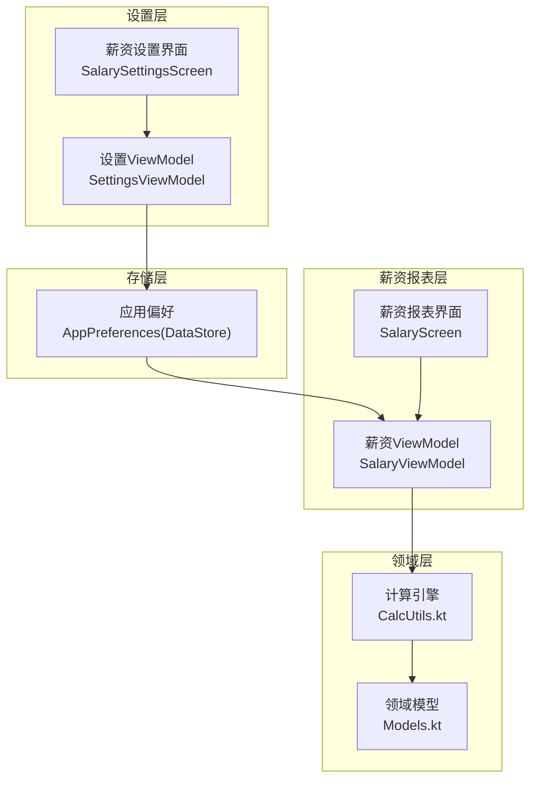
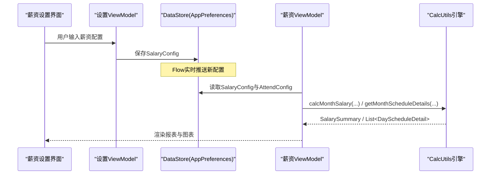
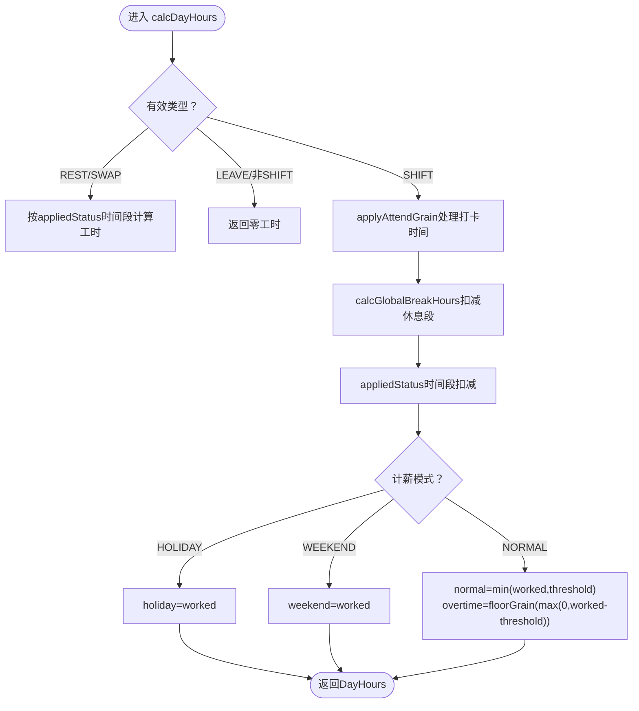
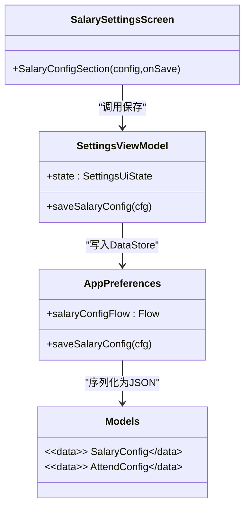
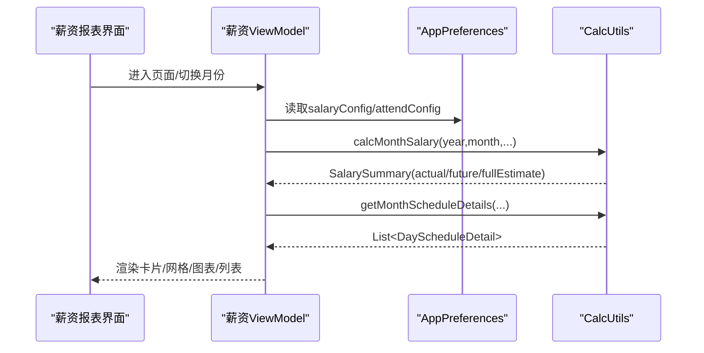
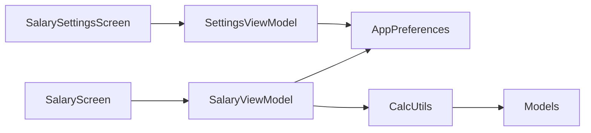

# 薪资设置

<cite>
**本文引用的文件**   
- [Models.kt](file://app/src/main/java/com/schedulecalendar/app/domain/model/Models.kt)
- [CalcUtils.kt](file://app/src/main/java/com/schedulecalendar/app/domain/model/CalcUtils.kt)
- [SalarySettingsScreen.kt](file://app/src/main/java/com/schedulecalendar/app/ui/settings/SalarySettingsScreen.kt)
- [SettingsViewModel.kt](file://app/src/main/java/com/schedulecalendar/app/ui/settings/SettingsViewModel.kt)
- [AppPreferences.kt](file://app/src/main/java/com/schedulecalendar/app/data/prefs/AppPreferences.kt)
- [SalaryScreen.kt](file://app/src/main/java/com/schedulecalendar/app/ui/salary/SalaryScreen.kt)
- [SalaryViewModel.kt](file://app/src/main/java/com/schedulecalendar/app/ui/salary/SalaryViewModel.kt)
</cite>

## 目录
1. [简介](#简介)
2. [项目结构](#项目结构)
3. [核心组件](#核心组件)
4. [架构总览](#架构总览)
5. [详细组件分析](#详细组件分析)
6. [依赖关系分析](#依赖关系分析)
7. [性能与边界条件](#性能与边界条件)
8. [故障排查指南](#故障排查指南)
9. [结论](#结论)
10. [附录：薪资规则版本管理与历史追溯](#附录薪资规则版本管理与历史追溯)

## 简介
本模块聚焦“薪资设置”与“薪资计算”的完整闭环，覆盖以下能力：
- 薪资配置项：底薪、绩效、正常/加班/周末/节假日时薪、社保扣款、公积金扣款等。
- 考勤联动：迟到/早退容忍、加班粒度、标准工时阈值、迟到/早退扣款。
- 复杂计算逻辑：按日期自动分类（工作日/周末/法定假日）、休息/调休/请假处理、全局休息段扣减、附加补贴/扣款、迟到早退扣款、社保与公积金扣除。
- 数据关联：UI设置 → DataStore持久化 → ViewModel读取 → CalcUtils引擎计算 → 报表展示。
- 模拟与报表：月度薪资汇总、每日明细、构成饼图、趋势柱状图。
- 版本与追溯：当前文档基于仓库现有实现进行说明；若需扩展版本管理，见附录建议方案。

## 项目结构
薪资相关代码分布在领域模型、计算工具、设置界面与薪资报表页面中：
- 领域模型：定义薪资配置、考勤配置、排班记录、班次、休息段、附加项目、汇总结果等数据结构。
- 计算引擎：纯函数式工具类，负责工时与薪资计算、时间归一化、周末/节假日判断等。
- 设置界面：提供薪资配置的输入与保存，通过ViewModel写入DataStore。
- 薪资报表：展示当月实际/预计薪资、每日明细、图表与趋势。

**图示来源**
- [SalarySettingsScreen.kt:1-90](file://app/src/main/java/com/schedulecalendar/app/ui/settings/SalarySettingsScreen.kt#L1-L90)
- [SettingsViewModel.kt:1-91](file://app/src/main/java/com/schedulecalendar/app/ui/settings/SettingsViewModel.kt#L1-L91)
- [AppPreferences.kt:68-90](file://app/src/main/java/com/schedulecalendar/app/data/prefs/AppPreferences.kt#L68-L90)
- [Models.kt:112-142](file://app/src/main/java/com/schedulecalendar/app/domain/model/Models.kt#L112-L142)
- [CalcUtils.kt:365-444](file://app/src/main/java/com/schedulecalendar/app/domain/model/CalcUtils.kt#L365-L444)
- [SalaryScreen.kt:1-187](file://app/src/main/java/com/schedulecalendar/app/ui/salary/SalaryScreen.kt#L1-L187)
- [SalaryViewModel.kt:48-168](file://app/src/main/java/com/schedulecalendar/app/ui/salary/SalaryViewModel.kt#L48-L168)

**章节来源**
- [Models.kt:112-142](file://app/src/main/java/com/schedulecalendar/app/domain/model/Models.kt#L112-L142)
- [CalcUtils.kt:365-444](file://app/src/main/java/com/schedulecalendar/app/domain/model/CalcUtils.kt#L365-L444)
- [SalarySettingsScreen.kt:1-90](file://app/src/main/java/com/schedulecalendar/app/ui/settings/SalarySettingsScreen.kt#L1-L90)
- [SettingsViewModel.kt:1-91](file://app/src/main/java/com/schedulecalendar/app/ui/settings/SettingsViewModel.kt#L1-L91)
- [AppPreferences.kt:68-90](file://app/src/main/java/com/schedulecalendar/app/data/prefs/AppPreferences.kt#L68-L90)
- [SalaryScreen.kt:1-187](file://app/src/main/java/com/schedulecalendar/app/ui/salary/SalaryScreen.kt#L1-L187)
- [SalaryViewModel.kt:48-168](file://app/src/main/java/com/schedulecalendar/app/ui/salary/SalaryViewModel.kt#L48-L168)

## 核心组件
- 薪资配置 SalaryConfig：包含基础底薪、基础绩效、正常/加班/周末/节假日时薪、社保扣款、公积金扣款。
- 考勤配置 AttendConfig：加班粒度、迟到/早退容忍、标准工时阈值、迟到/早退扣款费率。
- 计算引擎 CalcUtils：提供工时分类、月工时统计、月薪资统计、每日明细、周末/节假日判定等。
- 设置界面与ViewModel：提供薪资配置输入、校验与保存至DataStore。
- 薪资报表界面与ViewModel：读取配置与数据，调用CalcUtils生成汇总、明细与图表。

**章节来源**
- [Models.kt:112-142](file://app/src/main/java/com/schedulecalendar/app/domain/model/Models.kt#L112-L142)
- [CalcUtils.kt:149-234](file://app/src/main/java/com/schedulecalendar/app/domain/model/CalcUtils.kt#L149-L234)
- [SalarySettingsScreen.kt:37-89](file://app/src/main/java/com/schedulecalendar/app/ui/settings/SalarySettingsScreen.kt#L37-L89)
- [SettingsViewModel.kt:66-69](file://app/src/main/java/com/schedulecalendar/app/ui/settings/SettingsViewModel.kt#L66-L69)
- [SalaryScreen.kt:189-238](file://app/src/main/java/com/schedulecalendar/app/ui/salary/SalaryScreen.kt#L189-L238)
- [SalaryViewModel.kt:74-144](file://app/src/main/java/com/schedulecalendar/app/ui/salary/SalaryViewModel.kt#L74-L144)

## 架构总览
薪资设置到计算的端到端流程如下：
- 用户在薪资设置界面修改配置，SettingsViewModel将SalaryConfig保存到AppPreferences（DataStore）。
- 薪资报表页的SalaryViewModel订阅配置流，加载当月排班、班次、休息段、附加项目后，调用CalcUtils进行计算。
- CalcUtils根据考勤规则与薪资配置，输出月薪资汇总与每日明细，供UI渲染图表与列表。

**图示来源**
- [SalarySettingsScreen.kt:20-35](file://app/src/main/java/com/schedulecalendar/app/ui/settings/SalarySettingsScreen.kt#L20-L35)
- [SettingsViewModel.kt:66-69](file://app/src/main/java/com/schedulecalendar/app/ui/settings/SettingsViewModel.kt#L66-L69)
- [AppPreferences.kt:68-90](file://app/src/main/java/com/schedulecalendar/app/data/prefs/AppPreferences.kt#L68-L90)
- [SalaryViewModel.kt:74-144](file://app/src/main/java/com/schedulecalendar/app/ui/salary/SalaryViewModel.kt#L74-L144)
- [CalcUtils.kt:365-444](file://app/src/main/java/com/schedulecalendar/app/domain/model/CalcUtils.kt#L365-L444)

## 详细组件分析

### 薪资配置模型与字段说明
- SalaryConfig字段：
  - baseSalary：基础底薪（元/月）
  - basePerformance：基础绩效（元/月）
  - normalRate：正常时薪（元/小时）
  - overtimeRate：加班时薪（元/小时）
  - weekendRate：周末时薪（元/小时）
  - holidayRate：节假日时薪（元/小时）
  - socialInsurance：社保扣款（元/月）
  - housingFundDeduction：公积金扣款（元/月）
- AttendConfig字段：
  - overtimeGranMin：加班计量粒度（分钟）
  - lateToleranceMin：迟到容忍时长（分钟）
  - earlyLeaveToleranceMin：早退容忍时长（分钟）
  - normalWorkHoursPerDay：标准工时阈值（小时）
  - lateDeductionPerMin：迟到扣款（元/分钟）
  - earlyLeaveDeductionPerMin：早退扣款（元/分钟）

这些字段在设置界面以受保护的数值输入框呈现，并在保存时构建SalaryConfig对象。

**章节来源**
- [Models.kt:112-142](file://app/src/main/java/com/schedulecalendar/app/domain/model/Models.kt#L112-L142)
- [SalarySettingsScreen.kt:37-89](file://app/src/main/java/com/schedulecalendar/app/ui/settings/SalarySettingsScreen.kt#L37-L89)

### 薪资计算引擎 CalcUtils 核心逻辑
- 时间工具：
  - timeToMin/minutesToTime：时间字符串与分钟数互转，支持跨天归一化。
  - normRange：统一时间范围，处理跨天情况。
  - calcHourDiff：计算两时间点差值（小时），空值返回0。
- 考勤粒度处理 applyAttendGrain：
  - 早到：按粒度向下取整，忽略开关控制是否计入加班。
  - 迟到：在容忍范围内视为准点，超出则按实际打卡时间。
  - 晚退/加班：同理对结束时间处理。
- 全局休息段扣减 calcGlobalBreakHours：
  - 计算全局休息时段与班次时间窗口的重叠时长（小时），支持跨天。
- 日工时计算 calcDayHours：
  - 依据record.shiftId推导有效类型（休息/调休/请假/普通班次）。
  - 休息/调休：若有时间段则按该时间段计算，否则为0。
  - 请假/非SHIFT：不产生工时。
  - 普通班次：应用考勤粒度与容忍，减去全局休息段与状态时间段，按计薪方式分类（正常/加班/周末/节假日）。
  - 标准工时阈值：优先使用班次normalWorkHours，否则使用AttendConfig.normalWorkHoursPerDay。
- 月工时统计 calcMonthHours：
  - 累计正常/加班/周末/节假日工时，统计请假天数、调休天数、休息天数、迟到/早退次数、请假/调休状态小时。
- 月薪资统计 calcMonthSalary：
  - 遍历当月排班，累加各类型工时×对应时薪，叠加补贴/扣款，再按迟到/早退扣款规则扣款，最后减去社保与公积金得出totalSalary。
- 每日明细 getMonthScheduleDetails：
  - 逐日生成DayScheduleDetail，包含工时分类、薪资拆分（正常/加班）、附加项目合计。
- 周末/节假日判断 autoSalaryMode/isWeekend：
  - 法定假日优先，其次周末（考虑调休补班），其余为工作日。

**图示来源**
- [CalcUtils.kt:149-234](file://app/src/main/java/com/schedulecalendar/app/domain/model/CalcUtils.kt#L149-L234)
- [CalcUtils.kt:61-113](file://app/src/main/java/com/schedulecalendar/app/domain/model/CalcUtils.kt#L61-L113)
- [CalcUtils.kt:121-134](file://app/src/main/java/com/schedulecalendar/app/domain/model/CalcUtils.kt#L121-L134)

**章节来源**
- [CalcUtils.kt:149-234](file://app/src/main/java/com/schedulecalendar/app/domain/model/CalcUtils.kt#L149-L234)
- [CalcUtils.kt:365-444](file://app/src/main/java/com/schedulecalendar/app/domain/model/CalcUtils.kt#L365-L444)
- [CalcUtils.kt:448-486](file://app/src/main/java/com/schedulecalendar/app/domain/model/CalcUtils.kt#L448-L486)
- [CalcUtils.kt:520-543](file://app/src/main/java/com/schedulecalendar/app/domain/model/CalcUtils.kt#L520-L543)

### 设置界面与数据持久化
- SalarySettingsScreen：
  - 提供薪资配置输入项（底薪、绩效、正常/加班/周末/节假日时薪、社保、公积金）。
  - 输入变化即时构建SalaryConfig并触发保存。
- SettingsViewModel：
  - 合并salaryConfigFlow、attendConfigFlow等，驱动UI状态。
  - saveSalaryConfig调用AppPreferences.saveSalaryConfig写入DataStore。
- AppPreferences：
  - 使用DataStore与Gson序列化SalaryConfig/AttendConfig等。
  - 提供Flow实时推送配置变更。

**图示来源**
- [SalarySettingsScreen.kt:37-89](file://app/src/main/java/com/schedulecalendar/app/ui/settings/SalarySettingsScreen.kt#L37-L89)
- [SettingsViewModel.kt:66-69](file://app/src/main/java/com/schedulecalendar/app/ui/settings/SettingsViewModel.kt#L66-L69)
- [AppPreferences.kt:68-90](file://app/src/main/java/com/schedulecalendar/app/data/prefs/AppPreferences.kt#L68-L90)
- [Models.kt:112-142](file://app/src/main/java/com/schedulecalendar/app/domain/model/Models.kt#L112-L142)

**章节来源**
- [SalarySettingsScreen.kt:1-90](file://app/src/main/java/com/schedulecalendar/app/ui/settings/SalarySettingsScreen.kt#L1-L90)
- [SettingsViewModel.kt:1-91](file://app/src/main/java/com/schedulecalendar/app/ui/settings/SettingsViewModel.kt#L1-L91)
- [AppPreferences.kt:68-90](file://app/src/main/java/com/schedulecalendar/app/data/prefs/AppPreferences.kt#L68-L90)

### 薪资报表与模拟计算
- SalaryScreen：
  - 展示本月预计薪资卡片、薪资明细网格、图表（构成饼图/趋势柱状图）、每日明细列表。
  - 区分已到与实际/未来预估部分。
- SalaryViewModel：
  - 加载当月数据（排班、班次、休息段、附加项目、薪资/考勤配置）。
  - 计算actual（历史或≤今天）、future（未来或>今天）、fullEstimate（全月估算）。
  - 生成每日明细与近8个月趋势。
- 计算调用：
  - 使用CalcUtils.calcMonthSalary与getMonthScheduleDetails完成薪资与明细计算。

**图示来源**
- [SalaryScreen.kt:1-187](file://app/src/main/java/com/schedulecalendar/app/ui/salary/SalaryScreen.kt#L1-L187)
- [SalaryViewModel.kt:74-144](file://app/src/main/java/com/schedulecalendar/app/ui/salary/SalaryViewModel.kt#L74-L144)
- [CalcUtils.kt:365-444](file://app/src/main/java/com/schedulecalendar/app/domain/model/CalcUtils.kt#L365-L444)
- [CalcUtils.kt:448-486](file://app/src/main/java/com/schedulecalendar/app/domain/model/CalcUtils.kt#L448-L486)

**章节来源**
- [SalaryScreen.kt:1-187](file://app/src/main/java/com/schedulecalendar/app/ui/salary/SalaryScreen.kt#L1-L187)
- [SalaryViewModel.kt:48-168](file://app/src/main/java/com/schedulecalendar/app/ui/salary/SalaryViewModel.kt#L48-L168)

## 依赖关系分析
- UI层依赖ViewModel：SalarySettingsScreen依赖SettingsViewModel；SalaryScreen依赖SalaryViewModel。
- ViewModel依赖Repository与Preferences：SalaryViewModel依赖ShiftRepository、ScheduleRepository、ShiftBreakRepository、ExtraItemRepository、AppPreferences。
- 计算引擎依赖领域模型：CalcUtils使用Models中的数据结构（Shift、ScheduleRecord、ShiftBreak、ExtraItem、SalaryConfig、AttendConfig等）。
- 数据存储：AppPreferences通过DataStore持久化配置，并以Flow形式暴露给ViewModel。

**图示来源**
- [SalarySettingsScreen.kt:1-90](file://app/src/main/java/com/schedulecalendar/app/ui/settings/SalarySettingsScreen.kt#L1-L90)
- [SettingsViewModel.kt:1-91](file://app/src/main/java/com/schedulecalendar/app/ui/settings/SettingsViewModel.kt#L1-L91)
- [SalaryScreen.kt:1-187](file://app/src/main/java/com/schedulecalendar/app/ui/salary/SalaryScreen.kt#L1-L187)
- [SalaryViewModel.kt:48-168](file://app/src/main/java/com/schedulecalendar/app/ui/salary/SalaryViewModel.kt#L48-L168)
- [CalcUtils.kt:365-444](file://app/src/main/java/com/schedulecalendar/app/domain/model/CalcUtils.kt#L365-L444)
- [Models.kt:112-142](file://app/src/main/java/com/schedulecalendar/app/domain/model/Models.kt#L112-L142)

**章节来源**
- [SalaryViewModel.kt:48-168](file://app/src/main/java/com/schedulecalendar/app/ui/salary/SalaryViewModel.kt#L48-L168)
- [SettingsViewModel.kt:1-91](file://app/src/main/java/com/schedulecalendar/app/ui/settings/SettingsViewModel.kt#L1-L91)
- [AppPreferences.kt:68-90](file://app/src/main/java/com/schedulecalendar/app/data/prefs/AppPreferences.kt#L68-L90)

## 性能与边界条件
- 性能特性：
  - 计算引擎为纯函数，无副作用，适合在协程中批量计算。
  - 月度计算复杂度与当月排班数量线性相关，日常使用可接受。
- 边界条件处理：
  - 空时间/空记录：calcHourDiff返回0；无排班或无效shift返回零工时。
  - 跨天处理：normRange确保时间范围正确归一化。
  - 休息/调休/请假：REST/SWAP按appliedStatus时间段计算；LEAVE不产生工时。
  - 标准工时阈值：优先班次normalWorkHours，否则AttendConfig.normalWorkHoursPerDay。
  - 加班粒度：floor(h/grain)*grain，避免小数累积误差。
  - 迟到/早退扣款：仅在配置费率且超过容忍时长时生效。
  - 社保/公积金：作为固定扣款从总额中减去。
  - 未来/历史月份：current month仅≤今天的部分计入actual，>今天部分计入future。

[本节为通用指导，不直接分析具体文件]

## 故障排查指南
- 薪资计算失败：
  - 检查SalaryConfig与AttendConfig是否正确保存与读取。
  - 确认排班记录存在且shiftId有效，shift.startTime/endTime不为空。
  - 验证appliedStatus时间段格式与顺序。
- 显示异常：
  - 确认图表数据为空时的兜底文案。
  - 检查每日明细extras是否为空导致薪资为0。
- 数据不一致：
  - 确认DataStore Flow更新是否被ViewModel订阅。
  - 检查reload时机（生命周期ON_RESUME或排班刷新信号）。

**章节来源**
- [SalaryViewModel.kt:139-143](file://app/src/main/java/com/schedulecalendar/app/ui/salary/SalaryViewModel.kt#L139-L143)
- [SettingsViewModel.kt:75-89](file://app/src/main/java/com/schedulecalendar/app/ui/settings/SettingsViewModel.kt#L75-L89)

## 结论
薪资设置模块通过清晰的职责分层与纯函数计算引擎，实现了从配置到报表的完整链路。其优势在于：
- 配置项全面，覆盖底薪、绩效、多类时薪、社保与公积金。
- 考勤规则灵活，支持粒度、容忍、标准工时阈值与扣款。
- 计算逻辑严谨，处理跨天、休息段、状态时间段、附加项目等复杂场景。
- 报表功能完善，提供汇总、明细与可视化图表。

如需扩展版本管理与历史追溯，建议在配置层引入版本号与快照机制（见附录）。

[本节为总结性内容，不直接分析具体文件]

## 附录：薪资规则版本管理与历史追溯
当前仓库未实现薪资规则的版本管理与历史追溯。建议扩展方向：
- 在SalaryConfig中增加version字段，每次保存递增。
- 在AppPreferences中维护配置历史列表（保留最近N条）。
- 在SettingsViewModel中提供“恢复历史版本”操作。
- 在CalcUtils中支持按版本参数选择不同计算策略（如税率规则变更）。

此建议为概念性扩展，不涉及现有代码改动。

[本节为概念性内容，不直接分析具体文件]