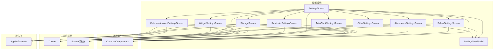
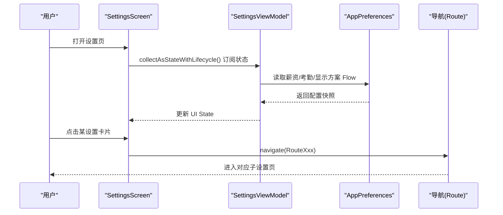
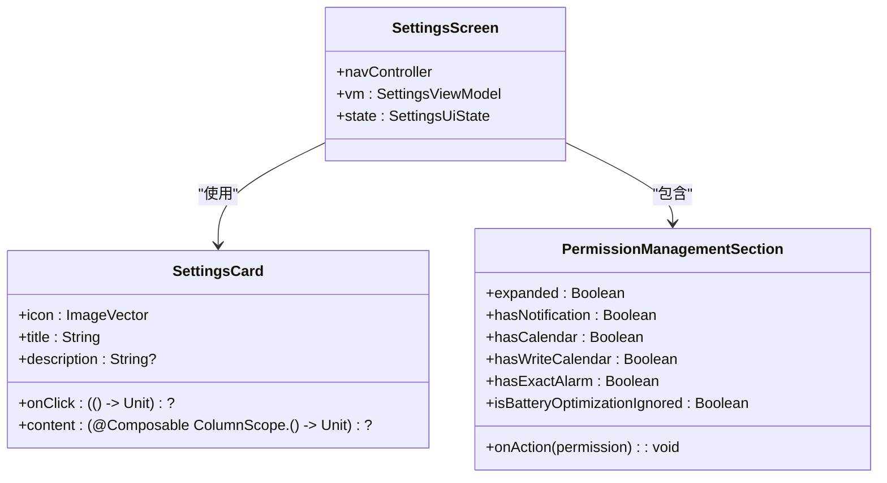
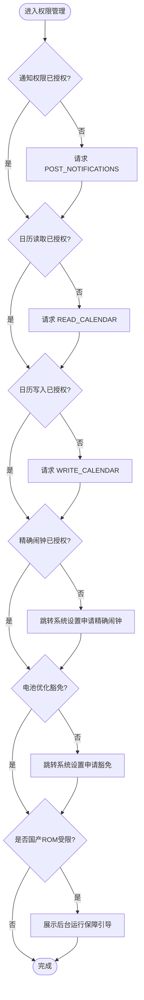
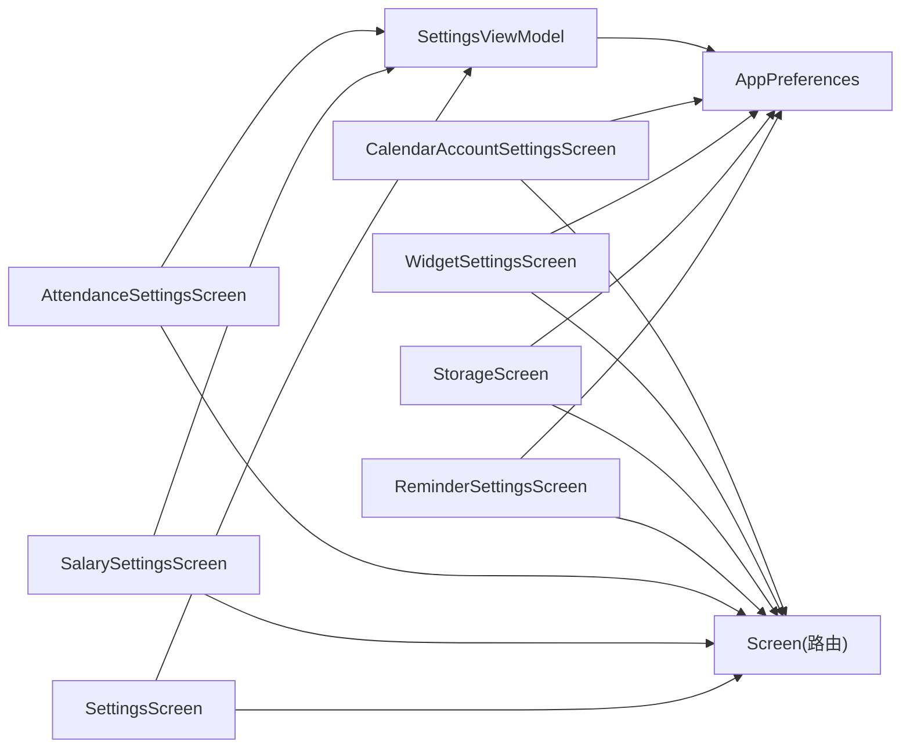

# 设置主界面

<cite>
**本文引用的文件**
- [SettingsScreen.kt](file://app/src/main/java/com/schedulecalendar/app/ui/settings/SettingsScreen.kt)
- [SettingsViewModel.kt](file://app/src/main/java/com/schedulecalendar/app/ui/settings/SettingsViewModel.kt)
- [SalarySettingsScreen.kt](file://app/src/main/java/com/schedulecalendar/app/ui/settings/SalarySettingsScreen.kt)
- [AttendanceSettingsScreen.kt](file://app/src/main/java/com/schedulecalendar/app/ui/settings/AttendanceSettingsScreen.kt)
- [ReminderSettingsScreen.kt](file://app/src/main/java/com/schedulecalendar/app/ui/settings/ReminderSettingsScreen.kt)
- [StorageScreen.kt](file://app/src/main/java/com/schedulecalendar/app/ui/settings/StorageScreen.kt)
- [WidgetSettingsScreen.kt](file://app/src/main/java/com/schedulecalendar/app/ui/settings/WidgetSettingsScreen.kt)
- [CalendarAccountSettingsScreen.kt](file://app/src/main/java/com/schedulecalendar/app/ui/settings/CalendarAccountSettingsScreen.kt)
- [AutoClockSettingsScreen.kt](file://app/src/main/java/com/schedulecalendar/app/ui/settings/AutoClockSettingsScreen.kt)
- [OtherSettingsScreen.kt](file://app/src/main/java/com/schedulecalendar/app/ui/settings/OtherSettingsScreen.kt)
- [CommonComponents.kt](file://app/src/main/java/com/schedulecalendar/app/ui/component/CommonComponents.kt)
- [Theme.kt](file://app/src/main/java/com/schedulecalendar/app/ui/theme/Theme.kt)
- [Screen.kt](file://app/src/main/java/com/schedulecalendar/app/ui/navigation/Screen.kt)
- [AppPreferences.kt](file://app/src/main/java/com/schedulecalendar/app/data/prefs/AppPreferences.kt)
</cite>

## 目录
1. [简介](#简介)
2. [项目结构](#项目结构)
3. [核心组件](#核心组件)
4. [架构总览](#架构总览)
5. [详细组件分析](#详细组件分析)
6. [依赖关系分析](#依赖关系分析)
7. [性能考量](#性能考量)
8. [故障排查指南](#故障排查指南)
9. [结论](#结论)
10. [附录](#附录)

## 简介
本文件围绕“设置主界面”进行系统化文档化，重点覆盖：
- SettingsScreen 的模块化设计与各设置入口（薪资配置、考勤配置、用户管理、上下班提醒、数据管理、小部件设置等）
- SettingsCard 组件的复用机制与可定制性
- 权限管理模块的实现（通知权限、日历读写、精确闹钟、电池优化豁免），以及国产 ROM 后台运行保障方案
- 响应式布局与 Material Design 3 主题适配

## 项目结构
设置相关代码集中在 ui/settings 包中，采用“页面即 Composable + ViewModel”的分层组织方式；通用 UI 能力在 ui/component 中提供；主题与导航分别位于 ui/theme 和 ui/navigation。

图表来源
- [SettingsScreen.kt:1-144](file://app/src/main/java/com/schedulecalendar/app/ui/settings/SettingsScreen.kt#L1-L144)
- [SettingsViewModel.kt:1-91](file://app/src/main/java/com/schedulecalendar/app/ui/settings/SettingsViewModel.kt#L1-L91)
- [SalarySettingsScreen.kt:1-90](file://app/src/main/java/com/schedulecalendar/app/ui/settings/SalarySettingsScreen.kt#L1-L90)
- [AttendanceSettingsScreen.kt:1-90](file://app/src/main/java/com/schedulecalendar/app/ui/settings/AttendanceSettingsScreen.kt#L1-L90)
- [ReminderSettingsScreen.kt:1-468](file://app/src/main/java/com/schedulecalendar/app/ui/settings/ReminderSettingsScreen.kt#L1-L468)
- [StorageScreen.kt:1-766](file://app/src/main/java/com/schedulecalendar/app/ui/settings/StorageScreen.kt#L1-L766)
- [WidgetSettingsScreen.kt:1-239](file://app/src/main/java/com/schedulecalendar/app/ui/settings/WidgetSettingsScreen.kt#L1-L239)
- [CalendarAccountSettingsScreen.kt:1-232](file://app/src/main/java/com/schedulecalendar/app/ui/settings/CalendarAccountSettingsScreen.kt#L1-L232)
- [CommonComponents.kt:1-440](file://app/src/main/java/com/schedulecalendar/app/ui/component/CommonComponents.kt#L1-L440)
- [Theme.kt:1-80](file://app/src/main/java/com/schedulecalendar/app/ui/theme/Theme.kt#L1-L80)
- [Screen.kt:1-34](file://app/src/main/java/com/schedulecalendar/app/ui/navigation/Screen.kt#L1-L34)
- [AppPreferences.kt:1-313](file://app/src/main/java/com/schedulecalendar/app/data/prefs/AppPreferences.kt#L1-L313)

章节来源
- [SettingsScreen.kt:1-144](file://app/src/main/java/com/schedulecalendar/app/ui/settings/SettingsScreen.kt#L1-L144)
- [Screen.kt:1-34](file://app/src/main/java/com/schedulecalendar/app/ui/navigation/Screen.kt#L1-L34)

## 核心组件
- SettingsScreen：设置主入口，聚合多个设置卡片并承载权限管理区块
- SettingsCard：统一的设置项卡片容器，支持标题、描述、点击跳转与扩展内容
- PermissionManagementSection：权限管理与引导的统一入口，涵盖通知、日历、精确闹钟、电池优化及国产 ROM 引导
- SettingsViewModel：设置页一次性事件与基础配置状态（薪资、考勤、显示方案等）

章节来源
- [SettingsScreen.kt:146-197](file://app/src/main/java/com/schedulecalendar/app/ui/settings/SettingsScreen.kt#L146-L197)
- [SettingsScreen.kt:201-427](file://app/src/main/java/com/schedulecalendar/app/ui/settings/SettingsScreen.kt#L201-L427)
- [SettingsViewModel.kt:19-91](file://app/src/main/java/com/schedulecalendar/app/ui/settings/SettingsViewModel.kt#L19-L91)

## 架构总览
设置主界面采用“UI 层（Composable）— ViewModel — 持久化（DataStore）”的分层模式。导航通过 Route 常量驱动，主题基于 Material3 动态色板。

图表来源
- [SettingsScreen.kt:40-144](file://app/src/main/java/com/schedulecalendar/app/ui/settings/SettingsScreen.kt#L40-L144)
- [SettingsViewModel.kt:44-64](file://app/src/main/java/com/schedulecalendar/app/ui/settings/SettingsViewModel.kt#L44-L64)
- [AppPreferences.kt:68-103](file://app/src/main/java/com/schedulecalendar/app/data/prefs/AppPreferences.kt#L68-L103)
- [Screen.kt:15-34](file://app/src/main/java/com/schedulecalendar/app/ui/navigation/Screen.kt#L15-L34)

## 详细组件分析

### SettingsScreen 与 SettingsCard
- 模块化设计：以 LazyColumn 承载多个设置项，每个设置项由 SettingsCard 统一渲染，保证一致的视觉与交互体验
- 可定制性：支持可选 description、onClick 跳转、content 插槽用于复杂内容（如“关于”版本信息）
- 权限管理区块：展开式卡片，按系统 API 级别差异化处理权限检查与引导

图表来源
- [SettingsScreen.kt:40-144](file://app/src/main/java/com/schedulecalendar/app/ui/settings/SettingsScreen.kt#L40-L144)
- [SettingsScreen.kt:146-197](file://app/src/main/java/com/schedulecalendar/app/ui/settings/SettingsScreen.kt#L146-L197)
- [SettingsScreen.kt:201-427](file://app/src/main/java/com/schedulecalendar/app/ui/settings/SettingsScreen.kt#L201-L427)

章节来源
- [SettingsScreen.kt:1-144](file://app/src/main/java/com/schedulecalendar/app/ui/settings/SettingsScreen.kt#L1-L144)
- [SettingsScreen.kt:146-197](file://app/src/main/java/com/schedulecalendar/app/ui/settings/SettingsScreen.kt#L146-L197)
- [SettingsScreen.kt:201-427](file://app/src/main/java/com/schedulecalendar/app/ui/settings/SettingsScreen.kt#L201-L427)

### 薪资配置（SalarySettingsScreen）
- 字段：底薪、绩效、正常/加班/周末/节假日时薪、社保、公积金
- 输入：ProtectedNumField 数字输入框，自动过滤非法字符，避免 IME 自动填充问题
- 保存：即时构建 SalaryConfig 并通过 SettingsViewModel.saveSalaryConfig 持久化

章节来源
- [SalarySettingsScreen.kt:1-90](file://app/src/main/java/com/schedulecalendar/app/ui/settings/SalarySettingsScreen.kt#L1-L90)
- [SettingsViewModel.kt:66-69](file://app/src/main/java/com/schedulecalendar/app/ui/settings/SettingsViewModel.kt#L66-L69)
- [AppPreferences.kt:68-74](file://app/src/main/java/com/schedulecalendar/app/data/prefs/AppPreferences.kt#L68-L74)

### 考勤配置（AttendanceSettingsScreen）
- 字段：加班粒度（单选）、迟到/早退容忍时间、迟到/早退提醒阈值、日标准工时、扣款规则
- 输入：ProtectedNumField + FilterChip 选择器
- 保存：构建 AttendConfig 并通过 SettingsViewModel.saveAttendConfig 持久化

章节来源
- [AttendanceSettingsScreen.kt:1-90](file://app/src/main/java/com/schedulecalendar/app/ui/settings/AttendanceSettingsScreen.kt#L1-L90)
- [SettingsViewModel.kt:66-69](file://app/src/main/java/com/schedulecalendar/app/ui/settings/SettingsViewModel.kt#L66-L69)
- [AppPreferences.kt:76-82](file://app/src/main/java/com/schedulecalendar/app/data/prefs/AppPreferences.kt#L76-L82)

### 用户管理（CalendarAccountSettingsScreen）
- 功能：列出系统已同步的日历账户，支持启用/禁用与分类（日程/纪念日）
- 权限：首次进入检查 READ_CALENDAR 权限，未授权则引导申请
- 数据：通过 AppPreferences 维护已禁用账户 ID 与账户分类映射

章节来源
- [CalendarAccountSettingsScreen.kt:1-232](file://app/src/main/java/com/schedulecalendar/app/ui/settings/CalendarAccountSettingsScreen.kt#L1-L232)
- [AppPreferences.kt:252-311](file://app/src/main/java/com/schedulecalendar/app/data/prefs/AppPreferences.kt#L252-L311)

### 上下班提醒（ReminderSettingsScreen）
- 功能：总开关、提醒方式（闹钟/日历）、提醒内容（上班/下班）、提前提醒时间（预设+自定义滚轮）
- 权限：需要日历读写权限，若未授予则请求并回调 ViewModel
- 保存：通过 ReminderSettingsViewModel 与 AppPreferences 持久化提醒配置

章节来源
- [ReminderSettingsScreen.kt:1-468](file://app/src/main/java/com/schedulecalendar/app/ui/settings/ReminderSettingsScreen.kt#L1-L468)
- [AppPreferences.kt:199-248](file://app/src/main/java/com/schedulecalendar/app/data/prefs/AppPreferences.kt#L199-L248)

### 数据管理（StorageScreen）
- 功能：存储空间可视化、应用数据备份/恢复、班次配置备份、从文件导入、备份路径设置、清理废弃数据、清空所有数据
- 存储：使用 SAF OpenDocument/OpenDocumentTree，兼容 content:// 与 FileProvider
- 交互：多处确认弹窗与 Snackbar 反馈

章节来源
- [StorageScreen.kt:1-766](file://app/src/main/java/com/schedulecalendar/app/ui/settings/StorageScreen.kt#L1-L766)

### 小部件设置（WidgetSettingsScreen）
- 功能：日历小组件与快捷打卡样式配置、长按快捷方式开关
- 实现：通过 Intent 启动 WidgetConfigActivity；动态快捷方式通过 ShortcutManager 增删

章节来源
- [WidgetSettingsScreen.kt:1-239](file://app/src/main/java/com/schedulecalendar/app/ui/settings/WidgetSettingsScreen.kt#L1-L239)

### 其他设置占位
- AutoClockSettingsScreen、OtherSettingsScreen 为“功能开发中”占位页

章节来源
- [AutoClockSettingsScreen.kt:1-25](file://app/src/main/java/com/schedulecalendar/app/ui/settings/AutoClockSettingsScreen.kt#L1-L25)
- [OtherSettingsScreen.kt:1-25](file://app/src/main/java/com/schedulecalendar/app/ui/settings/OtherSettingsScreen.kt#L1-L25)

### 权限管理模块详解
- 通知权限（Android 13+）：POST_NOTIFICATIONS，未授权时引导申请
- 日历读写权限：READ_CALENDAR/WRITE_CALENDAR，未授权时引导申请
- 精确闹钟权限：Android 13+ 自动授予；Android 12 需 ACTION_REQUEST_SCHEDULE_EXACT_ALARM
- 电池优化豁免：ACTION_REQUEST_IGNORE_BATTERY_OPTIMIZATIONS
- 国产 ROM 后台保障：检测厂商（小米/华为/OPPO/vivo 等），提示开启自启动、省电策略无限制、后台弹出界面、桌面快捷方式等

图表来源
- [SettingsScreen.kt:201-427](file://app/src/main/java/com/schedulecalendar/app/ui/settings/SettingsScreen.kt#L201-L427)

章节来源
- [SettingsScreen.kt:201-427](file://app/src/main/java/com/schedulecalendar/app/ui/settings/SettingsScreen.kt#L201-L427)

### 响应式设计与 Material Design 3 适配
- 布局：LazyColumn + PaddingValues + Spacing 组合，适配不同屏幕尺寸
- 主题：ScheduleCalendarTheme 基于 Material3，支持动态取色（Android 12+）与深色模式
- 组件：统一使用 ElevatedCard、FilterChip、OutlinedTextField、TopAppBar 等 M3 组件

章节来源
- [SettingsScreen.kt:146-197](file://app/src/main/java/com/schedulecalendar/app/ui/settings/SettingsScreen.kt#L146-L197)
- [Theme.kt:1-80](file://app/src/main/java/com/schedulecalendar/app/ui/theme/Theme.kt#L1-L80)
- [CommonComponents.kt:38-65](file://app/src/main/java/com/schedulecalendar/app/ui/component/CommonComponents.kt#L38-L65)

## 依赖关系分析
- UI 层依赖 ViewModel 暴露的状态流（collectAsStateWithLifecycle）
- ViewModel 依赖 AppPreferences 提供的 DataStore Flow 与保存方法
- 导航依赖 Screen.kt 中的 Route 常量
- 权限与系统服务通过 Android SDK 与 ActivityResultContracts 交互

图表来源
- [SettingsScreen.kt:40-144](file://app/src/main/java/com/schedulecalendar/app/ui/settings/SettingsScreen.kt#L40-L144)
- [SettingsViewModel.kt:44-64](file://app/src/main/java/com/schedulecalendar/app/ui/settings/SettingsViewModel.kt#L44-L64)
- [AppPreferences.kt:68-103](file://app/src/main/java/com/schedulecalendar/app/data/prefs/AppPreferences.kt#L68-L103)
- [Screen.kt:15-34](file://app/src/main/java/com/schedulecalendar/app/ui/navigation/Screen.kt#L15-L34)

章节来源
- [SettingsViewModel.kt:19-91](file://app/src/main/java/com/schedulecalendar/app/ui/settings/SettingsViewModel.kt#L19-L91)
- [AppPreferences.kt:1-313](file://app/src/main/java/com/schedulecalendar/app/data/prefs/AppPreferences.kt#L1-L313)

## 性能考量
- 使用 Flow + stateIn 将配置数据懒加载并在可见生命周期内收集，减少不必要的计算
- LazyColumn 按需渲染列表项，提升长列表滚动性能
- 权限状态刷新通过 repeatOnLifecycle 触发，避免重复请求
- DataStore 读写异步化，避免阻塞 UI 线程

[本节为通用指导，不直接分析具体文件]

## 故障排查指南
- 权限未生效：检查是否调用 rememberLauncherForActivityResult 并正确刷新状态（refreshTrigger++）
- 精确闹钟无效：确认 Android 版本分支逻辑与系统设置跳转是否成功
- 国产 ROM 后台被杀：确保已引导用户开启自启动、省电策略无限制、后台弹出界面与桌面快捷方式
- 备份失败：检查 SAF URI 权限是否持久化（takePersistableUriPermission）与 FileProvider 配置是否正确

章节来源
- [SettingsScreen.kt:201-427](file://app/src/main/java/com/schedulecalendar/app/ui/settings/SettingsScreen.kt#L201-L427)
- [StorageScreen.kt:66-81](file://app/src/main/java/com/schedulecalendar/app/ui/settings/StorageScreen.kt#L66-L81)

## 结论
设置主界面通过清晰的模块化设计与统一的 SettingsCard 组件，实现了高内聚、低耦合的可扩展架构。权限管理模块针对不同系统版本与厂商 ROM 做了细致适配，结合 Material3 主题与响应式布局，提供了良好的用户体验与可维护性。

[本节为总结性内容，不直接分析具体文件]

## 附录
- 路由定义参考：RouteSalarySettings、RouteAttendanceSettings、RouteCalendarAccountSettings、RouteReminderSettings、RouteStorage、RouteWidgetSettings 等
- 主题与颜色：ScheduleCalendarTheme 支持动态取色与深色模式

章节来源
- [Screen.kt:15-34](file://app/src/main/java/com/schedulecalendar/app/ui/navigation/Screen.kt#L15-L34)
- [Theme.kt:1-80](file://app/src/main/java/com/schedulecalendar/app/ui/theme/Theme.kt#L1-L80)