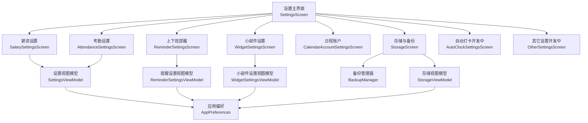
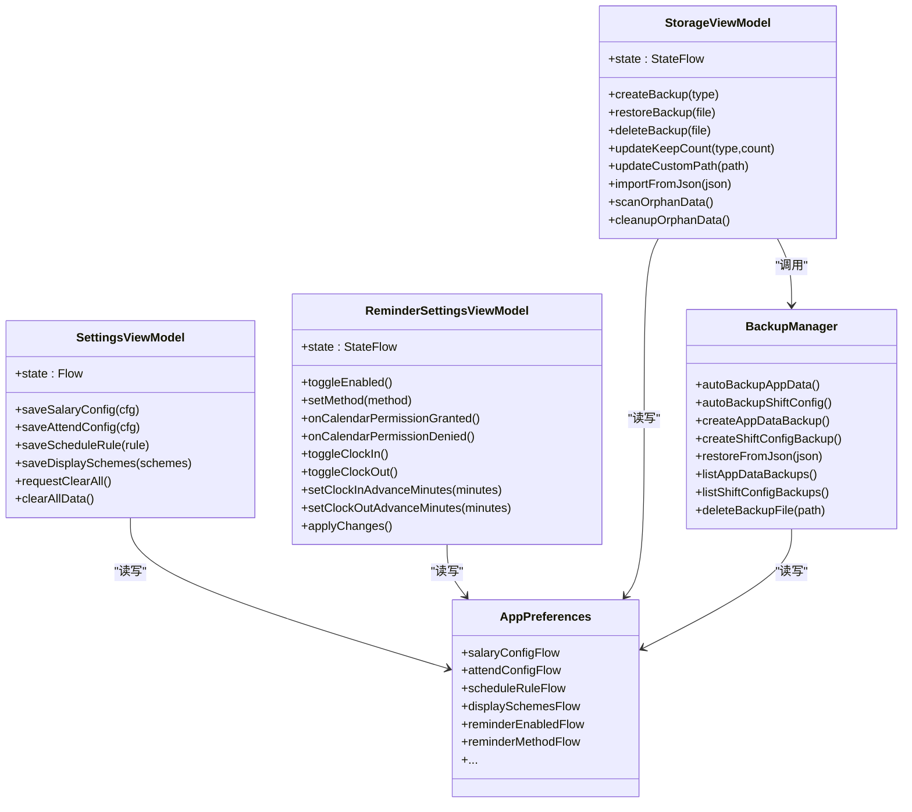
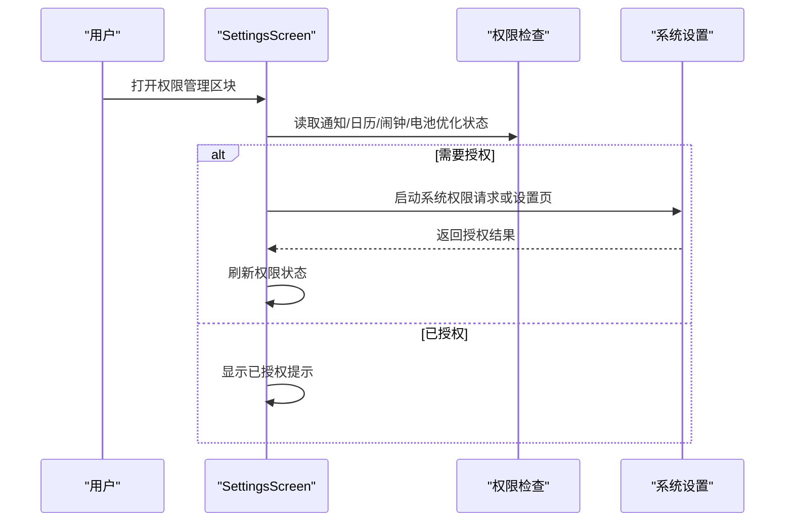
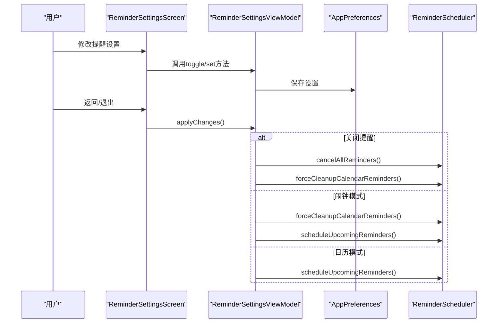
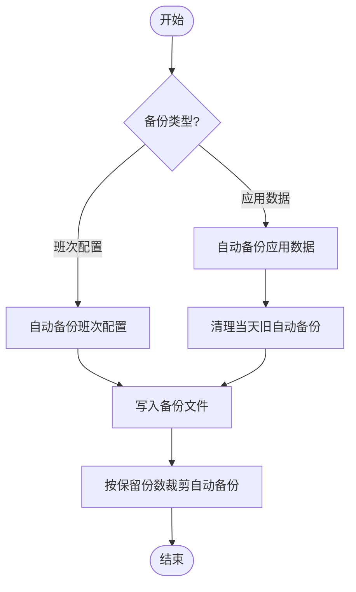
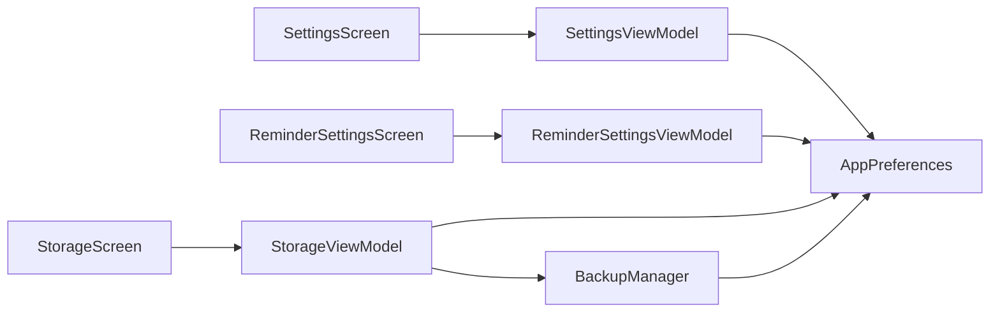

# 设置界面

<cite>
**本文引用的文件**   
- [SettingsScreen.kt](file://app/src/main/java/com/schedulecalendar/app/ui/settings/SettingsScreen.kt)
- [SettingsViewModel.kt](file://app/src/main/java/com/schedulecalendar/app/ui/settings/SettingsViewModel.kt)
- [AttendanceSettingsScreen.kt](file://app/src/main/java/com/schedulecalendar/app/ui/settings/AttendanceSettingsScreen.kt)
- [AutoClockSettingsScreen.kt](file://app/src/main/java/com/schedulecalendar/app/ui/settings/AutoClockSettingsScreen.kt)
- [ReminderSettingsScreen.kt](file://app/src/main/java/com/schedulecalendar/app/ui/settings/ReminderSettingsScreen.kt)
- [ReminderSettingsViewModel.kt](file://app/src/main/java/com/schedulecalendar/app/ui/settings/ReminderSettingsViewModel.kt)
- [SalarySettingsScreen.kt](file://app/src/main/java/com/schedulecalendar/app/ui/settings/SalarySettingsScreen.kt)
- [OtherSettingsScreen.kt](file://app/src/main/java/com/schedulecalendar/app/ui/settings/OtherSettingsScreen.kt)
- [WidgetSettingsScreen.kt](file://app/src/main/java/com/schedulecalendar/app/ui/settings/WidgetSettingsScreen.kt)
- [CalendarAccountSettingsScreen.kt](file://app/src/main/java/com/schedulecalendar/app/ui/settings/CalendarAccountSettingsScreen.kt)
- [StorageScreen.kt](file://app/src/main/java/com/schedulecalendar/app/ui/settings/StorageScreen.kt)
- [StorageViewModel.kt](file://app/src/main/java/com/schedulecalendar/app/ui/settings/StorageViewModel.kt)
- [BackupManager.kt](file://app/src/main/java/com/schedulecalendar/app/ui/settings/BackupManager.kt)
- [AppPreferences.kt](file://app/src/main/java/com/schedulecalendar/app/data/prefs/AppPreferences.kt)
- [SettingsUtils.kt](file://app/src/main/java/com/schedulecalendar/app/ui/settings/SettingsUtils.kt)
</cite>

## 目录
1. [简介](#简介)
2. [项目结构](#项目结构)
3. [核心组件](#核心组件)
4. [架构总览](#架构总览)
5. [详细组件分析](#详细组件分析)
6. [依赖关系分析](#依赖关系分析)
7. [性能考量](#性能考量)
8. [故障排查指南](#故障排查指南)
9. [结论](#结论)
10. [附录](#附录)

## 简介
本文件面向Android排班日历应用的“设置界面”模块，系统性阐述其模块化设计、数据持久化与校验、用户反馈机制、动态加载与条件显示、导入导出与备份恢复、可访问性与多语言适配等关键方面。文档以源码为依据，提供架构图、时序图与流程图，帮助读者快速理解并扩展该模块。

## 项目结构
设置界面采用按功能划分的模块化组织方式：
- 入口与导航：SettingsScreen 聚合各设置卡片，统一跳转至子页面
- 业务设置页：薪资设置、考勤设置、提醒设置、小部件设置、日历账户管理
- 存储与备份：StorageScreen + StorageViewModel + BackupManager
- 偏好与配置：AppPreferences（DataStore）集中管理所有设置项
- 通用工具：SettingsUtils（输入校验、数字输入保护）

**图表来源** 
- [SettingsScreen.kt:40-144](file://app/src/main/java/com/schedulecalendar/app/ui/settings/SettingsScreen.kt#L40-L144)
- [StorageScreen.kt:39-123](file://app/src/main/java/com/schedulecalendar/app/ui/settings/StorageScreen.kt#L39-L123)
- [BackupManager.kt:31-40](file://app/src/main/java/com/schedulecalendar/app/ui/settings/BackupManager.kt#L31-L40)
- [SettingsViewModel.kt:34-64](file://app/src/main/java/com/schedulecalendar/app/ui/settings/SettingsViewModel.kt#L34-L64)
- [ReminderSettingsViewModel.kt:42-76](file://app/src/main/java/com/schedulecalendar/app/ui/settings/ReminderSettingsViewModel.kt#L42-L76)
- [WidgetSettingsScreen.kt:184-198](file://app/src/main/java/com/schedulecalendar/app/ui/settings/WidgetSettingsScreen.kt#L184-L198)
- [StorageViewModel.kt:75-124](file://app/src/main/java/com/schedulecalendar/app/ui/settings/StorageViewModel.kt#L75-L124)
- [AppPreferences.kt:26-66](file://app/src/main/java/com/schedulecalendar/app/data/prefs/AppPreferences.kt#L26-L66)

**章节来源**
- [SettingsScreen.kt:40-144](file://app/src/main/java/com/schedulecalendar/app/ui/settings/SettingsScreen.kt#L40-L144)

## 核心组件
- SettingsViewModel：聚合薪资、考勤、排班规则、显示方案等设置的读取与保存；提供清空数据的UI事件流
- ReminderSettingsViewModel：管理提醒开关、提醒方式（闹钟/日历）、内容选择、提前时间，并在退出时统一调度
- StorageViewModel：备份列表、保留份数、自定义路径、导入导出、清空数据、废弃数据扫描与清理
- BackupManager：单例备份管理器，负责自动/手动备份、恢复、裁剪、SAF路径解析与读写
- AppPreferences：基于DataStore的偏好存储，暴露Flow供UI实时响应
- SettingsUtils：输入过滤、数字输入保护、格式化辅助

**章节来源**
- [SettingsViewModel.kt:34-90](file://app/src/main/java/com/schedulecalendar/app/ui/settings/SettingsViewModel.kt#L34-L90)
- [ReminderSettingsViewModel.kt:42-176](file://app/src/main/java/com/schedulecalendar/app/ui/settings/ReminderSettingsViewModel.kt#L42-L176)
- [StorageViewModel.kt:75-360](file://app/src/main/java/com/schedulecalendar/app/ui/settings/StorageViewModel.kt#L75-L360)
- [BackupManager.kt:31-579](file://app/src/main/java/com/schedulecalendar/app/ui/settings/BackupManager.kt#L31-L579)
- [AppPreferences.kt:26-313](file://app/src/main/java/com/schedulecalendar/app/data/prefs/AppPreferences.kt#L26-L313)
- [SettingsUtils.kt:18-70](file://app/src/main/java/com/schedulecalendar/app/ui/settings/SettingsUtils.kt#L18-L70)

## 架构总览
设置界面遵循MVVM+Compose架构：
- UI层（Composable Screen）通过hiltViewModel获取对应ViewModel状态
- ViewModel通过Repository与AppPreferences进行数据读写
- BackupManager作为跨模块共享的单例服务，处理备份/恢复逻辑
- DataStore提供线程安全的偏好存储与Flow响应

**图表来源** 
- [SettingsViewModel.kt:34-90](file://app/src/main/java/com/schedulecalendar/app/ui/settings/SettingsViewModel.kt#L34-L90)
- [ReminderSettingsViewModel.kt:42-176](file://app/src/main/java/com/schedulecalendar/app/ui/settings/ReminderSettingsViewModel.kt#L42-L176)
- [StorageViewModel.kt:75-360](file://app/src/main/java/com/schedulecalendar/app/ui/settings/StorageViewModel.kt#L75-L360)
- [BackupManager.kt:31-579](file://app/src/main/java/com/schedulecalendar/app/ui/settings/BackupManager.kt#L31-L579)
- [AppPreferences.kt:26-313](file://app/src/main/java/com/schedulecalendar/app/data/prefs/AppPreferences.kt#L26-L313)

## 详细组件分析

### 设置主界面（SettingsScreen）
- 功能要点
  - 聚合薪资、考勤、用户管理、上下班提醒、数据管理、小部件设置等入口
  - 权限管理区块：通知、日历读写、精确闹钟、电池优化豁免、国产ROM后台保障引导
  - “关于”展示版本信息
- 交互流程
  - 点击卡片通过NavController跳转到对应设置页
  - 权限项根据系统版本动态判断授权状态与操作入口

**图表来源** 
- [SettingsScreen.kt:202-427](file://app/src/main/java/com/schedulecalendar/app/ui/settings/SettingsScreen.kt#L202-L427)

**章节来源**
- [SettingsScreen.kt:40-144](file://app/src/main/java/com/schedulecalendar/app/ui/settings/SettingsScreen.kt#L40-L144)
- [SettingsScreen.kt:202-427](file://app/src/main/java/com/schedulecalendar/app/ui/settings/SettingsScreen.kt#L202-L427)

### 薪资设置（SalarySettingsScreen）
- 字段：底薪、绩效、正常/加班/周末/节假日时薪、社保、公积金
- 输入：ProtectedNumField 数字输入保护，避免IME自动填充“0”
- 保存：即时构建SalaryConfig并通过SettingsViewModel.saveSalaryConfig持久化

**章节来源**
- [SalarySettingsScreen.kt:38-90](file://app/src/main/java/com/schedulecalendar/app/ui/settings/SalarySettingsScreen.kt#L38-L90)
- [SettingsUtils.kt:34-70](file://app/src/main/java/com/schedulecalendar/app/ui/settings/SettingsUtils.kt#L34-L70)
- [SettingsViewModel.kt:66-69](file://app/src/main/java/com/schedulecalendar/app/ui/settings/SettingsViewModel.kt#L66-L69)

### 考勤设置（AttendanceSettingsScreen）
- 字段：加班粒度、迟到/早退容忍分钟、提醒阈值、日标准工时、迟到/早退扣款
- 校验：输入值范围限制（如0~120），非法值回退默认
- 保存：即时构建AttendConfig并通过SettingsViewModel.saveAttendConfig持久化

**章节来源**
- [AttendanceSettingsScreen.kt:34-90](file://app/src/main/java/com/schedulecalendar/app/ui/settings/AttendanceSettingsScreen.kt#L34-L90)
- [SettingsViewModel.kt:67-67](file://app/src/main/java/com/schedulecalendar/app/ui/settings/SettingsViewModel.kt#L67-L67)

### 自动打卡（AutoClockSettingsScreen）
- 当前为占位页面，提示“功能开发中”

**章节来源**
- [AutoClockSettingsScreen.kt:12-25](file://app/src/main/java/com/schedulecalendar/app/ui/settings/AutoClockSettingsScreen.kt#L12-L25)

### 上下班提醒（ReminderSettingsScreen + ReminderSettingsViewModel）
- 功能要点
  - 总开关、提醒方式（闹钟/日历）、上班/下班提醒开关、提前时间选择（预设+自定义滚轮）
  - 切换日历提醒前检查日历读写权限，未授权则触发权限申请流程
  - 退出页面时统一应用变更：关闭则取消提醒；闹钟模式清理日历事件并重新调度；日历模式重建事件
- 数据流
  - UI通过StateFlow订阅状态变化
  - 修改后写入AppPreferences，并调用ReminderScheduler进行调度

**图表来源** 
- [ReminderSettingsScreen.kt:35-247](file://app/src/main/java/com/schedulecalendar/app/ui/settings/ReminderSettingsScreen.kt#L35-L247)
- [ReminderSettingsViewModel.kt:161-176](file://app/src/main/java/com/schedulecalendar/app/ui/settings/ReminderSettingsViewModel.kt#L161-L176)

**章节来源**
- [ReminderSettingsScreen.kt:35-247](file://app/src/main/java/com/schedulecalendar/app/ui/settings/ReminderSettingsScreen.kt#L35-L247)
- [ReminderSettingsViewModel.kt:42-176](file://app/src/main/java/com/schedulecalendar/app/ui/settings/ReminderSettingsViewModel.kt#L42-L176)

### 小部件设置（WidgetSettingsScreen）
- 功能要点
  - 日历小组件与小部件快捷打卡的配置入口（跳转至WidgetConfigActivity）
  - 长按快捷方式开关：启用/禁用动态快捷方式（打卡入/出）
- 实现细节
  - 通过ShortcutManager更新动态快捷方式
  - 开关状态由AppPreferences.shortcutEnabledFlow驱动

**章节来源**
- [WidgetSettingsScreen.kt:43-126](file://app/src/main/java/com/schedulecalendar/app/ui/settings/WidgetSettingsScreen.kt#L43-L126)
- [WidgetSettingsScreen.kt:184-239](file://app/src/main/java/com/schedulecalendar/app/ui/settings/WidgetSettingsScreen.kt#L184-L239)

### 日程账户（CalendarAccountSettingsScreen）
- 功能要点
  - 列出系统日历账户，支持启用/禁用与分类（日程/纪念日）
  - 首次进入检查READ_CALENDAR权限，未授权则引导授权
- 数据流
  - 禁用ID与分类映射保存在AppPreferences

**章节来源**
- [CalendarAccountSettingsScreen.kt:29-148](file://app/src/main/java/com/schedulecalendar/app/ui/settings/CalendarAccountSettingsScreen.kt#L29-L148)

### 存储与备份（StorageScreen + StorageViewModel + BackupManager）
- 功能要点
  - 存储空间可视化（数据库、备份文件、可用空间）
  - 应用数据备份与班次配置备份：保留份数、立即备份、删除、分享
  - 从文件导入：支持JSON自动识别类型并恢复
  - 自定义备份路径：SAF目录选择与持久化URI权限
  - 数据清理：扫描并清理废弃数据（已归档且无引用）
  - 清空所有数据：删除数据库记录与偏好
- 备份策略
  - 自动备份：应用数据每天最新一条；班次配置每次修改生成新备份
  - 裁剪：按保留份数裁剪自动备份（手动备份不删除）
  - 恢复：始终从私有目录读取；导入从外部JSON恢复

**图表来源** 
- [BackupManager.kt:190-227](file://app/src/main/java/com/schedulecalendar/app/ui/settings/BackupManager.kt#L190-L227)
- [BackupManager.kt:252-274](file://app/src/main/java/com/schedulecalendar/app/ui/settings/BackupManager.kt#L252-L274)
- [BackupManager.kt:530-545](file://app/src/main/java/com/schedulecalendar/app/ui/settings/BackupManager.kt#L530-L545)

**章节来源**
- [StorageScreen.kt:39-483](file://app/src/main/java/com/schedulecalendar/app/ui/settings/StorageScreen.kt#L39-L483)
- [StorageViewModel.kt:75-360](file://app/src/main/java/com/schedulecalendar/app/ui/settings/StorageViewModel.kt#L75-L360)
- [BackupManager.kt:31-579](file://app/src/main/java/com/schedulecalendar/app/ui/settings/BackupManager.kt#L31-L579)

### 设置数据持久化与验证
- 持久化
  - 使用DataStore（app_config）存储各类配置，提供Flow以便UI实时响应
  - 备份相关键：保留份数、自定义路径、提醒设置、排序顺序、颜色索引、快捷方式开关等
- 验证
  - 输入过滤：金额/数字只保留数字与小数点，多小数点去重
  - 输入保护：ProtectedNumField防止IME自动填充“0”
  - 范围校验：如迟到/早退容忍分钟0~120，非法值回退默认

**章节来源**
- [AppPreferences.kt:26-313](file://app/src/main/java/com/schedulecalendar/app/data/prefs/AppPreferences.kt#L26-L313)
- [SettingsUtils.kt:18-70](file://app/src/main/java/com/schedulecalendar/app/ui/settings/SettingsUtils.kt#L18-L70)
- [AttendanceSettingsScreen.kt:49-58](file://app/src/main/java/com/schedulecalendar/app/ui/settings/AttendanceSettingsScreen.kt#L49-L58)

### 设置项的动态加载与条件显示
- 动态加载
  - SettingsViewModel通过combine合并多个Flow，构建SettingsUiState
  - StorageViewModel在初始化时加载保留份数、自定义路径与备份列表
- 条件显示
  - 权限管理区块根据系统版本与权限状态动态显示操作按钮
  - 提醒设置根据enabled与方法动态显示相应选项与说明

**章节来源**
- [SettingsViewModel.kt:54-64](file://app/src/main/java/com/schedulecalendar/app/ui/settings/SettingsViewModel.kt#L54-L64)
- [StorageViewModel.kt:93-124](file://app/src/main/java/com/schedulecalendar/app/ui/settings/StorageViewModel.kt#L93-L124)
- [SettingsScreen.kt:232-262](file://app/src/main/java/com/schedulecalendar/app/ui/settings/SettingsScreen.kt#L232-L262)
- [ReminderSettingsScreen.kt:127-244](file://app/src/main/java/com/schedulecalendar/app/ui/settings/ReminderSettingsScreen.kt#L127-L244)

### 设置导入导出与备份恢复
- 导出
  - 手动备份：创建应用数据/班次配置JSON，支持SAF与私有目录
  - 分享：兼容SAF URI与FileProvider
- 导入
  - 从外部JSON导入，自动识别类型并恢复
- 恢复
  - 从私有目录恢复应用数据/班次配置
  - 从外部JSON恢复（restoreFromJson）

**章节来源**
- [BackupManager.kt:278-316](file://app/src/main/java/com/schedulecalendar/app/ui/settings/BackupManager.kt#L278-L316)
- [BackupManager.kt:353-377](file://app/src/main/java/com/schedulecalendar/app/ui/settings/BackupManager.kt#L353-L377)
- [StorageScreen.kt:44-53](file://app/src/main/java/com/schedulecalendar/app/ui/settings/StorageScreen.kt#L44-L53)
- [StorageViewModel.kt:262-269](file://app/src/main/java/com/schedulecalendar/app/ui/settings/StorageViewModel.kt#L262-L269)

### 可访问性与多语言适配
- 可访问性
  - Compose Material3组件默认支持语义描述；图标contentDescription为空时由系统推断
  - 权限项与操作按钮具备明确文本与状态指示
- 多语言
  - 字符串资源位于res/values/strings.xml，建议将界面文案抽取为资源以实现多语言
  - 当前代码中部分硬编码中文，建议在后续迭代中迁移至资源文件

[本节为概念性说明，不直接分析具体文件]

## 依赖关系分析
- 组件耦合
  - SettingsScreen依赖SettingsViewModel进行状态管理与数据保存
  - ReminderSettingsScreen依赖ReminderSettingsViewModel进行提醒设置与调度
  - StorageScreen依赖StorageViewModel与BackupManager完成备份/恢复
  - 所有设置均通过AppPreferences进行持久化
- 外部依赖
  - DataStore用于偏好存储
  - SAF（DocumentsContract）用于外部存储访问
  - ShortcutManager用于动态快捷方式
  - AlarmManager/Calendar权限用于提醒与事件

**图表来源** 
- [SettingsScreen.kt:40-144](file://app/src/main/java/com/schedulecalendar/app/ui/settings/SettingsScreen.kt#L40-L144)
- [ReminderSettingsScreen.kt:35-247](file://app/src/main/java/com/schedulecalendar/app/ui/settings/ReminderSettingsScreen.kt#L35-L247)
- [StorageScreen.kt:39-123](file://app/src/main/java/com/schedulecalendar/app/ui/settings/StorageScreen.kt#L39-L123)
- [StorageViewModel.kt:75-124](file://app/src/main/java/com/schedulecalendar/app/ui/settings/StorageViewModel.kt#L75-L124)
- [BackupManager.kt:31-40](file://app/src/main/java/com/schedulecalendar/app/ui/settings/BackupManager.kt#L31-L40)
- [AppPreferences.kt:26-66](file://app/src/main/java/com/schedulecalendar/app/data/prefs/AppPreferences.kt#L26-L66)

**章节来源**
- [SettingsScreen.kt:40-144](file://app/src/main/java/com/schedulecalendar/app/ui/settings/SettingsScreen.kt#L40-L144)
- [StorageScreen.kt:39-123](file://app/src/main/java/com/schedulecalendar/app/ui/settings/StorageScreen.kt#L39-L123)
- [BackupManager.kt:31-40](file://app/src/main/java/com/schedulecalendar/app/ui/settings/BackupManager.kt#L31-L40)
- [AppPreferences.kt:26-66](file://app/src/main/java/com/schedulecalendar/app/data/prefs/AppPreferences.kt#L26-L66)

## 性能考量
- 备份列表与裁剪
  - 使用DocumentsContract一次性查询SAF目录，避免DocumentFile多次IPC
  - 仅列出文件，不在页面加载时执行裁剪，保证秒开体验
- 数据流与状态
  - 使用StateFlow/Flow减少不必要的重组与计算
  - combine合并多个偏好Flow，集中构建UI状态
- 输入与校验
  - ProtectedNumField延迟抑制IME自动填充，降低无效输入处理开销

**章节来源**
- [BackupManager.kt:66-106](file://app/src/main/java/com/schedulecalendar/app/ui/settings/BackupManager.kt#L66-L106)
- [StorageViewModel.kt:93-124](file://app/src/main/java/com/schedulecalendar/app/ui/settings/StorageViewModel.kt#L93-L124)
- [SettingsViewModel.kt:54-64](file://app/src/main/java/com/schedulecalendar/app/ui/settings/SettingsViewModel.kt#L54-L64)
- [SettingsUtils.kt:34-70](file://app/src/main/java/com/schedulecalendar/app/ui/settings/SettingsUtils.kt#L34-L70)

## 故障排查指南
- 权限问题
  - 通知权限（Android 13+）：需在权限管理区块中请求授权
  - 日历读写权限：提醒设置切换到日历模式前需授权
  - 精确闹钟（Android 12）：需前往系统设置手动开启
  - 电池优化豁免：引导用户设置为无限制
- 备份失败
  - 检查SAF目录权限是否持久化
  - 确认自定义路径是否为有效SAF URI或真实文件系统路径
  - 查看备份文件命名与前缀是否符合规范
- 恢复失败
  - 确认JSON格式正确，包含预期字段（scheduleRecords或shifts）
  - 优先从私有目录恢复，确保文件存在

**章节来源**
- [SettingsScreen.kt:232-262](file://app/src/main/java/com/schedulecalendar/app/ui/settings/SettingsScreen.kt#L232-L262)
- [ReminderSettingsViewModel.kt:86-123](file://app/src/main/java/com/schedulecalendar/app/ui/settings/ReminderSettingsViewModel.kt#L86-L123)
- [BackupManager.kt:109-132](file://app/src/main/java/com/schedulecalendar/app/ui/settings/BackupManager.kt#L109-L132)
- [BackupManager.kt:353-377](file://app/src/main/java/com/schedulecalendar/app/ui/settings/BackupManager.kt#L353-L377)

## 结论
设置界面通过清晰的模块化设计与MVVM架构，实现了薪资、考勤、提醒、小部件、账户与存储备份等功能的统一管理。数据持久化采用DataStore与Flow，保证了状态一致性与实时响应。备份管理器支持自动/手动备份、裁剪与恢复，兼容SAF与私有目录。权限管理与国产ROM引导提升了用户体验与可靠性。后续建议完善多语言资源与更多设置项的国际化。

## 附录
- 常用设置键（AppPreferences）
  - 薪资配置：KEY_SALARY_CONFIG
  - 考勤配置：KEY_ATTEND_CONFIG
  - 排班规则：KEY_SCHEDULE_RULE
  - 显示方案：KEY_DISPLAY_SCHEMES
  - 提醒设置：KEY_REMINDER_ENABLED/METHOD/CLOCK_IN/CLOCK_OUT/MINUTES
  - 排序与颜色：KEY_SHIFT_ORDER/STATUS_ORDER/EXTRA_ORDER/BREAK_ORDER, KEY_SHIFT_COLOR_INDEX/STATUS_COLOR_INDEX
  - 备份设置：KEY_APP_DATA_KEEP_COUNT/SHIFT_CONFIG_KEEP_COUNT/BACKUP_CUSTOM_PATH
  - 快捷方式：KEY_SHORTCUT_ENABLED

[本节为概念性说明，不直接分析具体文件]