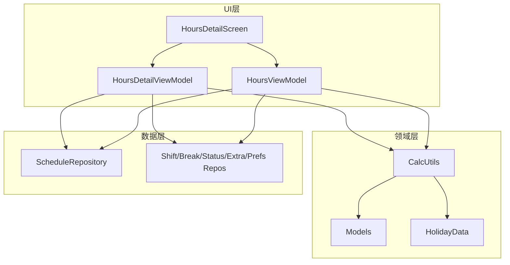
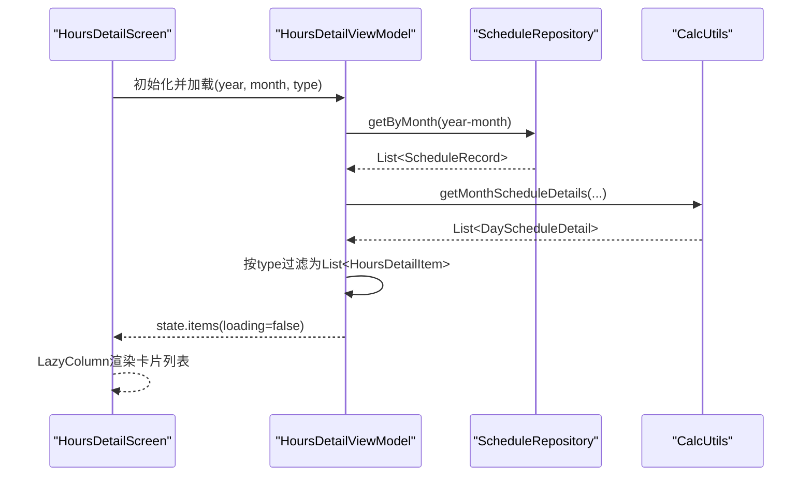
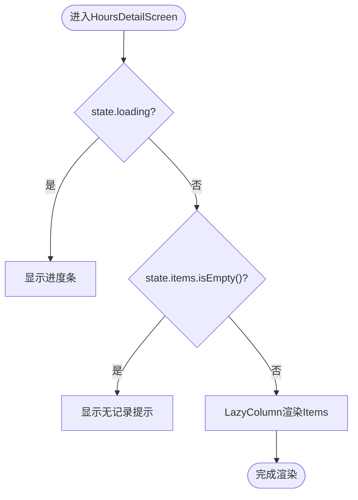
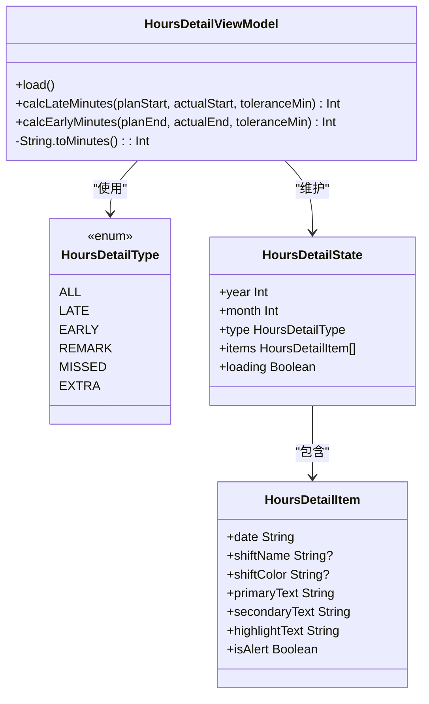
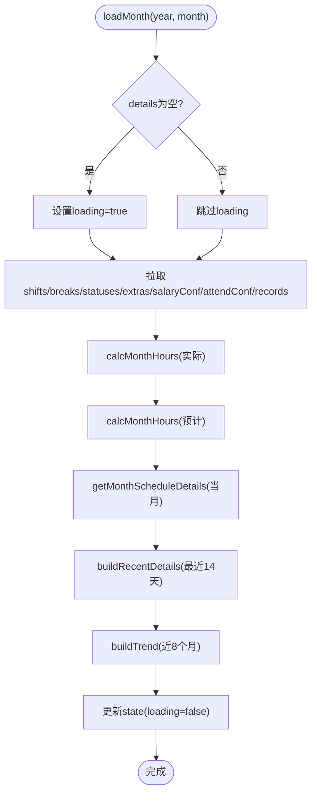
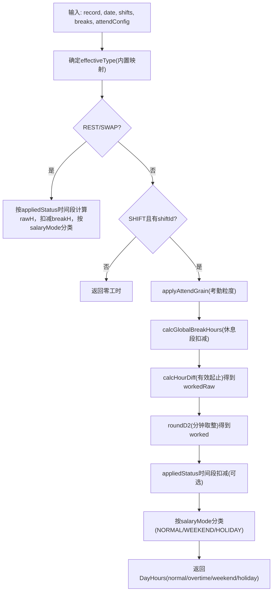
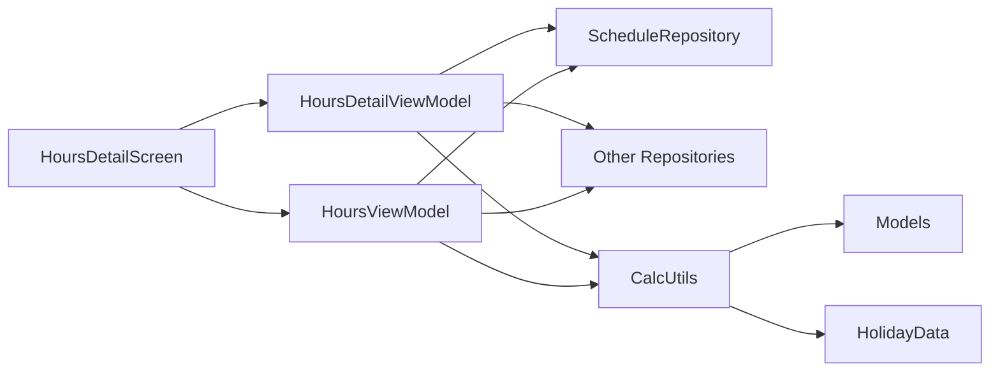

# 工时详情界面

<cite>
**本文引用的文件**   
- [HoursDetailScreen.kt](file://app/src/main/java/com/schedulecalendar/app/ui/detail/HoursDetailScreen.kt)
- [DetailViewModels.kt](file://app/src/main/java/com/schedulecalendar/app/ui/detail/DetailViewModels.kt)
- [HoursViewModel.kt](file://app/src/main/java/com/schedulecalendar/app/ui/hours/HoursViewModel.kt)
- [CalcUtils.kt](file://app/src/main/java/com/schedulecalendar/app/domain/model/CalcUtils.kt)
- [Models.kt](file://app/src/main/java/com/schedulecalendar/app/domain/model/Models.kt)
- [ScheduleRepository.kt](file://app/src/main/java/com/schedulecalendar/app/data/repository/ScheduleRepository.kt)
- [Screen.kt](file://app/src/main/java/com/schedulecalendar/app/ui/navigation/Screen.kt)
</cite>

## 目录
1. [简介](#简介)
2. [项目结构](#项目结构)
3. [核心组件](#核心组件)
4. [架构总览](#架构总览)
5. [详细组件分析](#详细组件分析)
6. [依赖关系分析](#依赖关系分析)
7. [性能考量](#性能考量)
8. [故障排查指南](#故障排查指南)
9. [结论](#结论)
10. [附录](#附录)

## 简介
本文件围绕“工时详情界面”的设计与实现进行系统化说明，覆盖以下关键主题：
- HoursDetailScreen 的 UI 结构与交互流程
- 工时统计数据的聚合计算逻辑（正常、加班、周末、节假日、请假、调休等）
- 图表可视化与时间范围筛选（近14天明细、近8个月趋势）
- 数据刷新机制与状态管理
- 不同视图模式的切换逻辑（完整工时、迟到记录、早退记录、备注、漏打卡、补贴扣款）
- 数据导出能力与性能优化策略
- 用户交互流程、错误处理与最佳实践

## 项目结构
工时详情功能涉及 UI 层、业务计算层与数据访问层：
- UI 层：HoursDetailScreen（Compose 界面）、HoursDetailViewModel（状态与事件）
- 业务层：CalcUtils（工时/薪资计算工具）、HolidayData（节假日与节气）
- 数据层：ScheduleRepository（排班记录读写）、其他仓库（班次、休息段、状态、附加项、偏好）
- 导航：RouteHoursDetail（路由参数 year/month/type）

**图示来源** 
- [HoursDetailScreen.kt:24-86](file://app/src/main/java/com/schedulecalendar/app/ui/detail/HoursDetailScreen.kt#L24-L86)
- [DetailViewModels.kt:260-425](file://app/src/main/java/com/schedulecalendar/app/ui/detail/DetailViewModels.kt#L260-L425)
- [HoursViewModel.kt:52-208](file://app/src/main/java/com/schedulecalendar/app/ui/hours/HoursViewModel.kt#L52-L208)
- [CalcUtils.kt:16-557](file://app/src/main/java/com/schedulecalendar/app/domain/model/CalcUtils.kt#L16-L557)
- [Models.kt:1-278](file://app/src/main/java/com/schedulecalendar/app/domain/model/Models.kt#L1-L278)
- [ScheduleRepository.kt:13-40](file://app/src/main/java/com/schedulecalendar/app/data/repository/ScheduleRepository.kt#L13-L40)

**章节来源**
- [HoursDetailScreen.kt:24-86](file://app/src/main/java/com/schedulecalendar/app/ui/detail/HoursDetailScreen.kt#L24-L86)
- [DetailViewModels.kt:260-425](file://app/src/main/java/com/schedulecalendar/app/ui/detail/DetailViewModels.kt#L260-L425)
- [HoursViewModel.kt:52-208](file://app/src/main/java/com/schedulecalendar/app/ui/hours/HoursViewModel.kt#L52-L208)
- [CalcUtils.kt:16-557](file://app/src/main/java/com/schedulecalendar/app/domain/model/CalcUtils.kt#L16-L557)
- [Models.kt:1-278](file://app/src/main/java/com/schedulecalendar/app/domain/model/Models.kt#L1-L278)
- [ScheduleRepository.kt:13-40](file://app/src/main/java/com/schedulecalendar/app/data/repository/ScheduleRepository.kt#L13-L40)

## 核心组件
- HoursDetailScreen：基于 Compose 的列表展示，顶部标题显示“年·月·类型”，支持加载态与空数据态。
- HoursDetailViewModel：根据路由参数 year/month/type 加载当月排班并生成明细列表；支持迟到、早退、备注、漏打卡、补贴扣款等视图模式。
- HoursViewModel：负责工时主页面（月度汇总、每日明细、最近14天明细、近8个月趋势），提供月份切换与自动刷新。
- CalcUtils：工时/薪资计算核心，包含考勤粒度、休息段扣减、日工时分类、月汇总、薪资汇总、每日明细生成等。
- Models：领域模型定义（班次、状态、附加项、配置、汇总对象等）。
- ScheduleRepository：排班记录的查询与变更信号，驱动 ViewModel 刷新。

**章节来源**
- [HoursDetailScreen.kt:24-86](file://app/src/main/java/com/schedulecalendar/app/ui/detail/HoursDetailScreen.kt#L24-L86)
- [DetailViewModels.kt:260-425](file://app/src/main/java/com/schedulecalendar/app/ui/detail/DetailViewModels.kt#L260-L425)
- [HoursViewModel.kt:52-208](file://app/src/main/java/com/schedulecalendar/app/ui/hours/HoursViewModel.kt#L52-L208)
- [CalcUtils.kt:16-557](file://app/src/main/java/com/schedulecalendar/app/domain/model/CalcUtils.kt#L16-L557)
- [Models.kt:1-278](file://app/src/main/java/com/schedulecalendar/app/domain/model/Models.kt#L1-L278)
- [ScheduleRepository.kt:13-40](file://app/src/main/java/com/schedulecalendar/app/data/repository/ScheduleRepository.kt#L13-L40)

## 架构总览
工时详情界面的数据流遵循 MVVM + Flow 的模式：
- UI 通过 collectAsStateWithLifecycle 订阅 ViewModel 的 state
- ViewModel 在 init/load 中从 Repository 获取数据，调用 CalcUtils 计算，更新 StateFlow
- 数据变更通过 SharedFlow/Channel 触发 UI 事件（如导航、错误提示）

**图示来源** 
- [HoursDetailScreen.kt:24-86](file://app/src/main/java/com/schedulecalendar/app/ui/detail/HoursDetailScreen.kt#L24-L86)
- [DetailViewModels.kt:288-405](file://app/src/main/java/com/schedulecalendar/app/ui/detail/DetailViewModels.kt#L288-L405)
- [HoursViewModel.kt:84-146](file://app/src/main/java/com/schedulecalendar/app/ui/hours/HoursViewModel.kt#L84-L146)
- [CalcUtils.kt:448-486](file://app/src/main/java/com/schedulecalendar/app/domain/model/CalcUtils.kt#L448-L486)
- [ScheduleRepository.kt:25-26](file://app/src/main/java/com/schedulecalendar/app/data/repository/ScheduleRepository.kt#L25-L26)

## 详细组件分析

### HoursDetailScreen（UI 层）
- 顶部标题：显示“年·月·类型”，返回按钮使用 navController.popBackStack()
- 加载态：居中进度条
- 空数据态：绿色对勾图标+提示文案
- 列表展示：LazyColumn 渲染 HoursDetailItemCard，每条卡片包含日期、班次标签、主要/次要文本、高亮值（如金额或时长）
- 颜色与样式：根据 isAlert 切换背景与边框色；班次颜色来自 shiftColor，默认回退到绿色

**图示来源** 
- [HoursDetailScreen.kt:24-86](file://app/src/main/java/com/schedulecalendar/app/ui/detail/HoursDetailScreen.kt#L24-L86)

**章节来源**
- [HoursDetailScreen.kt:24-86](file://app/src/main/java/com/schedulecalendar/app/ui/detail/HoursDetailScreen.kt#L24-L86)

### HoursDetailViewModel（状态与事件）
- 路由参数解析：year、month、type（all/late/early/remark/missed/extra）
- 数据加载：在 IO 线程执行，避免阻塞主线程；读取班次、休息段、状态、附加项、薪资与考勤配置，拉取当月排班记录，生成 DayScheduleDetail 列表
- 视图模式过滤：
  - 完整工时：显示有记录的日期，展示工时与薪资
  - 迟到记录：实际上班打卡晚于计划且超过容忍阈值
  - 早退记录：实际下班早于计划且超过容忍阈值
  - 备注：存在备注的日期
  - 漏打卡：非休息/调休班次且缺少上下班打卡
  - 补贴扣款：存在附加项的日期
- 结果更新：将过滤后的 HoursDetailItem 列表写入 state，关闭 loading

**图示来源** 
- [DetailViewModels.kt:260-425](file://app/src/main/java/com/schedulecalendar/app/ui/detail/DetailViewModels.kt#L260-L425)

**章节来源**
- [DetailViewModels.kt:260-425](file://app/src/main/java/com/schedulecalendar/app/ui/detail/DetailViewModels.kt#L260-L425)

### HoursViewModel（工时主页面）
- 状态字段：year/month、actual/future（实际/预计工时）、details（当月每日明细）、recentDetails（最近14天明细）、trend（近8个月趋势）、attendConfig、loading
- 数据加载：监听 scheduleRepo.refreshSignal 自动刷新；首次加载显示 loading，后续刷新保持内容
- 计算逻辑：
  - 实际工时：历史月=全月，当前月≤今天，未来月=空
  - 预计工时：历史月=null，当前月>今天，未来月=全月
  - 每日明细：getMonthScheduleDetails
  - 最近14天明细：跨月合并两个月的明细后筛选
  - 近8个月趋势：逐月计算汇总，不含未来月
- 月份切换：goToPrevMonth/goToNextMonth/goToMonth

**图示来源** 
- [HoursViewModel.kt:84-146](file://app/src/main/java/com/schedulecalendar/app/ui/hours/HoursViewModel.kt#L84-L146)
- [HoursViewModel.kt:148-202](file://app/src/main/java/com/schedulecalendar/app/ui/hours/HoursViewModel.kt#L148-L202)

**章节来源**
- [HoursViewModel.kt:52-208](file://app/src/main/java/com/schedulecalendar/app/ui/hours/HoursViewModel.kt#L52-L208)

### CalcUtils（工时/薪资计算核心）
- 基础工具：时间转换、归一化跨天区间、小时差计算、月份天数
- 考勤粒度：applyAttendGrain 处理早到/迟到/晚退/早退，考虑忽略选项与容忍阈值
- 全局休息段：calcGlobalBreakHours 计算与班次时间窗重叠的休息时长
- 日工时：calcDayHours 按日期类型（工作日/周末/节假日）分类，应用休息段与状态时间段扣减，按计薪方式归类
- 月汇总：calcMonthHours 累计正常/加班/周末/节假日工时，统计请假/调休/休息天数，迟到/早退次数，状态时段工时
- 薪资汇总：calcMonthSalary 按费率计算各部分薪资，叠加补贴/扣款，扣除社保公积金
- 每日明细：getMonthScheduleDetails 生成日历格子展示数据（工时与薪资）
- 自动计薪模式：autoSalaryMode 依据节假日与周末判断

**图示来源** 
- [CalcUtils.kt:149-234](file://app/src/main/java/com/schedulecalendar/app/domain/model/CalcUtils.kt#L149-L234)
- [CalcUtils.kt:238-361](file://app/src/main/java/com/schedulecalendar/app/domain/model/CalcUtils.kt#L238-L361)
- [CalcUtils.kt:448-486](file://app/src/main/java/com/schedulecalendar/app/domain/model/CalcUtils.kt#L448-L486)

**章节来源**
- [CalcUtils.kt:16-557](file://app/src/main/java/com/schedulecalendar/app/domain/model/CalcUtils.kt#L16-L557)

### Models（领域模型）
- 内置常量：BUILTIN_SHIFT_*、BUILTIN_STATUS_*、NO_SCHEME_ID
- 数据结构：ShiftBreak、ShiftStatus、AppliedStatus、ScheduleRecord、ExtraItem、SalaryConfig、AttendConfig
- 枚举：ScheduleType、SalaryMode、DisplayItemType
- 显示方案：DisplayScheme、DataRowConfig
- 汇总对象：HoursSummary、SalarySummary、DayScheduleDetail

**章节来源**
- [Models.kt:1-278](file://app/src/main/java/com/schedulecalendar/app/domain/model/Models.kt#L1-L278)

### 导航与路由
- RouteHoursDetail：携带 year、month、type（默认 all）
- HoursDetailScreen 通过 NavController 返回上一级

**章节来源**
- [Screen.kt:16-18](file://app/src/main/java/com/schedulecalendar/app/ui/navigation/Screen.kt#L16-L18)
- [HoursDetailScreen.kt:24-34](file://app/src/main/java/com/schedulecalendar/app/ui/detail/HoursDetailScreen.kt#L24-L34)

## 依赖关系分析
- HoursDetailScreen 依赖 HoursDetailViewModel 与 HoursViewModel
- HoursDetailViewModel 依赖 ScheduleRepository、ShiftRepository、ShiftBreakRepository、ShiftStatusRepository、ExtraItemRepository、AppPreferences、CalcUtils
- HoursViewModel 依赖相同的数据仓库与 CalcUtils
- CalcUtils 依赖 Models 与 HolidayData

**图示来源** 
- [HoursDetailScreen.kt:24-86](file://app/src/main/java/com/schedulecalendar/app/ui/detail/HoursDetailScreen.kt#L24-L86)
- [DetailViewModels.kt:260-425](file://app/src/main/java/com/schedulecalendar/app/ui/detail/DetailViewModels.kt#L260-L425)
- [HoursViewModel.kt:52-208](file://app/src/main/java/com/schedulecalendar/app/ui/hours/HoursViewModel.kt#L52-L208)
- [CalcUtils.kt:16-557](file://app/src/main/java/com/schedulecalendar/app/domain/model/CalcUtils.kt#L16-L557)
- [Models.kt:1-278](file://app/src/main/java/com/schedulecalendar/app/domain/model/Models.kt#L1-L278)

**章节来源**
- [ScheduleRepository.kt:13-40](file://app/src/main/java/com/schedulecalendar/app/data/repository/ScheduleRepository.kt#L13-L40)

## 性能考量
- 异步加载：HoursDetailViewModel 使用 withContext(IO) 执行数据加载与计算，避免阻塞主线程
- 增量刷新：HoursViewModel 监听 refreshSignal，仅在首次加载时显示 loading，后续刷新不中断现有内容
- 列表渲染：使用 LazyColumn 按需渲染，减少内存占用
- 数据复用：DayScheduleDetail 与 HoursDetailItem 结构清晰，便于缓存与复用
- 计算优化：CalcUtils 中的 roundD2 与 floorGrain 控制精度与粒度，避免浮点误差累积

[本节为通用性能建议，无需特定文件引用]

## 故障排查指南
- 加载失败：HoursViewModel 捕获异常并发送 ShowError 事件；确保 Repository 连接与 DAO 正确
- 空数据：检查当月是否有排班记录；确认 dateFilter 条件（当前月仅≤今天）
- 迟到/早退计数异常：核对 AttendConfig 的容忍阈值与考勤粒度设置
- 薪资计算偏差：检查 SalaryConfig 的费率与附加项类型（allowance/deduction）
- 节假日识别：确认 HolidayData 的法定节假日与补班数据是否最新

**章节来源**
- [HoursViewModel.kt:141-145](file://app/src/main/java/com/schedulecalendar/app/ui/hours/HoursViewModel.kt#L141-L145)
- [DetailViewModels.kt:205-224](file://app/src/main/java/com/schedulecalendar/app/ui/detail/DetailViewModels.kt#L205-L224)

## 结论
工时详情界面通过清晰的 MVVM 架构与 Flow 驱动的状态管理，实现了灵活的视图模式切换与高效的工时统计计算。CalcUtils 提供了严谨的业务逻辑，涵盖考勤规则、休息段扣减、薪资计算与节假日判定。结合 Compose 的声明式 UI 与 LazyColumn 的性能优化，整体体验流畅且可扩展。建议在后续迭代中继续完善数据导出功能与图表渲染优化，以提升数据分析能力与用户体验。

[本节为总结性内容，无需特定文件引用]

## 附录
- 用户交互流程：进入详情页 → 选择视图模式 → 加载数据 → 渲染列表 → 点击返回
- 状态管理：StateFlow 暴露 UI 状态，SharedFlow/Channel 传递一次性事件
- 错误处理：tryCatching 包裹数据操作，失败时发送错误事件并降级 UI
- 数据导出：当前未实现直接导出接口，可在 HoursDetailViewModel 中扩展序列化与分享功能

[本节为补充信息，无需特定文件引用]