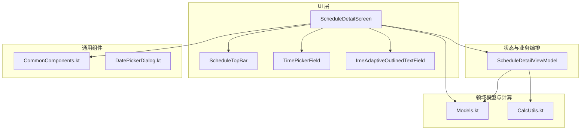
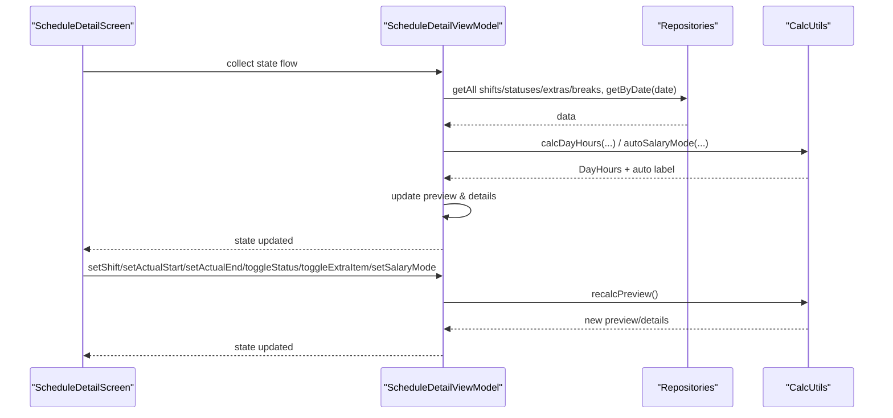
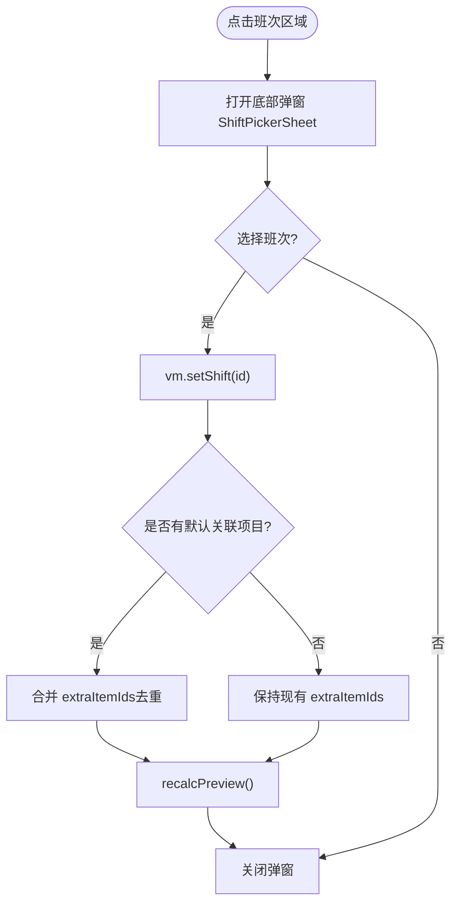
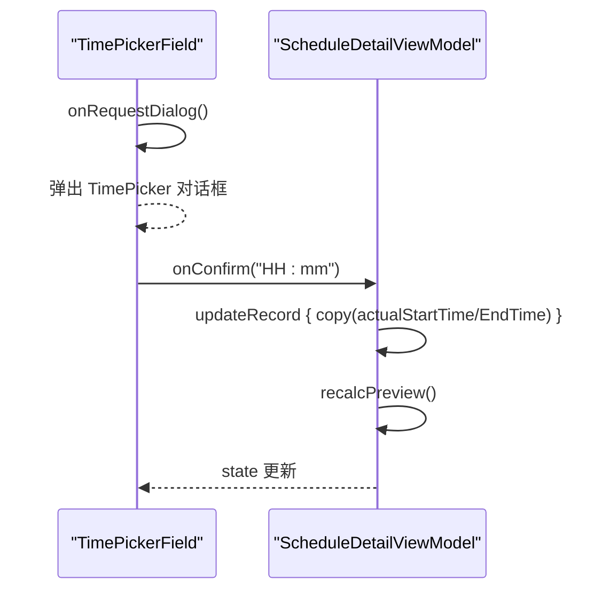
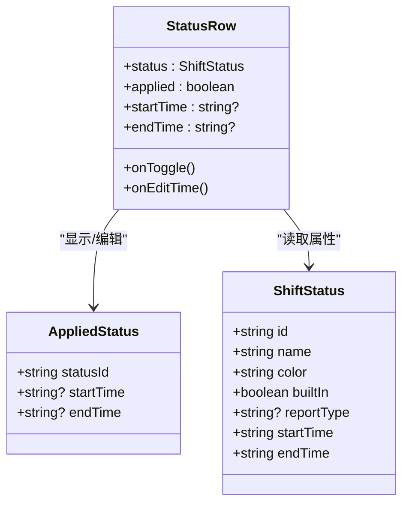
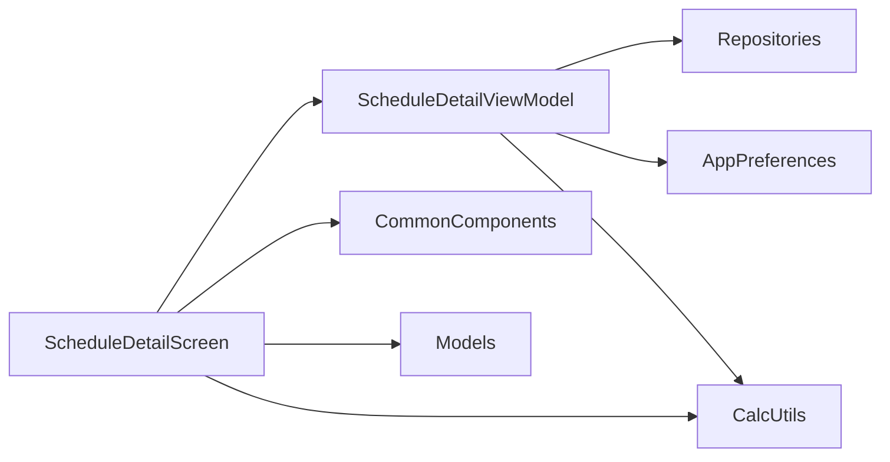
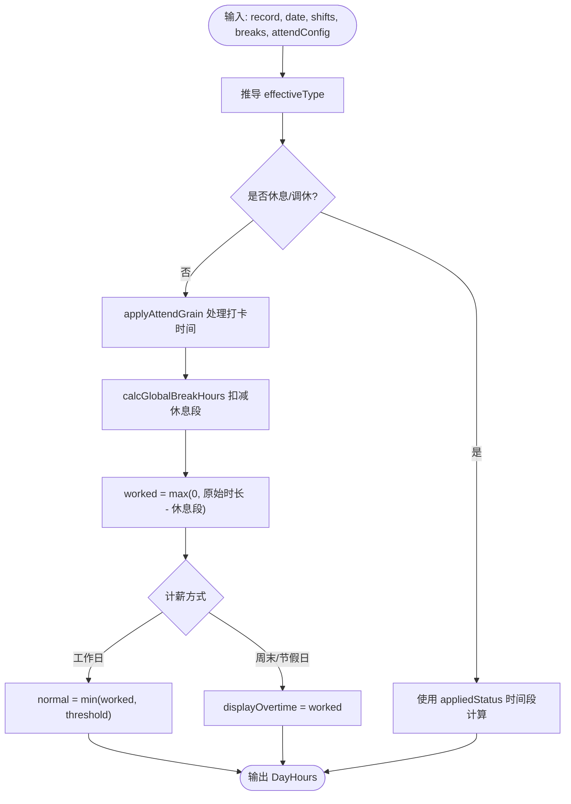

# 排班详情界面

<cite>
**本文引用的文件**   
- [ScheduleDetailScreen.kt](file://app/src/main/java/com/schedulecalendar/app/ui/detail/ScheduleDetailScreen.kt)
- [DetailViewModels.kt](file://app/src/main/java/com/schedulecalendar/app/ui/detail/DetailViewModels.kt)
- [Models.kt](file://app/src/main/java/com/schedulecalendar/app/domain/model/Models.kt)
- [CalcUtils.kt](file://app/src/main/java/com/schedulecalendar/app/domain/model/CalcUtils.kt)
- [CommonComponents.kt](file://app/src/main/java/com/schedulecalendar/app/ui/component/CommonComponents.kt)
- [DatePickerDialog.kt](file://app/src/main/java/com/schedulecalendar/app/ui/component/DatePickerDialog.kt)
</cite>

## 目录
1. [简介](#简介)
2. [项目结构](#项目结构)
3. [核心组件](#核心组件)
4. [架构总览](#架构总览)
5. [详细组件分析](#详细组件分析)
6. [依赖关系分析](#依赖关系分析)
7. [性能与滚动优化](#性能与滚动优化)
8. [IME 适配与键盘交互](#ime-适配与键盘交互)
9. [工时与薪资计算逻辑](#工时与薪资计算逻辑)
10. [故障排查指南](#故障排查指南)
11. [结论](#结论)

## 简介
本文件面向排班详情界面的实现与使用，重点围绕 ScheduleDetailScreen 的日期展示、班次选择器、实际打卡时间设置、附加状态时间段编辑、补贴扣款配置、计薪方式设置等能力进行系统化说明。文档同时覆盖时间选择器的实现机制、状态时间段编辑对话框、底部弹窗交互、工时与薪资明细实时计算、IME 适配、滚动优化与状态管理，并提供代码片段路径与使用模式指引，帮助开发者快速理解并扩展该界面。

## 项目结构
排班详情界面位于 detail 包中，采用 Compose UI + ViewModel + Repository 的分层结构：
- UI 层：ScheduleDetailScreen 负责页面布局与交互
- 状态与业务编排：DetailViewModels 中的 ScheduleDetailViewModel 负责数据加载、状态更新与预览计算
- 领域模型与计算：Models.kt 定义数据结构，CalcUtils.kt 提供工时与薪资计算
- 通用组件：CommonComponents.kt 提供 TimePickerField、ImeAdaptiveOutlinedTextField、顶部栏等复用组件
- 日期选择器：DatePickerDialog.kt 提供滚轮式日期选择（在其它场景使用）

图表来源
- [ScheduleDetailScreen.kt:1-758](file://app/src/main/java/com/schedulecalendar/app/ui/detail/ScheduleDetailScreen.kt#L1-L758)
- [DetailViewModels.kt:1-543](file://app/src/main/java/com/schedulecalendar/app/ui/detail/DetailViewModels.kt#L1-L543)
- [Models.kt:1-278](file://app/src/main/java/com/schedulecalendar/app/domain/model/Models.kt#L1-L278)
- [CalcUtils.kt:1-557](file://app/src/main/java/com/schedulecalendar/app/domain/model/CalcUtils.kt#L1-L557)
- [CommonComponents.kt:1-440](file://app/src/main/java/com/schedulecalendar/app/ui/component/CommonComponents.kt#L1-L440)
- [DatePickerDialog.kt:1-303](file://app/src/main/java/com/schedulecalendar/app/ui/component/DatePickerDialog.kt#L1-L303)

章节来源
- [ScheduleDetailScreen.kt:1-758](file://app/src/main/java/com/schedulecalendar/app/ui/detail/ScheduleDetailScreen.kt#L1-L758)
- [DetailViewModels.kt:1-543](file://app/src/main/java/com/schedulecalendar/app/ui/detail/DetailViewModels.kt#L1-L543)

## 核心组件
- 排班详情主界面：ScheduleDetailScreen
  - 日期信息卡片：显示公历、星期、农历、节假日标签与预计工时预览
  - 班次选择：点击打开底部弹窗 ShiftPickerSheet，支持内置/自定义班次，休息/调休特殊处理
  - 实际打卡时间：非休息/调休时显示“实际上班/下班”，支持清除；通过 TimePickerField 弹出时间选择器
  - 附加状态：可选状态项，支持单选与时间段编辑（开始/结束），休息/调休下仅显示特定状态
  - 补贴/扣款：多选开关，自动合并班次默认关联项目
  - 备注：多行输入框，支持 IME 自适应滚动
  - 计薪方式：工作日/周末/节假日三种模式，支持自动模式标签与手动切换
  - 工时与薪资明细：实时展示正常工时、加班工时、正班收入、加班收入与总收入
- 时间选择器：TimePickerField（可自包含或外部控制对话框）
- IME 自适应输入框：ImeAdaptiveOutlinedTextField（精确滚动到键盘上方）
- 顶部栏：ScheduleTopBar（返回、标题、保存/清除操作）

章节来源
- [ScheduleDetailScreen.kt:100-416](file://app/src/main/java/com/schedulecalendar/app/ui/detail/ScheduleDetailScreen.kt#L100-L416)
- [CommonComponents.kt:170-259](file://app/src/main/java/com/schedulecalendar/app/ui/component/CommonComponents.kt#L170-L259)
- [CommonComponents.kt:356-439](file://app/src/main/java/com/schedulecalendar/app/ui/component/CommonComponents.kt#L356-L439)

## 架构总览
排班详情界面遵循 MVVM + Flow 的状态驱动模式：
- UI 层通过 collectAsStateWithLifecycle 订阅 ViewModel 的 state 流，渲染界面
- ViewModel 从多个 Repository 加载数据（班次、状态、补贴扣款、全局休息段、当日记录），并按用户排序偏好组织列表
- 任何影响工时与薪资的字段变化都会触发 recalcPreview，调用 CalcUtils 计算并更新预览与明细
- UI 事件（导航、错误提示）通过 Channel 发送，由界面消费

图表来源
- [DetailViewModels.kt:73-141](file://app/src/main/java/com/schedulecalendar/app/ui/detail/DetailViewModels.kt#L73-L141)
- [CalcUtils.kt:149-234](file://app/src/main/java/com/schedulecalendar/app/domain/model/CalcUtils.kt#L149-L234)

章节来源
- [DetailViewModels.kt:73-141](file://app/src/main/java/com/schedulecalendar/app/ui/detail/DetailViewModels.kt#L73-L141)

## 详细组件分析

### 日期信息与预览
- 日期解析：将字符串日期拆分为年/月/日，计算星期与农历文本，获取节假日名称
- 预计工时预览：当存在 record 且计算结果大于 0 时显示“预计 Xh”
- 节假日标签：以红色背景高亮显示

章节来源
- [ScheduleDetailScreen.kt:130-168](file://app/src/main/java/com/schedulecalendar/app/ui/detail/ScheduleDetailScreen.kt#L130-L168)

### 班次选择与底部弹窗
- 点击“班次”区域打开 ModalBottomSheet 列表，展示所有有效班次（按用户排序）
- 休息/调休班次不显示时间段，内置班次带有“内置”标签
- 选择后调用 vm.setShift(id)，若班次有默认关联补贴/扣款则合并去重

图表来源
- [ScheduleDetailScreen.kt:419-426](file://app/src/main/java/com/schedulecalendar/app/ui/detail/ScheduleDetailScreen.kt#L419-L426)
- [DetailViewModels.kt:151-163](file://app/src/main/java/com/schedulecalendar/app/ui/detail/DetailViewModels.kt#L151-L163)

章节来源
- [ScheduleDetailScreen.kt:170-197](file://app/src/main/java/com/schedulecalendar/app/ui/detail/ScheduleDetailScreen.kt#L170-L197)
- [ScheduleDetailScreen.kt:714-754](file://app/src/main/java/com/schedulecalendar/app/ui/detail/ScheduleDetailScreen.kt#L714-L754)
- [DetailViewModels.kt:151-163](file://app/src/main/java/com/schedulecalendar/app/ui/detail/DetailViewModels.kt#L151-L163)

### 实际打卡时间设置
- 仅在非休息/调休班次显示“实际上班/下班”
- 每个时间字段右侧带清除按钮，清空后重新计算
- 点击输入框弹出时间选择器对话框，支持默认时间回退

图表来源
- [ScheduleDetailScreen.kt:200-266](file://app/src/main/java/com/schedulecalendar/app/ui/detail/ScheduleDetailScreen.kt#L200-L266)
- [DetailViewModels.kt:164-166](file://app/src/main/java/com/schedulecalendar/app/ui/detail/DetailViewModels.kt#L164-L166)

章节来源
- [ScheduleDetailScreen.kt:200-266](file://app/src/main/java/com/schedulecalendar/app/ui/detail/ScheduleDetailScreen.kt#L200-L266)
- [CommonComponents.kt:170-259](file://app/src/main/java/com/schedulecalendar/app/ui/component/CommonComponents.kt#L170-L259)

### 附加状态与时间段编辑
- 休息/调休班次仅显示非内置请假/调休状态；普通班次显示全部状态
- 状态为单选，选中后可编辑时间段（开始/结束），未填表示全天
- 时间段约束：不能超过班次时间段（跨天班次也支持），超出时自动修正并提示

图表来源
- [Models.kt:22-42](file://app/src/main/java/com/schedulecalendar/app/domain/model/Models.kt#L22-L42)
- [ScheduleDetailScreen.kt:503-540](file://app/src/main/java/com/schedulecalendar/app/ui/detail/ScheduleDetailScreen.kt#L503-L540)

章节来源
- [ScheduleDetailScreen.kt:268-285](file://app/src/main/java/com/schedulecalendar/app/ui/detail/ScheduleDetailScreen.kt#L268-L285)
- [ScheduleDetailScreen.kt:575-710](file://app/src/main/java/com/schedulecalendar/app/ui/detail/ScheduleDetailScreen.kt#L575-L710)
- [DetailViewModels.kt:173-195](file://app/src/main/java/com/schedulecalendar/app/ui/detail/DetailViewModels.kt#L173-L195)

### 补贴/扣款配置
- 多选开关，勾选即加入当前记录的 extraItemIds
- 若选择的班次有默认关联项目，自动合并去重
- 显示类型标签（补/扣）与金额

章节来源
- [ScheduleDetailScreen.kt:288-296](file://app/src/main/java/com/schedulecalendar/app/ui/detail/ScheduleDetailScreen.kt#L288-L296)
- [DetailViewModels.kt:197-203](file://app/src/main/java/com/schedulecalendar/app/ui/detail/DetailViewModels.kt#L197-L203)

### 计薪方式设置
- 自动模式：根据日期判断工作日/周末/节假日，并在 UI 显示对应标签
- 手动模式：工作日/周末/节假日三选一，再次点击已选项可恢复自动
- 休息/调休且有状态时间段时，才显示计薪方式

章节来源
- [ScheduleDetailScreen.kt:311-352](file://app/src/main/java/com/schedulecalendar/app/ui/detail/ScheduleDetailScreen.kt#L311-L352)
- [DetailViewModels.kt:115-121](file://app/src/main/java/com/schedulecalendar/app/ui/detail/DetailViewModels.kt#L115-L121)

### 工时与薪资明细
- 正常工时：按标准时长阈值划分
- 加班工时：超过阈值部分，含周末/节假日统一归类为加班工时用于展示
- 正班收入：正常工时 × 正常时薪
- 加班收入：加班工时（含周末/节假日）× 加班时薪
- 总收入：正班收入 + 加班收入 + 当日补贴/扣款合计

章节来源
- [DetailViewModels.kt:108-141](file://app/src/main/java/com/schedulecalendar/app/ui/detail/DetailViewModels.kt#L108-L141)
- [CalcUtils.kt:149-234](file://app/src/main/java/com/schedulecalendar/app/domain/model/CalcUtils.kt#L149-L234)

## 依赖关系分析
- ScheduleDetailScreen 依赖：
  - DetailViewModels.ScheduleDetailViewModel（状态与业务）
  - CommonComponents（TimePickerField、ImeAdaptiveOutlinedTextField、ScheduleTopBar）
  - Models（数据类型与常量）
  - CalcUtils（计算工具）
- ViewModel 依赖：
  - 多个 Repository（ShiftRepository、ScheduleRepository、ShiftStatusRepository、ExtraItemRepository、ShiftBreakRepository）
  - AppPreferences（用户偏好与排序）
  - CalcUtils（计算）

图表来源
- [ScheduleDetailScreen.kt:1-758](file://app/src/main/java/com/schedulecalendar/app/ui/detail/ScheduleDetailScreen.kt#L1-L758)
- [DetailViewModels.kt:1-543](file://app/src/main/java/com/schedulecalendar/app/ui/detail/DetailViewModels.kt#L1-L543)

章节来源
- [ScheduleDetailScreen.kt:1-758](file://app/src/main/java/com/schedulecalendar/app/ui/detail/ScheduleDetailScreen.kt#L1-L758)
- [DetailViewModels.kt:1-543](file://app/src/main/java/com/schedulecalendar/app/ui/detail/DetailViewModels.kt#L1-L543)

## 性能与滚动优化
- 滚动容器：使用 rememberScrollState 与 verticalScroll，确保长内容可滚动
- IME 适配：ImeAdaptiveOutlinedTextField 在焦点获得与高度变化时精确滚动，避免被键盘遮挡
- 时间选择器对话框提升：将时间选择器对话框提升到滚动容器外部渲染，避免被裁剪
- 数据加载：ViewModel 初始化一次性加载数据，后续变更通过 Flow 增量更新，减少重复 IO
- 计算优化：recalcPreview 仅在相关字段变化时触发，避免全量重算

章节来源
- [ScheduleDetailScreen.kt:118-128](file://app/src/main/java/com/schedulecalendar/app/ui/detail/ScheduleDetailScreen.kt#L118-L128)
- [ScheduleDetailScreen.kt:441-473](file://app/src/main/java/com/schedulecalendar/app/ui/detail/ScheduleDetailScreen.kt#L441-L473)
- [CommonComponents.kt:356-439](file://app/src/main/java/com/schedulecalendar/app/ui/component/CommonComponents.kt#L356-L439)
- [DetailViewModels.kt:73-106](file://app/src/main/java/com/schedulecalendar/app/ui/detail/DetailViewModels.kt#L73-L106)

## IME 适配与键盘交互
- ImeAdaptiveOutlinedTextField 的核心机制：
  - 监听焦点变化与尺寸变化，计算输入框底部位置
  - 获取系统窗口可视区域，计算键盘顶部位置
  - 当输入框底部高于键盘顶部时，向上滚动至刚好可见
  - 支持传入 ScrollState 自动滚动，或在 LazyColumn 场景通过回调处理
- 在备注输入框中使用该组件，确保多行输入不被遮挡

章节来源
- [CommonComponents.kt:356-439](file://app/src/main/java/com/schedulecalendar/app/ui/component/CommonComponents.kt#L356-L439)
- [ScheduleDetailScreen.kt:299-308](file://app/src/main/java/com/schedulecalendar/app/ui/detail/ScheduleDetailScreen.kt#L299-L308)

## 工时与薪资计算逻辑
- 考勤粒度与容忍：applyAttendGrain 对早到/迟到/晚退/早退进行粒度取整与容忍处理
- 全局休息段扣减：calcGlobalBreakHours 计算与班次时间窗口的重叠时长
- 日工时分类：calcDayHours 根据计薪方式（工作日/周末/节假日）分类 normal/overtime/weekend/holiday
- 自动计薪模式：autoSalaryMode 基于日期与节假日/周末规则推断
- 薪资明细：normalSalary = normal × normalRate；overtimeSalary = (overtime+weekend+holiday) × overtimeRate；总收入含补贴/扣款

图表来源
- [CalcUtils.kt:149-234](file://app/src/main/java/com/schedulecalendar/app/domain/model/CalcUtils.kt#L149-L234)
- [CalcUtils.kt:61-113](file://app/src/main/java/com/schedulecalendar/app/domain/model/CalcUtils.kt#L61-L113)
- [CalcUtils.kt:121-134](file://app/src/main/java/com/schedulecalendar/app/domain/model/CalcUtils.kt#L121-L134)

章节来源
- [CalcUtils.kt:149-234](file://app/src/main/java/com/schedulecalendar/app/domain/model/CalcUtils.kt#L149-L234)
- [DetailViewModels.kt:108-141](file://app/src/main/java/com/schedulecalendar/app/ui/detail/DetailViewModels.kt#L108-L141)

## 故障排查指南
- 保存失败：检查 ViewModel 的 save 方法捕获异常并通过 uiEvent 显示 Snackbar
- 删除失败：deleteRecord 同样通过 uiEvent 上报错误
- 时间选择器无效：确认 TimePickerField 的 onRequestDialog 是否正确传递，以及对话框是否在滚动容器外渲染
- 状态时间段越界：StatusTimeDialog 内部 clampToShift 会修正并提示“不能超过班次时间段”
- 预览不更新：确认 recalcPreview 是否在 updateRecord 后被调用，且字段变化触发了 Flow 更新

章节来源
- [DetailViewModels.kt:205-223](file://app/src/main/java/com/schedulecalendar/app/ui/detail/DetailViewModels.kt#L205-L223)
- [ScheduleDetailScreen.kt:428-439](file://app/src/main/java/com/schedulecalendar/app/ui/detail/ScheduleDetailScreen.kt#L428-L439)

## 结论
排班详情界面通过清晰的 MVVM 分层与 Compose 状态驱动，实现了完整的排班编辑与实时预览能力。时间选择器、状态时间段编辑、补贴扣款与计薪方式设置均具备完善的交互与校验。借助 CalcUtils 的计算能力与 ViewModel 的实时更新，界面能够准确展示工时与薪资明细。IME 适配与滚动优化确保了良好的用户体验。开发者可基于本文档快速定位关键实现与扩展点，按需定制功能。