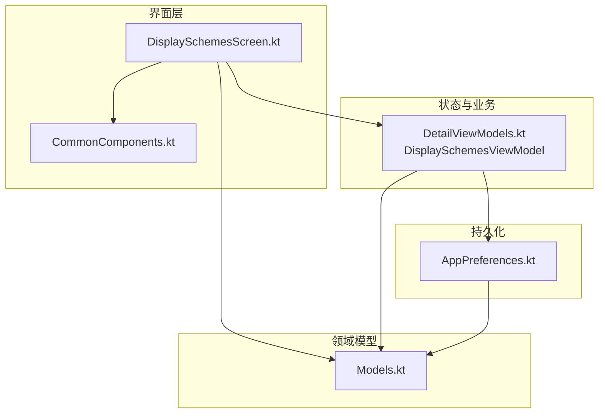
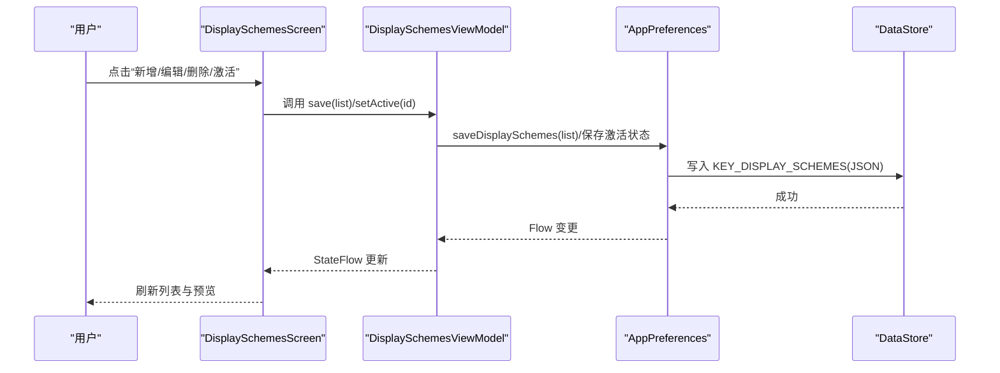
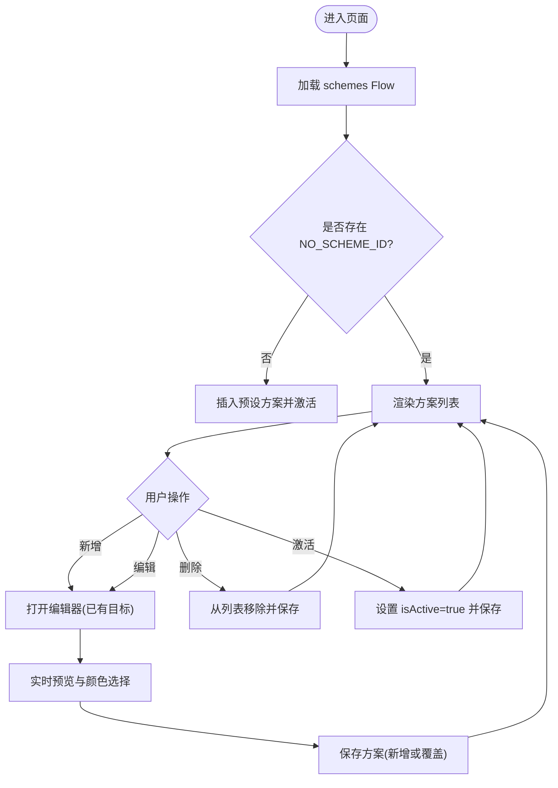
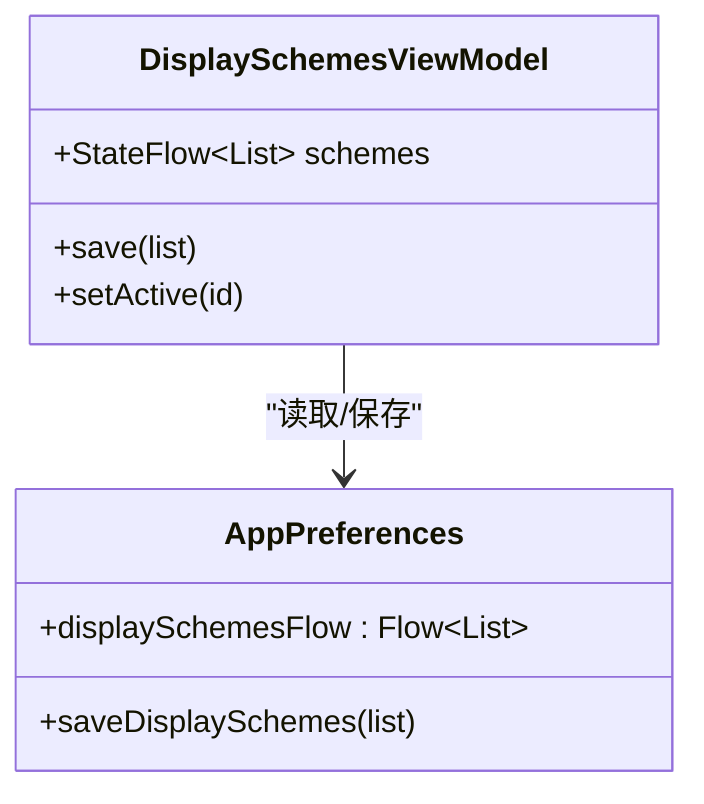
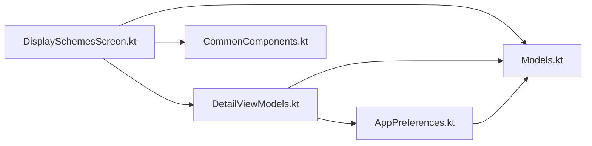

# 显示方案管理界面

<cite>
**本文引用的文件**   
- [DisplaySchemesScreen.kt](file://app/src/main/java/com/schedulecalendar/app/ui/detail/DisplaySchemesScreen.kt)
- [DetailViewModels.kt](file://app/src/main/java/com/schedulecalendar/app/ui/detail/DetailViewModels.kt)
- [AppPreferences.kt](file://app/src/main/java/com/schedulecalendar/app/data/prefs/AppPreferences.kt)
- [Models.kt](file://app/src/main/java/com/schedulecalendar/app/domain/model/Models.kt)
- [CommonComponents.kt](file://app/src/main/java/com/schedulecalendar/app/ui/component/CommonComponents.kt)
</cite>

## 目录
1. [简介](#简介)
2. [项目结构](#项目结构)
3. [核心组件](#核心组件)
4. [架构总览](#架构总览)
5. [详细组件分析](#详细组件分析)
6. [依赖关系分析](#依赖关系分析)
7. [性能考虑](#性能考虑)
8. [故障排查指南](#故障排查指南)
9. [结论](#结论)
10. [附录：数据结构与配置项说明](#附录数据结构与配置项说明)

## 简介
本文件面向“显示方案管理界面”的实现与使用，围绕 DisplaySchemesScreen 的功能展开，涵盖日历显示布局的配置、显示选项的自定义与管理；详细说明显示方案的创建、编辑、删除与切换逻辑；解释配置的持久化存储、默认方案管理与批量操作；并给出响应式 UI、配置校验与数据同步机制的分析。最后提供完整的数据结构与配置项说明，帮助读者快速理解与扩展。

## 项目结构
显示方案管理界面位于 detail 包下的 Compose 屏幕中，通过 ViewModel 与 AppPreferences 交互完成状态管理与持久化。关键文件组织如下：
- 界面层：DisplaySchemesScreen.kt（列表、卡片、编辑器、预览与颜色选择）
- 状态与业务：DetailViewModels.kt（DisplaySchemesViewModel）
- 持久化：AppPreferences.kt（DataStore 读写）
- 领域模型：Models.kt（DisplayScheme、DataRowConfig、DisplayItemType 等）
- 通用组件：CommonComponents.kt（顶部栏、稳定标签样式等）

图表来源
- [DisplaySchemesScreen.kt:1-120](file://app/src/main/java/com/schedulecalendar/app/ui/detail/DisplaySchemesScreen.kt#L1-L120)
- [DetailViewModels.kt:520-543](file://app/src/main/java/com/schedulecalendar/app/ui/detail/DetailViewModels.kt#L520-L543)
- [AppPreferences.kt:92-103](file://app/src/main/java/com/schedulecalendar/app/data/prefs/AppPreferences.kt#L92-L103)
- [Models.kt:144-181](file://app/src/main/java/com/schedulecalendar/app/domain/model/Models.kt#L144-L181)
- [CommonComponents.kt:38-65](file://app/src/main/java/com/schedulecalendar/app/ui/component/CommonComponents.kt#L38-L65)

章节来源
- [DisplaySchemesScreen.kt:1-120](file://app/src/main/java/com/schedulecalendar/app/ui/detail/DisplaySchemesScreen.kt#L1-L120)
- [DetailViewModels.kt:520-543](file://app/src/main/java/com/schedulecalendar/app/ui/detail/DetailViewModels.kt#L520-L543)
- [AppPreferences.kt:92-103](file://app/src/main/java/com/schedulecalendar/app/data/prefs/AppPreferences.kt#L92-L103)
- [Models.kt:144-181](file://app/src/main/java/com/schedulecalendar/app/domain/model/Models.kt#L144-L181)
- [CommonComponents.kt:38-65](file://app/src/main/java/com/schedulecalendar/app/ui/component/CommonComponents.kt#L38-L65)

## 核心组件
- DisplaySchemesScreen：显示方案列表与编辑器入口，支持新增、编辑、删除、激活切换；内置“预设方案”占位与无方案时的默认激活逻辑。
- DisplaySchemesViewModel：暴露 schemes 的 StateFlow，封装 save 与 setActive 两个核心方法，负责状态更新与持久化。
- AppPreferences：基于 DataStore 的 display_schemes 键值对进行 JSON 序列化/反序列化，提供 Flow 与保存接口。
- Models：定义 DisplayScheme、DataRowConfig、DisplayItemType 等核心数据结构，以及内置常量与工具函数（如 textColorForBackground）。
- CommonComponents：提供 ScheduleTopBar 与稳定标签样式等通用 UI 能力。

章节来源
- [DisplaySchemesScreen.kt:49-114](file://app/src/main/java/com/schedulecalendar/app/ui/detail/DisplaySchemesScreen.kt#L49-L114)
- [DetailViewModels.kt:525-542](file://app/src/main/java/com/schedulecalendar/app/ui/detail/DetailViewModels.kt#L525-L542)
- [AppPreferences.kt:92-103](file://app/src/main/java/com/schedulecalendar/app/data/prefs/AppPreferences.kt#L92-L103)
- [Models.kt:144-181](file://app/src/main/java/com/schedulecalendar/app/domain/model/Models.kt#L144-L181)
- [CommonComponents.kt:38-65](file://app/src/main/java/com/schedulecalendar/app/ui/component/CommonComponents.kt#L38-L65)

## 架构总览
显示方案管理采用典型的 MVVM + DataStore 架构：
- 界面层（Compose Screen）通过 hiltViewModel 注入 DisplaySchemesViewModel。
- ViewModel 订阅 AppPreferences.displaySchemesFlow，并以 StateFlow 暴露给 UI。
- 用户操作（新增/编辑/删除/激活）由 ViewModel 调用 AppPreferences 写入 DataStore。
- 领域模型在 Models.kt 中统一定义，确保 UI、ViewModel、持久化一致。

图表来源
- [DisplaySchemesScreen.kt:74-114](file://app/src/main/java/com/schedulecalendar/app/ui/detail/DisplaySchemesScreen.kt#L74-L114)
- [DetailViewModels.kt:533-541](file://app/src/main/java/com/schedulecalendar/app/ui/detail/DetailViewModels.kt#L533-L541)
- [AppPreferences.kt:92-103](file://app/src/main/java/com/schedulecalendar/app/data/prefs/AppPreferences.kt#L92-L103)

## 详细组件分析

### DisplaySchemesScreen（界面与交互）
- 列表渲染：使用 LazyColumn 展示方案卡片 SchemeCard，支持点击激活、编辑与删除。
- 预设方案处理：过滤掉内置方案，若不存在 NO_SCHEME_ID，则插入“预设方案”作为默认激活项，保证始终有可激活的方案。
- 编辑器对话框：SchemeEditorDialog 包含名称输入、MiniDayCellPreview 实时预览、ColorPickerGrid 颜色选择、DataRowEditor 行配置。
- 数据行配置：每行最多两个数据项，左右槽位独立背景色；特殊类型（班次/状态）自动锁定颜色。
- 响应式与可用性：使用 stableLabelColors 固定标签样式；预览区域与颜色选择器等高对齐，提升编辑体验。

图表来源
- [DisplaySchemesScreen.kt:55-98](file://app/src/main/java/com/schedulecalendar/app/ui/detail/DisplaySchemesScreen.kt#L55-L98)
- [DisplaySchemesScreen.kt:188-306](file://app/src/main/java/com/schedulecalendar/app/ui/detail/DisplaySchemesScreen.kt#L188-L306)
- [DisplaySchemesScreen.kt:310-492](file://app/src/main/java/com/schedulecalendar/app/ui/detail/DisplaySchemesScreen.kt#L310-L492)

章节来源
- [DisplaySchemesScreen.kt:49-114](file://app/src/main/java/com/schedulecalendar/app/ui/detail/DisplaySchemesScreen.kt#L49-L114)
- [DisplaySchemesScreen.kt:188-306](file://app/src/main/java/com/schedulecalendar/app/ui/detail/DisplaySchemesScreen.kt#L188-L306)
- [DisplaySchemesScreen.kt:310-492](file://app/src/main/java/com/schedulecalendar/app/ui/detail/DisplaySchemesScreen.kt#L310-L492)

### DisplaySchemesViewModel（状态与业务）
- schemes：通过 prefs.displaySchemesFlow.stateIn 暴露为 StateFlow，供 UI 收集。
- save(list)：将完整的方案列表保存到 DataStore。
- setActive(id)：将目标方案标记为激活，并确保该 id 存在于持久化列表中（必要时注入“预设方案”）。

图表来源
- [DetailViewModels.kt:525-542](file://app/src/main/java/com/schedulecalendar/app/ui/detail/DetailViewModels.kt#L525-L542)
- [AppPreferences.kt:92-103](file://app/src/main/java/com/schedulecalendar/app/data/prefs/AppPreferences.kt#L92-L103)

章节来源
- [DetailViewModels.kt:525-542](file://app/src/main/java/com/schedulecalendar/app/ui/detail/DetailViewModels.kt#L525-L542)

### AppPreferences（持久化）
- displaySchemesFlow：从 DataStore 的 KEY_DISPLAY_SCHEMES 读取 JSON，反序列化为 List<DisplayScheme>，失败时回退到默认值。
- saveDisplaySchemes：将 List<DisplayScheme> 序列化为 JSON 写入 DataStore。
- Gson 配置：注册 InstanceCreator 以保留 Kotlin data class 默认值，避免反序列化丢失字段。

章节来源
- [AppPreferences.kt:29-35](file://app/src/main/java/com/schedulecalendar/app/data/prefs/AppPreferences.kt#L29-L35)
- [AppPreferences.kt:92-103](file://app/src/main/java/com/schedulecalendar/app/data/prefs/AppPreferences.kt#L92-L103)

### Models（领域模型）
- DisplayItemType：枚举定义可展示的日历数据项类型（工时、收入、班次、状态等），部分类型自带默认颜色（特殊类型）。
- DataRowConfig：数据行配置，包含左右两个槽位的 DisplayItemType? 与各自背景色。
- DisplayScheme：显示方案，包含 id、name、isNoScheme、dataRows、builtIn、isActive。
- 内置常量：BUILTIN_SCHEME_ID、NO_SCHEME_ID 等。
- textColorForBackground：根据背景色明度计算文字颜色（黑/白）。

章节来源
- [Models.kt:144-181](file://app/src/main/java/com/schedulecalendar/app/domain/model/Models.kt#L144-L181)
- [Models.kt:197-208](file://app/src/main/java/com/schedulecalendar/app/domain/model/Models.kt#L197-L208)
- [Models.kt:210-223](file://app/src/main/java/com/schedulecalendar/app/domain/model/Models.kt#L210-L223)

### CommonComponents（通用组件）
- ScheduleTopBar：统一的顶部导航栏，用于返回与标题展示。
- stableLabelColors：禁用浮动标签动画的颜色配置，保持标签常驻显示。

章节来源
- [CommonComponents.kt:38-65](file://app/src/main/java/com/schedulecalendar/app/ui/component/CommonComponents.kt#L38-L65)
- [CommonComponents.kt:149-153](file://app/src/main/java/com/schedulecalendar/app/ui/component/CommonComponents.kt#L149-L153)

## 依赖关系分析
- DisplaySchemesScreen 依赖 DisplaySchemesViewModel 与 Models 中的数据结构。
- DisplaySchemesViewModel 依赖 AppPreferences 进行数据读写。
- AppPreferences 依赖 Gson 与 DataStore 完成序列化与持久化。
- CommonComponents 被 DisplaySchemesScreen 复用以提升一致性。

图表来源
- [DisplaySchemesScreen.kt:49-114](file://app/src/main/java/com/schedulecalendar/app/ui/detail/DisplaySchemesScreen.kt#L49-L114)
- [DetailViewModels.kt:525-542](file://app/src/main/java/com/schedulecalendar/app/ui/detail/DetailViewModels.kt#L525-L542)
- [AppPreferences.kt:92-103](file://app/src/main/java/com/schedulecalendar/app/data/prefs/AppPreferences.kt#L92-L103)
- [Models.kt:144-181](file://app/src/main/java/com/schedulecalendar/app/domain/model/Models.kt#L144-L181)
- [CommonComponents.kt:38-65](file://app/src/main/java/com/schedulecalendar/app/ui/component/CommonComponents.kt#L38-L65)

章节来源
- [DisplaySchemesScreen.kt:49-114](file://app/src/main/java/com/schedulecalendar/app/ui/detail/DisplaySchemesScreen.kt#L49-L114)
- [DetailViewModels.kt:525-542](file://app/src/main/java/com/schedulecalendar/app/ui/detail/DetailViewModels.kt#L525-L542)
- [AppPreferences.kt:92-103](file://app/src/main/java/com/schedulecalendar/app/data/prefs/AppPreferences.kt#L92-L103)
- [Models.kt:144-181](file://app/src/main/java/com/schedulecalendar/app/domain/model/Models.kt#L144-L181)
- [CommonComponents.kt:38-65](file://app/src/main/java/com/schedulecalendar/app/ui/component/CommonComponents.kt#L38-L65)

## 性能考虑
- 列表渲染：使用 LazyColumn 与 items(key=it.id) 优化重组与去重。
- 状态流：stateIn 配合 WhileSubscribed 策略，减少不必要的订阅与内存占用。
- 预览与颜色选择：MiniDayCellPreview 与 ColorPickerGrid 仅在编辑器内渲染，避免主列表开销。
- 反序列化容错：Gson 反序列化失败回退默认值，避免崩溃与卡顿。
- 文本颜色计算：textColorForBackground 使用简单亮度公式，计算开销低。

[本节为通用指导，不直接分析具体文件]

## 故障排查指南
- 无法保存显示方案：检查 AppPreferences.saveDisplaySchemes 是否被调用，确认 DataStore 写入权限与磁盘空间。
- 激活无效：确认 setActive 已将目标 id 的 isActive 置为 true，且最终列表包含该 id（必要时注入“预设方案”）。
- 编辑器颜色不生效：检查 DataRowConfig 的 backgroundColorLeft/Right 是否正确赋值，特殊类型（SHIFT/STATUS）会锁定颜色。
- 预览异常：确认 MiniDayCellPreview 使用的常量与 CalendarScreen 保持一致，避免布局错位。
- 数据不一致：查看 displaySchemesFlow 的反序列化结果，确认 JSON 格式与字段完整性。

章节来源
- [DetailViewModels.kt:533-541](file://app/src/main/java/com/schedulecalendar/app/ui/detail/DetailViewModels.kt#L533-L541)
- [AppPreferences.kt:92-103](file://app/src/main/java/com/schedulecalendar/app/data/prefs/AppPreferences.kt#L92-L103)
- [DisplaySchemesScreen.kt:630-710](file://app/src/main/java/com/schedulecalendar/app/ui/detail/DisplaySchemesScreen.kt#L630-L710)

## 结论
显示方案管理界面通过清晰的 MVVM 分层与 DataStore 持久化，实现了灵活的日历显示配置能力。UI 层面提供直观的预览与颜色选择，业务层确保激活与保存的正确性，模型层统一数据结构与工具函数。整体设计具备良好的可扩展性与稳定性，适合进一步扩展更多显示项与主题定制。

[本节为总结，不直接分析具体文件]

## 附录：数据结构与配置项说明
- DisplayItemType：可显示的日历数据项类型，包括工时、收入、班次、状态等，部分类型自带默认颜色。
- DataRowConfig：数据行配置，包含左右槽位的 DisplayItemType? 与各自背景色。
- DisplayScheme：显示方案，包含 id、name、isNoScheme、dataRows、builtIn、isActive。
- 内置常量：BUILTIN_SCHEME_ID、NO_SCHEME_ID。
- textColorForBackground：根据背景色明度计算文字颜色（黑/白）。

章节来源
- [Models.kt:144-181](file://app/src/main/java/com/schedulecalendar/app/domain/model/Models.kt#L144-L181)
- [Models.kt:197-208](file://app/src/main/java/com/schedulecalendar/app/domain/model/Models.kt#L197-L208)
- [Models.kt:210-223](file://app/src/main/java/com/schedulecalendar/app/domain/model/Models.kt#L210-L223)