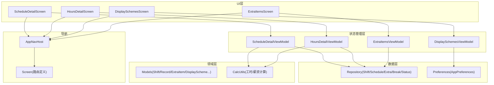
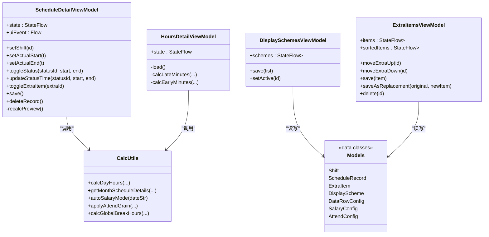
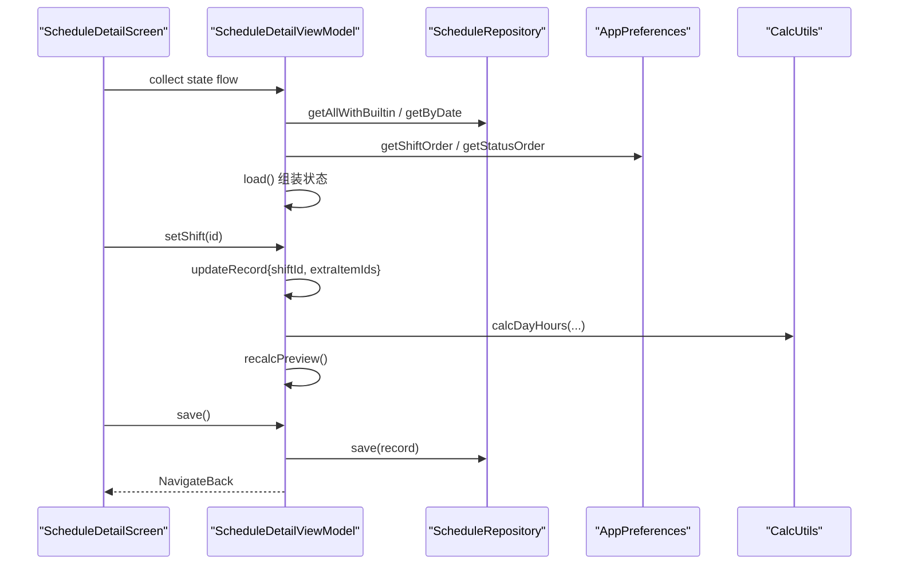
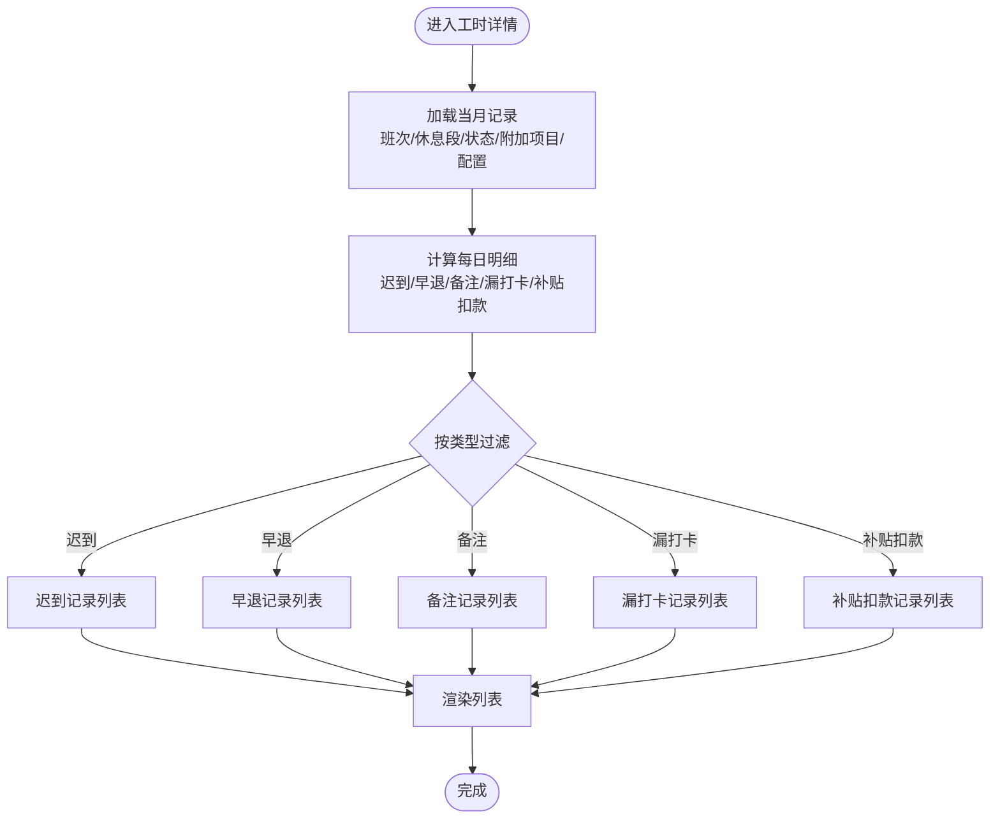
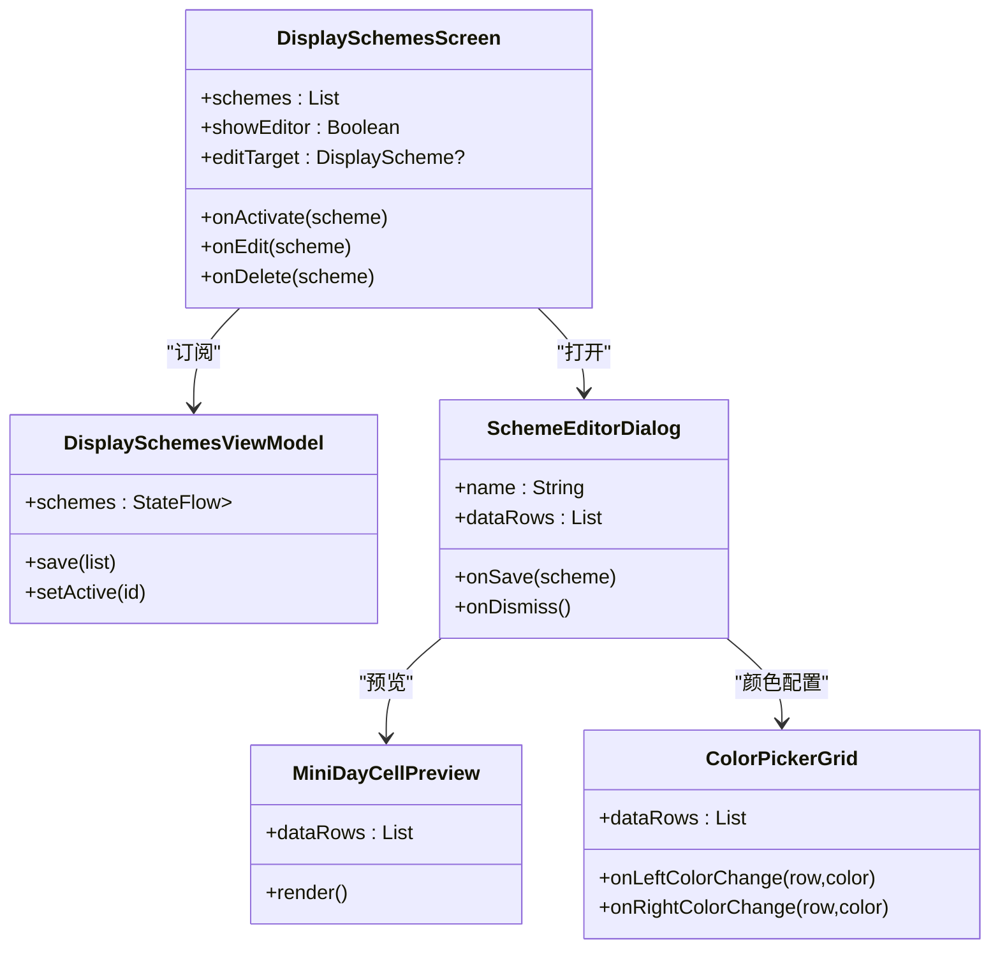
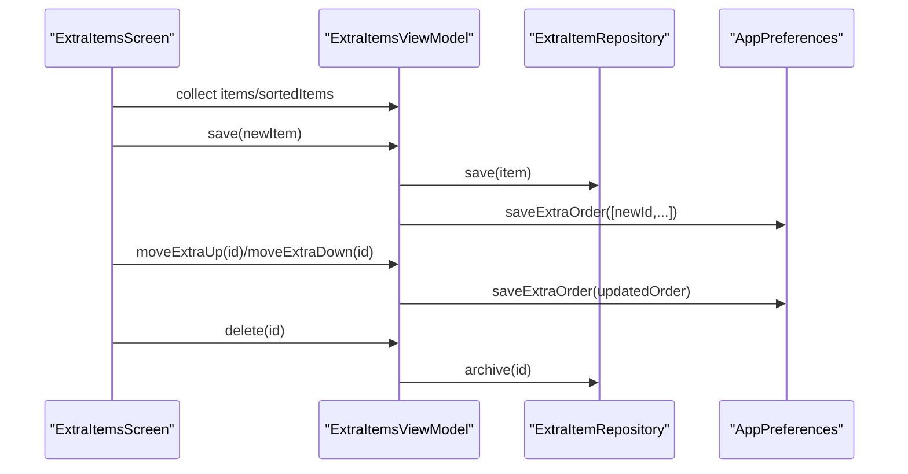
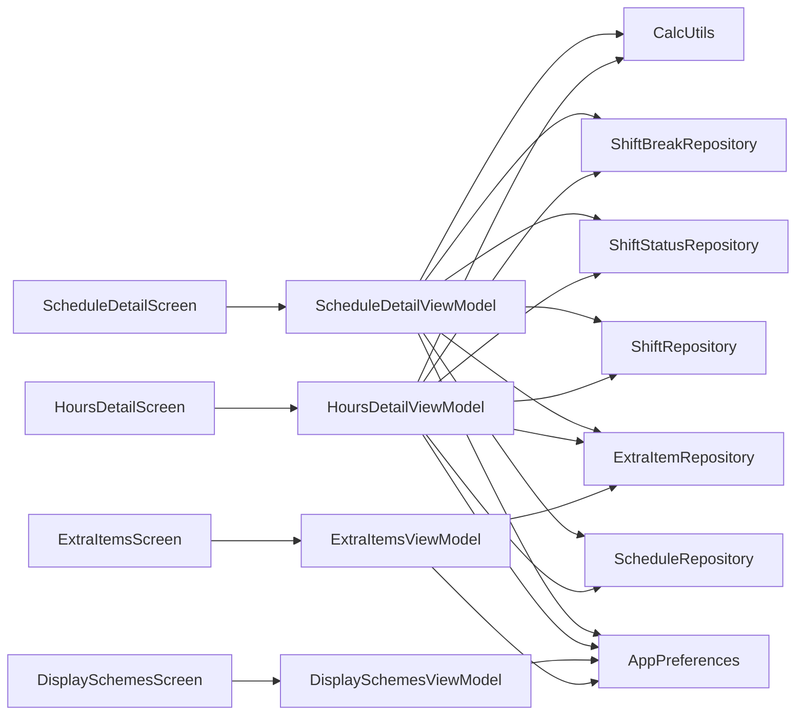
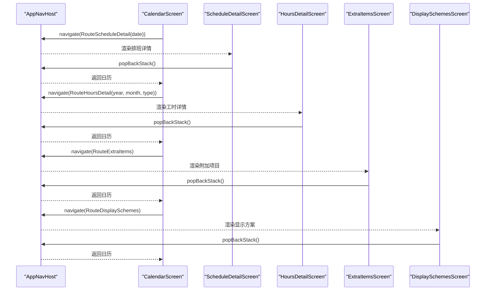

# 详情界面

<cite>
**本文引用的文件**   
- [DetailViewModels.kt](file://app/src/main/java/com/schedulecalendar/app/ui/detail/DetailViewModels.kt)
- [ScheduleDetailScreen.kt](file://app/src/main/java/com/schedulecalendar/app/ui/detail/ScheduleDetailScreen.kt)
- [HoursDetailScreen.kt](file://app/src/main/java/com/schedulecalendar/app/ui/detail/HoursDetailScreen.kt)
- [DisplaySchemesScreen.kt](file://app/src/main/java/com/schedulecalendar/app/ui/detail/DisplaySchemesScreen.kt)
- [ExtraItemsScreen.kt](file://app/src/main/java/com/schedulecalendar/app/ui/detail/ExtraItemsScreen.kt)
- [AppNavHost.kt](file://app/src/main/java/com/schedulecalendar/app/ui/navigation/AppNavHost.kt)
- [Screen.kt](file://app/src/main/java/com/schedulecalendar/app/ui/navigation/Screen.kt)
- [Models.kt](file://app/src/main/java/com/schedulecalendar/app/domain/model/Models.kt)
- [CalcUtils.kt](file://app/src/main/java/com/schedulecalendar/app/domain/model/CalcUtils.kt)
</cite>

## 目录
1. [简介](#简介)
2. [项目结构](#项目结构)
3. [核心组件](#核心组件)
4. [架构总览](#架构总览)
5. [详细组件分析](#详细组件分析)
6. [依赖关系分析](#依赖关系分析)
7. [性能与缓存策略](#性能与缓存策略)
8. [故障排查指南](#故障排查指南)
9. [结论](#结论)
10. [附录：导航流程与返回处理](#附录导航流程与返回处理)

## 简介
本文件面向Android排班日历应用的“详情界面”模块，系统性梳理并解释以下详情页的设计与实现：
- 排班详情（单天）：班次、实际打卡时间、附加状态、补贴扣款、备注、计薪方式、工时与薪资明细预览。
- 工时详情（按月）：迟到、早退、备注、漏打卡、补贴扣款等明细列表。
- 显示方案管理：自定义日历格子数据行与颜色配置，支持新增/编辑/删除/激活。
- 附加项目管理：补贴/扣款项目的增删改与排序。

文档涵盖数据展示布局、交互逻辑、状态同步机制、复杂数据可视化、数据缓存与性能优化，以及详情页的导航流程和返回处理机制。

## 项目结构
详情界面位于 ui/detail 包下，采用 Compose + ViewModel + Repository 的分层组织；导航路由集中在 ui/navigation 中，领域模型与计算工具在 domain/model 中。

图表来源
- [AppNavHost.kt:116-159](file://app/src/main/java/com/schedulecalendar/app/ui/navigation/AppNavHost.kt#L116-L159)
- [Screen.kt:16-25](file://app/src/main/java/com/schedulecalendar/app/ui/navigation/Screen.kt#L16-L25)
- [DetailViewModels.kt:54-106](file://app/src/main/java/com/schedulecalendar/app/ui/detail/DetailViewModels.kt#L54-L106)
- [DetailViewModels.kt:260-305](file://app/src/main/java/com/schedulecalendar/app/ui/detail/DetailViewModels.kt#L260-L305)
- [DetailViewModels.kt:525-542](file://app/src/main/java/com/schedulecalendar/app/ui/detail/DetailViewModels.kt#L525-L542)

章节来源
- [AppNavHost.kt:116-159](file://app/src/main/java/com/schedulecalendar/app/ui/navigation/AppNavHost.kt#L116-L159)
- [Screen.kt:16-25](file://app/src/main/java/com/schedulecalendar/app/ui/navigation/Screen.kt#L16-L25)

## 核心组件
- ScheduleDetailViewModel：负责单日排班详情的状态管理与业务操作（选择班次、设置实际打卡时间、附加状态时间段、补贴扣款勾选、备注、计薪方式切换），并实时计算工时预览与薪资明细。
- HoursDetailViewModel：按月加载排班记录，基于考勤规则与薪资配置生成各类明细（迟到、早退、备注、漏打卡、补贴扣款），并在IO线程计算避免阻塞UI。
- DisplaySchemesViewModel：维护显示方案列表与激活状态，支持保存与激活预设或用户自定义方案。
- ExtraItemsViewModel：维护附加项目（补贴/扣款）列表、排序、新增/编辑/归档删除，使用Flow响应式更新UI。

章节来源
- [DetailViewModels.kt:54-106](file://app/src/main/java/com/schedulecalendar/app/ui/detail/DetailViewModels.kt#L54-L106)
- [DetailViewModels.kt:260-305](file://app/src/main/java/com/schedulecalendar/app/ui/detail/DetailViewModels.kt#L260-L305)
- [DetailViewModels.kt:433-521](file://app/src/main/java/com/schedulecalendar/app/ui/detail/DetailViewModels.kt#L433-L521)
- [DetailViewModels.kt:525-542](file://app/src/main/java/com/schedulecalendar/app/ui/detail/DetailViewModels.kt#L525-L542)

## 架构总览
详情界面遵循MVVM+Compose架构：
- UI层：各Screen通过collectAsStateWithLifecycle订阅ViewModel的StateFlow，渲染页面。
- 状态层：ViewModel封装业务逻辑，协调Repository与Preferences，暴露StateFlow给UI。
- 数据层：Repository提供CRUD与观察流；Preferences提供配置与排序。
- 领域层：Models定义数据结构；CalcUtils实现工时/薪资计算与日期类型判断。

图表来源
- [DetailViewModels.kt:54-106](file://app/src/main/java/com/schedulecalendar/app/ui/detail/DetailViewModels.kt#L54-L106)
- [DetailViewModels.kt:260-305](file://app/src/main/java/com/schedulecalendar/app/ui/detail/DetailViewModels.kt#L260-L305)
- [DetailViewModels.kt:433-521](file://app/src/main/java/com/schedulecalendar/app/ui/detail/DetailViewModels.kt#L433-L521)
- [DetailViewModels.kt:525-542](file://app/src/main/java/com/schedulecalendar/app/ui/detail/DetailViewModels.kt#L525-L542)
- [CalcUtils.kt:149-234](file://app/src/main/java/com/schedulecalendar/app/domain/model/CalcUtils.kt#L149-L234)
- [Models.kt:82-110](file://app/src/main/java/com/schedulecalendar/app/domain/model/Models.kt#L82-L110)

## 详细组件分析

### 排班详情（ScheduleDetailScreen + ScheduleDetailViewModel）
- 数据展示布局
  - 顶部日期卡片：显示公历、农历、节假日标签与预计工时预览。
  - 班次选择：底部弹窗选择，内置/自定义班次，休息/调休特殊处理。
  - 实际打卡时间：非休息/调休时显示，支持时间与清除按钮。
  - 附加状态：单选切换，支持时间段编辑（开始/结束时间）。
  - 补贴/扣款：多选勾选，按类型区分金额正负。
  - 备注：多行输入框，IME自适应滚动。
  - 计薪方式：自动模式标签或手动选择工作日/周末/节假日，支持取消恢复自动。
  - 工时与薪资明细：正常工时、加班工时、正班收入、加班收入、总收入。
- 交互逻辑
  - 选择班次后自动合并默认关联的附加项目ID（去重）。
  - 附加状态时间段编辑：限制在班次范围内，跨天班次支持约束与警告提示。
  - 计薪方式切换：影响工时分类与薪资计算。
  - 保存/删除：保存成功后触发返回事件；删除后清空预览并返回。
- 状态同步机制
  - ViewModel内部MutableStateFlow驱动UI重组；保存/删除通过Channel发送UI事件（NavigateBack/ShowError）。
  - recalcPreview在每次record变更时重新计算工时与薪资明细。
- 复杂数据可视化
  - 日期信息卡片、状态行、补贴行、工时薪资明细卡片均使用Material3组件组合，颜色与形状一致化。
- 数据缓存与性能优化
  - 初始化一次性加载所有基础数据（班次、状态、附加项目、全局休息段、当日记录），并按用户偏好排序。
  - 计算耗时逻辑在协程中执行，避免阻塞主线程。

图表来源
- [ScheduleDetailScreen.kt:42-116](file://app/src/main/java/com/schedulecalendar/app/ui/detail/ScheduleDetailScreen.kt#L42-L116)
- [DetailViewModels.kt:73-106](file://app/src/main/java/com/schedulecalendar/app/ui/detail/DetailViewModels.kt#L73-L106)
- [DetailViewModels.kt:108-141](file://app/src/main/java/com/schedulecalendar/app/ui/detail/DetailViewModels.kt#L108-L141)
- [DetailViewModels.kt:205-224](file://app/src/main/java/com/schedulecalendar/app/ui/detail/DetailViewModels.kt#L205-L224)

章节来源
- [ScheduleDetailScreen.kt:42-474](file://app/src/main/java/com/schedulecalendar/app/ui/detail/ScheduleDetailScreen.kt#L42-L474)
- [DetailViewModels.kt:54-141](file://app/src/main/java/com/schedulecalendar/app/ui/detail/DetailViewModels.kt#L54-L141)
- [CalcUtils.kt:149-234](file://app/src/main/java/com/schedulecalendar/app/domain/model/CalcUtils.kt#L149-L234)

### 工时详情（HoursDetailScreen + HoursDetailViewModel）
- 数据展示布局
  - 顶部标题显示年月与类型（完整工时/迟到/早退/备注/漏打卡/补贴扣款）。
  - 统计摘要卡片：显示记录总数。
  - 列表项卡片：日期、班次名称与颜色、主要文本、次要文本、高亮值（如迟到分钟数）、告警样式。
- 交互逻辑
  - 无数据时显示空态提示；有数据则LazyColumn渲染。
  - 点击返回即popBackStack。
- 状态同步机制
  - 通过StateFlow暴露loading与items；加载完成后隐藏进度条。
- 复杂数据可视化
  - 根据类型动态构建HoursDetailItem，包含迟到/早退时长、备注内容、补贴扣款合计等。
- 数据缓存与性能优化
  - 数据加载与计算移至IO线程（withContext Dispatchers.IO），避免导航卡顿。
  - 仅加载当月记录，结合Shift/Break/Status/Extra聚合计算。

图表来源
- [HoursDetailScreen.kt:24-86](file://app/src/main/java/com/schedulecalendar/app/ui/detail/HoursDetailScreen.kt#L24-L86)
- [DetailViewModels.kt:288-405](file://app/src/main/java/com/schedulecalendar/app/ui/detail/DetailViewModels.kt#L288-L405)
- [CalcUtils.kt:448-486](file://app/src/main/java/com/schedulecalendar/app/domain/model/CalcUtils.kt#L448-L486)

章节来源
- [HoursDetailScreen.kt:24-165](file://app/src/main/java/com/schedulecalendar/app/ui/detail/HoursDetailScreen.kt#L24-L165)
- [DetailViewModels.kt:260-425](file://app/src/main/java/com/schedulecalendar/app/ui/detail/DetailViewModels.kt#L260-L425)

### 显示方案管理（DisplaySchemesScreen + DisplaySchemesViewModel）
- 数据展示布局
  - 方案卡片：名称、是否激活、固定项（农历/节假日）、用户自定义三行数据项。
  - 悬浮按钮新增方案；卡片内编辑/删除按钮。
  - 编辑器对话框：名称输入、预览区域（MiniDayCellPreview）、颜色选择器网格（ColorPickerGrid）、每行双下拉选择数据项。
- 交互逻辑
  - 点击卡片激活方案；编辑时自动去重命名；删除仅对非内置方案生效。
  - 颜色选择支持锁定（特殊类型自带颜色不可改）与清除。
- 状态同步机制
  - schemes为StateFlow，保存后直接持久化到Preferences。
- 复杂数据可视化
  - MiniDayCellPreview模拟真实日历格子布局，左右槽位背景色与文字对比度自动计算。
  - ColorPickerGrid对应三行两列的颜色槽位，支持锁定与禁用。

图表来源
- [DisplaySchemesScreen.kt:49-114](file://app/src/main/java/com/schedulecalendar/app/ui/detail/DisplaySchemesScreen.kt#L49-L114)
- [DetailViewModels.kt:525-542](file://app/src/main/java/com/schedulecalendar/app/ui/detail/DetailViewModels.kt#L525-L542)
- [DisplaySchemesScreen.kt:188-306](file://app/src/main/java/com/schedulecalendar/app/ui/detail/DisplaySchemesScreen.kt#L188-L306)
- [DisplaySchemesScreen.kt:496-628](file://app/src/main/java/com/schedulecalendar/app/ui/detail/DisplaySchemesScreen.kt#L496-L628)
- [DisplaySchemesScreen.kt:631-776](file://app/src/main/java/com/schedulecalendar/app/ui/detail/DisplaySchemesScreen.kt#L631-L776)

章节来源
- [DisplaySchemesScreen.kt:49-800](file://app/src/main/java/com/schedulecalendar/app/ui/detail/DisplaySchemesScreen.kt#L49-L800)
- [DetailViewModels.kt:525-542](file://app/src/main/java/com/schedulecalendar/app/ui/detail/DetailViewModels.kt#L525-L542)

### 附加项目管理（ExtraItemsScreen + ExtraItemsViewModel）
- 数据展示布局
  - 分两类：补贴项目与扣款项目，分别列出卡片。
  - 空态提示与添加第一个入口。
  - 编辑器对话框：名称、金额、类型（补贴/扣款），支持IME防抖与数值校验。
- 交互逻辑
  - 新增/编辑：编辑时归档旧记录并创建新记录（保留历史引用）。
  - 删除：逻辑删除（归档），不影响历史数据。
  - 排序：上移/下移，持久化顺序。
- 状态同步机制
  - items与sortedItems均为StateFlow，排序变化即时反映。
  - 错误通过Channel事件显示Snackbar。
- 复杂数据可视化
  - 卡片区分补贴/扣款金额正负，图标与颜色统一。

图表来源
- [ExtraItemsScreen.kt:32-113](file://app/src/main/java/com/schedulecalendar/app/ui/detail/ExtraItemsScreen.kt#L32-L113)
- [DetailViewModels.kt:433-521](file://app/src/main/java/com/schedulecalendar/app/ui/detail/DetailViewModels.kt#L433-L521)

章节来源
- [ExtraItemsScreen.kt:32-219](file://app/src/main/java/com/schedulecalendar/app/ui/detail/ExtraItemsScreen.kt#L32-L219)
- [DetailViewModels.kt:433-521](file://app/src/main/java/com/schedulecalendar/app/ui/detail/DetailViewModels.kt#L433-L521)

## 依赖关系分析
- Screen与ViewModel耦合：每个Screen通过hiltViewModel注入对应ViewModel，减少样板代码。
- ViewModel与Repository/Preferences：职责清晰，ViewModel只负责编排与状态转换。
- CalcUtils作为纯函数工具类，被多个ViewModel复用，保证计算一致性。
- 路由定义集中，便于扩展与维护。

图表来源
- [AppNavHost.kt:122-148](file://app/src/main/java/com/schedulecalendar/app/ui/navigation/AppNavHost.kt#L122-L148)
- [DetailViewModels.kt:54-106](file://app/src/main/java/com/schedulecalendar/app/ui/detail/DetailViewModels.kt#L54-L106)
- [DetailViewModels.kt:260-305](file://app/src/main/java/com/schedulecalendar/app/ui/detail/DetailViewModels.kt#L260-L305)
- [DetailViewModels.kt:433-521](file://app/src/main/java/com/schedulecalendar/app/ui/detail/DetailViewModels.kt#L433-L521)
- [DetailViewModels.kt:525-542](file://app/src/main/java/com/schedulecalendar/app/ui/detail/DetailViewModels.kt#L525-L542)

章节来源
- [AppNavHost.kt:122-148](file://app/src/main/java/com/schedulecalendar/app/ui/navigation/AppNavHost.kt#L122-L148)

## 性能与缓存策略
- 数据加载
  - 排班详情：初始化时一次性拉取全部基础数据，按用户偏好排序，避免重复查询。
  - 工时详情：仅在进入页面时加载当月数据，计算在IO线程进行，避免阻塞UI。
- 状态缓存
  - ViewModel使用StateFlow缓存当前状态，UI通过collectAsStateWithLifecycle订阅，生命周期感知。
  - Preferences中的排序与配置通过Flow暴露，避免频繁读取。
- 计算优化
  - CalcUtils提供高效的时间与工时计算，支持跨天、粒度取整、容忍阈值等。
  - 工时详情使用预聚合的DayScheduleDetail，减少重复计算。
- 内存与重组
  - 使用remember与key优化列表渲染；避免不必要的重组。
  - IME适配与滚动状态分离，提升输入体验。

章节来源
- [DetailViewModels.kt:73-106](file://app/src/main/java/com/schedulecalendar/app/ui/detail/DetailViewModels.kt#L73-L106)
- [DetailViewModels.kt:288-305](file://app/src/main/java/com/schedulecalendar/app/ui/detail/DetailViewModels.kt#L288-L305)
- [CalcUtils.kt:149-234](file://app/src/main/java/com/schedulecalendar/app/domain/model/CalcUtils.kt#L149-L234)

## 故障排查指南
- 保存失败
  - 现象：保存排班或附加项目时报错。
  - 排查：检查ViewModel中的save方法异常捕获与UI事件发送；确认Repository写入权限与数据库状态。
- 删除失败
  - 现象：删除记录或归档项目失败。
  - 排查：检查delete/archive方法的异常处理；确认数据是否存在及外键约束。
- 计算结果异常
  - 现象：工时或薪资计算不正确。
  - 排查：核对CalcUtils中的考勤规则、全局休息段扣减、计薪方式自动判断；确认输入时间格式与跨天处理。
- UI不刷新
  - 现象：修改后UI未更新。
  - 排查：确认StateFlow是否正确更新；检查collectAsStateWithLifecycle是否在正确作用域；避免可变状态未触发重组。

章节来源
- [DetailViewModels.kt:205-224](file://app/src/main/java/com/schedulecalendar/app/ui/detail/DetailViewModels.kt#L205-L224)
- [DetailViewModels.kt:495-521](file://app/src/main/java/com/schedulecalendar/app/ui/detail/DetailViewModels.kt#L495-L521)
- [CalcUtils.kt:149-234](file://app/src/main/java/com/schedulecalendar/app/domain/model/CalcUtils.kt#L149-L234)

## 结论
详情界面模块以清晰的MVVM分层与Compose声明式UI实现了排班详情、工时详情、显示方案管理与附加项目管理的完整功能。通过StateFlow与Repository解耦，保证了数据一致性与可测试性；CalcUtils提供稳定高效的计算能力；导航与返回处理机制完善，用户体验流畅。建议在后续迭代中继续优化大数据量下的列表渲染性能，并增强错误提示的可操作性。

## 附录：导航流程与返回处理
- 路由定义
  - RouteScheduleDetail(date: String)
  - RouteHoursDetail(year: Int, month: Int, type: String = "all")
  - RouteExtraItems
  - RouteDisplaySchemes
- 导航注册
  - AppNavHost中composable注册各详情页，参数通过SavedStateHandle.toRoute<T>()解析。
- 返回处理
  - ScheduleDetailScreen与HoursDetailScreen通过navController.popBackStack()返回。
  - AppNavHost在Tab页拦截BackHandler，直接finishAndRemoveTask退出应用。

图表来源
- [AppNavHost.kt:122-148](file://app/src/main/java/com/schedulecalendar/app/ui/navigation/AppNavHost.kt#L122-L148)
- [Screen.kt:16-25](file://app/src/main/java/com/schedulecalendar/app/ui/navigation/Screen.kt#L16-L25)
- [ScheduleDetailScreen.kt:100-116](file://app/src/main/java/com/schedulecalendar/app/ui/detail/ScheduleDetailScreen.kt#L100-L116)
- [HoursDetailScreen.kt:28-34](file://app/src/main/java/com/schedulecalendar/app/ui/detail/HoursDetailScreen.kt#L28-L34)

章节来源
- [AppNavHost.kt:161-171](file://app/src/main/java/com/schedulecalendar/app/ui/navigation/AppNavHost.kt#L161-L171)
- [Screen.kt:16-25](file://app/src/main/java/com/schedulecalendar/app/ui/navigation/Screen.kt#L16-L25)