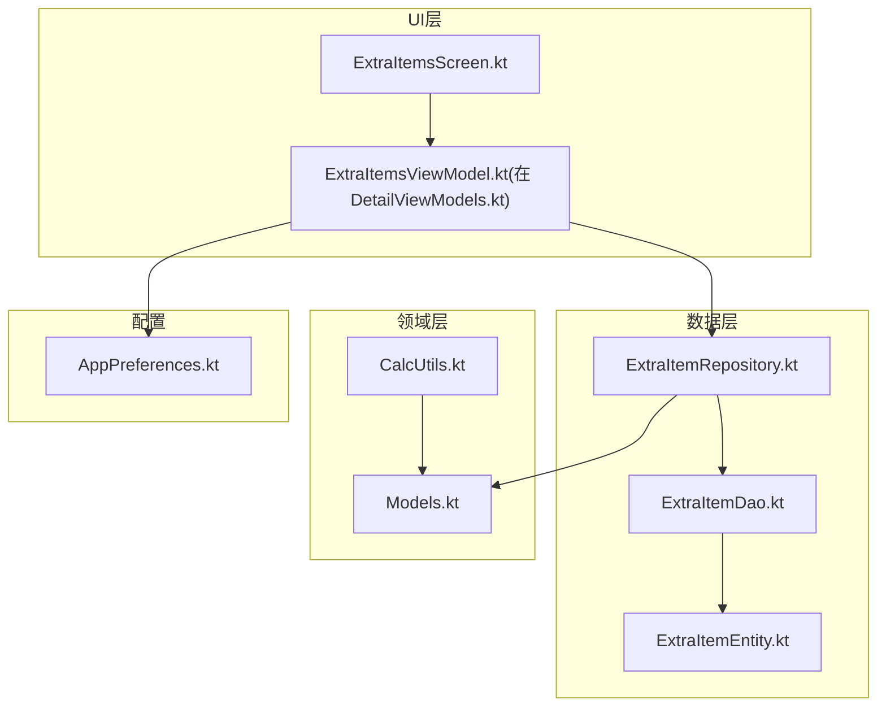
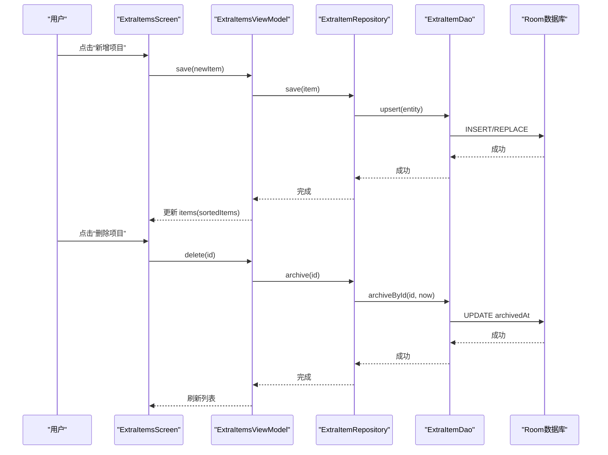
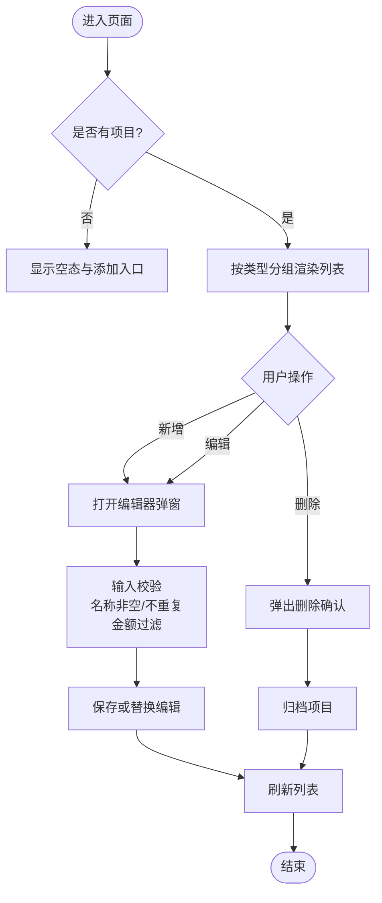
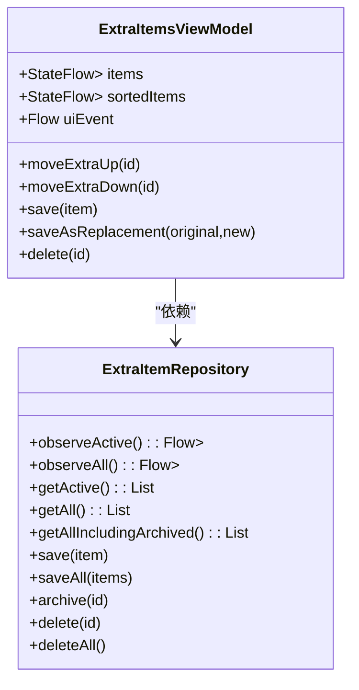
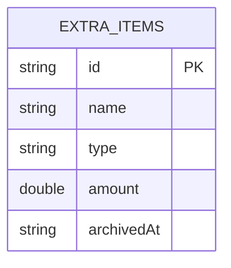
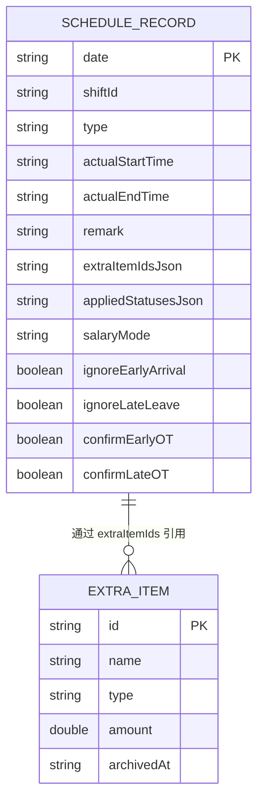
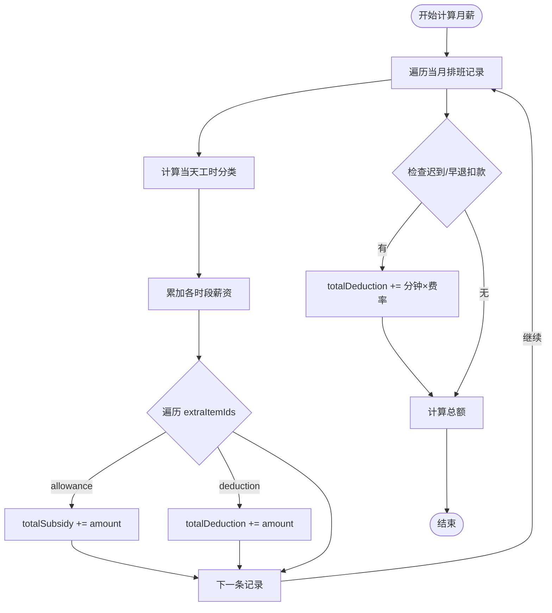
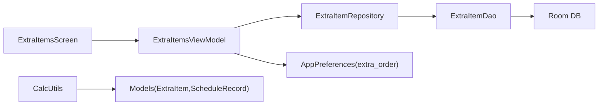

# 附加项目管理界面

<cite>
**本文引用的文件**   
- [ExtraItemsScreen.kt](file://app/src/main/java/com/schedulecalendar/app/ui/detail/ExtraItemsScreen.kt)
- [DetailViewModels.kt](file://app/src/main/java/com/schedulecalendar/app/ui/detail/DetailViewModels.kt)
- [ExtraItemRepository.kt](file://app/src/main/java/com/schedulecalendar/app/data/repository/ExtraItemRepository.kt)
- [ExtraItemDao.kt](file://app/src/main/java/com/schedulecalendar/app/data/db/dao/ExtraItemDao.kt)
- [ExtraItemEntity.kt](file://app/src/main/java/com/schedulecalendar/app/data/db/entity/ExtraItemEntity.kt)
- [Mappers.kt](file://app/src/main/java/com/schedulecalendar/app/data/repository/Mappers.kt)
- [Models.kt](file://app/src/main/java/com/schedulecalendar/app/domain/model/Models.kt)
- [CalcUtils.kt](file://app/src/main/java/com/schedulecalendar/app/domain/model/CalcUtils.kt)
- [AppPreferences.kt](file://app/src/main/java/com/schedulecalendar/app/data/prefs/AppPreferences.kt)
</cite>

## 目录
1. [简介](#简介)
2. [项目结构](#项目结构)
3. [核心组件](#核心组件)
4. [架构总览](#架构总览)
5. [详细组件分析](#详细组件分析)
6. [依赖关系分析](#依赖关系分析)
7. [性能考虑](#性能考虑)
8. [故障排查指南](#故障排查指南)
9. [结论](#结论)
10. [附录](#附录)

## 简介
本文件围绕“附加项目管理界面”（补贴与扣款项目）进行系统化说明，覆盖以下要点：
- ExtraItemsScreen 的实现与交互流程
- 项目的增删改查、分类管理（补贴/扣款）、金额设置
- 与排班记录的关联关系、批量应用逻辑与薪资计算规则
- 项目类型区分、颜色标识与排序功能
- 数据验证、冲突处理与用户体验优化
- 数据结构、业务规则与相关接口（DAO/Repository/ViewModel/偏好存储）

## 项目结构
附加项目功能贯穿 UI 层、ViewModel、数据仓库、数据库 DAO/Entity、领域模型与工具类。整体分层清晰：
- UI 层：ExtraItemsScreen 负责展示与编辑对话框
- ViewModel：ExtraItemsViewModel 管理状态、排序与事件
- Repository：ExtraItemRepository 封装持久化与 Flow 转换
- DAO：ExtraItemDao 提供 Room 查询与写入
- Entity：ExtraItemEntity 映射数据库表
- Domain：Models.kt 定义 ExtraItem、ScheduleRecord 等
- CalcUtils：薪资与工时计算，包含附加项目汇总
- Preferences：排序顺序的持久化

图表来源
- [ExtraItemsScreen.kt:1-219](file://app/src/main/java/com/schedulecalendar/app/ui/detail/ExtraItemsScreen.kt#L1-L219)
- [DetailViewModels.kt:430-543](file://app/src/main/java/com/schedulecalendar/app/ui/detail/DetailViewModels.kt#L430-L543)
- [ExtraItemRepository.kt:1-31](file://app/src/main/java/com/schedulecalendar/app/data/repository/ExtraItemRepository.kt#L1-L31)
- [ExtraItemDao.kt:1-41](file://app/src/main/java/com/schedulecalendar/app/data/db/dao/ExtraItemDao.kt#L1-L41)
- [ExtraItemEntity.kt:1-16](file://app/src/main/java/com/schedulecalendar/app/data/db/entity/ExtraItemEntity.kt#L1-L16)
- [Models.kt:103-110](file://app/src/main/java/com/schedulecalendar/app/domain/model/Models.kt#L103-L110)
- [CalcUtils.kt:365-444](file://app/src/main/java/com/schedulecalendar/app/domain/model/CalcUtils.kt#L365-L444)
- [AppPreferences.kt:135-144](file://app/src/main/java/com/schedulecalendar/app/data/prefs/AppPreferences.kt#L135-L144)

章节来源
- [ExtraItemsScreen.kt:1-219](file://app/src/main/java/com/schedulecalendar/app/ui/detail/ExtraItemsScreen.kt#L1-L219)
- [DetailViewModels.kt:430-543](file://app/src/main/java/com/schedulecalendar/app/ui/detail/DetailViewModels.kt#L430-L543)
- [ExtraItemRepository.kt:1-31](file://app/src/main/java/com/schedulecalendar/app/data/repository/ExtraItemRepository.kt#L1-L31)
- [ExtraItemDao.kt:1-41](file://app/src/main/java/com/schedulecalendar/app/data/db/dao/ExtraItemDao.kt#L1-L41)
- [ExtraItemEntity.kt:1-16](file://app/src/main/java/com/schedulecalendar/app/data/db/entity/ExtraItemEntity.kt#L1-L16)
- [Models.kt:103-110](file://app/src/main/java/com/schedulecalendar/app/domain/model/Models.kt#L103-L110)
- [CalcUtils.kt:365-444](file://app/src/main/java/com/schedulecalendar/app/domain/model/CalcUtils.kt#L365-L444)
- [AppPreferences.kt:135-144](file://app/src/main/java/com/schedulecalendar/app/data/prefs/AppPreferences.kt#L135-L144)

## 核心组件
- ExtraItemsScreen：展示补贴/扣款列表、新增/编辑弹窗、删除确认；按类型分组显示；支持 Snackbar 错误提示。
- ExtraItemsViewModel：暴露 items 与 sortedItems（含自定义排序），处理保存、替换编辑、归档删除、移动上/下排序。
- ExtraItemRepository：封装 observeActive/observeAll、upsert、archive/delete、getAllIncludingArchived。
- ExtraItemDao：Room DAO，提供有效/全部项目查询、归档、删除、批量 upsert。
- ExtraItemEntity：数据库实体，字段 id/name/type/amount/archivedAt。
- Models.kt：ExtraItem 领域模型；ScheduleRecord.extraItemIds 关联附加项目 ID 列表。
- CalcUtils：薪资计算中累计 totalSubsidy/totalDeduction，并用于每日明细 extrasTotal。
- AppPreferences：extra_order 键值对，维护用户自定义排序。

章节来源
- [ExtraItemsScreen.kt:32-113](file://app/src/main/java/com/schedulecalendar/app/ui/detail/ExtraItemsScreen.kt#L32-L113)
- [DetailViewModels.kt:434-521](file://app/src/main/java/com/schedulecalendar/app/ui/detail/DetailViewModels.kt#L434-L521)
- [ExtraItemRepository.kt:11-30](file://app/src/main/java/com/schedulecalendar/app/data/repository/ExtraItemRepository.kt#L11-L30)
- [ExtraItemDao.kt:8-40](file://app/src/main/java/com/schedulecalendar/app/data/db/dao/ExtraItemDao.kt#L8-L40)
- [ExtraItemEntity.kt:7-15](file://app/src/main/java/com/schedulecalendar/app/data/db/entity/ExtraItemEntity.kt#L7-L15)
- [Models.kt:103-110](file://app/src/main/java/com/schedulecalendar/app/domain/model/Models.kt#L103-L110)
- [Models.kt:82-101](file://app/src/main/java/com/schedulecalendar/app/domain/model/Models.kt#L82-L101)
- [CalcUtils.kt:365-444](file://app/src/main/java/com/schedulecalendar/app/domain/model/CalcUtils.kt#L365-L444)
- [AppPreferences.kt:135-144](file://app/src/main/java/com/schedulecalendar/app/data/prefs/AppPreferences.kt#L135-L144)

## 架构总览
附加项目从 UI 到数据的完整调用链如下：

图表来源
- [ExtraItemsScreen.kt:92-113](file://app/src/main/java/com/schedulecalendar/app/ui/detail/ExtraItemsScreen.kt#L92-L113)
- [DetailViewModels.kt:494-521](file://app/src/main/java/com/schedulecalendar/app/ui/detail/DetailViewModels.kt#L494-L521)
- [ExtraItemRepository.kt:24-28](file://app/src/main/java/com/schedulecalendar/app/data/repository/ExtraItemRepository.kt#L24-L28)
- [ExtraItemDao.kt:25-33](file://app/src/main/java/com/schedulecalendar/app/data/db/dao/ExtraItemDao.kt#L25-L33)

## 详细组件分析

### 界面与交互（ExtraItemsScreen）
- 列表分组：按 type="allowance"（补贴）与 type="deduction"（扣款）分别渲染区块。
- 卡片展示：名称与金额（带正负号前缀）。
- 编辑器弹窗：名称必填、重复校验（忽略大小写）、金额仅允许数字与小数点、IME 自动填充保护。
- 删除确认：提示历史数据不受影响，执行逻辑删除（归档）。
- 错误反馈：通过 Snackbar 展示保存失败信息。

图表来源
- [ExtraItemsScreen.kt:59-113](file://app/src/main/java/com/schedulecalendar/app/ui/detail/ExtraItemsScreen.kt#L59-L113)
- [ExtraItemsScreen.kt:140-219](file://app/src/main/java/com/schedulecalendar/app/ui/detail/ExtraItemsScreen.kt#L140-L219)

章节来源
- [ExtraItemsScreen.kt:32-113](file://app/src/main/java/com/schedulecalendar/app/ui/detail/ExtraItemsScreen.kt#L32-L113)
- [ExtraItemsScreen.kt:140-219](file://app/src/main/java/com/schedulecalendar/app/ui/detail/ExtraItemsScreen.kt#L140-L219)

### 视图模型（ExtraItemsViewModel）
- 数据流：items 来自 repo.observeActive()，sortedItems 结合 _extraOrder 实现自定义排序。
- 排序：moveExtraUp/moveExtraDown 交换位置并持久化到 preferences。
- 保存：save 新增后置顶；saveAsReplacement 先创建新记录再归档旧记录，保留历史金额。
- 删除：delete 使用归档（逻辑删除），保证历史引用不变。
- 事件：uiEvent 发送 ShowError 供 UI 消费。

图表来源
- [DetailViewModels.kt:434-521](file://app/src/main/java/com/schedulecalendar/app/ui/detail/DetailViewModels.kt#L434-L521)
- [ExtraItemRepository.kt:11-30](file://app/src/main/java/com/schedulecalendar/app/data/repository/ExtraItemRepository.kt#L11-L30)

章节来源
- [DetailViewModels.kt:434-521](file://app/src/main/java/com/schedulecalendar/app/ui/detail/DetailViewModels.kt#L434-L521)
- [ExtraItemRepository.kt:11-30](file://app/src/main/java/com/schedulecalendar/app/data/repository/ExtraItemRepository.kt#L11-L30)

### 数据访问（Repository & DAO & Entity）
- Repository：将 DAO 的 Entity 转换为 Domain 模型，暴露 Flow 与 suspend 方法。
- DAO：
  - observeActive：仅返回未归档项目，按 name 升序。
  - observeAll/getAllIncludingArchived：包含归档项，用于薪资计算查找历史金额。
  - upsert/upsertAll：REPLACE 策略。
  - archiveById：逻辑删除，设置 archivedAt。
  - deleteById/deleteAll：物理删除。
- Entity：id/name/type/amount/archivedAt。

图表来源
- [ExtraItemEntity.kt:7-15](file://app/src/main/java/com/schedulecalendar/app/data/db/entity/ExtraItemEntity.kt#L7-L15)
- [ExtraItemDao.kt:8-40](file://app/src/main/java/com/schedulecalendar/app/data/db/dao/ExtraItemDao.kt#L8-L40)
- [ExtraItemRepository.kt:11-30](file://app/src/main/java/com/schedulecalendar/app/data/repository/ExtraItemRepository.kt#L11-L30)

章节来源
- [ExtraItemDao.kt:8-40](file://app/src/main/java/com/schedulecalendar/app/data/db/dao/ExtraItemDao.kt#L8-L40)
- [ExtraItemEntity.kt:7-15](file://app/src/main/java/com/schedulecalendar/app/data/db/entity/ExtraItemEntity.kt#L7-L15)
- [ExtraItemRepository.kt:11-30](file://app/src/main/java/com/schedulecalendar/app/data/repository/ExtraItemRepository.kt#L11-L30)

### 领域模型与关联关系
- ExtraItem：id/name/type/amount/archivedAt。type 为 "allowance" 或 "deduction"。
- ScheduleRecord：extraItemIds 列表关联多个附加项目 ID。
- DayScheduleDetail：extras 列表用于每日明细展示；extrasTotal 用于当日收入调整。

图表来源
- [Models.kt:82-101](file://app/src/main/java/com/schedulecalendar/app/domain/model/Models.kt#L82-L101)
- [Models.kt:103-110](file://app/src/main/java/com/schedulecalendar/app/domain/model/Models.kt#L103-L110)
- [Mappers.kt:92-128](file://app/src/main/java/com/schedulecalendar/app/data/repository/Mappers.kt#L92-L128)

章节来源
- [Models.kt:82-101](file://app/src/main/java/com/schedulecalendar/app/domain/model/Models.kt#L82-L101)
- [Models.kt:103-110](file://app/src/main/java/com/schedulecalendar/app/domain/model/Models.kt#L103-L110)
- [Mappers.kt:92-128](file://app/src/main/java/com/schedulecalendar/app/data/repository/Mappers.kt#L92-L128)

### 薪资计算与批量应用规则
- 月度薪资计算：遍历当月排班，累加正常/加班/周末/节假日薪资；对每条记录的 extraItemIds 查找对应 ExtraItem，按 type 累加 totalSubsidy 或 totalDeduction。
- 每日明细：extrasTotal = sum(allowance.amount) - sum(deduction.amount)，最终 dailySalaryWithExtras = baseSalary + hours*rate + extrasTotal。
- 迟到/早退扣款：若配置了费率，则按分钟计入 totalDeduction。

图表来源
- [CalcUtils.kt:365-444](file://app/src/main/java/com/schedulecalendar/app/domain/model/CalcUtils.kt#L365-L444)
- [CalcUtils.kt:448-486](file://app/src/main/java/com/schedulecalendar/app/domain/model/CalcUtils.kt#L448-L486)

章节来源
- [CalcUtils.kt:365-444](file://app/src/main/java/com/schedulecalendar/app/domain/model/CalcUtils.kt#L365-L444)
- [CalcUtils.kt:448-486](file://app/src/main/java/com/schedulecalendar/app/domain/model/CalcUtils.kt#L448-L486)

### 排序与颜色标识
- 排序：_extraOrder 由 preferences 读取，sortedItems 根据 order 重组列表，缺失项保持原相对顺序。
- 颜色标识：当前界面未对补贴/扣款项目使用不同颜色标签，但可通过扩展 Card/Text 颜色增强视觉区分。

章节来源
- [DetailViewModels.kt:446-492](file://app/src/main/java/com/schedulecalendar/app/ui/detail/DetailViewModels.kt#L446-L492)
- [AppPreferences.kt:135-144](file://app/src/main/java/com/schedulecalendar/app/data/prefs/AppPreferences.kt#L135-L144)

## 依赖关系分析
- UI → ViewModel：ExtraItemsScreen 依赖 ExtraItemsViewModel 暴露的 StateFlow 与事件。
- ViewModel → Repository：通过 repository 获取 Flow 与执行写操作。
- Repository → DAO：封装 entity↔domain 转换与 Flow/map。
- DAO → Database：Room 注解与 SQL 查询。
- CalcUtils → Models：薪资计算依赖 ExtraItem/ScheduleRecord 等模型。
- Preferences：排序顺序独立于数据库，便于用户自定义。

图表来源
- [ExtraItemsScreen.kt:32-113](file://app/src/main/java/com/schedulecalendar/app/ui/detail/ExtraItemsScreen.kt#L32-L113)
- [DetailViewModels.kt:434-521](file://app/src/main/java/com/schedulecalendar/app/ui/detail/DetailViewModels.kt#L434-L521)
- [ExtraItemRepository.kt:11-30](file://app/src/main/java/com/schedulecalendar/app/data/repository/ExtraItemRepository.kt#L11-L30)
- [ExtraItemDao.kt:8-40](file://app/src/main/java/com/schedulecalendar/app/data/db/dao/ExtraItemDao.kt#L8-L40)
- [CalcUtils.kt:365-444](file://app/src/main/java/com/schedulecalendar/app/domain/model/CalcUtils.kt#L365-L444)
- [AppPreferences.kt:135-144](file://app/src/main/java/com/schedulecalendar/app/data/prefs/AppPreferences.kt#L135-L144)

章节来源
- [ExtraItemsScreen.kt:32-113](file://app/src/main/java/com/schedulecalendar/app/ui/detail/ExtraItemsScreen.kt#L32-L113)
- [DetailViewModels.kt:434-521](file://app/src/main/java/com/schedulecalendar/app/ui/detail/DetailViewModels.kt#L434-L521)
- [ExtraItemRepository.kt:11-30](file://app/src/main/java/com/schedulecalendar/app/data/repository/ExtraItemRepository.kt#L11-L30)
- [ExtraItemDao.kt:8-40](file://app/src/main/java/com/schedulecalendar/app/data/db/dao/ExtraItemDao.kt#L8-L40)
- [CalcUtils.kt:365-444](file://app/src/main/java/com/schedulecalendar/app/domain/model/CalcUtils.kt#L365-L444)
- [AppPreferences.kt:135-144](file://app/src/main/java/com/schedulecalendar/app/data/prefs/AppPreferences.kt#L135-L144)

## 性能考虑
- Flow 与 stateIn：UI 订阅 observeActive()，避免频繁刷新；stateIn 控制生命周期与缓存。
- 排序合并：sortedItems 使用 combine 合并 items 与 _extraOrder，仅在任一变化时重算。
- 批量写入：repository 提供 saveAll，适合批量导入场景（如从备份恢复）。
- 查询优化：observeActive 仅返回未归档项，减少 UI 负担；薪资计算使用 getAllIncludingArchived 以兼容历史金额。

[本节为通用指导，无需特定文件引用]

## 故障排查指南
- 保存失败：ViewModel 捕获异常并通过 uiEvent.ShowError 通知 UI，检查网络/权限/磁盘空间（若涉及外部存储）或数据库约束。
- 名称重复：编辑器弹窗已做忽略大小写的重复校验，确保唯一性。
- IME 自动填充问题：金额输入框聚焦时开启 150ms 保护窗口，避免自动填入 "0"。
- 历史数据一致性：删除采用归档（archivedAt），不影响已有排班记录的 extraItemIds 引用。

章节来源
- [DetailViewModels.kt:494-521](file://app/src/main/java/com/schedulecalendar/app/ui/detail/DetailViewModels.kt#L494-L521)
- [ExtraItemsScreen.kt:140-219](file://app/src/main/java/com/schedulecalendar/app/ui/detail/ExtraItemsScreen.kt#L140-L219)
- [ExtraItemDao.kt:31-36](file://app/src/main/java/com/schedulecalendar/app/data/db/dao/ExtraItemDao.kt#L31-L36)

## 结论
附加项目管理界面实现了清晰的增删改查、分类展示、金额设置与排序功能，并通过逻辑删除保障历史数据一致性。与排班记录的关联通过 extraItemIds 实现，薪资计算模块准确累计补贴与扣款。整体架构分层明确，易于扩展与维护。

[本节为总结，无需特定文件引用]

## 附录

### 数据结构说明
- ExtraItem：id/name/type/amount/archivedAt
- ScheduleRecord：date/type/shiftId/actualStartTime/actualEndTime/remark/extraItemIds/appliedStatus/salaryMode/...
- DayScheduleDetail：date/record/shift/hours/salary/extras

章节来源
- [Models.kt:103-110](file://app/src/main/java/com/schedulecalendar/app/domain/model/Models.kt#L103-L110)
- [Models.kt:82-101](file://app/src/main/java/com/schedulecalendar/app/domain/model/Models.kt#L82-L101)
- [Models.kt:242-255](file://app/src/main/java/com/schedulecalendar/app/domain/model/Models.kt#L242-L255)

### 业务规则摘要
- 类型：allowance（补贴，+）、deduction（扣款，-）
- 排序：用户自定义顺序优先，未排序项保持原相对顺序
- 删除：逻辑删除（归档），历史引用不变
- 薪资：totalSubsidy 与 totalDeduction 分别累加，迟到/早退按分钟扣款（若配置）

章节来源
- [Models.kt:103-110](file://app/src/main/java/com/schedulecalendar/app/domain/model/Models.kt#L103-L110)
- [DetailViewModels.kt:446-492](file://app/src/main/java/com/schedulecalendar/app/ui/detail/DetailViewModels.kt#L446-L492)
- [CalcUtils.kt:365-444](file://app/src/main/java/com/schedulecalendar/app/domain/model/CalcUtils.kt#L365-L444)

### API 接口概览（DAO/Repository/ViewModel）
- DAO
  - observeActive()/observeAll()：Flow<List<ExtraItemEntity>>
  - getAll()/getAllIncludingArchived()：List<ExtraItemEntity>
  - upsert()/upsertAll()：单条/批量写入
  - archiveById()/deleteById()/deleteAll()：归档/删除
- Repository
  - observeActive()/observeAll()：Flow<List<ExtraItem>>
  - getActive()/getAll()/getAllIncludingArchived()：List<ExtraItem>
  - save()/saveAll()/archive()/delete()/deleteAll()
- ViewModel
  - items/sortedItems：StateFlow<List<ExtraItem>>
  - moveExtraUp()/moveExtraDown()：排序
  - save()/saveAsReplacement()/delete()：CRUD
  - uiEvent：ShowError

章节来源
- [ExtraItemDao.kt:8-40](file://app/src/main/java/com/schedulecalendar/app/data/db/dao/ExtraItemDao.kt#L8-L40)
- [ExtraItemRepository.kt:11-30](file://app/src/main/java/com/schedulecalendar/app/data/repository/ExtraItemRepository.kt#L11-L30)
- [DetailViewModels.kt:434-521](file://app/src/main/java/com/schedulecalendar/app/ui/detail/DetailViewModels.kt#L434-L521)