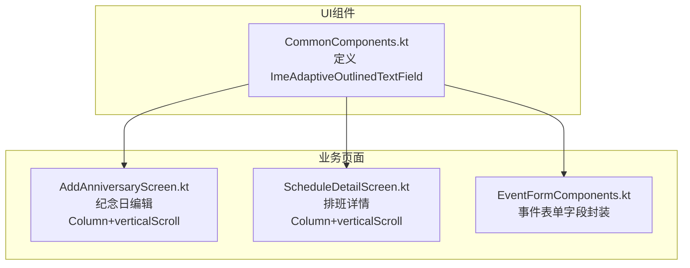
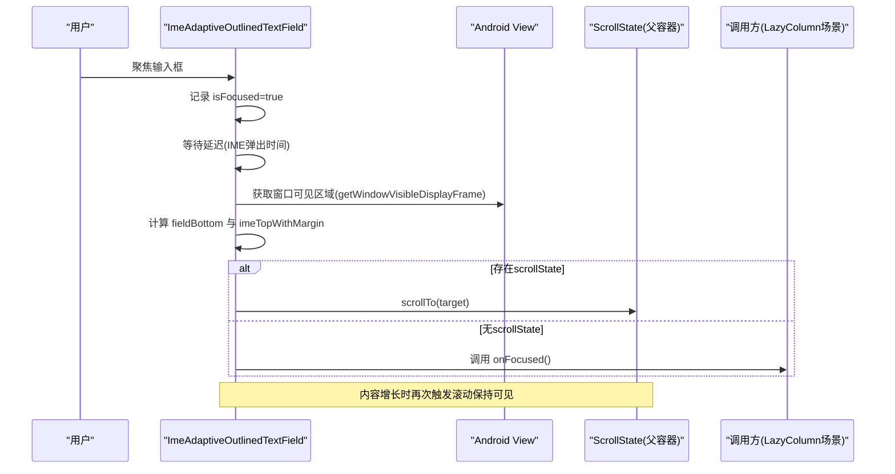
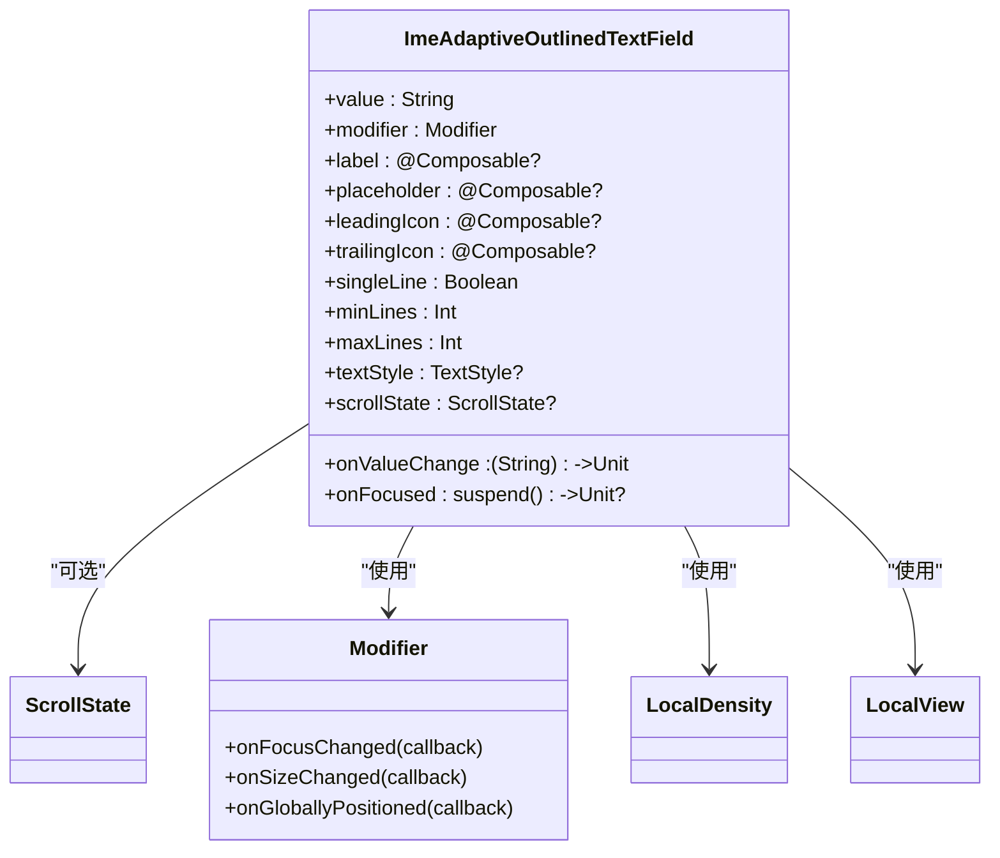

# IME自适应输入框

<cite>
**本文引用的文件**   
- [CommonComponents.kt](file://app/src/main/java/com/schedulecalendar/app/ui/component/CommonComponents.kt)
- [EventFormComponents.kt](file://app/src/main/java/com/schedulecalendar/app/ui/todo/EventFormComponents.kt)
- [AddAnniversaryScreen.kt](file://app/src/main/java/com/schedulecalendar/app/ui/todo/AddAnniversaryScreen.kt)
- [ScheduleDetailScreen.kt](file://app/src/main/java/com/schedulecalendar/app/ui/detail/ScheduleDetailScreen.kt)
</cite>

## 目录
1. [简介](#简介)
2. [项目结构](#项目结构)
3. [核心组件](#核心组件)
4. [架构总览](#架构总览)
5. [详细组件分析](#详细组件分析)
6. [依赖关系分析](#依赖关系分析)
7. [性能考虑](#性能考虑)
8. [故障排查指南](#故障排查指南)
9. [结论](#结论)
10. [附录：使用示例与最佳实践](#附录使用示例与最佳实践)

## 简介
本文件围绕 ImeAdaptiveOutlinedTextField 组件，系统性阐述软键盘遮挡问题的解决方案，包括焦点检测、位置计算与自动滚动机制；详解高级属性 scrollState、onFocused 及回调处理；解释 IME 弹出检测、延迟策略与精确滚动算法；给出 Column+verticalScroll 与 LazyColumn 等不同场景的使用方法；并提供性能优化技巧、内存管理建议、复杂表单中的实际应用与常见问题兼容性处理。

## 项目结构
该组件位于通用 UI 组件模块中，被多个业务页面复用，典型使用场景包括纪念日编辑、排班详情等。

图表来源
- [CommonComponents.kt:356-439](file://app/src/main/java/com/schedulecalendar/app/ui/component/CommonComponents.kt#L356-L439)
- [AddAnniversaryScreen.kt:196-218](file://app/src/main/java/com/schedulecalendar/app/ui/todo/AddAnniversaryScreen.kt#L196-L218)
- [ScheduleDetailScreen.kt:48-122](file://app/src/main/java/com/schedulecalendar/app/ui/detail/ScheduleDetailScreen.kt#L48-L122)
- [EventFormComponents.kt:88-105](file://app/src/main/java/com/schedulecalendar/app/ui/todo/EventFormComponents.kt#L88-L105)

章节来源
- [CommonComponents.kt:356-439](file://app/src/main/java/com/schedulecalendar/app/ui/component/CommonComponents.kt#L356-L439)
- [AddAnniversaryScreen.kt:196-218](file://app/src/main/java/com/schedulecalendar/app/ui/todo/AddAnniversaryScreen.kt#L196-L218)
- [ScheduleDetailScreen.kt:48-122](file://app/src/main/java/com/schedulecalendar/app/ui/detail/ScheduleDetailScreen.kt#L48-L122)
- [EventFormComponents.kt:88-105](file://app/src/main/java/com/schedulecalendar/app/ui/todo/EventFormComponents.kt#L88-L105)

## 核心组件
ImeAdaptiveOutlinedTextField 是一个基于 OutlinedTextField 的增强输入框，专门解决软键盘遮挡问题。其核心能力包括：
- 焦点检测：监听输入框焦点变化，触发后续滚动逻辑
- 位置计算：获取输入框在根视图中的 Y 坐标与高度，结合窗口可见区域计算溢出量
- 自动滚动：根据溢出量对父级 ScrollState 执行 scrollTo，确保输入框下边缘刚好位于键盘上方
- 内容增长适配：当多行输入导致高度变化时，再次触发滚动以保持可见
- 双模式支持：
  - Column+verticalScroll：传入 scrollState，组件内部直接滚动
  - LazyColumn：通过 onFocused 回调由调用方自行处理滚动

章节来源
- [CommonComponents.kt:356-439](file://app/src/main/java/com/schedulecalendar/app/ui/component/CommonComponents.kt#L356-L439)

## 架构总览
下图展示了组件在不同容器中的交互流程与数据流。

图表来源
- [CommonComponents.kt:390-439](file://app/src/main/java/com/schedulecalendar/app/ui/component/CommonComponents.kt#L390-L439)

## 详细组件分析

### 焦点检测与位置计算
- 焦点监听：通过 onFocusChanged 更新 isFocused
- 尺寸监听：onSizeChanged 记录输入框高度
- 全局定位：onGloballyPositioned 获取 positionInRoot().y，用于计算输入框底部位置

这些监听共同构成“输入框在屏幕上的绝对位置”信息，为后续滚动计算提供基础。

章节来源
- [CommonComponents.kt:390-398](file://app/src/main/java/com/schedulecalendar/app/ui/component/CommonComponents.kt#L390-L398)

### IME弹出检测与延迟处理
- 使用 LaunchedEffect(isFocused) 在获得焦点后延迟固定时长，等待 IME 完全弹出
- 延迟后读取窗口可见区域 bottom，作为键盘顶部参考线
- 若未提供 scrollState，则调用 onFocused 让上层决定滚动策略

章节来源
- [CommonComponents.kt:424-430](file://app/src/main/java/com/schedulecalendar/app/ui/component/CommonComponents.kt#L424-L430)

### 精确滚动算法
- 计算 fieldBottom = fieldY + fieldHeight
- 计算 imeTopWithMargin = windowRect.bottom - marginPx（marginPx 为固定像素边距）
- overflow = fieldBottom - imeTopWithMargin
- 若 overflow > 0，则 target = scrollState.value + overflow，并限制在 [0, max] 范围内
- 调用 scrollState.scrollTo(target)

该算法保证输入框下边缘始终位于键盘上方，且不会超出可滚动范围。

章节来源
- [CommonComponents.kt:402-422](file://app/src/main/java/com/schedulecalendar/app/ui/component/CommonComponents.kt#L402-L422)

### 内容增长时的二次滚动
- 使用 LaunchedEffect(fieldHeight.intValue) 监听高度变化
- 当处于聚焦状态且高度大于 0 时，延迟后再次执行滚动，确保多行输入增长时仍可见

章节来源
- [CommonComponents.kt:432-438](file://app/src/main/java/com/schedulecalendar/app/ui/component/CommonComponents.kt#L432-L438)

### 高级属性与回调
- scrollState: 父级 Column 的 ScrollState，传入后组件自动滚动
- onFocused: 在 LazyColumn 场景下，由调用方实现滚动逻辑（例如 lazyListState.scrollToItem）

章节来源
- [CommonComponents.kt:369-370](file://app/src/main/java/com/schedulecalendar/app/ui/component/CommonComponents.kt#L369-L370)

### 不同场景使用方法

#### Column + verticalScroll
- 创建 rememberScrollState()
- 将 scrollState 传递给 ImeAdaptiveOutlinedTextField
- 外层 Column 添加 .imePadding() 以预留键盘空间

章节来源
- [AddAnniversaryScreen.kt:196-218](file://app/src/main/java/com/schedulecalendar/app/ui/todo/AddAnniversaryScreen.kt#L196-L218)
- [ScheduleDetailScreen.kt:48-122](file://app/src/main/java/com/schedulecalendar/app/ui/detail/ScheduleDetailScreen.kt#L48-L122)

#### LazyColumn
- 不传 scrollState，改为提供 onFocused 回调
- 在 onFocused 中执行 lazyListState.scrollToItem(index) 或 animateScrollToItem
- 注意在列表项频繁重组时避免重复滚动

章节来源
- [CommonComponents.kt:419-421](file://app/src/main/java/com/schedulecalendar/app/ui/component/CommonComponents.kt#L419-L421)

### 复杂表单中的应用与最佳实践
- 标题、描述、地点等输入字段统一使用 ImeAdaptiveOutlinedTextField，保证一致的键盘适配体验
- 对于多行文本输入，设置 minLines/maxLines 控制初始高度与最大扩展
- 在长表单底部增加 Spacer 留白，确保最后一个输入框可滚动到键盘上方

章节来源
- [EventFormComponents.kt:88-105](file://app/src/main/java/com/schedulecalendar/app/ui/todo/EventFormComponents.kt#L88-L105)
- [EventFormComponents.kt:204-241](file://app/src/main/java/com/schedulecalendar/app/ui/todo/EventFormComponents.kt#L204-L241)
- [AddAnniversaryScreen.kt:399-408](file://app/src/main/java/com/schedulecalendar/app/ui/todo/AddAnniversaryScreen.kt#L399-L408)

## 依赖关系分析
组件依赖以下 Android/Compose API：
- LocalDensity：单位转换（dp→px）
- LocalView：获取当前 View 实例，用于 getWindowVisibleDisplayFrame
- Modifier.onFocusChanged/onSizeChanged/onGloballyPositioned：生命周期与布局回调
- LaunchedEffect：协程延迟与副作用
- ScrollState：滚动控制

图表来源
- [CommonComponents.kt:356-439](file://app/src/main/java/com/schedulecalendar/app/ui/component/CommonComponents.kt#L356-L439)

章节来源
- [CommonComponents.kt:356-439](file://app/src/main/java/com/schedulecalendar/app/ui/component/CommonComponents.kt#L356-L439)

## 性能考虑
- 延迟策略：IME弹出等待 400ms，内容增长重滚 100ms，避免频繁滚动导致的抖动
- 边界保护：target 值通过 coerceIn(0, maxValue) 限制，防止越界滚动
- 状态最小化：仅维护 isFocused、fieldHeight、fieldYInRoot 三个必要状态
- 避免重复计算：positionInRoot 仅在布局变更时更新，减少不必要的测量开销
- 内存管理：remember/mutableIntStateOf/mutableFloatStateOf 确保状态在重组间稳定

[本节为通用指导，无需具体文件引用]

## 故障排查指南
- 输入框未被滚动到键盘上方
  - 检查是否传入了正确的 scrollState
  - 确认外层 Column 使用了 .imePadding()
  - 验证窗口可见区域 bottom 是否正确（某些设备可能返回异常）
- 多行输入时内容被遮挡
  - 确保设置了合理的 minLines/maxLines
  - 观察 LaunchedEffect(fieldHeight.intValue) 是否触发
- LazyColumn 场景滚动无效
  - 确认 onFocused 回调已实现并调用 lazyListState.scrollToItem/animateScrollToItem
  - 避免在重组期间重复触发滚动

章节来源
- [CommonComponents.kt:402-439](file://app/src/main/java/com/schedulecalendar/app/ui/component/CommonComponents.kt#L402-L439)

## 结论
ImeAdaptiveOutlinedTextField 通过焦点检测、位置计算与精确滚动算法，有效解决了软键盘遮挡问题。其在 Column+verticalScroll 与 LazyColumn 两种模式下均能提供一致的用户体验。配合合理的延迟策略与边界保护，组件在性能与稳定性方面表现良好。在复杂表单中，统一使用该组件可显著提升输入体验的一致性。

[本节为总结性内容，无需具体文件引用]

## 附录：使用示例与最佳实践

### Column+verticalScroll 示例
- 创建 rememberScrollState()
- 将 scrollState 传递给 ImeAdaptiveOutlinedTextField
- 外层 Column 添加 .imePadding()

章节来源
- [AddAnniversaryScreen.kt:196-218](file://app/src/main/java/com/schedulecalendar/app/ui/todo/AddAnniversaryScreen.kt#L196-L218)
- [ScheduleDetailScreen.kt:48-122](file://app/src/main/java/com/schedulecalendar/app/ui/detail/ScheduleDetailScreen.kt#L48-L122)

### LazyColumn 示例
- 不传 scrollState，提供 onFocused 回调
- 在 onFocused 中执行滚动逻辑

章节来源
- [CommonComponents.kt:419-421](file://app/src/main/java/com/schedulecalendar/app/ui/component/CommonComponents.kt#L419-L421)

### 表单字段封装
- EventTitleField、EventDescriptionField、EventLocationField 均基于 ImeAdaptiveOutlinedTextField 封装，统一样式与行为

章节来源
- [EventFormComponents.kt:88-105](file://app/src/main/java/com/schedulecalendar/app/ui/todo/EventFormComponents.kt#L88-L105)
- [EventFormComponents.kt:204-241](file://app/src/main/java/com/schedulecalendar/app/ui/todo/EventFormComponents.kt#L204-L241)

### 兼容性注意事项
- 不同厂商键盘弹出时机差异：通过固定延迟与二次滚动补偿
- 窗口可见区域异常：在某些设备上需额外校验 bottom 值
- 多行输入高度变化：确保 maxLines 足够大以避免截断

[本节为通用指导，无需具体文件引用]