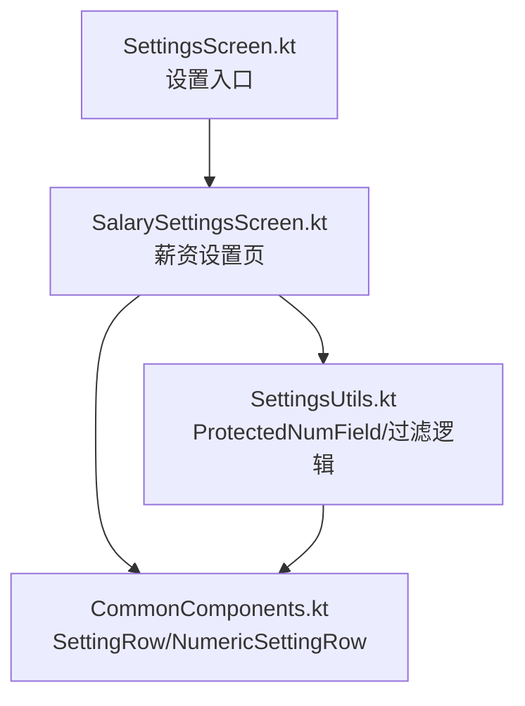
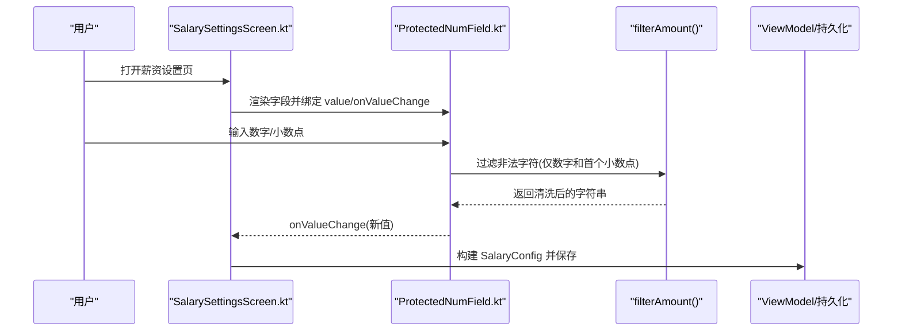
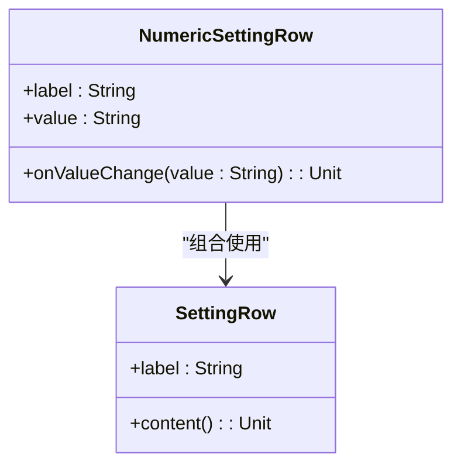
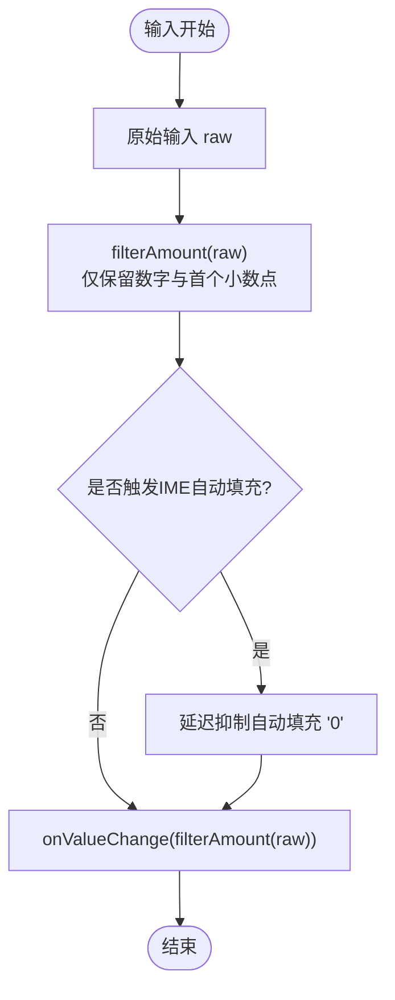
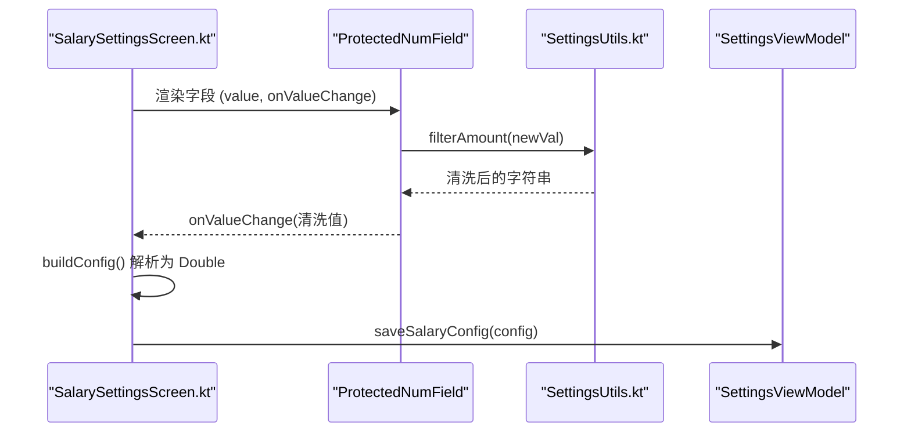
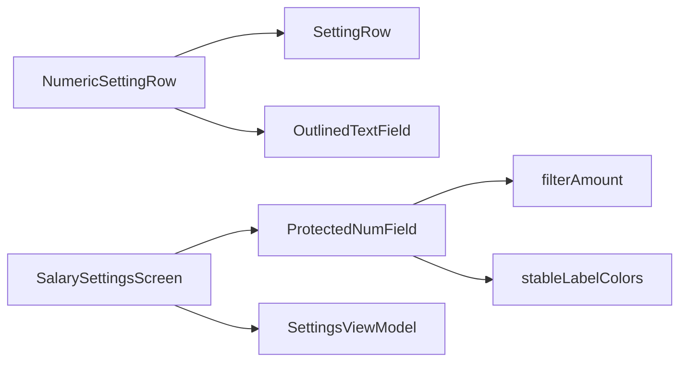

# 数字设置组件

<cite>
**本文引用的文件**   
- [CommonComponents.kt](file://app/src/main/java/com/schedulecalendar/app/ui/component/CommonComponents.kt)
- [SalarySettingsScreen.kt](file://app/src/main/java/com/schedulecalendar/app/ui/settings/SalarySettingsScreen.kt)
- [SettingsUtils.kt](file://app/src/main/java/com/schedulecalendar/app/ui/settings/SettingsUtils.kt)
- [SettingsScreen.kt](file://app/src/main/java/com/schedulecalendar/app/ui/settings/SettingsScreen.kt)
</cite>

## 目录
1. [简介](#简介)
2. [项目结构](#项目结构)
3. [核心组件](#核心组件)
4. [架构总览](#架构总览)
5. [详细组件分析](#详细组件分析)
6. [依赖关系分析](#依赖关系分析)
7. [性能考量](#性能考量)
8. [故障排查指南](#故障排查指南)
9. [结论](#结论)
10. [附录](#附录)

## 简介
本文件围绕 NumericSettingRow 数字设置组件，系统阐述其在 Compose UI 中的实现方式、与 SettingRow 的组合使用、输入验证与格式化策略、键盘处理最佳实践，以及在实际业务（薪资设置、时间间隔配置等）中的应用模式。文档同时给出数据绑定机制说明、与其他设置组件的集成方法，并提供可视化图示帮助理解。

## 项目结构
- 通用组件位于 ui/component 包，提供基础 UI 构件，如 SettingRow、NumericSettingRow、稳定标签颜色配置等。
- 设置页面位于 ui/settings 包，包含薪资设置页及工具函数，用于数字输入过滤、默认值转换等。
- 入口导航在 SettingsScreen 中组织各设置项卡片，进入薪资设置页。

图表来源
- [SettingsScreen.kt:1-472](file://app/src/main/java/com/schedulecalendar/app/ui/settings/SettingsScreen.kt#L1-L472)
- [SalarySettingsScreen.kt:1-90](file://app/src/main/java/com/schedulecalendar/app/ui/settings/SalarySettingsScreen.kt#L1-L90)
- [SettingsUtils.kt:1-70](file://app/src/main/java/com/schedulecalendar/app/ui/settings/SettingsUtils.kt#L1-L70)
- [CommonComponents.kt:1-440](file://app/src/main/java/com/schedulecalendar/app/ui/component/CommonComponents.kt#L1-L440)

章节来源
- [SettingsScreen.kt:1-472](file://app/src/main/java/com/schedulecalendar/app/ui/settings/SettingsScreen.kt#L1-L472)
- [SalarySettingsScreen.kt:1-90](file://app/src/main/java/com/schedulecalendar/app/ui/settings/SalarySettingsScreen.kt#L1-L90)
- [SettingsUtils.kt:1-70](file://app/src/main/java/com/schedulecalendar/app/ui/settings/SettingsUtils.kt#L1-L70)
- [CommonComponents.kt:1-440](file://app/src/main/java/com/schedulecalendar/app/ui/component/CommonComponents.kt#L1-L440)

## 核心组件
- SettingRow：设置行容器，负责标签与内容的左右布局与分割线。
- NumericSettingRow：基于 SettingRow 的数字输入行，内部使用 OutlinedTextField，单行模式，固定宽度，样式继承主题。
- ProtectedNumField：带焦点保护的数字输入框，内置金额/数字过滤、IME 自动填充保护、十进制键盘类型。
- stableLabelColors：禁用浮动标签动画的颜色配置，使标签始终常驻显示。

章节来源
- [CommonComponents.kt:128-167](file://app/src/main/java/com/schedulecalendar/app/ui/component/CommonComponents.kt#L128-L167)
- [SettingsUtils.kt:18-69](file://app/src/main/java/com/schedulecalendar/app/ui/settings/SettingsUtils.kt#L18-L69)

## 架构总览
NumericSettingRow 作为轻量级数字输入行，通常由上层设置页面组合使用；当需要更严格的输入控制时，可使用 ProtectedNumField 替代或配合 filterAmount 进行统一校验。薪资设置页展示了典型的数据绑定与保存流程。

图表来源
- [SalarySettingsScreen.kt:38-90](file://app/src/main/java/com/schedulecalendar/app/ui/settings/SalarySettingsScreen.kt#L38-L90)
- [SettingsUtils.kt:18-69](file://app/src/main/java/com/schedulecalendar/app/ui/settings/SettingsUtils.kt#L18-L69)

## 详细组件分析

### NumericSettingRow 数字设置行
- 作用：以“标签 + 数字输入框”的形式呈现可编辑的设置项。
- 参数
  - label：设置项名称
  - value：当前文本值（字符串形式）
  - onValueChange：值变化回调，接收新字符串
- 行为
  - 使用 SettingRow 包裹，保持统一的行布局与分割线
  - OutlinedTextField 设置为单行模式，固定宽度，样式采用主题字体
- 适用场景：简单数值展示与编辑，无需复杂校验时使用

图表来源
- [CommonComponents.kt:128-167](file://app/src/main/java/com/schedulecalendar/app/ui/component/CommonComponents.kt#L128-L167)

章节来源
- [CommonComponents.kt:128-167](file://app/src/main/java/com/schedulecalendar/app/ui/component/CommonComponents.kt#L128-L167)

### ProtectedNumField 受保护的数字输入框
- 作用：对金额/数字输入进行严格过滤，避免 IME 自动填充导致异常。
- 关键能力
  - filterAmount：仅保留数字与第一个小数点，去除多余小数点
  - toInputString：将 0.0/0 转为空字符串，便于显示占位符
  - onFocusChanged：聚焦空字段时延迟抑制 IME 自动填入 "0"
  - KeyboardType.Decimal：启用十进制键盘
- 适用场景：薪资、费率、扣款等金额类字段

图表来源
- [SettingsUtils.kt:18-69](file://app/src/main/java/com/schedulecalendar/app/ui/settings/SettingsUtils.kt#L18-L69)

章节来源
- [SettingsUtils.kt:18-69](file://app/src/main/java/com/schedulecalendar/app/ui/settings/SettingsUtils.kt#L18-L69)

### 薪资设置页中的数据绑定与保存
- 状态管理：页面内为每个字段维护本地字符串状态，初始值通过 toInputString 转换
- 构建配置：每次保存时将字符串解析为 Double，未解析则回退为 0.0
- 保存动作：调用 ViewModel 的 saveSalaryConfig 完成持久化

图表来源
- [SalarySettingsScreen.kt:38-90](file://app/src/main/java/com/schedulecalendar/app/ui/settings/SalarySettingsScreen.kt#L38-L90)
- [SettingsUtils.kt:18-69](file://app/src/main/java/com/schedulecalendar/app/ui/settings/SettingsUtils.kt#L18-L69)

章节来源
- [SalarySettingsScreen.kt:38-90](file://app/src/main/java/com/schedulecalendar/app/ui/settings/SalarySettingsScreen.kt#L38-L90)
- [SettingsUtils.kt:18-69](file://app/src/main/java/com/schedulecalendar/app/ui/settings/SettingsUtils.kt#L18-L69)

### 与 SettingRow 的组合使用方式
- NumericSettingRow 直接复用 SettingRow 的布局与分割线，保证设置项风格一致
- 若需自定义内容（如图标、按钮），可直接使用 SettingRow(label){ content }

章节来源
- [CommonComponents.kt:128-167](file://app/src/main/java/com/schedulecalendar/app/ui/component/CommonComponents.kt#L128-L167)

### 输入验证与格式化最佳实践
- 过滤规则：仅允许数字与首个小数点，避免重复小数点
- 占位符策略：值为 0.0/0 时显示为空，提示用户输入
- 键盘类型：Decimal，提升移动端输入体验
- IME 保护：聚焦空字段时延迟抑制自动填充 "0"

章节来源
- [SettingsUtils.kt:18-69](file://app/src/main/java/com/schedulecalendar/app/ui/settings/SettingsUtils.kt#L18-L69)

### 键盘处理与输入格式化的最佳实践
- 使用 KeyboardOptions(keyboardType = KeyboardType.Decimal) 调出数字键盘
- 在 onValueChange 中进行实时过滤，确保输入合法性
- 利用 onFocusChanged 检测聚焦状态，必要时延迟处理以避免 IME 干扰
- 对于多行或动态高度输入，可参考 ImeAdaptiveOutlinedTextField 的滚动适配思路（非本组件必需）

章节来源
- [SettingsUtils.kt:18-69](file://app/src/main/java/com/schedulecalendar/app/ui/settings/SettingsUtils.kt#L18-L69)
- [CommonComponents.kt:356-439](file://app/src/main/java/com/schedulecalendar/app/ui/component/CommonComponents.kt#L356-L439)

### 与其他设置组件的集成方法
- 在设置页中使用 SettingsCard 组织功能入口，点击后进入具体设置页（如薪资设置）
- 在薪资设置页内，使用 ProtectedNumField 或 NumericSettingRow 组合呈现各项数值设置
- 如需时间选择，可结合 TimePickerField/ExpandableTimePicker（同属 CommonComponents）

章节来源
- [SettingsScreen.kt:1-472](file://app/src/main/java/com/schedulecalendar/app/ui/settings/SettingsScreen.kt#L1-L472)
- [SalarySettingsScreen.kt:1-90](file://app/src/main/java/com/schedulecalendar/app/ui/settings/SalarySettingsScreen.kt#L1-L90)
- [CommonComponents.kt:169-342](file://app/src/main/java/com/schedulecalendar/app/ui/component/CommonComponents.kt#L169-L342)

## 依赖关系分析
- NumericSettingRow 依赖 SettingRow 与 OutlinedTextField
- ProtectedNumField 依赖 filterAmount、stableLabelColors、KeyboardOptions
- SalarySettingsScreen 依赖 SettingsUtils 的转换与过滤能力，并与 ViewModel 交互

图表来源
- [CommonComponents.kt:128-167](file://app/src/main/java/com/schedulecalendar/app/ui/component/CommonComponents.kt#L128-L167)
- [SettingsUtils.kt:18-69](file://app/src/main/java/com/schedulecalendar/app/ui/settings/SettingsUtils.kt#L18-L69)
- [SalarySettingsScreen.kt:38-90](file://app/src/main/java/com/schedulecalendar/app/ui/settings/SalarySettingsScreen.kt#L38-L90)

章节来源
- [CommonComponents.kt:128-167](file://app/src/main/java/com/schedulecalendar/app/ui/component/CommonComponents.kt#L128-L167)
- [SettingsUtils.kt:18-69](file://app/src/main/java/com/schedulecalendar/app/ui/settings/SettingsUtils.kt#L18-L69)
- [SalarySettingsScreen.kt:38-90](file://app/src/main/java/com/schedulecalendar/app/ui/settings/SalarySettingsScreen.kt#L38-L90)

## 性能考量
- 单行输入减少布局重排，提升响应速度
- 实时过滤避免无效状态更新，降低重组开销
- 使用 remember 与局部状态，避免不必要的 recomposition
- 固定宽度与主题样式复用，减少绘制差异

[本节为通用指导，不直接分析具体文件]

## 故障排查指南
- 问题：输入出现多个小数点
  - 解决：确认使用 filterAmount 进行过滤，确保只保留首个小数点
- 问题：聚焦空字段自动填入 "0"
  - 解决：检查 onFocusChanged 的抑制逻辑与延迟开关是否正确
- 问题：键盘类型不正确
  - 解决：确保 KeyboardOptions(keyboardType = KeyboardType.Decimal)
- 问题：标签位置跳动
  - 解决：使用 stableLabelColors 固定标签颜色，禁用浮动动画

章节来源
- [SettingsUtils.kt:18-69](file://app/src/main/java/com/schedulecalendar/app/ui/settings/SettingsUtils.kt#L18-L69)
- [CommonComponents.kt:149-153](file://app/src/main/java/com/schedulecalendar/app/ui/component/CommonComponents.kt#L149-L153)

## 结论
NumericSettingRow 提供了简洁的数字输入行能力，适合快速搭建设置界面；当需要更强的输入控制时，推荐使用 ProtectedNumField 与 filterAmount 组合，确保输入合法与用户体验一致。薪资设置页展示了标准的数据绑定与保存流程，可作为其他设置页面的参考模板。

[本节为总结性内容，不直接分析具体文件]

## 附录
- 属性参数说明
  - label：设置项名称
  - value：当前文本值（字符串）
  - onValueChange：值变化回调（接收新字符串）
- 数据绑定机制
  - 页面层维护字符串状态，输入时即时过滤并更新
  - 保存时转换为 Double，未解析则回退为 0.0
- 应用场景
  - 薪资设置：底薪、绩效、时薪、社保、公积金等
  - 时间间隔配置：分钟/小时等数值型参数（可结合时间选择器）
- 键盘与格式化
  - Decimal 键盘、实时过滤、IME 保护、占位符策略

[本节为补充信息，不直接分析具体文件]