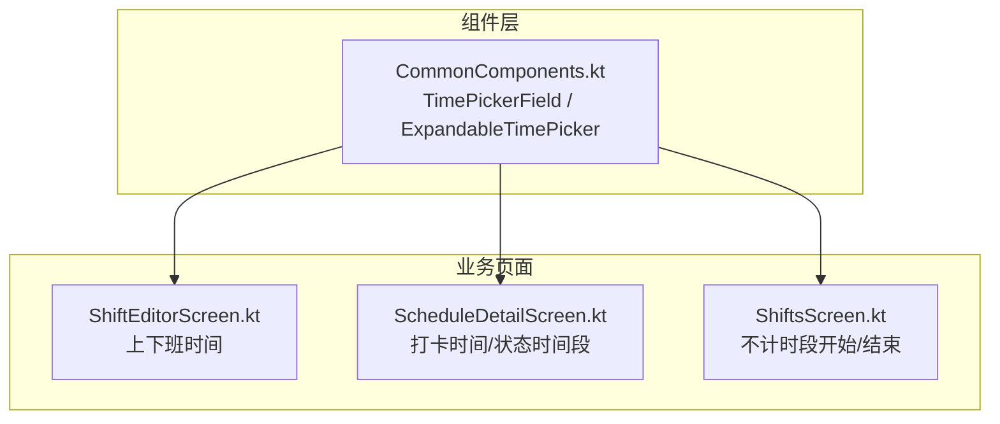
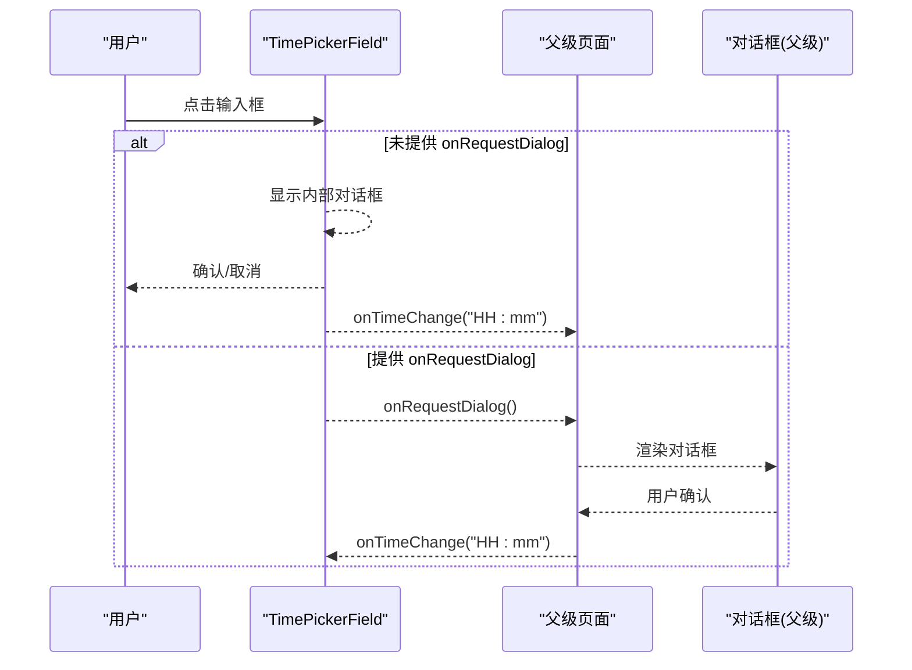
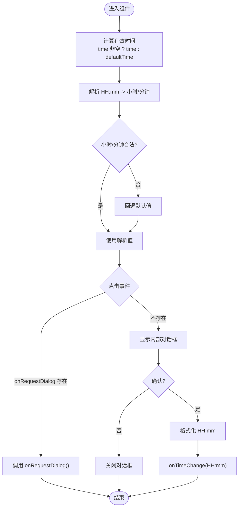
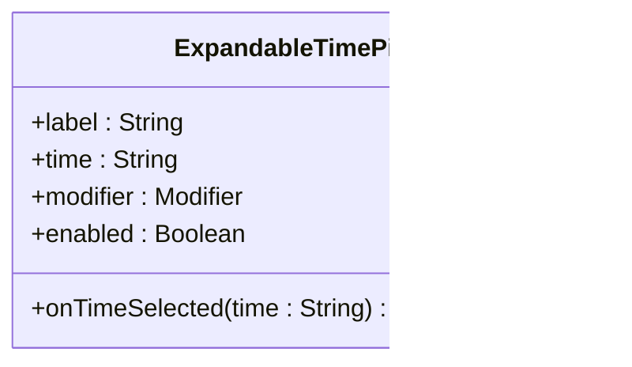
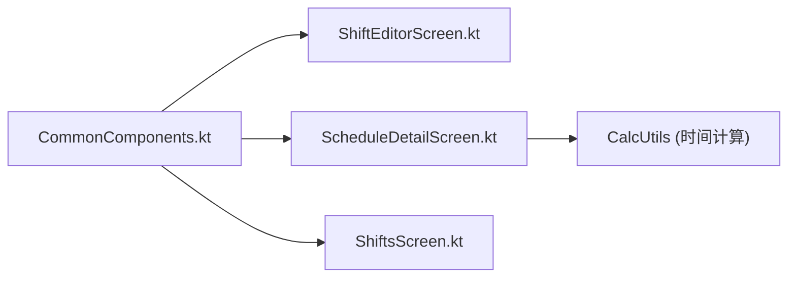

# 时间选择器组件

<cite>
**本文引用的文件**
- [CommonComponents.kt](file://app/src/main/java/com/schedulecalendar/app/ui/component/CommonComponents.kt)
- [ShiftEditorScreen.kt](file://app/src/main/java/com/schedulecalendar/app/ui/shifts/ShiftEditorScreen.kt)
- [ScheduleDetailScreen.kt](file://app/src/main/java/com/schedulecalendar/app/ui/detail/ScheduleDetailScreen.kt)
- [ShiftsScreen.kt](file://app/src/main/java/com/schedulecalendar/app/ui/shifts/ShiftsScreen.kt)
</cite>

## 目录
1. [简介](#简介)
2. [项目结构](#项目结构)
3. [核心组件](#核心组件)
4. [架构总览](#架构总览)
5. [详细组件分析](#详细组件分析)
6. [依赖关系分析](#依赖关系分析)
7. [性能与可用性考量](#性能与可用性考量)
8. [故障排查指南](#故障排查指南)
9. [结论](#结论)
10. [附录：使用场景与最佳实践](#附录使用场景与最佳实践)

## 简介
本文件围绕 TimePickerField 与 ExpandableTimePicker 两个时间选择器组件，系统阐述其实现差异、属性参数、配置选项、24小时制处理、默认值策略、输入校验逻辑，以及与表单集成、IME键盘适配和焦点管理的最佳实践。文档同时覆盖上下班时间设置、提醒时间配置等典型使用场景，并给出数据同步策略建议。

## 项目结构
时间选择器相关代码集中在 UI 组件层与具体业务页面中：
- 组件定义：CommonComponents.kt
- 班次编辑页（上下班时间）：ShiftEditorScreen.kt
- 排班详情页（打卡时间与状态时间段）：ScheduleDetailScreen.kt
- 不计时段编辑（开始/结束时间）：ShiftsScreen.kt

图表来源
- [CommonComponents.kt:184-259](file://app/src/main/java/com/schedulecalendar/app/ui/component/CommonComponents.kt#L184-L259)
- [ShiftEditorScreen.kt:86-111](file://app/src/main/java/com/schedulecalendar/app/ui/shifts/ShiftEditorScreen.kt#L86-L111)
- [ScheduleDetailScreen.kt:200-266](file://app/src/main/java/com/schedulecalendar/app/ui/detail/ScheduleDetailScreen.kt#L200-L266)
- [ShiftsScreen.kt:410-449](file://app/src/main/java/com/schedulecalendar/app/ui/shifts/ShiftsScreen.kt#L410-L449)

章节来源
- [CommonComponents.kt:184-259](file://app/src/main/java/com/schedulecalendar/app/ui/component/CommonComponents.kt#L184-L259)
- [ShiftEditorScreen.kt:86-111](file://app/src/main/java/com/schedulecalendar/app/ui/shifts/ShiftEditorScreen.kt#L86-L111)
- [ScheduleDetailScreen.kt:200-266](file://app/src/main/java/com/schedulecalendar/app/ui/detail/ScheduleDetailScreen.kt#L200-L266)
- [ShiftsScreen.kt:410-449](file://app/src/main/java/com/schedulecalendar/app/ui/shifts/ShiftsScreen.kt#L410-L449)

## 核心组件
- TimePickerField：可点击的“时间输入框”，支持两种模式
  - 内部对话框模式：未提供 onRequestDialog 时，组件内直接弹出 Material3 TimePicker 对话框
  - 外部请求模式：提供 onRequestDialog 时，点击仅触发回调，由父级负责渲染对话框（适合 LazyColumn 等复杂布局）
- ExpandableTimePicker：外观为带右侧图标的按钮式输入框，点击后弹出 Material3 TimePicker 对话框；适用于更简洁的展示场景

关键特性
- 24小时制：内部均通过 is24Hour = true 强制24小时显示
- 默认值：当 time 为空时，优先回退到 defaultTime；若仍为空，则按默认小时/分钟初始化
- 输入验证：对解析出的小时/分钟进行范围约束（0-23, 0-59），非法值回退到默认值
- 输出格式：统一以 "HH:mm" 字符串返回

章节来源
- [CommonComponents.kt:184-259](file://app/src/main/java/com/schedulecalendar/app/ui/component/CommonComponents.kt#L184-L259)
- [CommonComponents.kt:273-342](file://app/src/main/java/com/schedulecalendar/app/ui/component/CommonComponents.kt#L273-L342)

## 架构总览
TimePickerField 与 ExpandableTimePicker 作为独立的可组合项，被多个业务页面复用。对于需要集中管理对话框状态的复杂页面（如 ScheduleDetailScreen），采用“外部请求模式”将对话框提升到滚动容器之外，避免被裁剪或遮挡。

图表来源
- [CommonComponents.kt:184-259](file://app/src/main/java/com/schedulecalendar/app/ui/component/CommonComponents.kt#L184-L259)
- [ScheduleDetailScreen.kt:200-266](file://app/src/main/java/com/schedulecalendar/app/ui/detail/ScheduleDetailScreen.kt#L200-L266)

## 详细组件分析

### TimePickerField 组件
职责
- 提供只读的时间输入框，点击打开时间选择器
- 支持内部对话框与外部请求两种模式
- 统一格式化输出为 "HH:mm"

参数说明
- time: 当前时间字符串，格式 "HH:mm"，空表示未设置
- onTimeChange: 新时间回调
- label: 标签文本
- enabled: 是否可交互
- defaultTime: 默认时间字符串，time 为空时使用
- onRequestDialog: 可选回调，用于外部控制对话框渲染

内部流程
- 计算初始小时/分钟：优先使用 time，否则 defaultTime，再失败则回退到默认值
- 根据是否提供 onRequestDialog 决定显示内部对话框或触发回调
- 确认时将 state.hour/state.minute 格式化为 "HH:mm" 并回调

图表来源
- [CommonComponents.kt:184-259](file://app/src/main/java/com/schedulecalendar/app/ui/component/CommonComponents.kt#L184-L259)

章节来源
- [CommonComponents.kt:184-259](file://app/src/main/java/com/schedulecalendar/app/ui/component/CommonComponents.kt#L184-L259)

### ExpandableTimePicker 组件
职责
- 以“带图标按钮”的形式呈现时间选择入口
- 点击后弹出 Material3 TimePicker 对话框
- 适用于不需要输入框标签常驻的场景

参数说明
- label: 标签文本
- time: 当前时间字符串，格式 "HH:mm"
- onTimeSelected: 选定后的回调
- modifier: 修饰符
- enabled: 是否可交互

内部流程
- 解析 time 得到初始小时/分钟，非法值回退默认
- 点击后显示对话框，确认后格式化输出 "HH:mm"

图表来源
- [CommonComponents.kt:273-342](file://app/src/main/java/com/schedulecalendar/app/ui/component/CommonComponents.kt#L273-L342)

章节来源
- [CommonComponents.kt:273-342](file://app/src/main/java/com/schedulecalendar/app/ui/component/CommonComponents.kt#L273-L342)

### 在业务页面中的使用

#### 上下班时间设置（ShiftEditorScreen）
- 使用 TimePickerField 分别设置“上班时间”和“下班时间”
- 通过 onTimeChange 更新 ViewModel 状态
- 保存前进行基础校验（如完整性、重叠等）

章节来源
- [ShiftEditorScreen.kt:86-111](file://app/src/main/java/com/schedulecalendar/app/ui/shifts/ShiftEditorScreen.kt#L86-L111)

#### 打卡时间与状态时间段（ScheduleDetailScreen）
- 打卡时间：使用 TimePickerField 的 onRequestDialog 模式，将对话框提升到滚动容器外，避免被裁剪
- 状态时间段：在弹窗内再次使用 TimePickerField，结合 CalcUtils 进行时间范围约束与警告提示

章节来源
- [ScheduleDetailScreen.kt:200-266](file://app/src/main/java/com/schedulecalendar/app/ui/detail/ScheduleDetailScreen.kt#L200-L266)
- [ScheduleDetailScreen.kt:624-639](file://app/src/main/java/com/schedulecalendar/app/ui/detail/ScheduleDetailScreen.kt#L624-L639)

#### 不计时段编辑（ShiftsScreen）
- 使用 TimePickerField 设置“开始/结束”时间
- 保存时校验名称唯一性、时间完整性与重叠冲突

章节来源
- [ShiftsScreen.kt:410-449](file://app/src/main/java/com/schedulecalendar/app/ui/shifts/ShiftsScreen.kt#L410-L449)

## 依赖关系分析
- CommonComponents.kt 提供通用时间选择器组件
- ShiftEditorScreen.kt、ScheduleDetailScreen.kt、ShiftsScreen.kt 依赖该组件完成时间输入
- ScheduleDetailScreen.kt 还依赖 CalcUtils 进行时间范围约束与计算

图表来源
- [CommonComponents.kt:184-259](file://app/src/main/java/com/schedulecalendar/app/ui/component/CommonComponents.kt#L184-L259)
- [ShiftEditorScreen.kt:86-111](file://app/src/main/java/com/schedulecalendar/app/ui/shifts/ShiftEditorScreen.kt#L86-L111)
- [ScheduleDetailScreen.kt:200-266](file://app/src/main/java/com/schedulecalendar/app/ui/detail/ScheduleDetailScreen.kt#L200-L266)
- [ShiftsScreen.kt:410-449](file://app/src/main/java/com/schedulecraft/app/ui/shifts/ShiftsScreen.kt#L410-L449)

章节来源
- [CommonComponents.kt:184-259](file://app/src/main/java/com/schedulecalendar/app/ui/component/CommonComponents.kt#L184-L259)
- [ShiftEditorScreen.kt:86-111](file://app/src/main/java/com/schedulecalendar/app/ui/shifts/ShiftEditorScreen.kt#L86-L111)
- [ScheduleDetailScreen.kt:200-266](file://app/src/main/java/com/schedulecalendar/app/ui/detail/ScheduleDetailScreen.kt#L200-L266)
- [ShiftsScreen.kt:410-449](file://app/src/main/java/com/schedulecalendar/app/ui/shifts/ShiftsScreen.kt#L410-L449)

## 性能与可用性考量
- 24小时制：统一使用 is24Hour = true，避免地区化带来的歧义
- 默认值策略：当 time 为空时优先使用 defaultTime，提升首次打开体验
- 输入校验：对小时/分钟进行范围约束，防止非法输入导致异常
- IME 适配：在包含大量输入的页面（如备注）建议使用 ImeAdaptiveOutlinedTextField，确保输入框不被键盘遮挡
- 焦点管理：在复杂布局中使用 onRequestDialog 模式，将对话框提升到合适层级，避免被滚动容器裁剪

[本节为通用指导，无需特定文件引用]

## 故障排查指南
常见问题与定位
- 时间未生效：检查 onTimeChange/onTimeSelected 是否正确更新状态
- 对话框被裁剪：在 LazyColumn 或滚动容器中，使用 onRequestDialog 模式并在外层渲染对话框
- 默认值不生效：确认 time 是否为空，defaultTime 是否提供且格式正确
- 时间范围错误：在状态时间段编辑中，使用 CalcUtils 进行范围约束并提示用户

章节来源
- [ScheduleDetailScreen.kt:200-266](file://app/src/main/java/com/schedulecalendar/app/ui/detail/ScheduleDetailScreen.kt#L200-L266)
- [ScheduleDetailScreen.kt:624-639](file://app/src/main/java/com/schedulecalendar/app/ui/detail/ScheduleDetailScreen.kt#L624-L639)

## 结论
TimePickerField 与 ExpandableTimePicker 提供了灵活的时间选择能力，前者支持内部与外部两种对话框模式，后者提供更简洁的按钮式入口。通过统一的24小时制、默认值策略与输入校验，保证了用户体验的一致性与健壮性。在复杂布局中，推荐采用 onRequestDialog 模式以提升对话框渲染质量。配合 ImeAdaptiveOutlinedTextField 可实现良好的键盘适配与焦点管理。

[本节为总结，无需特定文件引用]

## 附录：使用场景与最佳实践

### 上下班时间设置
- 使用 TimePickerField 分别设置“上班时间”和“下班时间”
- 在保存前进行完整性校验与冲突检测

章节来源
- [ShiftEditorScreen.kt:86-111](file://app/src/main/java/com/schedulecalendar/app/ui/shifts/ShiftEditorScreen.kt#L86-L111)

### 提醒时间配置
- 提醒提前时间通常以分钟为单位，可使用自定义滚轮选择器（参考 ReminderSettingsScreen）
- 若需精确时间点提醒，可结合 TimePickerField 设置具体时间点

章节来源
- [ReminderSettingsScreen.kt:250-334](file://app/src/main/java/com/schedulecalendar/app/ui/settings/ReminderSettingsScreen.kt#L250-L334)

### IME 键盘适配与焦点管理
- 在长表单页面使用 ImeAdaptiveOutlinedTextField，自动处理键盘遮挡
- 在 LazyColumn 中通过 onFocused 回调由调用方处理滚动

章节来源
- [CommonComponents.kt:356-439](file://app/src/main/java/com/schedulecalendar/app/ui/component/CommonComponents.kt#L356-L439)

### 与表单组件的集成与数据同步
- 单向数据流：组件通过回调将时间字符串传递给父级，父级更新 ViewModel 状态
- 双向绑定：在简单场景中可直接将组件的 onTimeChange 指向 setState
- 校验与反馈：在父级进行业务校验，并通过 supportingText 或 Snackbar 反馈错误

章节来源
- [ShiftEditorScreen.kt:86-111](file://app/src/main/java/com/schedulecalendar/app/ui/shifts/ShiftEditorScreen.kt#L86-L111)
- [ScheduleDetailScreen.kt:200-266](file://app/src/main/java/com/schedulecalendar/app/ui/detail/ScheduleDetailScreen.kt#L200-L266)