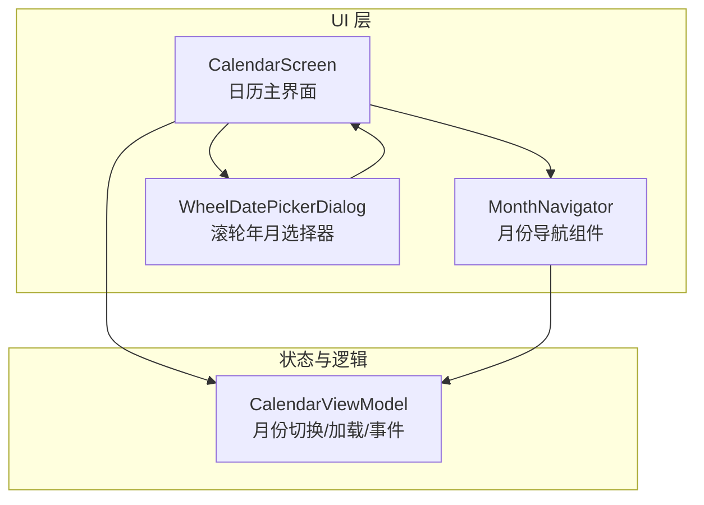
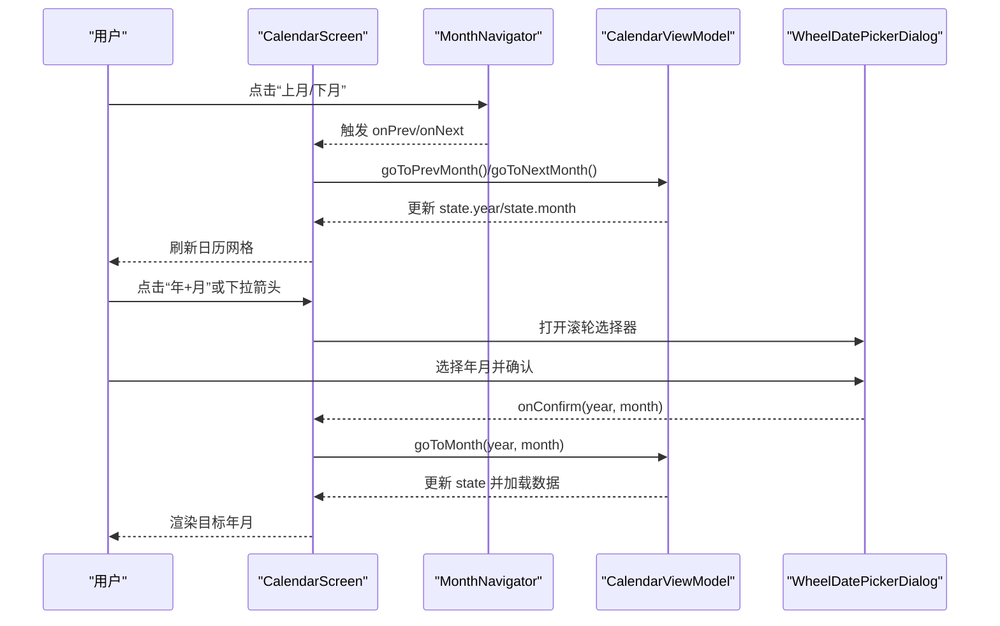
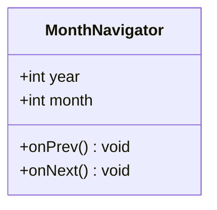
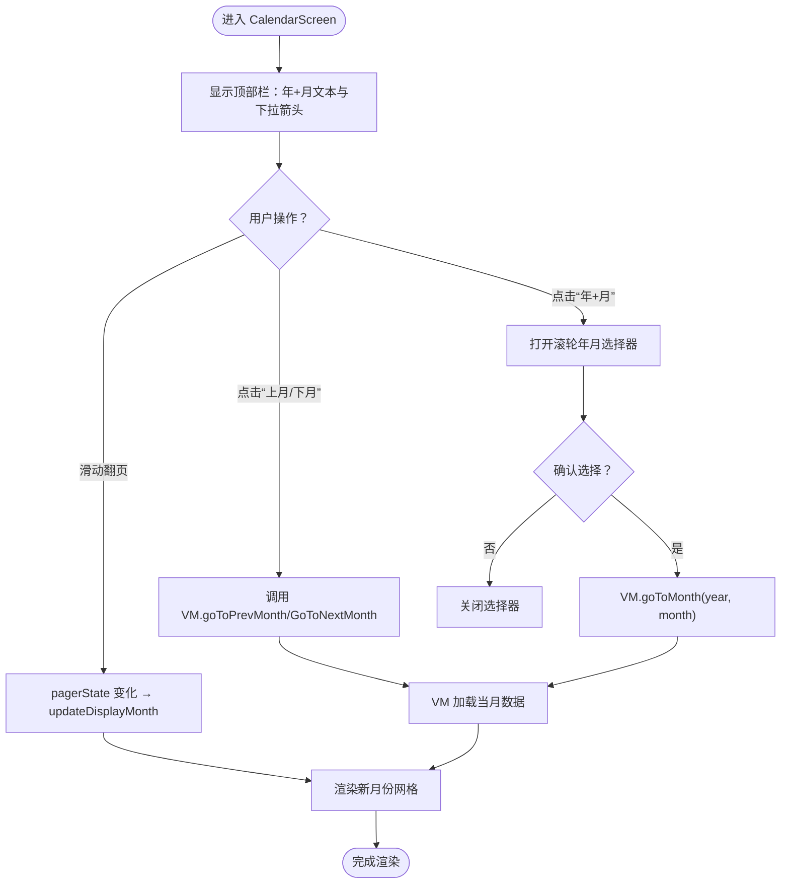
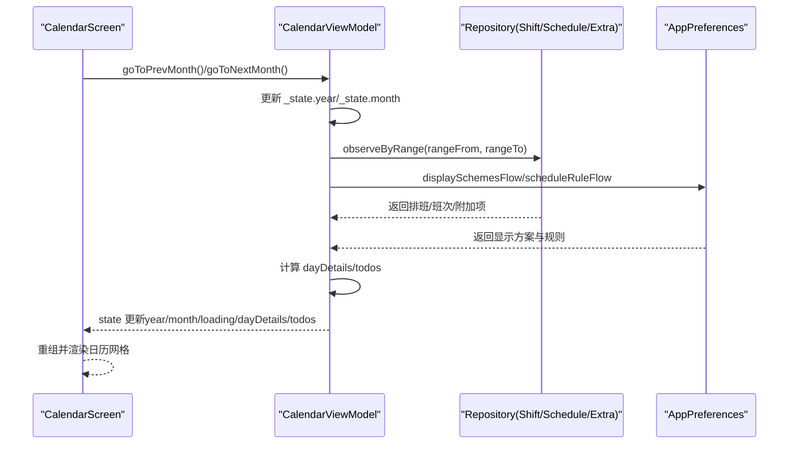
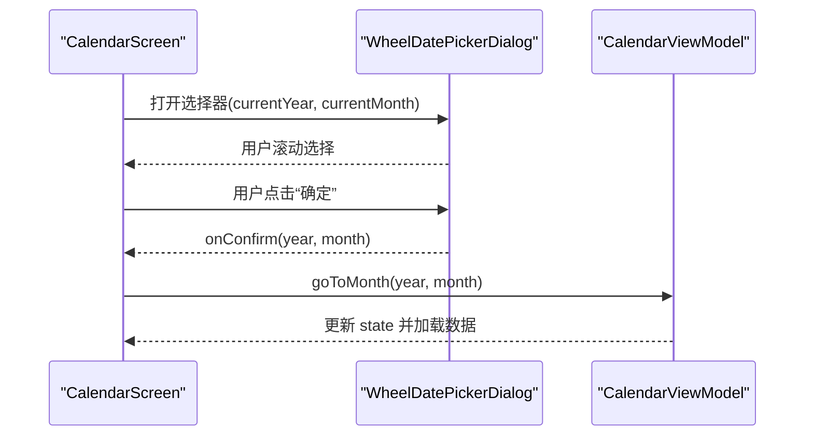
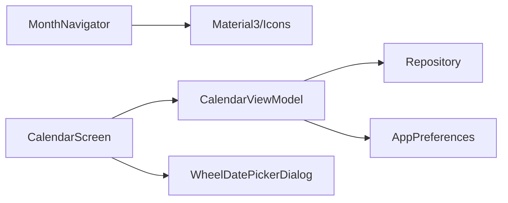

# 月份导航组件

<cite>
**本文引用的文件**   
- [CommonComponents.kt](file://app/src/main/java/com/schedulecalendar/app/ui/component/CommonComponents.kt)
- [CalendarScreen.kt](file://app/src/main/java/com/schedulecalendar/app/ui/calendar/CalendarScreen.kt)
- [CalendarViewModel.kt](file://app/src/main/java/com/schedulecalendar/app/ui/calendar/CalendarViewModel.kt)
- [DatePickerDialog.kt](file://app/src/main/java/com/schedulecalendar/app/ui/component/DatePickerDialog.kt)
</cite>

## 目录
1. [简介](#简介)
2. [项目结构](#项目结构)
3. [核心组件](#核心组件)
4. [架构总览](#架构总览)
5. [详细组件分析](#详细组件分析)
6. [依赖关系分析](#依赖关系分析)
7. [性能考量](#性能考量)
8. [故障排查指南](#故障排查指南)
9. [结论](#结论)
10. [附录](#附录)

## 简介
本文件围绕“MonthNavigator 月份导航组件”进行系统化文档说明，聚焦以下目标：
- 月份切换功能的实现：左右箭头按钮、年份月份显示与点击事件处理。
- 组件属性参数（year、month、onPrev、onNext）与回调机制。
- 布局设计与图标资源使用。
- 在日历界面中的实际应用示例。
- 可访问性支持与国际化考虑。
- 与日历组件的集成方法与状态同步策略。

## 项目结构
MonthNavigator 作为通用 UI 组件，位于公共组件模块；其调用方为 CalendarScreen，数据与状态由 CalendarViewModel 管理；日期选择弹窗由 DatePickerDialog 提供滚轮式年月选择能力。

图表来源
- [CalendarScreen.kt:304-462](file://app/src/main/java/com/schedulecalendar/app/ui/calendar/CalendarScreen.kt#L304-L462)
- [CommonComponents.kt:118-126](file://app/src/main/java/com/schedulecalendar/app/ui/component/CommonComponents.kt#L118-L126)
- [DatePickerDialog.kt:192-302](file://app/src/main/java/com/schedulecalendar/app/ui/component/DatePickerDialog.kt#L192-L302)
- [CalendarViewModel.kt:345-386](file://app/src/main/java/com/schedulecalendar/app/ui/calendar/CalendarViewModel.kt#L345-L386)

章节来源
- [CalendarScreen.kt:304-462](file://app/src/main/java/com/schedulecalendar/app/ui/calendar/CalendarScreen.kt#L304-L462)
- [CommonComponents.kt:118-126](file://app/src/main/java/com/schedulecalendar/app/ui/component/CommonComponents.kt#L118-L126)
- [DatePickerDialog.kt:192-302](file://app/src/main/java/com/schedulecalendar/app/ui/component/DatePickerDialog.kt#L192-L302)
- [CalendarViewModel.kt:345-386](file://app/src/main/java/com/schedulecalendar/app/ui/calendar/CalendarViewModel.kt#L345-L386)

## 核心组件
- MonthNavigator：提供“上月/下月”箭头按钮与当前年月的文本展示，通过 onPrev/onNext 回调通知上层进行月份切换。
- CalendarScreen：在顶部栏中展示“年+月”文本与下拉箭头，点击弹出滚轮年月选择器；同时支持滑动切换月份。
- CalendarViewModel：维护 year/month 状态，提供 goToPrevMonth/goToNextMonth/updateDisplayMonth/goToMonth 等方法，负责数据加载与事件分发。
- WheelDatePickerDialog：滚轮式年月选择弹窗，用于快速跳转到指定年月。

章节来源
- [CommonComponents.kt:118-126](file://app/src/main/java/com/schedulecalendar/app/ui/component/CommonComponents.kt#L118-L126)
- [CalendarScreen.kt:304-462](file://app/src/main/java/com/schedulecalendar/app/ui/calendar/CalendarScreen.kt#L304-L462)
- [CalendarViewModel.kt:345-386](file://app/src/main/java/com/schedulecalendar/app/ui/calendar/CalendarViewModel.kt#L345-L386)
- [DatePickerDialog.kt:192-302](file://app/src/main/java/com/schedulecalendar/app/ui/component/DatePickerDialog.kt#L192-L302)

## 架构总览
MonthNavigator 是纯展示型组件，不持有业务状态；所有月份切换逻辑由上层（CalendarScreen）与 ViewModel（CalendarViewModel）协作完成。用户交互路径包括：
- 点击“上月/下月”按钮 → 触发 onPrev/onNext → 调用 VM 方法更新月份并重新加载数据。
- 点击“年+月”文本或下拉箭头 → 打开滚轮选择器 → 确认后调用 VM 跳转至目标年月。
- 水平滑动翻页 → HorizontalPager 驱动 → 轻量级 updateDisplayMonth 同步显示月份，随后按需加载数据。

图表来源
- [CalendarScreen.kt:304-462](file://app/src/main/java/com/schedulecalendar/app/ui/calendar/CalendarScreen.kt#L304-L462)
- [CommonComponents.kt:118-126](file://app/src/main/java/com/schedulecalendar/app/ui/component/CommonComponents.kt#L118-L126)
- [CalendarViewModel.kt:345-386](file://app/src/main/java/com/schedulecalendar/app/ui/calendar/CalendarViewModel.kt#L345-L386)
- [DatePickerDialog.kt:192-302](file://app/src/main/java/com/schedulecalendar/app/ui/component/DatePickerDialog.kt#L192-L302)

## 详细组件分析

### MonthNavigator 组件
- 功能职责
  - 显示当前“年+月”。
  - 提供左右箭头按钮，分别触发“上月/下月”操作。
- 属性与回调
  - year: Int — 当前年份
  - month: Int — 当前月份
  - onPrev: () -> Unit — 上月回调
  - onNext: () -> Unit — 下月回调
- 布局与图标
  - 使用 Row 居中排列，左右为 IconButton，中间为 Text。
  - 图标使用 Material Icons 自动镜像的左/右箭头，contentDescription 分别为“上月”“下月”，便于无障碍读屏。
- 可访问性
  - 按钮具备 contentDescription，屏幕阅读器可朗读“上月/下月”。
  - 文本样式遵循主题排版，确保对比度与可读性。
- 国际化
  - 文案“上月/下月”为中文硬编码，如需多语言，建议将字符串抽取到资源文件并通过本地化替换。

图表来源
- [CommonComponents.kt:118-126](file://app/src/main/java/com/schedulecalendar/app/ui/component/CommonComponents.kt#L118-L126)

章节来源
- [CommonComponents.kt:118-126](file://app/src/main/java/com/schedulecalendar/app/ui/component/CommonComponents.kt#L118-L126)

### CalendarScreen 中的月份导航集成
- 顶部栏展示“年+月”文本与下拉箭头，点击后打开滚轮年月选择器。
- 支持 HorizontalPager 水平滑动切换月份，并在 pager 稳定后调用 updateDisplayMonth 同步显示月份。
- “今天”按钮在非当月或非今日选中时可见，点击后跳转至当天。
- 与 VM 的状态同步：
  - LaunchedEffect(state.year, state.month) 驱动 pager 位置同步。
  - pagerState.settledPage 变化时计算目标年月并调用 updateDisplayMonth。

图表来源
- [CalendarScreen.kt:304-462](file://app/src/main/java/com/schedulecalendar/app/ui/calendar/CalendarScreen.kt#L304-L462)
- [CalendarScreen.kt:475-554](file://app/src/main/java/com/schedulecalendar/app/ui/calendar/CalendarScreen.kt#L475-L554)
- [CalendarViewModel.kt:345-386](file://app/src/main/java/com/schedulecalendar/app/ui/calendar/CalendarViewModel.kt#L345-L386)

章节来源
- [CalendarScreen.kt:304-462](file://app/src/main/java/com/schedulecalendar/app/ui/calendar/CalendarScreen.kt#L304-L462)
- [CalendarScreen.kt:475-554](file://app/src/main/java/com/schedulecalendar/app/ui/calendar/CalendarScreen.kt#L475-L554)
- [CalendarViewModel.kt:345-386](file://app/src/main/java/com/schedulecalendar/app/ui/calendar/CalendarViewModel.kt#L345-L386)

### CalendarViewModel 月份切换与状态同步
- 关键方法
  - goToPrevMonth/goToNextMonth：切换月份并触发数据加载。
  - updateDisplayMonth：轻量级显示月份更新（常用于 pager 滑动）。
  - goToMonth/goToToday/goToDay：跳转到指定年月日或当天。
- 数据加载
  - loadCurrentMonth：根据当前年月计算覆盖范围（含相邻月份），合并班次、排班、附加项等数据，更新 dayDetails 与 todos。
- 事件分发
  - uiEvent Channel：向 UI 发送导航与消息事件（如 NavigateToDetail、ShowMessage/ShowError）。

图表来源
- [CalendarViewModel.kt:153-246](file://app/src/main/java/com/schedulecalendar/app/ui/calendar/CalendarViewModel.kt#L153-L246)
- [CalendarViewModel.kt:345-386](file://app/src/main/java/com/schedulecalendar/app/ui/calendar/CalendarViewModel.kt#L345-L386)

章节来源
- [CalendarViewModel.kt:153-246](file://app/src/main/java/com/schedulecalendar/app/ui/calendar/CalendarViewModel.kt#L153-L246)
- [CalendarViewModel.kt:345-386](file://app/src/main/java/com/schedulecalendar/app/ui/calendar/CalendarViewModel.kt#L345-L386)

### WheelDatePickerDialog 滚轮年月选择器
- 功能：以滚轮形式选择年与月，确认后回调 onConfirm(year, month)。
- 使用场景：CalendarScreen 顶部栏点击“年+月”或下拉箭头后打开。
- 交互流程：选择→确认→调用 VM.goToMonth→刷新日历。

图表来源
- [DatePickerDialog.kt:192-302](file://app/src/main/java/com/schedulecalendar/app/ui/component/DatePickerDialog.kt#L192-L302)
- [CalendarScreen.kt:674-685](file://app/src/main/java/com/schedulecalendar/app/ui/calendar/CalendarScreen.kt#L674-L685)
- [CalendarViewModel.kt:383-386](file://app/src/main/java/com/schedulecalendar/app/ui/calendar/CalendarViewModel.kt#L383-L386)

章节来源
- [DatePickerDialog.kt:192-302](file://app/src/main/java/com/schedulecalendar/app/ui/component/DatePickerDialog.kt#L192-L302)
- [CalendarScreen.kt:674-685](file://app/src/main/java/com/schedulecalendar/app/ui/calendar/CalendarScreen.kt#L674-L685)
- [CalendarViewModel.kt:383-386](file://app/src/main/java/com/schedulecalendar/app/ui/calendar/CalendarViewModel.kt#L383-L386)

## 依赖关系分析
- 组件耦合
  - MonthNavigator 仅依赖 UI 框架与图标库，无业务耦合。
  - CalendarScreen 依赖 VM 与 DatePickerDialog，承担交互编排与状态同步。
  - CalendarViewModel 依赖 Repository 与 Preferences，负责数据聚合与状态更新。
- 外部依赖
  - Material3 组件与图标。
  - Compose 动画与手势（HorizontalPager）。
  - WheelPickerCompose 滚轮选择器。

图表来源
- [CommonComponents.kt:118-126](file://app/src/main/java/com/schedulecalendar/app/ui/component/CommonComponents.kt#L118-L126)
- [CalendarScreen.kt:304-462](file://app/src/main/java/com/schedulecalendar/app/ui/calendar/CalendarScreen.kt#L304-L462)
- [CalendarViewModel.kt:153-246](file://app/src/main/java/com/schedulecalendar/app/ui/calendar/CalendarViewModel.kt#L153-L246)
- [DatePickerDialog.kt:192-302](file://app/src/main/java/com/schedulecalendar/app/ui/component/DatePickerDialog.kt#L192-L302)

章节来源
- [CommonComponents.kt:118-126](file://app/src/main/java/com/schedulecalendar/app/ui/component/CommonComponents.kt#L118-L126)
- [CalendarScreen.kt:304-462](file://app/src/main/java/com/schedulecalendar/app/ui/calendar/CalendarScreen.kt#L304-L462)
- [CalendarViewModel.kt:153-246](file://app/src/main/java/com/schedulecalendar/app/ui/calendar/CalendarViewModel.kt#L153-L246)
- [DatePickerDialog.kt:192-302](file://app/src/main/java/com/schedulecalendar/app/ui/component/DatePickerDialog.kt#L192-L302)

## 性能考量
- 轻量级月份更新：pager 滑动时使用 updateDisplayMonth，避免频繁全量数据重载，减少闪烁。
- 数据范围优化：loadCurrentMonth 仅加载上月/本月/下月范围，降低 IO 压力。
- 懒加载与取消：collectJob 在切月时取消旧协程，防止内存泄漏与重复计算。
- 渲染优化：日历网格按行计算高度并插值，保证平滑过渡。

[本节为通用指导，无需特定文件引用]

## 故障排查指南
- 现象：点击“上月/下月”无响应
  - 检查 MonthNavigator 的 onPrev/onNext 是否正确传入 CalendarScreen。
  - 确认 CalendarScreen 是否调用了 VM.goToPrevMonth/goToNextMonth。
- 现象：滑动翻页后月份未更新
  - 检查 pagerState.settledPage 收集逻辑与 updateDisplayMonth 调用。
  - 确认 LaunchedEffect(state.year, state.month) 是否驱动 pager 同步。
- 现象：滚轮选择器确认后未跳转
  - 检查 WheelDatePickerDialog 的 onConfirm 是否传递正确的 year/month。
  - 确认 CalendarScreen 是否调用 VM.goToMonth 并刷新状态。
- 现象：切换月份后数据未刷新
  - 检查 loadCurrentMonth 的数据源（Repository/Prefs）是否正常返回。
  - 观察 VM 的 _state.update 是否被触发，UI 是否重组。

章节来源
- [CalendarScreen.kt:304-462](file://app/src/main/java/com/schedulecalendar/app/ui/calendar/CalendarScreen.kt#L304-L462)
- [CalendarScreen.kt:475-554](file://app/src/main/java/com/schedulecalendar/app/ui/calendar/CalendarScreen.kt#L475-L554)
- [CalendarViewModel.kt:153-246](file://app/src/main/java/com/schedulecalendar/app/ui/calendar/CalendarViewModel.kt#L153-L246)
- [DatePickerDialog.kt:192-302](file://app/src/main/java/com/schedulecalendar/app/ui/component/DatePickerDialog.kt#L192-L302)

## 结论
MonthNavigator 是一个简洁、可复用的月份导航组件，配合 CalendarScreen 与 CalendarViewModel 实现了完整的月份切换体验。通过按钮、滚轮选择器与滑动翻页三种交互方式，满足多样化用户需求。组件具备良好的可访问性与可扩展性，建议在多语言项目中对文案进行本地化处理，以提升国际化支持。

[本节为总结，无需特定文件引用]

## 附录
- 组件 API 摘要
  - MonthNavigator(year: Int, month: Int, onPrev: () -> Unit, onNext: () -> Unit)
- 常用 VM 方法
  - goToPrevMonth/goToNextMonth/updateDisplayMonth/goToMonth/goToToday/goToDay
- 集成要点
  - 在顶部栏展示“年+月”文本与下拉箭头，点击打开滚轮选择器。
  - 使用 HorizontalPager 支持滑动翻页，并与 VM 状态双向同步。

[本节为补充信息，无需特定文件引用]