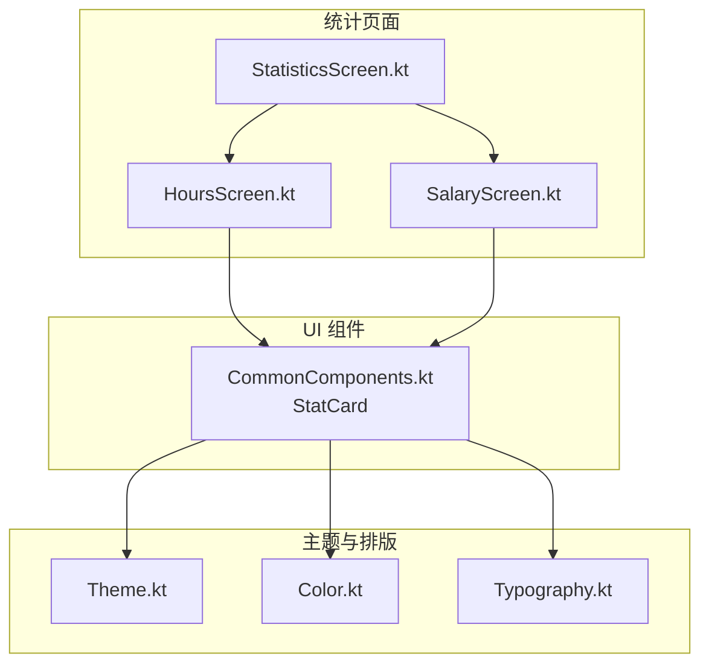
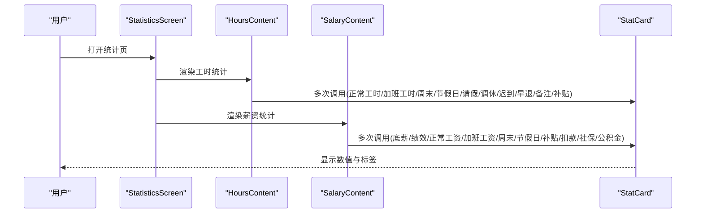
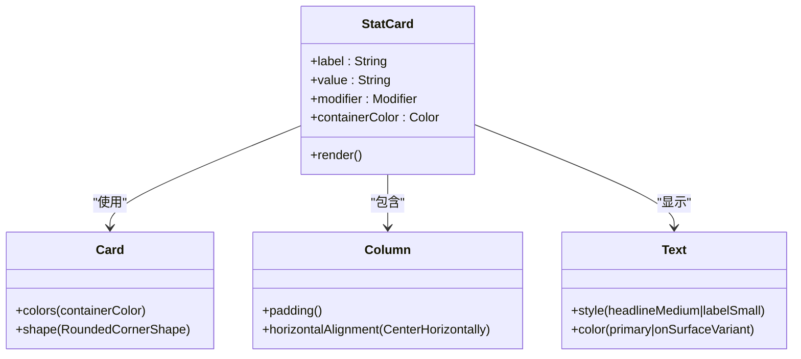
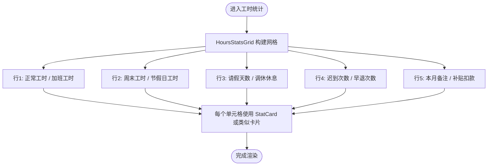
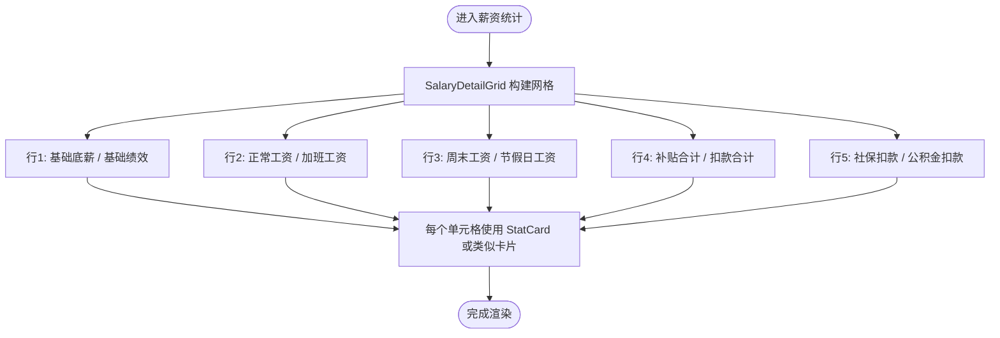
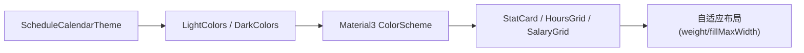
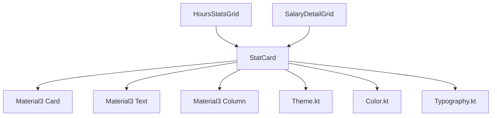

# 统计卡片组件

<cite>
**本文引用的文件**   
- [CommonComponents.kt](file://app/src/main/java/com/schedulecalendar/app/ui/component/CommonComponents.kt)
- [StatisticsScreen.kt](file://app/src/main/java/com/schedulecalendar/app/ui/statistics/StatisticsScreen.kt)
- [HoursScreen.kt](file://app/src/main/java/com/schedulecalendar/app/ui/hours/HoursScreen.kt)
- [SalaryScreen.kt](file://app/src/main/java/com/schedulecalendar/app/ui/salary/SalaryScreen.kt)
- [Color.kt](file://app/src/main/java/com/schedulecalendar/app/ui/theme/Color.kt)
- [Theme.kt](file://app/src/main/java/com/schedulecalendar/app/ui/theme/Theme.kt)
- [Typography.kt](file://app/src/main/java/com/schedulecalendar/app/ui/theme/Typography.kt)
</cite>

## 目录
1. [简介](#简介)
2. [项目结构](#项目结构)
3. [核心组件](#核心组件)
4. [架构总览](#架构总览)
5. [详细组件分析](#详细组件分析)
6. [依赖关系分析](#依赖关系分析)
7. [性能与可访问性](#性能与可访问性)
8. [故障排查指南](#故障排查指南)
9. [结论](#结论)
10. [附录：使用示例与最佳实践](#附录使用示例与最佳实践)

## 简介
本文件围绕“StatCard 统计卡片”组件进行系统化文档化，覆盖其数据展示能力（数值、标签）、容器颜色与圆角样式配置、属性参数说明、Material Design 规范遵循、主题适配与响应式考虑，以及与工时、薪资等场景的组合用法。StatCard 是一个轻量级、可复用的信息统计卡片，用于在统计页中集中呈现关键指标。

## 项目结构
StatCard 位于通用 UI 组件模块中，被统计页（工时/薪资）复用；主题与排版定义在 theme 包内，确保一致的色彩与字体风格。

图表来源
- [CommonComponents.kt:106-116](file://app/src/main/java/com/schedulecalendar/app/ui/component/CommonComponents.kt#L106-L116)
- [StatisticsScreen.kt:33-156](file://app/src/main/java/com/schedulecalendar/app/ui/statistics/StatisticsScreen.kt#L33-L156)
- [HoursScreen.kt:118-196](file://app/src/main/java/com/schedulecalendar/app/ui/hours/HoursScreen.kt#L118-L196)
- [SalaryScreen.kt:104-170](file://app/src/main/java/com/schedulecalendar/app/ui/salary/SalaryScreen.kt#L104-L170)
- [Theme.kt:54-79](file://app/src/main/java/com/schedulecalendar/app/ui/theme/Theme.kt#L54-L79)
- [Color.kt:12-31](file://app/src/main/java/com/schedulecalendar/app/ui/theme/Color.kt#L12-L31)
- [Typography.kt:9-22](file://app/src/main/java/com/schedulecalendar/app/ui/theme/Typography.kt#L9-L22)

章节来源
- [CommonComponents.kt:106-116](file://app/src/main/java/com/schedulecalendar/app/ui/component/CommonComponents.kt#L106-L116)
- [StatisticsScreen.kt:33-156](file://app/src/main/java/com/schedulecalendar/app/ui/statistics/StatisticsScreen.kt#L33-L156)
- [HoursScreen.kt:118-196](file://app/src/main/java/com/schedulecalendar/app/ui/hours/HoursScreen.kt#L118-L196)
- [SalaryScreen.kt:104-170](file://app/src/main/java/com/schedulecalendar/app/ui/salary/SalaryScreen.kt#L104-L170)
- [Theme.kt:54-79](file://app/src/main/java/com/schedulecalendar/app/ui/theme/Theme.kt#L54-L79)
- [Color.kt:12-31](file://app/src/main/java/com/schedulecalendar/app/ui/theme/Color.kt#L12-L31)
- [Typography.kt:9-22](file://app/src/main/java/com/schedulecalendar/app/ui/theme/Typography.kt#L9-L22)

## 核心组件
StatCard 是用于展示“数值 + 标签”的统计卡片，具备以下特性：
- 数值显示：采用 headlineMedium 字号，强调主色，便于快速识别关键指标。
- 标签文字：采用 labelSmall 字号，使用 onSurfaceVariant 语义色，保证可读性与层次区分。
- 容器颜色：默认使用 primaryContainer，支持通过 containerColor 自定义。
- 圆角样式：统一为 12dp 圆角，符合 Material 3 卡片规范。
- 布局结构：垂直居中排列，内部上下间距合理，内容居中对齐。

属性参数
- label: String，卡片下方标签文本。
- value: String，卡片主要数值文本。
- modifier: Modifier，外部修饰符，用于尺寸、对齐、交互等扩展。
- containerColor: Color，卡片背景色，默认 MaterialTheme.colorScheme.primaryContainer。

章节来源
- [CommonComponents.kt:106-116](file://app/src/main/java/com/schedulecalendar/app/ui/component/CommonComponents.kt#L106-L116)

## 架构总览
StatCard 作为基础 UI 组件，被统计页中的多个统计网格复用。统计页通过 HoursContent/SalaryContent 组织数据，并以网格形式组合多个 StatCard，形成统一的统计视图。

图表来源
- [StatisticsScreen.kt:33-156](file://app/src/main/java/com/schedulecalendar/app/ui/statistics/StatisticsScreen.kt#L33-L156)
- [HoursScreen.kt:217-312](file://app/src/main/java/com/schedulecalendar/app/ui/hours/HoursScreen.kt#L217-L312)
- [SalaryScreen.kt:190-238](file://app/src/main/java/com/schedulecalendar/app/ui/salary/SalaryScreen.kt#L190-L238)
- [CommonComponents.kt:106-116](file://app/src/main/java/com/schedulecalendar/app/ui/component/CommonComponents.kt#L106-L116)

## 详细组件分析

### StatCard 组件实现与样式
- 容器：使用 Material3 Card，设置容器颜色与圆角。
- 布局：Column 垂直布局，内容水平居中，内边距统一。
- 文本：数值使用 headlineMedium，标签使用 labelSmall，颜色分别为主色与 onSurfaceVariant。
- 可定制性：通过 modifier 和 containerColor 灵活调整外观与行为。

图表来源
- [CommonComponents.kt:106-116](file://app/src/main/java/com/schedulecalendar/app/ui/component/CommonComponents.kt#L106-L116)
- [Typography.kt:9-22](file://app/src/main/java/com/schedulecalendar/app/ui/theme/Typography.kt#L9-L22)
- [Color.kt:12-31](file://app/src/main/java/com/schedulecalendar/app/ui/theme/Color.kt#L12-L31)

章节来源
- [CommonComponents.kt:106-116](file://app/src/main/java/com/schedulecalendar/app/ui/component/CommonComponents.kt#L106-L116)
- [Typography.kt:9-22](file://app/src/main/java/com/schedulecalendar/app/ui/theme/Typography.kt#L9-L22)
- [Color.kt:12-31](file://app/src/main/java/com/schedulecalendar/app/ui/theme/Color.kt#L12-L31)

### 工时统计中的 StatCard 使用
- 网格布局：HoursStatsGrid 将多个 StatCard 按行排列，展示正常工时、加班工时、周末工时、节假日工时、请假天数、调休/休息、迟到次数、早退次数、本月备注、补贴/扣款等。
- 交互增强：部分单元格支持点击跳转详情，并带有超限提示徽章。
- 预计值展示：对未来的工时数据进行“预计+Xh”标注，提升预测可读性。

图表来源
- [HoursScreen.kt:217-312](file://app/src/main/java/com/schedulecalendar/app/ui/hours/HoursScreen.kt#L217-L312)
- [CommonComponents.kt:106-116](file://app/src/main/java/com/schedulecalendar/app/ui/component/CommonComponents.kt#L106-L116)

章节来源
- [HoursScreen.kt:217-312](file://app/src/main/java/com/schedulecalendar/app/ui/hours/HoursScreen.kt#L217-L312)

### 薪资统计中的 StatCard 使用
- 网格布局：SalaryDetailGrid 将多个 StatCard 按行排列，展示基础底薪、基础绩效、正常工资、加班工资、周末工资、节假日工资、补贴合计、扣款合计、社保扣款、公积金扣款等。
- 数值格式化：金额以两位小数显示，扣款项带负号标识。
- 预计值展示：对未来薪资数据进行“+¥X”标注，辅助预算规划。

图表来源
- [SalaryScreen.kt:190-238](file://app/src/main/java/com/schedulecalendar/app/ui/salary/SalaryScreen.kt#L190-L238)
- [CommonComponents.kt:106-116](file://app/src/main/java/com/schedulecalendar/app/ui/component/CommonComponents.kt#L106-L116)

章节来源
- [SalaryScreen.kt:190-238](file://app/src/main/java/com/schedulecalendar/app/ui/salary/SalaryScreen.kt#L190-L238)

### 主题适配与响应式设计
- 主题系统：通过 ScheduleCalendarTheme 提供 Light/Dark 两套色板，并支持 Android 12+ 动态取色（Material You）。
- 色彩语义：primary、onPrimary、primaryContainer、onSurfaceVariant 等语义色确保在不同主题下保持一致的可读性与对比度。
- 响应式布局：StatCard 基于 Compose 的弹性布局，自动适应不同屏幕尺寸；网格布局通过 weight 分配空间，保证多列等宽。

图表来源
- [Theme.kt:54-79](file://app/src/main/java/com/schedulecalendar/app/ui/theme/Theme.kt#L54-L79)
- [Color.kt:12-31](file://app/src/main/java/com/schedulecalendar/app/ui/theme/Color.kt#L12-L31)
- [HoursScreen.kt:217-312](file://app/src/main/java/com/schedulecalendar/app/ui/hours/HoursScreen.kt#L217-L312)
- [SalaryScreen.kt:190-238](file://app/src/main/java/com/schedulecalendar/app/ui/salary/SalaryScreen.kt#L190-L238)

章节来源
- [Theme.kt:54-79](file://app/src/main/java/com/schedulecalendar/app/ui/theme/Theme.kt#L54-L79)
- [Color.kt:12-31](file://app/src/main/java/com/schedulecalendar/app/ui/theme/Color.kt#L12-L31)

## 依赖关系分析
- StatCard 依赖 Material3 的 Card、Text、Column 等基础组件。
- 主题依赖 ColorScheme 与 Typography，确保视觉一致性。
- 统计页依赖 StatCard 进行数据可视化，并通过网格布局组合多个卡片。

图表来源
- [CommonComponents.kt:106-116](file://app/src/main/java/com/schedulecalendar/app/ui/component/CommonComponents.kt#L106-L116)
- [HoursScreen.kt:217-312](file://app/src/main/java/com/schedulecalendar/app/ui/hours/HoursScreen.kt#L217-L312)
- [SalaryScreen.kt:190-238](file://app/src/main/java/com/schedulecalendar/app/ui/salary/SalaryScreen.kt#L190-L238)
- [Theme.kt:54-79](file://app/src/main/java/com/schedulecalendar/app/ui/theme/Theme.kt#L54-L79)
- [Color.kt:12-31](file://app/src/main/java/com/schedulecalendar/app/ui/theme/Color.kt#L12-L31)
- [Typography.kt:9-22](file://app/src/main/java/com/schedulecalendar/app/ui/theme/Typography.kt#L9-L22)

章节来源
- [CommonComponents.kt:106-116](file://app/src/main/java/com/schedulecalendar/app/ui/component/CommonComponents.kt#L106-L116)
- [HoursScreen.kt:217-312](file://app/src/main/java/com/schedulecalendar/app/ui/hours/HoursScreen.kt#L217-L312)
- [SalaryScreen.kt:190-238](file://app/src/main/java/com/schedulecalendar/app/ui/salary/SalaryScreen.kt#L190-L238)
- [Theme.kt:54-79](file://app/src/main/java/com/schedulecalendar/app/ui/theme/Theme.kt#L54-L79)
- [Color.kt:12-31](file://app/src/main/java/com/schedulecalendar/app/ui/theme/Color.kt#L12-L31)
- [Typography.kt:9-22](file://app/src/main/java/com/schedulecalendar/app/ui/theme/Typography.kt#L9-L22)

## 性能与可访问性
- 性能：StatCard 结构简单，无复杂计算，适合频繁复用；网格布局使用 LazyColumn 避免不必要的重绘。
- 可访问性：语义色与字号层级清晰，确保高对比度与可读性；未来可扩展 contentDescription 以提升无障碍体验。
- 主题切换：基于 Material3 的动态主题，无需额外逻辑即可适配深色模式与动态取色。

[本节为通用指导，不直接分析具体文件]

## 故障排查指南
- 数值显示异常：检查传入 value 是否为空或格式错误，确认 headlineMedium 样式未被覆盖。
- 标签不可见：确认 containerColor 与 onSurfaceVariant 的对比度是否足够，必要时调整背景色。
- 圆角不生效：确保 shape 设置为 RoundedCornerShape(12.dp)，且未被子组件覆盖。
- 主题不一致：检查是否在正确的 Theme 包裹下渲染，确保 ColorScheme 已正确注入。

章节来源
- [CommonComponents.kt:106-116](file://app/src/main/java/com/schedulecalendar/app/ui/component/CommonComponents.kt#L106-L116)
- [Theme.kt:54-79](file://app/src/main/java/com/schedulecalendar/app/ui/theme/Theme.kt#L54-L79)

## 结论
StatCard 是一个简洁、可定制的统计卡片组件，遵循 Material Design 3 规范，具备良好的主题适配与响应式能力。它在工时与薪资统计中被广泛复用，通过网格布局组合多个卡片，形成直观的数据展示界面。建议在实际使用中保持语义色与字号层级的一致性，并根据业务需求灵活定制容器颜色与交互行为。

[本节为总结，不直接分析具体文件]

## 附录：使用示例与最佳实践

### 基本用法
- 在统计网格中插入 StatCard，传入 label 与 value，必要时通过 modifier 控制尺寸与对齐。
- 使用 containerColor 自定义背景色，确保与主题色板协调。

章节来源
- [CommonComponents.kt:106-116](file://app/src/main/java/com/schedulecalendar/app/ui/component/CommonComponents.kt#L106-L116)

### 工时统计场景
- 正常工时、加班工时、周末工时、节假日工时、请假天数、调休/休息、迟到次数、早退次数、本月备注、补贴/扣款等均可使用 StatCard 展示。
- 对超限项添加预警徽章，提升警示效果。

章节来源
- [HoursScreen.kt:217-312](file://app/src/main/java/com/schedulecalendar/app/ui/hours/HoursScreen.kt#L217-L312)

### 薪资统计场景
- 基础底薪、基础绩效、正常工资、加班工资、周末工资、节假日工资、补贴合计、扣款合计、社保扣款、公积金扣款等均可使用 StatCard 展示。
- 金额格式化与负号标识需统一处理，确保可读性。

章节来源
- [SalaryScreen.kt:190-238](file://app/src/main/java/com/schedulecalendar/app/ui/salary/SalaryScreen.kt#L190-L238)

### 主题与响应式
- 使用 Material3 主题系统，确保浅色/深色模式下的视觉一致性。
- 通过 weight 与 fillMaxWidth 实现弹性布局，适配不同屏幕尺寸。

章节来源
- [Theme.kt:54-79](file://app/src/main/java/com/schedulecalendar/app/ui/theme/Theme.kt#L54-L79)
- [Color.kt:12-31](file://app/src/main/java/com/schedulecalendar/app/ui/theme/Color.kt#L12-L31)