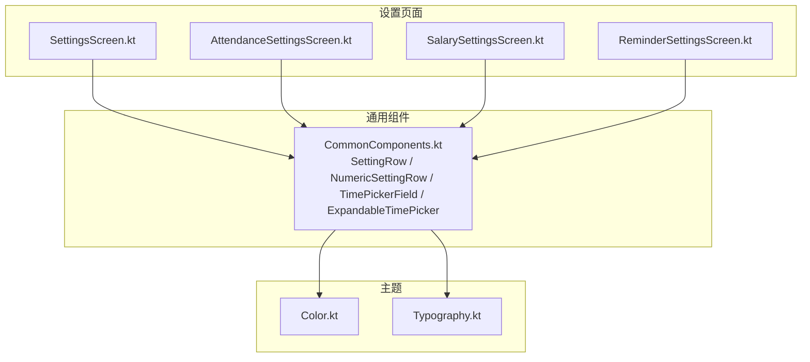
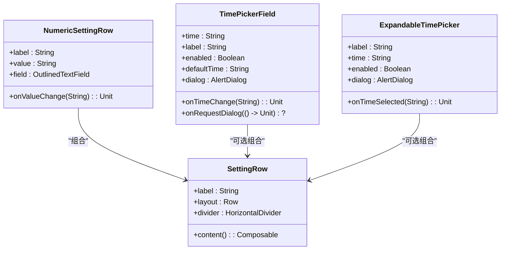
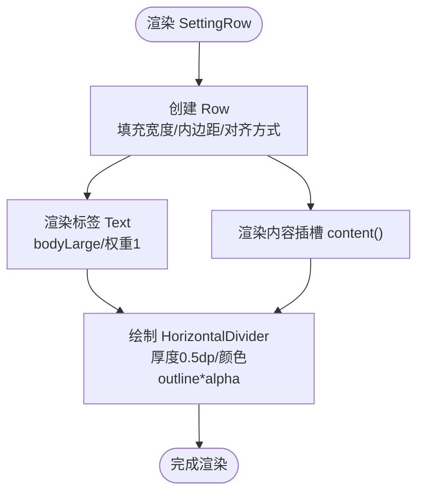
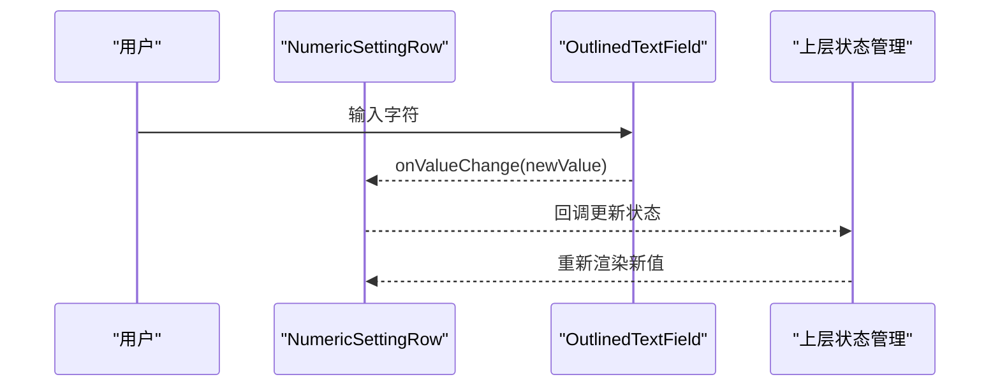
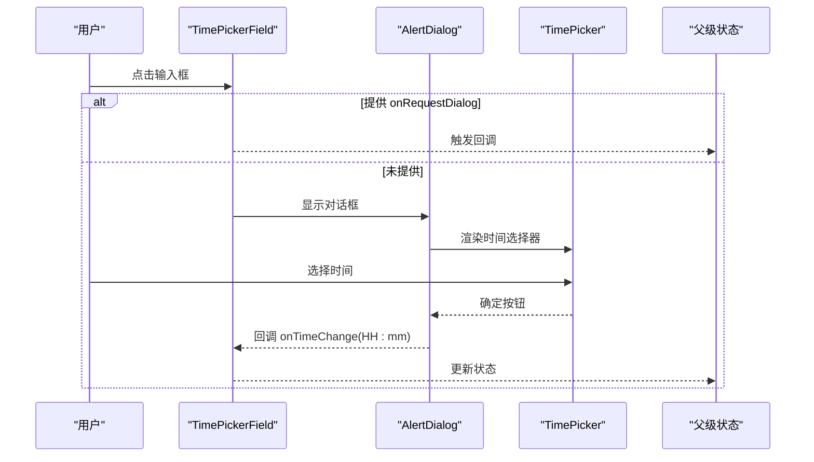
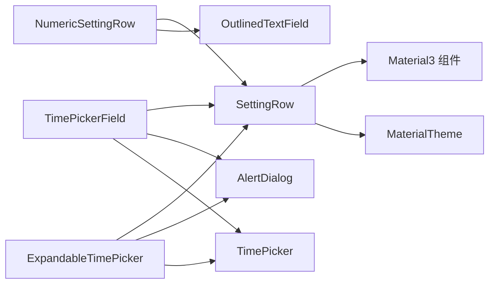

# 设置行组件

<cite>
**本文引用的文件**
- [CommonComponents.kt](file://app/src/main/java/com/schedulecalendar/app/ui/component/CommonComponents.kt)
- [SettingsScreen.kt](file://app/src/main/java/com/schedulecalendar/app/ui/settings/SettingsScreen.kt)
- [AttendanceSettingsScreen.kt](file://app/src/main/java/com/schedulecalendar/app/ui/settings/AttendanceSettingsScreen.kt)
- [SalarySettingsScreen.kt](file://app/src/main/java/com/schedulecalendar/app/ui/settings/SalarySettingsScreen.kt)
- [ReminderSettingsScreen.kt](file://app/src/main/java/com/schedulecalendar/app/ui/settings/ReminderSettingsScreen.kt)
- [Color.kt](file://app/src/main/java/com/schedulecalendar/app/ui/theme/Color.kt)
- [Typography.kt](file://app/src/main/java/com/schedulecalendar/app/ui/theme/Typography.kt)
</cite>

## 目录
1. [简介](#简介)
2. [项目结构](#项目结构)
3. [核心组件](#核心组件)
4. [架构总览](#架构总览)
5. [详细组件分析](#详细组件分析)
6. [依赖关系分析](#依赖关系分析)
7. [性能考虑](#性能考虑)
8. [故障排查指南](#故障排查指南)
9. [结论](#结论)
10. [附录](#附录)

## 简介
本文件围绕 SettingRow 设置行组件进行系统化文档说明，涵盖布局实现、属性与插槽机制、间距配置、Material Design 规范遵循、常见设置项使用示例（开关、输入框、选择器）、样式定制与主题适配，以及在设置页面中的批量使用与性能优化技巧。SettingRow 是应用内统一的“标签 + 内容”设置行基础单元，配合 HorizontalDivider 形成清晰的视觉分隔，便于在设置页中构建一致的交互体验。

## 项目结构
- SettingRow 及其衍生组件位于通用 UI 组件模块：ui/component
- 设置页面分布在 ui/settings 下，通过卡片容器与列表组织多个设置项
- 主题与颜色定义位于 ui/theme，提供 Material3 色彩与排版

图表来源
- [CommonComponents.kt:128-142](file://app/src/main/java/com/schedulecalendar/app/ui/component/CommonComponents.kt#L128-L142)
- [SettingsScreen.kt:40-144](file://app/src/main/java/com/schedulecalendar/app/ui/settings/SettingsScreen.kt#L40-L144)
- [AttendanceSettingsScreen.kt:1-90](file://app/src/main/java/com/schedulecalendar/app/ui/settings/AttendanceSettingsScreen.kt#L1-L90)
- [SalarySettingsScreen.kt:1-90](file://app/src/main/java/com/schedulecalendar/app/ui/settings/SalarySettingsScreen.kt#L1-L90)
- [ReminderSettingsScreen.kt:1-200](file://app/src/main/java/com/schedulecalendar/app/ui/settings/ReminderSettingsScreen.kt#L1-L200)
- [Color.kt:1-54](file://app/src/main/java/com/schedulecalendar/app/ui/theme/Color.kt#L1-L54)
- [Typography.kt:1-22](file://app/src/main/java/com/schedulecalendar/app/ui/theme/Typography.kt#L1-L22)

章节来源
- [CommonComponents.kt:128-142](file://app/src/main/java/com/schedulecalendar/app/ui/component/CommonComponents.kt#L128-L142)
- [SettingsScreen.kt:40-144](file://app/src/main/java/com/schedulecalendar/app/ui/settings/SettingsScreen.kt#L40-L144)

## 核心组件
- SettingRow(label, content)
  - 作用：渲染一行设置项，左侧为标签文本，右侧为内容区域（由调用方通过插槽传入），并在底部绘制分隔线
  - 布局：水平 Row，垂直居中对齐，左右两端对齐；标签占满剩余空间，内容区域自适应宽度
  - 间距：水平 16dp，垂直 12dp；分隔线厚度 0.5dp，颜色基于 outline 并带透明度
  - 主题：文本样式采用 bodyLarge，颜色来自 MaterialTheme.colorScheme.onSurface；分隔线颜色使用 outline 的变体

- NumericSettingRow(label, value, onValueChange)
  - 作用：封装数字输入的设置行，内部使用 OutlinedTextField，固定宽度 120dp，单行显示
  - 行为：将输入值通过回调返回给上层状态管理

- 时间选择相关
  - TimePickerField(time, onTimeChange, label, enabled, defaultTime, onRequestDialog)
    - 点击弹出时间选择对话框；支持外部控制对话框展示（onRequestDialog）
  - ExpandableTimePicker(label, time, onTimeSelected, enabled)
    - 收起态为带图标按钮，点击展开时间选择对话框

章节来源
- [CommonComponents.kt:128-142](file://app/src/main/java/com/schedulecalendar/app/ui/component/CommonComponents.kt#L128-L142)
- [CommonComponents.kt:155-167](file://app/src/main/java/com/schedulecalendar/app/ui/component/CommonComponents.kt#L155-L167)
- [CommonComponents.kt:182-259](file://app/src/main/java/com/schedulecalendar/app/ui/component/CommonComponents.kt#L182-L259)
- [CommonComponents.kt:271-342](file://app/src/main/java/com/schedulecalendar/app/ui/component/CommonComponents.kt#L271-L342)

## 架构总览
SettingRow 作为基础行单元，被各设置页面以列表形式批量使用。每个设置项通过插槽注入不同的控件（如 Switch、OutlinedTextField、FilterChip、自定义选择器等），从而复用同一布局与样式。

图表来源
- [CommonComponents.kt:128-142](file://app/src/main/java/com/schedulecalendar/app/ui/component/CommonComponents.kt#L128-L142)
- [CommonComponents.kt:155-167](file://app/src/main/java/com/schedulecalendar/app/ui/component/CommonComponents.kt#L155-L167)
- [CommonComponents.kt:182-259](file://app/src/main/java/com/schedulecalendar/app/ui/component/CommonComponents.kt#L182-L259)
- [CommonComponents.kt:271-342](file://app/src/main/java/com/schedulecalendar/app/ui/component/CommonComponents.kt#L271-L342)

## 详细组件分析

### SettingRow 布局与样式
- 布局结构
  - 外层 Row：fillMaxWidth，垂直居中，水平 SpaceBetween
  - 标签 Text：weight(1f)，bodyLarge 样式
  - 内容区域：由插槽 content() 决定
  - 分隔线：HorizontalDivider，thickness=0.5dp，color=outline.copy(alpha=0.4f)
- 间距与对齐
  - 水平 padding=16dp，垂直 padding=12dp
  - 标签与内容左右分布，确保长标签与短控件均能良好对齐
- 主题与 Material Design
  - 文本颜色与背景色遵循 MaterialTheme.colorScheme
  - 分隔线使用 outline 语义色，保持层级清晰
  - 字体大小与行高遵循 Typography.bodyLarge

图表来源
- [CommonComponents.kt:128-142](file://app/src/main/java/com/schedulecalendar/app/ui/component/CommonComponents.kt#L128-L142)

章节来源
- [CommonComponents.kt:128-142](file://app/src/main/java/com/schedulecalendar/app/ui/component/CommonComponents.kt#L128-L142)

### NumericSettingRow 数字输入设置行
- 参数
  - label：设置项标签
  - value：当前数值字符串
  - onValueChange：输入变化回调
- 行为
  - 使用 OutlinedTextField，固定宽度 120dp，单行显示
  - 文本样式使用 bodyMedium
- 使用场景
  - 薪资、考勤等需要输入数值的设置项

图表来源
- [CommonComponents.kt:155-167](file://app/src/main/java/com/schedulecalendar/app/ui/component/CommonComponents.kt#L155-L167)

章节来源
- [CommonComponents.kt:155-167](file://app/src/main/java/com/schedulecalendar/app/ui/component/CommonComponents.kt#L155-L167)

### TimePickerField 与 ExpandableTimePicker 时间选择
- TimePickerField
  - 参数：time、onTimeChange、label、enabled、defaultTime、onRequestDialog、modifier
  - 行为：点击触发对话框或回调；内部维护 showDialog 状态；确认后将 HH:mm 格式字符串回传
- ExpandableTimePicker
  - 参数：label、time、onTimeSelected、modifier、enabled
  - 行为：收起态为带图标按钮；点击弹出对话框；确认后回调 onTimeSelected

图表来源
- [CommonComponents.kt:182-259](file://app/src/main/java/com/schedulecalendar/app/ui/component/CommonComponents.kt#L182-L259)
- [CommonComponents.kt:271-342](file://app/src/main/java/com/schedulecalendar/app/ui/component/CommonComponents.kt#L271-L342)

章节来源
- [CommonComponents.kt:182-259](file://app/src/main/java/com/schedulecalendar/app/ui/component/CommonComponents.kt#L182-L259)
- [CommonComponents.kt:271-342](file://app/src/main/java/com/schedulecalendar/app/ui/component/CommonComponents.kt#L271-L342)

### 设置项在不同页面的使用示例
- 考勤设置（AttendanceSettingsScreen）
  - 使用 FilterChip 进行单选（加班粒度）
  - 使用 ProtectedNumField（数字输入）进行数值设置
- 薪资设置（SalarySettingsScreen）
  - 使用 ProtectedNumField 进行金额与时薪输入
- 提醒设置（ReminderSettingsScreen）
  - 使用 Switch 控制总开关
  - 使用 Checkbox 控制单项提醒启用
  - 使用 WheelTextPicker 进行小时/分钟选择

章节来源
- [AttendanceSettingsScreen.kt:34-90](file://app/src/main/java/com/schedulecalendar/app/ui/settings/AttendanceSettingsScreen.kt#L34-L90)
- [SalarySettingsScreen.kt:37-90](file://app/src/main/java/com/schedulecalendar/app/ui/settings/SalarySettingsScreen.kt#L37-L90)
- [ReminderSettingsScreen.kt:97-200](file://app/src/main/java/com/schedulecalendar/app/ui/settings/ReminderSettingsScreen.kt#L97-L200)

### 样式定制与主题适配
- 颜色与主题
  - 所有文本与分隔线颜色均来自 MaterialTheme.colorScheme，确保暗色/亮色模式一致
  - 分隔线颜色使用 outline 并降低透明度，避免视觉过重
- 字体与排版
  - 使用 Typography.bodyLarge/bodyMedium，保证可读性与一致性
- 自定义建议
  - 若需调整 SettingRow 的间距，可在外层包裹 Modifier.padding 或使用自定义容器
  - 若需替换分隔线样式，可覆盖 HorizontalDivider 的 thickness 与 color

章节来源
- [Color.kt:1-54](file://app/src/main/java/com/schedulecalendar/app/ui/theme/Color.kt#L1-L54)
- [Typography.kt:1-22](file://app/src/main/java/com/schedulecalendar/app/ui/theme/Typography.kt#L1-L22)
- [CommonComponents.kt:128-142](file://app/src/main/java/com/schedulecalendar/app/ui/component/CommonComponents.kt#L128-L142)

## 依赖关系分析
- SettingRow 依赖 Material3 组件（Row、Text、HorizontalDivider）与主题系统
- NumericSettingRow 依赖 OutlinedTextField 与主题颜色
- TimePickerField/ExpandableTimePicker 依赖 AlertDialog、TimePicker 与主题颜色
- 设置页面依赖这些组件进行组合与状态管理

图表来源
- [CommonComponents.kt:128-142](file://app/src/main/java/com/schedulecalendar/app/ui/component/CommonComponents.kt#L128-L142)
- [CommonComponents.kt:155-167](file://app/src/main/java/com/schedulecalendar/app/ui/component/CommonComponents.kt#L155-L167)
- [CommonComponents.kt:182-259](file://app/src/main/java/com/schedulecalendar/app/ui/component/CommonComponents.kt#L182-L259)
- [CommonComponents.kt:271-342](file://app/src/main/java/com/schedulecalendar/app/ui/component/CommonComponents.kt#L271-L342)

章节来源
- [CommonComponents.kt:128-142](file://app/src/main/java/com/schedulecalendar/app/ui/component/CommonComponents.kt#L128-L142)

## 性能考虑
- 列表渲染
  - 在 LazyColumn 中使用 SettingRow 时，尽量将复杂内容（如时间选择器）延迟渲染，避免首屏卡顿
- 状态提升
  - 将频繁变化的状态提升到父级，减少不必要的重组
- 对话框控制
  - 对于 TimePickerField，优先使用 onRequestDialog 由父级控制对话框，避免在滚动列表中重复创建对话框实例
- 输入处理
  - 对数字输入进行过滤与防抖，减少无效重组

[本节为通用指导，不直接分析具体文件]

## 故障排查指南
- 分隔线不显示或过淡
  - 检查 theme 的 outline 颜色是否被覆盖；确认 alpha 透明度设置合理
- 输入框焦点异常
  - 对于数字输入，注意 IME 自动填充行为；可使用 ProtectedNumField 的聚焦保护逻辑
- 时间选择器无法关闭
  - 检查 showDialog 状态是否正确重置；确认确认/取消按钮回调已执行
- 长标签换行问题
  - 确保标签 Text 未限制最大行数；必要时在外层添加 maxLines 或换行策略

章节来源
- [CommonComponents.kt:128-142](file://app/src/main/java/com/schedulecalendar/app/ui/component/CommonComponents.kt#L128-L142)
- [CommonComponents.kt:182-259](file://app/src/main/java/com/schedulecalendar/app/ui/component/CommonComponents.kt#L182-L259)

## 结论
SettingRow 提供了统一、可扩展的设置行基础能力，结合 NumericSettingRow、TimePickerField、ExpandableTimePicker 等衍生组件，能够覆盖常见的设置项类型。通过 Material3 主题系统与合理的布局策略，能够在不同设备与主题下保持一致的视觉与交互体验。在批量使用时，注意状态管理与渲染优化，以获得流畅的用户体验。

[本节为总结性内容，不直接分析具体文件]

## 附录
- 常用设置项示例路径
  - 开关：ReminderSettingsScreen.kt 中的 Switch 使用
  - 输入框：SalarySettingsScreen.kt 中的 ProtectedNumField 使用
  - 选择器：AttendanceSettingsScreen.kt 中的 FilterChip 使用
- 主题与颜色参考
  - Color.kt：主色、辅色、中性色、语义色、班次预设颜色
  - Typography.kt：标题、正文、标签字号与字重

章节来源
- [ReminderSettingsScreen.kt:97-200](file://app/src/main/java/com/schedulecalendar/app/ui/settings/ReminderSettingsScreen.kt#L97-L200)
- [SalarySettingsScreen.kt:37-90](file://app/src/main/java/com/schedulecalendar/app/ui/settings/SalarySettingsScreen.kt#L37-L90)
- [AttendanceSettingsScreen.kt:34-90](file://app/src/main/java/com/schedulecalendar/app/ui/settings/AttendanceSettingsScreen.kt#L34-L90)
- [Color.kt:1-54](file://app/src/main/java/com/schedulecalendar/app/ui/theme/Color.kt#L1-L54)
- [Typography.kt:1-22](file://app/src/main/java/com/schedulecalendar/app/ui/theme/Typography.kt#L1-L22)