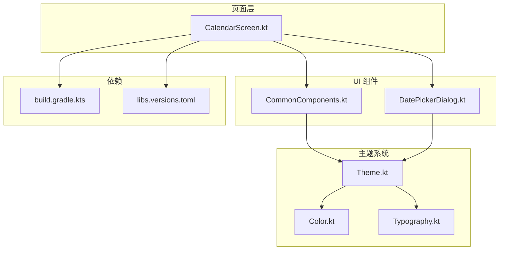
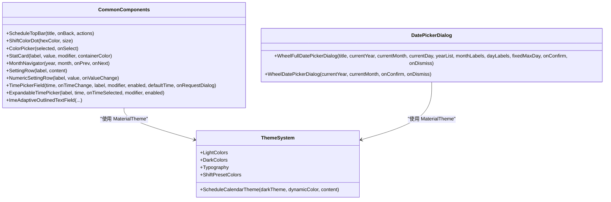
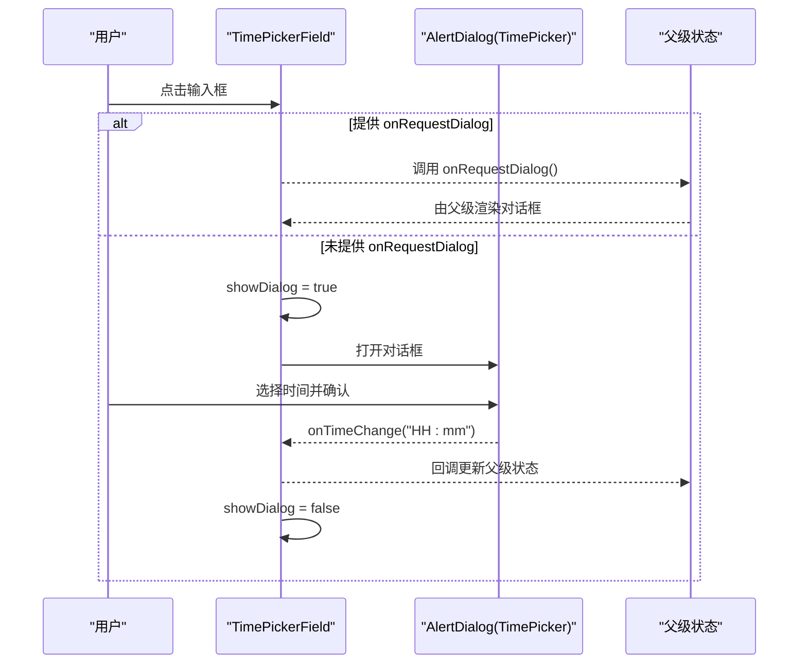
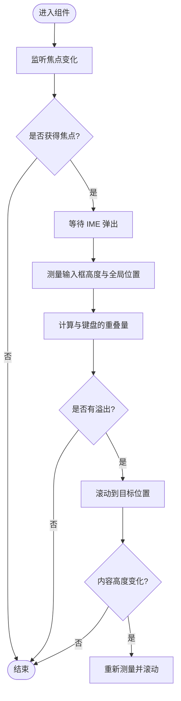
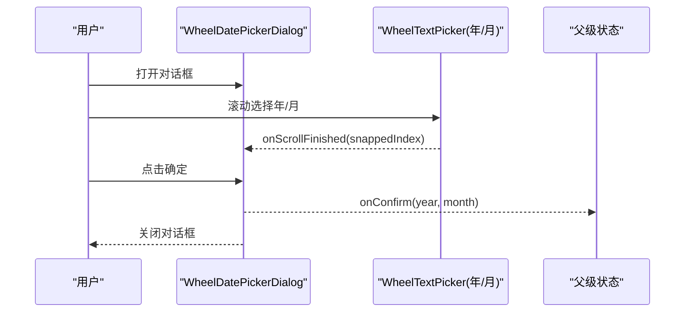
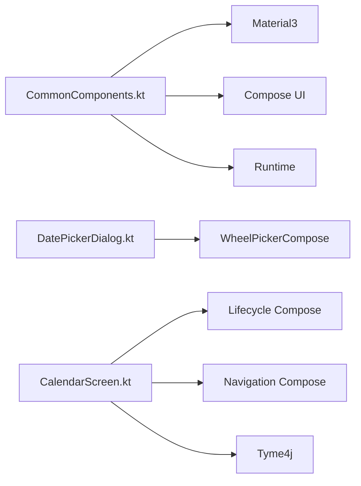

# 通用组件

<cite>
**本文引用的文件**   
- [CommonComponents.kt](file://app/src/main/java/com/schedulecalendar/app/ui/component/CommonComponents.kt)
- [DatePickerDialog.kt](file://app/src/main/java/com/schedulecalendar/app/ui/component/DatePickerDialog.kt)
- [CalendarScreen.kt](file://app/src/main/java/com/schedulecalendar/app/ui/calendar/CalendarScreen.kt)
- [Theme.kt](file://app/src/main/java/com/schedulecalendar/app/ui/theme/Theme.kt)
- [Color.kt](file://app/src/main/java/com/schedulecalendar/app/ui/theme/Color.kt)
- [Typography.kt](file://app/src/main/java/com/schedulecalendar/app/ui/theme/Typography.kt)
- [build.gradle.kts](file://app/build.gradle.kts)
- [libs.versions.toml](file://gradle/libs.versions.toml)
</cite>

## 目录
1. [简介](#简介)
2. [项目结构](#项目结构)
3. [核心组件](#核心组件)
4. [架构总览](#架构总览)
5. [详细组件分析](#详细组件分析)
6. [依赖分析](#依赖分析)
7. [性能考虑](#性能考虑)
8. [故障排查指南](#故障排查指南)
9. [结论](#结论)
10. [附录：使用示例与最佳实践](#附录使用示例与最佳实践)

## 简介
本文件面向 Android 排班日历应用中的通用 UI 组件，聚焦于可复用的 Compose 实现，包括：
- 自定义对话框（滚轮日期选择器）
- 时间选择输入框（含 IME 自适应）
- 按钮与设置行、统计卡片等数据展示组件
- 主题与样式集成（Material3 + 动态色板）

文档将详细说明各组件的属性配置、事件处理、状态管理、样式定制与主题集成，并提供测试策略、性能优化技巧以及使用示例和最佳实践。

## 项目结构
通用组件集中在 ui/component 包中，主题定义在 ui/theme 包中，UI 页面在 ui/calendar 等页面中使用这些组件。关键文件如下：
- 通用组件：CommonComponents.kt、DatePickerDialog.kt
- 主题：Theme.kt、Color.kt、Typography.kt
- 使用方：CalendarScreen.kt（日历主界面，广泛使用通用组件）
- 依赖：build.gradle.kts、libs.versions.toml（WheelPickerCompose、Material3、Lifecycle 等）

**图表来源** 
- [CommonComponents.kt](file://app/src/main/java/com/schedulecalendar/app/ui/component/CommonComponents.kt)
- [DatePickerDialog.kt](file://app/src/main/java/com/schedulecalendar/app/ui/component/DatePickerDialog.kt)
- [CalendarScreen.kt](file://app/src/main/java/com/schedulecalendar/app/ui/calendar/CalendarScreen.kt)
- [Theme.kt](file://app/src/main/java/com/schedulecalendar/app/ui/theme/Theme.kt)
- [Color.kt](file://app/src/main/java/com/schedulecalendar/app/ui/theme/Color.kt)
- [Typography.kt](file://app/src/main/java/com/schedulecalendar/app/ui/theme/Typography.kt)
- [build.gradle.kts](file://app/build.gradle.kts)
- [libs.versions.toml](file://gradle/libs.versions.toml)

**章节来源**
- [CommonComponents.kt](file://app/src/main/java/com/schedulecalendar/app/ui/component/CommonComponents.kt)
- [DatePickerDialog.kt](file://app/src/main/java/com/schedulecalendar/app/ui/component/DatePickerDialog.kt)
- [CalendarScreen.kt](file://app/src/main/java/com/schedulecalendar/app/ui/calendar/CalendarScreen.kt)
- [Theme.kt](file://app/src/main/java/com/schedulecalendar/app/ui/theme/Theme.kt)
- [Color.kt](file://app/src/main/java/com/schedulecalendar/app/ui/theme/Color.kt)
- [Typography.kt](file://app/src/main/java/com/schedulecalendar/app/ui/theme/Typography.kt)
- [build.gradle.kts](file://app/build.gradle.kts)
- [libs.versions.toml](file://gradle/libs.versions.toml)

## 核心组件
本节对通用组件进行概览性说明，涵盖功能职责、属性与事件、状态管理与主题集成要点。

- 顶部栏与导航
  - ScheduleTopBar：提供标题、返回按钮与右侧操作区；颜色与字体遵循 MaterialTheme。
  - MonthNavigator：月份切换导航，左右箭头 + 年月文本。

- 数据展示与设置行
  - StatCard：统计卡片，支持容器颜色与标签/数值排版。
  - SettingRow / NumericSettingRow：设置项行与数字输入行，统一间距与分割线。
  - ShiftColorDot / ColorPicker：班次颜色圆点与两行18色选择器，基于预设色板。

- 时间选择器
  - TimePickerField：点击弹出 Material3 TimePicker 对话框；支持默认时间与“仅触发回调”模式（适用于 LazyColumn）。
  - ExpandableTimePicker：收起为带图标按钮的输入框，点击展开对话框。

- IME 自适应输入框
  - ImeAdaptiveOutlinedTextField：自动处理软键盘遮挡，支持 Column+ScrollState 或 LazyColumn 场景。

- 日期选择器对话框
  - WheelFullDatePickerDialog：年/月/日三列滚轮，支持固定最大天数（农历等场景）。
  - WheelDatePickerDialog：年/月双列滚轮，范围默认当前年±30年。

- 主题与样式
  - ScheduleCalendarTheme：支持动态色板（Android 12+），预览模式回退静态色板。
  - Color.kt：主色、辅色、中性色、语义色与班次预设色（18色）。
  - Typography.kt：统一的字号、字重与行高。

**章节来源**
- [CommonComponents.kt](file://app/src/main/java/com/schedulecalendar/app/ui/component/CommonComponents.kt)
- [DatePickerDialog.kt](file://app/src/main/java/com/schedulecalendar/app/ui/component/DatePickerDialog.kt)
- [Theme.kt](file://app/src/main/java/com/schedulecalendar/app/ui/theme/Theme.kt)
- [Color.kt](file://app/src/main/java/com/schedulecalendar/app/ui/theme/Color.kt)
- [Typography.kt](file://app/src/main/java/com/schedulecalendar/app/ui/theme/Typography.kt)

## 架构总览
通用组件通过 Material3 主题与自定义色板统一外观，页面层以状态驱动 UI，组件内部使用 remember/mutableStateOf 管理本地交互状态，必要时通过回调向父级传递事件。

**图表来源** 
- [CommonComponents.kt](file://app/src/main/java/com/schedulecalendar/app/ui/component/CommonComponents.kt)
- [DatePickerDialog.kt](file://app/src/main/java/com/schedulecalendar/app/ui/component/DatePickerDialog.kt)
- [Theme.kt](file://app/src/main/java/com/schedulecalendar/app/ui/theme/Theme.kt)
- [Color.kt](file://app/src/main/java/com/schedulecalendar/app/ui/theme/Color.kt)
- [Typography.kt](file://app/src/main/java/com/schedulecalendar/app/ui/theme/Typography.kt)

## 详细组件分析

### 时间选择器组件（TimePickerField / ExpandableTimePicker）
- 属性与行为
  - TimePickerField：支持只读显示、默认时间、可选“仅触发回调”模式（onRequestDialog），用于避免在滚动容器中重复渲染对话框。
  - ExpandableTimePicker：收起态为带图标的输入框，点击弹出对话框。
- 状态管理
  - 内部 showDialog 控制对话框显隐；解析初始时间并校验范围。
- 事件处理
  - 确认时格式化 HH:mm 并通过回调返回；取消则关闭对话框。
- 主题集成
  - OutlinedTextField 禁用态颜色与标签颜色统一，遵循 MaterialTheme。

**图表来源** 
- [CommonComponents.kt](file://app/src/main/java/com/schedulecalendar/app/ui/component/CommonComponents.kt)

**章节来源**
- [CommonComponents.kt](file://app/src/main/java/com/schedulecalendar/app/ui/component/CommonComponents.kt)

### IME 自适应输入框（ImeAdaptiveOutlinedTextField）
- 核心机制
  - 获得焦点后等待 IME 弹出，计算输入框底部与键盘顶部的重叠，精确滚动父容器使输入框下边缘位于键盘上方。
  - 内容增长导致高度变化时再次滚动保持可见。
- 适配场景
  - Column+verticalScroll：传入 scrollState 自动滚动。
  - LazyColumn：通过 onFocused 回调由调用方处理滚动。
- 复杂度与性能
  - 使用 LaunchedEffect 监听焦点与尺寸变化，延迟等待 IME 完全弹出，避免抖动。

**图表来源** 
- [CommonComponents.kt](file://app/src/main/java/com/schedulecalendar/app/ui/component/CommonComponents.kt)

**章节来源**
- [CommonComponents.kt](file://app/src/main/java/com/schedulecalendar/app/ui/component/CommonComponents.kt)

### 滚轮日期选择器（WheelFullDatePickerDialog / WheelDatePickerDialog）
- 功能特性
  - WheelFullDatePickerDialog：年/月/日三列滚轮，支持固定最大天数（如农历），自动收窄日期列表。
  - WheelDatePickerDialog：年/月双列滚轮，年份范围默认当前年±30年。
- 状态管理
  - 内部维护 snappedYear/snappedMonth/snappedDay，滚动结束时更新。
- 事件处理
  - 确认时校验取值范围并回调；取消关闭对话框。
- 主题集成
  - 使用 Card + RoundedCornerShape + elevation，颜色来自 MaterialTheme。

**图表来源** 
- [DatePickerDialog.kt](file://app/src/main/java/com/schedulecalendar/app/ui/component/DatePickerDialog.kt)

**章节来源**
- [DatePickerDialog.kt](file://app/src/main/java/com/schedulecalendar/app/ui/component/DatePickerDialog.kt)

### 颜色选择器与班次颜色（ColorPicker / ShiftColorDot）
- 设计要点
  - 两行布局共18色，均匀分布，选中态边框高亮。
  - 颜色来源于 ShiftPresetColors，确保高区分度。
- 使用建议
  - 在设置页或编辑页中作为班次颜色选择器，选择后通过 onSelect 回调更新状态。

**章节来源**
- [CommonComponents.kt](file://app/src/main/java/com/schedulecalendar/app/ui/component/CommonComponents.kt)
- [Color.kt](file://app/src/main/java/com/schedulecalendar/app/ui/theme/Color.kt)

### 统计卡片与设置行（StatCard / SettingRow / NumericSettingRow）
- 用途
  - StatCard：展示关键指标（如工时、补贴、扣款等）。
  - SettingRow/NumericSettingRow：设置项行与数字输入行，统一风格。
- 主题集成
  - 容器颜色、文字颜色与分割线均遵循 MaterialTheme。

**章节来源**
- [CommonComponents.kt](file://app/src/main/java/com/schedulecalendar/app/ui/component/CommonComponents.kt)

### 主题与样式集成（ScheduleCalendarTheme）
- 动态色板
  - Android 12+ 使用系统壁纸动态取色；旧设备回退静态色板。
  - 预览模式（LocalInspectionMode）使用静态色板避免崩溃。
- 色板与字体
  - Color.kt 定义主色、辅色、中性色、语义色与班次预设色。
  - Typography.kt 定义统一字体样式。

**章节来源**
- [Theme.kt](file://app/src/main/java/com/schedulecalendar/app/ui/theme/Theme.kt)
- [Color.kt](file://app/src/main/java/com/schedulecalendar/app/ui/theme/Color.kt)
- [Typography.kt](file://app/src/main/java/com/schedulecalendar/app/ui/theme/Typography.kt)

## 依赖分析
通用组件依赖以下库与模块：
- Material3 与 Compose UI/Foundation/Runtime
- Lifecycle runtime-compose（collectAsStateWithLifecycle）
- WheelPickerCompose（滚轮选择器）
- Tyme4j（农历计算）
- DocumentFile（SAF 文件操作）

**图表来源** 
- [build.gradle.kts](file://app/build.gradle.kts)
- [libs.versions.toml](file://gradle/libs.versions.toml)

**章节来源**
- [build.gradle.kts](file://app/build.gradle.kts)
- [libs.versions.toml](file://gradle/libs.versions.toml)

## 性能考虑
- 滚动容器中的对话框渲染
  - TimePickerField 的 onRequestDialog 模式避免在 LazyColumn 中重复渲染对话框，减少重组开销。
- IME 自适应滚动
  - 使用延迟与精确计算避免频繁滚动，仅在焦点与高度变化时触发。
- 日期选择器
  - 滚轮组件按需渲染，确认前不提交父级状态，减少不必要的重组。
- 主题与颜色
  - 使用 MaterialTheme 与预定义色板，避免运行时颜色计算开销。

[无需来源，因为本节为通用指导]

## 故障排查指南
- 时间选择器无响应
  - 检查 enabled 与 onClick 绑定；确认 onRequestDialog 模式下父级是否正确渲染对话框。
- IME 遮挡输入框
  - 确认传入正确的 scrollState 或 onFocused 回调；检查延迟等待 IME 的逻辑是否被中断。
- 日期选择器日期越界
  - 对于农历等特殊场景，传入 fixedMaxDay 限制最大天数；确认 snappedDay 收敛逻辑。
- 主题颜色异常
  - 检查是否在预览模式使用了动态色板；确认 LocalInspectionMode 分支正确。

**章节来源**
- [CommonComponents.kt](file://app/src/main/java/com/schedulecalendar/app/ui/component/CommonComponents.kt)
- [DatePickerDialog.kt](file://app/src/main/java/com/schedulecalendar/app/ui/component/DatePickerDialog.kt)
- [Theme.kt](file://app/src/main/java/com/schedulecalendar/app/ui/theme/Theme.kt)

## 结论
通用组件通过清晰的职责划分与主题集成，提供了可复用、易扩展的 UI 能力。时间选择器与 IME 自适应输入框解决了常见交互痛点；滚轮日期选择器满足复杂日期选择需求。结合主题系统与 Material3，组件在不同设备上保持一致的视觉体验。建议在项目中优先复用这些组件，以提升开发效率与一致性。

[无需来源，因为本节为总结性内容]

## 附录：使用示例与最佳实践

### 使用示例
- 在日历页面中使用滚轮日期选择器跳转月份
  - 参考 CalendarScreen 中 showDatePicker 的状态控制与 WheelDatePickerDialog 的使用。
- 在设置页中使用时间选择器
  - 使用 TimePickerField 或 ExpandableTimePicker，根据场景选择是否提供 onRequestDialog。
- 在列表中使用 IME 自适应输入框
  - 为 Column+ScrollState 传入 scrollState；为 LazyColumn 提供 onFocused 回调。

**章节来源**
- [CalendarScreen.kt](file://app/src/main/java/com/schedulecalendar/app/ui/calendar/CalendarScreen.kt)
- [CommonComponents.kt](file://app/src/main/java/com/schedulecalendar/app/ui/component/CommonComponents.kt)
- [DatePickerDialog.kt](file://app/src/main/java/com/schedulecalendar/app/ui/component/DatePickerDialog.kt)

### 最佳实践
- 状态提升
  - 组件内部仅管理交互状态（如 showDialog），业务状态提升到父级，通过回调更新。
- 主题一致
  - 所有颜色、字体与形状均来自 MaterialTheme，避免硬编码。
- 性能优化
  - 在滚动容器中避免重复渲染对话框；使用 remember 缓存计算结果。
- 可访问性
  - 为重要元素提供 contentDescription，确保屏幕阅读器友好。

[无需来源，因为本节为通用指导]