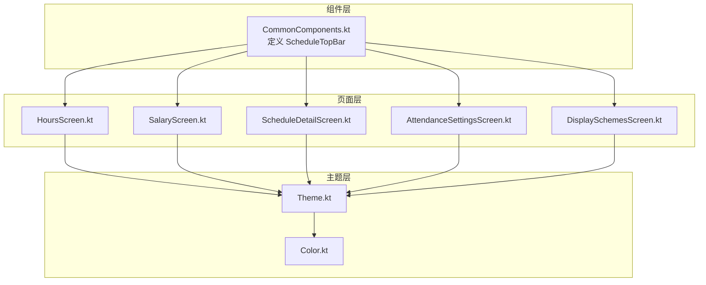
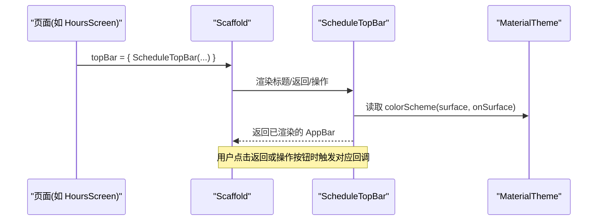
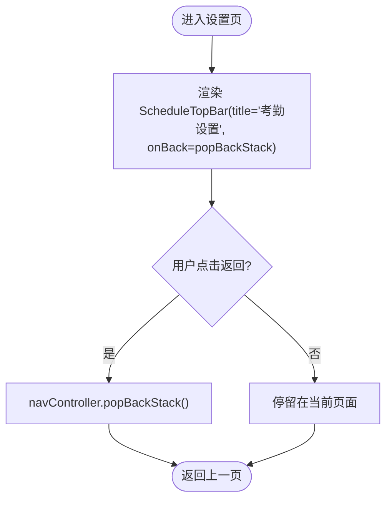
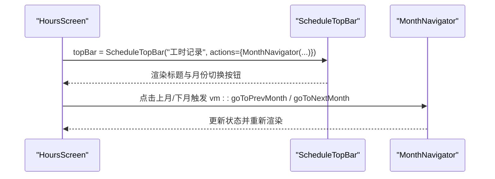
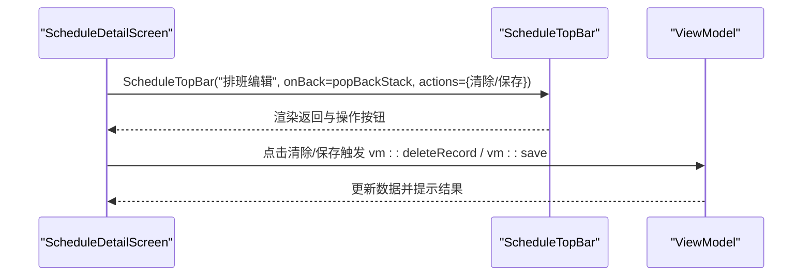
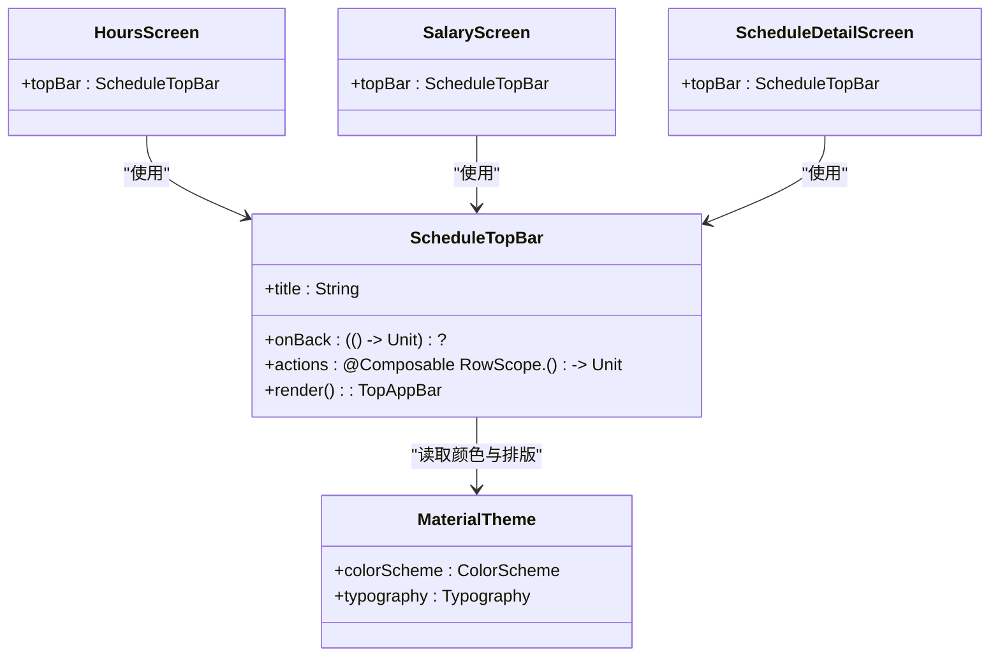

# 顶部导航栏组件

<cite>
**本文引用的文件**
- [CommonComponents.kt](file://app/src/main/java/com/schedulecalendar/app/ui/component/CommonComponents.kt)
- [HoursScreen.kt](file://app/src/main/java/com/schedulecalendar/app/ui/hours/HoursScreen.kt)
- [SalaryScreen.kt](file://app/src/main/java/com/schedulecalendar/app/ui/salary/SalaryScreen.kt)
- [ScheduleDetailScreen.kt](file://app/src/main/java/com/schedulecalendar/app/ui/detail/ScheduleDetailScreen.kt)
- [AttendanceSettingsScreen.kt](file://app/src/main/java/com/schedulecalendar/app/ui/settings/AttendanceSettingsScreen.kt)
- [DisplaySchemesScreen.kt](file://app/src/main/java/com/schedulecalendar/app/ui/detail/DisplaySchemesScreen.kt)
- [Theme.kt](file://app/src/main/java/com/schedulecalendar/app/ui/theme/Theme.kt)
- [Color.kt](file://app/src/main/java/com/schedulecalendar/app/ui/theme/Color.kt)
</cite>

## 目录
1. [简介](#简介)
2. [项目结构](#项目结构)
3. [核心组件](#核心组件)
4. [架构总览](#架构总览)
5. [详细组件分析](#详细组件分析)
6. [依赖关系分析](#依赖关系分析)
7. [性能考量](#性能考量)
8. [故障排查指南](#故障排查指南)
9. [结论](#结论)
10. [附录](#附录)

## 简介
本文件为 ScheduleTopBar 顶部导航栏组件的完整技术文档。该组件基于 Material Design 3（Material3）实现，用于在 Compose 应用中提供统一的标题显示、返回按钮与操作按钮区域，并深度集成应用主题色板。文档涵盖组件属性参数、样式定制、Material Design 规范遵循、多场景使用示例以及性能优化与最佳实践。

## 项目结构
ScheduleTopBar 定义在通用组件模块中，被多个业务页面复用：
- 组件定义：位于 ui/component 包下的公共组件文件中
- 使用方：工时记录、薪资记录、排班编辑、设置页等

图表来源
- [CommonComponents.kt:39-65](file://app/src/main/java/com/schedulecalendar/app/ui/component/CommonComponents.kt#L39-L65)
- [HoursScreen.kt:200-214](file://app/src/main/java/com/schedulecalendar/app/ui/hours/HoursScreen.kt#L200-L214)
- [SalaryScreen.kt:175-186](file://app/src/main/java/com/schedulecalendar/app/ui/salary/SalaryScreen.kt#L175-L186)
- [ScheduleDetailScreen.kt:95-116](file://app/src/main/java/com/schedulecalendar/app/ui/detail/ScheduleDetailScreen.kt#L95-L116)
- [AttendanceSettingsScreen.kt:20-32](file://app/src/main/java/com/schedulecalendar/app/ui/settings/AttendanceSettingsScreen.kt#L20-L32)
- [DisplaySchemesScreen.kt:74-82](file://app/src/main/java/com/schedulecalendar/app/ui/detail/DisplaySchemesScreen.kt#L74-L82)
- [Theme.kt:53-79](file://app/src/main/java/com/schedulecalendar/app/ui/theme/Theme.kt#L53-L79)
- [Color.kt:12-31](file://app/src/main/java/com/schedulecalendar/app/ui/theme/Color.kt#L12-L31)

章节来源
- [CommonComponents.kt:39-65](file://app/src/main/java/com/schedulecalendar/app/ui/component/CommonComponents.kt#L39-L65)
- [Theme.kt:53-79](file://app/src/main/java/com/schedulecalendar/app/ui/theme/Theme.kt#L53-L79)

## 核心组件
ScheduleTopBar 是一个可组合函数，封装了 Material3 的 TopAppBar，提供以下能力：
- 标题显示：支持半粗体文本
- 返回按钮：可选，点击触发 onBack 回调
- 操作按钮：通过 actions 插槽注入任意内容（如月份切换、保存/删除等）
- 主题集成：容器与文字颜色来自 MaterialTheme.colorScheme，自动适配明暗主题

关键属性与行为
- title: String，必填；为空且无导航图标与操作时不渲染，节省空间
- onBack: (() -> Unit)?，可选；若提供则显示返回图标
- actions: @Composable RowScope.() -> Unit，可选；用于放置右侧操作项

章节来源
- [CommonComponents.kt:39-65](file://app/src/main/java/com/schedulecalendar/app/ui/component/CommonComponents.kt#L39-L65)

## 架构总览
ScheduleTopBar 作为基础 UI 组件，被上层页面以 Scaffold.topBar 的方式嵌入。页面通过传入不同的 title、onBack 和 actions 来定制导航栏的行为与外观。主题由全局 MaterialTheme 提供，确保一致的色彩与排版风格。

图表来源
- [HoursScreen.kt:200-214](file://app/src/main/java/com/schedulecalendar/app/ui/hours/HoursScreen.kt#L200-L214)
- [CommonComponents.kt:39-65](file://app/src/main/java/com/schedulecalendar/app/ui/component/CommonComponents.kt#L39-L65)
- [Theme.kt:53-79](file://app/src/main/java/com/schedulecalendar/app/ui/theme/Theme.kt#L53-L79)

## 详细组件分析

### 组件属性与用法
- 仅标题：适用于无需返回与操作的列表页
- 带返回按钮：适用于详情页或子页面
- 带操作按钮：适用于需要快速动作（如月份切换、保存/删除）的场景
- 组合使用：同时包含返回与操作按钮

使用示例路径
- 仅标题 + 操作（月份切换）：[HoursScreen.kt:200-214](file://app/src/main/java/com/schedulecalendar/app/ui/hours/HoursScreen.kt#L200-L214)
- 仅标题 + 操作（月份切换）：[SalaryScreen.kt:175-186](file://app/src/main/java/com/schedulecalendar/app/ui/salary/SalaryScreen.kt#L175-L186)
- 返回 + 操作（清除/保存）：[ScheduleDetailScreen.kt:95-116](file://app/src/main/java/com/schedulecalendar/app/ui/detail/ScheduleDetailScreen.kt#L95-L116)
- 仅返回：[AttendanceSettingsScreen.kt:20-32](file://app/src/main/java/com/schedulecalendar/app/ui/settings/AttendanceSettingsScreen.kt#L20-L32)
- 仅返回：[DisplaySchemesScreen.kt:74-82](file://app/src/main/java/com/schedulecalendar/app/ui/detail/DisplaySchemesScreen.kt#L74-L82)

章节来源
- [HoursScreen.kt:200-214](file://app/src/main/java/com/schedulecalendar/app/ui/hours/HoursScreen.kt#L200-L214)
- [SalaryScreen.kt:175-186](file://app/src/main/java/com/schedulecalendar/app/ui/salary/SalaryScreen.kt#L175-L186)
- [ScheduleDetailScreen.kt:95-116](file://app/src/main/java/com/schedulecalendar/app/ui/detail/ScheduleDetailScreen.kt#L95-L116)
- [AttendanceSettingsScreen.kt:20-32](file://app/src/main/java/com/schedulecalendar/app/ui/settings/AttendanceSettingsScreen.kt#L20-L32)
- [DisplaySchemesScreen.kt:74-82](file://app/src/main/java/com/schedulecalendar/app/ui/detail/DisplaySchemesScreen.kt#L74-L82)

### 标题显示与返回按钮处理
- 标题文本采用半粗体，提升可读性
- 当 onBack 不为空时，显示返回图标；点击调用 onBack 回调
- 当 title 为空且无导航图标与操作时，整体不渲染，避免空白占用

章节来源
- [CommonComponents.kt:39-65](file://app/src/main/java/com/schedulecalendar/app/ui/component/CommonComponents.kt#L39-L65)

### 操作按钮配置
- 通过 actions 插槽注入任意 Composable 内容
- 常见用法：月份切换导航、保存/删除按钮等
- 布局由 RowScope 提供，便于左右对齐与间距控制

章节来源
- [HoursScreen.kt:200-214](file://app/src/main/java/com/schedulecalendar/app/ui/hours/HoursScreen.kt#L200-L214)
- [SalaryScreen.kt:175-186](file://app/src/main/java/com/schedulecalendar/app/ui/salary/SalaryScreen.kt#L175-L186)
- [ScheduleDetailScreen.kt:95-116](file://app/src/main/java/com/schedulecalendar/app/ui/detail/ScheduleDetailScreen.kt#L95-L116)

### 主题集成与样式定制
- 容器颜色与文字颜色取自 MaterialTheme.colorScheme.surface 与 onSurface
- 自动跟随系统明暗主题与动态取色（Android 12+）
- 如需自定义颜色，可在调用方通过外层修饰符或替换 TopAppBar 的 colors 参数进行扩展

章节来源
- [CommonComponents.kt:39-65](file://app/src/main/java/com/schedulecalendar/app/ui/component/CommonComponents.kt#L39-L65)
- [Theme.kt:53-79](file://app/src/main/java/com/schedulecalendar/app/ui/theme/Theme.kt#L53-L79)
- [Color.kt:12-31](file://app/src/main/java/com/schedulecalendar/app/ui/theme/Color.kt#L12-L31)

### Material Design 规范遵循
- 使用 Material3 的 TopAppBar 组件，符合最新设计规范
- 语义化图标与内容描述（如“返回”）
- 色彩与排版遵循 MaterialTheme 的 colorScheme 与 typography

章节来源
- [CommonComponents.kt:39-65](file://app/src/main/java/com/schedulecalendar/app/ui/component/CommonComponents.kt#L39-L65)
- [Theme.kt:53-79](file://app/src/main/java/com/schedulecalendar/app/ui/theme/Theme.kt#L53-L79)

### 使用示例与流程图

#### 示例一：带返回按钮的设置页

图表来源
- [AttendanceSettingsScreen.kt:20-32](file://app/src/main/java/com/schedulecalendar/app/ui/settings/AttendanceSettingsScreen.kt#L20-L32)
- [CommonComponents.kt:39-65](file://app/src/main/java/com/schedulecalendar/app/ui/component/CommonComponents.kt#L39-L65)

#### 示例二：带操作按钮的工时记录页

图表来源
- [HoursScreen.kt:200-214](file://app/src/main/java/com/schedulecalendar/app/ui/hours/HoursScreen.kt#L200-L214)
- [CommonComponents.kt:39-65](file://app/src/main/java/com/schedulecalendar/app/ui/component/CommonComponents.kt#L39-L65)

#### 示例三：返回与操作组合的排班编辑页

图表来源
- [ScheduleDetailScreen.kt:95-116](file://app/src/main/java/com/schedulecalendar/app/ui/detail/ScheduleDetailScreen.kt#L95-L116)
- [CommonComponents.kt:39-65](file://app/src/main/java/com/schedulecalendar/app/ui/component/CommonComponents.kt#L39-L65)

## 依赖关系分析
ScheduleTopBar 的依赖关系清晰且低耦合：
- 直接依赖：Material3 的 TopAppBar、Icons、MaterialTheme
- 间接依赖：应用主题（Theme.kt、Color.kt）
- 使用方：各业务页面通过 Scaffold.topBar 注入

图表来源
- [CommonComponents.kt:39-65](file://app/src/main/java/com/schedulecalendar/app/ui/component/CommonComponents.kt#L39-L65)
- [Theme.kt:53-79](file://app/src/main/java/com/schedulecalendar/app/ui/theme/Theme.kt#L53-L79)
- [HoursScreen.kt:200-214](file://app/src/main/java/com/schedulecalendar/app/ui/hours/HoursScreen.kt#L200-L214)
- [SalaryScreen.kt:175-186](file://app/src/main/java/com/schedulecalendar/app/ui/salary/SalaryScreen.kt#L175-L186)
- [ScheduleDetailScreen.kt:95-116](file://app/src/main/java/com/schedulecalendar/app/ui/detail/ScheduleDetailScreen.kt#L95-L116)

章节来源
- [CommonComponents.kt:39-65](file://app/src/main/java/com/schedulecalendar/app/ui/component/CommonComponents.kt#L39-L65)
- [Theme.kt:53-79](file://app/src/main/java/com/schedulecalendar/app/ui/theme/Theme.kt#L53-L79)

## 性能考量
- 条件渲染：当 title 为空且无导航图标与操作时，组件不渲染任何内容，减少不必要的布局开销
- 主题读取：颜色与排版从 MaterialTheme 获取，避免重复计算
- 操作插槽：actions 仅在需要时渲染，避免多余 Composable 树构建

优化建议
- 将复杂的 actions 内容用 remember 包裹，避免频繁重建
- 在长列表中避免在 topBar 中执行重计算逻辑
- 使用稳定的回调引用（如 ViewModel 方法），减少重组次数

章节来源
- [CommonComponents.kt:39-65](file://app/src/main/java/com/schedulecalendar/app/ui/component/CommonComponents.kt#L39-L65)

## 故障排查指南
常见问题与解决思路
- 返回按钮未显示：检查是否传入了 onBack 回调
- 操作按钮未渲染：确认 actions 插槽是否正确提供内容
- 主题颜色异常：确保应用已正确设置 MaterialTheme，且颜色方案有效
- 标题为空导致空白：若不需要顶部栏，请移除或隐藏 Scaffold 的 topBar

章节来源
- [CommonComponents.kt:39-65](file://app/src/main/java/com/schedulecalendar/app/ui/component/CommonComponents.kt#L39-L65)
- [Theme.kt:53-79](file://app/src/main/java/com/schedulecalendar/app/ui/theme/Theme.kt#L53-L79)

## 结论
ScheduleTopBar 是一个简洁、可复用且符合 Material Design 规范的顶部导航栏组件。它通过清晰的属性接口与主题集成，为应用提供了统一的导航体验。在不同场景下，开发者可通过灵活的参数配置满足多样化需求，并通过性能优化技巧进一步提升用户体验。

## 附录
- 组件定义位置：[CommonComponents.kt:39-65](file://app/src/main/java/com/schedulecalendar/app/ui/component/CommonComponents.kt#L39-L65)
- 主题配置位置：[Theme.kt:53-79](file://app/src/main/java/com/schedulecalendar/app/ui/theme/Theme.kt#L53-L79)、[Color.kt:12-31](file://app/src/main/java/com/schedulecalendar/app/ui/theme/Color.kt#L12-L31)
- 使用示例位置：
  - [HoursScreen.kt:200-214](file://app/src/main/java/com/schedulecalendar/app/ui/hours/HoursScreen.kt#L200-L214)
  - [SalaryScreen.kt:175-186](file://app/src/main/java/com/schedulecalendar/app/ui/salary/SalaryScreen.kt#L175-L186)
  - [ScheduleDetailScreen.kt:95-116](file://app/src/main/java/com/schedulecalendar/app/ui/detail/ScheduleDetailScreen.kt#L95-L116)
  - [AttendanceSettingsScreen.kt:20-32](file://app/src/main/java/com/schedulecalendar/app/ui/settings/AttendanceSettingsScreen.kt#L20-L32)
  - [DisplaySchemesScreen.kt:74-82](file://app/src/main/java/com/schedulecalendar/app/ui/detail/DisplaySchemesScreen.kt#L74-L82)