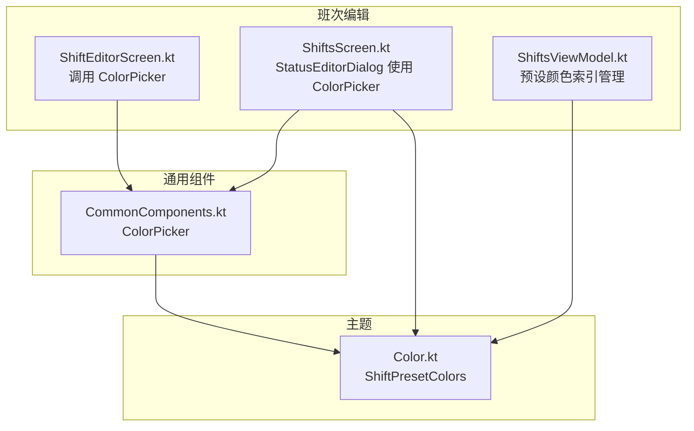
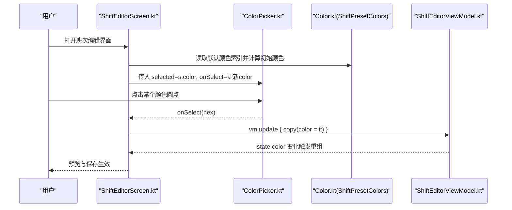
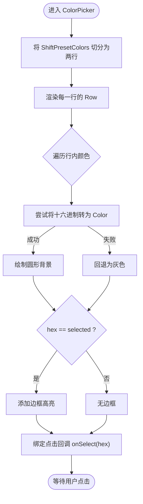
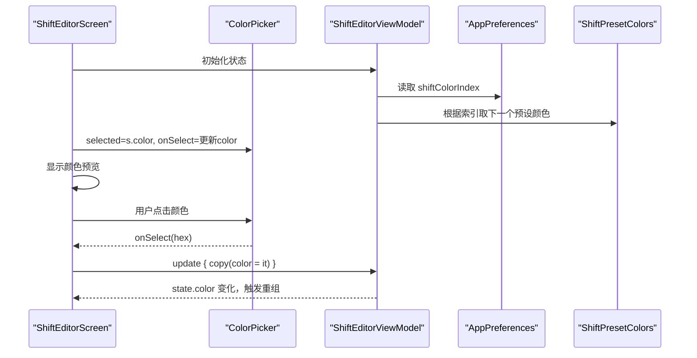
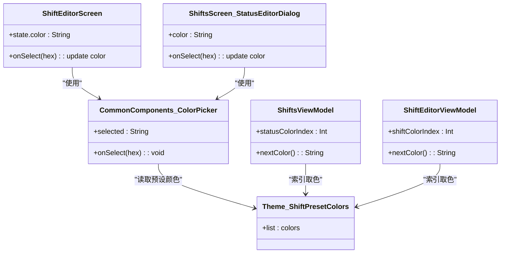

# 颜色选择器组件

<cite>
**本文引用的文件**   
- [CommonComponents.kt](file://app/src/main/java/com/schedulecalendar/app/ui/component/CommonComponents.kt)
- [Color.kt](file://app/src/main/java/com/schedulecalendar/app/ui/theme/Color.kt)
- [ShiftEditorScreen.kt](file://app/src/main/java/com/schedulecalendar/app/ui/shifts/ShiftEditorScreen.kt)
- [ShiftsScreen.kt](file://app/src/main/java/com/schedulecalendar/app/ui/shifts/ShiftsScreen.kt)
- [ShiftsViewModel.kt](file://app/src/main/java/com/schedulecalendar/app/ui/shifts/ShiftsViewModel.kt)
</cite>

## 目录
1. [简介](#简介)
2. [项目结构](#项目结构)
3. [核心组件](#核心组件)
4. [架构总览](#架构总览)
5. [详细组件分析](#详细组件分析)
6. [依赖关系分析](#依赖关系分析)
7. [性能考量](#性能考量)
8. [故障排查指南](#故障排查指南)
9. [结论](#结论)
10. [附录](#附录)

## 简介
本文件围绕 ColorPicker 颜色选择器组件进行系统化文档说明，重点覆盖：
- 18种预设颜色的两行布局实现（每行9个），包括网格排列、选中状态与边框高亮。
- 组件属性配置 selected 与 onSelect 的事件处理机制。
- 颜色数据结构 ShiftPresetColors 的组织与颜色验证逻辑。
- 自定义颜色配置与扩展方法。
- 交互体验优化与可访问性支持建议。
- 在班次颜色设置等实际场景中的使用方法。

## 项目结构
ColorPicker 位于通用组件模块中，被多个业务界面复用；预设颜色定义于主题模块；使用方分布在班次编辑与状态编辑等界面。

图表来源
- [CommonComponents.kt:81-104](file://app/src/main/java/com/schedulecalendar/app/ui/component/CommonComponents.kt#L81-L104)
- [Color.kt:46-53](file://app/src/main/java/com/schedulecalendar/app/ui/theme/Color.kt#L46-L53)
- [ShiftEditorScreen.kt:176](file://app/src/main/java/com/schedulecalendar/app/ui/shifts/ShiftEditorScreen.kt#L176)
- [ShiftsScreen.kt:603](file://app/src/main/java/com/schedulecalendar/app/ui/shifts/ShiftsScreen.kt#L603)
- [ShiftsViewModel.kt:217](file://app/src/main/java/com/schedulecalendar/app/ui/shifts/ShiftsViewModel.kt#L217)

章节来源
- [CommonComponents.kt:81-104](file://app/src/main/java/com/schedulecalendar/app/ui/component/CommonComponents.kt#L81-L104)
- [Color.kt:46-53](file://app/src/main/java/com/schedulecalendar/app/ui/theme/Color.kt#L46-L53)

## 核心组件
- ColorPicker(selected: String, onSelect: (String) -> Unit)
  - 功能：渲染18个预设颜色圆点，按两行九列均匀分布；点击后通过 onSelect 回调返回所选十六进制颜色字符串。
  - 选中态：当 hex == selected 时，为当前色块添加边框高亮（MaterialTheme.colorScheme.onSurface）。
  - 颜色解析：将十六进制字符串转换为 Compose Color，失败时回退到灰色，保证UI稳定。
  - 布局：外层 Column 垂直间距 8dp；内层 Row 水平 SpaceEvenly 均分；每个色块尺寸 48dp，内边距 10dp，圆形裁剪。

章节来源
- [CommonComponents.kt:81-104](file://app/src/main/java/com/schedulecalendar/app/ui/component/CommonComponents.kt#L81-L104)

## 架构总览
ColorPicker 作为无状态 UI 组件，仅依赖主题中的预设颜色列表 ShiftPresetColors。上层页面负责维护 selected 状态并通过 onSelect 回调更新数据模型或 ViewModel。

图表来源
- [ShiftEditorScreen.kt:176](file://app/src/main/java/com/schedulecalendar/app/ui/shifts/ShiftEditorScreen.kt#L176)
- [CommonComponents.kt:81-104](file://app/src/main/java/com/schedulecalendar/app/ui/component/CommonComponents.kt#L81-L104)
- [Color.kt:46-53](file://app/src/main/java/com/schedulecalendar/app/ui/theme/Color.kt#L46-L53)
- [ShiftsViewModel.kt:374-376](file://app/src/main/java/com/schedulecalendar/app/ui/shifts/ShiftsViewModel.kt#L374-L376)

## 详细组件分析

### ColorPicker 组件实现要点
- 两行九列布局
  - 使用 chunked(9) 将18色切分为两行，Row 内 SpaceEvenly 均匀分布。
  - 每个色块为圆形背景，尺寸固定，确保视觉一致性。
- 选中状态与边框高亮
  - 当 hex == selected 时，应用边框修饰符，颜色取自 onSurface，形状为圆形。
- 颜色验证与容错
  - 使用 toColorInt() 转换十六进制字符串，异常捕获后回退为灰色，避免崩溃。
- 事件处理
  - 点击色块直接调用 onSelect(hex)，由父级决定如何持久化或更新状态。

图表来源
- [CommonComponents.kt:81-104](file://app/src/main/java/com/schedulecalendar/app/ui/component/CommonComponents.kt#L81-L104)

章节来源
- [CommonComponents.kt:81-104](file://app/src/main/java/com/schedulecalendar/app/ui/component/CommonComponents.kt#L81-L104)

### ShiftPresetColors 数据结构与颜色组织
- 结构：List<String>，包含18个十六进制颜色字符串。
- 设计思路：第一行高饱和鲜艳色（暖冷交替），第二行低饱和/深色/中性色，避免相邻色接近，提升区分度。
- 使用方式：ColorPicker 通过 chunked(9) 自动形成两行九列的网格。

章节来源
- [Color.kt:46-53](file://app/src/main/java/com/schedulecalendar/app/ui/theme/Color.kt#L46-L53)

### 在班次编辑中的应用
- ShiftEditorScreen 中展示“班次颜色”标签与实时预览，并在下方嵌入 ColorPicker。
- 新建班次时，从偏好存储中读取 colorIndex，计算下一个预设颜色作为默认值。
- 用户选择颜色后，通过 onSelect 回调更新 ViewModel 的状态，最终保存。

图表来源
- [ShiftEditorScreen.kt:176](file://app/src/main/java/com/schedulecalendar/app/ui/shifts/ShiftEditorScreen.kt#L176)
- [ShiftsViewModel.kt:374-376](file://app/src/main/java/com/schedulecalendar/app/ui/shifts/ShiftsViewModel.kt#L374-L376)
- [Color.kt:46-53](file://app/src/main/java/com/schedulecalendar/app/ui/theme/Color.kt#L46-L53)

章节来源
- [ShiftEditorScreen.kt:176](file://app/src/main/java/com/schedulecalendar/app/ui/shifts/ShiftEditorScreen.kt#L176)
- [ShiftsViewModel.kt:374-376](file://app/src/main/java/com/schedulecalendar/app/ui/shifts/ShiftsViewModel.kt#L374-L376)

### 在状态编辑中的应用
- StatusEditorDialog 同样使用 ColorPicker 提供颜色选择，并配合名称输入与预览。
- 新增状态时，按持久化的 statusColorIndex 递增选择下一个预设颜色。

章节来源
- [ShiftsScreen.kt:603](file://app/src/main/java/com/schedulecalendar/app/ui/shifts/ShiftsScreen.kt#L603)
- [ShiftsViewModel.kt:217](file://app/src/main/java/com/schedulecalendar/app/ui/shifts/ShiftsViewModel.kt#L217)

## 依赖关系分析
- ColorPicker 依赖 ShiftPresetColors 提供颜色数据。
- ShiftEditorScreen 与 ShiftsScreen 依赖 ColorPicker 完成颜色选择。
- ShiftsViewModel 与 ShiftEditorViewModel 负责颜色索引管理与状态更新。

图表来源
- [CommonComponents.kt:81-104](file://app/src/main/java/com/schedulecalendar/app/ui/component/CommonComponents.kt#L81-L104)
- [Color.kt:46-53](file://app/src/main/java/com/schedulecalendar/app/ui/theme/Color.kt#L46-L53)
- [ShiftEditorScreen.kt:176](file://app/src/main/java/com/schedulecalendar/app/ui/shifts/ShiftEditorScreen.kt#L176)
- [ShiftsScreen.kt:603](file://app/src/main/java/com/schedulecalendar/app/ui/shifts/ShiftsScreen.kt#L603)
- [ShiftsViewModel.kt:217](file://app/src/main/java/com/schedulecalendar/app/ui/shifts/ShiftsViewModel.kt#L217)

章节来源
- [CommonComponents.kt:81-104](file://app/src/main/java/com/schedulecalendar/app/ui/component/CommonComponents.kt#L81-L104)
- [Color.kt:46-53](file://app/src/main/java/com/schedulecalendar/app/ui/theme/Color.kt#L46-L53)
- [ShiftEditorScreen.kt:176](file://app/src/main/java/com/schedulecalendar/app/ui/shifts/ShiftEditorScreen.kt#L176)
- [ShiftsScreen.kt:603](file://app/src/main/java/com/schedulecalendar/app/ui/shifts/ShiftsScreen.kt#L603)
- [ShiftsViewModel.kt:217](file://app/src/main/java/com/schedulecalendar/app/ui/shifts/ShiftsViewModel.kt#L217)

## 性能考量
- 颜色转换容错：toColorInt() 失败时回退为灰色，避免异常导致的重组开销。
- 布局简单：两行九列静态网格，无复杂动画，渲染成本低。
- 状态最小化：ColorPicker 本身不持有状态，仅通过 selected 与 onSelect 通信，减少不必要的重组。

[本节为通用指导，不直接分析具体文件]

## 故障排查指南
- 颜色无法显示或显示为灰色
  - 检查传入的十六进制字符串是否合法（如缺少“#”前缀或格式错误）。
  - 确认 ColorPicker 内部转换失败时的回退逻辑是否生效。
- 选中态边框不明显
  - 确认 MaterialTheme.colorScheme.onSurface 在当前主题下对比度足够。
  - 检查 selected 值是否与 hex 完全一致（大小写敏感）。
- 默认颜色未按预期递增
  - 检查 ViewModel 中 colorIndex 的持久化与递增逻辑是否正确。
  - 确认 ShiftPresetColors 的大小与索引取模运算无误。

章节来源
- [CommonComponents.kt:81-104](file://app/src/main/java/com/schedulecalendar/app/ui/component/CommonComponents.kt#L81-L104)
- [ShiftsViewModel.kt:217](file://app/src/main/java/com/schedulecalendar/app/ui/shifts/ShiftsViewModel.kt#L217)
- [ShiftsViewModel.kt:374-376](file://app/src/main/java/com/schedulecalendar/app/ui/shifts/ShiftsViewModel.kt#L374-L376)

## 结论
ColorPicker 以简洁的两行九列布局提供了直观的颜色选择能力，结合 ShiftPresetColors 的高区分度配色方案，满足班次与状态颜色设置的常见需求。通过 selected 与 onSelect 的属性与事件机制，组件与上层状态解耦，易于扩展与维护。建议在后续迭代中补充无障碍描述与键盘导航支持，以提升可访问性与交互体验。

[本节为总结，不直接分析具体文件]

## 附录

### 自定义颜色配置与扩展指南
- 扩展预设颜色
  - 在 ShiftPresetColors 中添加新的十六进制颜色字符串，保持整体区分度与可读性。
  - 若需要更多列或行，可在 ColorPicker 中调整 chunked 参数与布局策略。
- 自定义颜色校验
  - 如需更严格的校验（如禁止某些语义色），可在 onSelect 回调中进行过滤或提示。
- 增加无障碍支持
  - 为每个颜色圆点添加 contentDescription，描述颜色含义或编号。
  - 支持键盘左右移动与回车选择，提升屏幕阅读器与键盘用户的体验。
- 增强选中态反馈
  - 可增加缩放动画或阴影效果，强化选中反馈。
  - 在高对比度模式下，确保边框颜色与背景对比度达标。

[本节为概念性指导，不直接分析具体文件]