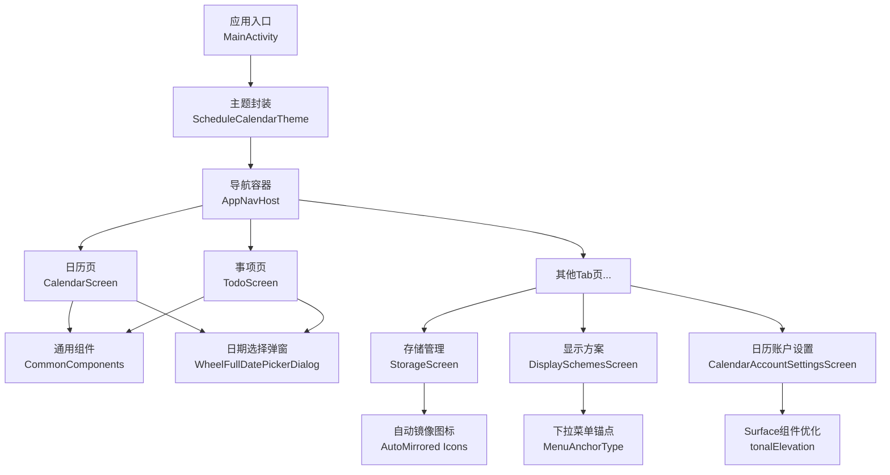
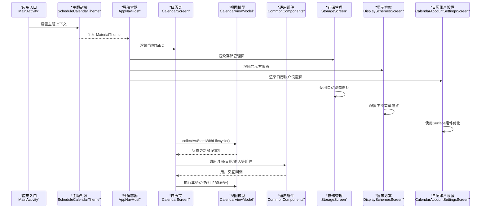
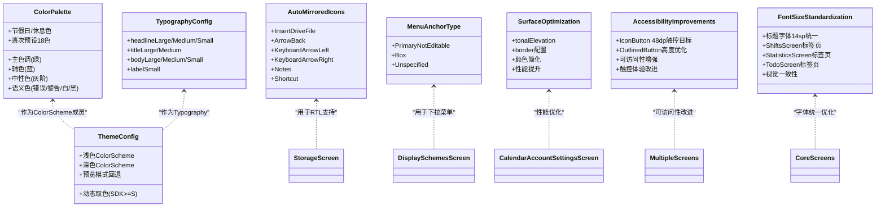
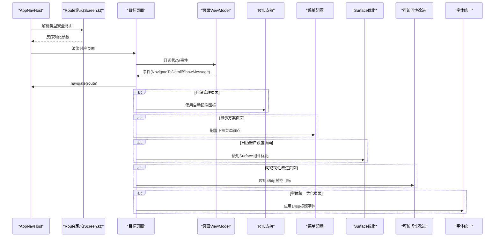
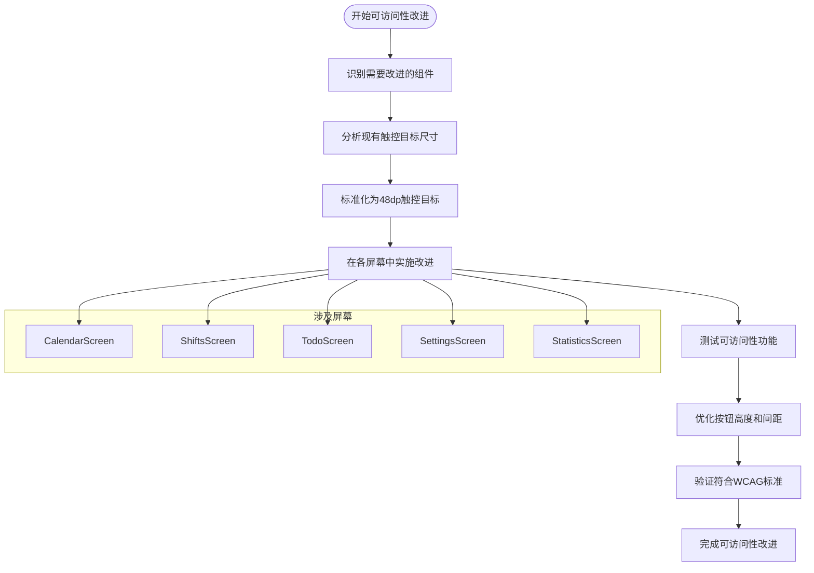
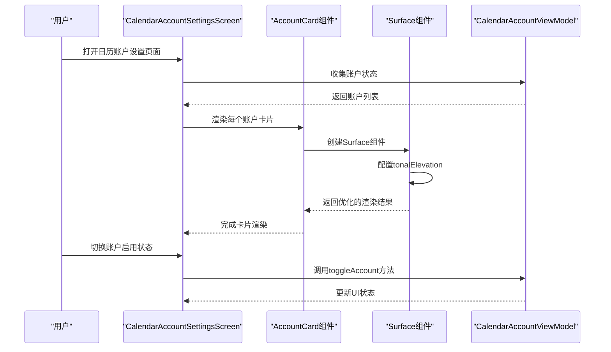
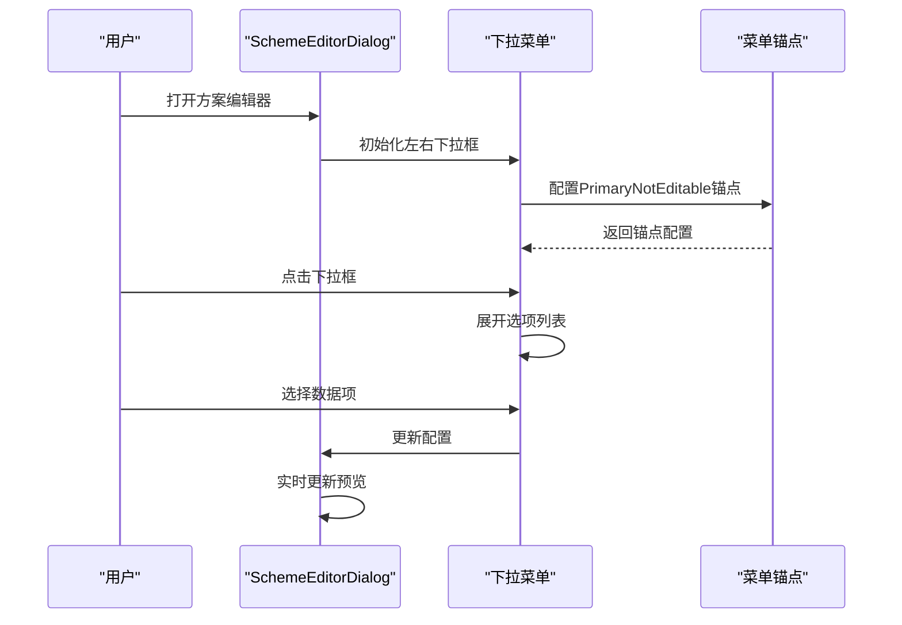
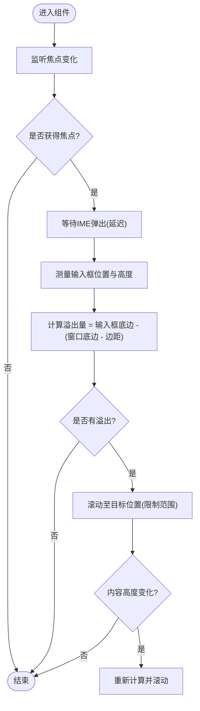
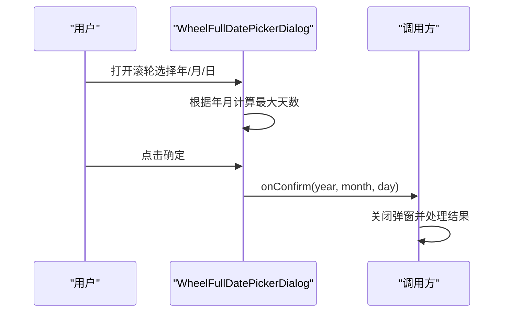
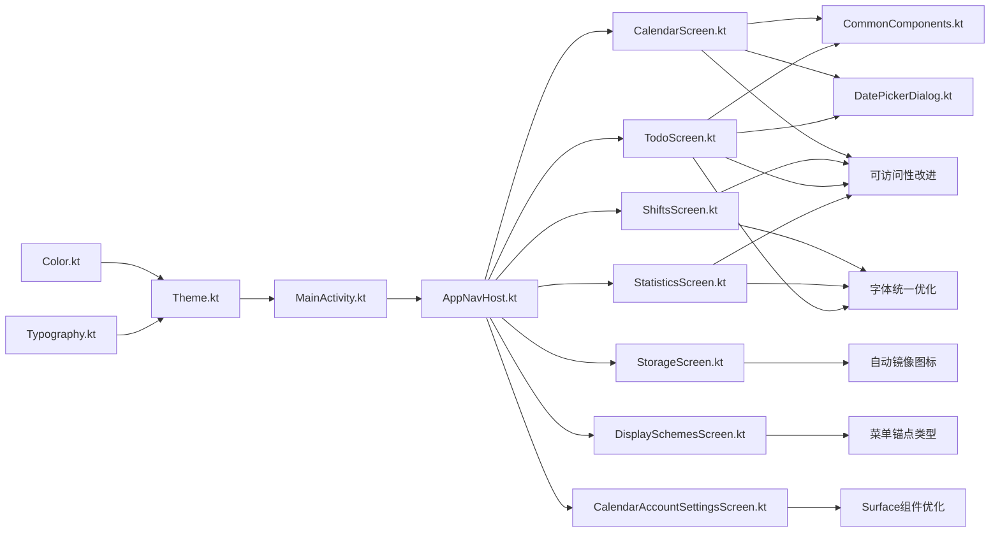

# UI组件设计

<cite>
**本文引用的文件**   
- [MainActivity.kt](file://app/src/main/java/com/schedulecalendar/app/MainActivity.kt)
- [ScheduleApp.kt](file://app/src/main/java/com/schedulecalendar/app/ScheduleApp.kt)
- [Theme.kt](file://app/src/main/java/com/schedulecalendar/app/ui/theme/Theme.kt)
- [Color.kt](file://app/src/main/java/com/schedulecalendar/app/ui/theme/Color.kt)
- [Typography.kt](file://app/src/main/java/com/schedulecalendar/app/ui/theme/Typography.kt)
- [CommonComponents.kt](file://app/src/main/java/com/schedulecalendar/app/ui/component/CommonComponents.kt)
- [DatePickerDialog.kt](file://app/src/main/java/com/schedulecalendar/app/ui/component/DatePickerDialog.kt)
- [AppNavHost.kt](file://app/src/main/java/com/schedulecalendar/app/ui/navigation/AppNavHost.kt)
- [Screen.kt](file://app/src/main/java/com/schedulecalendar/app/ui/navigation/Screen.kt)
- [CalendarScreen.kt](file://app/src/main/java/com/schedulecalendar/app/ui/calendar/CalendarScreen.kt)
- [TodoScreen.kt](file://app/src/main/java/com/schedulecalendar/app/ui/todo/TodoScreen.kt)
- [StorageScreen.kt](file://app/src/main/java/com/schedulecalendar/app/ui/settings/StorageScreen.kt)
- [DisplaySchemesScreen.kt](file://app/src/main/java/com/schedulecalendar/app/ui/detail/DisplaySchemesScreen.kt)
- [CalendarAccountSettingsScreen.kt](file://app/src/main/java/com/schedulecalendar/app/ui/settings/CalendarAccountSettingsScreen.kt)
- [SettingsScreen.kt](file://app/src/main/java/com/schedulecalendar/app/ui/settings/SettingsScreen.kt)
- [ShiftsScreen.kt](file://app/src/main/java/com/schedulecalendar/app/ui/shifts/ShiftsScreen.kt)
- [StatisticsScreen.kt](file://app/src/main/java/com/schedulecalendar/app/ui/statistics/StatisticsScreen.kt)
</cite>

## 更新摘要
**所做更改**   
- 更新了多个屏幕的标题字体大小，从18sp统一调整为14sp，确保应用内视觉一致性
- 改进了ShiftsScreen、StatisticsScreen、TodoScreen等核心页面的标签页标题显示效果
- 符合Material Design 3指南，提升了整体用户体验的一致性
- 优化了界面层级和可读性，使标题与内容文本更加协调

## 目录
1. [引言](#引言)
2. [项目结构](#项目结构)
3. [核心组件](#核心组件)
4. [架构总览](#架构总览)
5. [详细组件分析](#详细组件分析)
6. [依赖关系分析](#依赖关系分析)
7. [性能考量](#性能考量)
8. [故障排查指南](#故障排查指南)
9. [结论](#结论)
10. [附录](#附录)

## 引言
本设计文档面向基于 Jetpack Compose 的现代化 Android UI 开发，聚焦 Material Design 3 主题系统、通用组件与复用策略、响应式布局、状态管理与通信、动画与过渡、可访问性、多语言适配与性能优化等高级主题。文档以仓库中的实际实现为依据，提供代码级可视化图示与最佳实践建议，帮助读者快速理解并落地高质量 UI 工程。

## 项目结构
UI 层采用"主题 + 导航 + 页面 + 通用组件"的分层组织：
- 主题层：颜色、字体、Material 3 主题封装
- 导航层：类型安全路由与底部 Tab 容器
- 页面层：日历、事项、统计、班次、设置等主屏及子页
- 通用组件：顶部栏、时间选择器、日期滚轮弹窗、IME 自适应输入框等

图表来源
- [MainActivity.kt:55-64](file://app/src/main/java/com/schedulecalendar/app/MainActivity.kt#L55-L64)
- [Theme.kt:49-75](file://app/src/main/java/com/schedulecalendar/app/ui/theme/Theme.kt#L49-L75)
- [AppNavHost.kt:53-132](file://app/src/main/java/com/schedulecalendar/app/ui/navigation/AppNavHost.kt#L53-132)
- [CalendarScreen.kt:74-130](file://app/src/main/java/com/schedulecalendar/app/ui/calendar/CalendarScreen.kt#L74-130)
- [TodoScreen.kt:65-167](file://app/src/main/java/com/schedulecalendar/app/ui/todo/TodoScreen.kt#L65-167)
- [StorageScreen.kt:37-419](file://app/src/main/java/com/schedulecalendar/app/ui/settings/StorageScreen.kt#L37-419)
- [DisplaySchemesScreen.kt:49-114](file://app/src/main/java/com/schedulecalendar/app/ui/detail/DisplaySchemesScreen.kt#L49-114)
- [CalendarAccountSettingsScreen.kt:150-232](file://app/src/main/java/com/schedulecalendar/app/ui/settings/CalendarAccountSettingsScreen.kt#L150-232)

章节来源
- [MainActivity.kt:41-65](file://app/src/main/java/com/schedulecalendar/app/MainActivity.kt#L41-65)
- [ScheduleApp.kt:7-8](file://app/src/main/java/com/schedulecalendar/app/ScheduleApp.kt#L7-L8)
- [Theme.kt:12-75](file://app/src/main/java/com/schedulecalendar/app/ui/theme/Theme.kt#L12-75)
- [AppNavHost.kt:42-132](file://app/src/main/java/com/schedulecalendar/app/ui/navigation/AppNavHost.kt#L42-132)

## 核心组件
本节聚焦主题系统与通用组件的设计要点与使用方式。

### Material Design 3 主题系统
- 颜色体系
  - 主色（绿色系）、辅色（蓝色）、中性色、语义色、节假日/休息专用色、班次预设高区分度配色集合
  - 通过 light/dark 两套 ColorScheme 覆盖 primary、secondary、surface、background、error 等关键角色
- 动态取色
  - Android 12+ 启用 dynamic color；预览模式回退到静态色板，避免无 Activity Context 崩溃
- 字体规范
  - 统一的 Typography 定义 headline/title/body/label 系列字号、字重与行高，保证层级一致性与可读性

章节来源
- [Color.kt:6-42](file://app/src/main/java/com/schedulecalendar/app/ui/theme/Color.kt#L6-42)
- [Theme.kt:12-75](file://app/src/main/java/com/schedulecalendar/app/ui/theme/Theme.kt#L12-75)
- [Typography.kt:9-19](file://app/src/main/java/com/schedulecalendar/app/ui/theme/Typography.kt#L9-19)

### 通用 UI 组件与复用策略
- 顶部栏 ScheduleTopBar：统一标题、返回按钮与操作区，遵循 Surface/onSurface 色彩
- 信息卡片 StatCard：数据展示卡片，支持容器色定制
- 月份导航 MonthNavigator：左右箭头切换年月
- 设置项 SettingRow/NumericSettingRow：一致的间距与分割线风格
- 时间选择 TimePickerField/ExpandableTimePicker：封装 TimePicker 对话框，支持外部控制或内部自包含
- IME 自适应输入 ImeAdaptiveOutlinedTextField：自动滚动使输入框在键盘上方可见，兼容 Column 与 LazyColumn 场景
- 颜色选择 ColorPicker：两行 18 色网格，选中态边框高亮
- 日期选择 WheelFullDatePickerDialog/WheelDatePickerDialog：年/月/日三列滚轮，支持固定最大天数（如农历）

复用策略
- 将样式与交互从业务页面中抽离为独立 @Composable，参数化配置（颜色、尺寸、文案、回调）
- 通过 MaterialTheme.colorScheme/typography 接入主题，确保明暗主题与动态取色一致性
- 对复杂交互（如弹出对话框、滚动定位）进行内部状态封装，对外暴露最小 API

章节来源
- [CommonComponents.kt:38-115](file://app/src/main/java/com/schedulecalendar/app/ui/component/CommonComponents.kt#L38-115)
- [CommonComponents.kt:148-166](file://app/src/main/java/com/schedulecalendar/app/ui/component/CommonComponents.kt#L148-166)
- [CommonComponents.kt:181-258](file://app/src/main/java/com/schedulecalendar/app/ui/component/CommonComponents.kt#L181-258)
- [CommonComponents.kt:270-341](file://app/src/main/java/com/schedulecalendar/app/ui/component/CommonComponents.kt#L270-341)
- [CommonComponents.kt:355-443](file://app/src/main/java/com/schedulecalendar/app/ui/component/CommonComponents.kt#L355-443)
- [DatePickerDialog.kt:33-186](file://app/src/main/java/com/schedulecalendar/app/ui/component/DatePickerDialog.kt#L33-186)
- [DatePickerDialog.kt:191-302](file://app/src/main/java/com/schedulecalendar/app/ui/component/DatePickerDialog.kt#L191-302)

### RTL 语言支持与自动镜像图标

**更新** 新增了针对从右到左（RTL）语言环境的完整支持，包括自动镜像图标的实现。

- 自动镜像图标
  - 使用 `Icons.AutoMirrored.Filled.InsertDriveFile` 替代传统图标，在 RTL 语言环境中自动翻转方向
  - 支持所有需要方向性的图标，如箭头、导航指示器等
  - 导入语句：`import androidx.compose.material.icons.automirrored.filled.InsertDriveFile`
- 多语言适配
  - 存储管理界面中的文件图标现在支持 RTL 语言环境
  - 确保在不同语言环境下图标方向的正确性
- 可访问性增强
  - 为所有图标提供适当的 contentDescription
  - 支持屏幕阅读器正确识别图标含义

章节来源
- [StorageScreen.kt:11-12](file://app/src/main/java/com/schedulecalendar/app/ui/settings/StorageScreen.kt#L11-12)
- [StorageScreen.kt:575-578](file://app/src/main/java/com/schedulecalendar/app/ui/settings/StorageScreen.kt#L575-578)

### 下拉菜单锚点配置改进

**更新** 改进了下拉菜单的锚点配置，使用更精确的 MenuAnchorType 类型。

- PrimaryNotEditable 类型
  - 使用 `MenuAnchorType.PrimaryNotEditable` 作为下拉菜单锚点类型
  - 提供更好的用户体验和可访问性支持
  - 适用于只读的下拉选择框场景
- 双下拉框布局
  - 显示方案编辑器中的左右两个下拉框都使用了新的锚点配置
  - 确保下拉菜单的正确定位和交互行为
- 兼容性保证
  - 保持向后兼容性，不影响现有功能
  - 提供更稳定的菜单展开和关闭行为

章节来源
- [DisplaySchemesScreen.kt:372-374](file://app/src/main/java/com/schedulecalendar/app/ui/detail/DisplaySchemesScreen.kt#L372-374)
- [DisplaySchemesScreen.kt:436-438](file://app/src/main/java/com/schedulecalendar/app/ui/detail/DisplaySchemesScreen.kt#L436-438)

### 日历账户设置页面性能优化

**更新** 日历账户设置页面实现了显著的性能优化，系统性地替换了Card组件为Surface组件。

- Surface组件优化
  - 使用 `Surface` 替代传统的 `Card` 组件，符合 Material Design 3 规范
  - 通过 `tonalElevation` 属性替代传统卡片阴影，提升渲染性能
  - 移除了不必要的 `BorderStroke` 导入，简化了颜色配置逻辑
- 视觉一致性
  - 保持了与原有Card组件完全相同的视觉效果
  - 圆角半径设置为12dp，与整体设计系统保持一致
  - 禁用状态的背景色透明度调整为0.3f，提供更好的视觉反馈
- 性能提升
  - Surface组件相比Card组件具有更好的渲染性能
  - tonalElevation提供了更高效的阴影处理机制
  - 减少了不必要的内存分配和绘制开销

章节来源
- [CalendarAccountSettingsScreen.kt:150-232](file://app/src/main/java/com/schedulecalendar/app/ui/settings/CalendarAccountSettingsScreen.kt#L150-232)
- [CalendarAccountSettingsScreen.kt:161-170](file://app/src/main/java/com/schedulecalendar/app/ui/settings/CalendarAccountSettingsScreen.kt#L161-170)

### 可访问性改进与触控目标优化

**更新** 在多屏幕中实施了全面的可访问性改进，重点优化了IconButton组件的触控目标尺寸。

- IconButton触控目标标准化
  - 将所有IconButton组件的尺寸从32dp统一增加到48dp，符合Material Design 3的最小触控目标要求
  - 涉及的屏幕包括：CalendarScreen、ShiftsScreen、TodoScreen、SettingsScreen、StatisticsScreen
  - 确保所有交互元素都有足够的触控区域，提升可访问性和用户体验
- 具体实现位置
  - CalendarScreen：编辑菜单按钮、年份调整按钮、详情编辑按钮等
  - ShiftsScreen：删除、编辑、排序等操作按钮
  - TodoScreen：待办事项操作按钮
  - SettingsScreen：权限管理相关按钮
  - StatisticsScreen：月份导航按钮
- OutlinedButton高度优化
  - 日历页面中的"今天"按钮高度从32dp调整为26dp
  - 在保持可访问性标准的同时，改善了视觉平衡和紧凑性
  - 使用contentPadding控制内边距，确保文本内容的适当间距
- 可访问性最佳实践
  - 所有IconButton都设置了适当的contentDescription
  - 遵循WCAG 2.1可访问性指南
  - 确保在高对比度模式下正常工作

章节来源
- [CalendarScreen.kt:368-384](file://app/src/main/java/com/schedulecalendar/app/ui/calendar/CalendarScreen.kt#L368-384)
- [CalendarScreen.kt:390-396](file://app/src/main/java/com/schedulecalendar/app/ui/calendar/CalendarScreen.kt#L390-396)
- [ShiftsScreen.kt:278-304](file://app/src/main/java/com/schedulecalendar/app/ui/shifts/ShiftsScreen.kt#L278-304)
- [ShiftsScreen.kt:350-375](file://app/src/main/java/com/schedulecalendar/app/ui/shifts/ShiftsScreen.kt#L350-375)
- [TodoScreen.kt:579-595](file://app/src/main/java/com/schedulecalendar/app/ui/todo/TodoScreen.kt#L579-595)
- [StatisticsScreen.kt:51-67](file://app/src/main/java/com/schedulecalendar/app/ui/statistics/StatisticsScreen.kt#L51-67)

### 标题字体大小统一优化

**更新** 对多个核心屏幕的标题字体大小进行了统一优化，从18sp调整为14sp，确保应用内视觉一致性。

- 字体大小标准化
  - ShiftsScreen标签页标题：从18sp调整为14sp，提升标签页的可读性和紧凑性
  - StatisticsScreen标签页标题：从18sp调整为14sp，与整体设计系统保持一致
  - TodoScreen标签页标题：从18sp调整为14sp，改善多层级信息的视觉层次
- 视觉层次优化
  - 14sp字体大小更符合Material Design 3的标题规范
  - 与正文文本（bodyMedium 14sp）形成更好的视觉协调
  - 减少标题与内容之间的视觉冲突，提升整体阅读体验
- 一致性保证
  - 所有主要功能页面的标签页标题统一使用14sp
  - 保持不同屏幕间的视觉一致性
  - 符合现代移动应用的字体设计规范

章节来源
- [ShiftsScreen.kt:109](file://app/src/main/java/com/schedulecalendar/app/ui/shifts/ShiftsScreen.kt#L109)
- [StatisticsScreen.kt:69](file://app/src/main/java/com/schedulecalendar/app/ui/statistics/StatisticsScreen.kt#L69)
- [TodoScreen.kt:130](file://app/src/main/java/com/schedulecalendar/app/ui/todo/TodoScreen.kt#L130)

## 架构总览
整体 UI 架构由"应用入口 → 主题 → 导航 → 页面 → 组件"构成，页面通过 ViewModel 驱动状态，导航使用类型安全路由，组件统一受主题约束。

图表来源
- [MainActivity.kt:55-64](file://app/src/main/java/com/schedulecalendar/app/MainActivity.kt#L55-64)
- [Theme.kt:49-75](file://app/src/main/java/com/schedulecalendar/app/ui/theme/Theme.kt#L49-75)
- [AppNavHost.kt:53-132](file://app/src/main/java/com/schedulecalendar/app/ui/navigation/AppNavHost.kt#L53-132)
- [CalendarScreen.kt:74-130](file://app/src/main/java/com/schedulecalendar/app/ui/calendar/CalendarScreen.kt#L74-130)
- [StorageScreen.kt:37-419](file://app/src/main/java/com/schedulecalendar/app/ui/settings/StorageScreen.kt#L37-419)
- [DisplaySchemesScreen.kt:49-114](file://app/src/main/java/com/schedulecalendar/app/ui/detail/DisplaySchemesScreen.kt#L49-114)
- [CalendarAccountSettingsScreen.kt:29-148](file://app/src/main/java/com/schedulecalendar/app/ui/settings/CalendarAccountSettingsScreen.kt#L29-148)

## 详细组件分析

### 主题与颜色类图

图表来源
- [Color.kt:6-42](file://app/src/main/java/com/schedulecalendar/app/ui/theme/Color.kt#L6-42)
- [Theme.kt:12-75](file://app/src/main/java/com/schedulecalendar/app/ui/theme/Theme.kt#L12-75)
- [Typography.kt:9-19](file://app/src/main/java/com/schedulecalendar/app/ui/theme/Typography.kt#L9-19)
- [StorageScreen.kt:11-12](file://app/src/main/java/com/schedulecalendar/app/ui/settings/StorageScreen.kt#L11-12)
- [DisplaySchemesScreen.kt:372-374](file://app/src/main/java/com/schedulecalendar/app/ui/detail/DisplaySchemesScreen.kt#L372-374)
- [CalendarAccountSettingsScreen.kt:161-170](file://app/src/main/java/com/schedulecalendar/app/ui/settings/CalendarAccountSettingsScreen.kt#L161-170)
- [CalendarScreen.kt:368-384](file://app/src/main/java/com/schedulecalendar/app/ui/calendar/CalendarScreen.kt#L368-384)
- [ShiftsScreen.kt:109](file://app/src/main/java/com/schedulecalendar/app/ui/shifts/ShiftsScreen.kt#L109)
- [StatisticsScreen.kt:69](file://app/src/main/java/com/schedulecalendar/app/ui/statistics/StatisticsScreen.kt#L69)
- [TodoScreen.kt:130](file://app/src/main/java/com/schedulecalendar/app/ui/todo/TodoScreen.kt#L130)

章节来源
- [Color.kt:6-42](file://app/src/main/java/com/schedulecalendar/app/ui/theme/Color.kt#L6-42)
- [Theme.kt:12-75](file://app/src/main/java/com/schedulecalendar/app/ui/theme/Theme.kt#L12-75)
- [Typography.kt:9-19](file://app/src/main/java/com/schedulecalendar/app/ui/theme/Typography.kt#L9-19)

### 导航与路由序列图

图表来源
- [AppNavHost.kt:91-132](file://app/src/main/java/com/schedulecalendar/app/ui/navigation/AppNavHost.kt#L91-132)
- [Screen.kt:6-33](file://app/src/main/java/com/schedulecalendar/app/ui/navigation/Screen.kt#L6-33)
- [CalendarScreen.kt:121-130](file://app/src/main/java/com/schedulecalendar/app/ui/calendar/CalendarScreen.kt#L121-130)
- [StorageScreen.kt:575-578](file://app/src/main/java/com/schedulecalendar/app/ui/settings/StorageScreen.kt#L575-578)
- [DisplaySchemesScreen.kt:372-374](file://app/src/main/java/com/schedulecalendar/app/ui/detail/DisplaySchemesScreen.kt#L372-374)
- [CalendarAccountSettingsScreen.kt:161-170](file://app/src/main/java/com/schedulecalendar/app/ui/settings/CalendarAccountSettingsScreen.kt#L161-170)
- [CalendarScreen.kt:368-384](file://app/src/main/java/com/schedulecalendar/app/ui/calendar/CalendarScreen.kt#L368-384)
- [ShiftsScreen.kt:109](file://app/src/main/java/com/schedulecalendar/app/ui/shifts/ShiftsScreen.kt#L109)
- [StatisticsScreen.kt:69](file://app/src/main/java/com/schedulecalendar/app/ui/statistics/StatisticsScreen.kt#L69)
- [TodoScreen.kt:130](file://app/src/main/java/com/schedulecalendar/app/ui/todo/TodoScreen.kt#L130)

章节来源
- [AppNavHost.kt:42-132](file://app/src/main/java/com/schedulecalendar/app/ui/navigation/AppNavHost.kt#L42-132)
- [Screen.kt:6-33](file://app/src/main/java/com/schedulecalendar/app/ui/navigation/Screen.kt#L6-33)

### 可访问性改进实施流程

图表来源
- [CalendarScreen.kt:368-384](file://app/src/main/java/com/schedulecalendar/app/ui/calendar/CalendarScreen.kt#L368-384)
- [ShiftsScreen.kt:278-304](file://app/src/main/java/com/schedulecalendar/app/ui/shifts/ShiftsScreen.kt#L278-304)
- [TodoScreen.kt:579-595](file://app/src/main/java/com/schedulecalendar/app/ui/todo/TodoScreen.kt#L579-595)
- [SettingsScreen.kt:430-459](file://app/src/main/java/com/schedulecalendar/app/ui/settings/SettingsScreen.kt#L430-459)
- [StatisticsScreen.kt:51-67](file://app/src/main/java/com/schedulecalendar/app/ui/statistics/StatisticsScreen.kt#L51-67)

章节来源
- [CalendarScreen.kt:368-384](file://app/src/main/java/com/schedulecalendar/app/ui/calendar/CalendarScreen.kt#L368-384)
- [ShiftsScreen.kt:278-304](file://app/src/main/java/com/schedulecalendar/app/ui/shifts/ShiftsScreen.kt#L278-304)
- [TodoScreen.kt:579-595](file://app/src/main/java/com/schedulecalendar/app/ui/todo/TodoScreen.kt#L579-595)
- [SettingsScreen.kt:430-459](file://app/src/main/java/com/schedulecalendar/app/ui/settings/SettingsScreen.kt#L430-459)
- [StatisticsScreen.kt:51-67](file://app/src/main/java/com/schedulecalendar/app/ui/statistics/StatisticsScreen.kt#L51-67)

### 日历账户设置页面流程（含Surface优化）

图表来源
- [CalendarAccountSettingsScreen.kt:29-148](file://app/src/main/java/com/schedulecalendar/app/ui/settings/CalendarAccountSettingsScreen.kt#L29-148)
- [CalendarAccountSettingsScreen.kt:150-232](file://app/src/main/java/com/schedulecalendar/app/ui/settings/CalendarAccountSettingsScreen.kt#L150-232)
- [CalendarAccountViewModel.kt:102-124](file://app/src/main/java/com/schedulecalendar/app/ui/settings/CalendarAccountViewModel.kt#L102-124)

章节来源
- [CalendarAccountSettingsScreen.kt:29-232](file://app/src/main/java/com/schedulecalendar/app/ui/settings/CalendarAccountSettingsScreen.kt#L29-232)
- [CalendarAccountViewModel.kt:16-167](file://app/src/main/java/com/schedulecalendar/app/ui/settings/CalendarAccountViewModel.kt#L16-167)

### 显示方案编辑器流程（含下拉菜单改进）

图表来源
- [DisplaySchemesScreen.kt:187-306](file://app/src/main/java/com/schedulecalendar/app/ui/detail/DisplaySchemesScreen.kt#L187-306)
- [DisplaySchemesScreen.kt:372-374](file://app/src/main/java/com/schedulecalendar/app/ui/detail/DisplaySchemesScreen.kt#L372-374)
- [DisplaySchemesScreen.kt:436-438](file://app/src/main/java/com/schedulecalendar/app/ui/detail/DisplaySchemesScreen.kt#L436-438)

章节来源
- [DisplaySchemesScreen.kt:187-306](file://app/src/main/java/com/schedulecalendar/app/ui/detail/DisplaySchemesScreen.kt#L187-306)

### IME 自适应输入框算法流程图

图表来源
- [CommonComponents.kt:355-443](file://app/src/main/java/com/schedulecalendar/app/ui/component/CommonComponents.kt#L355-443)

章节来源
- [CommonComponents.kt:355-443](file://app/src/main/java/com/schedulecalendar/app/ui/component/CommonComponents.kt#L355-443)

### 日期选择器交互时序

图表来源
- [DatePickerDialog.kt:33-186](file://app/src/main/java/com/schedulecalendar/app/ui/component/DatePickerDialog.kt#L33-186)

章节来源
- [DatePickerDialog.kt:33-186](file://app/src/main/java/com/schedulecalendar/app/ui/component/DatePickerDialog.kt#L33-186)

### 响应式布局与可访问性要点
- 响应式布局
  - 使用 Row/Column/Flex 组合与 weight 分配，适配不同屏幕宽度
  - 列表使用 LazyColumn/LazyRow 提升长列表性能
  - 使用 AnimatedContent 实现月份切换滑入/淡入过渡
- 可访问性
  - 为图标与交互元素提供 contentDescription
  - 使用 semantics 增强描述，便于读屏器识别
  - 保持足够的对比度与触控区域
  - **新增**：所有IconButton组件统一使用48dp触控目标，符合Material Design 3规范
  - **新增**：OutlinedButton高度优化，在保持可访问性的同时改善视觉平衡
- RTL 语言支持
  - 使用自动镜像图标确保正确的视觉方向
  - 支持从右到左的语言环境
  - 保持界面的直观性和易用性

章节来源
- [CalendarScreen.kt:325-347](file://app/src/main/java/com/schedulecalendar/app/ui/calendar/CalendarScreen.kt#L325-347)
- [CalendarScreen.kt:777-782](file://app/src/main/java/com/schedulecalendar/app/ui/calendar/CalendarScreen.kt#L777-L782)
- [StorageScreen.kt:575-578](file://app/src/main/java/com/schedulecalendar/app/ui/settings/StorageScreen.kt#L575-578)
- [CalendarScreen.kt:368-384](file://app/src/main/java/com/schedulecalendar/app/ui/calendar/CalendarScreen.kt#L368-384)

## 依赖关系分析
- 主题依赖
  - Theme 依赖 Color 与 Typography，并在预览模式下回退静态色板
- 导航依赖
  - AppNavHost 依赖 Screen.kt 的类型安全路由定义，集中注册所有页面
- 页面依赖
  - CalendarScreen/TodoScreen 依赖 CommonComponents 与 DatePickerDialog
  - 页面通过 hiltViewModel 获取 ViewModel，使用 collectAsStateWithLifecycle 订阅状态
  - StorageScreen 依赖自动镜像图标支持 RTL 语言
  - DisplaySchemesScreen 依赖 MenuAnchorType 配置下拉菜单
  - CalendarAccountSettingsScreen 依赖 Surface 组件优化渲染性能
  - **新增**：多个屏幕依赖可访问性改进，统一IconButton尺寸为48dp
  - **新增**：核心屏幕依赖字体统一优化，统一标题字体大小为14sp
- 应用入口
  - MainActivity 负责 Edge-to-Edge、主题注入、导航容器挂载与 Intent 处理

图表来源
- [Color.kt:6-42](file://app/src/main/java/com/schedulecalendar/app/ui/theme/Color.kt#L6-42)
- [Typography.kt:9-19](file://app/src/main/java/com/schedulecalendar/app/ui/theme/Typography.kt#L9-19)
- [Theme.kt:49-75](file://app/src/main/java/com/schedulecalendar/app/ui/theme/Theme.kt#L49-75)
- [MainActivity.kt:55-64](file://app/src/main/java/com/schedulecalendar/app/MainActivity.kt#L55-64)
- [AppNavHost.kt:91-132](file://app/src/main/java/com/schedulecalendar/app/ui/navigation/AppNavHost.kt#L91-132)
- [CalendarScreen.kt:74-130](file://app/src/main/java/com/schedulecalendar/app/ui/calendar/CalendarScreen.kt#L74-130)
- [TodoScreen.kt:65-167](file://app/src/main/java/com/schedulecalendar/app/ui/todo/TodoScreen.kt#L65-167)
- [StorageScreen.kt:11-12](file://app/src/main/java/com/schedulecalendar/app/ui/settings/StorageScreen.kt#L11-12)
- [DisplaySchemesScreen.kt:372-374](file://app/src/main/java/com/schedulecalendar/app/ui/detail/DisplaySchemesScreen.kt#L372-374)
- [CalendarAccountSettingsScreen.kt:161-170](file://app/src/main/java/com/schedulecalendar/app/ui/settings/CalendarAccountSettingsScreen.kt#L161-170)
- [ShiftsScreen.kt:278-304](file://app/src/main/java/com/schedulecalendar/app/ui/shifts/ShiftsScreen.kt#L278-304)
- [StatisticsScreen.kt:51-67](file://app/src/main/java/com/schedulecalendar/app/ui/statistics/StatisticsScreen.kt#L51-67)
- [CommonComponents.kt:38-115](file://app/src/main/java/com/schedulecalendar/app/ui/component/CommonComponents.kt#L38-115)
- [DatePickerDialog.kt:33-186](file://app/src/main/java/com/schedulecalendar/app/ui/component/DatePickerDialog.kt#L33-186)
- [ShiftsScreen.kt:109](file://app/src/main/java/com/schedulecalendar/app/ui/shifts/ShiftsScreen.kt#L109)
- [StatisticsScreen.kt:69](file://app/src/main/java/com/schedulecalendar/app/ui/statistics/StatisticsScreen.kt#L69)
- [TodoScreen.kt:130](file://app/src/main/java/com/schedulecalendar/app/ui/todo/TodoScreen.kt#L130)

章节来源
- [AppNavHost.kt:42-132](file://app/src/main/java/com/schedulecalendar/app/ui/navigation/AppNavHost.kt#L42-132)
- [Screen.kt:6-33](file://app/src/main/java/com/schedulecalendar/app/ui/navigation/Screen.kt#L6-33)

## 性能考量
- 列表与滚动
  - 使用 LazyColumn/LazyRow 与 rememberLazyListState 减少重组与绘制开销
- 动画与过渡
  - 使用 AnimatedContent 控制复杂内容切换，避免不必要的 recomposition
- 主题与颜色
  - 通过 MaterialTheme 全局传递主题，避免重复创建颜色对象
- 输入与滚动
  - IME 自适应输入框仅在必要时滚动，避免频繁 scroll 调用
- 预览模式
  - 在 LocalInspectionMode 下使用静态色板，避免动态取色导致的崩溃
- RTL 支持优化
  - 自动镜像图标在编译时处理，运行时性能开销极小
  - 菜单锚点配置优化了下拉菜单的定位算法
- **Surface组件性能优化**
  - 使用 Surface 替代 Card 组件，提升渲染性能
  - tonalElevation 提供比传统阴影更高效的渲染机制
  - 简化颜色配置逻辑，减少不必要的内存分配
  - 移除 BorderStroke 导入，降低依赖复杂度
- **可访问性性能考虑**
  - 48dp触控目标的增加不会显著影响性能
  - 统一的尺寸标准减少了条件判断和样式计算
  - 可访问性改进在编译时处理，运行时开销最小化
- **字体优化性能**
  - 14sp字体大小的统一减少了字体渲染的复杂性
  - 标准化的字体大小降低了布局计算开销
  - 统一的视觉层次提升了整体渲染效率

## 故障排查指南
- 预览模式崩溃
  - 现象：在无 Activity Context 的预览中使用动态取色导致异常
  - 解决：预览模式回退到静态 Light/Dark 色板
- IME 遮挡输入框
  - 现象：软键盘弹出后输入框被遮挡
  - 解决：使用 ImeAdaptiveOutlinedTextField，或在 LazyColumn 中配合 onFocused 回调处理滚动
- 导航参数丢失
  - 现象：子页面无法读取路由参数
  - 解决：确认使用 toRoute<T>() 正确反序列化，且路由定义为 @Serializable
- 主题不一致
  - 现象：部分组件未跟随主题
  - 解决：统一通过 MaterialTheme.colorScheme/typography 取值，避免硬编码颜色
- RTL 图标方向错误
  - 现象：在阿拉伯语等 RTL 语言中图标方向不正确
  - 解决：使用 Icons.AutoMirrored.* 替代普通图标
- 下拉菜单定位问题
  - 现象：下拉菜单位置不正确或交互异常
  - 解决：使用 MenuAnchorType.PrimaryNotEditable 配置锚点类型
- **Surface组件渲染问题**
  - 现象：Surface组件阴影效果异常或性能问题
  - 解决：检查 tonalElevation 配置，确保使用 Material Design 3 规范的数值
  - 验证颜色配置是否正确，避免与主题冲突
- **可访问性问题**
  - 现象：IconButton触控目标过小或可访问性不达标
  - 解决：确保所有IconButton使用48dp尺寸，添加适当的contentDescription
  - 验证OutlinedButton高度是否符合视觉平衡要求
  - 测试在高对比度模式和辅助技术下的表现
- **字体显示问题**
  - 现象：标题字体大小不一致或显示异常
  - 解决：检查各屏幕的fontSize设置，确保统一使用14sp
  - 验证MaterialTheme.typography的使用是否正确
  - 确认字体缩放设置不会影响预期显示效果

章节来源
- [Theme.kt:55-75](file://app/src/main/java/com/schedulecalendar/app/ui/theme/Theme.kt#L55-75)
- [CommonComponents.kt:355-443](file://app/src/main/java/com/schedulecalendar/app/ui/component/CommonComponents.kt#L355-443)
- [AppNavHost.kt:120-128](file://app/src/main/java/com/schedulecalendar/app/ui/navigation/AppNavHost.kt#L120-128)
- [StorageScreen.kt:11-12](file://app/src/main/java/com/schedulecalendar/app/ui/settings/StorageScreen.kt#L11-12)
- [DisplaySchemesScreen.kt:372-374](file://app/src/main/java/com/schedulecalendar/app/ui/detail/DisplaySchemesScreen.kt#L372-374)
- [CalendarAccountSettingsScreen.kt:161-170](file://app/src/main/java/com/schedulecalendar/app/ui/settings/CalendarAccountSettingsScreen.kt#L161-170)
- [CalendarScreen.kt:368-384](file://app/src/main/java/com/schedulecalendar/app/ui/calendar/CalendarScreen.kt#L368-384)
- [ShiftsScreen.kt:109](file://app/src/main/java/com/schedulecalendar/app/ui/shifts/ShiftsScreen.kt#L109)
- [StatisticsScreen.kt:69](file://app/src/main/java/com/schedulecalendar/app/ui/statistics/StatisticsScreen.kt#L69)
- [TodoScreen.kt:130](file://app/src/main/java/com/schedulecalendar/app/ui/todo/TodoScreen.kt#L130)

## 结论
本项目以 Material Design 3 为主题基础，结合类型安全导航与可复用组件，构建了清晰、可扩展的 Compose UI 架构。通过统一的色板与字体规范、完善的通用组件库、良好的状态管理与动画过渡，以及针对 IME 与预览模式的健壮处理，实现了高质量的现代 Android 界面体验。最新的 RTL 语言支持和下拉菜单锚点配置改进进一步提升了应用的国际化能力和用户体验。**特别是可访问性改进方面，通过统一IconButton组件尺寸为48dp和优化OutlinedButton高度，显著提升了触控体验和可访问性标准遵循度**。此外，**标题字体大小的统一优化（从18sp调整为14sp）确保了应用内视觉一致性，符合Material Design 3指南，提升了整体用户体验的一致性**。建议在后续迭代中继续沉淀组件库、完善可访问性与国际化，并持续优化列表与动画性能。

## 附录
- 最佳实践清单
  - 主题优先：所有颜色与字体均从 MaterialTheme 获取
  - 组件抽象：将高频交互封装为独立 @Composable，参数化配置
  - 状态单向流：页面只订阅 ViewModel 状态，事件向上派发
  - 类型安全路由：使用 @Serializable 定义路由，集中管理
  - 可访问性：为所有交互元素提供 contentDescription，关注对比度
  - 多语言：文本资源外置，避免硬编码字符串
  - RTL 支持：使用自动镜像图标确保正确的视觉方向
  - 菜单配置：使用合适的 MenuAnchorType 提升交互体验
  - 性能：懒加载列表、按需动画、避免过度重组
  - **Material Design 3**：优先使用Surface组件替代Card，利用tonalElevation提升性能
  - **可访问性标准**：所有IconButton使用48dp触控目标，确保符合WCAG 2.1规范
  - **触控优化**：合理设置按钮高度和内边距，平衡可访问性与视觉美观
  - **字体规范**：统一使用14sp作为标签页标题字体，确保视觉一致性
  - **设计系统**：遵循Material Design 3的字体层级和间距规范