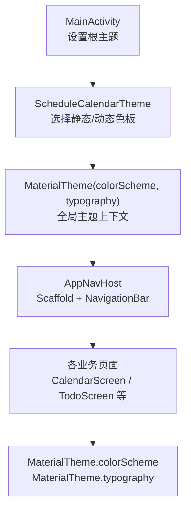
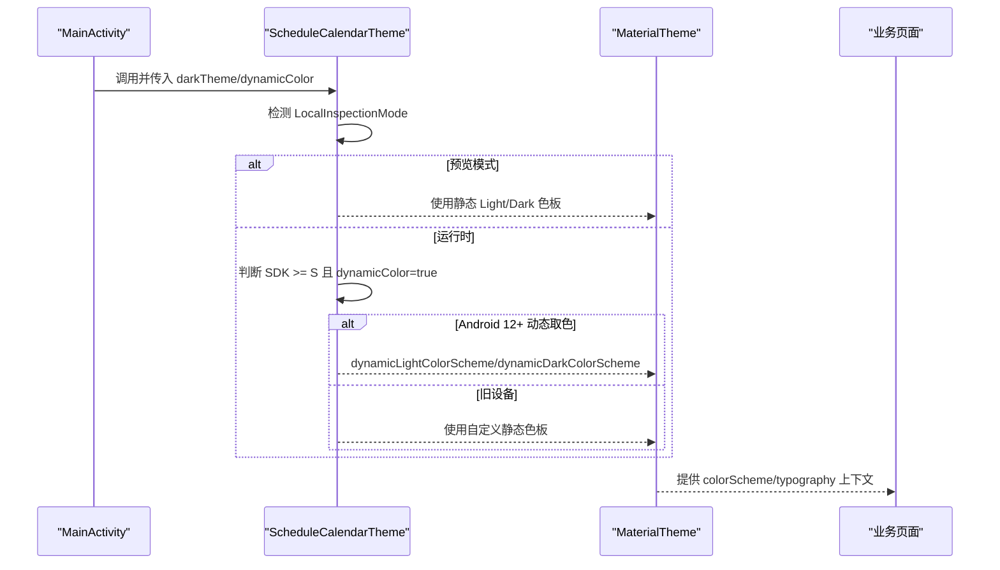
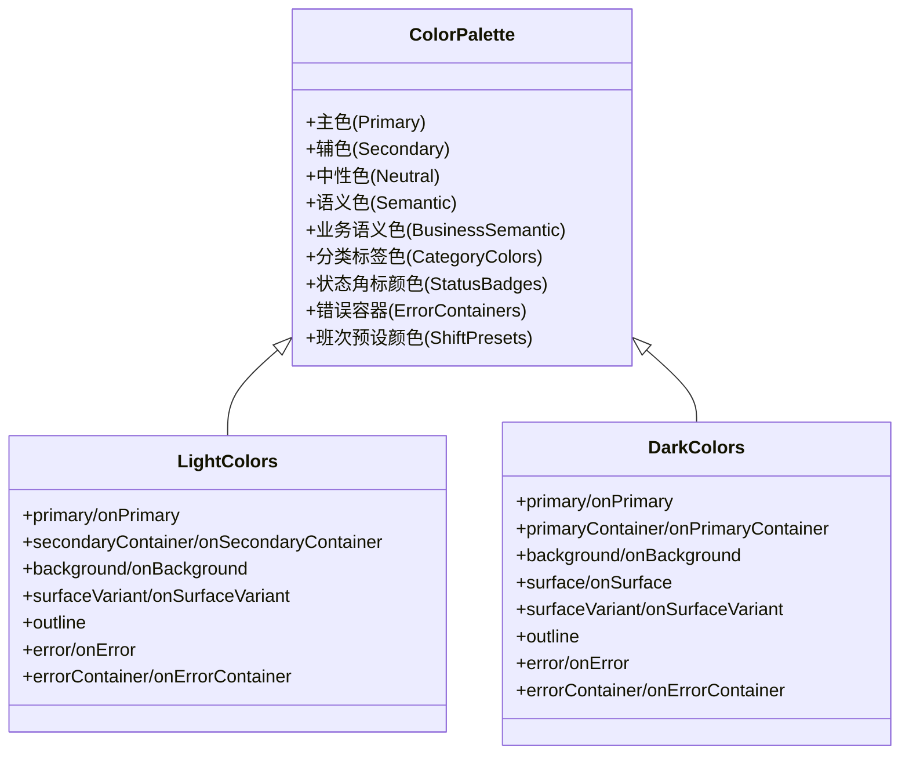
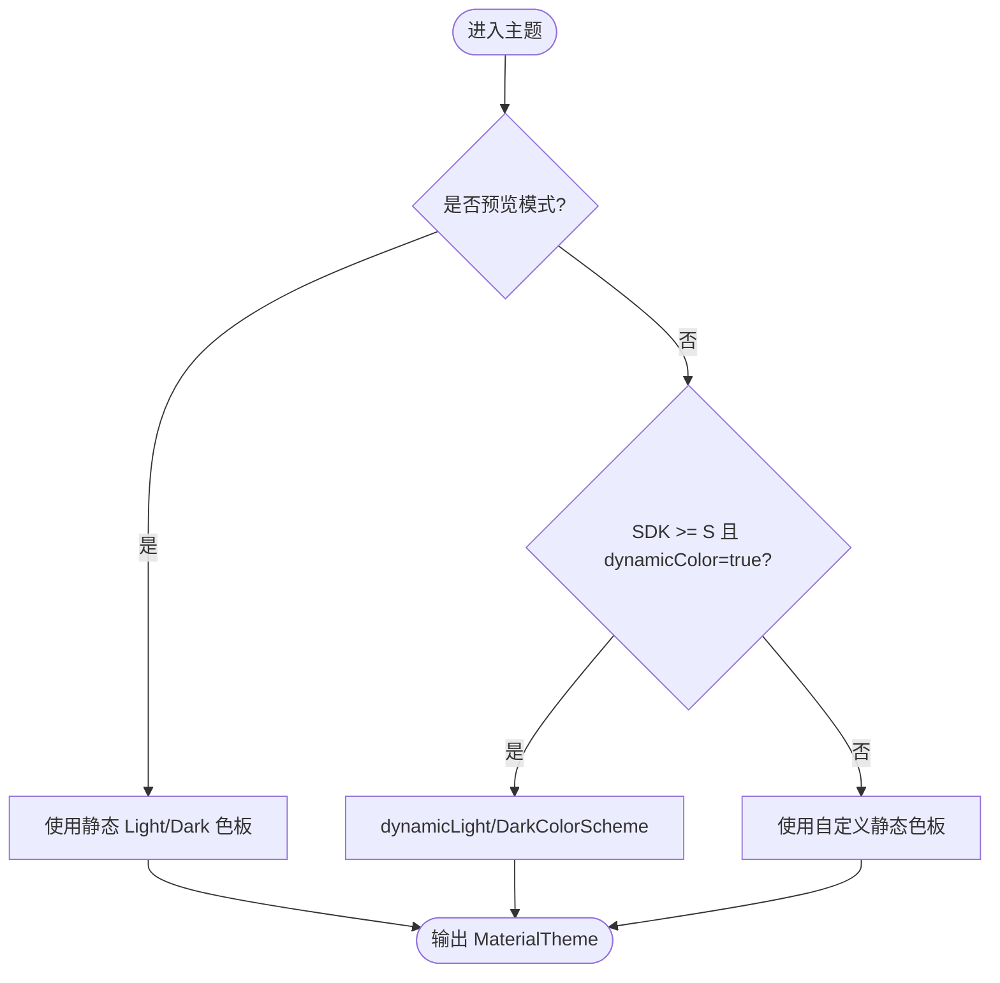
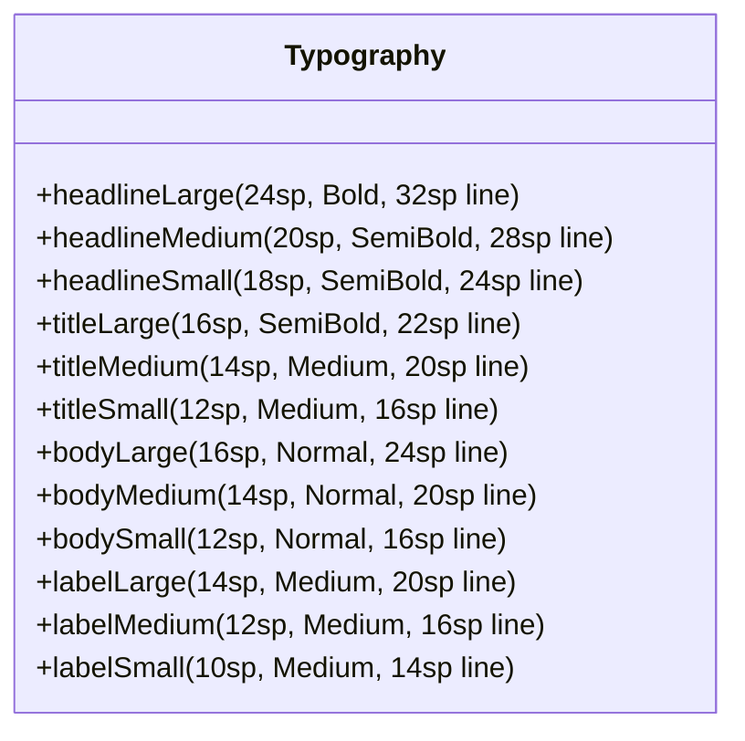
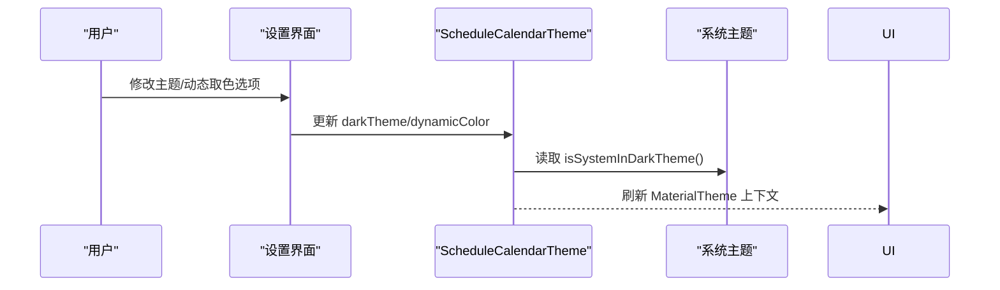
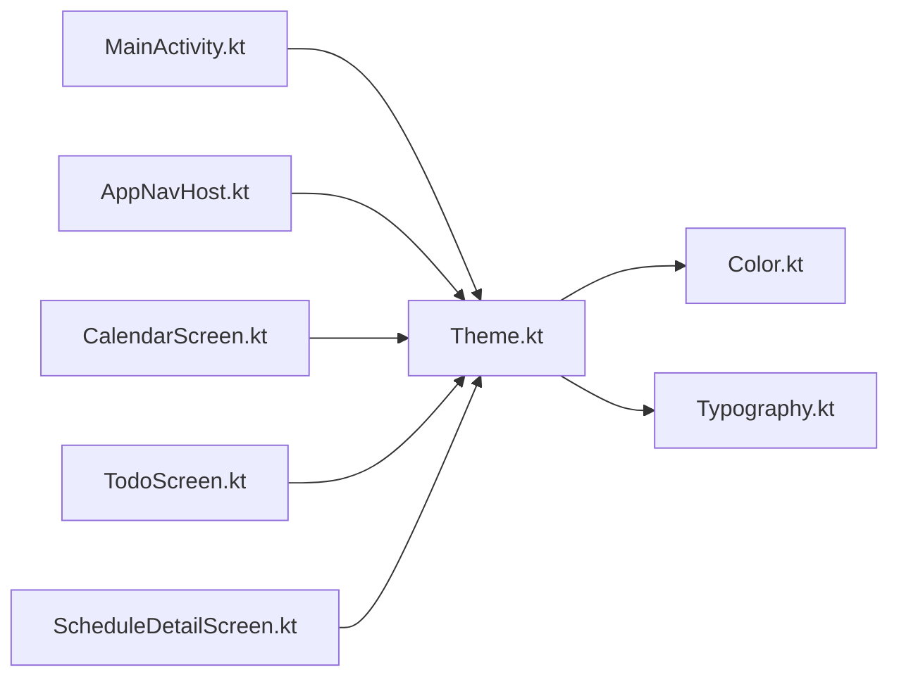

# 主题系统

<cite>
**本文引用的文件**
- [Color.kt](file://app/src/main/java/com/schedulecalendar/app/ui/theme/Color.kt)
- [Theme.kt](file://app/src/main/java/com/schedulecalendar/app/ui/theme/Theme.kt)
- [Typography.kt](file://app/src/main/java/com/schedulecalendar/app/ui/theme/Typography.kt)
- [themes.xml](file://app/src/main/res/values/themes.xml)
- [MainActivity.kt](file://app/src/main/java/com/schedulecalendar/app/MainActivity.kt)
- [AppNavHost.kt](file://app/src/main/java/com/schedulecalendar/app/ui/navigation/AppNavHost.kt)
- [CalendarScreen.kt](file://app/src/main/java/com/schedulecalendar/app/ui/calendar/CalendarScreen.kt)
- [TodoScreen.kt](file://app/src/main/java/com/schedulecalendar/app/ui/todo/TodoScreen.kt)
- [ScheduleDetailScreen.kt](file://app/src/main/java/com/schedulecalendar/app/ui/detail/ScheduleDetailScreen.kt)
</cite>

## 更新摘要
**所做更改**
- 更新了颜色体系部分，新增了业务语义色和状态角标颜色
- 增强了错误容器颜色的支持，包括浅色和深色模式
- 完善了字体排版系统的描述，强调从硬编码到MaterialTheme.typography的迁移
- 更新了具体使用示例，展示新语义颜色的实际应用

## 目录
1. [简介](#简介)
2. [项目结构](#项目结构)
3. [核心组件](#核心组件)
4. [架构总览](#架构总览)
5. [详细组件分析](#详细组件分析)
6. [依赖关系分析](#依赖关系分析)
7. [性能考量](#性能考量)
8. [故障排查指南](#故障排查指南)
9. [结论](#结论)
10. [附录](#附录)

## 简介
本文件系统化梳理应用中的 Material Design 3（MD3）主题实现，覆盖颜色体系、动态取色（Material You）、字体排版、主题切换与系统适配、自定义扩展、预览支持以及性能优化与最佳实践。目标是帮助开发者快速理解并高效维护主题系统，同时为后续扩展提供清晰路径。

## 项目结构
主题相关代码集中在 ui/theme 包中，包含颜色定义、主题封装与字体排版；Activity 层通过 Compose 的 MaterialTheme 注入主题上下文；导航与页面广泛使用 MaterialTheme.colorScheme 和 MaterialTheme.typography 进行样式消费。

图表来源
- [MainActivity.kt:55-64](file://app/src/main/java/com/schedulecalendar/app/MainActivity.kt#L55-L64)
- [Theme.kt:49-75](file://app/src/main/java/com/schedulecalendar/app/ui/theme/Theme.kt#L49-L75)
- [AppNavHost.kt:62-90](file://app/src/main/java/com/schedulecalendar/app/ui/navigation/AppNavHost.kt#L62-L90)

章节来源
- [MainActivity.kt:55-64](file://app/src/main/java/com/schedulecalendar/app/MainActivity.kt#L55-L64)
- [Theme.kt:49-75](file://app/src/main/java/com/schedulecalendar/app/ui/theme/Theme.kt#L49-L75)
- [AppNavHost.kt:62-90](file://app/src/main/java/com/schedulecalendar/app/ui/navigation/AppNavHost.kt#L62-L90)

## 核心组件
- 颜色体系：定义主色、辅色、中性色、语义色及预设色板，供浅色/深色色板组合使用。
- 主题封装：提供 ScheduleCalendarTheme，统一处理预览模式、系统暗色判断、Android 12+ 动态取色与旧设备回退。
- 字体排版：集中定义标题、正文、标签等字号层级与字重规范。
- Activity 桥接：在 MainActivity 中启用边缘到边绘制并包裹主题，使所有子树共享同一主题上下文。

章节来源
- [Color.kt:1-54](file://app/src/main/java/com/schedulecalendar/app/ui/theme/Color.kt#L1-L54)
- [Theme.kt:12-80](file://app/src/main/java/com/schedulecalendar/app/ui/theme/Theme.kt#L12-L80)
- [Typography.kt:9-22](file://app/src/main/java/com/schedulecalendar/app/ui/theme/Typography.kt#L9-L22)
- [MainActivity.kt:41-65](file://app/src/main/java/com/schedulecalendar/app/MainActivity.kt#L41-L65)

## 架构总览
主题从 Activity 注入，向下传递至所有 Composable。主题内部根据运行环境与配置决定采用动态色板或静态色板，并在预览模式下避免崩溃。

图表来源
- [Theme.kt:49-75](file://app/src/main/java/com/schedulecalendar/app/ui/theme/Theme.kt#L49-L75)
- [MainActivity.kt:55-64](file://app/src/main/java/com/schedulecalendar/app/MainActivity.kt#L55-L64)

## 详细组件分析

### 颜色体系设计
**更新** 新增了完整的业务语义色体系和标准化的状态角标颜色

- **主色调与辅色**：以绿色系为主，蓝色为辅，确保品牌一致性与高对比度。
- **中性色**：灰阶用于背景、表面、边框与次要文本，保证层次清晰。
- **语义色**：错误、警告、成功等状态色，提升可访问性。
- **业务语义色**：新增 AllowanceGreen（补贴/确认绿色）、DeductionRed（扣款红色），用于财务相关的视觉表达。
- **分类标签色**：CategoryGreen（节气分类）、CategoryOrange（传统分类）、CategoryBlue（国际分类），提供清晰的分类标识。
- **状态角标颜色**：EarlyLeaveOrange（早退角标）、RemarkCyan（备注角标），标准化状态指示。
- **错误容器颜色**：为浅色和深色模式分别定义了 errorContainer 和 onErrorContainer，提供更好的错误提示体验。
- **班次预设颜色**：18色高区分度配色方案，分为两行九列，确保视觉辨识度。

图表来源
- [Color.kt:6-54](file://app/src/main/java/com/schedulecalendar/app/ui/theme/Color.kt#L6-L54)
- [Theme.kt:12-51](file://app/src/main/java/com/schedulecalendar/app/ui/theme/Theme.kt#L12-L51)

章节来源
- [Color.kt:6-54](file://app/src/main/java/com/schedulecalendar/app/ui/theme/Color.kt#L6-L54)
- [Theme.kt:12-51](file://app/src/main/java/com/schedulecalendar/app/ui/theme/Theme.kt#L12-L51)

### 动态取色机制（Material You）
- 条件启用：当系统版本达到 Android 12（API 31）且 dynamicColor 为 true 时，使用 dynamicLightColorScheme/dynamicDarkColorScheme 从系统壁纸提取主题色。
- 回退策略：不满足条件时使用自定义静态色板，保证一致性体验。
- 预览兼容：在预览模式下直接返回静态色板，避免无 Activity Context 导致的崩溃。

图表来源
- [Theme.kt:55-73](file://app/src/main/java/com/schedulecalendar/app/ui/theme/Theme.kt#L55-L73)

章节来源
- [Theme.kt:55-73](file://app/src/main/java/com/schedulecalendar/app/ui/theme/Theme.kt#L55-L73)

### 字体排版系统
**更新** 强调了从硬编码字号到 MaterialTheme.typography 系统的全面迁移

- **层级划分**：headlineLarge/Medium/Small、titleLarge/Medium/Small、bodyLarge/Medium/Small、labelLarge/Medium/Small 等，覆盖标题、正文与标签场景。
- **字号与行高**：按 MD3 建议设定字号与行高比例，确保可读性与视觉节奏。
- **字重规范**：Bold/SemiBold/Medium/Normal 对应不同信息层级，增强层次表达。
- **迁移策略**：业务页面已逐步将硬编码的 fontSize 替换为 MaterialTheme.typography 对应的样式，确保主题一致性。

图表来源
- [Typography.kt:9-22](file://app/src/main/java/com/schedulecalendar/app/ui/theme/Typography.kt#L9-L22)

章节来源
- [Typography.kt:9-22](file://app/src/main/java/com/schedulecalendar/app/ui/theme/Typography.kt#L9-L22)

### 主题切换机制与系统主题适配
- 默认行为：ScheduleCalendarTheme 默认读取系统暗色状态 isSystemInDarkTheme()，自动跟随系统主题。
- 手动控制：可通过参数 darkTheme 强制指定明/暗主题，适用于"设置"页的主题开关。
- 动态开关：dynamicColor 参数允许在运行时开启/关闭动态取色，结合持久化存储可实现用户偏好记忆。

图表来源
- [Theme.kt:50-53](file://app/src/main/java/com/schedulecalendar/app/ui/theme/Theme.kt#L50-L53)

章节来源
- [Theme.kt:50-53](file://app/src/main/java/com/schedulecalendar/app/ui/theme/Theme.kt#L50-L53)

### 自定义主题的扩展方法
- 新增色板：在 Color.kt 中补充新的语义色或业务色，并在 LightColors/DarkColors 中映射到 colorScheme 字段。
- 扩展 Typography：在 Typography.kt 中增加新的 TextStyle 或调整现有层级。
- 主题入口：如需全局定制，可在 ScheduleCalendarTheme 中引入新的参数或逻辑分支。
- 局部覆盖：在特定 Composable 中使用 MaterialTheme 的 colors/typography 覆盖，但应谨慎使用以避免不一致。

章节来源
- [Color.kt:6-54](file://app/src/main/java/com/schedulecalendar/app/ui/theme/Color.kt#L6-L54)
- [Theme.kt:12-51](file://app/src/main/java/com/schedulecalendar/app/ui/theme/Theme.kt#L12-L51)
- [Typography.kt:9-22](file://app/src/main/java/com/schedulecalendar/app/ui/theme/Typography.kt#L9-L22)

### 主题预览支持
- 预览隔离：在预览模式下直接使用静态色板，避免动态取色所需的系统资源与 Context。
- 预览示例：部分页面使用 ScheduleCalendarTheme 包裹预览内容，确保在 Compose Preview 中正确显示。

章节来源
- [Theme.kt:55-61](file://app/src/main/java/com/schedulecalendar/app/ui/theme/Theme.kt#L55-L61)
- [CalendarScreen.kt:1609-1718](file://app/src/main/java/com/schedulecalendar/app/ui/calendar/CalendarScreen.kt#L1609-L1718)

### 主题消费与一致性
**更新** 展示了新语义颜色在具体业务场景中的应用

- **导航栏与底部栏**：AppNavHost 使用 Scaffold 与 NavigationBar，其容器与选中态颜色来自 MaterialTheme.colorScheme。
- **业务页面**：CalendarScreen 与 TodoScreen 广泛使用 colorScheme 与 typography，保持整体风格一致。
- **语义颜色应用**：
  - CalendarScreen 使用 EarlyLeaveOrange 和 RemarkCyan 显示状态角标
  - ScheduleDetailScreen 使用 AllowanceGreen 和 DeductionRed 区分补贴和扣款
  - TodoScreen 使用 CategoryGreen/Orange/Blue 标识不同类型的纪念日
- **错误容器使用**：在需要错误提示的场景使用 MaterialTheme.colorScheme.errorContainer 和 onErrorContainer

章节来源
- [AppNavHost.kt:62-90](file://app/src/main/java/com/schedulecalendar/app/ui/navigation/AppNavHost.kt#L62-L90)
- [CalendarScreen.kt:246-260](file://app/src/main/java/com/schedulecalendar/app/ui/calendar/CalendarScreen.kt#L246-L260)
- [CalendarScreen.kt:752-756](file://app/src/main/java/com/schedulecalendar/app/ui/calendar/CalendarScreen.kt#L752-L756)
- [ScheduleDetailScreen.kt:551-560](file://app/src/main/java/com/schedulecalendar/app/ui/detail/ScheduleDetailScreen.kt#L551-L560)
- [TodoScreen.kt:1617-1621](file://app/src/main/java/com/schedulecalendar/app/ui/todo/TodoScreen.kt#L1617-L1621)

## 依赖关系分析
- 主题与 UI 解耦：主题定义独立于业务页面，页面仅消费 MaterialTheme 提供的色板与排版。
- 系统能力依赖：动态取色依赖 Android 12+ 的系统 API，旧设备回退到静态色板。
- 预览环境依赖：LocalInspectionMode 用于识别预览环境，避免崩溃。

图表来源
- [Theme.kt:12-80](file://app/src/main/java/com/schedulecalendar/app/ui/theme/Theme.kt#L12-L80)
- [Color.kt:6-54](file://app/src/main/java/com/schedulecalendar/app/ui/theme/Color.kt#L6-L54)
- [Typography.kt:9-22](file://app/src/main/java/com/schedulecalendar/app/ui/theme/Typography.kt#L9-L22)
- [MainActivity.kt:55-64](file://app/src/main/java/com/schedulecalendar/app/MainActivity.kt#L55-L64)
- [AppNavHost.kt:62-90](file://app/src/main/java/com/schedulecalendar/app/ui/navigation/AppNavHost.kt#L62-L90)
- [CalendarScreen.kt:246-260](file://app/src/main/java/com/schedulecalendar/app/ui/calendar/CalendarScreen.kt#L246-L260)
- [TodoScreen.kt:1302-1360](file://app/src/main/java/com/schedulecalendar/app/ui/todo/TodoScreen.kt#L1302-L1360)
- [ScheduleDetailScreen.kt:551-560](file://app/src/main/java/com/schedulecalendar/app/ui/detail/ScheduleDetailScreen.kt#L551-L560)

章节来源
- [Theme.kt:12-80](file://app/src/main/java/com/schedulecalendar/app/ui/theme/Theme.kt#L12-L80)
- [Color.kt:6-54](file://app/src/main/java/com/schedulecalendar/app/ui/theme/Color.kt#L6-L54)
- [Typography.kt:9-22](file://app/src/main/java/com/schedulecalendar/app/ui/theme/Typography.kt#L9-L22)
- [MainActivity.kt:55-64](file://app/src/main/java/com/schedulecalendar/app/MainActivity.kt#L55-L64)
- [AppNavHost.kt:62-90](file://app/src/main/java/com/schedulecalendar/app/ui/navigation/AppNavHost.kt#L62-L90)
- [CalendarScreen.kt:246-260](file://app/src/main/java/com/schedulecalendar/app/ui/calendar/CalendarScreen.kt#L246-L260)
- [TodoScreen.kt:1302-1360](file://app/src/main/java/com/schedulecalendar/app/ui/todo/TodoScreen.kt#L1302-L1360)
- [ScheduleDetailScreen.kt:551-560](file://app/src/main/java/com/schedulecalendar/app/ui/detail/ScheduleDetailScreen.kt#L551-L560)

## 性能考量
- 动态取色开销：dynamicColorScheme 会解析系统壁纸生成色板，建议在首次启动或用户明确切换时计算，避免频繁重建。
- 预览模式优化：预览下跳过动态取色，减少不必要的系统调用。
- 主题变更频率：将主题状态提升到顶层（如 MainActivity），避免在深层 Composable 中重复订阅导致重组风暴。
- 颜色与排版复用：尽量使用 MaterialTheme.colorScheme/typography，减少硬编码颜色与字号，降低维护成本与渲染差异。

[本节为通用指导，无需具体文件引用]

## 故障排查指南
- 预览崩溃：若在 Compose Preview 中出现动态取色相关异常，确认是否在预览模式下使用了 dynamicColorScheme。当前实现已在预览模式回退到静态色板，若仍崩溃，检查是否存在未受控的动态取色调用。
- 主题不生效：确认 MainActivity 已包裹 ScheduleCalendarTheme，且 Surface 的背景色使用 MaterialTheme.colorScheme.background。
- 动态取色无效：检查 dynamicColor 参数与系统版本，仅在 Android 12+ 且 dynamicColor=true 时生效。
- 系统栏透明问题：确保 Activity 主题设置透明状态栏/导航栏，并与 enableEdgeToEdge() 配合使用。
- 语义颜色显示异常：检查是否正确导入了新的语义颜色常量，并确保在正确的业务场景中使用。

章节来源
- [Theme.kt:55-73](file://app/src/main/java/com/schedulecalendar/app/ui/theme/Theme.kt#L55-L73)
- [MainActivity.kt:41-65](file://app/src/main/java/com/schedulecalendar/app/MainActivity.kt#L41-L65)
- [themes.xml:8-12](file://app/src/main/res/values/themes.xml#L8-L12)

## 结论
该主题系统基于 Material Design 3，实现了完整的颜色体系、动态取色与字体排版，并通过统一的 ScheduleCalendarTheme 在应用内传播。系统在预览模式与旧设备上提供了稳健的回退策略，保证了跨版本的一致性体验。新增的业务语义色和标准化的状态角标颜色进一步提升了用户体验和可维护性。遵循本文的最佳实践与扩展指引，可进一步提升主题的可维护性与性能表现。

[本节为总结，无需具体文件引用]

## 附录
- 主题入口位置：MainActivity 的 setContent 中调用 ScheduleCalendarTheme。
- 导航与底部栏：AppNavHost 使用 Scaffold 与 NavigationBar，颜色来源于 MaterialTheme.colorScheme。
- 业务页面示例：CalendarScreen 与 TodoScreen 展示了如何消费主题色板与排版。
- 新语义颜色使用示例：
  - CalendarScreen 中的状态角标：EarlyLeaveOrange、RemarkCyan
  - ScheduleDetailScreen 中的财务标识：AllowanceGreen、DeductionRed
  - TodoScreen 中的分类标签：CategoryGreen、CategoryOrange、CategoryBlue

章节来源
- [MainActivity.kt:55-64](file://app/src/main/java/com/schedulecalendar/app/MainActivity.kt#L55-L64)
- [AppNavHost.kt:62-90](file://app/src/main/java/com/schedulecalendar/app/ui/navigation/AppNavHost.kt#L62-L90)
- [CalendarScreen.kt:246-260](file://app/src/main/java/com/schedulecalendar/app/ui/calendar/CalendarScreen.kt#L246-L260)
- [CalendarScreen.kt:752-756](file://app/src/main/java/com/schedulecalendar/app/ui/calendar/CalendarScreen.kt#L752-L756)
- [ScheduleDetailScreen.kt:551-560](file://app/src/main/java/com/schedulecalendar/app/ui/detail/ScheduleDetailScreen.kt#L551-L560)
- [TodoScreen.kt:1617-1621](file://app/src/main/java/com/schedulecalendar/app/ui/todo/TodoScreen.kt#L1617-L1621)