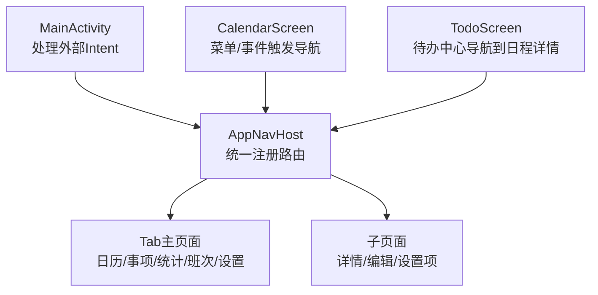
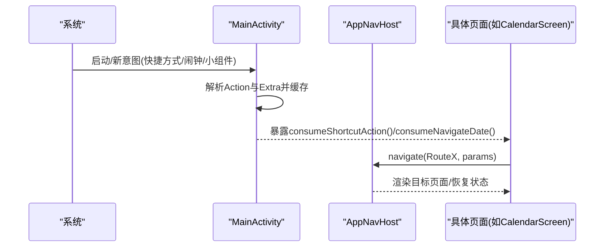
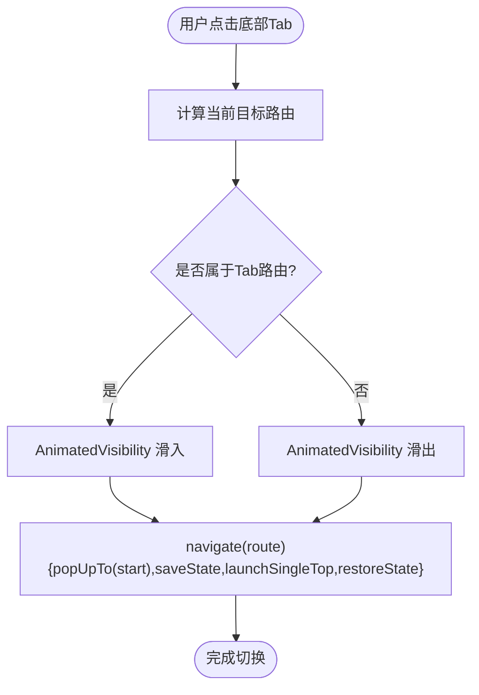
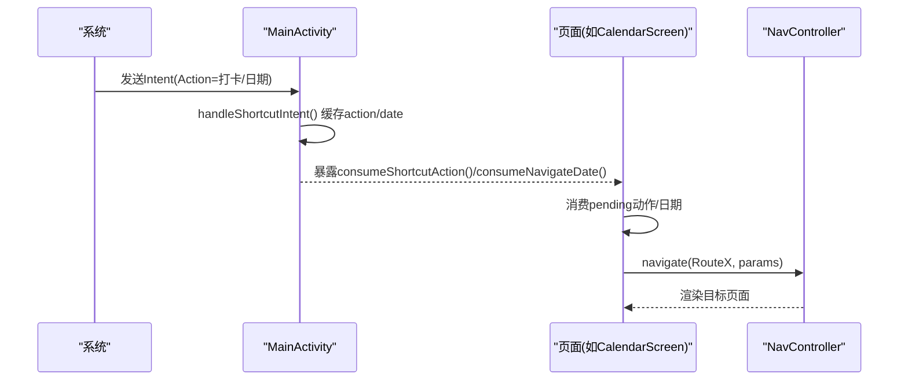
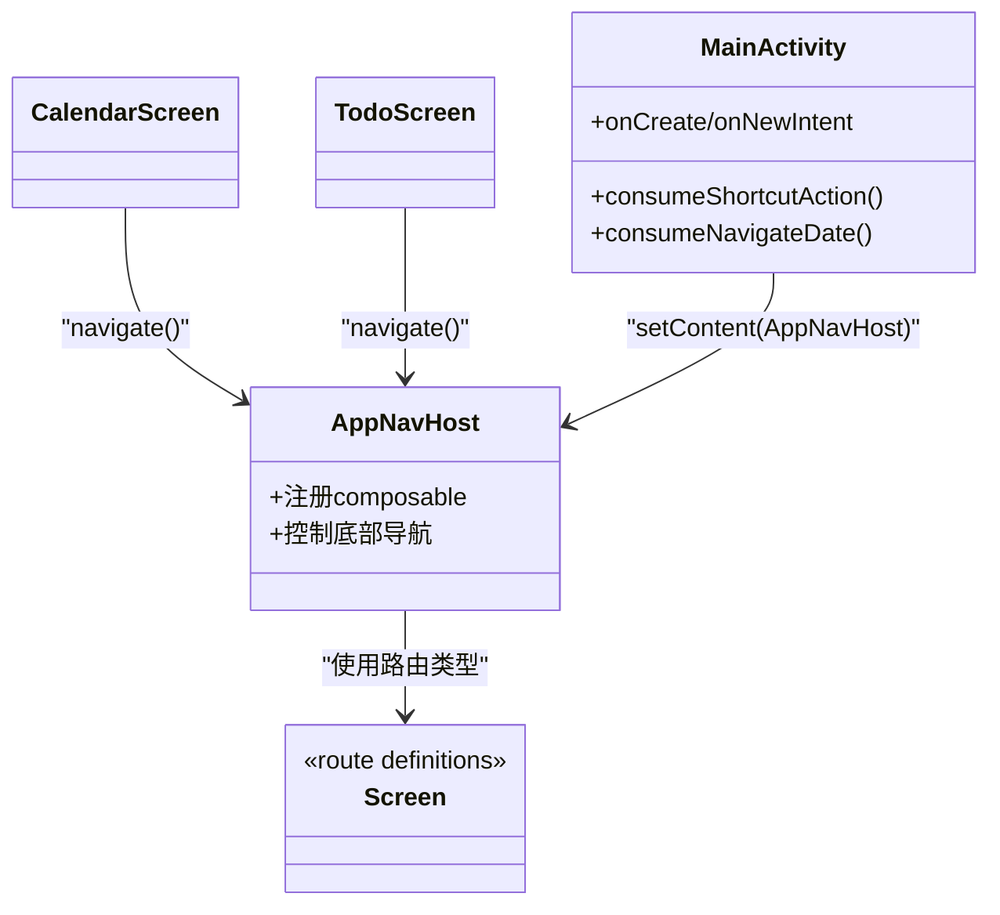

# 导航设计

<cite>
**本文引用的文件**
- [AppNavHost.kt](file://app/src/main/java/com/schedulecalendar/app/ui/navigation/AppNavHost.kt)
- [Screen.kt](file://app/src/main/java/com/schedulecalendar/app/ui/navigation/Screen.kt)
- [MainActivity.kt](file://app/src/main/java/com/schedulecalendar/app/MainActivity.kt)
- [AndroidManifest.xml](file://app/src/main/AndroidManifest.xml)
- [CalendarScreen.kt](file://app/src/main/java/com/schedulecalendar/app/ui/calendar/CalendarScreen.kt)
- [TodoScreen.kt](file://app/src/main/java/com/schedulecalendar/app/ui/todo/TodoScreen.kt)
</cite>

## 目录
1. [简介](#简介)
2. [项目结构](#项目结构)
3. [核心组件](#核心组件)
4. [架构总览](#架构总览)
5. [详细组件分析](#详细组件分析)
6. [依赖关系分析](#依赖关系分析)
7. [性能考虑](#性能考虑)
8. [故障排查指南](#故障排查指南)
9. [结论](#结论)
10. [附录](#附录)

## 简介
本文件围绕基于 Navigation Compose 的页面路由管理，系统化梳理该项目的导航设计与实现。内容覆盖：
- 路由配置与类型安全
- 页面跳转逻辑与参数传递
- 嵌套导航结构与返回栈控制
- 深链接与外部入口支持
- 导航状态管理与动画过渡
- 导航测试策略、性能优化与用户体验建议

## 项目结构
导航相关代码集中在 ui/navigation 包中，采用“类型安全路由 + NavHost 集中注册”的模式；应用入口 MainActivity 负责处理外部 Intent（快捷方式、小组件点击等），并将动作交由 UI 层消费。

图表来源
- [AppNavHost.kt:54-132](file://app/src/main/java/com/schedulecalendar/app/ui/navigation/AppNavHost.kt#L54-L132)
- [MainActivity.kt:41-104](file://app/src/main/java/com/schedulecalendar/app/MainActivity.kt#L41-L104)
- [CalendarScreen.kt:208-231](file://app/src/main/java/com/schedulecalendar/app/ui/calendar/CalendarScreen.kt#L208-L231)
- [TodoScreen.kt:91-100](file://app/src/main/java/com/schedulecalendar/app/ui/todo/TodoScreen.kt#L91-L100)

章节来源
- [AppNavHost.kt:54-132](file://app/src/main/java/com/schedulecalendar/app/ui/navigation/AppNavHost.kt#L54-L132)
- [MainActivity.kt:41-104](file://app/src/main/java/com/schedulecalendar/app/MainActivity.kt#L41-L104)

## 核心组件
- 类型安全路由定义：使用可序列化的对象/数据类表示路由，零字符串拼接，编译期校验。
- 路由注册中心：在 AppNavHost 中集中声明所有 composable，并绑定对应页面。
- 底部导航栏：根据当前目标路由动态显示/隐藏，并维护 Tab 状态。
- 外部入口桥接：MainActivity 解析 Intent，将动作或日期暂存，供 UI 层消费后执行导航。

章节来源
- [Screen.kt:6-33](file://app/src/main/java/com/schedulecalendar/app/ui/navigation/Screen.kt#L6-L33)
- [AppNavHost.kt:42-132](file://app/src/main/java/com/schedulecalendar/app/ui/navigation/AppNavHost.kt#L42-L132)
- [MainActivity.kt:27-104](file://app/src/main/java/com/schedulecalendar/app/MainActivity.kt#L27-L104)

## 架构总览
整体采用单 Activity + Jetpack Compose + Navigation Compose 的架构。Activity 仅负责生命周期与外部入口解析，UI 层通过 AppNavHost 统一管理路由与页面渲染。

图表来源
- [MainActivity.kt:41-104](file://app/src/main/java/com/schedulecalendar/app/MainActivity.kt#L41-L104)
- [AppNavHost.kt:54-132](file://app/src/main/java/com/schedulecalendar/app/ui/navigation/AppNavHost.kt#L54-L132)
- [CalendarScreen.kt:208-231](file://app/src/main/java/com/schedulecalendar/app/ui/calendar/CalendarScreen.kt#L208-L231)

## 详细组件分析

### 类型安全路由定义
- 无参路由使用 object，有参路由使用 data class，全部标注为可序列化，便于 SavedStateHandle 自动反序列化。
- 示例：日程详情 RouteScheduleDetail(date)、小时详情 RouteHoursDetail(year, month, type)、编辑日历事件 RouteEditCalendarEvent(eventId) 等。

章节来源
- [Screen.kt:6-33](file://app/src/main/java/com/schedulecalendar/app/ui/navigation/Screen.kt#L6-L33)

### 路由注册与页面映射
- 在 AppNavHost 中通过 composable<RouteX> 集中注册所有页面，包括 Tab 主页面与子页面。
- 带参页面在回调中通过 backStackEntry.toRoute<RouteX>() 读取参数，保证类型安全。

章节来源
- [AppNavHost.kt:91-130](file://app/src/main/java/com/schedulecalendar/app/ui/navigation/AppNavHost.kt#L91-L130)

### 页面跳转与参数传递
- 从业务页面发起跳转时，直接调用 navController.navigate(RouteX(params))。
- 典型场景：
  - 日历页下拉菜单跳转到“显示方案”页面。
  - 待办中心监听 ViewModel 事件，导航到“日程详情”。
  - 编辑日历事件时携带 eventId 进入编辑页。

章节来源
- [CalendarScreen.kt:208-231](file://app/src/main/java/com/schedulecalendar/app/ui/calendar/CalendarScreen.kt#L208-L231)
- [TodoScreen.kt:91-100](file://app/src/main/java/com/schedulecalendar/app/ui/todo/TodoScreen.kt#L91-L100)
- [AppNavHost.kt:120-128](file://app/src/main/java/com/schedulecalendar/app/ui/navigation/AppNavHost.kt#L120-L128)

### 嵌套导航与返回栈控制
- 底部导航栏点击 Tab 时，使用 popUpTo(startDestination) + saveState(true)，配合 launchSingleTop(true) 与 restoreState(true)，确保：
  - 每次切换 Tab 回到起始目的地，避免重复压栈。
  - 保留各 Tab 的滚动位置与输入状态。
- 子页面通过默认返回栈行为返回上一级，无需额外处理。

章节来源
- [AppNavHost.kt:76-84](file://app/src/main/java/com/schedulecalendar/app/ui/navigation/AppNavHost.kt#L76-L84)

### 深链接与外部入口支持
- AndroidManifest 中为 MainActivity 注册了多个 action 的 intent-filter，用于接收快捷方式与闹钟提醒。
- MainActivity 在 onCreate/onNewIntent 中解析 Action 与 Extra，将“打卡动作”和“小组件日期”缓存，并提供 consumeShortcutAction()/consumeNavigateDate() 给 UI 层消费。
- 注意：当前未使用 Navigation Compose 的 deepLink 配置，而是通过 Activity 层 Intent 驱动 UI 层导航。

章节来源
- [AndroidManifest.xml:36-45](file://app/src/main/AndroidManifest.xml#L36-L45)
- [MainActivity.kt:41-104](file://app/src/main/java/com/schedulecalendar/app/MainActivity.kt#L41-L104)

### 导航状态与可见性控制
- 通过 currentBackStackEntryAsState() 获取当前目标，判断是否属于 Tab 路由集合，从而决定是否显示底部导航栏。
- 使用 AnimatedVisibility 对底部导航栏进行滑入/滑出动画，提升视觉连贯性。

章节来源
- [AppNavHost.kt:56-68](file://app/src/main/java/com/schedulecalendar/app/ui/navigation/AppNavHost.kt#L56-L68)

### 动画过渡效果
- 底部导航栏显隐：垂直滑入/滑出。
- 日历月份切换：水平滑动 + 淡入淡出组合动画，提升翻页体验。

章节来源
- [AppNavHost.kt:64-68](file://app/src/main/java/com/schedulecalendar/app/ui/navigation/AppNavHost.kt#L64-L68)
- [CalendarScreen.kt:329-347](file://app/src/main/java/com/schedulecalendar/app/ui/calendar/CalendarScreen.kt#L329-L347)

### 关键流程图：底部导航切换

图表来源
- [AppNavHost.kt:62-84](file://app/src/main/java/com/schedulecalendar/app/ui/navigation/AppNavHost.kt#L62-L84)

### 关键时序图：外部入口到页面导航

图表来源
- [MainActivity.kt:72-104](file://app/src/main/java/com/schedulecalendar/app/MainActivity.kt#L72-L104)
- [CalendarScreen.kt:208-231](file://app/src/main/java/com/schedulecalendar/app/ui/calendar/CalendarScreen.kt#L208-L231)

## 依赖关系分析
- Screen.kt 提供类型安全路由定义，被 AppNavHost 与各个页面引用。
- AppNavHost 作为导航中枢，依赖所有页面组件与 Navigation Compose API。
- MainActivity 与 AndroidManifest 共同构成外部入口桥接层，不直接依赖具体页面，仅暴露消费接口。

图表来源
- [Screen.kt:6-33](file://app/src/main/java/com/schedulecalendar/app/ui/navigation/Screen.kt#L6-L33)
- [AppNavHost.kt:54-132](file://app/src/main/java/com/schedulecalendar/app/ui/navigation/AppNavHost.kt#L54-L132)
- [MainActivity.kt:41-65](file://app/src/main/java/com/schedulecalendar/app/MainActivity.kt#L41-L65)
- [CalendarScreen.kt:208-231](file://app/src/main/java/com/schedulecalendar/app/ui/calendar/CalendarScreen.kt#L208-L231)
- [TodoScreen.kt:91-100](file://app/src/main/java/com/schedulecalendar/app/ui/todo/TodoScreen.kt#L91-L100)

章节来源
- [Screen.kt:6-33](file://app/src/main/java/com/schedulecalendar/app/ui/navigation/Screen.kt#L6-L33)
- [AppNavHost.kt:54-132](file://app/src/main/java/com/schedulecalendar/app/ui/navigation/AppNavHost.kt#L54-L132)
- [MainActivity.kt:41-104](file://app/src/main/java/com/schedulecalendar/app/MainActivity.kt#L41-L104)

## 性能考虑
- 使用 launchSingleTop + restoreState/saveState 减少重复创建与重建开销，保持 Tab 状态。
- 仅在需要时显示底部导航栏，避免不必要的布局与绘制。
- 日历翻页动画使用 tween 时长适中，兼顾流畅与响应。
- 建议在复杂页面中使用 remember 与 state hoisting 减少重组范围。

[本节为通用指导，不直接分析具体文件]

## 故障排查指南
- 外部入口未触发导航：检查 MainActivity 的 onNewIntent 是否被调用，确认 Intent 的 action 与 extra 是否正确解析与缓存。
- 底部导航异常显示/隐藏：核对当前目标路由是否在 Tab 路由集合中，以及 AnimatedVisibility 的 visible 条件。
- 参数丢失或类型错误：确认路由定义是否为 @Serializable，并在 composable 回调中通过 toRoute<T>() 读取。
- 重复压栈导致返回栈混乱：确认 Tab 切换是否使用了 popUpTo(startDestination) + launchSingleTop。

章节来源
- [MainActivity.kt:67-104](file://app/src/main/java/com/schedulecalendar/app/MainActivity.kt#L67-L104)
- [AppNavHost.kt:56-84](file://app/src/main/java/com/schedulecalendar/app/ui/navigation/AppNavHost.kt#L56-L84)
- [AppNavHost.kt:120-128](file://app/src/main/java/com/schedulecalendar/app/ui/navigation/AppNavHost.kt#L120-L128)

## 结论
本项目采用类型安全的 Navigation Compose 路由体系，结合 Activity 层对外部入口的统一解析，实现了清晰的导航分层与良好的用户体验。通过合理的返回栈控制与动画过渡，保证了交互的连贯性与性能表现。后续可在深链接方面进一步引入 Navigation Compose 原生 deepLink 能力，以增强外部直达页面的灵活性。

[本节为总结，不直接分析具体文件]

## 附录

### 导航测试策略建议
- 单元测试：针对路由定义与参数模型进行序列化/反序列化断言。
- 集成测试：使用 Navigation Testing 库验证 navigate/popUpTo/restoreState 的行为是否符合预期。
- UI 测试：模拟点击底部 Tab、菜单项与外部入口，断言目标页面渲染与状态恢复。

[本节为通用指导，不直接分析具体文件]

### 用户体验优化建议
- 为不同页面配置合适的转场动画，避免过度动画影响性能。
- 在长列表页面启用状态保存，提升返回时的即时性。
- 对频繁跳转的路径进行预加载与缓存，降低首帧延迟。

[本节为通用指导，不直接分析具体文件]