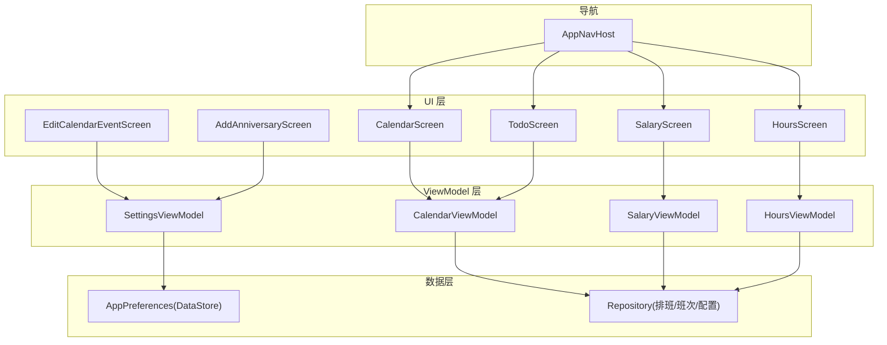
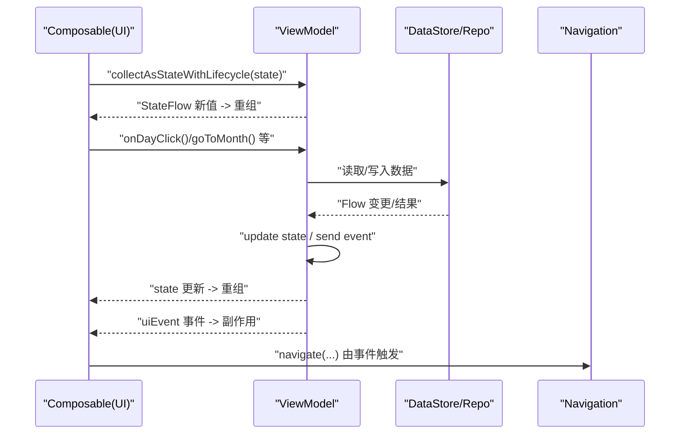
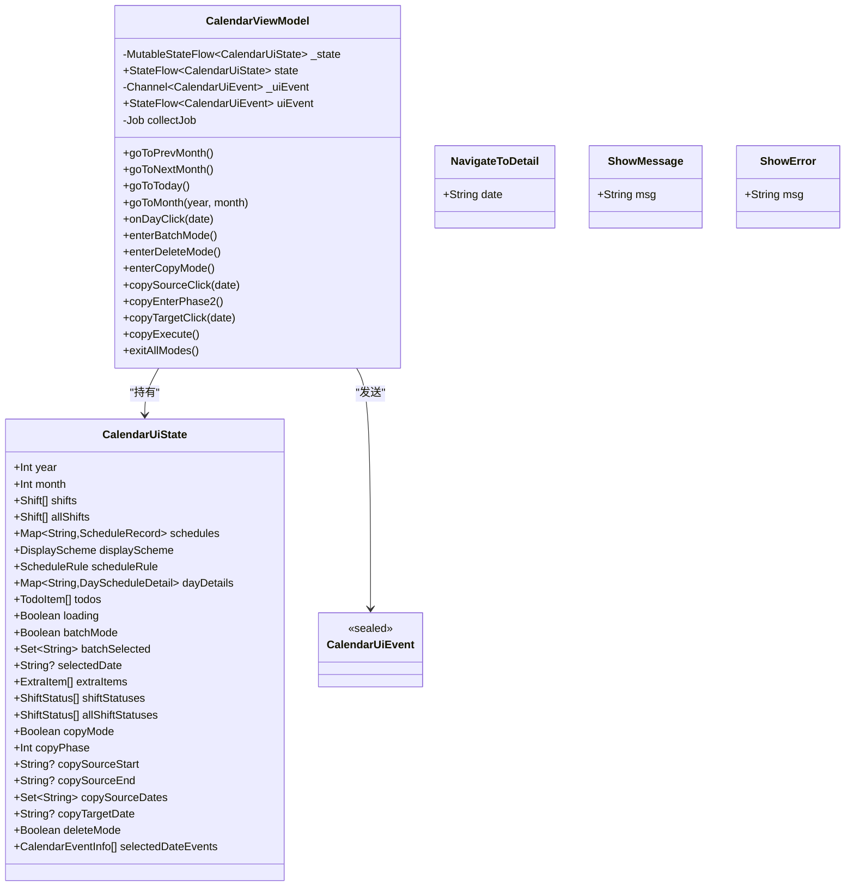
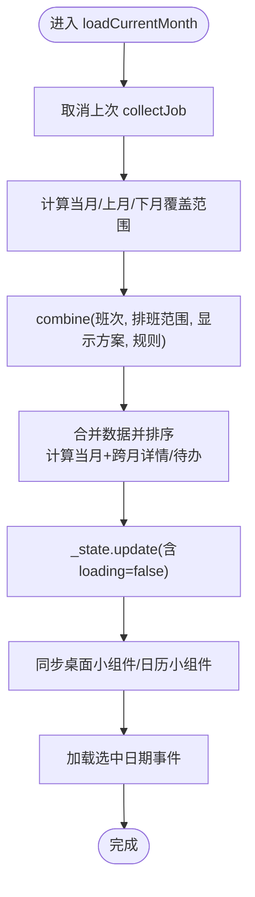
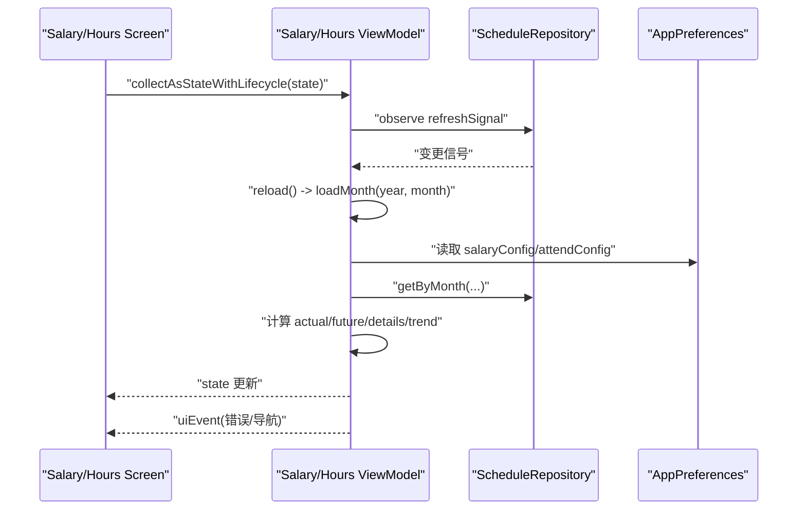
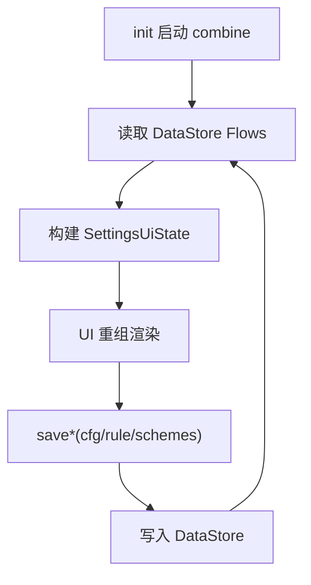
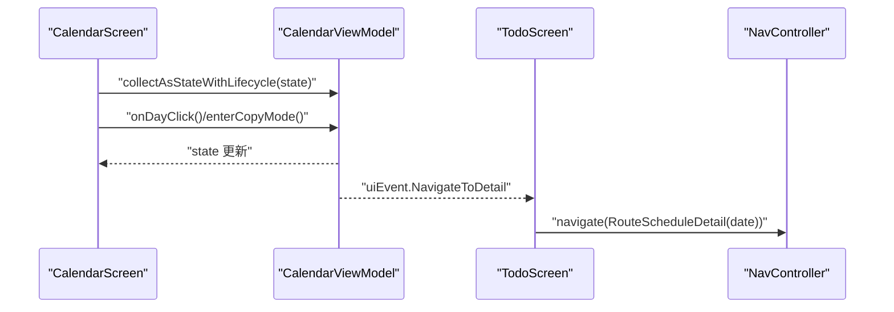
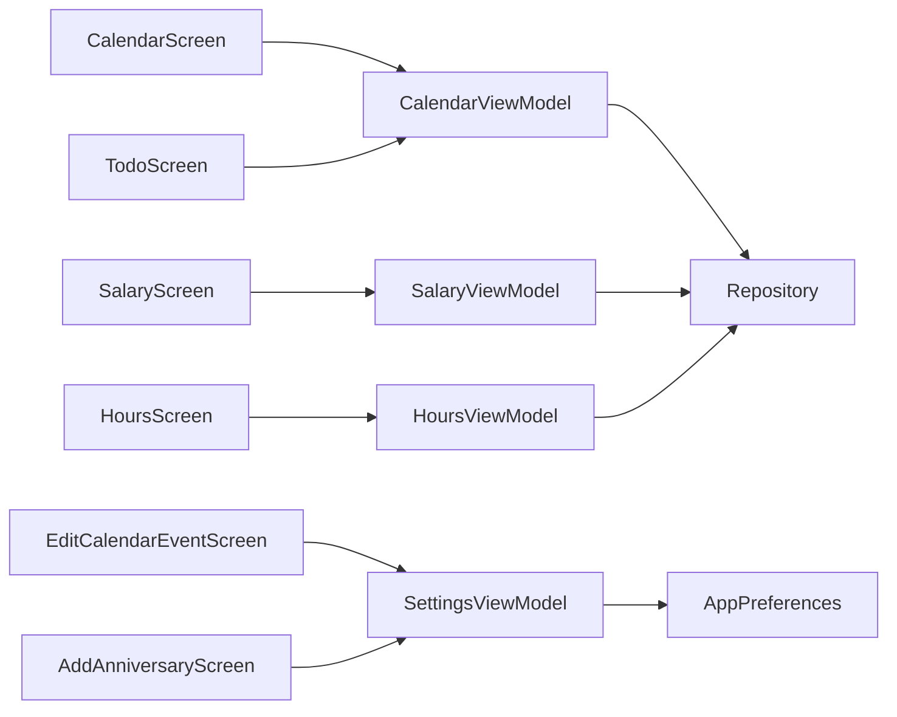

# 状态管理

<cite>
**本文引用的文件**
- [CalendarViewModel.kt](file://app/src/main/java/com/schedulecalendar/app/ui/calendar/CalendarViewModel.kt)
- [CalendarScreen.kt](file://app/src/main/java/com/schedulecalendar/app/ui/calendar/CalendarScreen.kt)
- [SalaryViewModel.kt](file://app/src/main/java/com/schedulecalendar/app/ui/salary/SalaryViewModel.kt)
- [HoursViewModel.kt](file://app/src/main/java/com/schedulecalendar/app/ui/hours/HoursViewModel.kt)
- [SettingsViewModel.kt](file://app/src/main/java/com/schedulecalendar/app/ui/settings/SettingsViewModel.kt)
- [AppNavHost.kt](file://app/src/main/java/com/schedulecalendar/app/ui/navigation/AppNavHost.kt)
- [TodoScreen.kt](file://app/src/main/java/com/schedulecalendar/app/ui/todo/TodoScreen.kt)
- [EditCalendarEventScreen.kt](file://app/src/main/java/com/schedulecalendar/app/ui/todo/EditCalendarEventScreen.kt)
- [AddAnniversaryScreen.kt](file://app/src/main/java/com/schedulecalendar/app/ui/todo/AddAnniversaryScreen.kt)
- [AppPreferences.kt](file://app/src/main/java/com/schedulecalendar/app/data/prefs/AppPreferences.kt)
</cite>

## 目录
1. [简介](#简介)
2. [项目结构](#项目结构)
3. [核心组件](#核心组件)
4. [架构总览](#架构总览)
5. [详细组件分析](#详细组件分析)
6. [依赖关系分析](#依赖关系分析)
7. [性能考量](#性能考量)
8. [故障排查指南](#故障排查指南)
9. [结论](#结论)
10. [附录](#附录)

## 简介
本文件围绕基于 Jetpack Compose 的状态管理模式，结合仓库中实际实现，系统性阐述：
- StateFlow 与 Channel 的组合使用、UI 事件与 UI 状态的职责划分
- ViewModel 与 UI 层的状态同步机制（collectAsStateWithLifecycle）
- 复杂状态组合与状态提升模式
- 跨组件通信方案（导航事件、刷新信号）
- 状态持久化策略（DataStore）、错误与加载状态处理
- 状态调试技巧、性能优化方法与常见问题解决方案

## 项目结构
本项目采用“功能域 + 分层”组织方式：
- ui 层按功能模块划分（calendar、salary、hours、settings、todo 等），每个 Screen 对应一个或多个 ViewModel
- data 层提供 Repository、Preferences、DB 等数据源
- domain 层包含计算工具与领域模型
- navigation 层集中声明路由与页面注册

图表来源
- [CalendarScreen.kt](file://app/src/main/java/com/schedulecalendar/app/ui/calendar/CalendarScreen.kt)
- [CalendarViewModel.kt](file://app/src/main/java/com/schedulecalendar/app/ui/calendar/CalendarViewModel.kt)
- [SalaryViewModel.kt](file://app/src/main/java/com/schedulecalendar/app/ui/salary/SalaryViewModel.kt)
- [HoursViewModel.kt](file://app/src/main/java/com/schedulecalendar/app/ui/hours/HoursViewModel.kt)
- [SettingsViewModel.kt](file://app/src/main/java/com/schedulecalendar/app/ui/settings/SettingsViewModel.kt)
- [AppNavHost.kt](file://app/src/main/java/com/schedulecalendar/app/ui/navigation/AppNavHost.kt)
- [AppPreferences.kt](file://app/src/main/java/com/schedulecalendar/app/data/prefs/AppPreferences.kt)

章节来源
- [CalendarScreen.kt](file://app/src/main/java/com/schedulecalendar/app/ui/calendar/CalendarScreen.kt)
- [CalendarViewModel.kt](file://app/src/main/java/com/schedulecalendar/app/ui/calendar/CalendarViewModel.kt)
- [AppNavHost.kt](file://app/src/main/java/com/schedulecalendar/app/ui/navigation/AppNavHost.kt)

## 核心组件
- CalendarViewModel：日历主视图的核心状态机，负责月份数据聚合、待办生成、批量/复制操作、Widget 同步、选中日期事件加载等。通过 MutableStateFlow 暴露 state，Channel 暴露一次性 UI 事件。
- SalaryViewModel / HoursViewModel：薪资与工时页的只读展示型 ViewModel，监听排班变更自动刷新，维护 loading/actual/future/details/trend 等状态。
- SettingsViewModel：设置页状态，直接组合 DataStore Flow 到 UI 状态，并提供保存与清空数据的命令式方法。
- AppPreferences：基于 DataStore 的配置读写，提供 Flow 与 suspend 接口，作为持久化状态源。
- TodoScreen / EditCalendarEventScreen / AddAnniversaryScreen：消费 ViewModel 状态并触发 UI 事件（如导航、Snackbar）。

章节来源
- [CalendarViewModel.kt](file://app/src/main/java/com/schedulecalendar/app/ui/calendar/CalendarViewModel.kt)
- [SalaryViewModel.kt](file://app/src/main/java/com/schedulecalendar/app/ui/salary/SalaryViewModel.kt)
- [HoursViewModel.kt](file://app/src/main/java/com/schedulecalendar/app/ui/hours/HoursViewModel.kt)
- [SettingsViewModel.kt](file://app/src/main/java/com/schedulecalendar/app/ui/settings/SettingsViewModel.kt)
- [AppPreferences.kt](file://app/src/main/java/com/schedulecalendar/app/data/prefs/AppPreferences.kt)
- [TodoScreen.kt](file://app/src/main/java/com/schedulecalendar/app/ui/todo/TodoScreen.kt)
- [EditCalendarEventScreen.kt](file://app/src/main/java/com/schedulecalendar/app/ui/todo/EditCalendarEventScreen.kt)
- [AddAnniversaryScreen.kt](file://app/src/main/java/com/schedulecalendar/app/ui/todo/AddAnniversaryScreen.kt)

## 架构总览
整体遵循“单向数据流 + 事件驱动”的模式：
- UI 层通过 collectAsStateWithLifecycle 订阅 ViewModel.state，渲染界面
- 用户交互调用 ViewModel 的方法，内部更新 state 或发送一次性事件
- 一次性事件通过 Channel 发出，UI 侧收集后执行副作用（导航、提示等）
- 数据变更通过 Repository/Preferences 的 Flow 驱动 ViewModel 重新计算并更新 state

图表来源
- [CalendarViewModel.kt](file://app/src/main/java/com/schedulecalendar/app/ui/calendar/CalendarViewModel.kt)
- [CalendarScreen.kt](file://app/src/main/java/com/schedulecalendar/app/ui/calendar/CalendarScreen.kt)
- [TodoScreen.kt](file://app/src/main/java/com/schedulecalendar/app/ui/todo/TodoScreen.kt)
- [AppNavHost.kt](file://app/src/main/java/com/schedulecalendar/app/ui/navigation/AppNavHost.kt)

## 详细组件分析

### CalendarViewModel 状态机与数据流
- 状态定义：CalendarUiState 包含当前年月、班次/状态列表、当月排班映射、显示方案、每日详情、待办、选择/批量/复制模式标志、选中日期事件等。
- 数据聚合：loadCurrentMonth 使用 combine 合并多个 Flow（班次、排班范围、显示方案、规则），计算跨月填充日期的详情与待办，最后统一更新 state。
- 事件通道：uiEvent 为 BUFFERED Channel，用于 NavigateToDetail、ShowMessage、ShowError 等一次性事件。
- 生命周期安全：切换月份时取消上一次 collectJob，避免协程泄漏；首次加载才置 loading=true，后续刷新保持现有内容，减少闪烁。

图表来源
- [CalendarViewModel.kt](file://app/src/main/java/com/schedulecalendar/app/ui/calendar/CalendarViewModel.kt)

章节来源
- [CalendarViewModel.kt](file://app/src/main/java/com/schedulecalendar/app/ui/calendar/CalendarViewModel.kt)

#### 月份数据加载流程

图表来源
- [CalendarViewModel.kt](file://app/src/main/java/com/schedulecalendar/app/ui/calendar/CalendarViewModel.kt)

### SalaryViewModel 与 HoursViewModel 的加载与趋势
- 共同点：
  - 使用 MutableStateFlow 暴露 state，Channel 暴露一次性事件
  - init 中监听 scheduleRepo.refreshSignal，排班变更自动 reload
  - loadMonth 仅在首次加载（details 为空）时置 loading=true，避免频繁 spinner
  - 使用 runCatching 包裹计算逻辑，失败时更新 loading=false 并通过 uiEvent 发送错误
- 差异点：
  - SalaryViewModel 计算薪资（底薪/绩效/加班/补贴等），并构建近8个月趋势
  - HoursViewModel 计算工时（正常/周末/节假日/总工时），同样构建趋势

图表来源
- [SalaryViewModel.kt](file://app/src/main/java/com/schedulecalendar/app/ui/salary/SalaryViewModel.kt)
- [HoursViewModel.kt](file://app/src/main/java/com/schedulecalendar/app/ui/hours/HoursViewModel.kt)
- [AppPreferences.kt](file://app/src/main/java/com/schedulecalendar/app/data/prefs/AppPreferences.kt)

章节来源
- [SalaryViewModel.kt](file://app/src/main/java/com/schedulecalendar/app/ui/salary/SalaryViewModel.kt)
- [HoursViewModel.kt](file://app/src/main/java/com/schedulecalendar/app/ui/hours/HoursViewModel.kt)

### SettingsViewModel 与 DataStore 集成
- 通过 combine 将多个 DataStore Flow（薪资配置、考勤配置、排班规则、显示方案）合并为单一 UI 状态
- 提供 save* 方法直接写回 DataStore，UI 层无需关心持久化细节
- 支持清空全部数据，成功后通过 uiEvent 通知 UI

图表来源
- [SettingsViewModel.kt](file://app/src/main/java/com/schedulecalendar/app/ui/settings/SettingsViewModel.kt)
- [AppPreferences.kt](file://app/src/main/java/com/schedulecalendar/app/data/prefs/AppPreferences.kt)

章节来源
- [SettingsViewModel.kt](file://app/src/main/java/com/schedulecalendar/app/ui/settings/SettingsViewModel.kt)
- [AppPreferences.kt](file://app/src/main/java/com/schedulecalendar/app/data/prefs/AppPreferences.kt)

### UI 层状态同步与事件处理
- CalendarScreen 通过 hiltViewModel 获取 CalendarViewModel，使用 collectAsStateWithLifecycle 订阅 state，并在点击/长按等操作中调用 VM 方法
- TodoScreen 订阅 vm.uiEvent，根据事件类型执行导航或 Snackbar 提示
- EditCalendarEventScreen / AddAnniversaryScreen 在本地 remember 状态与 VM 状态之间协调，必要时请求权限并触发 VM 的数据加载

图表来源
- [CalendarScreen.kt](file://app/src/main/java/com/schedulecalendar/app/ui/calendar/CalendarScreen.kt)
- [CalendarViewModel.kt](file://app/src/main/java/com/schedulecalendar/app/ui/calendar/CalendarViewModel.kt)
- [TodoScreen.kt](file://app/src/main/java/com/schedulecalendar/app/ui/todo/TodoScreen.kt)
- [AppNavHost.kt](file://app/src/main/java/com/schedulecalendar/app/ui/navigation/AppNavHost.kt)

章节来源
- [CalendarScreen.kt](file://app/src/main/java/com/schedulecalendar/app/ui/calendar/CalendarScreen.kt)
- [TodoScreen.kt](file://app/src/main/java/com/schedulecalendar/app/ui/todo/TodoScreen.kt)
- [EditCalendarEventScreen.kt](file://app/src/main/java/com/schedulecalendar/app/ui/todo/EditCalendarEventScreen.kt)
- [AddAnniversaryScreen.kt](file://app/src/main/java/com/schedulecalendar/app/ui/todo/AddAnniversaryScreen.kt)
- [AppNavHost.kt](file://app/src/main/java/com/schedulecalendar/app/ui/navigation/AppNavHost.kt)

## 依赖关系分析
- ViewModel 对 Repository 与 Preferences 的依赖清晰，职责单一
- UI 层仅依赖 ViewModel 暴露的 state 与 uiEvent，不直接访问数据层
- Navigation 集中在 AppNavHost 中声明，Screen 通过事件触发导航，降低耦合

图表来源
- [CalendarViewModel.kt](file://app/src/main/java/com/schedulecalendar/app/ui/calendar/CalendarViewModel.kt)
- [SalaryViewModel.kt](file://app/src/main/java/com/schedulecalendar/app/ui/salary/SalaryViewModel.kt)
- [HoursViewModel.kt](file://app/src/main/java/com/schedulecalendar/app/ui/hours/HoursViewModel.kt)
- [SettingsViewModel.kt](file://app/src/main/java/com/schedulecalendar/app/ui/settings/SettingsViewModel.kt)
- [AppPreferences.kt](file://app/src/main/java/com/schedulecalendar/app/data/prefs/AppPreferences.kt)
- [CalendarScreen.kt](file://app/src/main/java/com/schedulecalendar/app/ui/calendar/CalendarScreen.kt)
- [TodoScreen.kt](file://app/src/main/java/com/schedulecalendar/app/ui/todo/TodoScreen.kt)
- [EditCalendarEventScreen.kt](file://app/src/main/java/com/schedulecalendar/app/ui/todo/EditCalendarEventScreen.kt)
- [AddAnniversaryScreen.kt](file://app/src/main/java/com/schedulecalendar/app/ui/todo/AddAnniversaryScreen.kt)

章节来源
- [CalendarViewModel.kt](file://app/src/main/java/com/schedulecalendar/app/ui/calendar/CalendarViewModel.kt)
- [SalaryViewModel.kt](file://app/src/main/java/com/schedulecalendar/app/ui/salary/SalaryViewModel.kt)
- [HoursViewModel.kt](file://app/src/main/java/com/schedulecalendar/app/ui/hours/HoursViewModel.kt)
- [SettingsViewModel.kt](file://app/src/main/java/com/schedulecalendar/app/ui/settings/SettingsViewModel.kt)
- [AppPreferences.kt](file://app/src/main/java/com/schedulecalendar/app/data/prefs/AppPreferences.kt)
- [CalendarScreen.kt](file://app/src/main/java/com/schedulecalendar/app/ui/calendar/CalendarScreen.kt)
- [TodoScreen.kt](file://app/src/main/java/com/schedulecalendar/app/ui/todo/TodoScreen.kt)
- [EditCalendarEventScreen.kt](file://app/src/main/java/com/schedulecalendar/app/ui/todo/EditCalendarEventScreen.kt)
- [AddAnniversaryScreen.kt](file://app/src/main/java/com/schedulecalendar/app/ui/todo/AddAnniversaryScreen.kt)

## 性能考量
- 使用 collectAsStateWithLifecycle 确保订阅与生命周期绑定，避免内存泄漏
- 在 CalendarViewModel 中，切换月份前 cancel 旧 collectJob，防止重复收集导致资源浪费
- 仅在首次加载时显示 loading，后续刷新保持现有内容，减少不必要的 spinner 与重绘
- 使用 stateIn(WhileSubscribed) 在 SettingsViewModel 中对 Repository Flow 进行共享与延迟启动，减少空订阅开销
- 大数据量场景建议：
  - 分页/增量加载（例如按周/按月分批加载）
  - 对大集合使用 immutable 数据结构与 key 稳定化，减少重组范围
  - 将计算密集型逻辑放入 withContext(IO) 或使用缓存

[本节为通用指导，不直接分析具体文件]

## 故障排查指南
- 状态未更新
  - 检查 ViewModel 是否真正 update state，且 UI 侧是否正确 collectAsStateWithLifecycle
  - 确认 Flow 是否被正确 combine 或 stateIn
- 事件丢失或重复
  - Channel 默认缓冲，若 UI 未及时消费可能堆积；确保在 LaunchedEffect 中 collect 并处理一次性的事件
- 导航异常
  - 检查 AppNavHost 是否已注册对应 Route，以及事件参数是否匹配
- 权限问题
  - 编辑日历事件需要 WRITE_CALENDAR 权限，应在 UI 层请求并在授权后触发 VM 的数据加载
- 错误提示
  - 使用 uiEvent.ShowError 传递错误信息，UI 侧通过 Snackbar 展示并清除消息状态，避免重复弹窗

章节来源
- [TodoScreen.kt](file://app/src/main/java/com/schedulecalendar/app/ui/todo/TodoScreen.kt)
- [EditCalendarEventScreen.kt](file://app/src/main/java/com/schedulecalendar/app/ui/todo/EditCalendarEventScreen.kt)
- [AddAnniversaryScreen.kt](file://app/src/main/java/com/schedulecalendar/app/ui/todo/AddAnniversaryScreen.kt)
- [AppNavHost.kt](file://app/src/main/java/com/schedulecalendar/app/ui/navigation/AppNavHost.kt)

## 结论
本项目在 Compose 状态下采用了清晰的单向数据流与事件驱动模式：
- 以 StateFlow 承载可观察的 UI 状态，以 Channel 承载一次性 UI 事件
- ViewModel 负责数据聚合、业务逻辑与副作用编排，UI 层专注渲染与交互
- 通过 DataStore 实现配置持久化，Repository 提供数据源
- 在复杂场景中（批量/复制/跨月计算）通过状态提升与组合管理保证一致性与可测试性

[本节为总结性内容，不直接分析具体文件]

## 附录
- 最佳实践清单
  - 将 UI 状态与业务状态分离，UI 事件与 UI 状态解耦
  - 使用 collectAsStateWithLifecycle 替代 collectAsState，避免生命周期相关泄漏
  - 使用 stateIn 控制 Flow 的共享与启动时机
  - 对一次性副作用使用 Channel，避免状态污染
  - 在长时间运行任务中使用 Job 管理生命周期，及时取消旧任务
  - 使用 runCatching 包裹异步计算，统一错误处理路径
  - 使用 remember/rememberCoroutineScope 管理局部状态与协程作用域
  - 在导航事件中携带最小必要参数，保持路由类型安全

[本节为通用指导，不直接分析具体文件]