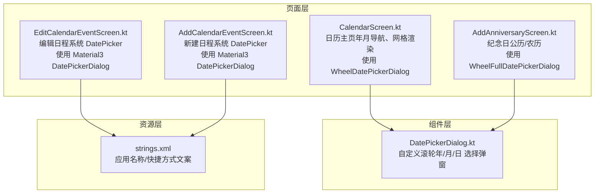
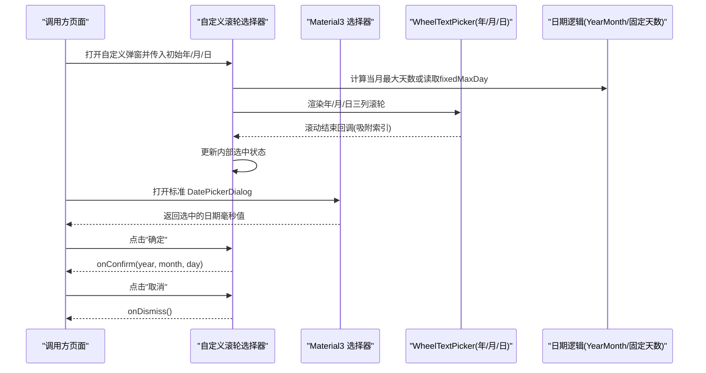
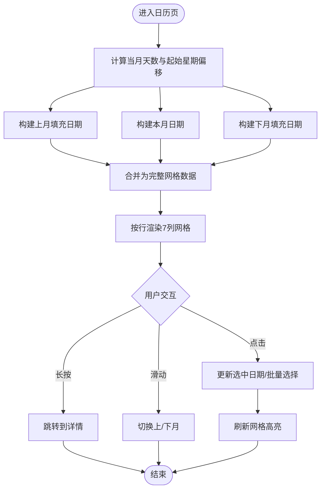
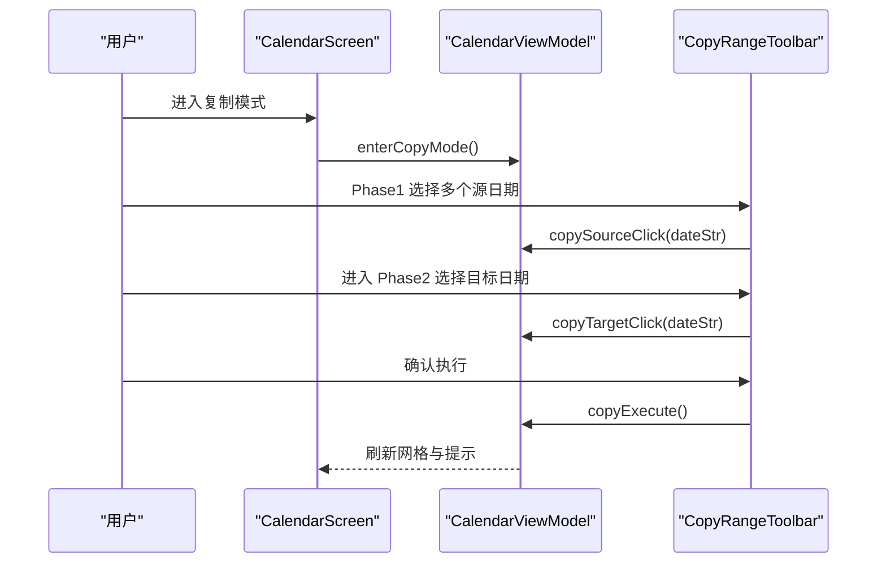
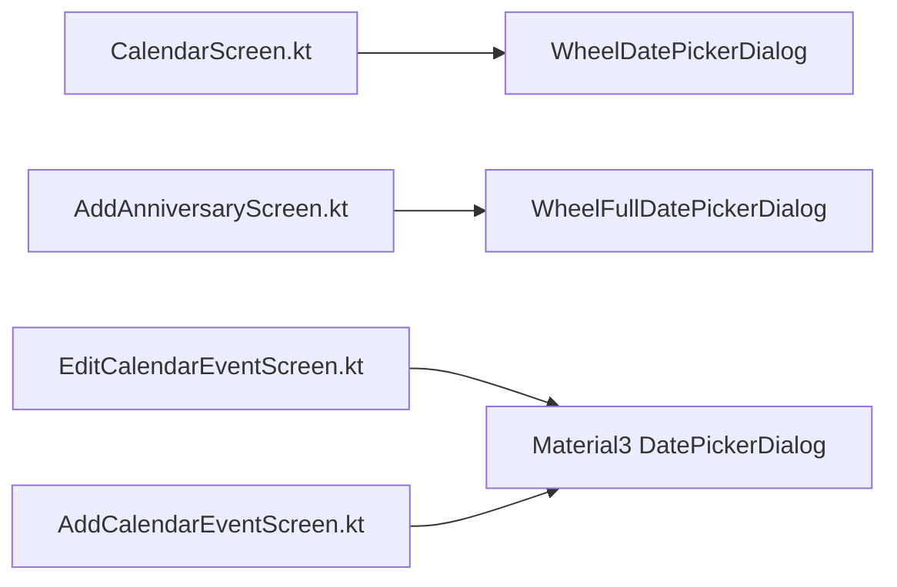

# 日期选择器对话框

<cite>
**本文引用的文件**
- [DatePickerDialog.kt](file://app/src/main/java/com/schedulecalendar/app/ui/component/DatePickerDialog.kt)
- [CalendarScreen.kt](file://app/src/main/java/com/schedulecalendar/app/ui/calendar/CalendarScreen.kt)
- [AddAnniversaryScreen.kt](file://app/src/main/java/com/schedulecalendar/app/ui/todo/AddAnniversaryScreen.kt)
- [EditCalendarEventScreen.kt](file://app/src/main/java/com/schedulecalendar/app/ui/todo/EditCalendarEventScreen.kt)
- [AddCalendarEventScreen.kt](file://app/src/main/java/com/schedulecalendar/app/ui/todo/AddCalendarEventScreen.kt)
- [strings.xml](file://app/src/main/res/values/strings.xml)
</cite>

## 更新摘要
**变更内容**
- 移除了对已删除的自定义 WheelDatePickerDialog 组件的引用
- 更新了文档以反映当前使用标准 Android/Compose 日期选择器的状态
- 调整了架构概览和使用示例以匹配实际的代码实现
- 保留了仍在使用中的自定义组件说明

## 目录
1. [简介](#简介)
2. [项目结构](#项目结构)
3. [核心组件](#核心组件)
4. [架构总览](#架构总览)
5. [详细组件分析](#详细组件分析)
6. [依赖关系分析](#依赖关系分析)
7. [性能与优化](#性能与优化)
8. [故障排查指南](#故障排查指南)
9. [结论](#结论)
10. [附录：使用示例与集成指南](#附录使用示例与集成指南)

## 简介
本文件围绕"日期选择器对话框"组件进行系统化文档化，重点覆盖：
- 日历视图实现原理（月份导航、日期网格渲染、选中状态管理）
- 日期范围选择能力（单日期与区间模式）
- 国际化支持（本地化文本、日期格式适配）
- 组件属性配置（最小/最大日期限制、禁用日期、自定义样式）
- 完整使用示例与集成指南（事件处理、状态同步、性能优化策略）

**更新** 当前项目采用混合方案：部分功能使用自定义滚轮式日期选择器，部分功能使用标准 Material3 DatePickerDialog。

## 项目结构
本项目采用 Compose UI 的模块化组织方式。与日期选择器相关的关键位置如下：
- 组件层：滚轮式日期选择弹窗封装在组件包中（WheelFullDatePickerDialog、WheelDatePickerDialog）
- 页面层：日历主界面、纪念日创建/编辑、日程创建/编辑等页面按需引入并使用相应组件
- 资源层：应用级字符串资源用于全局文案

**图表来源**
- [DatePickerDialog.kt:1-303](file://app/src/main/java/com/schedulecalendar/app/ui/component/DatePickerDialog.kt#L1-L303)
- [CalendarScreen.kt:674-685](file://app/src/main/java/com/schedulecalendar/app/ui/calendar/CalendarScreen.kt#L674-L685)
- [AddAnniversaryScreen.kt:552-589](file://app/src/main/java/com/schedulecalendar/app/ui/todo/AddAnniversaryScreen.kt#L552-L589)
- [EditCalendarEventScreen.kt:248-267](file://app/src/main/java/com/schedulecalendar/app/ui/todo/EditCalendarEventScreen.kt#L248-L267)
- [AddCalendarEventScreen.kt:248-274](file://app/src/main/java/com/schedulecalendar/app/ui/todo/AddCalendarEventScreen.kt#L248-L274)

## 核心组件
### 自定义滚轮式日期选择器
- **WheelFullDatePickerDialog**：三列滚轮（年/月/日）的全量日期选择弹窗，支持固定最大天数（如农历）、自定义月份/日期标签、自动收窄日列表、确认/取消回调。
- **WheelDatePickerDialog**：两列滚轮（年/月）的年月选择弹窗，常用于日历页快速跳转月份。

### 标准 Material3 日期选择器
- **Material3 DatePickerDialog**：Android 官方提供的日期选择对话框，用于日程编辑等场景。

**关键特性**
- 滚动吸附与状态同步：通过 onScrollFinished 更新内部选中值，确保点击确定时取最新吸附结果。
- 动态天数计算：根据 YearMonth 自动计算当月天数；或传入 fixedMaxDay 覆盖（适用于农历）。
- 标签可定制：monthLabels/dayLabels 为空时使用默认中文"X月/X日"，也可传入自定义列表（如农历月份/日期名）。
- 边界保护：对 year/month/day 做 coerceIn 校验，避免越界。

**章节来源**
- [DatePickerDialog.kt:33-186](file://app/src/main/java/com/schedulecalendar/app/ui/component/DatePickerDialog.kt#L33-L186)
- [DatePickerDialog.kt:191-303](file://app/src/main/java/com/schedulecalendar/app/ui/component/DatePickerDialog.kt#L191-L303)

## 架构总览
从调用方到组件的交互流程如下：

**图表来源**
- [DatePickerDialog.kt:33-186](file://app/src/main/java/com/schedulecalendar/app/ui/component/DatePickerDialog.kt#L33-L186)
- [EditCalendarEventScreen.kt:248-267](file://app/src/main/java/com/schedulecalendar/app/ui/todo/EditCalendarEventScreen.kt#L248-L267)

## 详细组件分析

### 日历视图实现原理（月份导航、日期网格渲染、选中状态管理）
- 月份导航
  - 顶部标题栏显示"年+月"，点击弹出 WheelDatePickerDialog 快速跳转。
  - 支持左右滑动切换月份，结合 AnimatedContent 提供平滑过渡动画。
- 日期网格渲染
  - 预计算前月尾部、本月、下月头部以补齐首尾行，按 7 列布局逐行渲染 DayCell。
  - 每个单元格包含日期数字、农历/节假日信息、班次/状态标签、今日/周末/假期高亮等。
- 选中状态管理
  - 普通模式：selectedDate 为当前选中日期。
  - 批量/删除/复制模式：batchSelected/copySourceDates/copyTargetDate 控制多选与复制目标。
  - 点击/长按分别触发不同行为（进入详情、批量选择等）。

**图表来源**
- [CalendarScreen.kt:277-485](file://app/src/main/java/com/schedulecalendar/app/ui/calendar/CalendarScreen.kt#L277-L485)
- [CalendarScreen.kt:628-800](file://app/src/main/java/com/schedulecalendar/app/ui/calendar/CalendarScreen.kt#L628-800)

**章节来源**
- [CalendarScreen.kt:1-800](file://app/src/main/java/com/schedulecalendar/app/ui/calendar/CalendarScreen.kt#L1-L800)

### 日期范围选择功能（单日期与区间模式）
- 单日期选择
  - 通过 WheelFullDatePickerDialog 选择具体年/月/日，确认后回写页面状态。
  - 或通过 Material3 DatePickerDialog 选择日期，转换为毫秒值后处理。
- 区间选择（复制排班）
  - 复制模式分两步：Phase1 选择源日期集合，Phase2 选择目标日期，最终执行批量复制。
  - 该流程由日历页面的 CopyRangeToolbar 驱动，配合状态机完成选择与执行。

**图表来源**
- [CalendarScreen.kt:517-533](file://app/src/main/java/com/schedulecalendar/app/ui/calendar/CalendarScreen.kt#L517-L533)

**章节来源**
- [CalendarScreen.kt:517-533](file://app/src/main/java/com/schedulecalendar/app/ui/calendar/CalendarScreen.kt#L517-L533)

### 国际化支持（本地化文本、日期格式适配）
- 组件内硬编码中文文案（如"选择日期"、"确定"、"取消"），未走 strings.xml。
- 应用级字符串资源位于 strings.xml，主要用于应用名称与快捷方式文案，未直接覆盖日期选择器文案。
- 日期格式方面：
  - 组件内部使用 YearMonth.lengthOfMonth() 计算天数，符合 ISO 标准。
  - 展示侧统一使用"YYYY-MM-DD"字符串作为日期键，便于跨模块传递与存储。

建议改进
- 将弹窗标题、按钮文案抽取至 strings.xml，并通过参数注入到组件，以实现多语言切换。
- 若需支持其他语言日期格式，可在上层格式化展示，组件仅负责数值选择。

**章节来源**
- [DatePickerDialog.kt:84-186](file://app/src/main/java/com/schedulecalendar/app/ui/component/DatePickerDialog.kt#L84-L186)
- [strings.xml:1-17](file://app/src/main/res/values/strings.xml#L1-L17)

### 组件属性配置选项
#### 自定义滚轮式选择器
- WheelFullDatePickerDialog
  - title：弹窗标题
  - currentYear/currentMonth/currentDay：初始选中值
  - yearList：年份列表（由调用方生成）
  - monthLabels/dayLabels：自定义月份/日期标签（可为空，默认中文）
  - fixedMaxDay：覆盖自动计算的最大天数（用于农历场景）
  - onConfirm/onDismiss：确认/取消回调
- WheelDatePickerDialog
  - currentYear/currentMonth：初始选中值
  - onConfirm/onDismiss：确认/取消回调

#### 标准 Material3 选择器
- DatePickerDialog
  - state：DatePickerState 对象，包含选中的日期毫秒值
  - confirmButton/dismissButton：自定义确认/取消按钮
  - onDismissRequest：关闭回调

注意
- 自定义组件未暴露 min/max 日期与禁用日期列表参数。如需限制可选范围，应在调用方生成 yearList 与 monthLabels/dayLabels 时进行裁剪，并在 onConfirm 中进行二次校验。

**章节来源**
- [DatePickerDialog.kt:33-186](file://app/src/main/java/com/schedulecalendar/app/ui/component/DatePickerDialog.kt#L33-L186)
- [DatePickerDialog.kt:191-303](file://app/src/main/java/com/schedulecalendar/app/ui/component/DatePickerDialog.kt#L191-L303)
- [EditCalendarEventScreen.kt:248-267](file://app/src/main/java/com/schedulecalendar/app/ui/todo/EditCalendarEventScreen.kt#L248-L267)

### 自定义样式
- 弹窗容器：Card + RoundedCornerShape + elevation
- 选择器样式：selectorProperties 设置选中背景色、圆角、边框
- 按钮样式：OutlinedButton/Button 使用主题色与圆角
- 字体与字号：MaterialTheme.typography.titleMedium 等

**章节来源**
- [DatePickerDialog.kt:70-186](file://app/src/main/java/com/schedulecalendar/app/ui/component/DatePickerDialog.kt#L70-L186)
- [DatePickerDialog.kt:206-303](file://app/src/main/java/com/schedulecalendar/app/ui/component/DatePickerDialog.kt#L206-303)

## 依赖关系分析
- CalendarScreen 依赖 WheelDatePickerDialog 实现"年月滚轮跳转"。
- AddAnniversaryScreen 依赖 WheelFullDatePickerDialog 实现"公历/农历日期选择"。
- EditCalendarEventScreen/AddCalendarEventScreen 使用 Material3 的 DatePickerDialog（非本组件），与本组件并行存在。

**图表来源**
- [CalendarScreen.kt:674-685](file://app/src/main/java/com/schedulecalendar/app/ui/calendar/CalendarScreen.kt#L674-L685)
- [AddAnniversaryScreen.kt:552-589](file://app/src/main/java/com/schedulecalendar/app/ui/todo/AddAnniversaryScreen.kt#L552-L589)
- [EditCalendarEventScreen.kt:248-267](file://app/src/main/java/com/schedulecalendar/app/ui/todo/EditCalendarEventScreen.kt#L248-L267)
- [AddCalendarEventScreen.kt:248-274](file://app/src/main/java/com/schedulecalendar/app/ui/todo/AddCalendarEventScreen.kt#L248-L274)

**章节来源**
- [CalendarScreen.kt:674-685](file://app/src/main/java/com/schedulecalendar/app/ui/calendar/CalendarScreen.kt#L674-L685)
- [AddAnniversaryScreen.kt:552-589](file://app/src/main/java/com/schedulecalendar/app/ui/todo/AddAnniversaryScreen.kt#L552-L589)
- [EditCalendarEventScreen.kt:248-267](file://app/src/main/java/com/schedulecalendar/app/ui/todo/EditCalendarEventScreen.kt#L248-L267)
- [AddCalendarEventScreen.kt:248-274](file://app/src/main/java/com/schedulecalendar/app/ui/todo/AddCalendarEventScreen.kt#L248-L274)

## 性能与优化
- 网格渲染
  - 使用 LazyColumn 包裹整体内容，日历区域高度自适应，减少不必要的重绘。
  - 使用 AnimatedContent 实现月份切换动画，提升体验同时避免整屏重建。
- 数据预计算
  - 在渲染前一次性计算 prev/cur/next 三段日期数据，降低循环中的重复计算。
- 状态隔离
  - 各操作模式（批量/删除/复制）使用独立状态字段，避免相互干扰导致的多余重组。
- 选择器性能
  - 滚轮选择器仅在滚动结束时更新状态，减少频繁重组。

## 故障排查指南
- 农历日期选择异常
  - 现象：农历月份/日期超出预期或显示异常。
  - 排查：确认传入 lunarMonthNames/lunarDayNames 长度与 fixedMaxDay 一致；检查 lunarToSolar/solarToLunar 转换是否抛出异常。
  - 参考路径：[AddAnniversaryScreen.kt:570-589](file://app/src/main/java/com/schedulecalendar/app/ui/todo/AddAnniversaryScreen.kt#L570-L589)
- 月份切换后日期错位
  - 现象：切换月份后网格显示不正确。
  - 排查：确认 firstDow 计算与 totalCells/rowCount 推导是否正确；检查 prevFillDays/nextFillDays 拼接顺序。
  - 参考路径：[CalendarScreen.kt:277-485](file://app/src/main/java/com/schedulecalendar/app/ui/calendar/CalendarScreen.kt#L277-L485)
- 选择器确认值越界
  - 现象：onConfirm 返回的 year/month/day 不在期望范围。
  - 排查：组件已做 coerceIn 保护；若仍出现，检查调用方传入的 yearList 与 maxDay 计算逻辑。
  - 参考路径：[DatePickerDialog.kt:171-175](file://app/src/main/java/com/schedulecalendar/app/ui/component/DatePickerDialog.kt#L171-L175)

**章节来源**
- [AddAnniversaryScreen.kt:570-589](file://app/src/main/java/com/schedulecalendar/app/ui/todo/AddAnniversaryScreen.kt#L570-L589)
- [CalendarScreen.kt:277-485](file://app/src/main/java/com/schedulecalendar/app/ui/calendar/CalendarScreen.kt#L277-L485)
- [DatePickerDialog.kt:171-175](file://app/src/main/java/com/schedulecalendar/app/ui/component/DatePickerDialog.kt#L171-L175)

## 结论
- 组件提供了轻量、可定制的滚轮日期选择能力，满足公历与农历场景。
- 日历主页实现了完整的月份导航、网格渲染与多种操作模式的状态管理。
- 项目采用混合方案：复杂场景使用标准 Material3 DatePickerDialog，特殊需求使用自定义滚轮选择器。
- 国际化与样式可通过上层注入与主题体系扩展；建议在后续版本中将硬编码文案迁移至资源文件。
- 对于更复杂的日期范围选择需求，可基于现有复制模式思路扩展为通用的"起止日期选择器"。

## 附录：使用示例与集成指南

### 在纪念日页面中使用全量日期选择器
- 打开弹窗：维护 showDatePicker 状态，点击卡片时置 true。
- 传入初始值：selectedYear/selectedMonth/selectedDay。
- 年份范围：根据当前年动态生成前后若干年的列表。
- 确认回调：更新 selectedYear/Month/Day 并关闭弹窗。
- 参考路径：
  - [AddAnniversaryScreen.kt:552-568](file://app/src/main/java/com/schedulecalendar/app/ui/todo/AddAnniversaryScreen.kt#L552-L568)

### 在日历主页中使用年月选择器
- 打开弹窗：点击顶部"年+月"区域，置 showDatePicker=true。
- 传入当前 state.year/state.month。
- 确认回调：关闭弹窗并调用 vm.goToMonth(year, month)。
- 参考路径：
  - [CalendarScreen.kt:674-685](file://app/src/main/java/com/schedulecalendar/app/ui/calendar/CalendarScreen.kt#L674-L685)

### 与系统 DatePicker 的对比与共存
- 纪念日/日程编辑页面使用了 Material3 的 DatePickerDialog，适合需要精确时间/全天事件等复杂场景。
- 本组件更适合快速选择与自定义展示（如农历、自定义标签）。
- 参考路径：
  - [EditCalendarEventScreen.kt:248-267](file://app/src/main/java/com/schedulecalendar/app/ui/todo/EditCalendarEventScreen.kt#L248-L267)
  - [AddCalendarEventScreen.kt:248-274](file://app/src/main/java/com/schedulecalendar/app/ui/todo/AddCalendarEventScreen.kt#L248-L274)

### 事件处理与状态同步
- 弹窗状态：使用 remember/mutableStateOf 管理 showDatePicker。
- 选择结果：在 onConfirm 中更新业务状态，必要时触发 ViewModel 方法（如 goToMonth）。
- 错误提示：在 Snackbar 或 Toast 中反馈异常（如权限不足、转换失败）。

### 性能优化策略
- 只在必要时机打开/关闭弹窗，避免长时间持有状态导致内存占用。
- 对大量数据（如年份列表）使用 remember 缓存，减少重复计算。
- 日历网格数据预计算，避免在渲染过程中进行耗时操作。

**章节来源**
- [AddAnniversaryScreen.kt:552-568](file://app/src/main/java/com/schedulecalendar/app/ui/todo/AddAnniversaryScreen.kt#L552-L568)
- [CalendarScreen.kt:674-685](file://app/src/main/java/com/schedulecalendar/app/ui/calendar/CalendarScreen.kt#L674-L685)
- [EditCalendarEventScreen.kt:248-267](file://app/src/main/java/com/schedulecalendar/app/ui/todo/EditCalendarEventScreen.kt#L248-L267)
- [AddCalendarEventScreen.kt:248-274](file://app/src/main/java/com/schedulecalendar/app/ui/todo/AddCalendarEventScreen.kt#L248-L274)