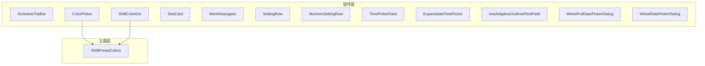
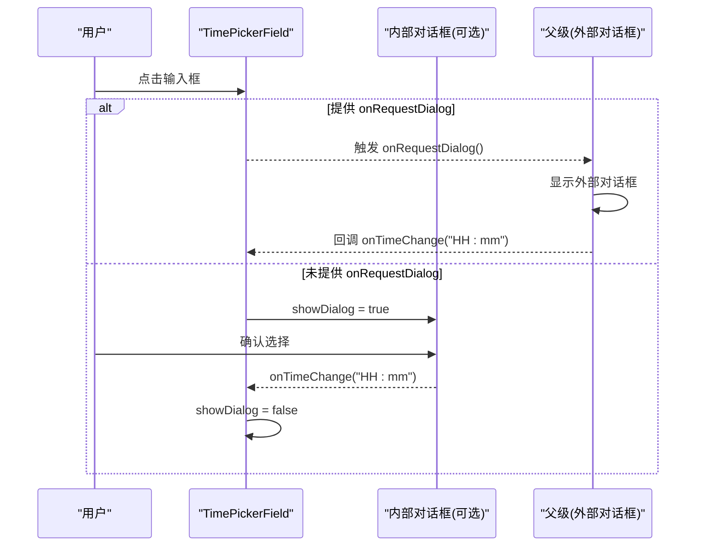
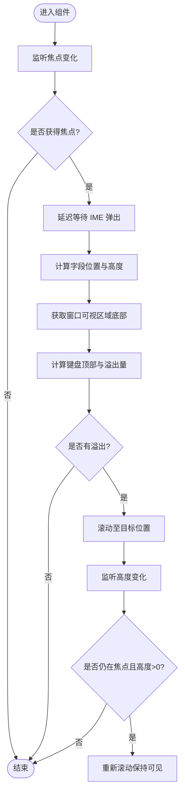
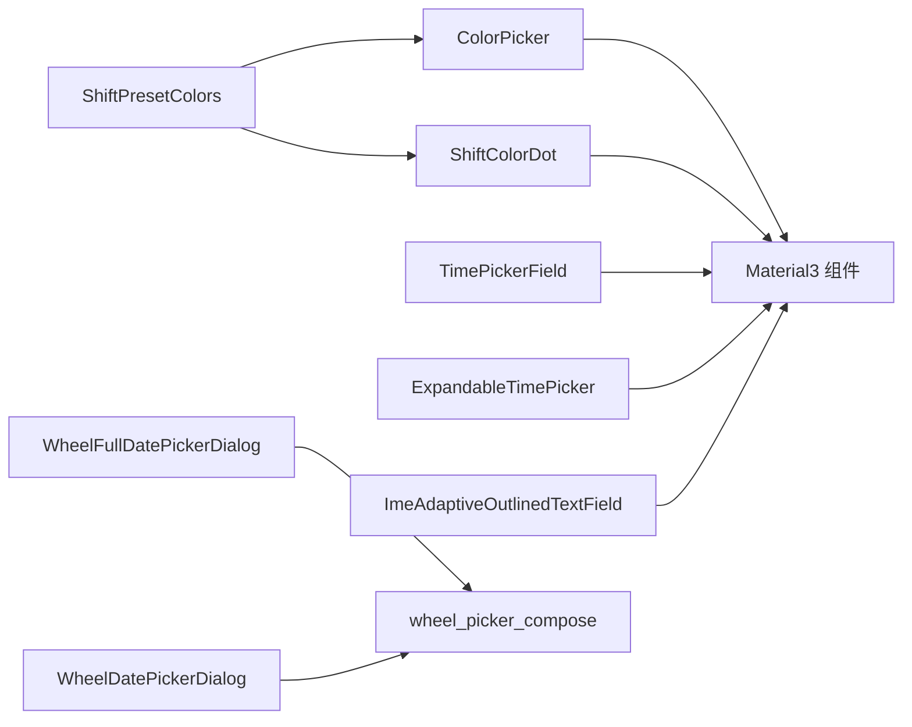

# 通用UI组件

<cite>
**本文引用的文件**   
- [CommonComponents.kt](file://app/src/main/java/com/schedulecalendar/app/ui/component/CommonComponents.kt)
- [DatePickerDialog.kt](file://app/src/main/java/com/schedulecalendar/app/ui/component/DatePickerDialog.kt)
- [Color.kt](file://app/src/main/java/com/schedulecalendar/app/ui/theme/Color.kt)
</cite>

## 目录
1. [简介](#简介)
2. [项目结构](#项目结构)
3. [核心组件](#核心组件)
4. [架构总览](#架构总览)
5. [详细组件分析](#详细组件分析)
6. [依赖关系分析](#依赖关系分析)
7. [性能与可访问性](#性能与可访问性)
8. [故障排查指南](#故障排查指南)
9. [结论](#结论)
10. [附录：API参考与使用示例](#附录api参考与使用示例)

## 简介
本文件面向应用中的通用 UI 组件，聚焦于 Compose 可复用组件集合的深入说明。内容覆盖顶部导航栏、颜色选择器、统计卡片、月份导航、设置项行、时间选择器输入框与弹出式时间选择器，以及 IME 自适应输入框等。文档提供每个组件的职责、配置项、交互逻辑、数据流、主题适配与最佳实践，帮助读者快速理解并正确集成这些组件。

## 项目结构
通用组件集中在 ui/component 包中，主题色定义在 ui/theme 包中。关键文件如下：
- CommonComponents.kt：包含 ScheduleTopBar、ShiftColorDot、ColorPicker、StatCard、MonthNavigator、SettingRow、NumericSettingRow、TimePickerField、ExpandableTimePicker、ImeAdaptiveOutlinedTextField 等
- DatePickerDialog.kt：包含 WheelFullDatePickerDialog、WheelDatePickerDialog 两个滚轮日期选择弹窗
- Color.kt：包含 ShiftPresetColors 等预设颜色常量

图表来源
- [CommonComponents.kt:39-65](file://app/src/main/java/com/schedulecalendar/app/ui/component/CommonComponents.kt#L39-L65)
- [CommonComponents.kt:68-103](file://app/src/main/java/com/schedulecalendar/app/ui/component/CommonComponents.kt#L68-L103)
- [CommonComponents.kt:106-115](file://app/src/main/java/com/schedulecalendar/app/ui/component/CommonComponents.kt#L106-L115)
- [CommonComponents.kt:118-125](file://app/src/main/java/com/schedulecalendar/app/ui/component/CommonComponents.kt#L118-L125)
- [CommonComponents.kt:128-141](file://app/src/main/java/com/schedulecalendar/app/ui/component/CommonComponents.kt#L128-L141)
- [CommonComponents.kt:155-166](file://app/src/main/java/com/schedulecalendar/app/ui/component/CommonComponents.kt#L155-L166)
- [CommonComponents.kt:181-258](file://app/src/main/java/com/schedulecalendar/app/ui/component/CommonComponents.kt#L181-L258)
- [CommonComponents.kt:270-341](file://app/src/main/java/com/schedulecalendar/app/ui/component/CommonComponents.kt#L270-L341)
- [CommonComponents.kt:355-443](file://app/src/main/java/com/schedulecalendar/app/ui/component/CommonComponents.kt#L355-L443)
- [DatePickerDialog.kt:33-186](file://app/src/main/java/com/schedulecalendar/app/ui/component/DatePickerDialog.kt#L33-L186)
- [DatePickerDialog.kt:191-302](file://app/src/main/java/com/schedulecalendar/app/ui/component/DatePickerDialog.kt#L191-L302)
- [Color.kt:35-42](file://app/src/main/java/com/schedulecalendar/app/ui/theme/Color.kt#L35-L42)

章节来源
- [CommonComponents.kt:1-444](file://app/src/main/java/com/schedulecalendar/app/ui/component/CommonComponents.kt#L1-L444)
- [DatePickerDialog.kt:1-303](file://app/src/main/java/com/schedulecalendar/app/ui/component/DatePickerDialog.kt#L1-L303)
- [Color.kt:1-43](file://app/src/main/java/com/schedulecalendar/app/ui/theme/Color.kt#L1-L43)

## 核心组件
本节概述各组件职责与适用场景，后续章节将给出更详细的 API 与实现细节。

- ScheduleTopBar：统一的顶部导航栏，支持标题、返回按钮与右侧操作区动态渲染，遵循 Material3 主题。
- ShiftColorDot：以圆点形式展示班次颜色，支持尺寸控制与容错解析。
- ColorPicker：两行布局的颜色选择器，基于预设颜色集，选中态带边框高亮。
- StatCard：信息统计卡片，主值+标签的双行布局，容器颜色可配，适配主题。
- MonthNavigator：年月显示与上月/下月切换按钮，居中布局。
- SettingRow：设置项行，左侧标签+右侧内容的左右分布，底部分割线。
- NumericSettingRow：数值输入的设置行，内部封装 OutlinedTextField。
- TimePickerField：点击后弹出时间选择对话框；支持外部控制对话框（onRequestDialog）或内部自包含对话框。
- ExpandableTimePicker：外观为输入框样式的时间选择器，点击弹出对话框，适合表单内嵌场景。
- ImeAdaptiveOutlinedTextField：智能滚动输入框，自动处理软键盘遮挡，支持 Column 滚动状态与 LazyColumn 回调两种模式。
- WheelFullDatePickerDialog / WheelDatePickerDialog：滚轮式年/月/日或年/月选择弹窗，支持自定义标签与最大天数。

章节来源
- [CommonComponents.kt:39-65](file://app/src/main/java/com/schedulecalendar/app/ui/component/CommonComponents.kt#L39-L65)
- [CommonComponents.kt:68-103](file://app/src/main/java/com/schedulecalendar/app/ui/component/CommonComponents.kt#L68-L103)
- [CommonComponents.kt:106-115](file://app/src/main/java/com/schedulecalendar/app/ui/component/CommonComponents.kt#L106-L115)
- [CommonComponents.kt:118-125](file://app/src/main/java/com/schedulecalendar/app/ui/component/CommonComponents.kt#L118-L125)
- [CommonComponents.kt:128-141](file://app/src/main/java/com/schedulecalendar/app/ui/component/CommonComponents.kt#L128-L141)
- [CommonComponents.kt:155-166](file://app/src/main/java/com/schedulecalendar/app/ui/component/CommonComponents.kt#L155-L166)
- [CommonComponents.kt:181-258](file://app/src/main/java/com/schedulecalendar/app/ui/component/CommonComponents.kt#L181-L258)
- [CommonComponents.kt:270-341](file://app/src/main/java/com/schedulecalendar/app/ui/component/CommonComponents.kt#L270-L341)
- [CommonComponents.kt:355-443](file://app/src/main/java/com/schedulecalendar/app/ui/component/CommonComponents.kt#L355-L443)
- [DatePickerDialog.kt:33-186](file://app/src/main/java/com/schedulecalendar/app/ui/component/DatePickerDialog.kt#L33-L186)
- [DatePickerDialog.kt:191-302](file://app/src/main/java/com/schedulecalendar/app/ui/component/DatePickerDialog.kt#L191-L302)

## 架构总览
组件间关系与依赖：
- ColorPicker 与 ShiftColorDot 依赖主题层的 ShiftPresetColors 预设颜色列表。
- TimePickerField 与 ExpandableTimePicker 均基于 Material3 的 TimePicker 对话框，区别在于是否由父级控制对话框生命周期。
- ImeAdaptiveOutlinedTextField 通过焦点事件、尺寸变化与全局位置计算，结合系统窗口可见区域，驱动父级滚动或触发回调。

```mermaid
classDiagram
class ScheduleTopBar {
+参数 : title, onBack, actions
+行为 : 渲染 TopAppBar
}
class ShiftColorDot {
+参数 : hexColor, size
+行为 : 解析颜色并绘制圆点
}
class ColorPicker {
+参数 : selected, onSelect
+行为 : 两行网格选择颜色
}
class StatCard {
+参数 : label, value, containerColor
+行为 : 双行信息卡片
}
class MonthNavigator {
+参数 : year, month, onPrev, onNext
+行为 : 年月显示与切换
}
class SettingRow {
+参数 : label, content
+行为 : 设置项行布局
}
class NumericSettingRow {
+参数 : label, value, onValueChange
+行为 : 数值输入设置行
}
class TimePickerField {
+参数 : time, onTimeChange, label, defaultTime, onRequestDialog
+行为 : 点击弹出时间选择对话框
}
class ExpandableTimePicker {
+参数 : label, time, onTimeSelected, enabled
+行为 : 输入框样式的时间选择器
}
class ImeAdaptiveOutlinedTextField {
+参数 : value, onValueChange, scrollState, onFocused
+行为 : 焦点时自动滚动避免键盘遮挡
}
class WheelFullDatePickerDialog {
+参数 : title, currentYear, currentMonth, currentDay, yearList, fixedMaxDay, onConfirm
+行为 : 三列滚轮日期选择
}
class WheelDatePickerDialog {
+参数 : currentYear, currentMonth, onConfirm
+行为 : 年/月滚轮选择
}
class ShiftPresetColors {
+属性 : 18个预设颜色字符串
}
ColorPicker --> ShiftPresetColors : "读取预设颜色"
ShiftColorDot --> ShiftPresetColors : "可选使用"
```

图表来源
- [CommonComponents.kt:39-65](file://app/src/main/java/com/schedulecalendar/app/ui/component/CommonComponents.kt#L39-L65)
- [CommonComponents.kt:68-103](file://app/src/main/java/com/schedulecalendar/app/ui/component/CommonComponents.kt#L68-L103)
- [CommonComponents.kt:106-115](file://app/src/main/java/com/schedulecalendar/app/ui/component/CommonComponents.kt#L106-L115)
- [CommonComponents.kt:118-125](file://app/src/main/java/com/schedulecalendar/app/ui/component/CommonComponents.kt#L118-L125)
- [CommonComponents.kt:128-141](file://app/src/main/java/com/schedulecalendar/app/ui/component/CommonComponents.kt#L128-L141)
- [CommonComponents.kt:155-166](file://app/src/main/java/com/schedulecalendar/app/ui/component/CommonComponents.kt#L155-L166)
- [CommonComponents.kt:181-258](file://app/src/main/java/com/schedulecalendar/app/ui/component/CommonComponents.kt#L181-L258)
- [CommonComponents.kt:270-341](file://app/src/main/java/com/schedulecalendar/app/ui/component/CommonComponents.kt#L270-L341)
- [CommonComponents.kt:355-443](file://app/src/main/java/com/schedulecalendar/app/ui/component/CommonComponents.kt#L355-L443)
- [DatePickerDialog.kt:33-186](file://app/src/main/java/com/schedulecalendar/app/ui/component/DatePickerDialog.kt#L33-L186)
- [DatePickerDialog.kt:191-302](file://app/src/main/java/com/schedulecalendar/app/ui/component/DatePickerDialog.kt#L191-L302)
- [Color.kt:35-42](file://app/src/main/java/com/schedulecalendar/app/ui/theme/Color.kt#L35-L42)

## 详细组件分析

### ScheduleTopBar
- 功能：统一顶部导航栏，支持标题、返回按钮与右侧操作区。当标题为空且无导航图标与操作按钮时不渲染，节省空间。
- 主题适配：容器与文字颜色来自 MaterialTheme.colorScheme.surface 与 onSurface。
- 使用建议：
  - 需要返回导航时传入 onBack；否则隐藏导航图标。
  - 右侧操作区通过 actions 插槽注入，支持多个 IconButton 或 TextButton。
  - 若页面不需要顶栏高度，可将 title 设为空且不传 onBack 与 actions。

章节来源
- [CommonComponents.kt:39-65](file://app/src/main/java/com/schedulecalendar/app/ui/component/CommonComponents.kt#L39-L65)

### ShiftColorDot
- 功能：根据十六进制颜色字符串渲染圆形色块，支持尺寸控制。
- 颜色解析：使用 try-catch 容错，解析失败回退到默认绿色。
- 使用建议：
  - 用于在列表中直观展示班次或状态颜色。
  - 尺寸建议与整体排版一致，常见 8-12dp。

章节来源
- [CommonComponents.kt:68-77](file://app/src/main/java/com/schedulecalendar/app/ui/component/CommonComponents.kt#L68-L77)
- [Color.kt:35-42](file://app/src/main/java/com/schedulecalendar/app/ui/theme/Color.kt#L35-L42)

### ColorPicker
- 功能：两行布局的颜色选择器，共18色，均匀分布。选中项带边框高亮。
- 数据来源：ShiftPresetColors 预设颜色列表，按每行9个分块。
- 交互：点击任意色块调用 onSelect(hex)。
- 响应式布局：Row 使用 SpaceEvenly 保证间距均匀，Column 垂直间距固定。
- 使用建议：
  - 在设置页或编辑页中供用户选择班次/状态颜色。
  - 保持 selected 状态由父级管理，确保受控组件语义。

章节来源
- [CommonComponents.kt:79-103](file://app/src/main/java/com/schedulecalendar/app/ui/component/CommonComponents.kt#L79-L103)
- [Color.kt:35-42](file://app/src/main/java/com/schedulecalendar/app/ui/theme/Color.kt#L35-L42)

### StatCard
- 功能：统计信息卡片，主值在上、标签在下，居中对齐。
- 主题适配：容器颜色可通过 containerColor 参数传入，默认使用 primaryContainer；主值颜色使用 primary，标签使用 onSurfaceVariant。
- 使用建议：
  - 适用于仪表盘或详情页的数据概览。
  - 可配合 Row/Column 进行多卡片布局。

章节来源
- [CommonComponents.kt:106-115](file://app/src/main/java/com/schedulecalendar/app/ui/component/CommonComponents.kt#L106-L115)

### MonthNavigator
- 功能：显示“年 月”，并提供上月/下月按钮。
- 交互：onPrev/onNext 由父级处理状态更新。
- 使用建议：
  - 常用于日历或报表页面的头部导航。
  - 可与 AnimatedContent 组合实现平滑过渡。

章节来源
- [CommonComponents.kt:118-125](file://app/src/main/java/com/schedulecalendar/app/ui/component/CommonComponents.kt#L118-L125)

### SettingRow 与 NumericSettingRow
- SettingRow：左侧文本标签，右侧内容插槽，底部分割线。适合大多数设置项。
- NumericSettingRow：内置 OutlinedTextField，宽度固定，单行输入，适合数字类设置。
- 使用建议：
  - 在设置页中批量组织选项，保持视觉一致性。
  - 对需要校验的数字输入，建议在 onValueChange 中进行格式化处理。

章节来源
- [CommonComponents.kt:128-141](file://app/src/main/java/com/schedulecalendar/app/ui/component/CommonComponents.kt#L128-L141)
- [CommonComponents.kt:155-166](file://app/src/main/java/com/schedulecalendar/app/ui/component/CommonComponents.kt#L155-L166)

### TimePickerField 与 ExpandableTimePicker
- 共同点：
  - 均基于 Material3 TimePicker 对话框，支持 24 小时制。
  - 输入框只读，点击打开对话框，确认后格式化输出“HH:mm”。
- 差异点：
  - TimePickerField：支持 onRequestDialog 回调，由父级控制对话框生命周期，适合 LazyColumn 等复杂列表场景；未提供时内部自包含对话框。
  - ExpandableTimePicker：始终内部自包含对话框，适合简单表单场景。
- 初始值解析：
  - 优先使用 time，若为空则回退到 defaultTime（仅 TimePickerField）。
  - 解析失败时回退默认小时与分钟。
- 使用建议：
  - 列表中使用 TimePickerField 并配合外部对话框状态，避免重复创建对话框导致性能问题。
  - 普通表单使用 ExpandableTimePicker 更简洁。

图表来源
- [CommonComponents.kt:181-258](file://app/src/main/java/com/schedulecalendar/app/ui/component/CommonComponents.kt#L181-L258)

章节来源
- [CommonComponents.kt:181-258](file://app/src/main/java/com/schedulecalendar/app/ui/component/CommonComponents.kt#L181-L258)
- [CommonComponents.kt:270-341](file://app/src/main/java/com/schedulecalendar/app/ui/component/CommonComponents.kt#L270-L341)

### ImeAdaptiveOutlinedTextField
- 目标：解决软键盘遮挡输入框的问题，提升输入体验。
- 核心机制：
  - 监听焦点变化，获得焦点后延迟等待 IME 完全弹出，再计算滚动位置。
  - 监听字段高度变化，内容增长时再次滚动，保持输入框可见。
  - 对于 Column+verticalScroll：传入 ScrollState，精确计算滚动目标，使输入框下边缘位于键盘上方。
  - 对于 LazyColumn：不提供 ScrollState 时，通过 onFocused 回调交由父级处理滚动。
- 关键计算：
  - 获取字段在全局坐标系中的 Y 坐标与高度，计算下边缘。
  - 通过 View.getWindowVisibleDisplayFrame 获取窗口可视区域底部，减去安全边距得到键盘顶部。
  - 比较溢出量，决定是否需要滚动及滚动目标。
- 使用建议：
  - 在长表单或多输入项页面中广泛使用，避免手动处理键盘遮挡。
  - 在 LazyColumn 场景中，务必实现 onFocused 并在其中执行滚动定位。

图表来源
- [CommonComponents.kt:355-443](file://app/src/main/java/com/schedulecalendar/app/ui/component/CommonComponents.kt#L355-L443)

章节来源
- [CommonComponents.kt:355-443](file://app/src/main/java/com/schedulecalendar/app/ui/component/CommonComponents.kt#L355-L443)

### WheelFullDatePickerDialog 与 WheelDatePickerDialog
- WheelFullDatePickerDialog：
  - 三列滚轮：年/月/日，支持自定义年份列表、月份标签与日期标签。
  - 自动计算最大天数（基于 YearMonth），或通过 fixedMaxDay 覆盖（如农历场景）。
  - 当月份变化导致最大天数减少时，自动收窄 day 选择范围。
- WheelDatePickerDialog：
  - 两列滚轮：年/月，年份范围默认当前年前后30年。
- 使用建议：
  - 需要完整日期选择时使用全量弹窗；仅需年月时使用简化弹窗。
  - 自定义标签可提升本地化体验。

章节来源
- [DatePickerDialog.kt:33-186](file://app/src/main/java/com/schedulecalendar/app/ui/component/DatePickerDialog.kt#L33-L186)
- [DatePickerDialog.kt:191-302](file://app/src/main/java/com/schedulecalendar/app/ui/component/DatePickerDialog.kt#L191-L302)

## 依赖关系分析
- 主题依赖：
  - ColorPicker 与 ShiftColorDot 依赖 ShiftPresetColors 提供的18种预设颜色。
- 组件耦合：
  - TimePickerField 与 ExpandableTimePicker 都依赖 Material3 的 TimePicker 与对话框体系，但前者支持外部控制，后者自包含。
  - ImeAdaptiveOutlinedTextField 与父级滚动状态解耦，通过 ScrollState 或 onFocused 回调协作。
- 潜在循环依赖：
  - 组件均为纯函数式 Composable，无直接循环导入风险。
- 外部依赖：
  - Material3 组件库（TopAppBar、OutlinedTextField、TimePicker、AlertDialog 等）。
  - 第三方滚轮选择库 wheel_picker_compose（用于日期选择弹窗）。

图表来源
- [Color.kt:35-42](file://app/src/main/java/com/schedulecalendar/app/ui/theme/Color.kt#L35-L42)
- [CommonComponents.kt:79-103](file://app/src/main/java/com/schedulecalendar/app/ui/component/CommonComponents.kt#L79-L103)
- [CommonComponents.kt:181-258](file://app/src/main/java/com/schedulecalendar/app/ui/component/CommonComponents.kt#L181-L258)
- [CommonComponents.kt:270-341](file://app/src/main/java/com/schedulecalendar/app/ui/component/CommonComponents.kt#L270-L341)
- [CommonComponents.kt:355-443](file://app/src/main/java/com/schedulecalendar/app/ui/component/CommonComponents.kt#L355-L443)
- [DatePickerDialog.kt:33-186](file://app/src/main/java/com/schedulecalendar/app/ui/component/DatePickerDialog.kt#L33-L186)
- [DatePickerDialog.kt:191-302](file://app/src/main/java/com/schedulecalendar/app/ui/component/DatePickerDialog.kt#L191-L302)

章节来源
- [Color.kt:35-42](file://app/src/main/java/com/schedulecalendar/app/ui/theme/Color.kt#L35-L42)
- [CommonComponents.kt:79-103](file://app/src/main/java/com/schedulecalendar/app/ui/component/CommonComponents.kt#L79-L103)
- [CommonComponents.kt:181-258](file://app/src/main/java/com/schedulecalendar/app/ui/component/CommonComponents.kt#L181-L258)
- [CommonComponents.kt:270-341](file://app/src/main/java/com/schedulecalendar/app/ui/component/CommonComponents.kt#L270-L341)
- [CommonComponents.kt:355-443](file://app/src/main/java/com/schedulecalendar/app/ui/component/CommonComponents.kt#L355-L443)
- [DatePickerDialog.kt:33-186](file://app/src/main/java/com/schedulecalendar/app/ui/component/DatePickerDialog.kt#L33-L186)
- [DatePickerDialog.kt:191-302](file://app/src/main/java/com/schedulecalendar/app/ui/component/DatePickerDialog.kt#L191-L302)

## 性能与可访问性
- 性能优化建议：
  - 在列表中使用 TimePickerField 的外部对话框模式，避免频繁创建对话框实例。
  - ImeAdaptiveOutlinedTextField 的滚动计算仅在焦点与高度变化时触发，注意避免不必要的 recomposition。
  - ColorPicker 的选中态通过边框高亮，避免额外背景重绘开销。
- 可访问性建议：
  - 为所有可点击元素提供 contentDescription（如返回按钮、时间选择图标）。
  - 确保颜色对比度满足 WCAG 标准，尤其是浅色背景上的小字号文本。
  - 为输入框提供清晰的 label 与 placeholder，便于屏幕阅读器识别。

[本节为通用指导，无需具体文件引用]

## 故障排查指南
- 颜色无法显示或异常：
  - 检查传入的十六进制颜色字符串格式是否正确；组件已做容错处理，解析失败会回退默认色。
- 时间选择器未弹出或状态不同步：
  - 确认是否在列表中使用 TimePickerField 的外部对话框模式，并确保父级正确维护对话框状态与回调。
- 输入框被键盘遮挡：
  - 在 Column 场景传入 ScrollState；在 LazyColumn 场景实现 onFocused 回调并执行滚动定位。
- 日期选择器最大天数不正确：
  - 如需农历或其他特殊规则，使用 fixedMaxDay 覆盖自动计算的最大天数。

章节来源
- [CommonComponents.kt:68-77](file://app/src/main/java/com/schedulecalendar/app/ui/component/CommonComponents.kt#L68-L77)
- [CommonComponents.kt:181-258](file://app/src/main/java/com/schedulecalendar/app/ui/component/CommonComponents.kt#L181-L258)
- [CommonComponents.kt:355-443](file://app/src/main/java/com/schedulecalendar/app/ui/component/CommonComponents.kt#L355-L443)
- [DatePickerDialog.kt:33-186](file://app/src/main/java/com/schedulecalendar/app/ui/component/DatePickerDialog.kt#L33-L186)

## 结论
上述通用组件覆盖了导航、颜色选择、统计展示、月份导航、设置项、时间选择与 IME 自适应输入等高频场景。通过合理的参数设计与主题适配，组件具备良好的可复用性与扩展性。在实际使用中，建议遵循受控组件原则，妥善管理状态，并结合列表与滚动场景选择合适的交互模式，以获得稳定流畅的用户体验。

[本节为总结，无需具体文件引用]

## 附录：API参考与使用示例

### ScheduleTopBar
- 参数
  - title: String，标题文本
  - onBack: (() -> Unit)?，返回导航回调
  - actions: @Composable RowScope.() -> Unit，右侧操作区插槽
- 使用示例路径
  - [顶部导航栏定义:39-65](file://app/src/main/java/com/schedulecalendar/app/ui/component/CommonComponents.kt#L39-L65)

章节来源
- [CommonComponents.kt:39-65](file://app/src/main/java/com/schedulecalendar/app/ui/component/CommonComponents.kt#L39-L65)

### ShiftColorDot
- 参数
  - hexColor: String，十六进制颜色字符串
  - size: Int，圆点尺寸（单位 dp）
- 使用示例路径
  - [颜色圆点定义:68-77](file://app/src/main/java/com/schedulecalendar/app/ui/component/CommonComponents.kt#L68-L77)

章节来源
- [CommonComponents.kt:68-77](file://app/src/main/java/com/schedulecalendar/app/ui/component/CommonComponents.kt#L68-L77)

### ColorPicker
- 参数
  - selected: String，当前选中的颜色（十六进制字符串）
  - onSelect: (String) -> Unit，选择回调
- 使用示例路径
  - [颜色选择器定义:79-103](file://app/src/main/java/com/schedulecalendar/app/ui/component/CommonComponents.kt#L79-L103)

章节来源
- [CommonComponents.kt:79-103](file://app/src/main/java/com/schedulecalendar/app/ui/component/CommonComponents.kt#L79-L103)

### StatCard
- 参数
  - label: String，标签文本
  - value: String，主值文本
  - modifier: Modifier，修饰符
  - containerColor: Color，容器颜色（默认 primaryContainer）
- 使用示例路径
  - [统计卡片定义:106-115](file://app/src/main/java/com/schedulecalendar/app/ui/component/CommonComponents.kt#L106-L115)

章节来源
- [CommonComponents.kt:106-115](file://app/src/main/java/com/schedulecalendar/app/ui/component/CommonComponents.kt#L106-L115)

### MonthNavigator
- 参数
  - year: Int，年
  - month: Int，月
  - onPrev: () -> Unit，上月回调
  - onNext: () -> Unit，下月回调
- 使用示例路径
  - [月份导航器定义:118-125](file://app/src/main/java/com/schedulecalendar/app/ui/component/CommonComponents.kt#L118-L125)

章节来源
- [CommonComponents.kt:118-125](file://app/src/main/java/com/schedulecalendar/app/ui/component/CommonComponents.kt#L118-L125)

### SettingRow
- 参数
  - label: String，左侧标签
  - content: @Composable () -> Unit，右侧内容插槽
- 使用示例路径
  - [设置项行定义:128-141](file://app/src/main/java/com/schedulecalendar/app/ui/component/CommonComponents.kt#L128-L141)

章节来源
- [CommonComponents.kt:128-141](file://app/src/main/java/com/schedulecalendar/app/ui/component/CommonComponents.kt#L128-L141)

### NumericSettingRow
- 参数
  - label: String，左侧标签
  - value: String，当前数值
  - onValueChange: (String) -> Unit，数值变更回调
- 使用示例路径
  - [数值设置行定义:155-166](file://app/src/main/java/com/schedulecalendar/app/ui/component/CommonComponents.kt#L155-L166)

章节来源
- [CommonComponents.kt:155-166](file://app/src/main/java/com/schedulecalendar/app/ui/component/CommonComponents.kt#L155-L166)

### TimePickerField
- 参数
  - time: String，当前时间（"HH:mm"）
  - onTimeChange: (String) -> Unit，时间变更回调
  - label: String，输入框标签
  - modifier: Modifier，修饰符
  - enabled: Boolean，是否可用
  - defaultTime: String，默认时间（time 为空时使用）
  - onRequestDialog: (() -> Unit)?，外部对话框回调（提供后由父级控制）
- 使用示例路径
  - [时间选择器输入框定义:181-258](file://app/src/main/java/com/schedulecalendar/app/ui/component/CommonComponents.kt#L181-L258)

章节来源
- [CommonComponents.kt:181-258](file://app/src/main/java/com/schedulecalendar/app/ui/component/CommonComponents.kt#L181-L258)

### ExpandableTimePicker
- 参数
  - label: String，输入框标签
  - time: String，当前时间（"HH:mm"）
  - onTimeSelected: (String) -> Unit，时间选定回调
  - modifier: Modifier，修饰符
  - enabled: Boolean，是否可用
- 使用示例路径
  - [可展开时间选择器定义:270-341](file://app/src/main/java/com/schedulecalendar/app/ui/component/CommonComponents.kt#L270-L341)

章节来源
- [CommonComponents.kt:270-341](file://app/src/main/java/com/schedulecalendar/app/ui/component/CommonComponents.kt#L270-L341)

### ImeAdaptiveOutlinedTextField
- 参数
  - value: String，输入值
  - onValueChange: (String) -> Unit，值变更回调
  - modifier: Modifier，修饰符
  - label: @Composable (() -> Unit)?，标签
  - placeholder: @Composable (() -> Unit)?，占位符
  - leadingIcon: @Composable (() -> Unit)?，前导图标
  - trailingIcon: @Composable (() -> Unit)?，尾部图标
  - singleLine: Boolean，单行模式
  - minLines: Int，最小行数
  - maxLines: Int，最大行数
  - textStyle: TextStyle?，文本样式
  - scrollState: ScrollState?，父级 Column 滚动状态（自动滚动）
  - onFocused: (suspend () -> Unit)?，LazyColumn 场景下的焦点回调
- 使用示例路径
  - [IME 自适应输入框定义:355-443](file://app/src/main/java/com/schedulecalendar/app/ui/component/CommonComponents.kt#L355-L443)

章节来源
- [CommonComponents.kt:355-443](file://app/src/main/java/com/schedulecalendar/app/ui/component/CommonComponents.kt#L355-L443)

### WheelFullDatePickerDialog
- 参数
  - title: String，弹窗标题
  - currentYear: Int，当前年
  - currentMonth: Int，当前月
  - currentDay: Int，当前日
  - yearList: List<Int>，年份列表
  - monthLabels: List<String>?，月份标签（默认“X月”）
  - dayLabels: List<String>?，日期标签（默认“X日”）
  - fixedMaxDay: Int?，固定最大天数（覆盖自动计算）
  - onConfirm: (year, month, day) -> Unit，确认回调
  - onDismiss: () -> Unit，取消回调
- 使用示例路径
  - [全量日期选择弹窗定义:33-186](file://app/src/main/java/com/schedulecalendar/app/ui/component/DatePickerDialog.kt#L33-L186)

章节来源
- [DatePickerDialog.kt:33-186](file://app/src/main/java/com/schedulecalendar/app/ui/component/DatePickerDialog.kt#L33-L186)

### WheelDatePickerDialog
- 参数
  - currentYear: Int，当前年
  - currentMonth: Int，当前月
  - onConfirm: (year, month) -> Unit，确认回调
  - onDismiss: () -> Unit，取消回调
- 使用示例路径
  - [年月选择弹窗定义:191-302](file://app/src/main/java/com/schedulecalendar/app/ui/component/DatePickerDialog.kt#L191-L302)

章节来源
- [DatePickerDialog.kt:191-302](file://app/src/main/java/com/schedulecalendar/app/ui/component/DatePickerDialog.kt#L191-L302)