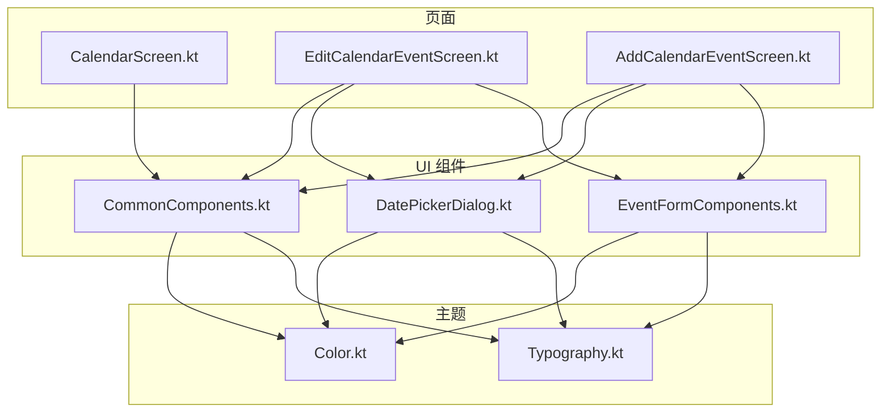
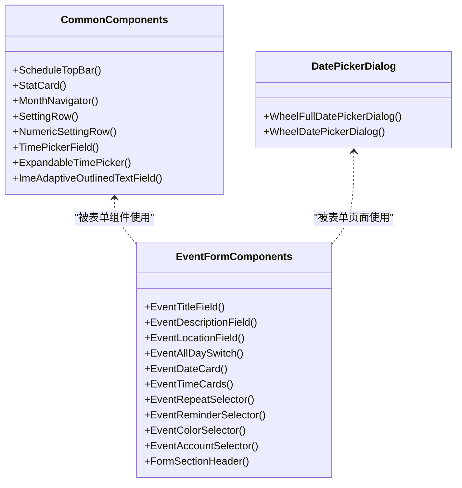
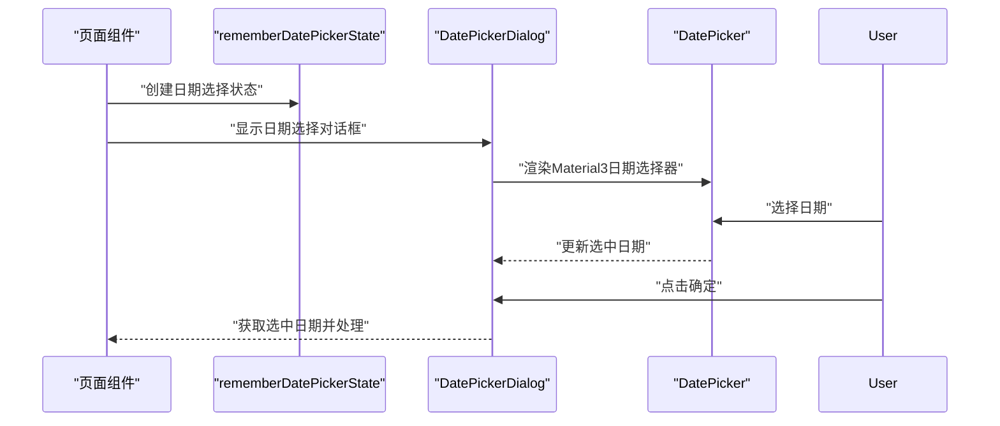
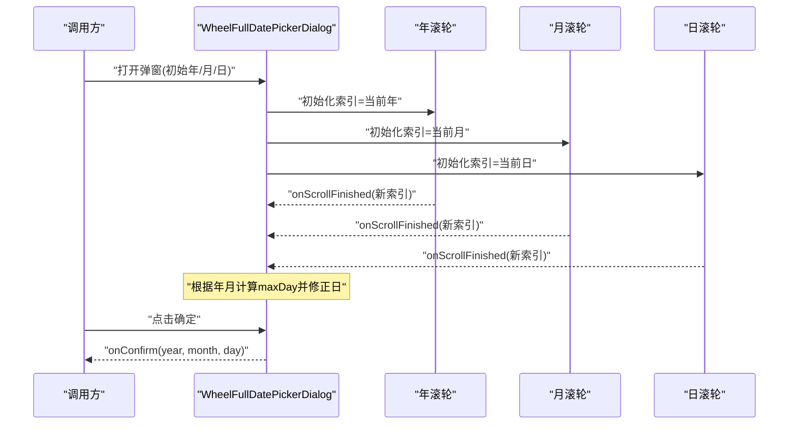
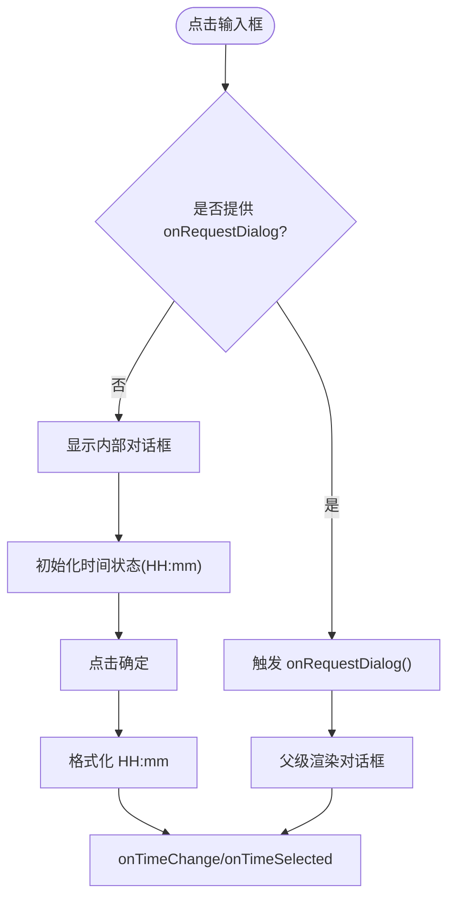
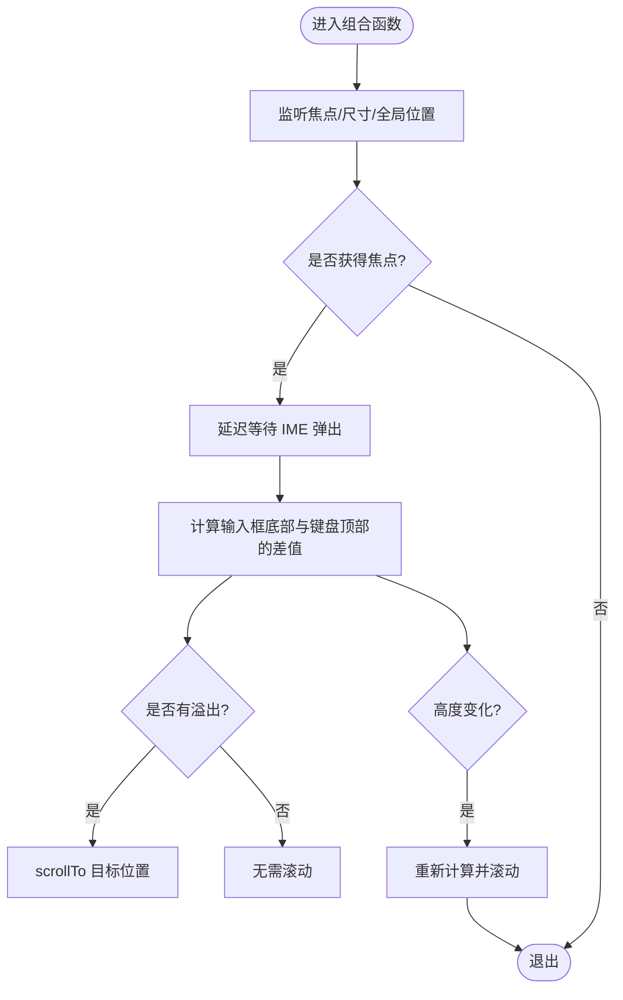
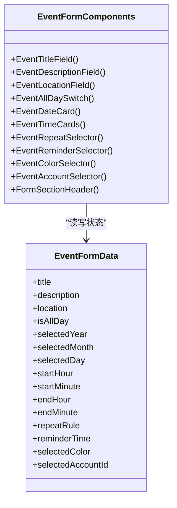
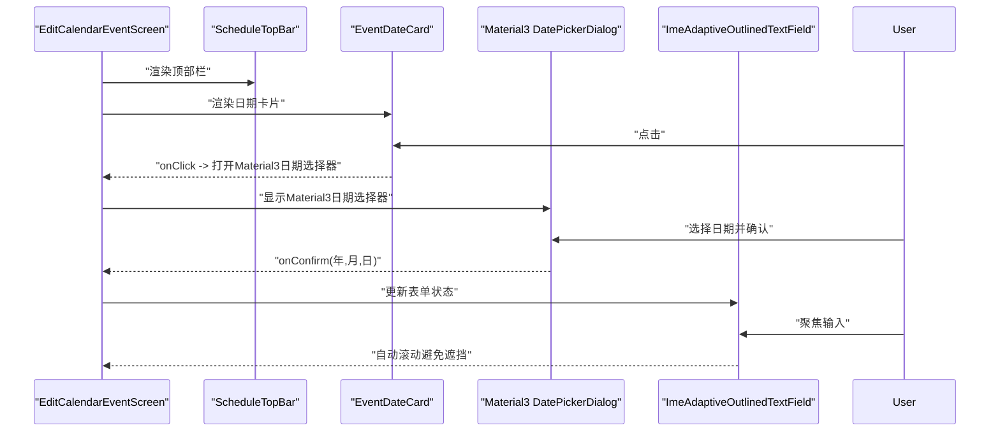
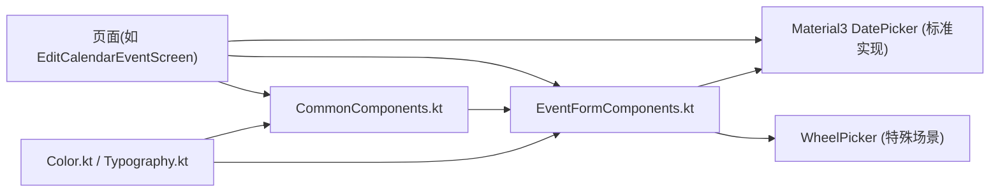

# 通用组件

<cite>
**本文引用的文件**   
- [CommonComponents.kt](file://app/src/main/java/com/schedulecalendar/app/ui/component/CommonComponents.kt)
- [DatePickerDialog.kt](file://app/src/main/java/com/schedulecalendar/app/ui/component/DatePickerDialog.kt)
- [EventFormComponents.kt](file://app/src/main/java/com/schedulecalendar/app/ui/todo/EventFormComponents.kt)
- [Color.kt](file://app/src/main/java/com/schedulecalendar/app/ui/theme/Color.kt)
- [Typography.kt](file://app/src/main/java/com/schedulecalendar/app/ui/theme/Typography.kt)
- [CalendarScreen.kt](file://app/src/main/java/com/schedulecalendar/app/ui/calendar/CalendarScreen.kt)
- [EditCalendarEventScreen.kt](file://app/src/main/java/com/schedulecalendar/app/ui/todo/EditCalendarEventScreen.kt)
- [AddCalendarEventScreen.kt](file://app/src/main/java/com/schedulecalendar/app/ui/todo/AddCalendarEventScreen.kt)
</cite>

## 更新摘要
**所做更改**   
- 移除了自定义日期选择器生成脚本（fix_dp.py）的相关说明
- 更新了日期选择器实现策略，明确优先使用标准Material3日期选择器
- 保留了WheelPicker自定义实现作为特殊场景的备选方案
- 增强了Material3标准日期选择器的使用指南和最佳实践

## 目录
1. [简介](#简介)
2. [项目结构](#项目结构)
3. [核心组件](#核心组件)
4. [架构总览](#架构总览)
5. [详细组件分析](#详细组件分析)
6. [依赖关系分析](#依赖关系分析)
7. [性能与可访问性](#性能与可访问性)
8. [使用示例与开发指南](#使用示例与开发指南)
9. [故障排查](#故障排查)
10. [结论](#结论)

## 简介
本文件面向应用内可复用的 Compose UI 组件，系统性梳理并文档化以下能力：
- **标准Material3日期选择器**的实现与用法（优先推荐）
- WheelPicker自定义日期选择器（特殊场景备用方案）
- 常用表单组件封装（标题、描述、地点、重复规则、提醒时间、颜色选择、账户选择等）
- 基础 UI 组件（顶部栏、统计卡片、月份导航、设置行、数字输入行、时间选择输入框、IME 自适应输入框等）
- 属性配置、事件处理、状态管理策略
- 可访问性与国际化支持现状与建议
- 响应式设计与性能优化建议
- 结合具体页面的集成方式与最佳实践

## 项目结构
通用组件集中在 ui/component 与 ui/todo 的表单子模块中，主题资源在 ui/theme。页面层通过组合这些组件完成复杂交互。

图表来源
- [CommonComponents.kt:1-444](file://app/src/main/java/com/schedulecalendar/app/ui/component/CommonComponents.kt#L1-L444)
- [DatePickerDialog.kt:1-303](file://app/src/main/java/com/schedulecalendar/app/ui/component/DatePickerDialog.kt#L1-L303)
- [EventFormComponents.kt:1-533](file://app/src/main/java/com/schedulecalendar/app/ui/todo/EventFormComponents.kt#L1-L533)
- [Color.kt:1-43](file://app/src/main/java/com/schedulecalendar/app/ui/theme/Color.kt#L1-L43)
- [Typography.kt:1-20](file://app/src/main/java/com/schedulecalendar/app/ui/theme/Typography.kt#L1-L20)
- [CalendarScreen.kt:82-2055](file://app/src/main/java/com/schedulecalendar/app/ui/calendar/CalendarScreen.kt#L82-L2055)
- [EditCalendarEventScreen.kt:125-160](file://app/src/main/java/com/schedulecalendar/app/ui/todo/EditCalendarEventScreen.kt#L125-L160)
- [AddCalendarEventScreen.kt:243-274](file://app/src/main/java/com/schedulecalendar/app/ui/todo/AddCalendarEventScreen.kt#L243-L274)

章节来源
- [CommonComponents.kt:1-444](file://app/src/main/java/com/schedulecalendar/app/ui/component/CommonComponents.kt#L1-L444)
- [DatePickerDialog.kt:1-303](file://app/src/main/java/com/schedulecalendar/app/ui/component/DatePickerDialog.kt#L1-L303)
- [EventFormComponents.kt:1-533](file://app/src/main/java/com/schedulecalendar/app/ui/todo/EventFormComponents.kt#L1-L533)
- [Color.kt:1-43](file://app/src/main/java/com/schedulecalendar/app/ui/theme/Color.kt#L1-L43)
- [Typography.kt:1-20](file://app/src/main/java/com/schedulecalendar/app/ui/theme/Typography.kt#L1-L20)

## 核心组件
本节聚焦通用组件的职责边界与对外 API，便于快速上手与二次扩展。

- 顶部栏与布局辅助
  - ScheduleTopBar：统一顶部导航栏，支持返回按钮与右侧操作区；当标题为空且无操作时不渲染以节省空间。
  - StatCard：信息统计卡片，展示数值与标签，容器色可配置。
  - MonthNavigator：月份切换导航，左右箭头 + 居中年月文本。
  - SettingRow / NumericSettingRow：设置项行与数字输入行，适配 Material3 风格。

- **标准Material3日期选择器（优先推荐）**
  - DatePickerDialog + rememberDatePickerState：Material3标准日期选择器，提供完整的日历视图、日期范围选择、国际化支持。
  - 适用于大多数日期选择场景，具有良好的可访问性和平台一致性。

- **WheelPicker自定义日期选择器（特殊场景备用）**
  - WheelFullDatePickerDialog：年/月/日三列滚轮日期选择弹窗，支持固定最大天数（用于农历等场景）。
  - WheelDatePickerDialog：年/月双列滚轮选择弹窗。
  - 适用于需要特殊历法支持或自定义交互的场景。

- 时间与日期输入
  - TimePickerField：点击弹出时间选择对话框，支持"内部对话框"或"外部触发"两种模式，适合 LazyColumn 场景。
  - ExpandableTimePicker：收起态为带图标按钮的输入框，展开后弹出时间选择对话框。

- IME 自适应输入
  - ImeAdaptiveOutlinedTextField：自动处理软键盘遮挡，支持 Column+verticalScroll 与 LazyColumn 两种滚动场景。

- 表单相关（位于 EventFormComponents.kt）
  - EventTitleField / EventDescriptionField / EventLocationField：统一的输入框封装，内置 IME 自适应。
  - EventAllDaySwitch：全天事件开关。
  - EventDateCard / EventTimeCards：日期与开始/结束时间的卡片式入口。
  - EventRepeatSelector / EventReminderSelector：重复规则与提醒时间的单选弹窗。
  - EventColorSelector：预设颜色选择。
  - EventAccountSelector：日历账户选择（含显示名回退逻辑）。
  - FormSectionHeader：分组标题。

章节来源
- [CommonComponents.kt:38-444](file://app/src/main/java/com/schedulecalendar/app/ui/component/CommonComponents.kt#L38-L444)
- [DatePickerDialog.kt:19-303](file://app/src/main/java/com/schedulecalendar/app/ui/component/DatePickerDialog.kt#L19-L303)
- [EventFormComponents.kt:86-533](file://app/src/main/java/com/schedulecalendar/app/ui/todo/EventFormComponents.kt#L86-L533)

## 架构总览
通用组件遵循"低耦合、高复用"的设计原则：
- 组件仅依赖主题与基础 UI 库，业务逻辑由调用方提供。
- **日期选择器采用分层策略**：优先使用Material3标准实现，特殊场景使用WheelPicker自定义实现。
- 输入框统一封装 IME 自适应，屏蔽平台差异。
- 表单组件以数据类承载状态，配合回调进行双向绑定。

图表来源
- [CommonComponents.kt:38-444](file://app/src/main/java/com/schedulecalendar/app/ui/component/CommonComponents.kt#L38-L444)
- [DatePickerDialog.kt:19-303](file://app/src/main/java/com/schedulecalendar/app/ui/component/DatePickerDialog.kt#L19-L303)
- [EventFormComponents.kt:86-533](file://app/src/main/java/com/schedulecalendar/app/ui/todo/EventFormComponents.kt#L86-L533)

## 详细组件分析

### **标准Material3日期选择器（优先推荐）**
- **功能要点**
  - 使用 `rememberDatePickerState` 管理日期选择状态
  - 提供完整的日历视图，支持日期范围选择
  - 良好的可访问性支持和国际化适配
  - 与Material Design 3规范完全一致
- **关键实现细节**
  - 通过 `DatePickerDialog` 包裹 `DatePicker(state = datePickerState)`
  - 使用 `initialSelectedDateMillis` 设置初始选中日期
  - 确认按钮中处理选中的毫秒值转换为年月日
- **使用建议**
  - 所有常规日期选择场景都应优先使用此实现
  - 无需额外依赖，原生支持Material3设计语言
  - 提供良好的屏幕阅读器支持和键盘导航

**章节来源**
- [EditCalendarEventScreen.kt:241-267](file://app/src/main/java/com/schedulecalendar/app/ui/todo/EditCalendarEventScreen.kt#L241-L267)
- [AddCalendarEventScreen.kt:248-274](file://app/src/main/java/com/schedulecalendar/app/ui/todo/AddCalendarEventScreen.kt#L248-L274)

### **WheelPicker自定义日期选择器（特殊场景备用）**
- **功能要点**
  - 三列滚轮：年/月/日，支持自定义年份列表、月份/日期标签。
  - 动态最大天数：根据所选年月计算当月天数，或通过 fixedMaxDay 覆盖（如农历）。
  - 联动修正：当月份变化导致最大天数减少时，自动将当前日修正至有效范围。
  - 紧凑布局：最大宽度为屏幕 85%，圆角卡片 + 阴影。
- **关键实现细节**
  - 使用 Dialog + Card 包裹，内部 Row 排列三个 WheelTextPicker。
  - 通过 onScrollFinished 同步本地选中值，确认时做边界约束。
  - 月份/日期标签支持传入自定义列表，未传则按默认格式生成。
- **使用建议**
  - 需要农历或特殊历法时，传入 fixedMaxDay 与自定义 dayLabels。
  - 若仅需年/月选择，优先使用 WheelDatePickerDialog。
  - 仅在Material3标准实现无法满足需求时使用。

**章节来源**
- [DatePickerDialog.kt:33-186](file://app/src/main/java/com/schedulecalendar/app/ui/component/DatePickerDialog.kt#L33-L186)
- [CalendarScreen.kt:675-684](file://app/src/main/java/com/schedulecalendar/app/ui/calendar/CalendarScreen.kt#L675-L684)

### 时间选择输入框（TimePickerField / ExpandableTimePicker）
- **功能要点**
  - 只读输入框 + 右侧时间图标，点击弹出时间选择对话框。
  - 支持两种模式：内部对话框（自包含）或外部触发（LazyColumn 友好）。
  - 解析 HH:mm 字符串作为初始值，缺失时使用默认时间。
- **关键实现细节**
  - 使用 rememberTimePickerState 维护小时/分钟，确认后格式化回写。
  - 通过 onRequestDialog 参数控制是否由父级负责对话框生命周期。
- **使用建议**
  - 在列表中使用 ExpandableTimePicker 或 TimePickerField(onRequestDialog) 以避免多实例对话框冲突。

**章节来源**
- [CommonComponents.kt:181-258](file://app/src/main/java/com/schedulecalendar/app/ui/component/CommonComponents.kt#L181-L258)
- [CommonComponents.kt:270-341](file://app/src/main/java/com/schedulecalendar/app/ui/component/CommonComponents.kt#L270-L341)

### IME 自适应输入框（ImeAdaptiveOutlinedTextField）
- **功能要点**
  - 自动处理软键盘遮挡：获得焦点后等待 IME 弹出，精确滚动父容器使输入框下边缘位于键盘上方。
  - 内容增长时再次滚动，保持可见。
  - 支持两类滚动容器：
    - Column + verticalScroll：传入 ScrollState 自动滚动。
    - LazyColumn：通过 onFocused 回调由调用方处理滚动。
- **关键实现细节**
  - 监听 onFocusChanged、onSizeChanged、onGloballyPositioned 获取位置与尺寸。
  - 通过 LocalView.getWindowVisibleDisplayFrame 获取窗口可视区域，计算溢出量并 scrollTo。
- **使用建议**
  - 在长表单中优先使用该组件，避免手动处理键盘遮挡。
  - 在 LazyColumn 中务必实现 onFocused 回调，确保滚动生效。

**章节来源**
- [CommonComponents.kt:355-443](file://app/src/main/java/com/schedulecalendar/app/ui/component/CommonComponents.kt#L355-L443)

### 表单组件集（EventFormComponents）
- **功能要点**
  - 标题/描述/地点输入：统一样式与 IME 自适应。
  - 日期/时间卡片：点击触发对应选择器。
  - 重复规则/提醒时间：单选弹窗，枚举驱动。
  - 颜色选择：预设色板，选中态边框/勾选反馈。
  - 账户选择：显示名回退到账号名，空值兜底。
- **关键实现细节**
  - 所有输入均基于 OutlinedTextField 或自定义卡片包装。
  - 选择器弹窗使用 AlertDialog + RadioGroup 模式。
  - 数据模型 EventFormData 集中承载表单状态。
- **使用建议**
  - 在编辑/新增页面中组合使用上述组件，并通过回调更新上层状态。
  - 对多账户场景，注意 displayName 为空时的回退逻辑。

**章节来源**
- [EventFormComponents.kt:62-80](file://app/src/main/java/com/schedulecalendar/app/ui/todo/EventFormComponents.kt#L62-L80)
- [EventFormComponents.kt:86-533](file://app/src/main/java/com/schedulecalendar/app/ui/todo/EventFormComponents.kt#L86-L533)

### 页面集成示例（EditCalendarEventScreen）
- **集成点**
  - 使用 ScheduleTopBar 作为顶部栏。
  - 使用 EventTitleField、EventDescriptionField、EventLocationField 等表单组件。
  - **使用Material3标准DatePickerDialog**触发日期选择，而非自定义WheelPicker。
  - 使用 ImeAdaptiveOutlinedTextField 的 scrollState 实现滚动跟随。
- **交互流程**
  - 用户点击日期卡片 → 打开Material3日期选择器 → 确认后回填日期。
  - 用户点击时间卡片 → 打开时间选择器 → 确认后回填时间。
  - 输入框获得焦点 → 自动滚动避免遮挡。

**章节来源**
- [EditCalendarEventScreen.kt:241-267](file://app/src/main/java/com/schedulecalendar/app/ui/todo/EditCalendarEventScreen.kt#L241-L267)
- [EventFormComponents.kt:131-200](file://app/src/main/java/com/schedulecalendar/app/ui/todo/EventFormComponents.kt#L131-L200)
- [CommonComponents.kt:355-443](file://app/src/main/java/com/schedulecalendar/app/ui/component/CommonComponents.kt#L355-L443)

## 依赖关系分析
- **组件间依赖**
  - 表单组件依赖通用输入框（ImeAdaptiveOutlinedTextField）。
  - 页面依赖表单组件与日期/时间选择器。
  - 所有组件共享主题（Color、Typography）。
- **外部依赖**
  - **Material3标准日期选择器**：使用系统提供的 DatePicker 组件，无需额外依赖。
  - WheelPicker自定义实现：使用第三方库 wheel-picker-compose（在 DatePickerDialog.kt 中引入）。
  - 时间选择使用 Material3 TimePicker。

**图表来源**
- [Color.kt:1-43](file://app/src/main/java/com/schedulecalendar/app/ui/theme/Color.kt#L1-L43)
- [Typography.kt:1-20](file://app/src/main/java/com/schedulecalendar/app/ui/theme/Typography.kt#L1-L20)
- [CommonComponents.kt:1-444](file://app/src/main/java/com/schedulecalendar/app/ui/component/CommonComponents.kt#L1-L444)
- [EventFormComponents.kt:1-533](file://app/src/main/java/com/schedulecalendar/app/ui/todo/EventFormComponents.kt#L1-L533)
- [DatePickerDialog.kt:1-303](file://app/src/main/java/com/schedulecalendar/app/ui/component/DatePickerDialog.kt#L1-L303)
- [EditCalendarEventScreen.kt:241-267](file://app/src/main/java/com/schedulecalendar/app/ui/todo/EditCalendarEventScreen.kt#L241-L267)

**章节来源**
- [Color.kt:1-43](file://app/src/main/java/com/schedulecalendar/app/ui/theme/Color.kt#L1-L43)
- [Typography.kt:1-20](file://app/src/main/java/com/schedulecalendar/app/ui/theme/Typography.kt#L1-L20)
- [CommonComponents.kt:1-444](file://app/src/main/java/com/schedulecalendar/app/ui/component/CommonComponents.kt#L1-L444)
- [EventFormComponents.kt:1-533](file://app/src/main/java/com/schedulecalendar/app/ui/todo/EventFormComponents.kt#L1-L533)
- [DatePickerDialog.kt:1-303](file://app/src/main/java/com/schedulecalendar/app/ui/component/DatePickerDialog.kt#L1-L303)
- [EditCalendarEventScreen.kt:241-267](file://app/src/main/java/com/schedulecalendar/app/ui/todo/EditCalendarEventScreen.kt#L241-L267)

## 性能与可访问性
- **性能优化建议**
  - **优先使用Material3标准日期选择器**，避免额外的第三方依赖和自定义实现开销。
  - 列表中的时间/日期选择器建议使用 ExpandableTimePicker 或 TimePickerField(onRequestDialog)，避免多个对话框同时存在导致的内存与绘制压力。
  - WheelPicker自定义实现中 maxDay 的计算使用 remember 缓存，避免频繁重建。
  - 输入框的 IME 自适应仅在焦点变化与高度变化时触发滚动，减少不必要的重排。
- **可访问性现状与建议**
  - **Material3标准日期选择器**具有良好的可访问性支持，包括屏幕阅读器支持和键盘导航。
  - WheelPicker自定义实现部分图标按钮已提供 contentDescription（如时间选择图标），但仍有部分未设置，建议补充以提升屏幕阅读器体验。
  - 建议在关键交互元素上添加 semantics 描述，明确控件用途与当前状态。
- **国际化支持现状与建议**
  - **Material3标准日期选择器**自动适配系统语言和地区设置。
  - WheelPicker自定义实现中存在硬编码中文文案（如"取消""确定"），建议迁移至 strings.xml 并通过 LocalContext.getString 读取。
  - 月份/日期标签可根据 Locale 自动生成，提升多语言适配度。
- **响应式设计适配**
  - **Material3标准日期选择器**自动适配不同屏幕尺寸和方向。
  - WheelPicker自定义实现最大宽度为屏幕 85%，在小屏设备上仍保持良好可读性。
  - 表单组件使用 fillMaxWidth 与权重分配，适配不同屏幕尺寸。

## 使用示例与开发指南
- **在页面中使用Material3标准日期选择器（推荐）**
  - 参考路径：[EditCalendarEventScreen.kt:241-267](file://app/src/main/java/com/schedulecalendar/app/ui/todo/EditCalendarEventScreen.kt#L241-L267)
- **在特殊场景中使用WheelPicker自定义日期选择器**
  - 参考路径：[CalendarScreen.kt:675-684](file://app/src/main/java/com/schedulecalendar/app/ui/calendar/CalendarScreen.kt#L675-L684)、[DatePickerDialog.kt:33-186](file://app/src/main/java/com/schedulecalendar/app/ui/component/DatePickerDialog.kt#L33-L186)
- **在表单中使用日期选择卡片**
  - 参考路径：[EventFormComponents.kt:131-158](file://app/src/main/java/com/schedulecalendar/app/ui/todo/EventFormComponents.kt#L131-L158)
- **在列表中使用时间选择器**
  - 参考路径：[CommonComponents.kt:181-258](file://app/src/main/java/com/schedulecalendar/app/ui/component/CommonComponents.kt#L181-L258)
- **使用 IME 自适应输入框**
  - 参考路径：[EventFormComponents.kt:88-105](file://app/src/main/java/com/schedulecalendar/app/ui/todo/EventFormComponents.kt#L88-L105)、[CommonComponents.kt:355-443](file://app/src/main/java/com/schedulecalendar/app/ui/component/CommonComponents.kt#L355-L443)
- **主题与排版**
  - 参考路径：[Color.kt:1-43](file://app/src/main/java/com/schedulecalendar/app/ui/theme/Color.kt#L1-L43)、[Typography.kt:1-20](file://app/src/main/java/com/schedulecalendar/app/ui/theme/Typography.kt#L1-L20)

**章节来源**
- [EditCalendarEventScreen.kt:241-267](file://app/src/main/java/com/schedulecalendar/app/ui/todo/EditCalendarEventScreen.kt#L241-L267)
- [EventFormComponents.kt:88-158](file://app/src/main/java/com/schedulecalendar/app/ui/todo/EventFormComponents.kt#L88-L158)
- [DatePickerDialog.kt:33-186](file://app/src/main/java/com/schedulecalendar/app/ui/component/DatePickerDialog.kt#L33-L186)
- [CalendarScreen.kt:675-684](file://app/src/main/java/com/schedulecalendar/app/ui/calendar/CalendarScreen.kt#L675-L684)
- [CommonComponents.kt:181-258](file://app/src/main/java/com/schedulecalendar/app/ui/component/CommonComponents.kt#L181-L258)
- [CommonComponents.kt:355-443](file://app/src/main/java/com/schedulecalendar/app/ui/component/CommonComponents.kt#L355-L443)
- [Color.kt:1-43](file://app/src/main/java/com/schedulecalendar/app/ui/theme/Color.kt#L1-L43)
- [Typography.kt:1-20](file://app/src/main/java/com/schedulecalendar/app/ui/theme/Typography.kt#L1-L20)

## 故障排查
- **日期选择器中日数异常**
  - 现象：切换到小月（如二月）后，原日大于当月最大天数。
  - 原因：maxDay 随年月变化，需修正 snappedDay。
  - 解决：组件已在 LaunchedEffect(maxDay) 中自动收窄日值；若自定义 fixedMaxDay，请确保其与实际天数一致。
  - 参考路径：[DatePickerDialog.kt:56-68](file://app/src/main/java/com/schedulecalendar/app/ui/component/DatePickerDialog.kt#L56-L68)
- **时间选择器无法关闭或重复打开**
  - 现象：在列表中多次点击时间输入框，出现多个对话框。
  - 原因：未使用外部触发模式。
  - 解决：使用 TimePickerField(onRequestDialog) 或 ExpandableTimePicker，由父级统一管理对话框生命周期。
  - 参考路径：[CommonComponents.kt:181-258](file://app/src/main/java/com/schedulecalendar/app/ui/component/CommonComponents.kt#L181-L258)
- **输入框被键盘遮挡**
  - 现象：聚焦输入框后，键盘遮挡输入区域。
  - 原因：未启用 IME 自适应或未正确传入滚动状态。
  - 解决：使用 ImeAdaptiveOutlinedTextField，并在 Column 场景传入 scrollState，在 LazyColumn 场景实现 onFocused。
  - 参考路径：[CommonComponents.kt:355-443](file://app/src/main/java/com/schedulecalendar/app/ui/component/CommonComponents.kt#L355-L443)
- **Material3日期选择器相关问题**
  - 现象：日期选择器显示异常或状态不同步。
  - 原因：rememberDatePickerState 未正确使用或初始值设置错误。
  - 解决：确保使用 rememberDatePickerState(initialSelectedDateMillis = ...) 正确初始化，并在确认按钮中正确处理 selectedDateMillis。
  - 参考路径：[EditCalendarEventScreen.kt:243-257](file://app/src/main/java/com/schedulecalendar/app/ui/todo/EditCalendarEventScreen.kt#L243-L257)

**章节来源**
- [DatePickerDialog.kt:56-68](file://app/src/main/java/com/schedulecalendar/app/ui/component/DatePickerDialog.kt#L56-L68)
- [CommonComponents.kt:181-258](file://app/src/main/java/com/schedulecalendar/app/ui/component/CommonComponents.kt#L181-L258)
- [CommonComponents.kt:355-443](file://app/src/main/java/com/schedulecalendar/app/ui/component/CommonComponents.kt#L355-L443)
- [EditCalendarEventScreen.kt:243-257](file://app/src/main/java/com/schedulecalendar/app/ui/todo/EditCalendarEventScreen.kt#L243-L257)

## 结论
本项目在通用 UI 组件层面实现了良好的模块化与复用性，并采用了更优的技术选型：
- **优先使用Material3标准日期选择器**，提供更好的用户体验、可访问性和维护性。
- WheelPicker自定义实现作为特殊场景的备用方案，满足特定需求。
- 表单组件围绕数据模型组织，状态清晰、回调明确。
- IME 自适应输入框解决了移动端常见的键盘遮挡问题。
- 主题与排版统一，便于整体视觉一致性。
- **移除了自定义日期选择器生成脚本**，简化了项目结构和维护成本。

后续可在可访问性与国际化方面进一步完善，以获得更好的用户体验与多语言支持。