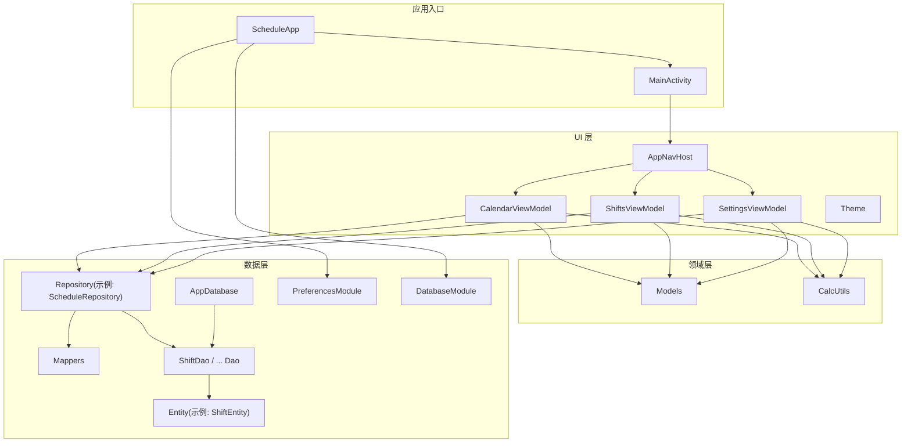
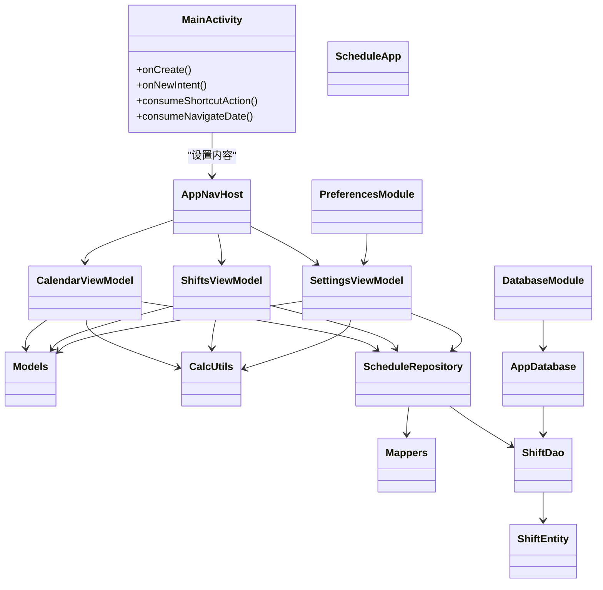
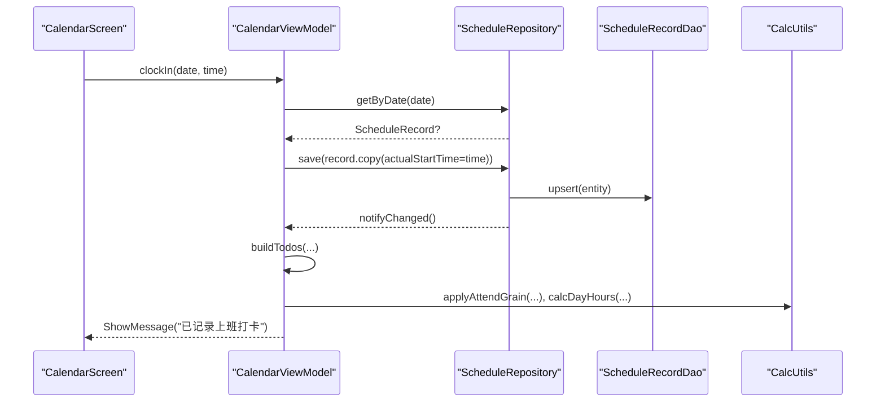
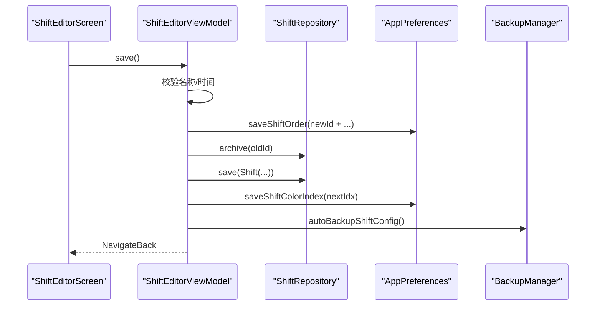
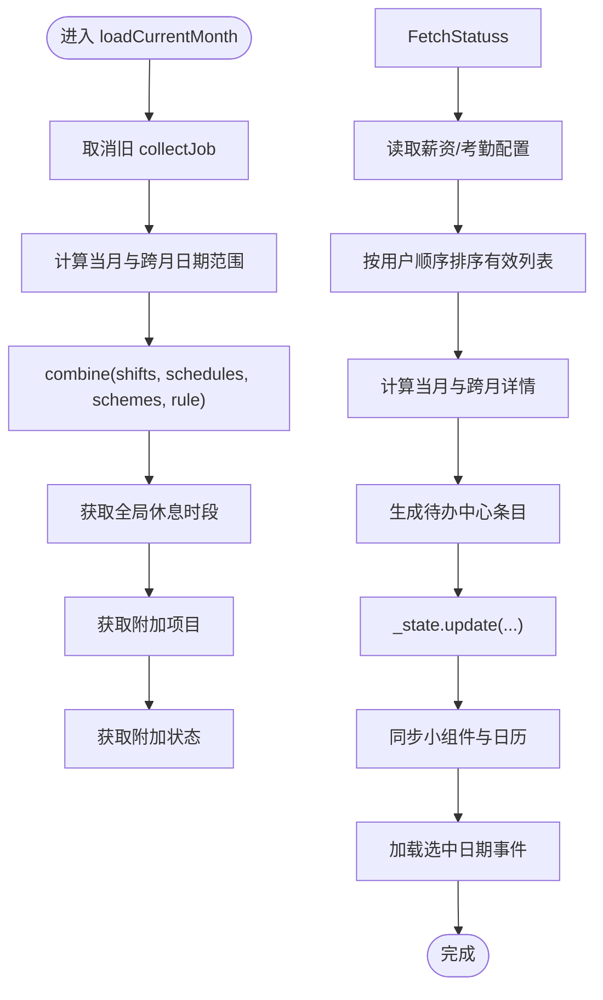
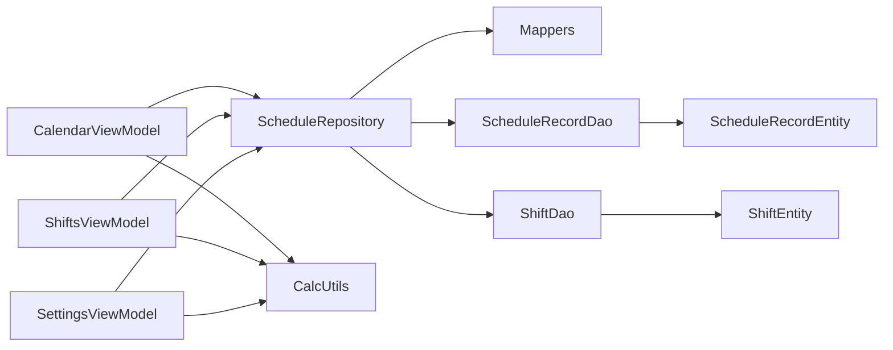

# 代码规范

<cite>
**本文引用的文件**   
- [MainActivity.kt](file://app/src/main/java/com/schedulecalendar/app/MainActivity.kt)
- [ScheduleApp.kt](file://app/src/main/java/com/schedulecalendar/app/ScheduleApp.kt)
- [AppDatabase.kt](file://app/src/main/java/com/schedulecalendar/app/data/db/AppDatabase.kt)
- [ShiftEntity.kt](file://app/src/main/java/com/schedulecalendar/app/data/db/entity/ShiftEntity.kt)
- [ShiftDao.kt](file://app/src/main/java/com/schedulecalendar/app/data/db/dao/ShiftDao.kt)
- [Mappers.kt](file://app/src/main/java/com/schedulecalendar/app/data/repository/Mappers.kt)
- [ScheduleRepository.kt](file://app/src/main/java/com/schedulecalendar/app/data/repository/ScheduleRepository.kt)
- [Models.kt](file://app/src/main/java/com/schedulecalendar/app/domain/model/Models.kt)
- [CalcUtils.kt](file://app/src/main/java/com/schedulecalendar/app/domain/model/CalcUtils.kt)
- [CalendarViewModel.kt](file://app/src/main/java/com/schedulecalendar/app/ui/calendar/CalendarViewModel.kt)
- [ShiftsViewModel.kt](file://app/src/main/java/com/schedulecalendar/app/ui/shifts/ShiftsViewModel.kt)
- [SettingsViewModel.kt](file://app/src/main/java/com/schedulecalendar/app/ui/settings/SettingsViewModel.kt)
- [AppNavHost.kt](file://app/src/main/java/com/schedulecalendar/app/ui/navigation/AppNavHost.kt)
- [Theme.kt](file://app/src/main/java/com/schedulecalendar/app/ui/theme/Theme.kt)
- [DatabaseModule.kt](file://app/src/main/java/com/schedulecalendar/app/di/DatabaseModule.kt)
- [PreferencesModule.kt](file://app/src/main/java/com/schedulecalendar/app/di/PreferencesModule.kt)
- [TodoScreen.kt](file://app/src/main/java/com/schedulecalendar/app/ui/todo/TodoScreen.kt)
- [AddAnniversaryScreen.kt](file://app/src/main/java/com/schedulecalendar/app/ui/todo/AddAnniversaryScreen.kt)
- [CommonComponents.kt](file://app/src/main/java/com/schedulecalendar/app/ui/component/CommonComponents.kt)
- [StatisticsScreen.kt](file://app/src/main/java/com/schedulecalendar/app/ui/statistics/StatisticsScreen.kt)
- [StorageScreen.kt](file://app/src/main/java/com/schedulecalendar/app/ui/settings/StorageScreen.kt)
- [DisplaySchemesScreen.kt](file://app/src/main/java/com/schedulecalendar/app/ui/detail/DisplaySchemesScreen.kt)
</cite>

## 更新摘要
**变更内容**   
- 新增图标系统现代化规范章节，详细说明 AutoMirrored Material Icons 的使用标准
- 更新 UI 组件图标使用示例，展示 RTL 语言支持的最佳实践
- 补充图标选择指南和反模式规避方法
- 更新相关代码示例和审查检查点

## 目录
1. [引言](#引言)
2. [项目结构](#项目结构)
3. [核心组件](#核心组件)
4. [架构总览](#架构总览)
5. [详细组件分析](#详细组件分析)
6. [依赖关系分析](#依赖关系分析)
7. [性能考量](#性能考量)
8. [故障排查指南](#故障排查指南)
9. [结论](#结论)
10. [附录](#附录)

## 引言
本规范面向 Android 排班日历应用的 Kotlin 编码标准，覆盖命名约定、注释规范、文件组织结构、MVVM 分层编写标准、异常处理与日志记录、性能优化最佳实践，以及代码审查检查点与常见反模式规避。文档以仓库实际实现为依据，结合典型类与流程进行说明，帮助团队在统一风格下高效协作与维护。

## 项目结构
本项目采用按功能域分层的组织方式：
- app/src/main/java/com/schedulecalendar/app
  - data：数据层（Room 数据库、DAO、Entity、Repository、偏好设置）
  - domain：领域模型与计算逻辑
  - ui：UI 层（Compose Screen、ViewModel、导航、主题）
  - di：依赖注入模块（Hilt）
  - widget：桌面小组件
  - reminder：提醒相关组件
  - calendar/auth：系统日历集成
- res：资源与清单
- gradle：构建配置



图表来源
- [ScheduleApp.kt:1-9](file://app/src/main/java/com/schedulecalendar/app/ScheduleApp.kt#L1-L9)
- [MainActivity.kt:1-105](file://app/src/main/java/com/schedulecalendar/app/MainActivity.kt#L1-L105)
- [AppNavHost.kt:1-133](file://app/src/main/java/com/schedulecalendar/app/ui/navigation/AppNavHost.kt#L1-L133)
- [CalendarViewModel.kt:1-800](file://app/src/main/java/com/schedulecalendar/app/ui/calendar/CalendarViewModel.kt#L1-L800)
- [ShiftsViewModel.kt:1-455](file://app/src/main/java/com/schedulecalendar/app/ui/shifts/ShiftsViewModel.kt#L1-L455)
- [SettingsViewModel.kt:1-91](file://app/src/main/java/com/schedulecalendar/app/ui/settings/SettingsViewModel.kt#L1-L91)
- [Models.kt:1-277](file://app/src/main/java/com/schedulecalendar/app/domain/model/Models.kt#L1-L277)
- [CalcUtils.kt:1-536](file://app/src/main/java/com/schedulecalendar/app/domain/model/CalcUtils.kt#L1-L536)
- [ScheduleRepository.kt:1-40](file://app/src/main/java/com/schedulecalendar/app/data/repository/ScheduleRepository.kt#L1-L40)
- [Mappers.kt:1-134](file://app/src/main/java/com/schedulecalendar/app/data/repository/Mappers.kt#L1-L134)
- [AppDatabase.kt:1-35](file://app/src/main/java/com/schedulecalendar/app/data/db/AppDatabase.kt#L1-L35)
- [ShiftDao.kt:1-42](file://app/src/main/java/com/schedulecalendar/app/data/db/dao/ShiftDao.kt#L1-L42)
- [ShiftEntity.kt:1-24](file://app/src/main/java/com/schedulecalendar/app/data/db/entity/ShiftEntity.kt#L1-L24)
- [DatabaseModule.kt:1-35](file://app/src/main/java/com/schedulecalendar/app/di/DatabaseModule.kt#L1-L35)
- [PreferencesModule.kt:1-21](file://app/src/main/java/com/schedulecalendar/app/di/PreferencesModule.kt#L1-L21)

章节来源
- [ScheduleApp.kt:1-9](file://app/src/main/java/com/schedulecalendar/app/ScheduleApp.kt#L1-L9)
- [MainActivity.kt:1-105](file://app/src/main/java/com/schedulecalendar/app/MainActivity.kt#L1-L105)
- [AppNavHost.kt:1-133](file://app/src/main/java/com/schedulecalendar/app/ui/navigation/AppNavHost.kt#L1-L133)

## 核心组件
- 应用入口与主题
  - Application 使用 Hilt 初始化；Activity 负责 Edge-to-Edge 与 Compose 根布局；主题支持动态取色与预览兼容。
- 导航
  - 基于 Navigation Compose 的类型安全路由与底部 Tab 管理。
- 领域模型与计算
  - 统一的领域数据类与枚举；纯函数化的工时/薪资计算工具。
- ViewModel
  - 使用 StateFlow/Channel 暴露状态与一次性事件；协程作用域统一管理；通过 Repository 访问数据。
- 数据层
  - Room + DAO + Entity；Repository 负责 Domain 与 Entity 映射；Hilt 提供单例数据库与 DAO。

章节来源
- [Theme.kt:1-76](file://app/src/main/java/com/schedulecalendar/app/ui/theme/Theme.kt#L1-L76)
- [AppNavHost.kt:1-133](file://app/src/main/java/com/schedulecalendar/app/ui/navigation/AppNavHost.kt#L1-L133)
- [Models.kt:1-277](file://app/src/main/java/com/schedulecalendar/app/domain/model/Models.kt#L1-L277)
- [CalcUtils.kt:1-536](file://app/src/main/java/com/schedulecalendar/app/domain/model/CalcUtils.kt#L1-L536)
- [CalendarViewModel.kt:1-800](file://app/src/main/java/com/schedulecalendar/app/ui/calendar/CalendarViewModel.kt#L1-L800)
- [ShiftsViewModel.kt:1-455](file://app/src/main/java/com/schedulecalendar/app/ui/shifts/ShiftsViewModel.kt#L1-L455)
- [SettingsViewModel.kt:1-91](file://app/src/main/java/com/schedulecalendar/app/ui/settings/SettingsViewModel.kt#L1-L91)
- [ScheduleRepository.kt:1-40](file://app/src/main/java/com/schedulecalendar/app/data/repository/ScheduleRepository.kt#L1-L40)
- [Mappers.kt:1-134](file://app/src/main/java/com/schedulecalendar/app/data/repository/Mappers.kt#L1-L134)
- [AppDatabase.kt:1-35](file://app/src/main/java/com/schedulecalendar/app/data/db/AppDatabase.kt#L1-L35)
- [ShiftDao.kt:1-42](file://app/src/main/java/com/schedulecalendar/app/data/db/dao/ShiftDao.kt#L1-L42)
- [ShiftEntity.kt:1-24](file://app/src/main/java/com/schedulecalendar/app/data/db/entity/ShiftEntity.kt#L1-L24)
- [DatabaseModule.kt:1-35](file://app/src/main/java/com/schedulecalendar/app/di/DatabaseModule.kt#L1-L35)
- [PreferencesModule.kt:1-21](file://app/src/main/java/com/schedulecalendar/app/di/PreferencesModule.kt#L1-L21)

## 架构总览
MVVM + Clean-ish 分层：
- UI 层：Screen + ViewModel + Navigation + Theme
- 领域层：Domain Model + 计算工具
- 数据层：Repository + Mappers + DAO + Entity + Preferences
- DI：Hilt 模块提供 Database 与 Preferences



图表来源
- [MainActivity.kt:1-105](file://app/src/main/java/com/schedulecalendar/app/MainActivity.kt#L1-L105)
- [ScheduleApp.kt:1-9](file://app/src/main/java/com/schedulecalendar/app/ScheduleApp.kt#L1-L9)
- [AppNavHost.kt:1-133](file://app/src/main/java/com/schedulecalendar/app/ui/navigation/AppNavHost.kt#L1-L133)
- [CalendarViewModel.kt:1-800](file://app/src/main/java/com/schedulecalendar/app/ui/calendar/CalendarViewModel.kt#L1-L800)
- [ShiftsViewModel.kt:1-455](file://app/src/main/java/com/schedulecalendar/app/ui/shifts/ShiftsViewModel.kt#L1-L455)
- [SettingsViewModel.kt:1-91](file://app/src/main/java/com/schedulecalendar/app/ui/settings/SettingsViewModel.kt#L1-L91)
- [Models.kt:1-277](file://app/src/main/java/com/schedulecalendar/app/domain/model/Models.kt#L1-L277)
- [CalcUtils.kt:1-536](file://app/src/main/java/com/schedulecalendar/app/domain/model/CalcUtils.kt#L1-L536)
- [ScheduleRepository.kt:1-40](file://app/src/main/java/com/schedulecalendar/app/data/repository/ScheduleRepository.kt#L1-L40)
- [Mappers.kt:1-134](file://app/src/main/java/com/schedulecalendar/app/data/repository/Mappers.kt#L1-L134)
- [AppDatabase.kt:1-35](file://app/src/main/java/com/schedulecalendar/app/data/db/AppDatabase.kt#L1-L35)
- [ShiftDao.kt:1-42](file://app/src/main/java/com/schedulecalendar/app/data/db/dao/ShiftDao.kt#L1-L42)
- [ShiftEntity.kt:1-24](file://app/src/main/java/com/schedulecalendar/app/data/db/entity/ShiftEntity.kt#L1-L24)
- [DatabaseModule.kt:1-35](file://app/src/main/java/com/schedulecalendar/app/di/DatabaseModule.kt#L1-L35)
- [PreferencesModule.kt:1-21](file://app/src/main/java/com/schedulecalendar/app/di/PreferencesModule.kt#L1-L21)

## 详细组件分析

### 命名约定
- 包名
  - 全小写，层级清晰：com.schedulecalendar.app.{data|domain|ui|di}
- 类名
  - 大驼峰，语义明确：CalendarViewModel、ShiftsViewModel、SettingsViewModel、AppDatabase、ShiftDao、ShiftEntity、ScheduleRepository、Mappers、CalcUtils、AppNavHost、Theme
- 方法名
  - 动词开头或描述性短语：goToPrevMonth、saveSalaryConfig、observeByRange、toDomain、toEntity、applyAttendGrain、calcDayHours、getMonthScheduleDetails
- 变量名
  - 小驼峰，简洁可读：state、uiEvent、collectJob、shiftOrder、statusOrder、breakOrder
- 常量名
  - 全大写+下划线：BUILTIN_SHIFT_REST、NO_SCHEME_ID、ACTION_CLOCK_IN、EXTRA_NAVIGATE_DATE
- 文件命名
  - 与主要类同名，Kotlin 文件 .kt，如 CalendarViewModel.kt、ShiftsViewModel.kt、Models.kt、CalcUtils.kt、AppDatabase.kt、ShiftDao.kt、ShiftEntity.kt、Mappers.kt、ScheduleRepository.kt、AppNavHost.kt、Theme.kt、DatabaseModule.kt、PreferencesModule.kt、MainActivity.kt、ScheduleApp.kt

章节来源
- [Models.kt:1-277](file://app/src/main/java/com/schedulecalendar/app/domain/model/Models.kt#L1-L277)
- [MainActivity.kt:1-105](file://app/src/main/java/com/schedulecalendar/app/MainActivity.kt#L1-L105)
- [CalendarViewModel.kt:1-800](file://app/src/main/java/com/schedulecalendar/app/ui/calendar/CalendarViewModel.kt#L1-L800)
- [ShiftsViewModel.kt:1-455](file://app/src/main/java/com/schedulecalendar/app/ui/shifts/ShiftsViewModel.kt#L1-L455)
- [SettingsViewModel.kt:1-91](file://app/src/main/java/com/schedulecalendar/app/ui/settings/SettingsViewModel.kt#L1-L91)
- [AppDatabase.kt:1-35](file://app/src/main/java/com/schedulecalendar/app/data/db/AppDatabase.kt#L1-L35)
- [ShiftDao.kt:1-42](file://app/src/main/java/com/schedulecalendar/app/data/db/dao/ShiftDao.kt#L1-L42)
- [ShiftEntity.kt:1-24](file://app/src/main/java/com/schedulecalendar/app/data/db/entity/ShiftEntity.kt#L1-L24)
- [Mappers.kt:1-134](file://app/src/main/java/com/schedulecalendar/app/data/repository/Mappers.kt#L1-L134)
- [ScheduleRepository.kt:1-40](file://app/src/main/java/com/schedulecalendar/app/data/repository/ScheduleRepository.kt#L1-L40)
- [AppNavHost.kt:1-133](file://app/src/main/java/com/schedulecalendar/app/ui/navigation/AppNavHost.kt#L1-L133)
- [Theme.kt:1-76](file://app/src/main/java/com/schedulecalendar/app/ui/theme/Theme.kt#L1-L76)
- [DatabaseModule.kt:1-35](file://app/src/main/java/com/schedulecalendar/app/di/DatabaseModule.kt#L1-L35)
- [PreferencesModule.kt:1-21](file://app/src/main/java/com/schedulecalendar/app/di/PreferencesModule.kt#L1-L21)

### 注释规范
- 文件头注释
  - 每个文件顶部包含简短说明与路径注释，便于定位。
- 方法与复杂逻辑注释
  - 对关键算法（如考勤粒度处理、跨天时间归一化、月统计汇总）提供行内注释，解释边界条件与取舍。
- 业务常量注释
  - 内置类型、默认值等常量需附带用途说明。

章节来源
- [CalcUtils.kt:1-536](file://app/src/main/java/com/schedulecalendar/app/domain/model/CalcUtils.kt#L1-L536)
- [Models.kt:1-277](file://app/src/main/java/com/schedulecalendar/app/domain/model/Models.kt#L1-L277)
- [AppDatabase.kt:1-35](file://app/src/main/java/com/schedulecalendar/app/data/db/AppDatabase.kt#L1-L35)

### 文件组织结构
- 包结构
  - data.db.entity：实体定义
  - data.db.dao：数据访问接口
  - data.repository：仓储与映射
  - domain.model：领域模型与计算
  - ui.navigation：导航与路由
  - ui.theme：主题与颜色
  - di：依赖注入模块
- 文件命名
  - 单一职责，文件名与主类一致，避免多类同文件造成混淆。

章节来源
- [AppDatabase.kt:1-35](file://app/src/main/java/com/schedulecalendar/app/data/db/AppDatabase.kt#L1-L35)
- [ShiftDao.kt:1-42](file://app/src/main/java/com/schedulecalendar/app/data/db/dao/ShiftDao.kt#L1-L42)
- [ShiftEntity.kt:1-24](file://app/src/main/java/com/schedulecalendar/app/data/db/entity/ShiftEntity.kt#L1-L24)
- [Mappers.kt:1-134](file://app/src/main/java/com/schedulecalendar/app/data/repository/Mappers.kt#L1-L134)
- [AppNavHost.kt:1-133](file://app/src/main/java/com/schedulecalendar/app/ui/navigation/AppNavHost.kt#L1-L133)
- [Theme.kt:1-76](file://app/src/main/java/com/schedulecalendar/app/ui/theme/Theme.kt#L1-L76)
- [DatabaseModule.kt:1-35](file://app/src/main/java/com/schedulecalendar/app/di/DatabaseModule.kt#L1-L35)
- [PreferencesModule.kt:1-21](file://app/src/main/java/com/schedulecalendar/app/di/PreferencesModule.kt#L1-L21)

### MVVM 分层规范
- ViewModel
  - 使用 @HiltViewModel 注入依赖；暴露 StateFlow 作为状态源；使用 Channel 发送一次性 UI 事件；所有 IO 操作在 viewModelScope 中执行。
- Repository
  - 封装 DAO 调用与 Domain 映射；对外暴露 Flow/List；写操作后发出变更信号供上层刷新。
- UI 组件
  - Compose Screen 仅消费 ViewModel 的 state 与 uiEvent；不直接访问数据层。
- 依赖注入
  - Hilt Module 提供单例 Database 与 Preferences；@InstallIn(SingletonComponent::class)。

章节来源
- [CalendarViewModel.kt:1-800](file://app/src/main/java/com/schedulecalendar/app/ui/calendar/CalendarViewModel.kt#L1-L800)
- [ShiftsViewModel.kt:1-455](file://app/src/main/java/com/schedulecalendar/app/ui/shifts/ShiftsViewModel.kt#L1-L455)
- [SettingsViewModel.kt:1-91](file://app/src/main/java/com/schedulecalendar/app/ui/settings/SettingsViewModel.kt#L1-L91)
- [ScheduleRepository.kt:1-40](file://app/src/main/java/com/schedulecalendar/app/data/repository/ScheduleRepository.kt#L1-L40)
- [DatabaseModule.kt:1-35](file://app/src/main/java/com/schedulecalendar/app/di/DatabaseModule.kt#L1-L35)
- [PreferencesModule.kt:1-21](file://app/src/main/java/com/schedulecalendar/app/di/PreferencesModule.kt#L1-L21)

### 图标系统现代化规范

**新增** 为提升 RTL（从右到左）语言支持体验，项目已全面采用 AutoMirrored Material Icons 系统。

#### 图标选择原则
- **方向性图标必须使用 AutoMirrored**：箭头、返回按钮、左右导航等具有方向含义的图标应使用 `Icons.AutoMirrored.Filled.*`
- **非方向性图标可使用 Default**：日历、时钟、设置等非方向性图标可使用 `Icons.Default.*`
- **填充样式优先**：优先使用 Filled 样式以获得更好的视觉一致性

#### 具体使用规范

**RTL 友好图标示例：**
```kotlin
// ✅ 正确：使用 AutoMirrored 的方向性图标
Icon(Icons.AutoMirrored.Filled.ArrowBack, contentDescription = "返回")
Icon(Icons.AutoMirrored.Filled.KeyboardArrowLeft, "上月")
Icon(Icons.AutoMirrored.Filled.KeyboardArrowRight, "下月")
Icon(Icons.AutoMirrored.Filled.Undo, "撤销")

// ❌ 错误：方向性图标使用 Default
Icon(Icons.Default.ArrowBack, contentDescription = "返回")
Icon(Icons.Default.ChevronLeft, null)
Icon(Icons.Default.ChevronRight, null)
```

**非方向性图标示例：**
```kotlin
// ✅ 正确：非方向性图标使用 Default
Icon(Icons.Default.CalendarToday, null)
Icon(Icons.Default.AccessTime, contentDescription = "选择时间")
Icon(Icons.Default.Event, null)
Icon(Icons.Default.Delete, null)

// ✅ 也可使用 Filled 样式
Icon(Icons.Filled.Check, contentDescription = "当前方案")
Icon(Icons.Filled.Edit, "编辑")
```

#### 导入规范
```kotlin
// 推荐：分别导入 AutoMirrored 和 Default
import androidx.compose.material.icons.Icons
import androidx.compose.material.icons.automirrored.filled.*
import androidx.compose.material.icons.filled.*

// 避免：通配符导入可能导致命名冲突
import androidx.compose.material.icons.*
```

#### 实际应用示例

**月份导航按钮：**
```kotlin
// TodoScreen.kt 中的月份导航
IconButton(onClick = { vm.goToPrevMonth() }) {
    Icon(Icons.AutoMirrored.Filled.KeyboardArrowLeft, "上月")
}
IconButton(onClick = { vm.goToNextMonth() }) {
    Icon(Icons.AutoMirrored.Filled.KeyboardArrowRight, "下月")
}
```

**返回按钮：**
```kotlin
// CommonComponents.kt 中的通用返回按钮
IconButton(onClick = onBack) {
    Icon(Icons.AutoMirrored.Filled.ArrowBack, contentDescription = "返回")
}
```

**待办操作图标：**
```kotlin
// TodoScreen.kt 中的撤销操作
actionIcon = Icons.AutoMirrored.Filled.Undo
```

**纪念日创建界面：**
```kotlin
// AddAnniversaryScreen.kt 中的备注输入框
leadingIcon = { Icon(Icons.AutoMirrored.Filled.Notes, null) }
```

#### 图标使用检查清单
- [ ] 所有方向性图标是否使用了 AutoMirrored 版本？
- [ ] 箭头、返回、左右导航等图标是否正确镜像？
- [ ] 非方向性图标是否保持了视觉一致性？
- [ ] 图标描述文本是否符合无障碍要求？
- [ ] 图标大小和颜色是否与主题保持一致？

章节来源
- [TodoScreen.kt:272-300](file://app/src/main/java/com/schedulecalendar/app/ui/todo/TodoScreen.kt#L272-L300)
- [TodoScreen.kt:353-392](file://app/src/main/java/com/schedulecalendar/app/ui/todo/TodoScreen.kt#L353-L392)
- [AddAnniversaryScreen.kt:406](file://app/src/main/java/com/schedulecalendar/app/ui/todo/AddAnniversaryScreen.kt#L406)
- [CommonComponents.kt:54](file://app/src/main/java/com/schedulecalendar/app/ui/component/CommonComponents.kt#L54)
- [CommonComponents.kt:120-123](file://app/src/main/java/com/schedulecalendar/app/ui/component/CommonComponents.kt#L120-L123)
- [StatisticsScreen.kt:55-66](file://app/src/main/java/com/schedulecalendar/app/ui/statistics/StatisticsScreen.kt#L55-L66)

### 异常处理与错误反馈
- 使用 runCatching 包裹可能失败的操作，统一 onFailure 分支发送 ShowError 事件。
- 一次性 UI 事件通过 Channel 传递，避免重复显示。
- 数据清空、导入导出等高风险操作需二次确认并给出结果反馈。

章节来源
- [ShiftsViewModel.kt:1-455](file://app/src/main/java/com/schedulecalendar/app/ui/shifts/ShiftsViewModel.kt#L1-L455)
- [SettingsViewModel.kt:1-91](file://app/src/main/java/com/schedulecalendar/app/ui/settings/SettingsViewModel.kt#L1-L91)
- [CalendarViewModel.kt:1-800](file://app/src/main/java/com/schedulecalendar/app/ui/calendar/CalendarViewModel.kt#L1-L800)

### 日志记录
- 当前未引入第三方日志库，建议在关键路径添加结构化日志（例如写入本地文件或系统日志），并在 Release 版本关闭敏感信息输出。
- 建议为 Repository 与计算工具增加可开关的调试日志，便于问题定位。

[本节为通用指导，无需具体文件引用]

### 性能优化最佳实践
- 列表排序与合并使用 combine 与 stateIn，减少不必要的重组。
- 月份切换时取消旧 Job，防止 collector 累积泄漏。
- 批量保存使用 saveAll，减少数据库往返。
- 使用 whileSubscribed 策略控制 Flow 生命周期，避免内存占用。

章节来源
- [CalendarViewModel.kt:1-800](file://app/src/main/java/com/schedulecalendar/app/ui/calendar/CalendarViewModel.kt#L1-L800)
- [ShiftsViewModel.kt:1-455](file://app/src/main/java/com/schedulecalendar/app/ui/shifts/ShiftsViewModel.kt#L1-L455)
- [ScheduleRepository.kt:1-40](file://app/src/main/java/com/schedulecalendar/app/data/repository/ScheduleRepository.kt#L1-L40)

### 代码审查检查点
- 命名是否遵循规范（类名、方法名、变量名、常量名）。
- ViewModel 是否仅暴露 state 与 uiEvent，是否避免在 UI 中直接访问数据层。
- 是否正确使用 runCatching 与一次性事件处理异常。
- 是否使用 stateIn 与 WhileSubscribed 控制 Flow 生命周期。
- 是否避免在主线程执行耗时操作，IO 是否在 IO 调度器或 Repository 内部处理。
- 是否对跨天时间、考勤粒度、舍入规则进行了正确实现与测试覆盖。
- 是否对敏感信息（用户数据、时间戳）避免泄露到日志。
- **新增** 方向性图标是否使用了 AutoMirrored 版本以确保 RTL 支持。
- **新增** 图标选择是否符合方向性与非方向性的分类原则。

[本节为通用指导，无需具体文件引用]

### 常见反模式与规避
- 在 UI 中直接读写数据库或网络：应通过 Repository 抽象。
- 在 Compose 中持有可变全局状态：应使用 StateFlow/State。
- 忘记取消协程导致泄漏：确保 collectJob 在切月时 cancel。
- 使用字符串拼接路由参数：优先类型安全路由与 toRoute<T>()。
- 忽略归档字段导致历史数据错乱：查询时需区分有效与全部列表。
- **新增** 方向性图标使用 Default 而非 AutoMirrored：会导致 RTL 语言下图标方向错误。
- **新增** 混用不同样式的图标：应保持图标样式的一致性。

章节来源
- [CalendarViewModel.kt:1-800](file://app/src/main/java/com/schedulecalendar/app/ui/calendar/CalendarViewModel.kt#L1-L800)
- [AppNavHost.kt:1-133](file://app/src/main/java/com/schedulecalendar/app/ui/navigation/AppNavHost.kt#L1-L133)
- [ShiftDao.kt:1-42](file://app/src/main/java/com/schedulecalendar/app/data/db/dao/ShiftDao.kt#L1-L42)

### 关键流程时序图

#### 打卡与待办生成流程


图表来源
- [CalendarViewModel.kt:1-800](file://app/src/main/java/com/schedulecalendar/app/ui/calendar/CalendarViewModel.kt#L1-L800)
- [ScheduleRepository.kt:1-40](file://app/src/main/java/com/schedulecalendar/app/data/repository/ScheduleRepository.kt#L1-L40)
- [CalcUtils.kt:1-536](file://app/src/main/java/com/schedulecalendar/app/domain/model/CalcUtils.kt#L1-L536)

#### 班次编辑保存流程


图表来源
- [ShiftsViewModel.kt:1-455](file://app/src/main/java/com/schedulecalendar/app/ui/shifts/ShiftsViewModel.kt#L1-L455)

#### 月度数据加载与详情计算


图表来源
- [CalendarViewModel.kt:1-800](file://app/src/main/java/com/schedulecalendar/app/ui/calendar/CalendarViewModel.kt#L1-L800)
- [CalcUtils.kt:1-536](file://app/src/main/java/com/schedulecalendar/app/domain/model/CalcUtils.kt#L1-L536)

## 依赖关系分析
- 低耦合高内聚
  - ViewModel 仅依赖 Repository 与领域工具；Repository 仅依赖 DAO 与 Mappers；DAO 仅依赖 Entity。
- 外部依赖
  - Hilt 用于依赖注入；Room 用于持久化；Gson 用于 JSON 序列化；java.time 用于日期时间处理。
- 潜在循环依赖
  - 当前未见循环依赖；保持单向依赖方向：UI → ViewModel → Repository → DAO → Entity。



图表来源
- [CalendarViewModel.kt:1-800](file://app/src/main/java/com/schedulecalendar/app/ui/calendar/CalendarViewModel.kt#L1-L800)
- [ShiftsViewModel.kt:1-455](file://app/src/main/java/com/schedulecalendar/app/ui/shifts/ShiftsViewModel.kt#L1-L455)
- [SettingsViewModel.kt:1-91](file://app/src/main/java/com/schedulecalendar/app/ui/settings/SettingsViewModel.kt#L1-L91)
- [ScheduleRepository.kt:1-40](file://app/src/main/java/com/schedulecalendar/app/data/repository/ScheduleRepository.kt#L1-L40)
- [Mappers.kt:1-134](file://app/src/main/java/com/schedulecalendar/app/data/repository/Mappers.kt#L1-L134)
- [ShiftDao.kt:1-42](file://app/src/main/java/com/schedulecalendar/app/data/db/dao/ShiftDao.kt#L1-L42)
- [ShiftEntity.kt:1-24](file://app/src/main/java/com/schedulecalendar/app/data/db/entity/ShiftEntity.kt#L1-L24)
- [CalcUtils.kt:1-536](file://app/src/main/java/com/schedulecalendar/app/domain/model/CalcUtils.kt#L1-L536)

章节来源
- [ScheduleRepository.kt:1-40](file://app/src/main/java/com/schedulecalendar/app/data/repository/ScheduleRepository.kt#L1-L40)
- [Mappers.kt:1-134](file://app/src/main/java/com/schedulecalendar/app/data/repository/Mappers.kt#L1-L134)
- [ShiftDao.kt:1-42](file://app/src/main/java/com/schedulecalendar/app/data/db/dao/ShiftDao.kt#L1-L42)
- [ShiftEntity.kt:1-24](file://app/src/main/java/com/schedulecalendar/app/data/db/entity/ShiftEntity.kt#L1-L24)
- [CalcUtils.kt:1-536](file://app/src/main/java/com/schedulecalendar/app/domain/model/CalcUtils.kt#L1-L536)

## 性能考量
- 使用 combine 聚合多个 Flow，减少多次独立收集带来的开销。
- 使用 stateIn 与 WhileSubscribed 控制订阅生命周期，避免内存泄漏。
- 批量操作使用 saveAll，降低数据库事务次数。
- 计算逻辑集中在 CalcUtils，避免在 UI 层重复计算。
- 跨月填充日期详情预计算，减少滚动时的重算。

章节来源
- [CalendarViewModel.kt:1-800](file://app/src/main/java/com/schedulecalendar/app/ui/calendar/CalendarViewModel.kt#L1-L800)
- [ShiftsViewModel.kt:1-455](file://app/src/main/java/com/schedulecalendar/app/ui/shifts/ShiftsViewModel.kt#L1-L455)
- [ScheduleRepository.kt:1-40](file://app/src/main/java/com/schedulecalendar/app/data/repository/ScheduleRepository.kt#L1-L40)
- [CalcUtils.kt:1-536](file://app/src/main/java/com/schedulecalendar/app/domain/model/CalcUtils.kt#L1-L536)

## 故障排查指南
- 数据未刷新
  - 检查 Repository 是否发出 refreshSignal 或触发 Flow 更新。
  - 确认 ViewModel 是否正确监听并更新 _state。
- 打卡无效
  - 核对 clockIn/clockOut 是否保存了正确的 actualStartTime/actualEndTime。
  - 检查考勤粒度与容忍时长配置是否影响有效时间计算。
- 导入/导出失败
  - 查看 ExportReady/ShowError 事件，确认 JSON 格式与覆盖策略。
- 清空数据无响应
  - 检查 clearAllData 的事务顺序与错误分支。
- **新增** RTL 语言下图标方向错误
  - 检查方向性图标是否使用了 AutoMirrored 版本。
  - 确认箭头、返回、左右导航等图标是否正确镜像。

章节来源
- [ScheduleRepository.kt:1-40](file://app/src/main/java/com/schedulecalendar/app/data/repository/ScheduleRepository.kt#L1-L40)
- [CalendarViewModel.kt:1-800](file://app/src/main/java/com/schedulecalendar/app/ui/calendar/CalendarViewModel.kt#L1-L800)
- [ShiftsViewModel.kt:1-455](file://app/src/main/java/com/schedulecalendar/app/ui/shifts/ShiftsViewModel.kt#L1-L455)
- [SettingsViewModel.kt:1-91](file://app/src/main/java/com/schedulecalendar/app/ui/settings/SettingsViewModel.kt#L1-L91)

## 结论
本规围绕命名、注释、文件组织、MVVM 分层、异常处理、日志与性能优化等方面，提供了可操作的实践指引。结合仓库现有实现，建议持续完善日志体系与单元测试覆盖，确保在演进过程中保持一致性与可维护性。特别地，图标系统的现代化改造提升了 RTL 语言支持体验，应在后续开发中继续遵循 AutoMirrored 图标使用规范。

## 附录
- 常用数据类型与枚举参考
  - 班次、状态、记录、薪资配置、考勤配置、显示方案等均在 Models.kt 中统一定义。
- 计算工具参考
  - 时间转换、考勤粒度、跨天处理、月统计与薪资计算在 CalcUtils.kt 中集中实现。
- **新增** 图标使用参考
  - AutoMirrored 图标适用于方向性操作，Default/Filled 图标适用于非方向性元素。
  - 具体使用示例可参考 TodoScreen.kt、AddAnniversaryScreen.kt、CommonComponents.kt 等文件。

章节来源
- [Models.kt:1-277](file://app/src/main/java/com/schedulecalendar/app/domain/model/Models.kt#L1-L277)
- [CalcUtils.kt:1-536](file://app/src/main/java/com/schedulecalendar/app/domain/model/CalcUtils.kt#L1-L536)
- [TodoScreen.kt:1-800](file://app/src/main/java/com/schedulecalendar/app/ui/todo/TodoScreen.kt#L1-L800)
- [AddAnniversaryScreen.kt:1-591](file://app/src/main/java/com/schedulecalendar/app/ui/todo/AddAnniversaryScreen.kt#L1-L591)
- [CommonComponents.kt:1-300](file://app/src/main/java/com/schedulecalendar/app/ui/component/CommonComponents.kt#L1-L300)