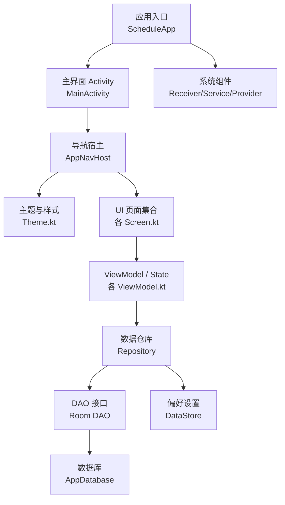
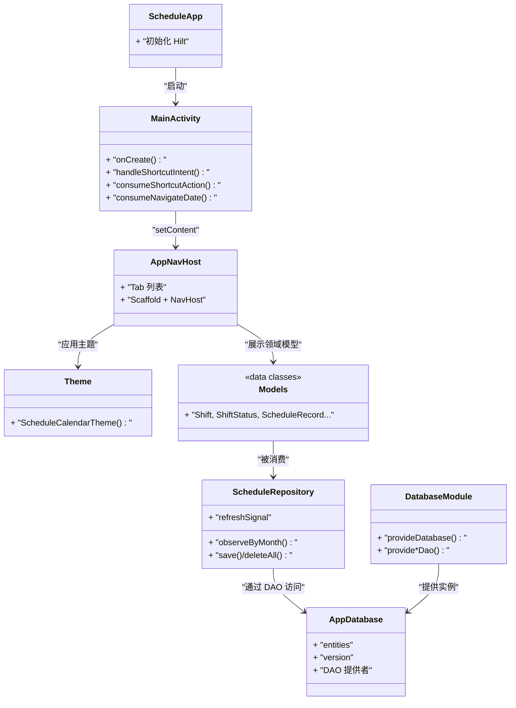
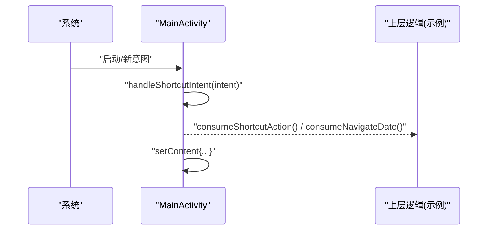
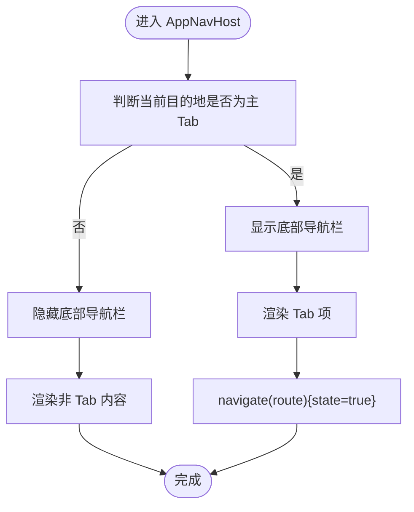
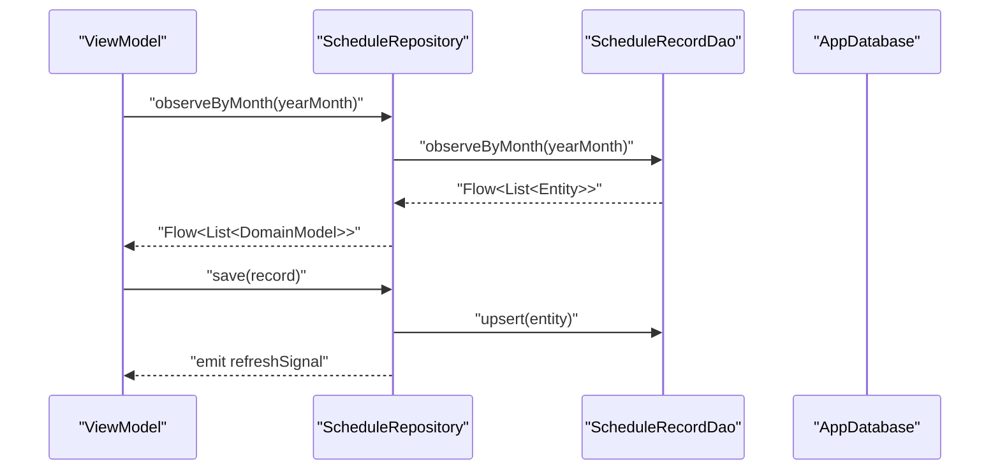
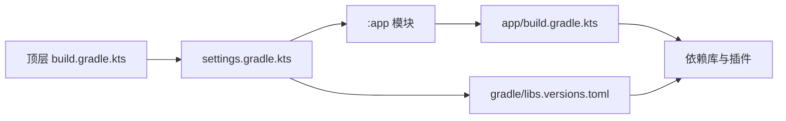

# 开发指南

<cite>
**本文引用的文件**
- [app/build.gradle.kts](file://app/build.gradle.kts)
- [build.gradle.kts](file://build.gradle.kts)
- [gradle.properties](file://gradle.properties)
- [settings.gradle.kts](file://settings.gradle.kts)
- [gradle/libs.versions.toml](file://gradle/libs.versions.toml)
- [app/src/main/AndroidManifest.xml](file://app/src/main/AndroidManifest.xml)
- [app/src/main/java/com/schedulecalendar/app/ScheduleApp.kt](file://app/src/main/java/com/schedulecalendar/app/ScheduleApp.kt)
- [app/src/main/java/com/schedulecalendar/app/MainActivity.kt](file://app/src/main/java/com/schedulecalendar/app/MainActivity.kt)
- [app/src/main/java/com/schedulecalendar/app/ui/navigation/AppNavHost.kt](file://app/src/main/java/com/schedulecalendar/app/ui/navigation/AppNavHost.kt)
- [app/src/main/java/com/schedulecalendar/app/ui/theme/Theme.kt](file://app/src/main/java/com/schedulecalendar/app/ui/theme/Theme.kt)
- [app/src/main/java/com/schedulecalendar/app/data/db/AppDatabase.kt](file://app/src/main/java/com/schedulecalendar/app/data/db/AppDatabase.kt)
- [app/src/main/java/com/schedulecalendar/app/di/DatabaseModule.kt](file://app/src/main/java/com/schedulecalendar/app/di/DatabaseModule.kt)
- [app/src/main/java/com/schedulecalendar/app/data/repository/ScheduleRepository.kt](file://app/src/main/java/com/schedulecalendar/app/data/repository/ScheduleRepository.kt)
- [app/src/main/java/com/schedulecalendar/app/domain/model/Models.kt](file://app/src/main/java/com/schedulecalendar/app/domain/model/Models.kt)
- [app/proguard-rules.pro](file://app/proguard-rules.pro)
</cite>

## 目录
1. [简介](#简介)
2. [项目结构](#项目结构)
3. [核心组件](#核心组件)
4. [架构总览](#架构总览)
5. [详细组件分析](#详细组件分析)
6. [依赖分析](#依赖分析)
7. [性能考虑](#性能考虑)
8. [故障排查指南](#故障排查指南)
9. [结论](#结论)
10. [附录](#附录)

## 简介
本指南面向排班日历 Android 应用的开发者，提供从代码规范、命名约定、工程组织到构建发布、测试与调试、性能优化与安全实践的全流程开发规范。文档基于仓库现有实现进行提炼，确保可落地、可执行，并附带可视化图示帮助理解系统结构与数据流。

## 项目结构
应用采用单模块（:app）的清晰分层：
- UI 层：基于 Jetpack Compose + Material3，使用 Navigation Compose 管理页面路由，底部 Tab 导航承载主功能入口。
- 领域模型：domain.model 包集中定义业务实体与计算工具，保持与持久化无关的纯数据结构。
- 数据层：Room 作为本地数据库，DAO 暴露查询接口；Repository 封装数据访问与变更信号；DataStore 用于轻量配置。
- 依赖注入：Hilt 通过 Module 提供数据库实例与 DAO。
- 系统能力：Glance 小组件、闹钟提醒、开机广播、Calendar 账户认证服务、FileProvider 等。

图表来源
- [app/src/main/java/com/schedulecalendar/app/ScheduleApp.kt:1-9](file://app/src/main/java/com/schedulecalendar/app/ScheduleApp.kt#L1-L9)
- [app/src/main/java/com/schedulecalendar/app/MainActivity.kt:1-105](file://app/src/main/java/com/schedulecalendar/app/MainActivity.kt#L1-L105)
- [app/src/main/java/com/schedulecalendar/app/ui/navigation/AppNavHost.kt:1-133](file://app/src/main/java/com/schedulecalendar/app/ui/navigation/AppNavHost.kt#L1-L133)
- [app/src/main/java/com/schedulecalendar/app/ui/theme/Theme.kt:1-76](file://app/src/main/java/com/schedulecalendar/app/ui/theme/Theme.kt#L1-L76)
- [app/src/main/java/com/schedulecalendar/app/data/db/AppDatabase.kt:1-35](file://app/src/main/java/com/schedulecalendar/app/data/db/AppDatabase.kt#L1-L35)
- [app/src/main/java/com/schedulecalendar/app/di/DatabaseModule.kt:1-35](file://app/src/main/java/com/schedulecalendar/app/di/DatabaseModule.kt#L1-L35)
- [app/src/main/java/com/schedulecalendar/app/data/repository/ScheduleRepository.kt:1-40](file://app/src/main/java/com/schedulecalendar/app/data/repository/ScheduleRepository.kt#L1-L40)

章节来源
- [app/build.gradle.kts:1-116](file://app/build.gradle.kts#L1-L116)
- [settings.gradle.kts:1-37](file://settings.gradle.kts#L1-L37)
- [gradle/libs.versions.toml:1-82](file://gradle/libs.versions.toml#L1-L82)
- [app/src/main/AndroidManifest.xml:1-128](file://app/src/main/AndroidManifest.xml#L1-L128)

## 核心组件
- 应用与入口
  - Application 类启用 Hilt 依赖注入。
  - MainActivity 负责 Edge-to-Edge 显示、动态快捷方式恢复、处理来自快捷方式和小组件的 Intent，并通过 setContent 挂载 Compose 根视图。
- 导航与主题
  - AppNavHost 统一管理 Tab 与子页面路由，支持状态保存与动画过渡。
  - Theme 提供明暗主题与动态取色（Material You），并在预览模式回退到静态色板。
- 数据与持久化
  - AppDatabase 声明实体与版本，导出 schema 便于迁移追踪。
  - DatabaseModule 提供 Room 实例与 DAO 注入。
  - Repository 封装 DAO 调用，统一返回领域模型，并发出刷新信号供 UI 响应。
- 领域模型
  - Models.kt 集中定义班次、状态、记录、薪资、统计等核心数据结构与常量。

章节来源
- [app/src/main/java/com/schedulecalendar/app/ScheduleApp.kt:1-9](file://app/src/main/java/com/schedulecalendar/app/ScheduleApp.kt#L1-L9)
- [app/src/main/java/com/schedulecalendar/app/MainActivity.kt:1-105](file://app/src/main/java/com/schedulecalendar/app/MainActivity.kt#L1-L105)
- [app/src/main/java/com/schedulecalendar/app/ui/navigation/AppNavHost.kt:1-133](file://app/src/main/java/com/schedulecalendar/app/ui/navigation/AppNavHost.kt#L1-L133)
- [app/src/main/java/com/schedulecalendar/app/ui/theme/Theme.kt:1-76](file://app/src/main/java/com/schedulecalendar/app/ui/theme/Theme.kt#L1-L76)
- [app/src/main/java/com/schedulecalendar/app/data/db/AppDatabase.kt:1-35](file://app/src/main/java/com/schedulecalendar/app/data/db/AppDatabase.kt#L1-L35)
- [app/src/main/java/com/schedulecalendar/app/di/DatabaseModule.kt:1-35](file://app/src/main/java/com/schedulecalendar/app/di/DatabaseModule.kt#L1-L35)
- [app/src/main/java/com/schedulecalendar/app/data/repository/ScheduleRepository.kt:1-40](file://app/src/main/java/com/schedulecalendar/app/data/repository/ScheduleRepository.kt#L1-L40)
- [app/src/main/java/com/schedulecalendar/app/domain/model/Models.kt:1-277](file://app/src/main/java/com/schedulecalendar/app/domain/model/Models.kt#L1-L277)

## 架构总览
整体遵循 MVVM + Clean Architecture 思想：
- UI 层（Compose Screens + Navigation）
- 状态与逻辑（ViewModel + Flow）
- 领域层（Domain Models + 计算工具）
- 数据层（Repository + DAO + Room/DataStore）
- 基础设施（Hilt 注入、系统组件、权限与清单）

图表来源
- [app/src/main/java/com/schedulecalendar/app/ScheduleApp.kt:1-9](file://app/src/main/java/com/schedulecalendar/app/ScheduleApp.kt#L1-L9)
- [app/src/main/java/com/schedulecalendar/app/MainActivity.kt:1-105](file://app/src/main/java/com/schedulecalendar/app/MainActivity.kt#L1-L105)
- [app/src/main/java/com/schedulecalendar/app/ui/navigation/AppNavHost.kt:1-133](file://app/src/main/java/com/schedulecalendar/app/ui/navigation/AppNavHost.kt#L1-L133)
- [app/src/main/java/com/schedulecalendar/app/ui/theme/Theme.kt:1-76](file://app/src/main/java/com/schedulecalendar/app/ui/theme/Theme.kt#L1-L76)
- [app/src/main/java/com/schedulecalendar/app/data/db/AppDatabase.kt:1-35](file://app/src/main/java/com/schedulecalendar/app/data/db/AppDatabase.kt#L1-L35)
- [app/src/main/java/com/schedulecalendar/app/di/DatabaseModule.kt:1-35](file://app/src/main/java/com/schedulecalendar/app/di/DatabaseModule.kt#L1-L35)
- [app/src/main/java/com/schedulecalendar/app/data/repository/ScheduleRepository.kt:1-40](file://app/src/main/java/com/schedulecalendar/app/data/repository/ScheduleRepository.kt#L1-L40)
- [app/src/main/java/com/schedulecalendar/app/domain/model/Models.kt:1-277](file://app/src/main/java/com/schedulecalendar/app/domain/model/Models.kt#L1-L277)

## 详细组件分析

### 应用入口与主界面
- 职责
  - 启用 Hilt 依赖注入。
  - 处理动态快捷方式与小组件点击，维护待处理动作与日期。
  - 在 onCreate 中恢复动态快捷方式，并挂载 Compose 根视图。
- 关键流程
  - onNewIntent 与 handleShortcutIntent 解析 action 与 extra，避免重复处理。
  - consumeShortcutAction/consumeNavigateDate 供上层消费后清空状态。

图表来源
- [app/src/main/java/com/schedulecalendar/app/MainActivity.kt:41-104](file://app/src/main/java/com/schedulecalendar/app/MainActivity.kt#L41-L104)

章节来源
- [app/src/main/java/com/schedulecalendar/app/ScheduleApp.kt:1-9](file://app/src/main/java/com/schedulecalendar/app/ScheduleApp.kt#L1-L9)
- [app/src/main/java/com/schedulecalendar/app/MainActivity.kt:1-105](file://app/src/main/java/com/schedulecalendar/app/MainActivity.kt#L1-L105)

### 导航与主题
- 导航
  - 使用类型安全路由（Any 派生 route 类型），配合 SavedStateHandle 传递参数。
  - Scaffold + BottomNavigation 控制底部栏显隐，支持状态保存与动画。
- 主题
  - 根据系统深色模式与动态取色策略选择颜色方案。
  - 预览模式下使用静态色板，避免无 Context 崩溃。

图表来源
- [app/src/main/java/com/schedulecalendar/app/ui/navigation/AppNavHost.kt:42-133](file://app/src/main/java/com/schedulecalendar/app/ui/navigation/AppNavHost.kt#L42-L133)
- [app/src/main/java/com/schedulecalendar/app/ui/theme/Theme.kt:49-76](file://app/src/main/java/com/schedulecalendar/app/ui/theme/Theme.kt#L49-L76)

章节来源
- [app/src/main/java/com/schedulecalendar/app/ui/navigation/AppNavHost.kt:1-133](file://app/src/main/java/com/schedulecalendar/app/ui/navigation/AppNavHost.kt#L1-L133)
- [app/src/main/java/com/schedulecalendar/app/ui/theme/Theme.kt:1-76](file://app/src/main/java/com/schedulecalendar/app/ui/theme/Theme.kt#L1-L76)

### 数据层与依赖注入
- 数据库
  - AppDatabase 声明实体与版本，开启 schema 导出。
  - DatabaseModule 提供 Room 实例与 DAO，使用 fallbackToDestructiveMigration 简化迁移（生产环境建议替换为正式迁移脚本）。
- 仓库
  - ScheduleRepository 将 DAO 返回的 Entity 映射为 Domain Model，并提供 Flow 观察与写操作后的刷新信号。

图表来源
- [app/src/main/java/com/schedulecalendar/app/data/repository/ScheduleRepository.kt:1-40](file://app/src/main/java/com/schedulecalendar/app/data/repository/ScheduleRepository.kt#L1-L40)
- [app/src/main/java/com/schedulecalendar/app/data/db/AppDatabase.kt:17-34](file://app/src/main/java/com/schedulecalendar/app/data/db/AppDatabase.kt#L17-L34)
- [app/src/main/java/com/schedulecalendar/app/di/DatabaseModule.kt:19-34](file://app/src/main/java/com/schedulecalendar/app/di/DatabaseModule.kt#L19-L34)

章节来源
- [app/src/main/java/com/schedulecalendar/app/data/db/AppDatabase.kt:1-35](file://app/src/main/java/com/schedulecalendar/app/data/db/AppDatabase.kt#L1-L35)
- [app/src/main/java/com/schedulecalendar/app/di/DatabaseModule.kt:1-35](file://app/src/main/java/com/schedulecalendar/app/di/DatabaseModule.kt#L1-L35)
- [app/src/main/java/com/schedulecalendar/app/data/repository/ScheduleRepository.kt:1-40](file://app/src/main/java/com/schedulecalendar/app/data/repository/ScheduleRepository.kt#L1-L40)

### 领域模型与计算
- 模型设计
  - 以 data class 表达业务实体（班次、状态、记录、薪资、统计等），保持与存储无关。
  - 内置常量与默认值集中管理，便于扩展与维护。
- 计算工具
  - 文本颜色对比度计算、工时汇总等工具函数位于 domain.model，便于复用。

章节来源
- [app/src/main/java/com/schedulecalendar/app/domain/model/Models.kt:1-277](file://app/src/main/java/com/schedulecalendar/app/domain/model/Models.kt#L1-L277)

## 依赖分析
- 插件与版本
  - 顶层 build.gradle.kts 仅声明插件，不应用到 root。
  - settings.gradle.kts 集中配置仓库源（阿里云优先、华为云备用、官方兜底），并启用 Foojay Toolchains。
  - gradle/libs.versions.toml 统一管理 AGP、Kotlin、Compose BOM、Navigation、Room、Hilt、Coroutines、Gson、Glance、Tyme4J 等版本。
- 应用模块
  - app/build.gradle.kts 启用 Compose、KSP、Hilt、Serialization，配置 release 混淆与资源压缩，设置 Java/Kotlin 目标版本为 17。
  - gradle.properties 开启 Gradle 缓存与并行 GC，指定 Kotlin 编码风格与 JDK 路径。

图表来源
- [build.gradle.kts:1-10](file://build.gradle.kts#L1-L10)
- [settings.gradle.kts:1-37](file://settings.gradle.kts#L1-L37)
- [gradle/libs.versions.toml:1-82](file://gradle/libs.versions.toml#L1-L82)
- [app/build.gradle.kts:1-116](file://app/build.gradle.kts#L1-L116)

章节来源
- [build.gradle.kts:1-10](file://build.gradle.kts#L1-L10)
- [settings.gradle.kts:1-37](file://settings.gradle.kts#L1-L37)
- [gradle/libs.versions.toml:1-82](file://gradle/libs.versions.toml#L1-L82)
- [app/build.gradle.kts:1-116](file://app/build.gradle.kts#L1-L116)
- [gradle.properties:1-8](file://gradle.properties#L1-L8)

## 性能考虑
- 构建与编译
  - 使用 Gradle 配置缓存与并行 GC，提升增量构建速度。
  - 使用 libs.versions.toml 集中管理版本，减少冲突与重复升级成本。
- 运行时
  - 使用 Flow 进行响应式数据更新，避免不必要的 UI 重绘。
  - 在 Repository 层发出刷新信号，集中触发 UI 刷新，降低重复查询。
- 资源与体积
  - release 开启 minify/shrinkResources，结合 proguard-rules.pro 保留必要反射与序列化类。
  - 按需引入第三方库，避免冗余依赖。

章节来源
- [gradle.properties:1-8](file://gradle.properties#L1-L8)
- [app/build.gradle.kts:22-54](file://app/build.gradle.kts#L22-L54)
- [app/proguard-rules.pro:1-43](file://app/proguard-rules.pro#L1-L43)

## 故障排查指南
- 权限与系统能力
  - 检查 AndroidManifest.xml 中的权限声明与 Receiver/Service/Provider 注册是否正确。
  - 注意通知权限与精确闹钟权限在不同版本的差异。
- 数据库迁移
  - 当前使用破坏性迁移，可能导致用户数据丢失。建议在正式发布前编写正式迁移脚本，并确保 schema 导出一致。
- 混淆与序列化
  - 确认 Gson 与 kotlinx-serialization 的 keep 规则覆盖所有需要反射或序列化的类。
  - 若出现反序列化异常，检查 domain.model 包下的类是否被保留。
- 小组件与快捷方式
  - 校验 Glance 接收器与配置 Activity 的 intent-filter 与 meta-data。
  - 动态快捷方式需在应用启动时恢复，避免首次安装不可用。

章节来源
- [app/src/main/AndroidManifest.xml:1-128](file://app/src/main/AndroidManifest.xml#L1-L128)
- [app/src/main/java/com/schedulecalendar/app/data/db/AppDatabase.kt:17-34](file://app/src/main/java/com/schedulecalendar/app/data/db/AppDatabase.kt#L17-L34)
- [app/proguard-rules.pro:1-43](file://app/proguard-rules.pro#L1-L43)

## 结论
本项目采用现代 Android 技术栈（Compose、Navigation、Room、Hilt、Glance），结构清晰、职责分明。通过统一的版本管理与依赖声明、完善的混淆与打包配置，以及响应式数据流，具备良好的可维护性与可扩展性。建议在生产环境中完善数据库迁移、补充单元测试与 UI 自动化测试，并持续优化构建与运行性能。

## 附录

### 代码规范与命名约定
- Kotlin 编码风格
  - 遵循 kotlin.code.style=official，使用官方格式化与命名约定。
  - 变量与函数使用小驼峰，类与对象使用大驼峰，常量使用全大写加下划线。
- 注释规范
  - 公共 API 与复杂逻辑需添加行内注释说明目的与边界条件。
  - 对领域模型字段增加简短描述，便于后续维护。
- 文件组织结构
  - 按功能域分包：ui、data、di、domain、widget、reminder 等。
  - 每个功能模块包含 Screen、ViewModel、Repository、Entity/DAO 等对应文件，保持高内聚低耦合。

章节来源
- [gradle.properties:6-6](file://gradle.properties#L6-L6)
- [app/src/main/java/com/schedulecalendar/app/domain/model/Models.kt:1-277](file://app/src/main/java/com/schedulecalendar/app/domain/model/Models.kt#L1-L277)

### 调试与测试策略
- 单元测试
  - 针对 Repository 与领域计算函数编写用例，验证数据映射与计算结果。
  - 使用协程测试框架模拟异步行为，确保 Flow 输出符合预期。
- UI 测试
  - 使用 Compose Testing 对关键页面进行断言，如 Tab 切换、表单输入与导航跳转。
- 性能分析
  - 使用 Android Studio Profiler 分析 CPU、内存与网络 IO。
  - 关注长任务在主线程的执行，确保耗时操作移至后台协程。

[本节为通用指导，无需具体文件引用]

### 构建与部署流程
- 构建配置
  - 使用 libs.versions.toml 集中管理依赖版本，避免版本冲突。
  - 在 app/build.gradle.kts 中启用 Compose、KSP、Hilt、Serialization，并配置 release 混淆与资源压缩。
- 代码混淆
  - 在 proguard-rules.pro 中保留 Hilt、Room、Gson、Glance、kotlinx-serialization 相关类与方法。
- 签名打包
  - 在 CI/CD 流水线中配置 keystore 与签名信息，生成签名 APK/AAB。
  - 发布前执行 lint 与单元测试，确保质量门禁。

章节来源
- [gradle/libs.versions.toml:1-82](file://gradle/libs.versions.toml#L1-L82)
- [app/build.gradle.kts:1-116](file://app/build.gradle.kts#L1-L116)
- [app/proguard-rules.pro:1-43](file://app/proguard-rules.pro#L1-L43)

### 新功能开发流程与代码审查标准
- 开发流程
  - 需求评审 → 技术方案设计 → 分支创建 → 实现与自测 → 提交 PR → 代码审查 → 合并与发布。
- 代码审查要点
  - 架构一致性：是否符合 MVVM/Clean 分层，职责是否单一。
  - 可测试性：是否易于编写单测与 UI 测试。
  - 可读性：命名清晰、注释充分、复杂度可控。
  - 安全性：敏感信息不硬编码，权限最小化，序列化与反射保留规则完整。
  - 性能：避免主线程阻塞，合理使用 Flow 与协程。

[本节为通用指导，无需具体文件引用]