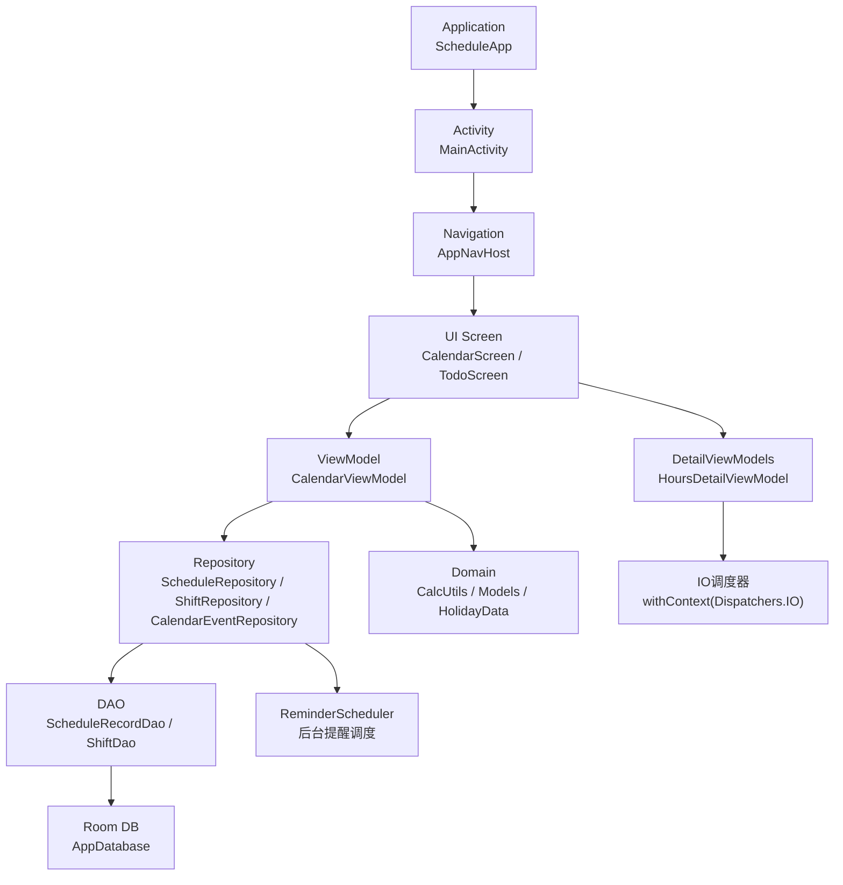
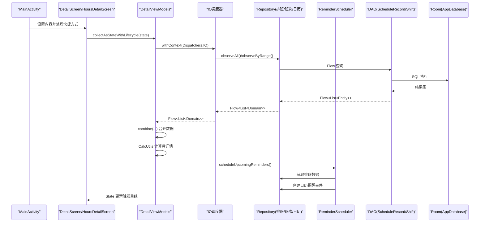
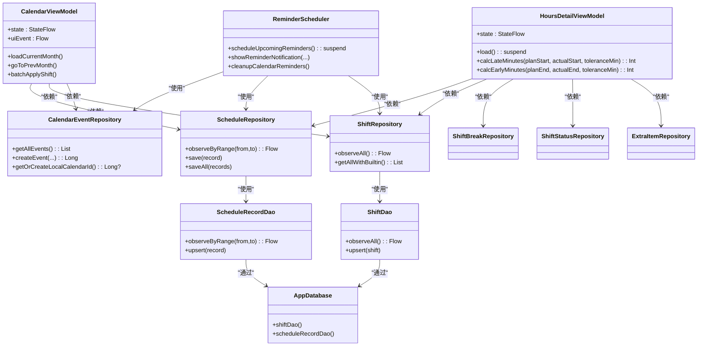

# 性能优化

<cite>
**本文引用的文件**   
- [CalendarEventRepository.kt](file://app/src/main/java/com/schedulecalendar/app/data/calendar/CalendarEventRepository.kt)
- [ReminderScheduler.kt](file://app/src/main/java/com/schedulecalendar/app/reminder/ReminderScheduler.kt)
- [TodoScreen.kt](file://app/src/main/java/com/schedulecalendar/app/ui/todo/TodoScreen.kt)
- [MainActivity.kt](file://app/src/main/java/com/schedulecalendar/app/MainActivity.kt)
- [ScheduleApp.kt](file://app/src/main/java/com/schedulecalendar/app/ScheduleApp.kt)
- [AppDatabase.kt](file://app/src/main/java/com/schedulecalendar/app/data/db/AppDatabase.kt)
- [DatabaseModule.kt](file://app/src/main/java/com/schedulecalendar/app/di/DatabaseModule.kt)
- [ShiftDao.kt](file://app/src/main/java/com/schedulecalendar/app/data/db/dao/ShiftDao.kt)
- [ScheduleRecordDao.kt](file://app/src/main/java/com/schedulecalendar/app/data/db/dao/ScheduleRecordDao.kt)
- [ScheduleRepository.kt](file://app/src/main/java/com/schedulecalendar/app/data/repository/ScheduleRepository.kt)
- [ShiftRepository.kt](file://app/src/main/java/com/schedulecalendar/app/data/repository/ShiftRepository.kt)
- [CalendarScreen.kt](file://app/src/main/java/com/schedulecalendar/app/ui/calendar/CalendarScreen.kt)
- [CalendarViewModel.kt](file://app/src/main/java/com/schedulecalendar/app/ui/calendar/CalendarViewModel.kt)
- [CalcUtils.kt](file://app/src/main/java/com/schedulecalendar/app/domain/model/CalcUtils.kt)
- [Models.kt](file://app/src/main/java/com/schedulecalendar/app/domain/model/Models.kt)
- [HolidayData.kt](file://app/src/main/java/com/schedulecalendar/app/domain/model/HolidayData.kt)
- [DetailViewModels.kt](file://app/src/main/java/com/schedulecalendar/app/ui/detail/DetailViewModels.kt)
</cite>

## 更新摘要
**变更内容**   
- 新增了DetailViewModels中Kotlin协程性能优化的详细说明
- 更新了复杂计算优化章节，重点介绍withContext函数在大数据集处理中的应用
- 增强了协程调度器使用最佳实践的指导
- 补充了月度考勤详情计算的优化案例

## 目录
1. [简介](#简介)
2. [项目结构](#项目结构)
3. [核心组件](#核心组件)
4. [架构总览](#架构总览)
5. [详细组件分析](#详细组件分析)
6. [依赖分析](#依赖分析)
7. [性能考量](#性能考量)
8. [故障排查指南](#故障排查指南)
9. [结论](#结论)
10. [附录](#附录)

## 简介
本指南面向 Android 应用的性能优化，结合仓库中的实际代码与架构，覆盖以下方面：
- UI 渲染优化（Jetpack Compose）
- 内存管理（含泄漏风险点与规避）
- 数据库查询优化（Room + Flow）
- 网络请求优化（通用策略与集成建议）
- 启动速度优化（懒加载、预初始化、冷启动）
- 电池使用优化（后台任务、唤醒锁、同步策略）
- 性能监控与分析工具（帧率、内存、CPU）
- 典型场景优化案例（大数据列表、复杂计算、图片加载）
- **日志管理与性能影响**
- **协程调度与线程切换优化**（新增）

## 项目结构
本项目采用分层架构：UI（Compose）→ ViewModel → Repository → DAO（Room）→ Database。领域层包含计算与模型。关键入口为 Application 与 MainActivity，导航由 AppNavHost 管理。

图表来源
- [ScheduleApp.kt:1-9](file://app/src/main/java/com/schedulecalendar/app/ScheduleApp.kt#L1-L9)
- [MainActivity.kt:1-105](file://app/src/main/java/com/schedulecalendar/app/MainActivity.kt#L1-L105)
- [CalendarScreen.kt:1-800](file://app/src/main/java/com/schedulecalendar/app/ui/calendar/CalendarScreen.kt#L1-L800)
- [TodoScreen.kt:1-800](file://app/src/main/java/com/schedulecalendar/app/ui/todo/TodoScreen.kt#L1-L800)
- [CalendarViewModel.kt:1-800](file://app/src/main/java/com/schedulecalendar/app/ui/calendar/CalendarViewModel.kt#L1-L800)
- [DetailViewModels.kt:1-543](file://app/src/main/java/com/schedulecalendar/app/ui/detail/DetailViewModels.kt#L1-L543)

## 核心组件
- 应用入口与依赖注入
  - Application 启用 Hilt；DatabaseModule 提供 Room 单例与 DAO。
- 数据层
  - Repository 封装 DAO 并暴露 Flow，写操作后发出刷新信号。
  - CalendarEventRepository 提供系统日历事件读写操作。
  - ReminderScheduler 管理上下班提醒的闹钟和日历事件。
- 表现层
  - CalendarScreen 使用 Compose 展示日历网格与详情；TodoScreen 整合待办、日程、纪念日功能。
  - DetailViewModels 包含详细的工时管理和薪资计算功能。
- 领域层
  - CalcUtils 实现工时/薪资计算；Models 定义领域实体；HolidayData 提供节假日/节气信息。

## 架构总览
下图展示了从 Activity 到数据库的关键调用链，以及各组件间的交互关系。

图表来源
- [MainActivity.kt:1-105](file://app/src/main/java/com/schedulecalendar/app/MainActivity.kt#L1-L105)
- [DetailViewModels.kt:288-305](file://app/src/main/java/com/schedulecalendar/app/ui/detail/DetailViewModels.kt#L288-L305)
- [CalendarViewModel.kt:412-418](file://app/src/main/java/com/schedulecalendar/app/ui/calendar/CalendarViewModel.kt#L412-L418)

## 详细组件分析

### UI 渲染优化（Jetpack Compose）
- 列表与网格
  - 使用 LazyColumn/LazyRow 与 items 渲染，避免一次性构建全部子项。
  - 日历网格通过预计算 DayCellData 减少重组开销。
  - TodoScreen 使用 remember 缓存分类待办数据，避免重复 filter 计算。
- 动画与过渡
  - AnimatedContent 用于月份切换，配合 slide/fade 提升观感同时避免多余布局。
- 可访问性与交互
  - semantics 描述增强无障碍体验；combinedClickable 统一点击与长按。
- 重组控制
  - 将稳定数据（如 shiftMap、displayScheme）用 remember 缓存，降低重复计算。
  - TodoScreen 中导航状态使用 LaunchedEffect 和延迟机制避免协程取消问题。
- 建议
  - 对复杂单元格使用 remember 包裹耗时计算；必要时拆分子 Composable 以限制重组范围。

**章节来源**
- [CalendarScreen.kt:1-800](file://app/src/main/java/com/schedulecalendar/app/ui/calendar/CalendarScreen.kt#L1-L800)
- [TodoScreen.kt:1-800](file://app/src/main/java/com/schedulecalendar/app/ui/todo/TodoScreen.kt#L1-L800)

### 内存管理与泄漏防护
- 协程与 Job 管理
  - ViewModel 中维护 collectJob，切月时先 cancel 再 launch，防止 collector 累积导致泄漏。
  - TodoScreen 使用 rememberCoroutineScope 管理协程生命周期。
- 状态与集合
  - 使用不可变数据类与 map/set 的局部缓存，避免在重组中频繁创建大对象。
  - TodoScreen 中对待办数据进行分组和排序时使用 remember 缓存。
- 资源释放
  - 避免在 Composable 中持有 Context 长生命周期引用；使用 LocalContext 按需获取。
- 建议
  - 使用 LeakCanary 检测潜在泄漏；对大型集合做分页或增量更新。

**章节来源**
- [CalendarViewModel.kt:1-800](file://app/src/main/java/com/schedulecalendar/app/ui/calendar/CalendarViewModel.kt#L1-L800)
- [TodoScreen.kt:1-800](file://app/src/main/java/com/schedulecalendar/app/ui/todo/TodoScreen.kt#L1-L800)

### 数据库查询优化（Room + Flow）
- 查询范围裁剪
  - 按"当月+上月尾部+下月头部"的范围查询，减少不必要的数据量。
- 流式更新
  - 使用 Flow 观察变化，避免轮询；Repository 写操作后发出刷新信号。
- 排序与索引
  - 在 DAO 中使用 ORDER BY 保证稳定顺序；对高频过滤字段建立索引（建议在迁移脚本中添加）。
- 批量写入
  - 使用 upsertAll/saveAll 减少事务次数。
- 建议
  - 对日期范围查询添加复合索引（date, archivedAt）；对 name 等常用排序字段加索引。

**章节来源**
- [CalendarViewModel.kt:1-800](file://app/src/main/java/com/schedulecalendar/app/ui/calendar/CalendarViewModel.kt#L1-L800)
- [ScheduleRepository.kt:1-40](file://app/src/main/java/com/schedulecalendar/app/data/repository/ScheduleRepository.kt#L1-L40)
- [ShiftRepository.kt:1-45](file://app/src/main/java/com/schedulecalendar/app/data/repository/ShiftRepository.kt#L1-L45)
- [ScheduleRecordDao.kt:1-40](file://app/src/main/java/com/schedulecalendar/app/data/db/dao/ScheduleRecordDao.kt#L1-L40)
- [ShiftDao.kt:1-42](file://app/src/main/java/com/schedulecalendar/app/data/db/dao/ShiftDao.kt#L1-L42)
- [AppDatabase.kt:1-35](file://app/src/main/java/com/schedulecalendar/app/data/db/AppDatabase.kt#L1-L35)

### 协程调度与线程切换优化（新增）
- **DetailViewModels中的性能优化**
  - HoursDetailViewModel 使用 `withContext(kotlinx.coroutines.Dispatchers.IO)` 将重型计算工作从主线程移动到IO调度器
  - 特别适用于大数据集的月度考勤详情计算，避免UI阻塞导致的导航卡顿
  - 所有数据库查询、CalcUtils计算、数据处理都在IO线程中执行
- **CalendarViewModel中的协程优化**
  - 日历事件加载使用 `kotlinx.coroutines.withContext(kotlinx.coroutines.Dispatchers.IO)` 进行异步处理
  - 大量事件数据处理（如年度重复纪念日处理）在IO线程中完成
  - 避免了主线程被长时间占用导致的界面响应延迟
- **最佳实践**
  - 将耗时的数据库操作、网络请求、复杂计算移至 Dispatchers.IO
  - 使用 withContext 而非全局协程，确保作用域正确管理
  - 在主线程仅进行UI状态更新，保持界面流畅性
  - 对于大数据集处理，优先考虑IO调度器的并行处理能力

**章节来源**
- [DetailViewModels.kt:288-305](file://app/src/main/java/com/schedulecalendar/app/ui/detail/DetailViewModels.kt#L288-L305)
- [CalendarViewModel.kt:412-418](file://app/src/main/java/com/schedulecalendar/app/ui/calendar/CalendarViewModel.kt#L412-L418)
- [CalendarViewModel.kt:429-464](file://app/src/main/java/com/schedulecalendar/app/ui/calendar/CalendarViewModel.kt#L429-L464)

### 日志管理与性能影响
- 日志清理优化
  - CalendarEventRepository 中移除了约20行详细的调试日志输出，包括日历账户查询、事件创建、更新等操作的大量 Log.d 语句。
  - ReminderScheduler 中清理了提醒调度过程中的 verbose 调试日志，减少了系统日志噪音。
  - TodoScreen 中移除了导航调试相关的日志输出，优化了用户界面交互时的日志生成。
- 性能收益
  - 减少 I/O 操作：日志写入涉及磁盘 I/O，移除后可显著降低主线程阻塞时间。
  - 降低内存占用：日志字符串对象的创建和垃圾回收开销得到减少。
  - 提升响应性：特别是在高频操作的日历事件管理和提醒调度场景中。
- 最佳实践
  - 生产环境应禁用或降级详细调试日志。
  - 使用条件编译或日志级别控制来管理不同环境的日志输出。
  - 对关键路径进行性能监控而非依赖日志输出。

**章节来源**
- [CalendarEventRepository.kt:1-812](file://app/src/main/java/com/schedulecalendar/app/data/calendar/CalendarEventRepository.kt#L1-L812)
- [ReminderScheduler.kt:1-418](file://app/src/main/java/com/schedulecalendar/app/reminder/ReminderScheduler.kt#L1-L418)
- [TodoScreen.kt:1-800](file://app/src/main/java/com/schedulecalendar/app/ui/todo/TodoScreen.kt#L1-L800)

### 网络请求优化（通用策略）
- 并发与重试
  - 使用协程并发请求，结合指数退避重试；失败快速返回降级数据。
- 缓存与去重
  - 本地缓存热点数据；对相同请求去重，避免重复网络 IO。
- 压缩与分页
  - 启用 gzip；列表分页加载，按需拉取。
- 错误与超时
  - 合理设置超时与熔断；区分网络错误与业务错误。
- 建议
  - 在 Repository 层统一拦截器与日志埋点，便于定位慢请求。

### 启动速度优化（懒加载、预初始化、冷启动）
- 延迟非关键初始化
  - 将备份、日历账户初始化等放入 viewModelScope 异步执行，避免阻塞主线程。
- 按需加载
  - 首屏仅加载必要数据；其他模块在用户进入时再加载。
- 静态资源与主题
  - 减少 onCreate 中的重型操作；使用 Theme 与 Surface 最小化绘制。
- 建议
  - 使用 TraceView/Perfetto 分析启动路径，识别耗时步骤并拆分。

**章节来源**
- [CalendarViewModel.kt:1-800](file://app/src/main/java/com/schedulecalendar/app/ui/calendar/CalendarViewModel.kt#L1-L800)
- [MainActivity.kt:1-105](file://app/src/main/java/com/schedulecalendar/app/MainActivity.kt#L1-L105)
- [ScheduleApp.kt:1-9](file://app/src/main/java/com/schedulecalendar/app/ScheduleApp.kt#L1-L9)

### 电池使用优化（后台任务、唤醒锁、同步策略）
- 后台任务
  - 使用 WorkManager 替代 AlarmManager；合并任务，避免频繁唤醒。
  - ReminderScheduler 使用 setAlarmClock 确保精确提醒，但需平衡电池消耗。
- 唤醒锁
  - 仅在必要时申请 WakeLock，且尽快释放；优先使用 JobScheduler/WorkManager。
- 同步策略
  - 网络同步在连接可用时批量执行；避免在电量低时进行大量 IO。
- 建议
  - 利用 Doze 模式与 App Standby 行为，减少前台服务常驻。

**章节来源**
- [ReminderScheduler.kt:1-418](file://app/src/main/java/com/schedulecalendar/app/reminder/ReminderScheduler.kt#L1-L418)

### 性能监控与分析工具
- 帧率监控
  - 使用 Layout Inspector 与 Profiler 的 GPU 渲染视图，关注掉帧与过度绘制。
- 内存分析
  - 使用 Memory Profiler 与 LeakCanary 定位泄漏与大对象。
- CPU 分析
  - 使用 CPU Profiler 抓取火焰图，识别热点函数与阻塞调用。
- 日志分析
  - 使用 logcat 过滤和分析应用日志，识别性能瓶颈。
- 建议
  - 在关键路径埋点（如月份切换、批量复制），对比优化前后指标。

### 典型场景优化案例

#### 大数据列表渲染（日历网格）
- 现状
  - 使用 LazyColumn 与预计算的 DayCellData，减少重组与计算。
  - TodoScreen 中对待办数据进行分组和排序时使用 remember 缓存。
- 优化建议
  - 对跨月填充数据做惰性计算；对颜色/文本等稳定值使用 remember。
  - 将复杂样式逻辑下沉至独立 Composable，限制重组范围。

**章节来源**
- [CalendarScreen.kt:1-800](file://app/src/main/java/com/schedulecalendar/app/ui/calendar/CalendarScreen.kt#L1-L800)
- [TodoScreen.kt:1-800](file://app/src/main/java/com/schedulecalendar/app/ui/todo/TodoScreen.kt#L1-L800)

#### 复杂计算优化（工时/薪资）
- 现状
  - CalcUtils 集中实现时间归一化、粒度取整、全局休息扣减、分类统计等。
  - DetailViewModels 中的 HoursDetailViewModel 使用 withContext(IO) 处理月度考勤详情计算。
- 优化建议
  - 对月度汇总结果做缓存，避免重复计算；在 UI 层按需显示。
  - 将耗时计算移至 Dispatchers.IO，避免阻塞主线程。
  - 使用协程并发处理多个日期的计算任务。

**章节来源**
- [CalcUtils.kt:1-557](file://app/src/main/java/com/schedulecalendar/app/domain/model/CalcUtils.kt#L1-L557)
- [DetailViewModels.kt:288-305](file://app/src/main/java/com/schedulecalendar/app/ui/detail/DetailViewModels.kt#L288-L305)
- [Models.kt:1-277](file://app/src/main/java/com/schedulecalendar/app/domain/model/Models.kt#L1-L277)

#### 图片加载优化（通用策略）
- 使用 Glide/Coil 进行占位、缩放、缓存与回收。
- 针对大图使用缩略图与渐进式加载。
- 在列表滚动中暂停加载，恢复时继续。

#### 日历事件管理优化
- 现状
  - CalendarEventRepository 实现了批量加载日历信息，避免 N+1 查询问题。
  - 支持多种日历类型（日程、纪念日、提醒）的管理。
- 优化建议
  - 继续使用批量查询策略，避免频繁的 ContentResolver 调用。
  - 对日历事件的状态变化使用观察者模式，减少轮询开销。

**章节来源**
- [CalendarEventRepository.kt:1-812](file://app/src/main/java/com/schedulecalendar/app/data/calendar/CalendarEventRepository.kt#L1-L812)

#### 月度考勤详情计算优化（新增）
- 现状
  - HoursDetailViewModel 中的 load() 方法使用 `withContext(kotlinx.coroutines.Dispatchers.IO)` 包装整个计算流程
  - 包括数据库查询、CalcUtils.getMonthScheduleDetails计算、数据过滤和转换等所有耗时操作
  - 特别适用于处理大量考勤记录的性能优化
- 优化效果
  - 避免主线程阻塞导致的导航卡顿
  - 充分利用IO调度器的并发处理能力
  - 提升大数据集处理的响应性和流畅度
- 实现细节
  - 所有Repository调用在IO线程中执行
  - CalcUtils计算逻辑完全在后台线程运行
  - 最终结果通过StateFlow更新到UI层

**章节来源**
- [DetailViewModels.kt:288-305](file://app/src/main/java/com/schedulecalendar/app/ui/detail/DetailViewModels.kt#L288-L305)
- [CalcUtils.kt:448-486](file://app/src/main/java/com/schedulecalendar/app/domain/model/CalcUtils.kt#L448-L486)

## 依赖分析
- 组件耦合
  - ViewModel 依赖多个 Repository；Repository 依赖 DAO；DAO 依赖 AppDatabase。
  - ReminderScheduler 依赖 CalendarEventRepository 进行日历事件管理。
- 外部依赖
  - Hilt 负责依赖注入；Room 提供持久化；Flow 驱动响应式数据流。
- 循环依赖
  - 当前未见循环导入；保持单向依赖有助于测试与维护。

图表来源
- [CalendarViewModel.kt:1-800](file://app/src/main/java/com/schedulecalendar/app/ui/calendar/CalendarViewModel.kt#L1-L800)
- [DetailViewModels.kt:260-285](file://app/src/main/java/com/schedulecalendar/app/ui/detail/DetailViewModels.kt#L260-L285)
- [ScheduleRepository.kt:1-40](file://app/src/main/java/com/schedulecalendar/app/data/repository/ScheduleRepository.kt#L1-L40)
- [ShiftRepository.kt:1-45](file://app/src/main/java/com/schedulecalendar/app/data/repository/ShiftRepository.kt#L1-L45)
- [CalendarEventRepository.kt:1-812](file://app/src/main/java/com/schedulecalendar/app/data/calendar/CalendarEventRepository.kt#L1-L812)
- [ReminderScheduler.kt:1-418](file://app/src/main/java/com/schedulecalendar/app/reminder/ReminderScheduler.kt#L1-L418)
- [ScheduleRecordDao.kt:1-40](file://app/src/main/java/com/schedulecalendar/app/data/db/dao/ScheduleRecordDao.kt#L1-L40)
- [ShiftDao.kt:1-42](file://app/src/main/java/com/schedulecalendar/app/data/db/dao/ShiftDao.kt#L1-L42)
- [AppDatabase.kt:1-35](file://app/src/main/java/com/schedulecalendar/app/data/db/AppDatabase.kt#L1-L35)

## 性能考量
- UI 层
  - 减少不必要的重组；使用 remember 缓存稳定数据；拆分复杂组件。
  - 注意日志输出对 UI 响应性的影响，特别是在高频交互场景。
- 数据层
  - 精确查询范围；合理使用索引；批量写入；避免在主线程执行 IO。
  - 移除冗余日志输出，减少 I/O 开销。
- 计算层
  - 将耗时计算移至后台线程；对结果做缓存与增量更新。
  - 使用 withContext(IO) 处理大数据集计算，避免主线程阻塞。
- 启动与后台
  - 延迟非关键初始化；合并后台任务；避免频繁唤醒。
  - 优化提醒调度器的日志输出，平衡功能监控与性能需求。
- 协程调度
  - 合理使用 Dispatchers.IO 处理I/O密集型操作
  - 避免在主线程执行耗时计算
  - 使用适当的协程作用域管理生命周期

## 故障排查指南
- 常见问题
  - 列表卡顿：检查重组热点与复杂计算位置。
  - 内存增长：使用 LeakCanary 定位泄漏；检查协程与集合生命周期。
  - 数据库慢查询：分析 SQL 执行计划，补充索引；缩小查询范围。
  - 日志过多：检查是否在生产环境启用了详细调试日志。
  - 主线程阻塞：检查是否有耗时操作在主线程执行。
- 定位方法
  - 使用 Profiler 抓取 CPU/GPU/Memory 快照；结合日志与埋点对比优化效果。
  - 使用 logcat 过滤特定标签的日志，分析性能瓶颈。
  - 使用 Thread Profiler 检查线程使用情况。

## 结论
通过合理的分层架构、响应式数据流与领域计算分离，项目在 UI 渲染、数据访问与计算方面具备良好的可扩展性。近期通过移除大量冗余日志输出和使用协程调度器优化，进一步提升了应用性能和用户体验。特别是DetailViewModels中的withContext优化，有效解决了大数据集处理时的UI阻塞问题。进一步优化应聚焦于：
- 精细化重组控制与缓存策略
- 数据库索引与查询范围优化
- 启动路径瘦身与后台任务合并
- 完善的性能监控与回归验证
- 持续的日志管理优化，平衡调试需求与性能表现
- 协程调度的最佳实践应用

## 附录
- 相关常量与模型
  - 内置班次/状态、显示方案、薪资与考勤配置等定义位于 Models.kt。
- 节假日与节气
  - HolidayData 提供法定假日、调休补班、二十四节气与国际节日信息。

**章节来源**
- [Models.kt:1-277](file://app/src/main/java/com/schedulecalendar/app/domain/model/Models.kt#L1-L277)
- [HolidayData.kt:1-636](file://app/src/main/java/com/schedulecalendar/app/domain/model/HolidayData.kt#L1-L636)