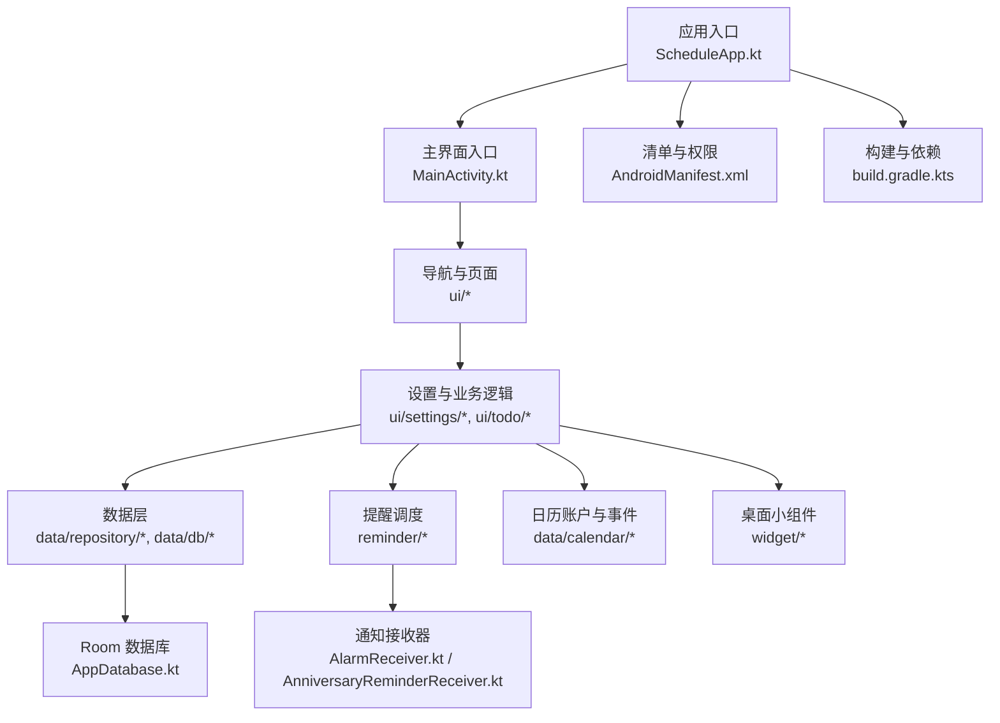
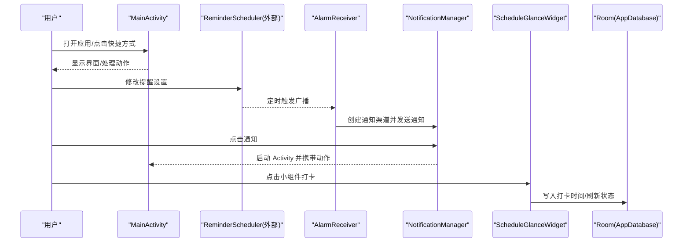
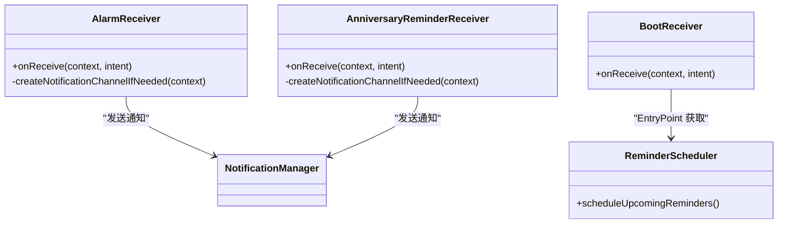
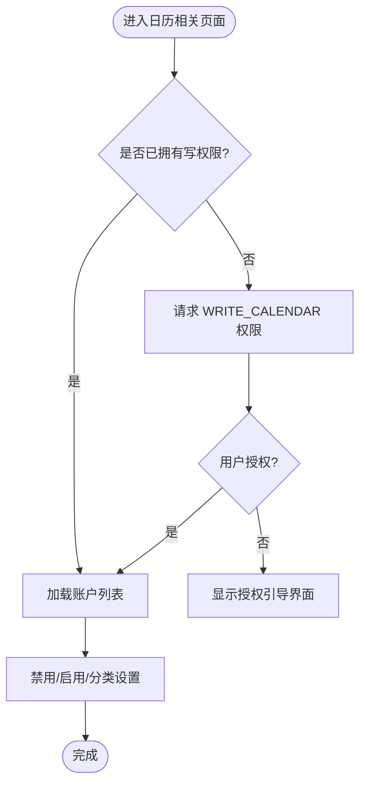
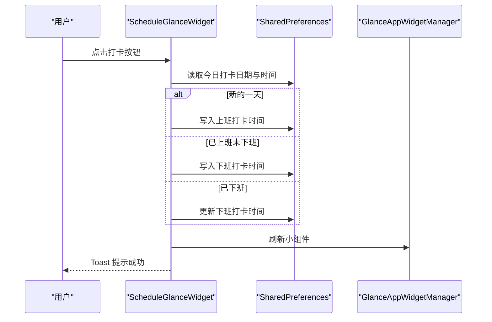
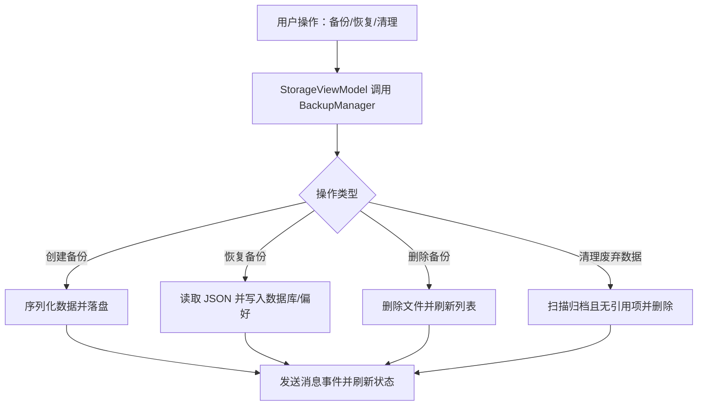
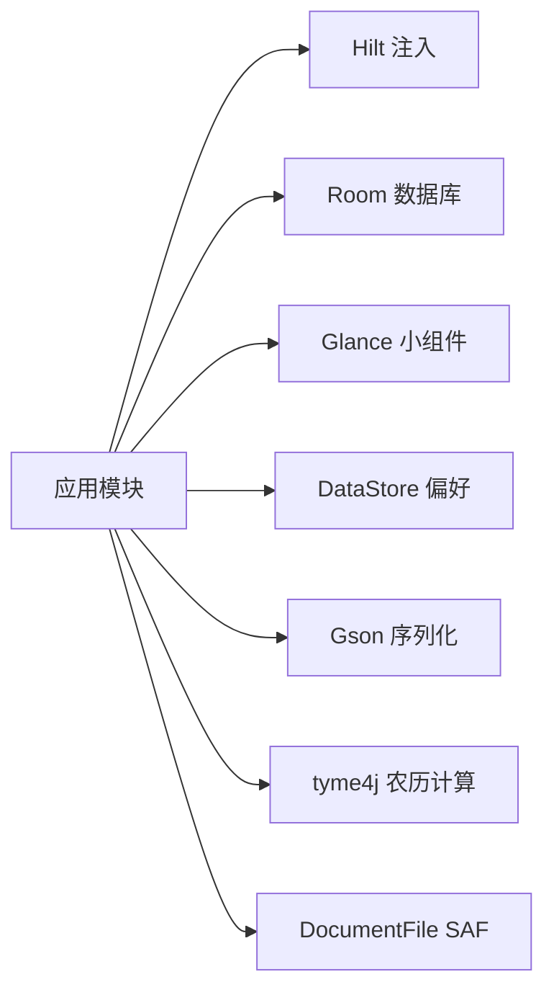
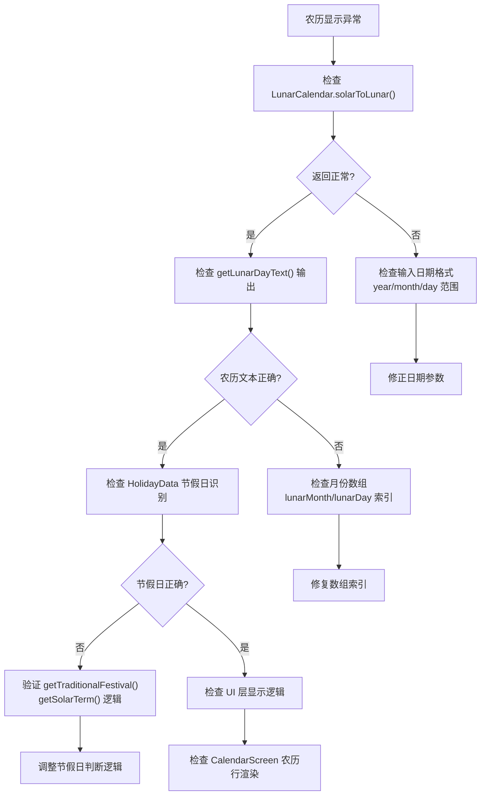

# 故障排除

<cite>
**本文引用的文件**   
- [AndroidManifest.xml](file://app/src/main/AndroidManifest.xml)
- [build.gradle.kts](file://app/build.gradle.kts)
- [ScheduleApp.kt](file://app/src/main/java/com/schedulecalendar/app/ScheduleApp.kt)
- [MainActivity.kt](file://app/src/main/java/com/schedulecalendar/app/MainActivity.kt)
- [AppDatabase.kt](file://app/src/main/java/com/schedulecalendar/app/data/db/AppDatabase.kt)
- [AlarmReceiver.kt](file://app/src/main/java/com/schedulecalendar/app/reminder/AlarmReceiver.kt)
- [AnniversaryReminderReceiver.kt](file://app/src/main/java/com/schedulecalendar/app/reminder/AnniversaryReminderReceiver.kt)
- [BootReceiver.kt](file://app/src/main/java/com/schedulecalendar/app/reminder/BootReceiver.kt)
- [CalendarAuthenticatorService.kt](file://app/src/main/java/com/schedulecalendar/app/data/calendar/CalendarAuthenticatorService.kt)
- [ScheduleGlanceWidget.kt](file://app/src/main/java/com/schedulecalendar/app/widget/ScheduleGlanceWidget.kt)
- [SettingsViewModel.kt](file://app/src/main/java/com/schedulecalendar/app/ui/settings/SettingsViewModel.kt)
- [ReminderSettingsViewModel.kt](file://app/src/main/java/com/schedulecalendar/app/ui/settings/ReminderSettingsViewModel.kt)
- [CalendarAccountViewModel.kt](file://app/src/main/java/com/schedulecalendar/app/ui/settings/CalendarAccountViewModel.kt)
- [StorageViewModel.kt](file://app/src/main/java/com/schedulecalendar/app/ui/settings/StorageViewModel.kt)
- [AddAnniversaryScreen.kt](file://app/src/main/java/com/schedulecalendar/app/ui/todo/AddAnniversaryScreen.kt)
- [EditCalendarEventScreen.kt](file://app/src/main/java/com/schedulecalendar/app/ui/todo/EditCalendarEventScreen.kt)
- [LunarCalendar.kt](file://app/src/main/java/com/schedulecalendar/app/domain/model/LunarCalendar.kt)
- [HolidayData.kt](file://app/src/main/java/com/schedulecalendar/app/domain/model/HolidayData.kt)
- [CalendarScreen.kt](file://app/src/main/java/com/schedulecalendar/app/ui/calendar/CalendarScreen.kt)
- [HuangLiScreen.kt](file://app/src/main/java/com/schedulecalendar/app/ui/calendar/HuangLiScreen.kt)
- [CalendarGlanceWidget.kt](file://app/src/main/java/com/schedulecalendar/app/widget/CalendarGlanceWidget.kt)
- [SettingsScreen.kt](file://app/src/main/java/com/schedulecalendar/app/ui/settings/SettingsScreen.kt)
</cite>

## 更新摘要
**变更内容**   
- 新增农历显示异常诊断章节，包含专门的检查步骤和问题定位方法
- 扩展日历相关问题的排查指南，涵盖农历计算、节假日显示等常见问题
- 增强第三方库集成问题部分，重点说明 tyme4j 农历库的使用和故障处理

## 目录
1. [简介](#简介)
2. [项目结构](#项目结构)
3. [核心组件](#核心组件)
4. [架构总览](#架构总览)
5. [详细组件分析](#详细组件分析)
6. [依赖分析](#依赖分析)
7. [性能考虑](#性能考虑)
8. [故障排除指南](#故障排除指南)
9. [结论](#结论)
10. [附录](#附录)

## 简介
本故障排除文档面向开发与运维人员，聚焦于编译期与运行期的常见问题定位与解决，覆盖日志与错误追踪、系统集成（日历同步、通知、小组件、权限）、数据库迁移与一致性、第三方库集成与版本兼容、以及调试工具使用。文档以仓库实际代码为依据，提供可操作的排查步骤与图示。

## 项目结构
应用采用模块化分层：UI（Compose）— ViewModel — Repository/DAO — Room 数据库；系统能力通过 Receiver/Service 暴露；小组件基于 Glance；提醒由 AlarmManager + BroadcastReceiver 驱动；Hilt 负责依赖注入。

图表来源
- [ScheduleApp.kt:1-9](file://app/src/main/java/com/schedulecalendar/app/ScheduleApp.kt#L1-L9)
- [MainActivity.kt:1-105](file://app/src/main/java/com/schedulecalendar/app/MainActivity.kt#L1-L105)
- [AppDatabase.kt:1-35](file://app/src/main/java/com/schedulecalendar/app/data/db/AppDatabase.kt#L1-L35)
- [AlarmReceiver.kt:1-78](file://app/src/main/java/com/schedulecalendar/app/reminder/AlarmReceiver.kt#L1-L78)
- [AnniversaryReminderReceiver.kt:1-57](file://app/src/main/java/com/schedulecalendar/app/reminder/AnniversaryReminderReceiver.kt#L1-L57)
- [CalendarAuthenticatorService.kt:1-26](file://app/src/main/java/com/schedulecalendar/app/data/calendar/CalendarAuthenticatorService.kt#L1-L26)
- [ScheduleGlanceWidget.kt:1-353](file://app/src/main/java/com/schedulecalendar/app/widget/ScheduleGlanceWidget.kt#L1-L353)
- [AndroidManifest.xml:1-128](file://app/src/main/AndroidManifest.xml#L1-L128)
- [build.gradle.kts:1-116](file://app/build.gradle.kts#L1-L116)

章节来源
- [AndroidManifest.xml:1-128](file://app/src/main/AndroidManifest.xml#L1-L128)
- [build.gradle.kts:1-116](file://app/build.gradle.kts#L1-L116)
- [ScheduleApp.kt:1-9](file://app/src/main/java/com/schedulecalendar/app/ScheduleApp.kt#L1-L9)
- [MainActivity.kt:1-105](file://app/src/main/java/com/schedulecalendar/app/MainActivity.kt#L1-L105)
- [AppDatabase.kt:1-35](file://app/src/main/java/com/schedulecalendar/app/data/db/AppDatabase.kt#L1-L35)

## 核心组件
- 应用初始化与依赖注入：Application 类启用 Hilt，为全局单例提供注入基础。
- 主界面与快捷方式处理：Activity 处理动态快捷方式与小组件点击的 Intent，维护待处理动作与导航参数。
- 数据库与迁移：Room 数据库定义实体与 DAO，导出 schema 到 schemas 目录，便于迁移追踪。
- 提醒与通知：闹钟触发后由接收器创建通知渠道并展示通知，支持点击跳转主界面执行打卡。
- 开机自启动：设备重启后重新调度未来提醒，保证提醒在系统重启后恢复。
- 日历账户认证服务：向系统注册自定义账户类型，使应用日历在系统账户管理中可见。
- 桌面小组件：基于 Glance 的 Compose-first 小组件，支持打卡按钮与状态更新。
- 设置与存储：设置页管理提醒开关、方法、提前时间等；存储页管理备份/恢复、清理废弃数据。

章节来源
- [ScheduleApp.kt:1-9](file://app/src/main/java/com/schedulecalendar/app/ScheduleApp.kt#L1-L9)
- [MainActivity.kt:1-105](file://app/src/main/java/com/schedulecalendar/app/MainActivity.kt#L1-L105)
- [AppDatabase.kt:1-35](file://app/src/main/java/com/schedulecalendar/app/data/db/AppDatabase.kt#L1-L35)
- [AlarmReceiver.kt:1-78](file://app/src/main/java/com/schedulecalendar/app/reminder/AlarmReceiver.kt#L1-L78)
- [AnniversaryReminderReceiver.kt:1-57](file://app/src/main/java/com/schedulecalendar/app/reminder/AnniversaryReminderReceiver.kt#L1-L57)
- [BootReceiver.kt:1-46](file://app/src/main/java/com/schedulecalendar/app/reminder/BootReceiver.kt#L1-L46)
- [CalendarAuthenticatorService.kt:1-26](file://app/src/main/java/com/schedulecalendar/app/data/calendar/CalendarAuthenticatorService.kt#L1-L26)
- [ScheduleGlanceWidget.kt:1-353](file://app/src/main/java/com/schedulecalendar/app/widget/ScheduleGlanceWidget.kt#L1-L353)
- [SettingsViewModel.kt:1-91](file://app/src/main/java/com/schedulecalendar/app/ui/settings/SettingsViewModel.kt#L1-L91)
- [ReminderSettingsViewModel.kt:1-128](file://app/src/main/java/com/schedulecalendar/app/ui/settings/ReminderSettingsViewModel.kt#L1-L128)
- [StorageViewModel.kt:1-332](file://app/src/main/java/com/schedulecalendar/app/ui/settings/StorageViewModel.kt#L1-L332)

## 架构总览
下图展示了从用户操作到系统能力的端到端流程，包括通知、日历、小组件与数据库交互路径。

图表来源
- [MainActivity.kt:1-105](file://app/src/main/java/com/schedulecalendar/app/MainActivity.kt#L1-L105)
- [AlarmReceiver.kt:1-78](file://app/src/main/java/com/schedulecalendar/app/reminder/AlarmReceiver.kt#L1-L78)
- [ScheduleGlanceWidget.kt:1-353](file://app/src/main/java/com/schedulecalendar/app/widget/ScheduleGlanceWidget.kt#L1-L353)
- [AppDatabase.kt:1-35](file://app/src/main/java/com/schedulecalendar/app/data/db/AppDatabase.kt#L1-L35)

## 详细组件分析

### 通知与提醒子系统
- 上下班提醒：AlarmReceiver 根据意图参数生成通知标题与内容，确保通知渠道存在，点击通知后跳转到 MainActivity 并携带对应动作。
- 纪念日提醒：AnniversaryReminderReceiver 独立渠道与 ID 策略，避免与上下班提醒冲突。
- 开机恢复：BootReceiver 在 BOOT_COMPLETED 或 LOCKED_BOOT_COMPLETED 时通过 Hilt EntryPoint 获取 ReminderScheduler 并重新调度未来提醒。

图表来源
- [AlarmReceiver.kt:1-78](file://app/src/main/java/com/schedulecalendar/app/reminder/AlarmReceiver.kt#L1-L78)
- [AnniversaryReminderReceiver.kt:1-57](file://app/src/main/java/com/schedulecalendar/app/reminder/AnniversaryReminderReceiver.kt#L1-L57)
- [BootReceiver.kt:1-46](file://app/src/main/java/com/schedulecalendar/app/reminder/BootReceiver.kt#L1-L46)

章节来源
- [AlarmReceiver.kt:1-78](file://app/src/main/java/com/schedulecalendar/app/reminder/AlarmReceiver.kt#L1-L78)
- [AnniversaryReminderReceiver.kt:1-57](file://app/src/main/java/com/schedulecalendar/app/reminder/AnniversaryReminderReceiver.kt#L1-L57)
- [BootReceiver.kt:1-46](file://app/src/main/java/com/schedulecalendar/app/reminder/BootReceiver.kt#L1-L46)

### 日历账户与事件集成
- 账户认证服务：CalendarAuthenticatorService 向系统注册账户类型，使应用日历在系统账户管理中可见。
- 账户管理：CalendarAccountViewModel 负责加载账户、禁用/启用账户、分类设置，并在首次加载时自动禁用非应用账户。
- 权限处理：AddAnniversaryScreen 与 EditCalendarEventScreen 在进入页面时请求 WRITE_CALENDAR 权限，未授权时引导用户授予。

图表来源
- [CalendarAuthenticatorService.kt:1-26](file://app/src/main/java/com/schedulecalendar/app/data/calendar/CalendarAuthenticatorService.kt#L1-L26)
- [CalendarAccountViewModel.kt:1-163](file://app/src/main/java/com/schedulecalendar/app/ui/settings/CalendarAccountViewModel.kt#L1-L163)
- [AddAnniversaryScreen.kt:160-213](file://app/src/main/java/com/schedulecalendar/app/ui/todo/AddAnniversaryScreen.kt#L160-L213)
- [EditCalendarEventScreen.kt:93-160](file://app/src/main/java/com/schedulecalendar/app/ui/todo/EditCalendarEventScreen.kt#L93-L160)

章节来源
- [CalendarAuthenticatorService.kt:1-26](file://app/src/main/java/com/schedulecalendar/app/data/calendar/CalendarAuthenticatorService.kt#L1-L26)
- [CalendarAccountViewModel.kt:1-163](file://app/src/main/java/com/schedulecalendar/app/ui/settings/CalendarAccountViewModel.kt#L1-L163)
- [AddAnniversaryScreen.kt:160-213](file://app/src/main/java/com/schedulecalendar/app/ui/todo/AddAnniversaryScreen.kt#L160-L213)
- [EditCalendarEventScreen.kt:93-160](file://app/src/main/java/com/schedulecalendar/app/ui/todo/EditCalendarEventScreen.kt#L93-L160)

### 桌面小组件（Glance）
- 数据模型与状态：ClockInWidgetData 描述班次与实际打卡时间；PreferencesGlanceStateDefinition 持久化小组件状态。
- 动作回调：ClockInAction 实现打卡逻辑，区分上班/下班状态并更新本地偏好，随后刷新小组件。
- UI 渲染：根据配置模式显示明天班次或法定节假日倒计时，解析颜色与透明度。

图表来源
- [ScheduleGlanceWidget.kt:1-353](file://app/src/main/java/com/schedulecalendar/app/widget/ScheduleGlanceWidget.kt#L1-L353)

章节来源
- [ScheduleGlanceWidget.kt:1-353](file://app/src/main/java/com/schedulecalendar/app/widget/ScheduleGlanceWidget.kt#L1-L353)

### 设置与存储管理
- 提醒设置：ReminderSettingsViewModel 管理开关、方法、提前分钟数，保存后立即重新调度提醒。
- 清空数据：SettingsViewModel 与 StorageViewModel 均提供清空所有数据的操作，包含数据库与偏好。
- 备份与恢复：StorageViewModel 列出备份文件、创建/恢复/删除备份、导入导出 JSON、清理废弃数据。

图表来源
- [ReminderSettingsViewModel.kt:1-128](file://app/src/main/java/com/schedulecalendar/app/ui/settings/ReminderSettingsViewModel.kt#L1-L128)
- [SettingsViewModel.kt:1-91](file://app/src/main/java/com/schedulecalendar/app/ui/settings/SettingsViewModel.kt#L1-L91)
- [StorageViewModel.kt:1-332](file://app/src/main/java/com/schedulecalendar/app/ui/settings/StorageViewModel.kt#L1-L332)

章节来源
- [ReminderSettingsViewModel.kt:1-128](file://app/src/main/java/com/schedulecalendar/app/ui/settings/ReminderSettingsViewModel.kt#L1-L128)
- [SettingsViewModel.kt:1-91](file://app/src/main/java/com/schedulecalendar/app/ui/settings/SettingsViewModel.kt#L1-L91)
- [StorageViewModel.kt:1-332](file://app/src/main/java/com/schedulecalendar/app/ui/settings/StorageViewModel.kt#L1-L332)

## 依赖分析
- 构建与插件：Kotlin、Compose、Hilt、KSP、Room、DataStore、Glance、Coroutines、Gson、kotlinx-serialization、tyme4j、DocumentFile。
- 关键依赖关系：
  - Hilt 用于依赖注入（@HiltAndroidApp、@AndroidEntryPoint）。
  - Room 使用 KSP 生成代码，schema 导出至 app/schemas。
  - Glance 依赖 Material3 主题与状态持久化。
  - Coroutines 用于异步任务与协程作用域。

图表来源
- [build.gradle.kts:1-116](file://app/build.gradle.kts#L1-L116)

章节来源
- [build.gradle.kts:1-116](file://app/build.gradle.kts#L1-L116)

## 性能考虑
- 小组件渲染：避免在 provideContent 中执行耗时 IO，优先使用 withContext 切换调度器。
- 通知渠道创建：仅在渠道不存在时创建，减少重复开销。
- 数据库查询：Repository 层应使用分页与索引优化，避免全表扫描。
- 协程作用域：在 ViewModel 中使用 viewModelScope，避免泄漏。

[本节为通用指导，不直接分析具体文件]

## 故障排除指南

### 编译期问题
- 常见症状
  - 构建失败：KSP 或 Hilt 注解处理器报错。
  - Compose 编译器警告或错误。
  - Room schema 导出目录不可写。
- 排查步骤
  - 检查 build.gradle.kts 中的插件与 KSP 参数是否正确，确认 room.schemaLocation 指向 app/schemas。
  - 清理并重建项目，确保 KSP 缓存有效。
  - 若出现高版本号警告，已在 lint 中禁用 HighAppVersionCode。
- 参考位置
  - [build.gradle.kts:40-54](file://app/build.gradle.kts#L40-L54)

章节来源
- [build.gradle.kts:1-116](file://app/build.gradle.kts#L1-L116)

### 运行时异常与崩溃
- 通知渠道缺失导致崩溃
  - 现象：首次触发通知时报错。
  - 原因：未在 Android 8+ 创建通知渠道。
  - 修复：在接收器中先检查并创建渠道。
  - 参考位置
    - [AlarmReceiver.kt:64-76](file://app/src/main/java/com/schedulecalendar/app/reminder/AlarmReceiver.kt#L64-L76)
    - [AnniversaryReminderReceiver.kt:43-55](file://app/src/main/java/com/schedulecalendar/app/reminder/AnniversaryReminderReceiver.kt#L43-L55)
- 权限不足导致功能不可用
  - 现象：日历读写失败、无法创建事件。
  - 原因：未授予 READ/WRITE_CALENDAR 或 POST_NOTIFICATIONS。
  - 修复：在页面进入时请求权限，未授权时显示引导。
  - 参考位置
    - [AddAnniversaryScreen.kt:160-165](file://app/src/main/java/com/schedulecalendar/app/ui/todo/AddAnniversaryScreen.kt#L160-L165)
    - [EditCalendarEventScreen.kt:112-130](file://app/src/main/java/com/schedulecalendar/app/ui/todo/EditCalendarEventScreen.kt#L112-L130)
    - [AndroidManifest.xml:4-13](file://app/src/main/AndroidManifest.xml#L4-L13)
- 小组件点击无效
  - 现象：点击打卡按钮无响应或 Toast 不显示。
  - 原因：ActionCallback 未正确更新偏好或未在主线程显示 Toast。
  - 修复：确保 onAction 中写入偏好并调用 widget.update，Toast 使用 Dispatchers.Main。
  - 参考位置
    - [ScheduleGlanceWidget.kt:85-128](file://app/src/main/java/com/schedulecalendar/app/widget/ScheduleGlanceWidget.kt#L85-L128)

章节来源
- [AlarmReceiver.kt:64-76](file://app/src/main/java/com/schedulecalendar/app/reminder/AlarmReceiver.kt#L64-L76)
- [AnniversaryReminderReceiver.kt:43-55](file://app/src/main/java/com/schedulecalendar/app/reminder/AnniversaryReminderReceiver.kt#L43-L55)
- [AddAnniversaryScreen.kt:160-165](file://app/src/main/java/com/schedulecalendar/app/ui/todo/AddAnniversaryScreen.kt#L160-L165)
- [EditCalendarEventScreen.kt:112-130](file://app/src/main/java/com/schedulecalendar/app/ui/todo/EditCalendarEventScreen.kt#L112-L130)
- [AndroidManifest.xml:4-13](file://app/src/main/AndroidManifest.xml#L4-L13)
- [ScheduleGlanceWidget.kt:85-128](file://app/src/main/java/com/schedulecalendar/app/widget/ScheduleGlanceWidget.kt#L85-L128)

### 崩溃分析与日志追踪
- 异常堆栈分析
  - 关注 NullPointerException、SecurityException（权限）、IllegalStateException（通知渠道）。
  - 在接收器与 ActionCallback 中添加 try-catch 并记录上下文信息。
- 日志级别设置
  - 建议：开发环境开启详细日志，生产环境仅保留错误与关键事件。
  - 使用结构化日志（时间戳、组件名、操作类型、结果码）。
- 错误上报机制
  - 建议在 ViewModel 的 runCatching 捕获异常并通过统一上报接口提交。
  - 对 UI 事件（如 SettingsUiEvent.ShowError、StorageUiEvent.ShowError）进行集中处理与上报。

[本节为通用指导，不直接分析具体文件]

### 农历显示异常诊断

**新增** 针对农历显示异常的专门诊断程序，包含具体的检查步骤和问题定位方法。

#### 农历计算异常诊断
- **常见症状**
  - 日历网格中农历日期显示为空或乱码
  - 节假日名称无法正确识别
  - 黄历信息显示不完整
  - 公历与农历转换出错
- **诊断步骤**
  1. **检查 LunarCalendar 工具类**
     - 验证 `solarToLunar()` 方法是否正常返回 LunarDate 对象
     - 检查 `getLunarDayText()` 方法的月份和日期文本生成逻辑
     - 确认闰月处理和干支纪年计算
  2. **验证 HolidayData 节假日识别**
     - 检查 `getTraditionalFestival()` 传统节日识别逻辑
     - 验证 `getSolarTerm()` 节气计算准确性
     - 确认除夕等特殊日期的边界条件处理
  3. **测试关键日期范围**
     - 测试春节、中秋等重大节日的农历转换
     - 验证闰月的农历日期显示
     - 检查腊月二十九为除夕的特殊情况

**图表来源**
- [LunarCalendar.kt:35-67](file://app/src/main/java/com/schedulecalendar/app/domain/model/LunarCalendar.kt#L35-L67)
- [LunarCalendar.kt:69-72](file://app/src/main/java/com/schedulecalendar/app/domain/model/LunarCalendar.kt#L69-L72)
- [HolidayData.kt:547-576](file://app/src/main/java/com/schedulecalendar/app/domain/model/HolidayData.kt#L547-L576)
- [CalendarScreen.kt:668-677](file://app/src/main/java/com/schedulecalendar/app/ui/calendar/CalendarScreen.kt#L668-L677)

#### 农历显示问题定位方法
- **UI 层检查点**
  - CalendarScreen 中农历文本的获取和显示逻辑
  - 节假日第一天的特殊颜色处理
  - 农历行的高度和间距配置
- **数据层检查点**
  - HolidayData.getFullFestivalInfo() 的节日信息完整性
  - LunarCalendar.getFullHuangLi() 的黄历数据获取
  - 农历转公历的边界情况处理
- **第三方库检查**
  - tyme4j 库的版本兼容性
  - SolarDay.fromYmd() 的日期解析
  - LunarDay.getLunarMonth() 的闰月处理

**章节来源**
- [LunarCalendar.kt:35-67](file://app/src/main/java/com/schedulecalendar/app/domain/model/LunarCalendar.kt#L35-L67)
- [LunarCalendar.kt:69-72](file://app/src/main/java/com/schedulecalendar/app/domain/model/LunarCalendar.kt#L69-L72)
- [LunarCalendar.kt:172-198](file://app/src/main/java/com/schedulecalendar/app/domain/model/LunarCalendar.kt#L172-L198)
- [HolidayData.kt:547-576](file://app/src/main/java/com/schedulecalendar/app/domain/model/HolidayData.kt#L547-L576)
- [HolidayData.kt:614-635](file://app/src/main/java/com/schedulecalendar/app/domain/model/HolidayData.kt#L614-L635)
- [CalendarScreen.kt:668-677](file://app/src/main/java/com/schedulecalendar/app/ui/calendar/CalendarScreen.kt#L668-L677)
- [CalendarScreen.kt:818-824](file://app/src/main/java/com/schedulecalendar/app/ui/calendar/CalendarScreen.kt#L818-L824)
- [HuangLiScreen.kt:44](file://app/src/main/java/com/schedulecalendar/app/ui/calendar/HuangLiScreen.kt#L44)
- [CalendarGlanceWidget.kt:263-275](file://app/src/main/java/com/schedulecalendar/app/widget/CalendarGlanceWidget.kt#L263-L275)

### 系统集成问题排查
- 日历同步失败
  - 现象：系统日历事件未显示或无法写入。
  - 排查：确认 READ/WRITE_CALENDAR 权限；检查 CalendarAccountViewModel 的账户加载与禁用逻辑；验证账户分类设置。
  - 参考位置
    - [CalendarAccountViewModel.kt:48-92](file://app/src/main/java/com/schedulecalendar/app/ui/settings/CalendarAccountViewModel.kt#L48-L92)
    - [CalendarAuthenticatorService.kt:13-25](file://app/src/main/java/com/schedulecalendar/app/data/calendar/CalendarAuthenticatorService.kt#L13-L25)
- 通知不显示
  - 现象：到达时间无通知。
  - 排查：检查通知渠道是否存在；确认 PendingIntent 标志位；验证 AlarmManager 是否被系统清除（重启后需重新调度）。
  - 参考位置
    - [AlarmReceiver.kt:27-62](file://app/src/main/java/com/schedulecalendar/app/reminder/AlarmReceiver.kt#L27-L62)
    - [BootReceiver.kt:31-44](file://app/src/main/java/com/schedulecalendar/app/reminder/BootReceiver.kt#L31-L44)
- 小组件异常
  - 现象：小组件不刷新或显示旧数据。
  - 排查：确认 updateAppWidgetState 与 widget.update 调用；检查 PreferencesGlanceStateDefinition 键值是否正确；校验颜色解析与空值处理。
  - 参考位置
    - [ScheduleGlanceWidget.kt:66-80](file://app/src/main/java/com/schedulecalendar/app/widget/ScheduleGlanceWidget.kt#L66-L80)
    - [ScheduleGlanceWidget.kt:167-174](file://app/src/main/java/com/schedulecalendar/app/widget/ScheduleGlanceWidget.kt#L167-L174)
- 权限问题
  - 现象：功能受限或崩溃。
  - 排查：在 Manifest 声明必要权限；在页面进入时请求权限；未授权时显示引导。
  - 参考位置
    - [AndroidManifest.xml:4-13](file://app/src/main/AndroidManifest.xml#L4-L13)
    - [AddAnniversaryScreen.kt:160-165](file://app/src/main/java/com/schedulecalendar/app/ui/todo/AddAnniversaryScreen.kt#L160-L165)
    - [EditCalendarEventScreen.kt:112-130](file://app/src/main/java/com/schedulecalendar/app/ui/todo/EditCalendarEventScreen.kt#L112-L130)

章节来源
- [CalendarAccountViewModel.kt:48-92](file://app/src/main/java/com/schedulecalendar/app/ui/settings/CalendarAccountViewModel.kt#L48-L92)
- [CalendarAuthenticatorService.kt:13-25](file://app/src/main/java/com/schedulecalendar/app/data/calendar/CalendarAuthenticatorService.kt#L13-L25)
- [AlarmReceiver.kt:27-62](file://app/src/main/java/com/schedulecalendar/app/reminder/AlarmReceiver.kt#L27-L62)
- [BootReceiver.kt:31-44](file://app/src/main/java/com/schedulecalendar/app/reminder/BootReceiver.kt#L31-L44)
- [ScheduleGlanceWidget.kt:66-80](file://app/src/main/java/com/schedulecalendar/app/widget/ScheduleGlanceWidget.kt#L66-L80)
- [ScheduleGlanceWidget.kt:167-174](file://app/src/main/java/com/schedulecalendar/app/widget/ScheduleGlanceWidget.kt#L167-L174)
- [AndroidManifest.xml:4-13](file://app/src/main/AndroidManifest.xml#L4-L13)
- [AddAnniversaryScreen.kt:160-165](file://app/src/main/java/com/schedulecalendar/app/ui/todo/AddAnniversaryScreen.kt#L160-L165)
- [EditCalendarEventScreen.kt:112-130](file://app/src/main/java/com/schedulecalendar/app/ui/todo/EditCalendarEventScreen.kt#L112-L130)

### 数据库相关问题诊断
- 数据迁移失败
  - 现象：升级后应用崩溃或无法打开数据库。
  - 排查：确认 AppDatabase.version 与 schemas 目录下的 JSON 一致；检查 entity 字段变更与 DAO 映射。
  - 参考位置
    - [AppDatabase.kt:17-27](file://app/src/main/java/com/schedulecalendar/app/data/db/AppDatabase.kt#L17-L27)
- 查询性能问题
  - 现象：列表加载缓慢。
  - 排查：检查 DAO 查询是否使用索引；避免在主线程执行复杂查询；使用分页与 Flow 流式更新。
- 数据一致性问题
  - 现象：备份恢复后数据不一致。
  - 排查：使用 StorageViewModel 的清理废弃数据功能，确保归档且无引用的数据被删除；核对外键约束与引用完整性。
  - 参考位置
    - [StorageViewModel.kt:276-330](file://app/src/main/java/com/schedulecalendar/app/ui/settings/StorageViewModel.kt#L276-L330)

章节来源
- [AppDatabase.kt:17-27](file://app/src/main/java/com/schedulecalendar/app/data/db/AppDatabase.kt#L17-L27)
- [StorageViewModel.kt:276-330](file://app/src/main/java/com/schedulecalendar/app/ui/settings/StorageViewModel.kt#L276-L330)

### 第三方库集成问题
- 依赖冲突与版本兼容
  - 现象：构建失败或运行时类找不到。
  - 排查：检查 libs.versions.toml 与 build.gradle.kts 中的版本对齐；确保 Compose BOM 统一管理版本；避免混用不同版本的同族库。
- 特定库问题
  - **tyme4j 农历库**：农历计算异常时检查输入日期范围与格式，验证 SolarDay.fromYmd() 的日期解析，确认 LunarDay.getLunarMonth() 的闰月处理逻辑。
  - DocumentFile：SAF 路径解析失败时检查 URI 格式与解码逻辑。
  - Gson：小组件状态反序列化失败时使用 runCatching 并提供默认值。
- 参考位置
  - [build.gradle.kts:94-115](file://app/build.gradle.kts#L94-L115)
  - [ScheduleGlanceWidget.kt:167-174](file://app/src/main/java/com/schedulecalendar/app/widget/ScheduleGlanceWidget.kt#L167-L174)
  - [LunarCalendar.kt:35-67](file://app/src/main/java/com/schedulecalendar/app/domain/model/LunarCalendar.kt#L35-L67)

**更新** 增强了 tyme4j 农历库的故障排查指导，包含具体的检查方法和常见问题解决方案。

章节来源
- [build.gradle.kts:94-115](file://app/build.gradle.kts#L94-L115)
- [ScheduleGlanceWidget.kt:167-174](file://app/src/main/java/com/schedulecalendar/app/widget/ScheduleGlanceWidget.kt#L167-L174)
- [LunarCalendar.kt:35-67](file://app/src/main/java/com/schedulecalendar/app/domain/model/LunarCalendar.kt#L35-L67)

### 调试工具与诊断方法
- Android Studio
  - Logcat：过滤组件名与标签，查看异常堆栈。
  - Debugger：在接收器与 ActionCallback 处设置断点，观察意图参数与状态。
  - Profiler：监控 CPU、内存与网络，识别性能瓶颈。
- 命令行
  - adb shell dumpsys alarm：检查闹钟调度情况。
  - adb shell dumpsys notification：查看通知渠道与通知状态。
  - adb shell pm list permissions：确认权限声明。
- 日志规范
  - 统一日志前缀（组件名），包含时间戳与操作类型。
  - 对关键路径（权限、通知、数据库、备份）输出结构化日志。
  - 生产环境仅保留错误与关键事件，避免泄露敏感信息。

[本节为通用指导，不直接分析具体文件]

## 结论
通过系统化梳理通知、日历、小组件与数据库等核心组件的实现与交互，结合权限、构建与依赖的配置，能够快速定位并解决常见的开发与运行问题。新增的农历显示异常诊断程序为用户提供了专门的故障排查工具，能够有效解决农历计算、节假日识别等相关问题。建议在日常开发中完善日志与错误上报，强化权限与渠道检查，保持 schema 与版本一致，从而提升稳定性与可维护性。

## 附录
- 快速检查清单
  - 权限：READ/WRITE_CALENDAR、POST_NOTIFICATIONS、VIBRATE、RECEIVE_BOOT_COMPLETED 等是否在 Manifest 声明。
  - 通知渠道：在首次发送通知前创建并设置重要性。
  - 小组件：updateAppWidgetState 与 widget.update 成对调用；偏好键值一致。
  - 数据库：AppDatabase.version 与 schemas 目录一致；DAO 映射正确。
  - 依赖：Compose BOM 统一管理；KSP 与 Hilt 插件启用。
  - **农历显示**：验证 LunarCalendar 工具类返回值，检查 HolidayData 节假日识别，测试关键日期范围的农历转换。

**更新** 新增了农历显示相关的检查项目，确保农历功能的稳定性和准确性。

[本节为通用指导，不直接分析具体文件]